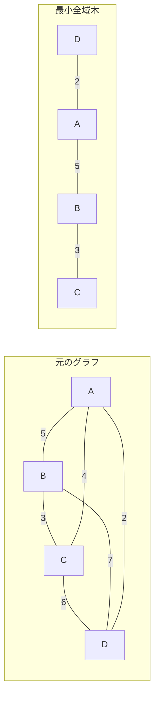
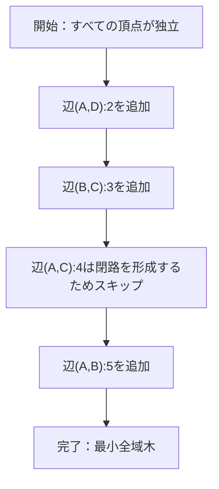
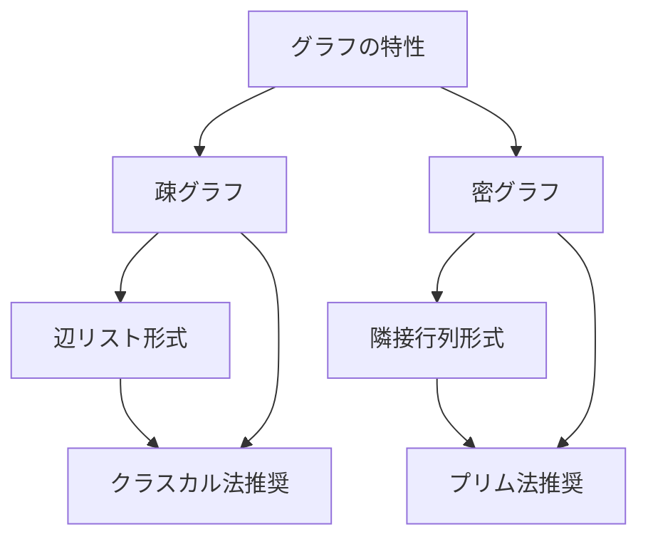
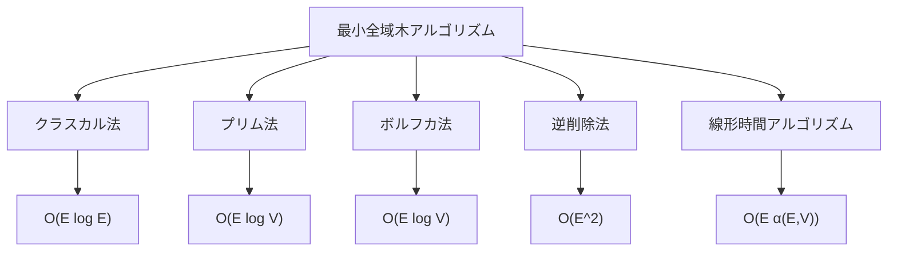

# クラスカル法

グラフ理論における最小全域木問題は、ネットワーク設計やクラスタリングなど、多くの実世界の問題に応用される重要な最適化問題である。クラスカル法は、この最小全域木を求める代表的なアルゴリズムの一つで、1956年にJoseph Kruskalによって発表された[^1]。本稿では、クラスカル法の理論的基盤から実装の詳細まで、競技プログラミングの文脈も含めて包括的に解説する。

## 最小全域木問題の定義

連結な無向重み付きグラフ$G = (V, E)$が与えられたとき、最小全域木（Minimum Spanning Tree, MST）とは、すべての頂点を含み、辺の重みの総和が最小となる木のことである。より形式的には、頂点集合$V$に対して、辺集合$T \subseteq E$が以下の条件を満たすとき、$(V, T)$を全域木と呼ぶ：

1. $(V, T)$は連結である
2. $(V, T)$は閉路を持たない
3. $|T| = |V| - 1$

そして、すべての全域木の中で$\sum_{e \in T} w(e)$を最小化するものが最小全域木である。ここで$w(e)$は辺$e$の重みを表す。

最小全域木は一般に一意ではないが、すべての辺の重みが異なる場合には一意に定まる。これは後述する正当性の証明において重要な性質となる。



## クラスカル法の基本原理

クラスカル法は貪欲アルゴリズムの典型例であり、その基本的な考え方は極めて単純である。すべての辺を重みの昇順にソートし、小さい重みの辺から順に、閉路を形成しない限り全域木に追加していく。この過程で、グラフの連結成分を管理するためにUnion-Findデータ構造を用いる。

アルゴリズムの擬似コードは以下のようになる：

```
function Kruskal(G = (V, E)):
    T = ∅  // 最小全域木の辺集合
    
    // 各頂点を独立した集合として初期化
    for each v in V:
        MakeSet(v)
    
    // 辺を重みの昇順にソート
    sort E by weight in ascending order
    
    // 各辺を順に処理
    for each edge (u, v) in E:
        if FindSet(u) ≠ FindSet(v):
            T = T ∪ {(u, v)}
            Union(u, v)
    
    return T
```

このアルゴリズムの動作を具体例で見てみよう。4頂点のグラフに対してクラスカル法を適用する過程を以下に示す：



## Union-Findデータ構造

クラスカル法の効率的な実装には、Union-Find（Disjoint Set Union, DSU）データ構造が不可欠である。Union-Findは、互いに素な集合の管理に特化したデータ構造で、以下の操作をサポートする：

1. **MakeSet(x)**: 要素$x$を含む新しい集合を作成
2. **FindSet(x)**: 要素$x$が属する集合の代表元を返す
3. **Union(x, y)**: 要素$x$と$y$が属する集合を統合

Union-Findの実装では、各集合を根付き木として表現する。最適化手法として、パス圧縮（Path Compression）とランクによる統合（Union by Rank）を用いることで、各操作をほぼ定数時間で実行できる。

```cpp
class UnionFind {
private:
    vector<int> parent;
    vector<int> rank;
    
public:
    UnionFind(int n) : parent(n), rank(n, 0) {
        for (int i = 0; i < n; i++) {
            parent[i] = i;
        }
    }
    
    int find(int x) {
        if (parent[x] != x) {
            parent[x] = find(parent[x]);  // Path compression
        }
        return parent[x];
    }
    
    bool unite(int x, int y) {
        int rootX = find(x);
        int rootY = find(y);
        
        if (rootX == rootY) return false;
        
        // Union by rank
        if (rank[rootX] < rank[rootY]) {
            parent[rootX] = rootY;
        } else if (rank[rootX] > rank[rootY]) {
            parent[rootY] = rootX;
        } else {
            parent[rootY] = rootX;
            rank[rootX]++;
        }
        return true;
    }
    
    bool same(int x, int y) {
        return find(x) == find(y);
    }
};
```

パス圧縮により、find操作の繰り返し実行時に木の高さが減少し、将来のfind操作が高速化される。ランクによる統合は、常に低い木を高い木の下に付けることで、木の高さの増加を抑制する。

## 正当性の証明

クラスカル法の正当性は、貪欲選択性質（Greedy Choice Property）と最適部分構造（Optimal Substructure）に基づいて証明できる。ここでは、カット性質（Cut Property）を用いた証明を示す。

**カット性質**: グラフ$G = (V, E)$の任意のカット$(S, V \setminus S)$に対して、このカットを横切る最小重み辺は、ある最小全域木に含まれる。

**証明**: 
カット$(S, V \setminus S)$を横切る最小重み辺を$e = (u, v)$とする（$u \in S, v \in V \setminus S$）。$e$を含まない最小全域木$T$が存在すると仮定する。

$T$において$u$から$v$への（一意な）パスを考える。このパスは必ずカットを横切る辺$e' = (x, y)$を含む（$x \in S, y \in V \setminus S$）。ここで、$T' = T \setminus \{e'\} \cup \{e\}$を考える。

$T'$は以下の性質を持つ：
1. 全域木である（$e$を追加して$e'$を削除しても連結性と木構造が保たれる）
2. $w(T') = w(T) - w(e') + w(e) \leq w(T)$（$e$は最小重み辺なので$w(e) \leq w(e')$）

$T$が最小全域木であることから$w(T') = w(T)$となり、$T'$も最小全域木である。したがって、$e$を含む最小全域木が存在する。

**クラスカル法の正当性**: 
クラスカル法は各ステップで、現在の森の異なる連結成分を結ぶ最小重み辺を選択する。これはカット性質の適用そのものであり、選択された辺は必ずある最小全域木に含まれる。アルゴリズムが終了したとき、選択された辺の集合は最小全域木を形成する。

## 計算量の解析

クラスカル法の時間計算量は、主に以下の要素から構成される：

1. **辺のソート**: $O(|E| \log |E|)$
2. **Union-Find操作**: 各辺に対してfindを2回、unionを最大1回実行。パス圧縮とランクによる統合を用いた場合、償却計算量は$O(\alpha(|V|))$。ここで$\alpha$は逆アッカーマン関数で、実用的にはほぼ定数。
3. **全体**: $O(|E| \log |E| + |E| \alpha(|V|))$

$|E| \leq |V|^2$より$\log |E| \leq 2\log |V|$であり、また$\alpha(|V|)$は実質的に定数であることから、全体の計算量は$O(|E| \log |E|)$または$O(|E| \log |V|)$と表現される。

空間計算量は、辺のリストとUnion-Findのデータ構造を保持するため$O(|E| + |V|)$となる。

## 実装の詳細と最適化

競技プログラミングにおける効率的な実装では、以下の点に注意する必要がある：

```cpp
struct Edge {
    int u, v;
    long long weight;
    bool operator<(const Edge& other) const {
        return weight < other.weight;
    }
};

long long kruskal(int n, vector<Edge>& edges) {
    sort(edges.begin(), edges.end());
    
    UnionFind uf(n);
    long long total_weight = 0;
    int edges_used = 0;
    
    for (const auto& edge : edges) {
        if (uf.unite(edge.u, edge.v)) {
            total_weight += edge.weight;
            edges_used++;
            
            // Early termination
            if (edges_used == n - 1) {
                break;
            }
        }
    }
    
    // Check if graph is connected
    if (edges_used != n - 1) {
        return -1;  // Graph is not connected
    }
    
    return total_weight;
}
```

実装上の重要な最適化として、以下が挙げられる：

1. **早期終了**: $n-1$本の辺を選択した時点でアルゴリズムを終了できる
2. **連結性チェック**: グラフが連結でない場合の処理を適切に行う
3. **整数オーバーフロー対策**: 重みの総和が大きくなる可能性がある場合は`long long`型を使用

また、辺の数が多い密グラフの場合、ソート処理がボトルネックになることがある。この場合、基数ソートやバケットソートなどの線形時間ソートアルゴリズムを検討することも有効である。

## プリム法との比較

最小全域木を求めるもう一つの代表的なアルゴリズムであるプリム法と比較すると、クラスカル法には以下の特徴がある：

**クラスカル法の利点**：
- 実装が比較的単純
- 疎グラフ（$|E| = O(|V|)$）で効率的
- 辺のリスト形式でグラフが与えられる場合に自然
- 部分的な最小全域木（最小の$k$本の辺を選ぶなど）を求めやすい

**クラスカル法の欠点**：
- 密グラフ（$|E| = O(|V|^2)$）では辺のソートがボトルネック
- 隣接行列形式のグラフには不向き
- オンラインアルゴリズムではない（すべての辺を事前に知る必要がある）



## 実践的な応用と拡張

クラスカル法は基本的な最小全域木問題だけでなく、様々な拡張問題にも応用できる。

### 最小全域森（Minimum Spanning Forest）

グラフが連結でない場合、各連結成分に対して最小全域木を求める問題。クラスカル法は自然にこの問題を解決する：

```cpp
vector<long long> minimum_spanning_forest(int n, vector<Edge>& edges) {
    sort(edges.begin(), edges.end());
    
    UnionFind uf(n);
    vector<long long> component_weights(n, 0);
    
    for (const auto& edge : edges) {
        if (uf.unite(edge.u, edge.v)) {
            int root = uf.find(edge.u);
            component_weights[root] += edge.weight;
        }
    }
    
    // Collect results for each component
    vector<long long> result;
    for (int i = 0; i < n; i++) {
        if (uf.find(i) == i) {
            result.push_back(component_weights[i]);
        }
    }
    
    return result;
}
```

### k番目に小さい全域木

最小全域木だけでなく、2番目、3番目に小さい全域木を求める問題。これは、最小全域木の辺を一つずつ他の辺と交換することで解決できる。

### 制約付き最小全域木

特定の辺を必ず含む、または含まない制約がある場合：

```cpp
long long constrained_mst(int n, vector<Edge>& edges, 
                         vector<int>& must_include,
                         vector<int>& must_exclude) {
    // Remove must_exclude edges
    vector<Edge> filtered_edges;
    set<int> exclude_set(must_exclude.begin(), must_exclude.end());
    
    for (int i = 0; i < edges.size(); i++) {
        if (exclude_set.find(i) == exclude_set.end()) {
            filtered_edges.push_back(edges[i]);
        }
    }
    
    UnionFind uf(n);
    long long total_weight = 0;
    int edges_used = 0;
    
    // First, include all must_include edges
    for (int idx : must_include) {
        const auto& edge = edges[idx];
        if (uf.unite(edge.u, edge.v)) {
            total_weight += edge.weight;
            edges_used++;
        } else {
            return -1;  // Must include edges form a cycle
        }
    }
    
    // Then apply standard Kruskal
    sort(filtered_edges.begin(), filtered_edges.end());
    
    for (const auto& edge : filtered_edges) {
        if (uf.unite(edge.u, edge.v)) {
            total_weight += edge.weight;
            edges_used++;
            
            if (edges_used == n - 1) {
                break;
            }
        }
    }
    
    return edges_used == n - 1 ? total_weight : -1;
}
```

### 最小ボトルネック全域木

パス上の最大辺重みを最小化する全域木。興味深いことに、任意の最小全域木は最小ボトルネック全域木でもある。

## 並列化とスケーラビリティ

大規模グラフに対してクラスカル法を適用する場合、並列化による高速化が重要となる。主な並列化のアプローチには以下がある：

1. **並列ソート**: 辺のソートを並列化（例：並列マージソート）
2. **並列Union-Find**: ロックフリーなUnion-Find実装
3. **フィルタリング**: 明らかに不要な辺を事前に除去

並列Union-Findの実装は複雑だが、CAS（Compare-And-Swap）操作を用いることで実現できる：

```cpp
class ParallelUnionFind {
private:
    atomic<int>* parent;
    int n;
    
public:
    ParallelUnionFind(int n) : n(n) {
        parent = new atomic<int>[n];
        for (int i = 0; i < n; i++) {
            parent[i] = i;
        }
    }
    
    int find(int x) {
        int p = parent[x];
        if (p == x) return x;
        
        int root = find(p);
        parent[x].compare_exchange_weak(p, root);  // Path compression
        return root;
    }
    
    bool unite(int x, int y) {
        while (true) {
            int rootX = find(x);
            int rootY = find(y);
            
            if (rootX == rootY) return false;
            
            if (rootX < rootY) {
                if (parent[rootY].compare_exchange_weak(rootY, rootX)) {
                    return true;
                }
            } else {
                if (parent[rootX].compare_exchange_weak(rootX, rootY)) {
                    return true;
                }
            }
        }
    }
};
```

## 理論的な発展と関連アルゴリズム

クラスカル法は、より一般的なマトロイド理論の枠組みで理解することができる。グラフのサイクルマトロイドにおいて、クラスカル法は最小重み基底を求める貪欲アルゴリズムの特殊ケースである。

また、動的な最小全域木問題（辺の追加・削除に対応）では、Link-Cut TreeやEuler Tour Treeなどの高度なデータ構造を用いた$O(\log^2 n)$のアルゴリズムが知られている[^2]。

線形時間に近い最小全域木アルゴリズムとして、Chazelle[^3]による$O(|E| \alpha(|E|, |V|))$アルゴリズムや、期待線形時間で動作するKarger-Klein-Tarjan[^4]のランダムアルゴリズムも存在する。



実践的な観点から、クラスカル法は実装の単純さと十分な性能のバランスが取れており、多くの場面で第一選択となる。特に競技プログラミングでは、バグの少ない確実な実装が可能な点で優れている。

[^1]: Kruskal, J. B. (1956). "On the shortest spanning subtree of a graph and the traveling salesman problem". Proceedings of the American Mathematical Society. 7 (1): 48–50.

[^2]: Holm, J., de Lichtenberg, K., & Thorup, M. (2001). "Poly-logarithmic deterministic fully-dynamic algorithms for connectivity, minimum spanning tree, 2-edge, and biconnectivity". Journal of the ACM. 48 (4): 723–760.

[^3]: Chazelle, B. (2000). "A minimum spanning tree algorithm with inverse-Ackermann type complexity". Journal of the ACM. 47 (6): 1028–1047.

[^4]: Karger, D. R., Klein, P. N., & Tarjan, R. E. (1995). "A randomized linear-time algorithm to find minimum spanning trees". Journal of the ACM. 42 (2): 321–328.