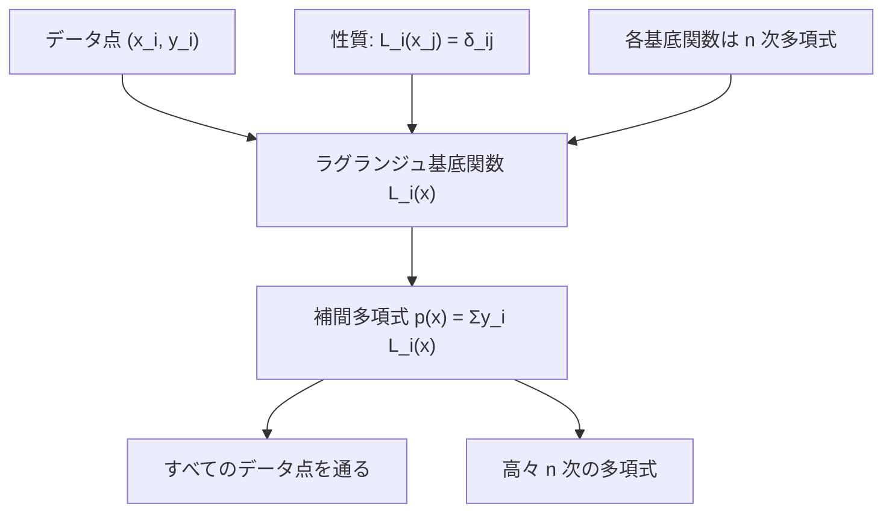
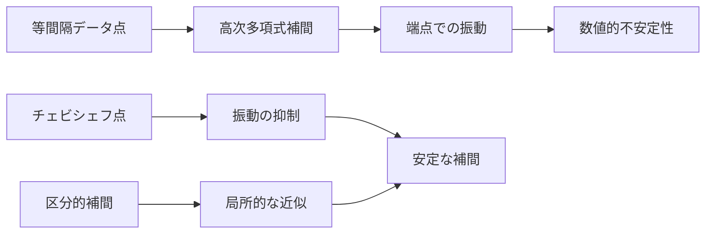
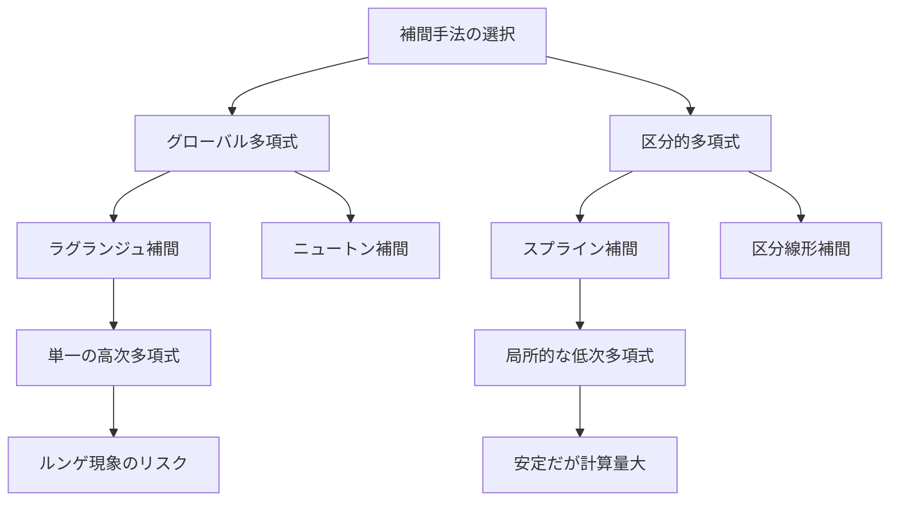

# ラグランジュ補間

ラグランジュ補間は、与えられた離散的なデータ点を通る多項式を構成する古典的な補間手法である。競技プログラミングにおいては、数列の一般項を求める問題や、多項式を扱う問題で威力を発揮する。特に、$n$次多項式の値を$n+1$点で評価した結果から元の多項式を復元する際に不可欠な技術となっている。

本稿では、ラグランジュ補間の数学的基礎から始めて、効率的な実装方法、数値的安定性の問題、そして競技プログラミングにおける具体的な応用例まで、体系的に解説する。読者が単に公式を暗記するのではなく、その背後にある数学的構造を理解し、問題に応じて適切に応用できるようになることを目指す。

## 補間問題の定式化

$n+1$個の相異なる点$(x_0, y_0), (x_1, y_1), \ldots, (x_n, y_n)$が与えられたとき、これらすべての点を通る高々$n$次の多項式$p(x)$を求める問題を考える。線形代数の観点から見ると、この問題は次のような連立方程式を解くことに帰着される：

$$
\begin{align}
p(x_0) &= y_0 \\
p(x_1) &= y_1 \\
&\vdots \\
p(x_n) &= y_n
\end{align}
$$

ここで$p(x) = a_0 + a_1x + a_2x^2 + \cdots + a_nx^n$とおくと、上記の条件は係数$a_0, a_1, \ldots, a_n$に関する線形方程式系となる。この方程式系の係数行列はヴァンデルモンド行列と呼ばれ、$x_i$が相異なる限り正則であることが知られている。したがって、条件を満たす多項式は一意に存在する。

しかし、ヴァンデルモンド行列を用いた直接的な解法は、行列の条件数が大きくなりやすく数値的に不安定である。また、計算量も$O(n^3)$となり効率的ではない。ラグランジュ補間は、この問題に対してより洗練されたアプローチを提供する。

## ラグランジュ基底関数

ラグランジュ補間の核心は、巧妙に構成された基底関数を用いることにある。$i = 0, 1, \ldots, n$に対して、ラグランジュ基底関数$L_i(x)$を次のように定義する：

$$
L_i(x) = \prod_{j=0, j \neq i}^{n} \frac{x - x_j}{x_i - x_j}
$$

この基底関数は次の重要な性質を持つ：

$$
L_i(x_j) = \begin{cases}
1 & \text{if } i = j \\
0 & \text{if } i \neq j
\end{cases}
$$

つまり、$L_i(x)$は点$x_i$で値$1$をとり、他のすべてのデータ点で値$0$をとる。この性質により、求める補間多項式は次のように表現できる：

$$
p(x) = \sum_{i=0}^{n} y_i L_i(x)
$$

実際、$p(x_j) = \sum_{i=0}^{n} y_i L_i(x_j) = y_j L_j(x_j) = y_j$となり、すべての補間条件を満たすことが確認できる。



## 計算複雑度と実装上の工夫

素朴にラグランジュ補間を実装すると、単一の点での評価に$O(n^2)$の時間がかかる。これは、各基底関数$L_i(x)$の計算に$O(n)$の時間を要し、それを$n+1$個足し合わせる必要があるためである。

しかし、競技プログラミングでは多くの場合、複数の点での評価や、特定の条件下での最適化が可能である。以下、いくつかの重要な最適化手法を紹介する。

### 分母の事前計算

基底関数の分母$\prod_{j \neq i}(x_i - x_j)$は評価点$x$に依存しないため、事前に計算しておくことができる。これにより、各評価で重複する計算を避けることができる。

```cpp
vector<double> compute_denominators(const vector<double>& x) {
    int n = x.size();
    vector<double> denom(n);
    for (int i = 0; i < n; i++) {
        denom[i] = 1.0;
        for (int j = 0; j < n; j++) {
            if (i != j) {
                denom[i] *= (x[i] - x[j]);
            }
        }
    }
    return denom;
}
```

### 等間隔データ点での最適化

データ点が等間隔に配置されている場合、つまり$x_i = a + ih$（$h$は間隔）の形をしているとき、計算を大幅に簡略化できる。変数変換$t = (x - a) / h$を行うと、基底関数は次のように書ける：

$$
L_i(x) = \frac{\prod_{j=0, j \neq i}^{n} (t - j)}{\prod_{j=0, j \neq i}^{n} (i - j)}
$$

分母は階乗を用いて効率的に計算でき、分子も動的計画法的なアプローチで最適化可能である。

### バリセントリック形式

数値的安定性と計算効率の両方を改善する重要な手法として、バリセントリック形式がある。重み$w_i = 1 / \prod_{j \neq i}(x_i - x_j)$を事前計算すると、補間多項式は次のように表現できる：

$$
p(x) = \frac{\sum_{i=0}^{n} \frac{w_i}{x - x_i} y_i}{\sum_{i=0}^{n} \frac{w_i}{x - x_i}}
$$

この形式の利点は、新しいデータ点を追加する際に既存の重みを更新するだけで済むことと、数値的により安定していることである。

## 数値的安定性の問題

ラグランジュ補間は理論的には美しい手法であるが、実際の数値計算では注意すべき点がいくつかある。最も重要なのは、データ点の数が増えるにつれて数値的不安定性が顕著になることである。

### ルンゲ現象

等間隔のデータ点を用いて高次の多項式補間を行うと、区間の端点付近で振動が激しくなる現象が知られている。これはルンゲ現象と呼ばれ、関数$f(x) = 1/(1 + 25x^2)$を区間$[-1, 1]$で等間隔に補間する例がよく知られている。



この問題を緩和する方法として、チェビシェフ点と呼ばれる非等間隔の点を使用する方法がある。チェビシェフ点は次のように定義される：

$$
x_i = \cos\left(\frac{(2i + 1)\pi}{2(n + 1)}\right), \quad i = 0, 1, \ldots, n
$$

これらの点は区間の端点付近に密に配置され、中央付近では疎になっている。この配置により、補間誤差をより均等に分散させることができる。

### 条件数の問題

ラグランジュ基底関数の計算では、$(x - x_j)$や$(x_i - x_j)$といった差を計算する。データ点が近接している場合、これらの差が非常に小さくなり、除算による桁落ちが発生しやすい。特に、浮動小数点演算では深刻な精度低下を引き起こす可能性がある。

競技プログラミングにおいては、可能な限り整数演算で処理し、有理数として結果を保持することで、この問題を回避できることが多い。また、モジュラー演算を用いる場合は、除算を逆元の乗算に置き換えることで安定性を保つことができる。

## 競技プログラミングにおける応用

ラグランジュ補間は、一見すると純粋に数値計算の技術のように思えるが、競技プログラミングでは様々な問題で活用される。以下、代表的な応用例を詳しく見ていく。

### 数列の一般項の推定

問題：数列の最初の$k$項が与えられたとき、この数列が$k-1$次以下の多項式で表されることがわかっている。$n$番目の項を求めよ。

このタイプの問題は、まさにラグランジュ補間の直接的な応用である。$(1, a_1), (2, a_2), \ldots, (k, a_k)$を補間することで、一般項を表す多項式$p(x)$を構成し、$p(n)$を計算すればよい。

実装例（モジュラー演算版）：

```cpp
const int MOD = 1e9 + 7;

long long mod_pow(long long base, long long exp, long long mod) {
    long long result = 1;
    while (exp > 0) {
        if (exp % 2 == 1) result = (result * base) % mod;
        base = (base * base) % mod;
        exp /= 2;
    }
    return result;
}

long long mod_inverse(long long a, long long mod) {
    return mod_pow(a, mod - 2, mod);
}

long long lagrange_interpolation(vector<pair<long long, long long>>& points, long long x) {
    int n = points.size();
    long long result = 0;
    
    for (int i = 0; i < n; i++) {
        long long term = points[i].second;
        long long num = 1, den = 1;
        
        for (int j = 0; j < n; j++) {
            if (i != j) {
                num = (num * (x - points[j].first + MOD)) % MOD;
                den = (den * (points[i].first - points[j].first + MOD)) % MOD;
            }
        }
        
        term = (term * num) % MOD;
        term = (term * mod_inverse(den, MOD)) % MOD;
        result = (result + term) % MOD;
    }
    
    return result;
}
```

### 多項式の評価と変換

複数の点での多項式の値が与えられたとき、別の点での値を求める問題は、ラグランジュ補間の典型的な応用である。さらに進んで、多項式の係数表現と点値表現の相互変換も、ラグランジュ補間（およびその逆操作）として理解できる。

特に重要なのは、FFT（高速フーリエ変換）との関連である。FFTは本質的に、特殊な点（単位根）での多項式評価と補間を高速に行うアルゴリズムと見なすことができる。ラグランジュ補間の理解は、FFTの理論的背景を理解する上でも重要である。

### 組み合わせ問題への応用

意外に思えるかもしれないが、ラグランジュ補間は組み合わせ問題でも活用される。例えば、次のような問題を考える：

問題：$n$個の区別できるボールを$k$個の区別できる箱に入れる方法の数を$f(n, k)$とする。ただし、各箱には少なくとも1個のボールが入るものとする。$f(n, k)$を効率的に計算せよ。

この問題の答えは、包除原理により次のように表される：

$$
f(n, k) = \sum_{i=0}^{k} (-1)^i \binom{k}{i} (k-i)^n
$$

ここで重要な観察は、$k$を固定したとき、$f(n, k)$は$n$に関する$k$次多項式になることである。したがって、$f(0, k), f(1, k), \ldots, f(k, k)$を計算できれば、ラグランジュ補間により任意の$n$に対する値を求めることができる。

### 行列式の計算

ヴァンデルモンド行列の行列式は、ラグランジュ補間と密接な関係がある。$n \times n$のヴァンデルモンド行列$V$の行列式は次のように表される：

$$
\det(V) = \prod_{0 \leq i < j \leq n-1} (x_j - x_i)
$$

この公式は、ラグランジュ補間の一意性の証明でも重要な役割を果たす。競技プログラミングでは、特殊な形の行列式を計算する際に、ヴァンデルモンド行列への帰着を考えることがある。

## 実装における詳細な考察

競技プログラミングにおいてラグランジュ補間を実装する際は、問題の制約に応じて適切な最適化を選択することが重要である。以下、実践的な実装のガイドラインを示す。

### メモリ効率を考慮した実装

大規模なデータを扱う場合、すべての基底関数を保持するのではなく、オンザフライで計算することでメモリ使用量を削減できる。特に、評価点が少ない場合はこのアプローチが有効である。

```cpp
template<typename T>
T lagrange_eval(const vector<T>& x, const vector<T>& y, T t) {
    int n = x.size();
    T result = 0;
    
    for (int i = 0; i < n; i++) {
        T basis = y[i];
        for (int j = 0; j < n; j++) {
            if (i != j) {
                basis *= (t - x[j]) / (x[i] - x[j]);
            }
        }
        result += basis;
    }
    
    return result;
}
```

### 精度保証付き実装

浮動小数点演算を使用する場合、誤差の蓄積を考慮した実装が必要である。カハンの加算アルゴリズムなどを用いて、加算時の誤差を最小限に抑えることができる。

```cpp
double lagrange_eval_kahan(const vector<double>& x, const vector<double>& y, double t) {
    int n = x.size();
    double sum = 0.0;
    double c = 0.0;  // compensation for lost low-order bits
    
    for (int i = 0; i < n; i++) {
        double basis = y[i];
        for (int j = 0; j < n; j++) {
            if (i != j) {
                basis *= (t - x[j]) / (x[i] - x[j]);
            }
        }
        
        double y_temp = basis - c;
        double t_temp = sum + y_temp;
        c = (t_temp - sum) - y_temp;
        sum = t_temp;
    }
    
    return sum;
}
```

### 並列化可能な実装

各基底関数の計算は独立しているため、並列化による高速化が可能である。特に、多数の評価点で補間を行う場合は、並列化の効果が大きい。

```cpp
#include <execution>
#include <numeric>

template<typename T>
T lagrange_eval_parallel(const vector<T>& x, const vector<T>& y, T t) {
    int n = x.size();
    vector<T> terms(n);
    
    transform(execution::par_unseq, 
              counting_iterator<int>(0), 
              counting_iterator<int>(n),
              terms.begin(),
              [&](int i) {
                  T basis = y[i];
                  for (int j = 0; j < n; j++) {
                      if (i != j) {
                          basis *= (t - x[j]) / (x[i] - x[j]);
                      }
                  }
                  return basis;
              });
    
    return reduce(execution::par_unseq, terms.begin(), terms.end());
}
```

## 他の補間手法との比較

ラグランジュ補間は多くの利点を持つが、すべての状況で最適というわけではない。他の補間手法と比較することで、その特徴をより明確に理解できる。

### ニュートン補間との比較

ニュートン補間は、差分商を用いた別の多項式補間手法である。ラグランジュ補間と比較した場合の主な違いは次の通りである：

ニュートン補間の利点：
- 新しいデータ点を追加する際、既存の計算結果を再利用できる
- 補間多項式の次数を段階的に上げることができる
- 差分商の計算により、微分の近似も同時に得られる

ラグランジュ補間の利点：
- 実装がより直感的で理解しやすい
- 各基底関数が独立しているため、並列化しやすい
- 特定の点での評価に特化した場合、より効率的

競技プログラミングでは、問題の性質に応じて適切な手法を選択することが重要である。データ点が動的に追加される場合はニュートン補間が有利だが、固定されたデータ点で多くの評価を行う場合はラグランジュ補間が適している。

### スプライン補間との比較

スプライン補間は、区分的な多項式を用いて滑らかな補間を実現する手法である。特に3次スプラインは、2階微分まで連続な補間を提供する。



競技プログラミングの文脈では、スプライン補間は実装の複雑さから敬遠されることが多い。しかし、大量のデータ点を扱い、かつ滑らかな補間が必要な場合は、検討の価値がある。

## 高度な応用と発展的話題

ラグランジュ補間の理論は、より高度な数学的概念とも深く結びついている。これらの関連を理解することで、問題解決の幅が広がる。

### 有限体上での補間

競技プログラミングでは、しばしば有限体（特に$\mathbb{Z}_p$、$p$は素数）上で計算を行う。ラグランジュ補間は有限体上でも同様に機能し、秘密分散スキームなどの暗号学的応用にもつながる。

シャミアの秘密分散は、ラグランジュ補間の直接的な応用である。秘密$s$を$n$人で分散する際、$f(0) = s$となる$k-1$次多項式$f(x)$をランダムに選び、各参加者に$(i, f(i))$を配布する。任意の$k$人が集まれば、ラグランジュ補間により$f(0) = s$を復元できる。

### 多変数補間への拡張

ラグランジュ補間は多変数の場合にも拡張できる。2変数の場合、データ点$(x_i, y_j, z_{ij})$に対して、次の形の補間多項式を構成する：

$$
p(x, y) = \sum_{i=0}^{m} \sum_{j=0}^{n} z_{ij} L_i^{(x)}(x) L_j^{(y)}(y)
$$

ここで、$L_i^{(x)}(x)$と$L_j^{(y)}(y)$はそれぞれ$x$方向と$y$方向のラグランジュ基底関数である。

### 有理関数補間

多項式補間の自然な拡張として、有理関数（多項式の比）による補間がある。パデ近似と呼ばれるこの手法は、特に関数の特異点付近での近似に優れている。

有理関数補間は、与えられたデータ点を通る有理関数$r(x) = p(x)/q(x)$を求める問題である。ここで、$p(x)$は$m$次多項式、$q(x)$は$n$次多項式である。この問題は非線形であり、ラグランジュ補間よりも複雑だが、より柔軟な近似が可能である。

## 実装例：完全なラグランジュ補間ライブラリ

最後に、競技プログラミングで使用できる、包括的なラグランジュ補間ライブラリの実装例を示す。このライブラリは、整数演算、モジュラー演算、浮動小数点演算のすべてに対応している。

```cpp
template<typename T>
class LagrangeInterpolation {
private:
    vector<T> x_values;
    vector<T> y_values;
    vector<T> denominators;
    bool use_barycentric;
    
    void compute_denominators() {
        int n = x_values.size();
        denominators.resize(n);
        for (int i = 0; i < n; i++) {
            denominators[i] = T(1);
            for (int j = 0; j < n; j++) {
                if (i != j) {
                    denominators[i] *= (x_values[i] - x_values[j]);
                }
            }
        }
    }
    
public:
    LagrangeInterpolation(const vector<T>& x, const vector<T>& y, bool barycentric = false) 
        : x_values(x), y_values(y), use_barycentric(barycentric) {
        if (x.size() != y.size()) {
            throw invalid_argument("x and y must have the same size");
        }
        if (use_barycentric) {
            compute_denominators();
        }
    }
    
    T evaluate(T t) const {
        int n = x_values.size();
        
        // Check if t is one of the data points
        for (int i = 0; i < n; i++) {
            if (t == x_values[i]) {
                return y_values[i];
            }
        }
        
        if (use_barycentric) {
            T numerator = T(0);
            T denominator = T(0);
            
            for (int i = 0; i < n; i++) {
                T weight = T(1) / (denominators[i] * (t - x_values[i]));
                numerator += weight * y_values[i];
                denominator += weight;
            }
            
            return numerator / denominator;
        } else {
            T result = T(0);
            
            for (int i = 0; i < n; i++) {
                T basis = y_values[i];
                for (int j = 0; j < n; j++) {
                    if (i != j) {
                        basis *= (t - x_values[j]) / (x_values[i] - x_values[j]);
                    }
                }
                result += basis;
            }
            
            return result;
        }
    }
    
    // Add a new data point (only works efficiently with barycentric form)
    void add_point(T x, T y) {
        if (!use_barycentric) {
            throw runtime_error("Adding points requires barycentric form");
        }
        
        // Update existing denominators
        for (int i = 0; i < x_values.size(); i++) {
            denominators[i] *= (x_values[i] - x);
        }
        
        // Compute denominator for new point
        T new_denom = T(1);
        for (int i = 0; i < x_values.size(); i++) {
            new_denom *= (x - x_values[i]);
        }
        
        x_values.push_back(x);
        y_values.push_back(y);
        denominators.push_back(new_denom);
    }
};
```

この実装は、基本的なラグランジュ補間とバリセントリック形式の両方をサポートし、動的なデータ点の追加も可能である。テンプレート化により、様々な数値型に対応できる柔軟性も持っている。

ラグランジュ補間は、その数学的な優美さと実用性を兼ね備えた、競技プログラミングにおける重要な技術である。本稿で解説した理論的背景と実装技術を理解することで、多項式に関連する様々な問題に対して、効果的なアプローチが可能となる。特に、数列の一般項推定、多項式の評価、組み合わせ問題への応用など、一見関連のない問題がラグランジュ補間という共通の枠組みで解決できることは、アルゴリズムの奥深さを示している。

実装においては、問題の制約と要求される精度に応じて、適切な最適化手法を選択することが重要である。整数演算が可能な場合はそれを優先し、浮動小数点演算が必要な場合は数値的安定性に十分注意を払う必要がある。また、データ点の特性（等間隔、動的追加など）に応じて、最適な実装方式を選択することで、効率的な解法を構築できる。

ラグランジュ補間の理解は、より高度な数値計算手法への入り口でもある。FFTとの関連、有限体上での応用、多変数への拡張など、発展的な話題も多く、継続的な学習により、より複雑な問題への対応力を養うことができる。競技プログラミングにおいて、ラグランジュ補間は単なるツールではなく、数学的思考とアルゴリズム設計を結ぶ重要な架け橋なのである。