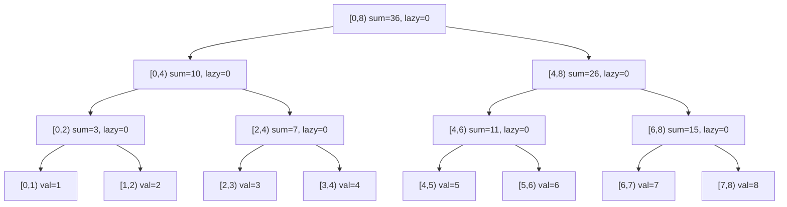
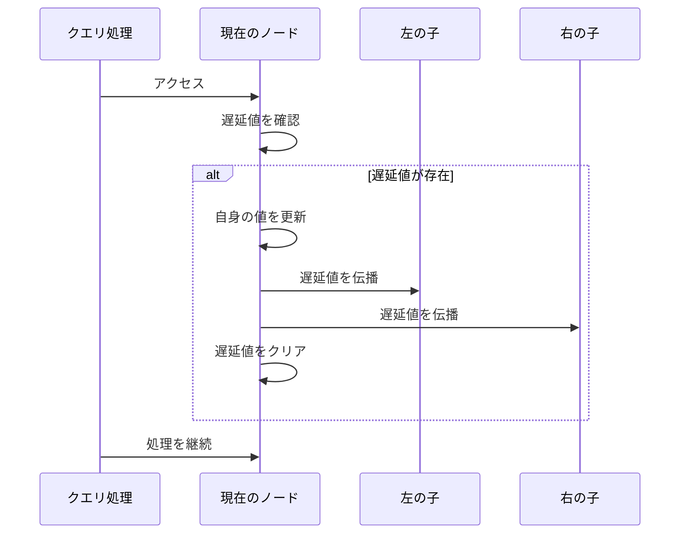
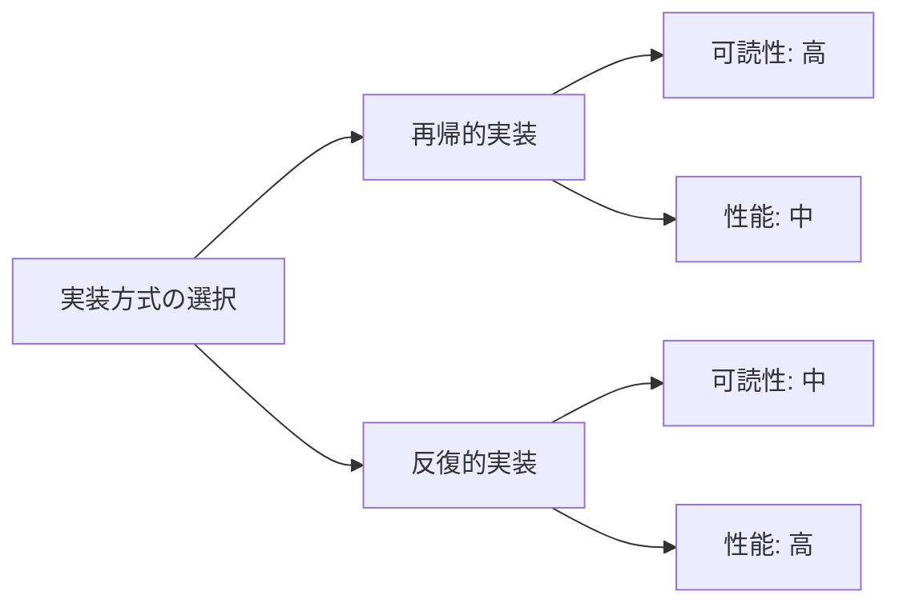

# 遅延セグメント木

遅延セグメント木（Lazy Segment Tree）は、区間更新と区間クエリを効率的に処理するデータ構造である。通常のセグメント木が一点更新・区間クエリを $O(\log n)$ で処理するのに対し、遅延セグメント木は区間更新も $O(\log n)$ で実現する。この効率性は、更新操作を必要になるまで遅延させる「遅延評価」という手法によって達成される。

競技プログラミングや実務において、大規模なデータに対する区間操作は頻繁に現れる。例えば、数列の連続する要素に対して一律に値を加算したり、区間内の全要素を特定の値で置き換えたりする操作である。素朴な実装では区間内の各要素を個別に更新するため $O(n)$ の計算量となるが、遅延セグメント木を用いることで、これを対数時間に削減できる。

## 基本構造と動作原理

遅延セグメント木は、通常のセグメント木に「遅延配列」を追加した構造を持つ。セグメント木の各ノードは対応する区間の集約値（和、最大値、最小値など）を保持し、遅延配列は各ノードに対して「まだ子ノードに伝播していない更新情報」を格納する。



この構造において、区間更新を行う際の重要な洞察は、更新対象の区間を完全に包含するノードで更新を停止し、その情報を遅延配列に記録することである。例えば、区間 $[2, 6)$ に値 $v$ を加算する場合、この区間を完全に包含する最小のノード群（上図では $[2, 4)$ と $[4, 6)$）まで下降し、そこで更新を停止する。これにより、更新の計算量を $O(\log n)$ に抑えることができる。

遅延評価の本質は、必要になるまで計算を先送りすることで効率を向上させる点にある。区間更新の情報は遅延配列に記録され、その区間に対するクエリや、その区間をまたぐ更新が発生した時点で初めて子ノードに伝播される。この戦略により、連続する複数の更新操作を効率的に処理できる。

## 遅延伝播のメカニズム

遅延伝播（lazy propagation）は、遅延セグメント木の中核となる仕組みである。あるノードに遅延値が設定されている場合、そのノードまたはその子孫にアクセスする際に、遅延値を子ノードに「押し下げる」必要がある。



遅延伝播の具体的な処理は、更新の種類によって異なる。区間加算の場合、親ノードの遅延値を子ノードの遅延値に加算し、子ノードの集約値も適切に更新する。区間代入の場合は、子ノードの遅延値を上書きする。この際、複数の更新操作が組み合わさる場合の処理順序や合成規則を正確に定義することが重要である。

例えば、区間加算を考える。ノード $v$ が区間 $[l, r)$ を管理し、遅延値 $lazy[v] = x$ を持つとする。このとき、実際の区間内の各要素には $x$ が加算されているべきだが、まだ反映されていない。ノード $v$ の集約値が区間和の場合、実際の和は $sum[v] + x \times (r - l)$ となる。遅延伝播時には、この計算を行ってから子ノードに遅延値を渡す。

## 実装の詳細

遅延セグメント木の実装において、抽象化のレベルは重要な設計上の決定事項である。汎用的な実装では、モノイドの概念を用いて様々な演算に対応できるようにする。区間に対する演算を表すモノイド $M$ と、更新操作を表す作用素モノイド $F$ を定義し、$F$ の $M$ への作用を定義することで、統一的なインターフェースを提供できる。

区間加算・区間和クエリの場合、$M$ は加法に関するモノイド、$F$ も加法に関するモノイドとなる。作用は $f(x) = x + f$ で定義される。一方、区間更新・区間最小値クエリの場合、$M$ は最小値演算に関するモノイド、$F$ は更新値を保持する構造となり、作用は値の置き換えとなる。

実装上の重要な考慮事項として、メモリレイアウトとキャッシュ効率性がある。セグメント木は完全二分木として実装されることが多く、配列による表現では親ノードのインデックスを $i$ とすると、左の子は $2i$、右の子は $2i+1$ となる。この表現により、ポインタを使わずに木構造を表現でき、メモリアクセスの局所性も向上する。

```cpp
template<typename Monoid, typename Action>
class LazySegmentTree {
private:
    int n;
    vector<Monoid> data;
    vector<Action> lazy;
    
    void eval(int k, int l, int r) {
        if (lazy[k] == Action::identity()) return;
        data[k] = apply(lazy[k], data[k], r - l);
        if (r - l > 1) {
            lazy[2*k] = compose(lazy[k], lazy[2*k]);
            lazy[2*k+1] = compose(lazy[k], lazy[2*k+1]);
        }
        lazy[k] = Action::identity();
    }
    
    void update(int a, int b, Action x, int k, int l, int r) {
        eval(k, l, r);
        if (b <= l || r <= a) return;
        if (a <= l && r <= b) {
            lazy[k] = compose(x, lazy[k]);
            eval(k, l, r);
            return;
        }
        int mid = (l + r) / 2;
        update(a, b, x, 2*k, l, mid);
        update(a, b, x, 2*k+1, mid, r);
        data[k] = Monoid::op(data[2*k], data[2*k+1]);
    }
};
```

実装の際に注意すべき点として、遅延値の初期化がある。遅延値は「何もしない」状態を表す単位元で初期化する必要がある。区間加算の場合は0、区間代入の場合は「代入なし」を表す特殊な値（例えばINFやnullopt）を用いる。また、遅延値の合成順序も重要で、新しい操作を古い操作に適用する際の規則を正確に実装する必要がある。

## 計算量の解析

遅延セグメント木の計算量を厳密に解析することで、その効率性の根拠を理解できる。$n$ 要素の配列に対する遅延セグメント木において、木の高さは $\lceil \log_2 n \rceil$ となる。

区間更新操作の計算量を考える。更新区間 $[l, r)$ に対して、この区間を完全に包含する極大なノードの集合を求める必要がある。セグメント木の性質により、各深さにおいて高々2個のノードが選ばれる。なぜなら、3個以上のノードが同じ深さで選ばれる場合、それらのうち隣接する2個は共通の親を持ち、その親が代わりに選ばれるはずだからである。したがって、更新操作でアクセスするノード数は $O(\log n)$ となる。

区間クエリの計算量も同様に $O(\log n)$ である。クエリ処理では、対象区間を分割統治的に処理し、各深さで高々2個のノードの値を集約する。遅延伝播のオーバーヘッドはあるが、各ノードで高々1回の伝播処理を行うため、全体の計算量は変わらない。

空間計算量については、通常のセグメント木が $O(n)$ の空間を使用するのに対し、遅延セグメント木は遅延配列の分だけ追加で $O(n)$ の空間を必要とする。したがって、全体で $O(n)$ の空間計算量となる。

## 応用的な操作と拡張

遅延セグメント木は、基本的な区間更新・区間クエリ以外にも様々な操作を効率的に処理できる。区間への等差数列の加算、区間の反転、区間のシフトなど、より複雑な操作も適切な作用素を定義することで実現可能である。

例えば、区間 $[l, r)$ に対して $a, a+d, a+2d, \ldots$ という等差数列を加算する操作を考える。この場合、遅延値として $(a, d)$ のペアを保持し、伝播時に適切に計算する。ノード $v$ が区間 $[s, t)$ を管理している場合、実際に加算される値の和は以下の式で計算できる：

$$\sum_{i=0}^{t-s-1} (a + (l-s+i) \cdot d) = (t-s) \cdot a + d \cdot \frac{(t-s-1)(t-s)}{2} + d \cdot (l-s)(t-s)$$

永続化も重要な拡張である。永続遅延セグメント木では、更新操作の際に変更が必要なノードのみをコピーし、新しいバージョンの木を作成する。これにより、過去の任意の時点の状態に対するクエリが可能となる。ただし、遅延伝播の扱いが複雑になるため、実装には注意が必要である。

動的セグメント木との組み合わせも実用的である。必要なノードのみを動的に生成することで、非常に大きな区間（例えば $[0, 10^9)$）を扱うことができる。この場合、アクセスされたノードとその祖先のみがメモリ上に存在し、空間効率が大幅に向上する。

## 実装上の最適化とトレードオフ

実装の最適化において、定数倍の改善は実用上重要である。遅延伝播の判定を効率化するため、遅延値が単位元かどうかを高速に判定できるようにすることが望ましい。例えば、区間加算では遅延値が0かどうかの判定のみで済む。

また、再帰的な実装と反復的な実装のトレードオフも存在する。再帰的な実装は理解しやすく、コードも簡潔になるが、関数呼び出しのオーバーヘッドがある。一方、反復的な実装は高速だが、特に区間クエリの実装が複雑になる傾向がある。



メモリアクセスパターンの最適化も重要である。セグメント木の走査は基本的に深さ優先探索であり、メモリアクセスが飛び飛びになりやすい。これを改善するため、ノードの配置を工夫したり、複数のクエリをバッチ処理したりする手法が研究されている。

並列化の観点では、遅延セグメント木は本質的に逐次的なデータ構造である。遅延伝播が必要なため、単純な並列化は困難である。ただし、互いに素な区間に対する操作は独立に処理できるため、適切なロック機構を用いることで、限定的な並列化は可能である。

## 具体的な問題への適用

遅延セグメント木が効果的に適用できる問題のパターンを理解することは重要である。典型的なパターンとして、「区間更新・区間クエリ」型の問題がある。これには、区間加算・区間和、区間更新・区間最小値、区間XOR・区間XORなどが含まれる。

より複雑な例として、「区間に対する線形変換」を考える。各要素 $x$ を $ax + b$ に変換する操作である。この場合、遅延値として $(a, b)$ のペアを保持し、複数の変換の合成は $(a_1, b_1) \circ (a_2, b_2) = (a_1 \cdot a_2, a_1 \cdot b_2 + b_1)$ で計算できる。

```cpp
struct LinearTransform {
    long long a, b;
    static LinearTransform identity() { return {1, 0}; }
    LinearTransform compose(LinearTransform g) {
        return {a * g.a, a * g.b + b};
    }
};
```

遅延セグメント木は、他のデータ構造と組み合わせることでさらに強力になる。例えば、Heavy-Light Decompositionと組み合わせることで、木構造上のパスクエリを効率的に処理できる。また、2次元セグメント木の内部で遅延セグメント木を使用することで、矩形領域に対する更新・クエリを処理できる。

実装の正確性を保証するためには、包括的なテストが不可欠である。境界条件、特に区間の端点での動作を慎重にテストする必要がある。また、ランダムテストによって、素朴な実装との結果を比較することも有効である。

遅延セグメント木は、理論的な美しさと実用性を兼ね備えたデータ構造である。その核心は、計算の遅延という単純なアイデアを、木構造と組み合わせることで、効率的な区間操作を実現した点にある。適切に実装された遅延セグメント木は、多くの実用的な問題に対して、簡潔かつ効率的な解法を提供する。