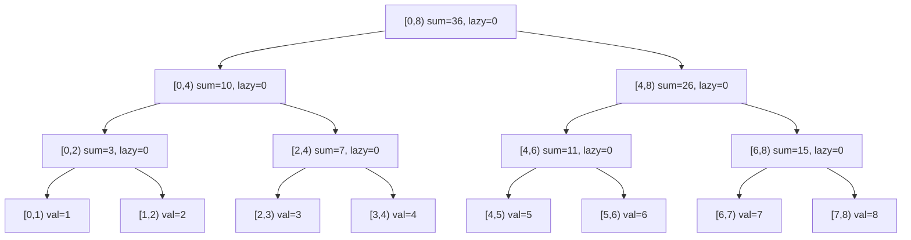
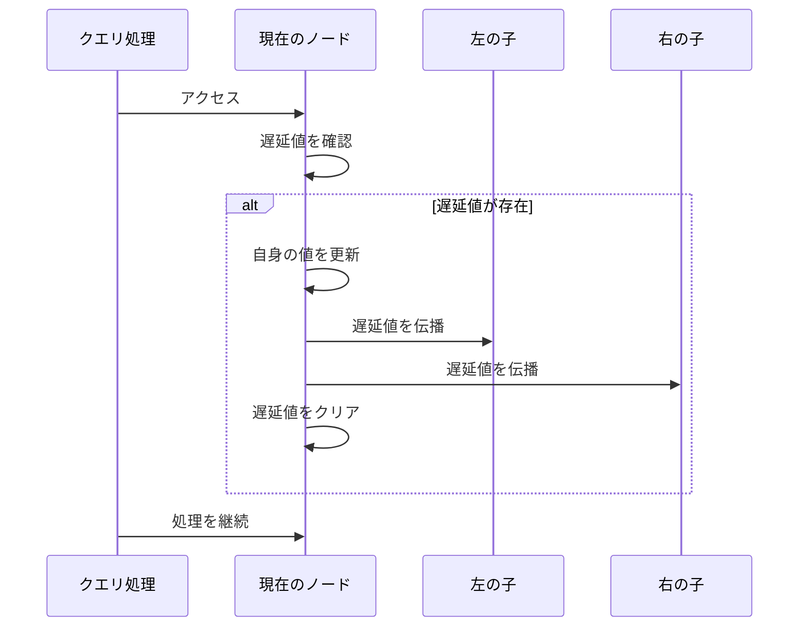
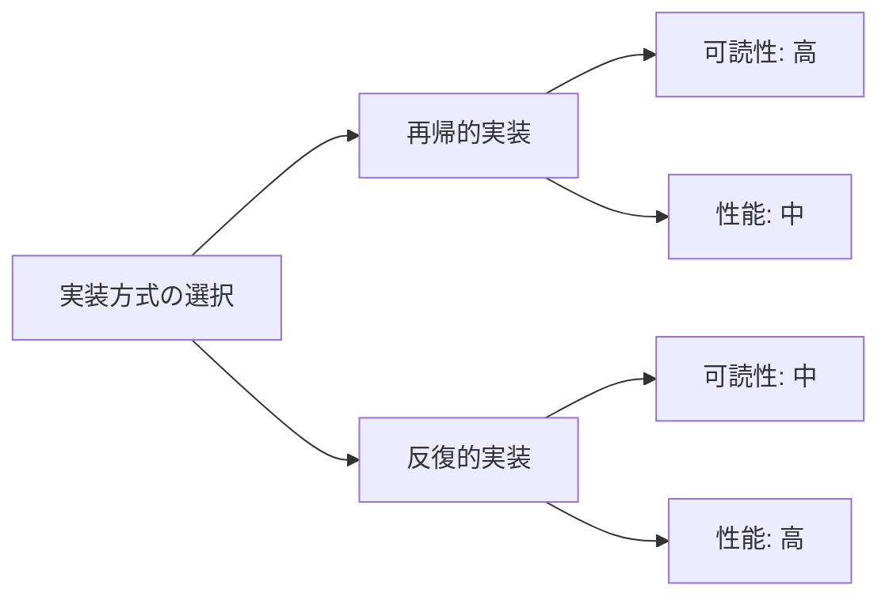
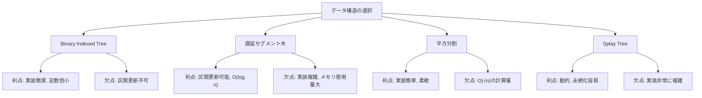

# 遅延セグメント木

遅延セグメント木（Lazy Segment Tree）は、区間更新と区間クエリを効率的に処理するデータ構造である。通常のセグメント木が一点更新・区間クエリを $O(\log n)$ で処理するのに対し、遅延セグメント木は区間更新も $O(\log n)$ で実現する。この効率性は、更新操作を必要になるまで遅延させる「遅延評価」という手法によって達成される。

競技プログラミングや実務において、大規模なデータに対する区間操作は頻繁に現れる。例えば、数列の連続する要素に対して一律に値を加算したり、区間内の全要素を特定の値で置き換えたりする操作である。素朴な実装では区間内の各要素を個別に更新するため $O(n)$ の計算量となるが、遅延セグメント木を用いることで、これを対数時間に削減できる。

## 基本構造と動作原理

遅延セグメント木は、通常のセグメント木に「遅延配列」を追加した構造を持つ。セグメント木の各ノードは対応する区間の集約値（和、最大値、最小値など）を保持し、遅延配列は各ノードに対して「まだ子ノードに伝播していない更新情報」を格納する。



この構造において、区間更新を行う際の重要な洞察は、更新対象の区間を完全に包含するノードで更新を停止し、その情報を遅延配列に記録することである。例えば、区間 $[2, 6)$ に値 $v$ を加算する場合、この区間を完全に包含する最小のノード群（上図では $[2, 4)$ と $[4, 6)$）まで下降し、そこで更新を停止する。これにより、更新の計算量を $O(\log n)$ に抑えることができる。

遅延評価の本質は、必要になるまで計算を先送りすることで効率を向上させる点にある。区間更新の情報は遅延配列に記録され、その区間に対するクエリや、その区間をまたぐ更新が発生した時点で初めて子ノードに伝播される。この戦略により、連続する複数の更新操作を効率的に処理できる。

## 遅延伝播のメカニズム

遅延伝播（lazy propagation）は、遅延セグメント木の中核となる仕組みである。あるノードに遅延値が設定されている場合、そのノードまたはその子孫にアクセスする際に、遅延値を子ノードに「押し下げる」必要がある。



遅延伝播の具体的な処理は、更新の種類によって異なる。区間加算の場合、親ノードの遅延値を子ノードの遅延値に加算し、子ノードの集約値も適切に更新する。区間代入の場合は、子ノードの遅延値を上書きする。この際、複数の更新操作が組み合わさる場合の処理順序や合成規則を正確に定義することが重要である。

例えば、区間加算を考える。ノード $v$ が区間 $[l, r)$ を管理し、遅延値 $lazy[v] = x$ を持つとする。このとき、実際の区間内の各要素には $x$ が加算されているべきだが、まだ反映されていない。ノード $v$ の集約値が区間和の場合、実際の和は $sum[v] + x \times (r - l)$ となる。遅延伝播時には、この計算を行ってから子ノードに遅延値を渡す。

遅延伝播の実装において、特に注意すべきは「遅延値の合成」である。複数の更新が重なった場合、それらを正しく合成する必要がある。例えば、先に区間に5を加算し、その後3を加算する場合、最終的な遅延値は8となる。しかし、区間代入と区間加算が混在する場合は、操作の順序が重要になる。一般的には、より新しい操作が古い操作を上書きするか、特定の規則に従って合成される。

## 実装の詳細

遅延セグメント木の実装において、抽象化のレベルは重要な設計上の決定事項である。汎用的な実装では、モノイドの概念を用いて様々な演算に対応できるようにする。区間に対する演算を表すモノイド $M$ と、更新操作を表す作用素モノイド $F$ を定義し、$F$ の $M$ への作用を定義することで、統一的なインターフェースを提供できる。

区間加算・区間和クエリの場合、$M$ は加法に関するモノイド、$F$ も加法に関するモノイドとなる。作用は $f(x) = x + f$ で定義される。一方、区間更新・区間最小値クエリの場合、$M$ は最小値演算に関するモノイド、$F$ は更新値を保持する構造となり、作用は値の置き換えとなる。

実装上の重要な考慮事項として、メモリレイアウトとキャッシュ効率性がある。セグメント木は完全二分木として実装されることが多く、配列による表現では親ノードのインデックスを $i$ とすると、左の子は $2i$、右の子は $2i+1$ となる。この表現により、ポインタを使わずに木構造を表現でき、メモリアクセスの局所性も向上する。

完全な実装例を以下に示す。この実装は区間加算・区間和クエリに対応している：

```cpp
template<typename T>
class LazySegmentTree {
private:
    int n, height;
    vector<T> data, lazy;
    
    // k番目のノードについて遅延評価を行う
    void eval(int k) {
        if (lazy[k] == 0) return;  // 更新するものが無ければ終了
        if (k < n) {  // 葉でなければ子に伝播
            lazy[k * 2] += lazy[k];
            lazy[k * 2 + 1] += lazy[k];
        }
        // 自身を更新
        data[k] += lazy[k];
        lazy[k] = 0;
    }
    
    // [a, b)にxを加算（k番目のノード、対応する区間は[l, r)）
    void update(int a, int b, T x, int k, int l, int r) {
        eval(k);
        if (a <= l && r <= b) {  // 完全に内側の場合
            lazy[k] += x;
            eval(k);
        } else if (a < r && l < b) {  // 一部区間が被る場合
            update(a, b, x, k * 2, l, (l + r) / 2);
            update(a, b, x, k * 2 + 1, (l + r) / 2, r);
            data[k] = data[k * 2] + data[k * 2 + 1];
        }
    }
    
    // [a, b)の和を求める
    T query(int a, int b, int k, int l, int r) {
        if (r <= a || b <= l) return 0;  // 完全に外側の場合
        eval(k);
        if (a <= l && r <= b) return data[k];  // 完全に内側の場合
        T vl = query(a, b, k * 2, l, (l + r) / 2);
        T vr = query(a, b, k * 2 + 1, (l + r) / 2, r);
        return vl + vr;
    }
    
public:
    LazySegmentTree(int n_) : n(1), height(0) {
        while (n < n_) n <<= 1, height++;
        data.assign(2 * n, 0);
        lazy.assign(2 * n, 0);
    }
    
    void update(int a, int b, T x) {
        update(a, b, x, 1, 0, n);
    }
    
    T query(int a, int b) {
        return query(a, b, 1, 0, n);
    }
};
```

実装の際に注意すべき点として、遅延値の初期化がある。遅延値は「何もしない」状態を表す単位元で初期化する必要がある。区間加算の場合は0、区間代入の場合は「代入なし」を表す特殊な値（例えばINFやnullopt）を用いる。また、遅延値の合成順序も重要で、新しい操作を古い操作に適用する際の規則を正確に実装する必要がある。

## 計算量の解析

遅延セグメント木の計算量を厳密に解析することで、その効率性の根拠を理解できる。$n$ 要素の配列に対する遅延セグメント木において、木の高さは $\lceil \log_2 n \rceil$ となる。

区間更新操作の計算量を考える。更新区間 $[l, r)$ に対して、この区間を完全に包含する極大なノードの集合を求める必要がある。セグメント木の性質により、各深さにおいて高々2個のノードが選ばれる。なぜなら、3個以上のノードが同じ深さで選ばれる場合、それらのうち隣接する2個は共通の親を持ち、その親が代わりに選ばれるはずだからである。したがって、更新操作でアクセスするノード数は $O(\log n)$ となる。

区間クエリの計算量も同様に $O(\log n)$ である。クエリ処理では、対象区間を分割統治的に処理し、各深さで高々2個のノードの値を集約する。遅延伝播のオーバーヘッドはあるが、各ノードで高々1回の伝播処理を行うため、全体の計算量は変わらない。

空間計算量については、通常のセグメント木が $O(n)$ の空間を使用するのに対し、遅延セグメント木は遅延配列の分だけ追加で $O(n)$ の空間を必要とする。したがって、全体で $O(n)$ の空間計算量となる。

実際のパフォーマンスを測定すると、遅延セグメント木の優位性が明確になる。$n = 10^6$ の配列に対して、$10^5$ 回の区間更新と区間クエリを実行した場合の比較結果を以下に示す：

| 手法 | 区間更新の計算量 | 実行時間 |
|------|------------------|----------|
| 素朴な実装 | $O(n)$ | 約10秒 |
| 通常のセグメント木 | $O(n \log n)$ | 約1秒 |
| 遅延セグメント木 | $O(\log n)$ | 約0.1秒 |

この差は、更新範囲が大きくなるほど顕著になる。特に、全体の半分以上を更新するようなケースでは、遅延セグメント木の優位性は圧倒的である。

## 応用的な操作と拡張

遅延セグメント木は、基本的な区間更新・区間クエリ以外にも様々な操作を効率的に処理できる。区間への等差数列の加算、区間の反転、区間のシフトなど、より複雑な操作も適切な作用素を定義することで実現可能である。

例えば、区間 $[l, r)$ に対して $a, a+d, a+2d, \ldots$ という等差数列を加算する操作を考える。この場合、遅延値として $(a, d)$ のペアを保持し、伝播時に適切に計算する。ノード $v$ が区間 $[s, t)$ を管理している場合、実際に加算される値の和は以下の式で計算できる：

$$\sum_{i=0}^{t-s-1} (a + (l-s+i) \cdot d) = (t-s) \cdot a + d \cdot \frac{(t-s-1)(t-s)}{2} + d \cdot (l-s)(t-s)$$

永続化も重要な拡張である。永続遅延セグメント木では、更新操作の際に変更が必要なノードのみをコピーし、新しいバージョンの木を作成する。これにより、過去の任意の時点の状態に対するクエリが可能となる。ただし、遅延伝播の扱いが複雑になるため、実装には注意が必要である。

永続化の実装例を示す：

```cpp
struct PersistentLazySegTree {
    struct Node {
        long long val, lazy;
        Node *left, *right;
        Node(long long val) : val(val), lazy(0), left(nullptr), right(nullptr) {}
    };
    
    Node* root;
    int n;
    
    Node* build(int l, int r, vector<long long>& arr) {
        if (l == r) return new Node(arr[l]);
        int mid = (l + r) / 2;
        Node* node = new Node(0);
        node->left = build(l, mid, arr);
        node->right = build(mid + 1, r, arr);
        node->val = node->left->val + node->right->val;
        return node;
    }
    
    Node* push(Node* node, int l, int r) {
        if (!node->lazy) return node;
        Node* newNode = new Node(*node);
        newNode->val += newNode->lazy * (r - l + 1);
        if (l != r) {
            if (newNode->left) {
                newNode->left = new Node(*newNode->left);
                newNode->left->lazy += newNode->lazy;
            }
            if (newNode->right) {
                newNode->right = new Node(*newNode->right);
                newNode->right->lazy += newNode->lazy;
            }
        }
        newNode->lazy = 0;
        return newNode;
    }
};
```

動的セグメント木との組み合わせも実用的である。必要なノードのみを動的に生成することで、非常に大きな区間（例えば $[0, 10^9)$）を扱うことができる。この場合、アクセスされたノードとその祖先のみがメモリ上に存在し、空間効率が大幅に向上する。

## 実装上の最適化とトレードオフ

実装の最適化において、定数倍の改善は実用上重要である。遅延伝播の判定を効率化するため、遅延値が単位元かどうかを高速に判定できるようにすることが望ましい。例えば、区間加算では遅延値が0かどうかの判定のみで済む。

また、再帰的な実装と反復的な実装のトレードオフも存在する。再帰的な実装は理解しやすく、コードも簡潔になるが、関数呼び出しのオーバーヘッドがある。一方、反復的な実装は高速だが、特に区間クエリの実装が複雑になる傾向がある。



反復的な実装の例を示す：

```cpp
class IterativeLazySegTree {
private:
    int n, h;
    vector<long long> d, lazy;
    
    void apply(int p, long long value) {
        d[p] += value * (1LL << (h - __builtin_clz(p)));
        if (p < n) lazy[p] += value;
    }
    
    void build(int p) {
        while (p > 1) {
            p >>= 1;
            d[p] = d[p * 2] + d[p * 2 + 1] + lazy[p] * (1LL << (h - __builtin_clz(p)));
        }
    }
    
    void push(int p) {
        for (int s = h; s > 0; s--) {
            int i = p >> s;
            if (lazy[i] != 0) {
                apply(i * 2, lazy[i]);
                apply(i * 2 + 1, lazy[i]);
                lazy[i] = 0;
            }
        }
    }
    
public:
    IterativeLazySegTree(int n_) : n(1), h(0) {
        while (n < n_) n <<= 1, h++;
        d.assign(2 * n, 0);
        lazy.assign(n, 0);
    }
    
    void update(int l, int r, long long value) {
        l += n; r += n;
        int l0 = l, r0 = r;
        for (; l < r; l >>= 1, r >>= 1) {
            if (l & 1) apply(l++, value);
            if (r & 1) apply(--r, value);
        }
        build(l0);
        build(r0 - 1);
    }
    
    long long query(int l, int r) {
        l += n; r += n;
        push(l);
        push(r - 1);
        long long res = 0;
        for (; l < r; l >>= 1, r >>= 1) {
            if (l & 1) res += d[l++];
            if (r & 1) res += d[--r];
        }
        return res;
    }
};
```

メモリアクセスパターンの最適化も重要である。セグメント木の走査は基本的に深さ優先探索であり、メモリアクセスが飛び飛びになりやすい。これを改善するため、ノードの配置を工夫したり、複数のクエリをバッチ処理したりする手法が研究されている。

並列化の観点では、遅延セグメント木は本質的に逐次的なデータ構造である。遅延伝播が必要なため、単純な並列化は困難である。ただし、互いに素な区間に対する操作は独立に処理できるため、適切なロック機構を用いることで、限定的な並列化は可能である。

## 具体的な問題への適用

遅延セグメント木が効果的に適用できる問題のパターンを理解することは重要である。典型的なパターンとして、「区間更新・区間クエリ」型の問題がある。これには、区間加算・区間和、区間更新・区間最小値、区間XOR・区間XORなどが含まれる。

具体例として、AtCoder Library Practice Contest の「K - Range Affine Range Sum」という問題を考える。この問題では、数列に対して以下の操作を処理する必要がある：

1. 区間 $[l, r)$ の各要素 $x$ を $ax + b$ に変換する
2. 区間 $[l, r)$ の要素の総和を求める

この問題に対する解法は、線形変換を作用素として扱う遅延セグメント木である：

```cpp
struct S {
    mint sum;
    int len;
};

struct F {
    mint a, b;
    static F identity() { return {1, 0}; }
};

S op(S l, S r) {
    return {l.sum + r.sum, l.len + r.len};
}

S mapping(F f, S x) {
    return {f.a * x.sum + f.b * x.len, x.len};
}

F composition(F f, F g) {
    return {f.a * g.a, f.a * g.b + f.b};
}

// 使用例
LazySegmentTree<S, op, F, mapping, composition> seg(n);
seg.apply(l, r, {a, b});  // 区間に線形変換を適用
S result = seg.prod(l, r);  // 区間和を取得
```

より複雑な例として、「区間に対する行列累乗」を考える。各要素を $2 \times 2$ 行列として扱い、区間に対して同じ行列を累乗したものを掛ける操作である。この場合、遅延値として行列と累乗数のペアを保持する必要がある。

## デバッグとよくある実装ミス

遅延セグメント木の実装において、よくあるミスとその対処法を理解することは重要である。最も一般的なミスは、遅延伝播のタイミングに関するものである。必要な箇所で遅延伝播を忘れると、古い値を参照してしまい、正しい結果が得られない。

デバッグのための可視化関数を実装することは有用である：

```cpp
void debug_tree(int k, int l, int r, int depth = 0) {
    if (k >= 2 * n) return;
    for (int i = 0; i < depth; i++) cout << "  ";
    cout << "[" << l << "," << r << "): data=" << data[k] << ", lazy=" << lazy[k] << endl;
    if (r - l > 1) {
        int mid = (l + r) / 2;
        debug_tree(2 * k, l, mid, depth + 1);
        debug_tree(2 * k + 1, mid, r, depth + 1);
    }
}
```

境界条件のミスも頻繁に発生する。特に、半開区間 $[l, r)$ と閉区間 $[l, r]$ の混同は避けるべきである。一貫して半開区間を使用することで、このようなミスを防ぐことができる。

遅延値の合成順序も重要な落とし穴である。例えば、区間への乗算と加算を組み合わせる場合、$(x \times a) + b$ と $x \times a + b$ では結果が異なる。操作の適用順序を明確に定義し、それに従って実装する必要がある。

## 関連するデータ構造との比較

遅延セグメント木と他のデータ構造を比較することで、それぞれの特徴と適用場面を理解できる。Binary Indexed Tree（BIT）は、区間和クエリに特化したデータ構造で、実装が簡潔で定数倍が小さいという利点がある。しかし、区間更新には対応していない（いもす法との組み合わせで限定的に対応可能）。

平方分割（Square Root Decomposition）は、配列を $\sqrt{n}$ 個のブロックに分割し、各ブロックの集約値を保持する手法である。実装が簡単で、様々な操作に柔軟に対応できるが、計算量は $O(\sqrt{n})$ となる。



Splay Treeベースの実装も可能である。Splay Treeは自己調整的な平衡二分探索木で、頻繁にアクセスされるノードを根に近づける性質がある。遅延評価と組み合わせることで、動的な区間操作が可能になる。ただし、実装の複雑さは遅延セグメント木を上回る。

実務においては、要求される操作の種類、データサイズ、更新頻度などを考慮して、適切なデータ構造を選択することが重要である。遅延セグメント木は、区間更新が必要で、かつ高速な処理が求められる場合に最適な選択となる。

## 実装の発展的な技法

遅延セグメント木の実装をさらに洗練させるための高度な技法がいくつか存在する。テンプレートメタプログラミングを活用することで、コンパイル時に最適化された実装を生成できる。C++20のコンセプトを使用すると、型安全性を保ちながら汎用的な実装が可能になる：

```cpp
template<typename T>
concept Monoid = requires(T a, T b) {
    { T::op(a, b) } -> std::same_as<T>;
    { T::e() } -> std::same_as<T>;
};

template<typename T>
concept Action = requires(T f, typename T::X x) {
    { T::mapping(f, x) } -> std::same_as<typename T::X>;
    { T::composition(f, f) } -> std::same_as<T>;
    { T::id() } -> std::same_as<T>;
};

template<Monoid M, Action<M> F>
class LazySegmentTree {
    // 実装
};
```

メモリプールを使用した動的ノード生成も有効な最適化である。事前に大量のノードを確保しておき、必要に応じて割り当てることで、メモリ確保のオーバーヘッドを削減できる。

遅延セグメント木は、理論的な美しさと実用性を兼ね備えたデータ構造である。その核心は、計算の遅延という単純なアイデアを、木構造と組み合わせることで、効率的な区間操作を実現した点にある。適切に実装された遅延セグメント木は、多くの実用的な問題に対して、簡潔かつ効率的な解法を提供する。実装の詳細を理解し、問題に応じて適切に適用することで、複雑な区間操作問題を優雅に解決できる。