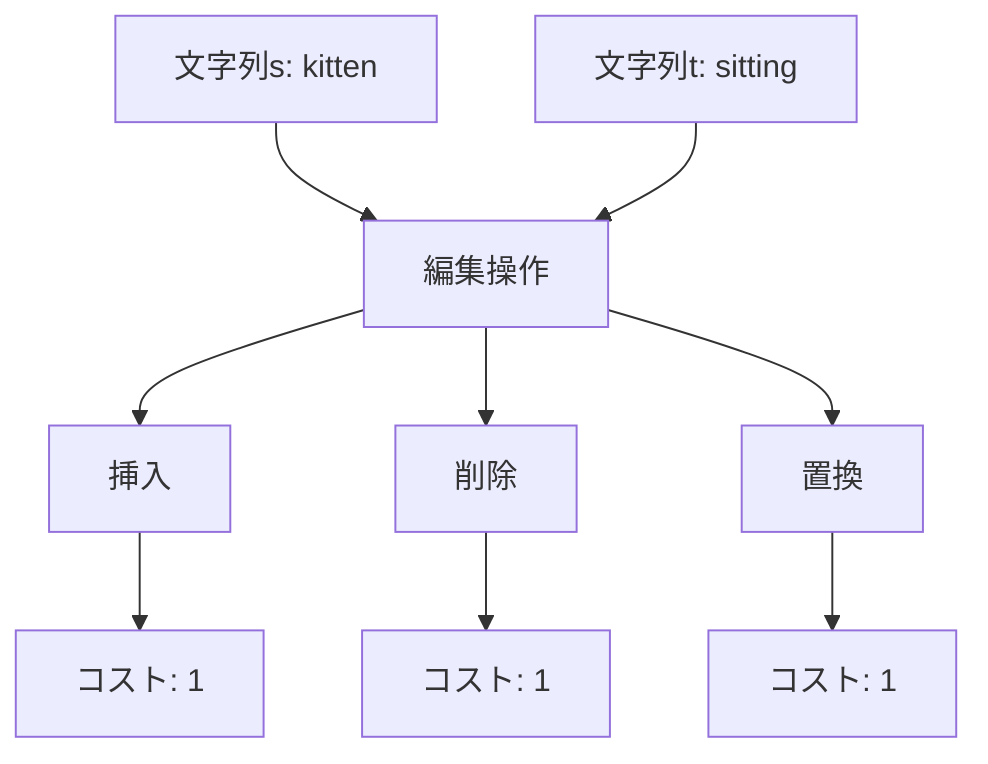
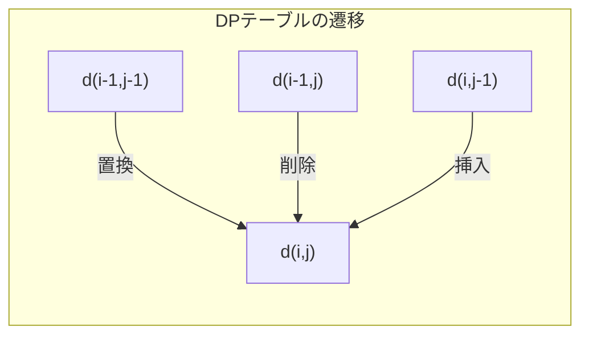
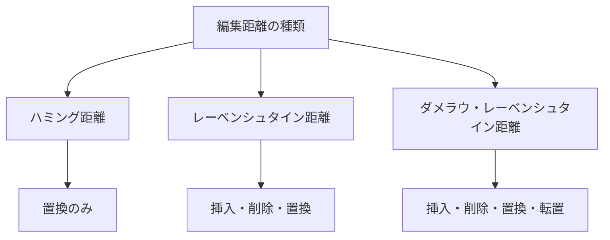
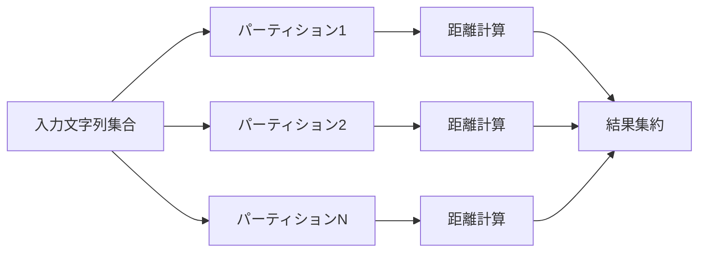

# レーベンシュタイン距離

レーベンシュタイン距離（Levenshtein distance）は、2つの文字列間の最小編集距離を表す指標であり、1965年にソビエトの数学者ウラジーミル・レーベンシュタインによって定式化された^[1]^。この距離は、一方の文字列を他方の文字列に変換するために必要な最小の編集操作数として定義される。編集操作には、文字の挿入（insertion）、削除（deletion）、置換（substitution）の3種類が含まれ、それぞれの操作のコストは通常1として扱われる。

レーベンシュタイン距離は、スペルチェッカー、DNA配列解析、自然言語処理、ファジー文字列照合など、幅広い分野で応用されている重要なアルゴリズムである。特に、文字列の類似度を定量的に評価する必要がある場面では、その単純さと汎用性から第一選択として採用されることが多い。

## 数学的定義

2つの文字列 $s$ と $t$ に対して、レーベンシュタイン距離 $d(s, t)$ は以下のように再帰的に定義される：

$$
d(i, j) = \begin{cases}
j & \text{if } i = 0 \\
i & \text{if } j = 0 \\
d(i-1, j-1) & \text{if } s[i] = t[j] \\
1 + \min \begin{cases}
d(i-1, j) & \text{(deletion)} \\
d(i, j-1) & \text{(insertion)} \\
d(i-1, j-1) & \text{(substitution)}
\end{cases} & \text{otherwise}
\end{cases}
$$

ここで、$d(i, j)$ は文字列 $s$ の最初の $i$ 文字と文字列 $t$ の最初の $j$ 文字間のレーベンシュタイン距離を表す。この再帰的定義は、問題の最適部分構造を明確に示しており、動的計画法による効率的な解法の基礎となる。



## 動的計画法による解法

レーベンシュタイン距離の計算は、動的計画法を用いることで効率的に実装できる。この手法では、$(|s|+1) \times (|t|+1)$ のDPテーブルを構築し、各セル $(i, j)$ に $d(i, j)$ の値を格納する。

DPテーブルの構築は以下の手順で行われる：

1. **初期化**: 第0行と第0列を初期化する。$d(0, j) = j$ および $d(i, 0) = i$ とする。これは、空文字列から長さ $j$ の文字列への変換には $j$ 回の挿入が必要であり、長さ $i$ の文字列から空文字列への変換には $i$ 回の削除が必要であることを意味する。

2. **テーブルの埋め込み**: 各セル $(i, j)$ について、上記の再帰式に従って値を計算する。文字が一致する場合は、追加の編集操作は不要であるため、左上のセルの値をそのまま使用する。文字が異なる場合は、3つの編集操作（削除、挿入、置換）のうち最小コストとなるものを選択する。



具体的な例として、"kitten" から "sitting" への変換を考えてみよう。DPテーブルは以下のように構築される：

```
    ""  s  i  t  t  i  n  g
""   0  1  2  3  4  5  6  7
k    1  1  2  3  4  5  6  7
i    2  2  1  2  3  4  5  6
t    3  3  2  1  2  3  4  5
t    4  4  3  2  1  2  3  4
e    5  5  4  3  2  2  3  4
n    6  6  5  4  3  3  2  3
```

このテーブルから、"kitten" から "sitting" へのレーベンシュタイン距離は3であることがわかる。実際の編集操作の追跡には、各セルでどの操作を選択したかを記録し、右下から左上へバックトラックすることで実現できる。

## 実装の詳細

レーベンシュタイン距離の基本的な実装は比較的単純であるが、実用的なアプリケーションでは様々な最適化が必要となる。以下は、Pythonによる基本的な実装例である：

```python
def levenshtein_distance(s: str, t: str) -> int:
    m, n = len(s), len(t)
    
    # Create DP table
    dp = [[0] * (n + 1) for _ in range(m + 1)]
    
    # Initialize base cases
    for i in range(m + 1):
        dp[i][0] = i
    for j in range(n + 1):
        dp[0][j] = j
    
    # Fill the DP table
    for i in range(1, m + 1):
        for j in range(1, n + 1):
            if s[i-1] == t[j-1]:
                dp[i][j] = dp[i-1][j-1]
            else:
                dp[i][j] = 1 + min(
                    dp[i-1][j],    # deletion
                    dp[i][j-1],    # insertion
                    dp[i-1][j-1]   # substitution
                )
    
    return dp[m][n]
```

この実装の時間計算量は $O(mn)$ であり、空間計算量も $O(mn)$ である。ここで、$m$ と $n$ はそれぞれ入力文字列の長さを表す。

## 空間効率の最適化

基本的な実装では $O(mn)$ の空間を必要とするが、最終的な距離値のみが必要な場合は、空間計算量を $O(\min(m, n))$ に削減できる。この最適化は、DPテーブルの各行を計算する際に、前の行の値のみが必要であるという性質を利用する。

```python
def levenshtein_distance_optimized(s: str, t: str) -> int:
    # Ensure s is the shorter string
    if len(s) > len(t):
        s, t = t, s
    
    m, n = len(s), len(t)
    prev_row = list(range(n + 1))
    
    for i in range(1, m + 1):
        curr_row = [i] + [0] * n
        for j in range(1, n + 1):
            if s[i-1] == t[j-1]:
                curr_row[j] = prev_row[j-1]
            else:
                curr_row[j] = 1 + min(
                    prev_row[j],      # deletion
                    curr_row[j-1],    # insertion
                    prev_row[j-1]     # substitution
                )
        prev_row = curr_row
    
    return prev_row[n]
```

さらなる最適化として、Hirschbergのアルゴリズム^[2]^を使用することで、$O(\min(m, n))$ の空間で実際の編集操作列も復元できる。このアルゴリズムは分割統治法を用いて、中間地点を再帰的に計算することで実現される。

## 重み付きレーベンシュタイン距離

実用的なアプリケーションでは、すべての編集操作が同じコストを持つとは限らない。例えば、キーボード上で隣接するキーの打ち間違いは、離れたキーの打ち間違いよりも起こりやすいため、より低いコストを割り当てることが適切である。

重み付きレーベンシュタイン距離では、各編集操作に異なるコスト関数を定義する：

- $w_{\text{ins}}(c)$: 文字 $c$ を挿入するコスト
- $w_{\text{del}}(c)$: 文字 $c$ を削除するコスト
- $w_{\text{sub}}(a, b)$: 文字 $a$ を文字 $b$ に置換するコスト

これらのコスト関数を用いることで、より現実的な文字列間の距離を計算できる。例えば、OCR（光学文字認識）では、視覚的に類似した文字（'l' と '1'、'O' と '0' など）の置換コストを低く設定することで、より精度の高い補正が可能となる。

## 関連アルゴリズムとの比較

レーベンシュタイン距離は編集距離の一種であり、他にも様々な文字列距離尺度が存在する。それぞれの特性を理解することで、適切なアルゴリズムを選択できる。

### ハミング距離

ハミング距離は、同じ長さの2つの文字列において、対応する位置で異なる文字の数を数える。この距離は置換操作のみを考慮し、挿入や削除は許可されない。計算量は $O(n)$ と非常に効率的であるが、異なる長さの文字列には適用できない。

### ダメラウ・レーベンシュタイン距離

ダメラウ・レーベンシュタイン距離^[3]^は、レーベンシュタイン距離に隣接する2文字の転置（transposition）操作を追加したものである。この拡張は、タイピングミスの約80%が単一文字の編集または隣接文字の転置であるという観察に基づいている。



### ジャロ・ウィンクラー距離

ジャロ・ウィンクラー距離は、短い文字列やレコードリンケージに特化した距離尺度である。この距離は、共通文字の数と転置の数に基づいて計算され、文字列の先頭部分の一致により高い重みを与える。値域は[0, 1]であり、1に近いほど類似度が高い。

## 高速化手法

大規模なデータセットでレーベンシュタイン距離を計算する際には、様々な高速化手法が必要となる。

### 早期打ち切り

多くのアプリケーションでは、距離が特定の閾値を超えるかどうかのみが重要である。この場合、計算中に距離が閾値を超えることが確定した時点で計算を打ち切ることで、大幅な高速化が可能である。

```python
def levenshtein_distance_with_threshold(s: str, t: str, threshold: int) -> int:
    m, n = len(s), len(t)
    
    # Early termination based on length difference
    if abs(m - n) > threshold:
        return threshold + 1
    
    # Use only two rows for space efficiency
    prev_row = list(range(n + 1))
    
    for i in range(1, m + 1):
        curr_row = [i] + [0] * n
        min_in_row = i
        
        for j in range(1, n + 1):
            if s[i-1] == t[j-1]:
                curr_row[j] = prev_row[j-1]
            else:
                curr_row[j] = 1 + min(
                    prev_row[j],
                    curr_row[j-1],
                    prev_row[j-1]
                )
            min_in_row = min(min_in_row, curr_row[j])
        
        # Early termination if minimum in row exceeds threshold
        if min_in_row > threshold:
            return threshold + 1
        
        prev_row = curr_row
    
    return prev_row[n] if prev_row[n] <= threshold else threshold + 1
```

### ビット並列化

Myersのビット並列アルゴリズム^[4]^は、ビット演算を用いてレーベンシュタイン距離を高速に計算する手法である。このアルゴリズムは、64ビット整数を使用して最大64文字までの文字列を並列に処理でき、実用的な文字列長では大幅な高速化を実現する。

### 近似アルゴリズム

厳密な距離が不要な場合、近似アルゴリズムを使用することで計算時間を削減できる。例えば、q-gramベースの手法では、文字列を固定長の部分文字列に分割し、その集合の類似度から編集距離を推定する。

## 実用的な応用

レーベンシュタイン距離は、多様な分野で実用的に活用されている。

### スペルチェッカーとオートコレクト

スペルチェッカーでは、入力された単語と辞書内の単語とのレーベンシュタイン距離を計算し、最も距離の小さい候補を提示する。効率的な実装では、BKツリー（Burkhard-Keller tree）^[5]^やトライ木を使用して、候補の絞り込みを行う。

BKツリーは、三角不等式を満たす距離関数に対して効率的な近傍検索を可能にするデータ構造である。レーベンシュタイン距離は三角不等式を満たすため、BKツリーを使用することで、閾値以内の距離にある文字列を効率的に検索できる。

### バイオインフォマティクス

DNA配列やタンパク質配列の比較において、レーベンシュタイン距離は配列アライメントの基礎となる。ただし、生物学的な文脈では、異なる種類の変異（点突然変異、挿入、欠失）に異なる重みを与えることが一般的である。

配列アライメントでは、Needleman-WunschアルゴリズムやSmith-Watermanアルゴリズムなど、レーベンシュタイン距離を拡張したアルゴリズムが使用される。これらのアルゴリズムは、生物学的な意味を考慮したスコアリング行列（PAM、BLOSUMなど）を使用する。

### ファジー文字列照合

データベースのレコードマッチングや重複排除では、レーベンシュタイン距離を用いたファジー文字列照合が重要な役割を果たす。例えば、顧客データベースにおいて、"John Smith" と "Jon Smyth" が同一人物である可能性を評価する際に使用される。

実用的なシステムでは、レーベンシュタイン距離を他の特徴量（音声的類似度、文字頻度など）と組み合わせて、より精度の高い照合を実現する。また、ブロッキングやインデキシング技術を使用して、比較対象を効率的に絞り込む。

## 並列化と分散処理

大規模なデータセットでレーベンシュタイン距離を計算する場合、並列化による高速化が重要となる。

### GPUを用いた並列化

GPUの大規模並列処理能力を活用することで、複数の文字列ペアのレーベンシュタイン距離を同時に計算できる。CUDAやOpenCLを使用した実装では、ワープ内でのメモリアクセスパターンの最適化が性能向上の鍵となる。

DPテーブルの対角線に沿った要素は独立に計算できるため、ウェーブフロント並列化が効果的である。各スレッドが対角線上の異なる要素を担当することで、データ依存性を保ちながら並列処理を実現する。

### MapReduceフレームワーク

Apache SparkやHadoopなどの分散処理フレームワークを使用することで、大規模な文字列集合間の全対全比較を効率的に実行できる。ただし、通信オーバーヘッドを最小化するため、適切なパーティショニング戦略が必要である。



## 実装上の注意点

レーベンシュタイン距離を実装する際には、以下の点に注意が必要である。

### Unicode文字列の扱い

現代のアプリケーションでは、Unicode文字列を正しく扱うことが不可欠である。特に、結合文字、サロゲートペア、書記素クラスタなどを考慮する必要がある。単純な文字単位の比較では、視覚的に同一の文字列が異なる距離を持つ可能性がある。

Pythonの場合、`unicodedata`モジュールを使用して正規化を行うことで、一貫性のある比較が可能となる。また、書記素単位での比較が必要な場合は、専用のライブラリ（例：`grapheme`）を使用する。

### 数値的安定性

非常に長い文字列を扱う場合、整数オーバーフローに注意が必要である。特に、重み付き距離を使用する場合は、浮動小数点数の精度にも配慮する必要がある。

### メモリ局所性

キャッシュ効率を向上させるため、DPテーブルのアクセスパターンを最適化することが重要である。行優先順序でテーブルを埋めることで、キャッシュミスを減少させることができる。

## 理論的な性質

レーベンシュタイン距離は、文字列の集合上の距離関数として以下の性質を満たす：

1. **非負性**: $d(s, t) \geq 0$
2. **同一性**: $d(s, t) = 0 \Leftrightarrow s = t$
3. **対称性**: $d(s, t) = d(t, s)$
4. **三角不等式**: $d(s, t) \leq d(s, u) + d(u, t)$

これらの性質により、レーベンシュタイン距離は計量空間を定義し、様々な数学的手法を適用できる。例えば、三角不等式を利用した枝刈りや、計量空間のインデキシング手法を使用できる。

計算複雑性の観点では、レーベンシュタイン距離の計算は、定数アルファベットサイズの仮定の下で、$O(mn)$ より真に高速なアルゴリズムは存在しないことが証明されている^[6]^。ただし、実用的には様々な高速化手法により、平均的なケースでの性能を大幅に改善できる。

## 競技プログラミングにおける実装

競技プログラミングでは、レーベンシュタイン距離は文字列処理問題の基本的なテクニックとして頻繁に登場する。実装の簡潔性と効率性のバランスが重要であり、以下のような最適化されたテンプレートがよく使用される：

```cpp
#include <vector>
#include <string>
#include <algorithm>

int editDistance(const std::string& s, const std::string& t) {
    int m = s.length();
    int n = t.length();
    
    // Space optimization: use only O(min(m,n)) space
    if (m > n) return editDistance(t, s);
    
    std::vector<int> dp(n + 1);
    for (int j = 0; j <= n; ++j) dp[j] = j;
    
    for (int i = 1; i <= m; ++i) {
        int prev = dp[0];
        dp[0] = i;
        
        for (int j = 1; j <= n; ++j) {
            int temp = dp[j];
            if (s[i-1] == t[j-1]) {
                dp[j] = prev;
            } else {
                dp[j] = 1 + std::min({prev, dp[j], dp[j-1]});
            }
            prev = temp;
        }
    }
    
    return dp[n];
}
```

競技プログラミングにおける典型的な応用として、部分文字列の編集距離を求める問題がある。この場合、文字列の一部分に対してレーベンシュタイン距離を計算する必要があり、セグメント木やsparse tableなどのデータ構造と組み合わせることで効率的な解法を構築できる。

また、編集距離を制約条件とする最適化問題も頻出する。例えば、「編集距離が$k$以下となる文字列の中で、辞書順最小のものを求めよ」といった問題では、動的計画法の状態に追加の情報を持たせることで解決できる。

---

^[1]^ Levenshtein, V. I. (1966). "Binary codes capable of correcting deletions, insertions, and reversals". Soviet Physics Doklady. 10 (8): 707–710.

^[2]^ Hirschberg, D. S. (1975). "A linear space algorithm for computing maximal common subsequences". Communications of the ACM. 18 (6): 341–343.

^[3]^ Damerau, F. J. (1964). "A technique for computer detection and correction of spelling errors". Communications of the ACM. 7 (3): 171–176.

^[4]^ Myers, G. (1999). "A fast bit-vector algorithm for approximate string matching based on dynamic programming". Journal of the ACM. 46 (3): 395–415.

^[5]^ Burkhard, W. A.; Keller, R. M. (1973). "Some approaches to best-match file searching". Communications of the ACM. 16 (4): 230–236.

^[6]^ Backurs, A.; Indyk, P. (2015). "Edit Distance Cannot Be Computed in Strongly Subquadratic Time (unless SETH is false)". Proceedings of the 47th Annual ACM Symposium on Theory of Computing: 51–58.