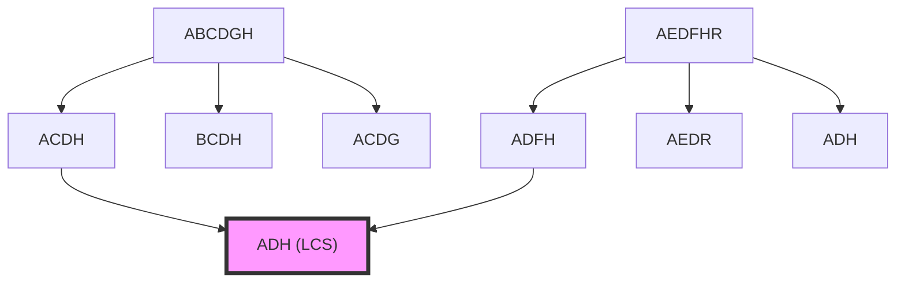
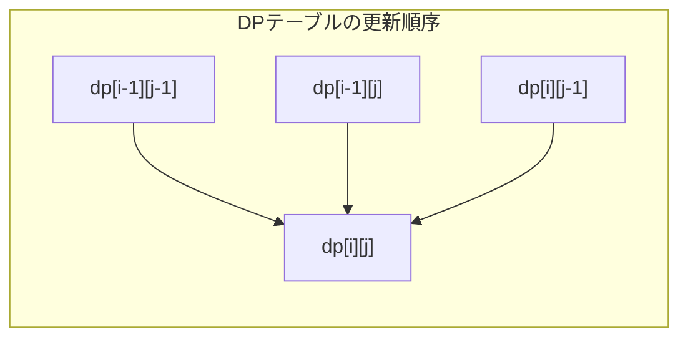

# 最長共通部分列

最長共通部分列（Longest Common Subsequence, LCS）問題は、動的計画法の代表的な応用例として知られる組合せ最適化問題である。二つの文字列が与えられたとき、両方の文字列に共通して現れる部分列のうち最も長いものを求める問題は、文字列処理、バイオインフォマティクス、バージョン管理システムなど、幅広い分野で実用的な応用を持つ。本稿では、この問題の数学的定式化から始め、動的計画法による解法の導出、実装上の最適化手法、そして関連する問題との関係について詳細に論じる。

## 問題の定義と数学的定式化

部分列（subsequence）とは、元の文字列から0個以上の文字を削除して得られる文字列のことである。重要な点は、部分列では文字の相対的な順序が保たれなければならないが、必ずしも連続している必要はないということだ。例えば、文字列 "ABCDGH" に対して "ACH" は部分列であるが、"HCA" は部分列ではない。これは部分文字列（substring）とは異なる概念であり、部分文字列は必ず連続した文字で構成される必要がある。

形式的に定義すると、文字列 $X = x_1x_2...x_m$ の部分列とは、$1 \leq i_1 < i_2 < ... < i_k \leq m$ を満たす添字列に対して $x_{i_1}x_{i_2}...x_{i_k}$ の形で表される文字列である。二つの文字列 $X = x_1x_2...x_m$ と $Y = y_1y_2...y_n$ が与えられたとき、最長共通部分列問題は、$X$ と $Y$ の両方の部分列となる文字列のうち最も長いものを見つけることである。

この問題の難しさは、可能な部分列の数が指数的に増加することにある。長さ $m$ の文字列には $2^m$ 個の部分列が存在し、これらすべてを列挙して比較することは現実的ではない。しかし、この問題には最適部分構造と呼ばれる性質があり、これを利用することで効率的な解法を構築できる。

## 最適部分構造の発見

最長共通部分列問題の鍵となる洞察は、大きな問題の最適解が、より小さな部分問題の最適解から構成されるという最適部分構造の性質である。文字列 $X = x_1x_2...x_m$ と $Y = y_1y_2...y_n$ に対して、$LCS(i, j)$ を $X$ の最初の $i$ 文字と $Y$ の最初の $j$ 文字の最長共通部分列の長さと定義する。

この定義のもとで、次の再帰的な関係が成立する：

$$
LCS(i, j) = \begin{cases}
0 & \text{if } i = 0 \text{ or } j = 0 \\
LCS(i-1, j-1) + 1 & \text{if } x_i = y_j \\
\max(LCS(i-1, j), LCS(i, j-1)) & \text{if } x_i \neq y_j
\end{cases}
$$

この再帰関係の正当性を証明しよう。$x_i = y_j$ の場合、$X[1..i]$ と $Y[1..j]$ の最長共通部分列は、必ず $x_i$（= $y_j$）で終わる。なぜなら、もしそうでない最長共通部分列が存在するとすれば、その末尾に $x_i$ を追加することでより長い共通部分列が得られ、最長性に矛盾するからである。したがって、この場合の最長共通部分列の長さは $LCS(i-1, j-1) + 1$ となる。

一方、$x_i \neq y_j$ の場合、最長共通部分列は $x_i$ または $y_j$ のいずれか（あるいは両方）を含まない。$x_i$ を含まない場合は $LCS(i-1, j)$ に帰着し、$y_j$ を含まない場合は $LCS(i, j-1)$ に帰着する。最長共通部分列を求めるためには、これら二つの値の最大値を取ればよい。

## 動的計画法による解法

上述の再帰関係を直接実装すると、同じ部分問題を何度も解くことになり、指数的な時間計算量となってしまう。しかし、部分問題の数は高々 $mn$ 個であることに注目すると、メモ化や動的計画法を用いることで効率的に解くことができる。

動的計画法では、$(m+1) \times (n+1)$ のテーブル $dp$ を用意し、$dp[i][j] = LCS(i, j)$ となるように値を埋めていく。テーブルの初期化として、$dp[0][j] = 0$ および $dp[i][0] = 0$ とする。これは空文字列との最長共通部分列の長さが0であることを表している。

実装における重要な観察として、各セル $dp[i][j]$ の値は、その左上、上、左の3つのセルの値のみに依存する。この性質により、行ごとまたは列ごとに順番に計算していくことで、すべての必要な値が計算時に利用可能であることが保証される。

時間計算量は $O(mn)$ であり、各セルの計算に $O(1)$ の時間がかかることから明らかである。空間計算量も同様に $O(mn)$ となるが、最長共通部分列の長さのみを求める場合は、後述する最適化により $O(\min(m, n))$ に削減できる。

## 解の復元

最長共通部分列の長さだけでなく、実際の部分列を求める必要がある場合は、動的計画法のテーブルを逆方向にたどることで解を復元できる。この過程をバックトラックと呼ぶ。

バックトラックのアルゴリズムは以下のように動作する。位置 $(i, j)$ から開始して、$i > 0$ かつ $j > 0$ である限り：

1. $x_i = y_j$ の場合、この文字は最長共通部分列に含まれる。文字を記録し、$(i-1, j-1)$ に移動する。
2. $x_i \neq y_j$ の場合、$dp[i-1][j] \geq dp[i][j-1]$ なら $(i-1, j)$ に移動し、そうでなければ $(i, j-1)$ に移動する。

このアルゴリズムで得られる文字列を逆順にすると、最長共通部分列が得られる。バックトラックの時間計算量は $O(m + n)$ であり、最悪の場合でも対角線に沿って移動するためである。

実装上の注意点として、複数の最長共通部分列が存在する場合がある。上記のアルゴリズムでは、$dp[i-1][j] = dp[i][j-1]$ の場合の選択によって、異なる最長共通部分列が得られる可能性がある。すべての最長共通部分列を列挙する場合は、このような分岐点で両方の経路を探索する必要がある。

## 空間計算量の最適化

最長共通部分列の長さのみを求める場合、動的計画法のテーブル全体を保持する必要はない。各行の計算には直前の行の値のみが必要であることから、2行分のメモリだけで計算を行うことができる。さらに工夫すると、1行分のメモリと若干の補助変数だけで実装することも可能である。

この最適化は、メモリ制約の厳しい環境や、非常に長い文字列を扱う場合に重要となる。ただし、解の復元が必要な場合は、この最適化を直接適用することはできない。Hirschbergのアルゴリズム^[1]は、分割統治法を用いることで、$O(m + n)$ の空間計算量で解の復元も可能にする巧妙な手法である。

Hirschbergのアルゴリズムの基本的なアイデアは、最長共通部分列が必ず通る「中間点」を効率的に見つけることである。文字列を半分に分割し、前半と後半それぞれについて最長共通部分列の長さを計算することで、最適な分割点を決定できる。この過程を再帰的に適用することで、全体の解を構築する。

## 実装における最適化技法

実際の実装では、いくつかの最適化技法を適用することで、定数倍の高速化を図ることができる。まず、文字比較の高速化として、文字列を整数配列に変換し、文字比較を整数比較に置き換える手法がある。特に、アルファベットのサイズが小さい場合は、ビット演算を用いた並列化も可能である。

キャッシュ効率の観点からは、メモリアクセスパターンの最適化が重要である。動的計画法のテーブルを行優先で格納し、内側のループで列方向に走査することで、キャッシュミスを減らすことができる。また、ループアンローリングやベクトル化といった低レベルの最適化も、コンパイラの最適化オプションと組み合わせることで効果を発揮する。

並列化の観点では、波面並列化（wavefront parallelization）と呼ばれる手法が知られている。動的計画法のテーブルにおいて、対角線上のセルは互いに独立に計算できるため、これらを並列に処理することができる。GPUを用いた実装では、この性質を活用して大幅な高速化を達成できる^[2]。

## 関連問題と一般化

最長共通部分列問題は、多くの関連問題の基礎となっている。編集距離（レーベンシュタイン距離）は、一方の文字列を他方に変換するために必要な挿入、削除、置換操作の最小回数を求める問題であり、最長共通部分列と密接な関係がある。実際、削除操作のみを許可した編集距離は、$m + n - 2 \times LCS$ で計算できる。

最長増加部分列（Longest Increasing Subsequence, LIS）問題は、単一の数列に対して狭義単調増加となる最長の部分列を求める問題である。この問題は、元の数列とそのソート済み配列の最長共通部分列として解くことができるが、より効率的な $O(n \log n)$ のアルゴリズムが存在する。

3つ以上の文字列に対する最長共通部分列問題は、NP困難であることが知られている^[3]。しかし、文字列の数が定数の場合は、多次元動的計画法により多項式時間で解くことができる。$k$ 個の文字列に対しては、$O(n^k)$ の時間計算量となる。

最長共通部分文字列（Longest Common Substring）問題は、連続性の制約が加わった変種である。この問題は、接尾辞配列や一般化接尾辞木を用いることで、$O(n \log n)$ または $O(n)$ で解くことができる。動的計画法でも解けるが、状態遷移が異なり、文字が一致しない場合は0にリセットされる。

制約付き最長共通部分列問題では、特定のパターンを必ず含む、または含まないという制約が加わる。例えば、ある文字列 $P$ を部分列として含む最長共通部分列を求める問題は、3次元の動的計画法で解くことができる。このような拡張は、実用的なアプリケーションで頻繁に現れる。

最長共通部分列問題は、その単純な定式化にもかかわらず、豊富な理論的性質と実用的応用を持つ。動的計画法の教科書的な例題としてだけでなく、実際のソフトウェア開発においても、差分表示、類似度計算、配列アラインメントなど、様々な場面で活用されている。効率的な実装と適切な最適化により、大規模なデータに対しても実用的な性能を達成できる、計算機科学の基礎を成す重要な問題である。

---

^[1] Hirschberg, D. S. (1975). "A linear space algorithm for computing maximal common subsequences". Communications of the ACM. 18 (6): 341–343.

^[2] Deorowicz, S. (2010). "Bit-parallel algorithm for the longest common subsequence problem". IEEE International Symposium on Parallel & Distributed Processing.

^[3] Maier, D. (1978). "The complexity of some problems on subsequences and supersequences". Journal of the ACM. 25 (2): 322–336.