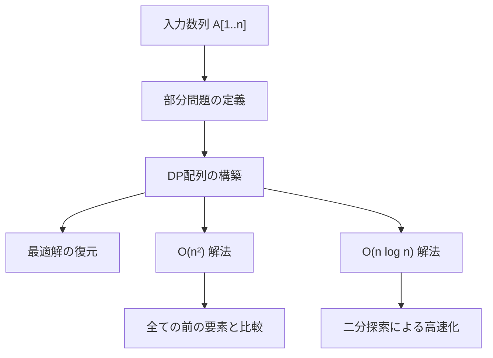
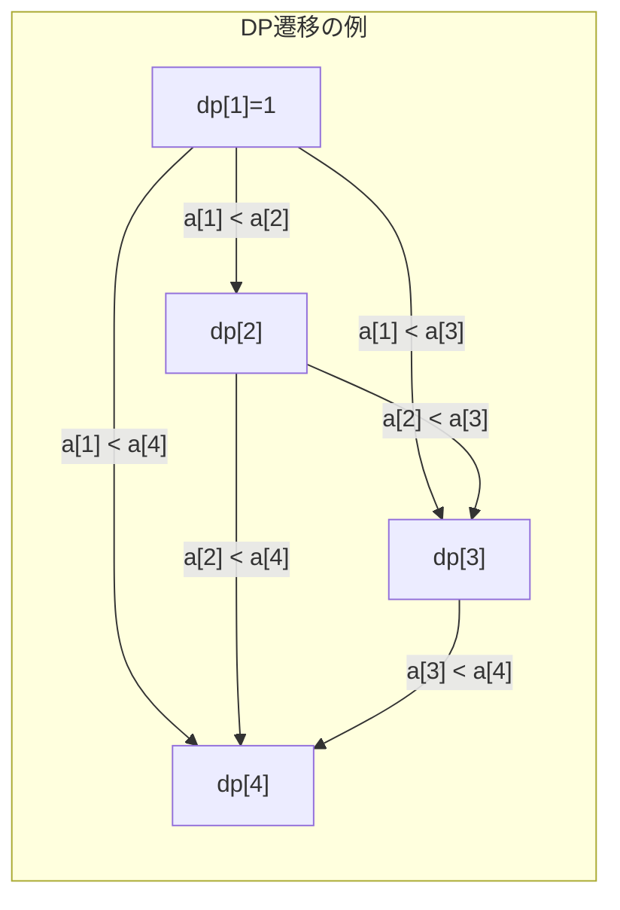
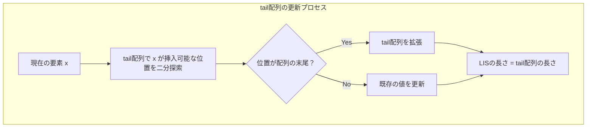
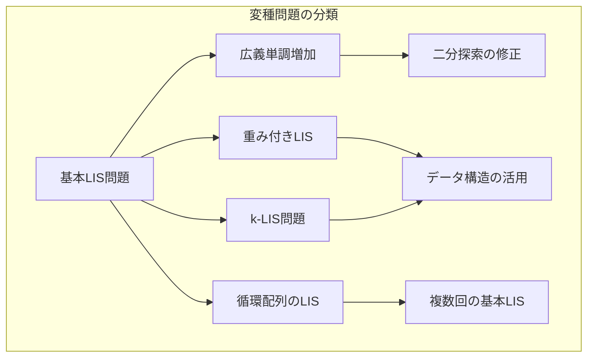

# 最長増加部分列

最長増加部分列（Longest Increasing Subsequence, LIS）問題は、与えられた数列から部分列を選び出す際に、選んだ要素が昇順になるという制約のもとで、その長さを最大化する組合せ最適化問題である。この問題は動的計画法の古典的な例題としてだけでなく、ソーティングネットワークの設計、最適化理論、計算生物学における配列解析など、幅広い応用を持つ基礎的なアルゴリズム問題として位置づけられる。

部分列とは、元の数列から任意の要素を選び出し、元の順序を保ったまま並べたものを指す。数学的に厳密に定義すると、数列 $A = (a_1, a_2, ..., a_n)$ に対して、インデックスの増加列 $i_1 < i_2 < ... < i_k$ が存在するとき、$(a_{i_1}, a_{i_2}, ..., a_{i_k})$ を $A$ の部分列と呼ぶ。この部分列が $a_{i_1} < a_{i_2} < ... < a_{i_k}$ を満たすとき、これを増加部分列と呼び、そのような部分列の中で長さ $k$ が最大のものを最長増加部分列と定義する。

## 問題の計算複雑性と理論的背景

最長増加部分列問題は、一般的な部分構造最適性を持つ問題の典型例である。ある位置までの最適解が、それより前の位置での最適解を利用して構成できるという性質は、動的計画法の適用を可能にする。この問題に対する素朴な全探索アプローチでは $O(2^n)$ の計算量を要するが、動的計画法により $O(n^2)$ に、さらに二分探索を組み合わせることで $O(n \log n)$ まで改善できることが知られている。



理論計算機科学の観点から見ると、最長増加部分列問題は比較ベースのアルゴリズムにおいて $\Omega(n \log n)$ の下界を持つことが証明されている。これは、$n$ 個の異なる要素の順列に対して、その最長増加部分列の長さを求めることが、要素間の順序関係を決定することと等価であり、比較ソートの下界と同じ議論が適用できるためである[^1]。

## 動的計画法による基本解法

最長増加部分列問題に対する動的計画法の適用では、部分問題を「位置 $i$ で終わる最長増加部分列の長さ」として定義する。これを $dp[i]$ と表記すると、以下の漸化式が成立する：

$$dp[i] = \max_{j < i, a_j < a_i} (dp[j] + 1)$$

初期条件は $dp[i] = 1$ （各要素それ自身が長さ1の増加部分列を成す）である。この定式化により、各位置 $i$ について、それより前のすべての位置 $j$ を調べ、$a_j < a_i$ を満たす場合に $dp[j] + 1$ の最大値を求めることで、$dp[i]$ を計算できる。



この基本的なアプローチの計算量は $O(n^2)$ となる。外側のループが $n$ 回、内側のループが最大で $i-1$ 回実行されるため、全体の計算量は $\sum_{i=1}^{n} i = O(n^2)$ となる。空間計算量は $dp$ 配列を保持するための $O(n)$ である。

実装上の重要な考慮点として、最長増加部分列の長さだけでなく、実際の部分列を復元する必要がある場合がある。この場合、各 $dp[i]$ を計算する際に、どの $j$ から遷移してきたかを記録する親配列 $parent[i]$ を保持する。最終的に $dp$ 配列の最大値を持つ位置から、$parent$ 配列を逆向きにたどることで、最長増加部分列を復元できる。

## 二分探索による最適化

$O(n \log n)$ の計算量を実現する最適化されたアルゴリズムは、動的計画法の状態管理を工夫することで実現される。このアルゴリズムの核心は、「長さ $k$ の増加部分列の末尾の最小値」を管理する配列 $tail$ を維持することにある。

具体的には、$tail[k]$ を「長さ $k$ の増加部分列のうち、末尾の値が最小となるものの末尾の値」と定義する。この配列は常に昇順に保たれるという重要な性質を持つ。なぜなら、もし $tail[i] \geq tail[i+1]$ となる場合、長さ $i+1$ の増加部分列から最初の要素を除けば長さ $i$ の増加部分列が得られ、その末尾は $tail[i+1]$ となるが、これは $tail[i]$ の定義（最小性）に矛盾するからである。



アルゴリズムの動作は以下の通りである。入力配列の各要素 $x$ に対して、$tail$ 配列において $x$ 以上の最小の要素の位置を二分探索で見つける。その位置が $tail$ 配列の末尾である場合、$x$ を $tail$ 配列に追加する。そうでない場合、その位置の値を $x$ で置き換える。この操作により、$tail$ 配列の長さが最長増加部分列の長さとなる。

この最適化の正当性は、各ステップで「長さ $k$ の増加部分列の末尾の最小値」という不変条件が保たれることから導かれる。新しい要素 $x$ が来たとき、$x$ より小さい最大の $tail[j]$ を見つければ、長さ $j+1$ の増加部分列を作ることができる。もし $tail[j+1] > x$ であれば、$x$ を末尾とする長さ $j+1$ の増加部分列の方が、将来の拡張可能性が高いため、$tail[j+1]$ を $x$ で更新する。

## 実装上の詳細と最適化技法

実際の実装では、いくつかの重要な最適化技法が存在する。まず、二分探索の実装において、C++の`lower_bound`やPythonの`bisect_left`のような標準ライブラリ関数を使用することで、バグの混入を防ぎつつ効率的な実装が可能となる。これらの関数は、ソートされた配列に対して、指定された値以上の最小の要素の位置を $O(\log n)$ で返す。

メモリアクセスパターンの観点から見ると、$tail$ 配列は頻繁に参照・更新されるため、キャッシュ効率が重要となる。配列のサイズが小さい間は線形探索の方が二分探索より高速な場合もあるため、実装によっては小さなサイズに対する特殊化を行うことがある。

```cpp
// 効率的な実装例（概念的な疑似コード）
int lengthOfLIS(vector<int>& nums) {
    vector<int> tail;
    for (int x : nums) {
        auto it = lower_bound(tail.begin(), tail.end(), x);
        if (it == tail.end()) {
            tail.push_back(x);
        } else {
            *it = x;
        }
    }
    return tail.size();
}
```

部分列の復元が必要な場合、$O(n \log n)$ のアルゴリズムでは追加の工夫が必要となる。一つの方法は、各要素がどの長さの増加部分列の末尾となったかを記録し、後ろから逆順にたどることである。この場合、各要素に対して $(value, length)$ のペアを保持し、最後に長さが最大のものから貪欲に選んでいく。

## 変種問題と一般化

最長増加部分列問題には多くの変種が存在し、それぞれが独自の応用を持つ。最も直接的な変種は、狭義単調増加（$a_i < a_{i+1}$）ではなく広義単調増加（$a_i \leq a_{i+1}$）を許す問題である。この場合、二分探索で`lower_bound`の代わりに`upper_bound`を使用することで対応できる。

より複雑な変種として、重み付き最長増加部分列問題がある。これは各要素に重みが付いており、部分列の重みの和を最大化する問題である。この問題は、セグメント木や平衡二分探索木を用いて $O(n \log n)$ で解くことができる。基本的なアイデアは、各値 $v$ に対して「$v$ で終わる増加部分列の最大重み」を管理し、新しい要素を処理する際に範囲最大値クエリを用いることである。



$k$-LIS問題は、最長増加部分列ではなく、$k$ 番目に長い増加部分列を求める問題である。この問題は、動的計画法の状態を拡張し、各位置で終わる長さごとの部分列の個数を管理することで解ける。ただし、計算量は $O(n^2 k)$ となり、大きな $k$ に対しては実用的でない場合がある。

## 実践的な設計指針とトレードオフ

実際のシステムで最長増加部分列アルゴリズムを実装する際には、いくつかの設計上のトレードオフを考慮する必要がある。まず、入力サイズと要求される性能のバランスである。$n$ が小さい（例えば1000未満）場合、$O(n^2)$ の単純な動的計画法の方が、実装の簡潔性とデバッグの容易さから好ましい場合がある。

メモリ使用量も重要な考慮事項である。基本的な $O(n \log n)$ アルゴリズムは $O(n)$ の追加メモリを必要とするが、部分列の復元も含めると $O(n)$ の定数倍が大きくなる。ストリーミング環境や組み込みシステムでは、このメモリ使用量が制約となる場合がある。

並列化の観点から見ると、最長増加部分列問題は本質的に逐次的な性質を持つため、直接的な並列化は困難である。しかし、複数の独立した配列に対して最長増加部分列を求める場合や、分割統治法を用いた近似解法では、並列処理による高速化が可能である。

数値精度の問題も実践では重要である。浮動小数点数の配列に対して最長増加部分列を求める場合、比較の際の丸め誤差を考慮する必要がある。一般的には、ある許容誤差 $\epsilon$ を設定し、$|a_i - a_j| < \epsilon$ の場合は等しいとみなすなどの処理が必要となる。

## アルゴリズムの拡張と最新の研究動向

最長増加部分列問題の研究は現在も活発に行われており、特に以下の方向での拡張が注目されている。まず、オンラインアルゴリズムとしての定式化である。要素が順次与えられる状況で、各時点での最長増加部分列を効率的に維持する問題は、データストリーム処理において重要である。

分散環境での最長増加部分列計算も研究されている。MapReduceフレームワークやより一般的な分散計算モデルにおいて、通信量を最小化しながら正確な解を求めるアルゴリズムが提案されている[^2]。基本的なアプローチは、配列を複数の部分に分割し、各部分での局所的な最長増加部分列を計算した後、それらを統合するというものである。

近似アルゴリズムの研究も重要である。厳密な最長増加部分列ではなく、$(1-\epsilon)$ 近似解を高速に求めるアルゴリズムが存在する。これらのアルゴリズムは、サンプリングやスケッチング技法を用いて、$O(n/\epsilon)$ や $O(n \log \log n)$ といった準線形時間での計算を可能にする。

機械学習との融合も興味深い研究方向である。与えられた配列の特性（例えば、ほぼソート済みか、ランダムか）を学習し、その特性に応じて最適なアルゴリズムを選択するアダプティブなアプローチが提案されている。これにより、平均的なケースでの性能を大幅に向上させることができる。

量子アルゴリズムの文脈では、最長増加部分列問題に対する量子スピードアップの可能性が研究されている。現時点では、比較ベースのモデルにおいて古典的な $O(n \log n)$ アルゴリズムを大幅に改善する量子アルゴリズムは知られていないが、特殊な入力分布に対しては量子優位性が示されている場合がある。

最長増加部分列問題は、その単純な定義にもかかわらず、アルゴリズム設計の多くの重要な概念を含む豊かな問題である。動的計画法、二分探索、データ構造の活用、計算複雑性の解析など、計算機科学の基礎的な技法が凝縮されており、これらの技法の理解と応用は、より複雑な最適化問題に取り組む際の強力な基盤となる。実践的な実装においては、問題の制約、システムの特性、要求される性能のバランスを考慮し、適切なアルゴリズムとデータ構造を選択することが重要である。

[^1]: Fredman, M. L. (1975). On computing the length of longest increasing subsequences. Discrete Mathematics, 11(1), 29-35.

[^2]: Tiskin, A. (2015). Fast distance multiplication of unit-Monge matrices. Algorithmica, 71(4), 859-888.