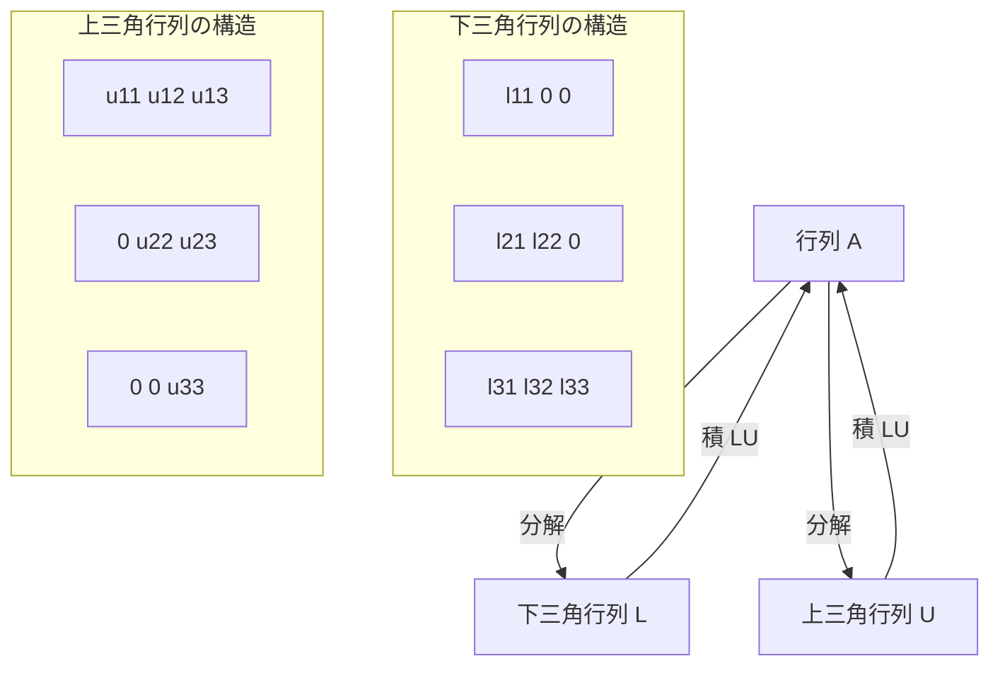
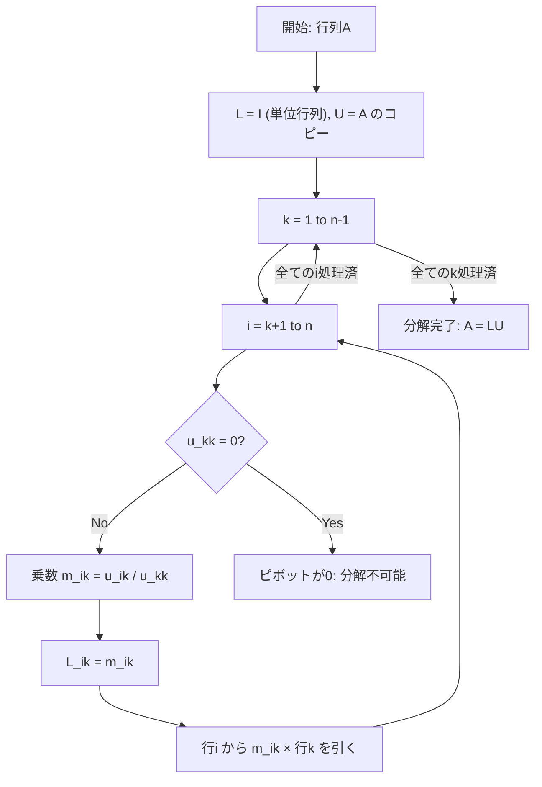
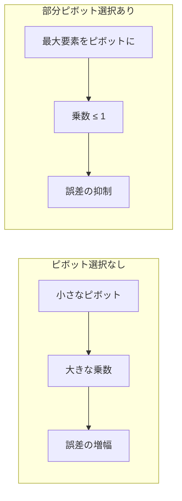
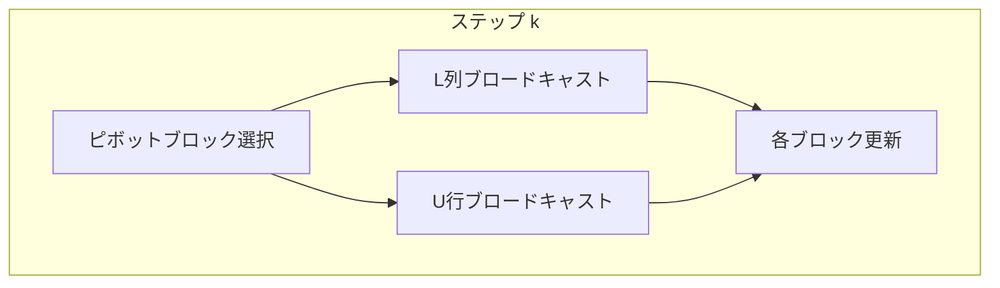

# LU分解

線形代数において、LU分解は行列を下三角行列（Lower triangular matrix）と上三角行列（Upper triangular matrix）の積に分解する手法である。この分解は連立一次方程式の解法、逆行列の計算、行列式の計算など、数値線形代数の基礎となる重要な技術であり、競技プログラミングにおいても行列演算を効率的に実行するための強力な道具となる。

## LU分解の数学的定義

$n \times n$の正方行列$A$に対して、下三角行列$L$と上三角行列$U$が存在し、$A = LU$と分解できるとき、これをLU分解と呼ぶ。ここで、下三角行列$L$は対角成分より上の要素がすべて0であり、上三角行列$U$は対角成分より下の要素がすべて0である行列を指す。



LU分解が存在するための必要十分条件は、行列$A$のすべての主小行列式（leading principal minors）が非零であることである[^1]。しかし、実際の数値計算では、この条件が満たされない場合でも、行の交換を伴うLU分解（部分ピボット選択付きLU分解）を用いることで、ほぼすべての非特異行列に対して分解を実行できる。

## Doolittleアルゴリズム

LU分解を計算する最も基本的なアルゴリズムはDoolittleアルゴリズムである。このアルゴリズムでは、$L$の対角成分を1に固定し（$l_{ii} = 1$）、ガウスの消去法を行列の形で記録していく。

アルゴリズムの基本的な考え方は、行列$A$に対してガウスの消去法を適用する際の操作を、下三角行列$L$に記録することである。具体的には、$A$の$(i,j)$要素を消去するために使用した乗数を$L$の$(i,j)$要素として保存する。



具体的な計算手順を$3 \times 3$行列で示すと、元の行列$A$から始めて、各ステップで行基本変形を適用していく：

$$A = \begin{pmatrix} a_{11} & a_{12} & a_{13} \\ a_{21} & a_{22} & a_{23} \\ a_{31} & a_{32} & a_{33} \end{pmatrix}$$

第1ステップでは、第1列の第2行以下を0にする。このとき、$m_{21} = a_{21}/a_{11}$、$m_{31} = a_{31}/a_{11}$を乗数として使用し、これらを$L$の対応する位置に記録する。

## 部分ピボット選択

数値計算において、LU分解の安定性は極めて重要である。ピボット（対角要素）が小さい値になると、丸め誤差が増幅され、計算結果の精度が著しく低下する。この問題を回避するため、部分ピボット選択（partial pivoting）を導入する。

部分ピボット選択では、各ステップで現在の列の絶対値最大の要素を持つ行と交換してから消去を行う。これにより、分解は$PA = LU$の形になり、$P$は置換行列（permutation matrix）となる。



部分ピボット選択の重要性を示す典型的な例として、以下の行列を考える：

$$A = \begin{pmatrix} \epsilon & 1 \\ 1 & 1 \end{pmatrix}$$

ここで$\epsilon$は非常に小さな正の数である。ピボット選択なしでLU分解を行うと、$L$の$(2,1)$要素は$1/\epsilon$という巨大な値になり、数値的不安定性を引き起こす。一方、行を交換してから分解すれば、すべての要素が適切な大きさに収まる。

## 計算量と数値的性質

LU分解の計算量は$O(n^3)$である。より具体的には、$n \times n$行列に対して約$\frac{2n^3}{3}$回の浮動小数点演算が必要となる[^2]。これはガウスの消去法と同じ計算量であるが、LU分解の利点は、一度分解を計算すれば、異なる右辺ベクトルに対する連立方程式を$O(n^2)$で解けることにある。

数値安定性の観点から、部分ピボット選択付きLU分解の成長因子（growth factor）は最悪の場合$2^{n-1}$となることが知られている。しかし、実際の応用では、このような極端な成長はほとんど観測されず、通常は$O(n^{1/2})$から$O(n^{2/3})$程度に収まる[^3]。

## 前進代入と後退代入

LU分解の主要な応用は連立一次方程式$Ax = b$の解法である。$A = LU$と分解できれば、問題は以下の2つの三角連立方程式に帰着される：

1. $Ly = b$を前進代入（forward substitution）で解く
2. $Ux = y$を後退代入（backward substitution）で解く

前進代入では、$L$が下三角行列であることを利用して、上から順に未知数を求めていく：

$$y_i = b_i - \sum_{j=1}^{i-1} l_{ij}y_j$$

同様に、後退代入では下から順に求める：

$$x_i = \frac{1}{u_{ii}}\left(y_i - \sum_{j=i+1}^{n} u_{ij}x_j\right)$$

これらの代入操作はそれぞれ$O(n^2)$の計算量で実行できる。

## 競技プログラミングにおける実装

競技プログラミングでは、LU分解は主に以下の場面で活用される：

1. **連立一次方程式の高速解法**: 同じ係数行列に対して複数の右辺ベクトルを処理する場合
2. **行列式の計算**: $\det(A) = \det(L)\det(U) = \prod_{i=1}^{n} u_{ii}$（置換の符号を考慮）
3. **逆行列の計算**: 各単位ベクトルを右辺として解くことで逆行列の列を求める

実装上の注意点として、浮動小数点演算の誤差を考慮する必要がある。ピボットがゼロかどうかの判定には、厳密な比較ではなく、適切な許容誤差（通常は$10^{-9}$程度）を設定する。

```cpp
const double EPS = 1e-9;

bool LUDecomposition(vector<vector<double>>& A, vector<int>& perm) {
    int n = A.size();
    perm.resize(n);
    iota(perm.begin(), perm.end(), 0);
    
    for (int k = 0; k < n; k++) {
        // Find pivot
        int pivot = k;
        for (int i = k + 1; i < n; i++) {
            if (abs(A[i][k]) > abs(A[pivot][k])) {
                pivot = i;
            }
        }
        
        if (abs(A[pivot][k]) < EPS) return false;
        
        // Swap rows
        if (pivot != k) {
            swap(A[k], A[pivot]);
            swap(perm[k], perm[pivot]);
        }
        
        // Elimination
        for (int i = k + 1; i < n; i++) {
            A[i][k] /= A[k][k];
            for (int j = k + 1; j < n; j++) {
                A[i][j] -= A[i][k] * A[k][j];
            }
        }
    }
    return true;
}
```

## ブロックLU分解

大規模行列に対しては、ブロックLU分解が有効である。行列を適切なサイズのブロックに分割し、各ブロックを小行列として扱うことで、キャッシュ効率を向上させ、並列化も容易になる。

$$A = \begin{pmatrix} A_{11} & A_{12} \\ A_{21} & A_{22} \end{pmatrix} = \begin{pmatrix} L_{11} & 0 \\ L_{21} & L_{22} \end{pmatrix} \begin{pmatrix} U_{11} & U_{12} \\ 0 & U_{22} \end{pmatrix}$$

ブロック分解では、まず$A_{11} = L_{11}U_{11}$を通常のLU分解で求め、次に$L_{21} = A_{21}U_{11}^{-1}$、$U_{12} = L_{11}^{-1}A_{12}$を計算し、最後にSchur補行列$S = A_{22} - L_{21}U_{12}$を$L_{22}U_{22}$に分解する。

## 特殊な構造を持つ行列への応用

実際の問題では、係数行列が特殊な構造を持つことが多い。例えば、三重対角行列（tridiagonal matrix）の場合、Thomas法と呼ばれる$O(n)$のアルゴリズムが存在する。帯行列（band matrix）の場合も、帯幅を$k$とすると$O(nk^2)$で分解できる。

対称正定値行列に対しては、Cholesky分解という特殊なLU分解が存在する。これは$A = LL^T$の形に分解するもので、計算量と記憶容量が通常のLU分解の約半分で済む。

## 数値的安定性の詳細

LU分解の数値的振る舞いを理解するには、条件数（condition number）の概念が重要である。行列$A$の条件数$\kappa(A) = \|A\|\|A^{-1}\|$は、入力の相対誤差が出力の相対誤差にどの程度増幅されるかを示す指標である。

部分ピボット選択は、分解過程での誤差の増大を抑制するが、元の行列の条件数自体は改善しない。条件数が大きい行列（悪条件行列）に対しては、どのような数値解法を用いても精度の良い解を得ることは困難である。

完全ピボット選択（complete pivoting）では、行と列の両方を交換して最大要素をピボットとする。これにより数値安定性はさらに向上するが、計算量が$O(n^3)$から$O(n^3)$のままでも定数倍が大きくなるため、実用上は部分ピボット選択で十分なことが多い。

## 実装における最適化技法

競技プログラミングでの実装では、以下の最適化が有効である：

1. **インプレース計算**: $L$と$U$を同じ配列に格納し、メモリ使用量を削減
2. **ループ展開**: 内側のループを部分的に展開し、キャッシュ効率を向上
3. **SIMD命令の活用**: 複数の演算を並列実行（コンパイラの自動ベクトル化に依存）

また、整数演算で厳密な解を求める場合は、分数演算を用いるか、十分大きな素数で剰余を取るモジュラー演算を使用する。後者の場合、中国剰余定理を用いて複数の素数での結果から元の解を復元する。

## 理論的背景と拡張

LU分解は、より一般的なQR分解やSVD（特異値分解）の特殊ケースとして理解できる。QR分解では直交行列$Q$と上三角行列$R$に分解し、数値的により安定だが計算量は約2倍になる。

また、LU分解はガウスの消去法の行列表現であり、行基本変形を行列の積として表現したものと解釈できる。この観点から、LU分解は線形写像の分解として、より抽象的な数学的構造を持つ。

不完全LU分解（ILU: Incomplete LU decomposition）は、疎行列に対する前処理手法として重要である。分解の過程で小さな要素を0とみなすことで、疎性を保ちながら近似的な分解を得る。これは反復法の収束を加速する前処理行列として広く使用される。

[^1]: Golub, G. H., & Van Loan, C. F. (2013). Matrix computations (4th ed.). Johns Hopkins University Press.

[^2]: Trefethen, L. N., & Bau, D. (1997). Numerical linear algebra. SIAM.

[^3]: Higham, N. J. (2002). Accuracy and stability of numerical algorithms (2nd ed.). SIAM.

## 誤差解析の詳細

LU分解における誤差の振る舞いを詳しく理解することは、数値計算の信頼性を確保する上で不可欠である。浮動小数点演算では、各演算ごとに丸め誤差が発生し、これが蓄積することで最終結果に大きな影響を与える可能性がある。

後退誤差解析（backward error analysis）の観点から、計算されたLU分解$\hat{L}\hat{U}$は、わずかに摂動された行列$(A + \Delta A)$の厳密な分解として解釈できる。つまり、$\hat{L}\hat{U} = A + \Delta A$となる$\Delta A$が存在し、その大きさは以下のように評価される：

$$\frac{\|\Delta A\|}{\|A\|} \leq cn^3u\rho$$

ここで、$c$は小さな定数、$u$は機械イプシロン（倍精度で約$2.2 \times 10^{-16}$）、$\rho$は成長因子である。成長因子は分解過程で現れる要素の最大値と元の行列の要素の最大値の比として定義され、数値安定性の指標となる。

前進誤差（forward error）については、計算された解$\hat{x}$と真の解$x$の相対誤差が、条件数$\kappa(A)$と後退誤差の積で抑えられる：

$$\frac{\|x - \hat{x}\|}{\|x\|} \leq \kappa(A) \cdot \frac{\|\Delta A\|}{\|A\|}$$

この関係式は、悪条件行列（条件数が大きい行列）に対しては、たとえ後退誤差が小さくても、解の誤差が大きくなる可能性があることを示している。

## 競技プログラミングにおける具体的問題例

LU分解が効果的に適用できる競技プログラミングの問題をいくつか詳しく見ていく。

### 例1: 電気回路の解析

$n$個のノードを持つ電気回路において、各ノードの電圧を求める問題を考える。キルヒホッフの法則を適用すると、以下の形の連立方程式が得られる：

$$Gv = i$$

ここで、$G$はコンダクタンス行列、$v$は電圧ベクトル、$i$は電流ベクトルである。回路の構成要素が変化しない限り$G$は固定であるため、異なる電流源に対する解析にはLU分解が有効である。

### 例2: 確率的グラフ問題

ランダムウォークの定常分布や、マルコフ連鎖の吸収確率を求める問題では、$(I - P)x = b$の形の方程式を解く必要がある。ここで$P$は推移確率行列である。複数の初期条件や境界条件に対して計算する場合、LU分解による前処理が計算時間を大幅に削減する。

### 例3: 多項式補間

$n$個の点$(x_i, y_i)$を通る$n-1$次多項式を求める問題では、Vandermonde行列を係数とする連立方程式を解く：

$$\begin{pmatrix}
1 & x_1 & x_1^2 & \cdots & x_1^{n-1} \\
1 & x_2 & x_2^2 & \cdots & x_2^{n-1} \\
\vdots & \vdots & \vdots & \ddots & \vdots \\
1 & x_n & x_n^2 & \cdots & x_n^{n-1}
\end{pmatrix} \begin{pmatrix}
a_0 \\ a_1 \\ \vdots \\ a_{n-1}
\end{pmatrix} = \begin{pmatrix}
y_1 \\ y_2 \\ \vdots \\ y_n
\end{pmatrix}$$

Vandermonde行列は条件数が非常に大きくなりやすいため、数値安定性に特に注意が必要である。

## 並列化アルゴリズム

現代の計算環境では、並列処理によるLU分解の高速化が重要である。主要な並列化手法として、以下のアプローチがある。

### ブロック並列化

行列を$p \times p$のブロックに分割し、各プロセッサがブロックを担当する。通信パターンは以下のようになる：



各ステップで、対角ブロックを分解し、その結果を使って$L$の列ブロックと$U$の行ブロックを計算、最後に残りのブロックを更新する。この手法の並列効率は、ブロックサイズと通信遅延のバランスに大きく依存する。

### パイプライン並列化

列方向の依存関係を利用して、パイプライン的に処理を進める。第$k$列の消去が完了したら、即座に第$k+1$列の処理を開始できる部分がある。これにより、異なるプロセッサが異なる列の処理を同時に実行できる。

## 実装の詳細と最適化

競技プログラミングで使用する完全な実装を示す。この実装には、前進代入と後退代入も含まれる。

```cpp
struct LUSolver {
    int n;
    vector<vector<double>> LU;
    vector<int> perm;
    int sign;
    const double EPS = 1e-9;
    
    LUSolver(const vector<vector<double>>& A) : n(A.size()), LU(A), perm(n), sign(1) {
        iota(perm.begin(), perm.end(), 0);
        decompose();
    }
    
    bool decompose() {
        for (int k = 0; k < n; k++) {
            // Partial pivoting
            int pivot = k;
            double maxval = abs(LU[k][k]);
            for (int i = k + 1; i < n; i++) {
                if (abs(LU[i][k]) > maxval) {
                    maxval = abs(LU[i][k]);
                    pivot = i;
                }
            }
            
            if (maxval < EPS) return false;
            
            if (pivot != k) {
                swap(LU[k], LU[pivot]);
                swap(perm[k], perm[pivot]);
                sign = -sign;
            }
            
            // Elimination
            for (int i = k + 1; i < n; i++) {
                LU[i][k] /= LU[k][k];
                for (int j = k + 1; j < n; j++) {
                    LU[i][j] -= LU[i][k] * LU[k][j];
                }
            }
        }
        return true;
    }
    
    vector<double> solve(const vector<double>& b) {
        vector<double> pb(n);
        for (int i = 0; i < n; i++) {
            pb[i] = b[perm[i]];
        }
        
        // Forward substitution
        vector<double> y(n);
        for (int i = 0; i < n; i++) {
            y[i] = pb[i];
            for (int j = 0; j < i; j++) {
                y[i] -= LU[i][j] * y[j];
            }
        }
        
        // Backward substitution
        vector<double> x(n);
        for (int i = n - 1; i >= 0; i--) {
            x[i] = y[i];
            for (int j = i + 1; j < n; j++) {
                x[i] -= LU[i][j] * x[j];
            }
            x[i] /= LU[i][i];
        }
        
        return x;
    }
    
    double determinant() {
        double det = sign;
        for (int i = 0; i < n; i++) {
            det *= LU[i][i];
        }
        return det;
    }
    
    vector<vector<double>> inverse() {
        vector<vector<double>> inv(n, vector<double>(n));
        vector<double> e(n);
        for (int i = 0; i < n; i++) {
            fill(e.begin(), e.end(), 0);
            e[i] = 1;
            vector<double> col = solve(e);
            for (int j = 0; j < n; j++) {
                inv[j][i] = col[j];
            }
        }
        return inv;
    }
};
```

この実装の特徴：

1. **インプレース分解**: $L$と$U$を同じ配列に格納（$L$の対角成分は暗黙的に1）
2. **置換の記録**: `perm`配列で行の置換を記録
3. **符号の追跡**: 行列式計算のため置換の符号を記録
4. **エラーハンドリング**: ピボットが小さすぎる場合は分解失敗を返す

### メモリアクセスパターンの最適化

キャッシュ効率を向上させるため、内側のループでは列方向のアクセスを避け、行方向のアクセスを優先する。C++では行優先（row-major）でデータが格納されるため、この最適化は特に重要である。

```cpp
// Cache-friendly version
for (int i = k + 1; i < n; i++) {
    double factor = LU[i][k] / LU[k][k];
    LU[i][k] = factor;  // Store L element
    // Access row i sequentially
    for (int j = k + 1; j < n; j++) {
        LU[i][j] -= factor * LU[k][j];
    }
}
```

## 整数演算によるLU分解

競技プログラミングでは、浮動小数点誤差を完全に回避するため、有理数演算や剰余演算を用いることがある。

### 分数を用いた厳密計算

```cpp
struct Fraction {
    long long num, den;
    
    Fraction(long long n = 0, long long d = 1) : num(n), den(d) {
        if (den < 0) { num = -num; den = -den; }
        long long g = gcd(abs(num), den);
        num /= g; den /= g;
    }
    
    Fraction operator*(const Fraction& f) const {
        return Fraction(num * f.num, den * f.den);
    }
    
    Fraction operator-(const Fraction& f) const {
        return Fraction(num * f.den - f.num * den, den * f.den);
    }
    
    Fraction operator/(const Fraction& f) const {
        return Fraction(num * f.den, den * f.num);
    }
};
```

### モジュラー演算による実装

大きな素数$p$で剰余を取ることで、整数演算として実行する。複数の素数での結果から、中国剰余定理で元の値を復元する。

```cpp
const long long MOD = 998244353;

long long modinv(long long a, long long m = MOD) {
    return a == 1 ? 1 : m - modinv(m % a, a) * m / a;
}

bool LUDecompositionMod(vector<vector<long long>>& A) {
    int n = A.size();
    for (int k = 0; k < n; k++) {
        if (A[k][k] == 0) return false;
        
        long long inv = modinv(A[k][k]);
        for (int i = k + 1; i < n; i++) {
            A[i][k] = A[i][k] * inv % MOD;
            for (int j = k + 1; j < n; j++) {
                A[i][j] = (A[i][j] - A[i][k] * A[k][j] % MOD + MOD) % MOD;
            }
        }
    }
    return true;
}
```

## 疎行列に対するLU分解

競技プログラミングでは、グラフの隣接行列など、疎な構造を持つ行列を扱うことがある。疎行列に対しては、非零要素のみを格納し、フィルイン（fill-in、分解過程で新たに非零になる要素）を最小化する工夫が必要である。

### 記号的分解（Symbolic Factorization）

数値計算を行う前に、どの位置に非零要素が現れるかを予測する。これにより、必要なメモリを事前に確保し、効率的なデータ構造を構築できる。

### 順序付け戦略

フィルインを減らすため、行と列の順序を最適化する。代表的な手法として：

1. **最小次数順序付け（Minimum Degree Ordering）**: 各ステップで最も非零要素の少ない行/列を選択
2. **Nested Dissection**: グラフ分割の考え方を用いて、再帰的に順序を決定
3. **Reverse Cuthill-McKee**: 帯幅を最小化する順序付け

これらの順序付けにより、計算量と記憶容量を大幅に削減できる場合がある。