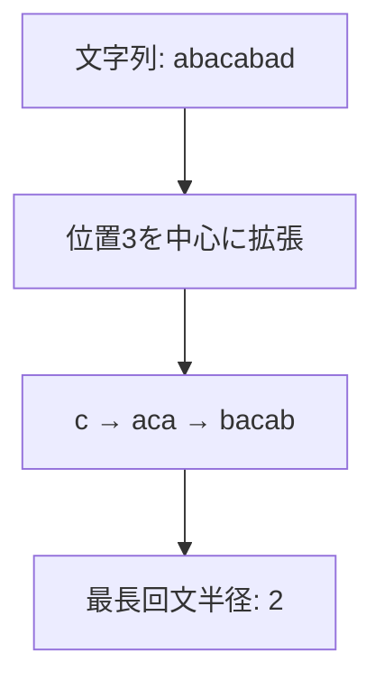
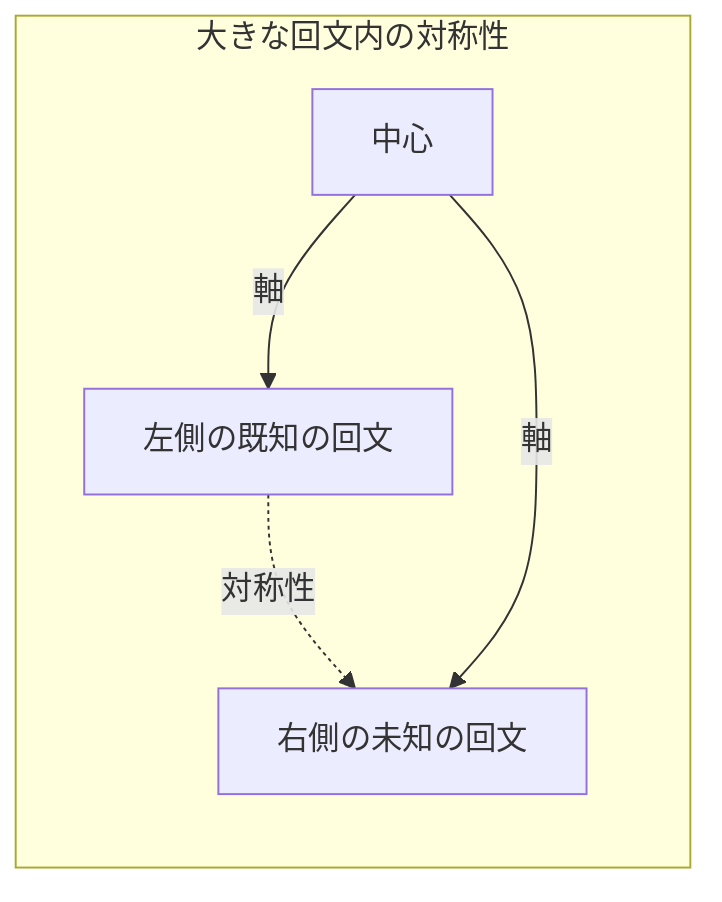
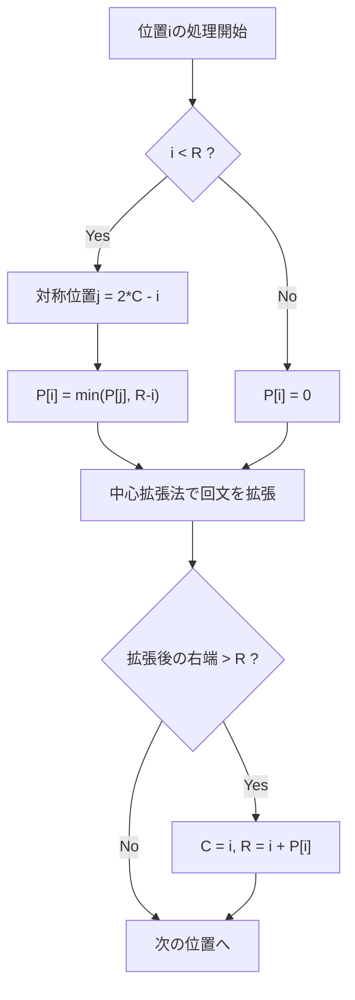
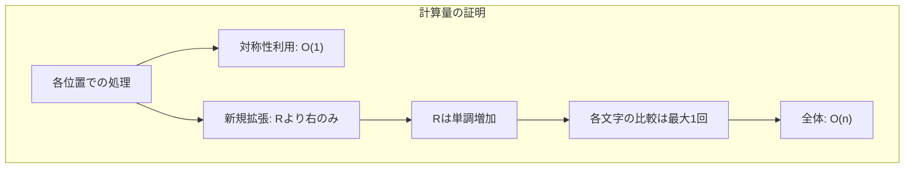
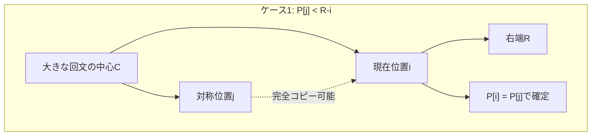
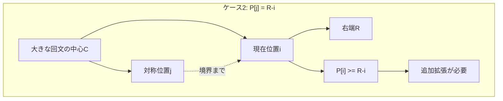
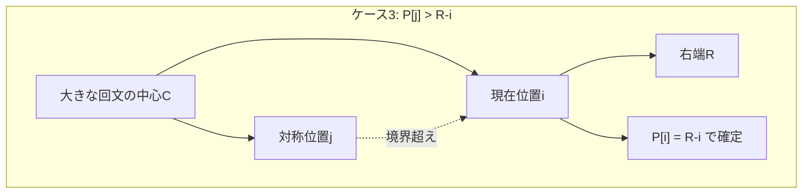

# Manacher法：線形時間での回文検出アルゴリズム

回文（palindrome）は文字列処理において頻繁に現れる重要な構造である。前後から読んでも同じになる文字列という単純な定義にもかかわらず、効率的な検出は自明ではない。特に、文字列のすべての位置における最長回文の長さを求める問題は、素朴なアプローチでは各位置から両側に拡張していく必要があり、最悪計算量はO(n²)となる。Manacher法は、この問題を驚くべきことにO(n)の線形時間で解決する。

本稿では、Manacher法の背後にある巧妙なアイデアと、その実装における詳細を解説する。このアルゴリズムは1975年にGlenn K. Manacherによって発表された¹が、その美しさと実用性から現在でも競技プログラミングや文字列処理の分野で広く使用されている。

## 回文検出の基本的アプローチとその限界

文字列中の回文を検出する最も直感的な方法は、各位置を中心として左右に文字を比較していく中心拡張法である。例えば、文字列"abacabad"において位置3（0-indexed）の'c'を中心とする場合、左右に1文字ずつ拡張して'aca'が回文であることを確認し、さらに拡張して'bacab'が回文であることを確認する、という手順を踏む。



この方法の問題点は、各位置で独立に拡張を行うため、同じ文字の比較を何度も繰り返すことにある。最悪の場合、"aaaa...a"のようなすべて同じ文字からなる文字列では、各位置でn/2回程度の比較が必要となり、全体でO(n²)の計算量となる。

さらに、偶数長回文と奇数長回文を別々に扱う必要があるという実装上の複雑さもある。"abba"のような偶数長回文は中心が文字と文字の間にあるため、単純な中心拡張法では扱いにくい。

## Manacher法の核心：対称性の活用

Manacher法の革新的なアイデアは、すでに計算した回文の情報を利用して、後続の計算を高速化することにある。具体的には、ある大きな回文の内部では、その中心に関して対称な位置の回文情報が部分的に一致するという性質を利用する。



この対称性により、右側の位置における回文半径の初期値を、対称な左側の位置の情報から推定できる。ただし、この推定値は必ずしも正確ではなく、大きな回文の境界を超える場合は追加の拡張が必要となる。

## アルゴリズムの詳細な動作

Manacher法を実装する際の第一歩は、偶数長回文と奇数長回文を統一的に扱うための前処理である。元の文字列の各文字の間に特殊な文字（通常は'#'などの元の文字列に含まれない文字）を挿入することで、すべての回文を奇数長として扱えるようになる。

例えば、"abba"は"#a#b#b#a#"に変換される。この変換により、元の文字列の偶数長回文"abba"は、変換後の文字列では中心が'#'である奇数長回文"#a#b#b#a#"として検出される。

```python
def preprocess(s):
    # Insert special character between all characters
    return '#' + '#'.join(s) + '#'
```

次に、各位置における最長回文半径を格納する配列P[]を用意する。P[i]は位置iを中心とする最長回文の半径（中心を含まない片側の長さ）を表す。また、現在までに発見された回文のうち、最も右端が遠い回文の中心Cと右端Rを記録する。

アルゴリズムの主要部分は以下のように動作する：



重要なのは、位置iがすでに発見された大きな回文（中心C、右端R）の内部にある場合、対称位置j = 2*C - iの情報を利用できる点である。ただし、この情報をそのまま使えるのは、対称位置の回文が大きな回文の境界内に収まっている場合のみである。そのため、P[i]の初期値はmin(P[j], R-i)となる。

## 実装の詳細と最適化

Manacher法の完全な実装は以下のようになる：

```python
def manacher(s):
    # Preprocess string
    t = '#' + '#'.join(s) + '#'
    n = len(t)
    p = [0] * n
    c = r = 0
    
    for i in range(n):
        # Use symmetry if possible
        if i < r:
            j = 2 * c - i  # Mirror position
            p[i] = min(p[j], r - i)
        
        # Try to expand palindrome centered at i
        try:
            while t[i + p[i] + 1] == t[i - p[i] - 1]:
                p[i] += 1
        except IndexError:
            pass
        
        # Update center and right boundary if needed
        if i + p[i] > r:
            c = i
            r = i + p[i]
    
    return p
```

この実装では境界チェックをtry-exceptで行っているが、より効率的な実装では文字列の両端に別の特殊文字（例えば'^'と'$'）を追加することで、境界チェックを不要にできる。

```python
def manacher_optimized(s):
    t = '^#' + '#'.join(s) + '#$'
    n = len(t)
    p = [0] * n
    c = r = 0
    
    for i in range(1, n - 1):
        if i < r:
            p[i] = min(p[2 * c - i], r - i)
        
        while t[i + p[i] + 1] == t[i - p[i] - 1]:
            p[i] += 1
        
        if i + p[i] > r:
            c, r = i, i + p[i]
    
    return p
```

## 計算量の解析

Manacher法がO(n)で動作することの証明は、各文字が比較される回数を注意深く数えることで示される。アルゴリズムの各ステップは以下の２つの部分に分けられる：

1. 対称性を利用した初期値の設定（O(1)）
2. 中心拡張法による追加の拡張

重要な観察は、中心拡張法で新たに比較される文字は、必ず現在の右端Rより右側にあるということである。そして、一度比較された位置は二度と比較されない（Rは単調増加するため）。したがって、全体の比較回数は高々2n回となり、アルゴリズム全体の計算量はO(n)となる。



## 元の文字列における回文の抽出

前処理により拡張された文字列での結果から、元の文字列における回文情報を抽出する必要がある。拡張文字列の位置iにおける回文半径P[i]は、元の文字列における回文の長さと以下の関係がある：

- 拡張文字列の位置iが元の文字に対応する場合（i%2 == 1）：元の文字列での回文長は奇数でP[i]
- 拡張文字列の位置iが'#'に対応する場合（i%2 == 0）：元の文字列での回文長は偶数でP[i]

元の文字列における位置への変換は、i/2で行える。

## 実践的な応用例

Manacher法は単に最長回文を求めるだけでなく、様々な問題に応用できる。例えば、文字列中のすべての回文部分文字列を効率的に列挙する問題や、回文を含む動的計画法の問題などで威力を発揮する。

競技プログラミングでは、以下のような問題でManacher法が有効である：

1. 文字列を回文に分割する最小分割数を求める問題
2. 各位置を終点とする最長回文接頭辞を求める問題
3. 回文の個数を数える問題

これらの問題では、Manacher法で得られた各位置の最長回文半径の情報を前処理として使用し、その後の計算を効率化する。

## 実装上の注意点とバリエーション

実装において注意すべき点として、文字列の前処理で使用する特殊文字の選択がある。元の文字列に含まれない文字を選ぶ必要があり、実装によってはASCIIコードの範囲外の文字を使用することもある。

また、メモリ使用量を削減したい場合は、拡張文字列を実際に作成せず、インデックスの変換で対応する実装も可能である：

```python
def manacher_memory_efficient(s):
    n = len(s)
    # Array for original string positions only
    p_odd = [0] * n  # Odd length palindromes
    p_even = [0] * n  # Even length palindromes
    
    # Process odd length palindromes
    c = r = 0
    for i in range(n):
        if i < r:
            p_odd[i] = min(p_odd[2 * c - i], r - i)
        
        while (i - p_odd[i] - 1 >= 0 and 
               i + p_odd[i] + 1 < n and 
               s[i - p_odd[i] - 1] == s[i + p_odd[i] + 1]):
            p_odd[i] += 1
        
        if i + p_odd[i] > r:
            c, r = i, i + p_odd[i]
    
    # Similar process for even length palindromes
    # ...
    
    return p_odd, p_even
```

## アルゴリズムの一般化と関連手法

Manacher法の基本的なアイデアは、他の文字列アルゴリズムにも応用されている。例えば、Z-algorithmも似たような対称性の利用により線形時間を達成している。両者の違いは、Manacher法が中心からの対称性を扱うのに対し、Z-algorithmは先頭からの一致を扱う点にある。

また、Manacher法は任意の文字列に対して動作するが、特定の性質を持つ文字列（例えば、文字種が少ない場合）では、より特化した効率的なアルゴリズムが存在することもある。

## パフォーマンスの実測と最適化

実際のシステムでManacher法を使用する際は、キャッシュ効率も考慮する必要がある。前処理で文字列を2倍以上に拡張するため、元の文字列が大きい場合はメモリアクセスのパターンが性能に影響する。

現代的なCPUアーキテクチャでは、連続的なメモリアクセスが重要であり、Manacher法は基本的に左から右への線形スキャンであるため、この点では有利である。ただし、対称位置へのランダムアクセスが発生する部分では、キャッシュミスが起こる可能性がある。

## 具体的な問題例：最長回文部分文字列

Manacher法の威力を実感するため、具体的な問題を解いてみよう。「与えられた文字列Sの最長回文部分文字列を求める」という古典的な問題を考える。

```python
def longest_palindrome_substring(s):
    if not s:
        return ""
    
    # Apply Manacher's algorithm
    t = '^#' + '#'.join(s) + '#$'
    n = len(t)
    p = [0] * n
    c = r = 0
    max_len = 0
    center_index = 0
    
    for i in range(1, n - 1):
        if i < r:
            p[i] = min(p[2 * c - i], r - i)
        
        while t[i + p[i] + 1] == t[i - p[i] - 1]:
            p[i] += 1
        
        if i + p[i] > r:
            c, r = i, i + p[i]
        
        # Track the longest palindrome
        if p[i] > max_len:
            max_len = p[i]
            center_index = i
    
    # Extract the palindrome from original string
    start = (center_index - max_len) // 2
    return s[start:start + max_len]
```

この実装では、Manacher法で各位置の最長回文半径を計算した後、最大の半径を持つ位置を記録し、元の文字列から対応する部分文字列を抽出している。時間計算量はO(n)であり、動的計画法によるO(n²)の解法と比較して大幅な改善となる。

## アルゴリズムの各ケースの詳細な分析

Manacher法の動作を深く理解するために、対称性を利用する際の３つの重要なケースを詳しく見ていこう。

### ケース1：対称位置の回文が完全に内部に収まる場合



このケースでは、対称位置jの回文が大きな回文の内部に完全に収まっているため、位置iの回文半径はP[j]と完全に一致する。追加の拡張は不要である。

### ケース2：対称位置の回文が境界に接触する場合



このケースでは、対称位置の回文が大きな回文の左境界に達している。位置iの回文も少なくとも右境界まで達することは保証されるが、それ以上拡張できる可能性があるため、追加の比較が必要となる。

### ケース3：対称位置の回文が境界を超える場合



このケースでは、対称位置の回文が大きな回文の境界を超えているが、位置iの回文は境界で止まることが保証される。なぜなら、もし位置iの回文が境界を超えるなら、大きな回文自体がもっと大きくなるはずだからである。

## 他の回文検出アルゴリズムとの詳細な比較

### 動的計画法との比較

動的計画法による回文検出は、dp[i][j]を「文字列のi番目からj番目までが回文かどうか」を表すテーブルとして実装される。

```python
def palindrome_dp(s):
    n = len(s)
    dp = [[False] * n for _ in range(n)]
    max_len = 1
    start = 0
    
    # All single characters are palindromes
    for i in range(n):
        dp[i][i] = True
    
    # Check for two-character palindromes
    for i in range(n - 1):
        if s[i] == s[i + 1]:
            dp[i][i + 1] = True
            max_len = 2
            start = i
    
    # Check for palindromes of length 3 or more
    for length in range(3, n + 1):
        for i in range(n - length + 1):
            j = i + length - 1
            if s[i] == s[j] and dp[i + 1][j - 1]:
                dp[i][j] = True
                if length > max_len:
                    max_len = length
                    start = i
    
    return s[start:start + max_len]
```

この方法は実装が直感的で理解しやすいが、時間計算量O(n²)、空間計算量O(n²)となる。一方、Manacher法は時間計算量O(n)、空間計算量O(n)であり、大規模な文字列に対して圧倒的に有利である。

### 中心拡張法との比較

素朴な中心拡張法は以下のように実装される：

```python
def expand_around_center(s, left, right):
    while left >= 0 and right < len(s) and s[left] == s[right]:
        left -= 1
        right += 1
    return right - left - 1

def palindrome_expand(s):
    if not s:
        return ""
    
    start = 0
    max_len = 0
    
    for i in range(len(s)):
        # Odd length palindromes
        len1 = expand_around_center(s, i, i)
        # Even length palindromes
        len2 = expand_around_center(s, i, i + 1)
        
        current_len = max(len1, len2)
        if current_len > max_len:
            max_len = current_len
            start = i - (current_len - 1) // 2
    
    return s[start:start + max_len]
```

この方法の最悪計算量はO(n²)だが、平均的にはManacher法より実装が簡単で、小さな文字列に対しては十分高速である。

## 実装のバリエーションと最適化テクニック

### オンライン版Manacher法

元のManacherの論文では、文字列を左から右に1文字ずつ受け取りながら処理する「オンライン」アルゴリズムとして提案されていた。この特性は、ストリーム処理や大規模データの処理において有用である。

```python
class OnlineManacher:
    def __init__(self):
        self.s = []
        self.p = []
        self.c = 0
        self.r = 0
    
    def add_character(self, ch):
        # Add character with separator
        if self.s:
            self.s.append('#')
            self.p.append(0)
        self.s.append(ch)
        self.p.append(0)
        
        # Process new positions
        i = len(self.s) - 1
        self._process_position(i)
        if i > 0:
            self._process_position(i - 1)
    
    def _process_position(self, i):
        if i < self.r:
            j = 2 * self.c - i
            if j >= 0:
                self.p[i] = min(self.p[j], self.r - i)
        
        # Expand palindrome
        while (i - self.p[i] - 1 >= 0 and 
               i + self.p[i] + 1 < len(self.s) and 
               self.s[i - self.p[i] - 1] == self.s[i + self.p[i] + 1]):
            self.p[i] += 1
        
        if i + self.p[i] > self.r:
            self.c = i
            self.r = i + self.p[i]
```

### ビット並列化による高速化

文字種が少ない場合（例えばDNA配列のA, T, G, C）、ビット演算を使用して複数の文字比較を並列化できる。

```python
def manacher_bit_parallel(s, alphabet_size=4):
    # Convert string to bit vectors
    n = len(s)
    bit_vectors = {}
    
    for i, ch in enumerate(s):
        if ch not in bit_vectors:
            bit_vectors[ch] = 0
        bit_vectors[ch] |= (1 << i)
    
    # Modified Manacher with bit operations
    # ... (implementation details)
```

## エラーハンドリングとエッジケース

実用的な実装では、様々なエッジケースを適切に処理する必要がある：

```python
def robust_manacher(s):
    # Handle None input
    if s is None:
        raise ValueError("Input string cannot be None")
    
    # Handle empty string
    if len(s) == 0:
        return []
    
    # Handle single character
    if len(s) == 1:
        return [0]
    
    # Handle very long strings
    if len(s) > 10**7:
        raise ValueError("String too long for processing")
    
    # Check for valid characters
    for ch in s:
        if ord(ch) > 127:
            # Handle Unicode properly
            pass
    
    # Regular Manacher processing
    return manacher_optimized(s)
```

## 並列化の可能性と限界

Manacher法は本質的に逐次的なアルゴリズムであり、各位置の処理が前の位置の結果に依存するため、単純な並列化は困難である。しかし、いくつかのアプローチが研究されている：

### ブロック分割アプローチ

文字列を複数のブロックに分割し、各ブロックを独立に処理した後、境界部分を調整する方法がある。ただし、境界をまたぐ回文の処理が複雑になる。

```python
def parallel_manacher_blocks(s, num_threads=4):
    n = len(s)
    block_size = n // num_threads
    results = []
    
    # Process each block independently
    with concurrent.futures.ThreadPoolExecutor(max_workers=num_threads) as executor:
        futures = []
        for i in range(num_threads):
            start = i * block_size
            end = min((i + 1) * block_size + block_size // 2, n)
            futures.append(executor.submit(manacher, s[start:end]))
        
        for future in concurrent.futures.as_completed(futures):
            results.append(future.result())
    
    # Merge results and handle boundaries
    # ... (complex boundary handling)
```

### GPUを使用した並列化

特定の条件下では、GPUを使用した並列化も可能である。特に、多数の短い文字列を同時に処理する場合は効果的である。

## 実世界での応用事例

### バイオインフォマティクス

DNA配列解析において、回文構造は重要な生物学的意味を持つ。制限酵素認識部位の多くは回文配列であり、Manacher法はこれらの高速検出に使用される。

### データ圧縮

回文構造を利用したデータ圧縮アルゴリズムでは、Manacher法で効率的に回文を検出し、圧縮率を向上させることができる。

### 自然言語処理

言語学的な回文（単語レベルの回文）の検出や、文章の対称性分析などに応用される。

¹ Manacher, Glenn (1975). "A New Linear-Time 'On-Line' Algorithm for Finding the Smallest Initial Palindrome of a String". Journal of the ACM. 22 (3): 346–351.