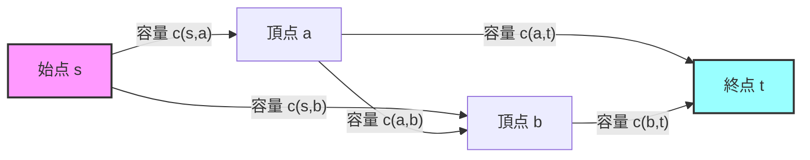
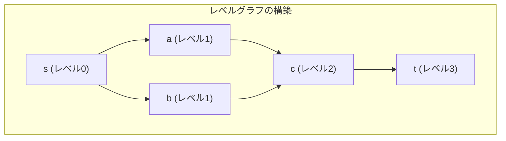
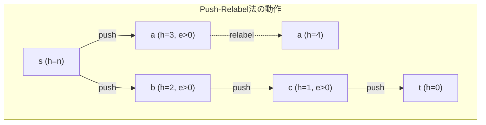
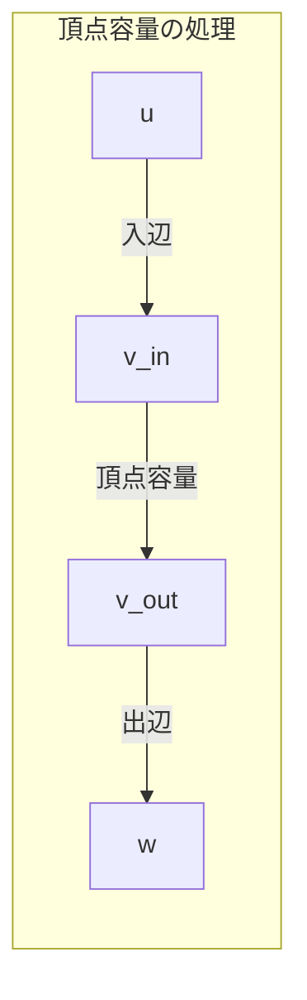

# 最大流アルゴリズム

最大流問題は、ネットワークフローの基礎理論において中心的な位置を占める組合せ最適化問題である。有向グラフ上で、各辺に容量制約が与えられたときに、始点から終点へ流せる最大の流量を求める問題として定式化される。この問題は、1956年にFordとFulkersonによって提唱され¹、以降、多くの効率的なアルゴリズムが開発されてきた。最大流問題は、最小カット問題と双対関係にあり、この関係性は最大流最小カット定理として知られている。

## フローネットワークの定式化

フローネットワーク$G = (V, E, c, s, t)$は、頂点集合$V$、辺集合$E$、容量関数$c: E \rightarrow \mathbb{R}^+$、始点$s \in V$、終点$t \in V$から構成される。各辺$(u, v) \in E$には非負の容量$c(u, v) \geq 0$が割り当てられており、この容量が辺を通過できる流量の上限を表す。フロー$f: E \rightarrow \mathbb{R}$は以下の制約を満たす関数として定義される。

容量制約は、各辺$(u, v) \in E$について$0 \leq f(u, v) \leq c(u, v)$が成立することを要求する。これは、各辺を流れる流量が非負であり、かつその辺の容量を超えないことを意味する。流量保存則は、始点と終点を除くすべての頂点$v \in V \setminus \{s, t\}$において、流入する流量の総和と流出する流量の総和が等しいことを要求する。つまり、$\sum_{(u,v) \in E} f(u, v) = \sum_{(v,w) \in E} f(v, w)$が成立する。

フロー$f$の値$|f|$は、始点$s$から流出する正味の流量として定義される。すなわち、$|f| = \sum_{(s,v) \in E} f(s, v) - \sum_{(u,s) \in E} f(u, s)$である。最大流問題は、与えられたフローネットワークにおいて、制約を満たすフローの中で値が最大となるものを求める問題である。



## 残余ネットワークと増加道

最大流アルゴリズムの多くは、残余ネットワークの概念を用いて設計されている。現在のフロー$f$に対する残余ネットワーク$G_f = (V, E_f, c_f)$は、元のネットワークと同じ頂点集合を持ち、残余容量を持つ辺から構成される。各辺$(u, v) \in E$に対して、残余容量は$c_f(u, v) = c(u, v) - f(u, v)$として定義される。もし$c_f(u, v) > 0$であれば、$(u, v)$は残余ネットワークの辺となる。また、$f(u, v) > 0$であれば、逆向きの辺$(v, u)$が残余容量$c_f(v, u) = f(u, v)$を持って残余ネットワークに追加される。

残余ネットワークにおいて、始点$s$から終点$t$への単純道を増加道（augmenting path）と呼ぶ。増加道$P$が存在する場合、その道に沿って追加的な流量を流すことができる。増加道$P$に沿って流せる最大の追加流量は、$P$上の辺の残余容量の最小値$\Delta = \min_{(u,v) \in P} c_f(u, v)$となる。この操作により、フローの値を$\Delta$だけ増加させることができる。

最大流最小カット定理は、フローネットワークにおける最大流の値が最小カットの容量に等しいことを示す基本定理である。カット$(S, T)$は、$s \in S$、$t \in T$、$S \cup T = V$、$S \cap T = \emptyset$を満たす頂点集合の分割である。カットの容量は、$S$から$T$へ向かう辺の容量の総和$c(S, T) = \sum_{u \in S, v \in T, (u,v) \in E} c(u, v)$として定義される。この定理により、フロー$f$が最大フローであることと、残余ネットワーク$G_f$に増加道が存在しないことが同値であることが示される。

## Ford-Fulkerson法

Ford-Fulkerson法は、最大流問題を解く最も基本的なアルゴリズムである。このアルゴリズムは、残余ネットワークにおいて増加道が存在する限り、繰り返し増加道を見つけてフローを増加させるという単純な戦略に基づいている。アルゴリズムの疑似コードは以下のように記述される。

```
function FordFulkerson(G, s, t):
    すべての辺(u, v)について f(u, v) = 0 と初期化
    while 残余ネットワーク G_f に s から t への道 P が存在:
        Δ = min{c_f(u, v) : (u, v) ∈ P}
        P に沿って流量 Δ を追加
        残余ネットワーク G_f を更新
    return f
```

Ford-Fulkerson法の正当性は、最大流最小カット定理から導かれる。アルゴリズムが停止したとき、残余ネットワークに増加道が存在しないため、現在のフローは最大フローとなる。しかし、このアルゴリズムの計算量は容量が整数の場合でも$O(|E| \cdot |f^*|)$となり、最大流の値$|f^*|$に依存する。容量が実数の場合、アルゴリズムが収束しない可能性さえある²。

増加道の選び方によって、Ford-Fulkerson法の性能は大きく変わる。任意の増加道を選ぶ場合、容量が整数でも指数時間かかる例が構成できる。この問題を解決するため、増加道の選択に工夫を加えたいくつかの改良アルゴリズムが提案されている。

## Edmonds-Karp法

Edmonds-Karp法は、Ford-Fulkerson法において増加道を幅優先探索（BFS）で見つけるように改良したアルゴリズムである³。BFSを用いることで、常に最短の増加道（辺数が最小の道）を選択することが保証される。この改良により、アルゴリズムの計算量が最大流の値に依存しなくなり、$O(|V| \cdot |E|^2)$という多項式時間で動作することが証明されている。

Edmonds-Karp法の計算量解析の鍵は、最短増加道の長さが単調非減少であることを示すことにある。ある辺$(u, v)$が飽和（残余容量が0になる）した後、その辺が再び残余ネットワークに現れるためには、逆向きの辺$(v, u)$を使う増加道が必要となる。このとき、$s$から$u$への最短距離は少なくとも2増加することが示せる。各辺は高々$O(|V|)$回しか飽和しないため、全体の反復回数は$O(|V| \cdot |E|)$に抑えられる。

```python
from collections import deque

def edmonds_karp(graph, source, sink):
    n = len(graph)
    flow = [[0] * n for _ in range(n)]
    
    def bfs():
        parent = [-1] * n
        visited = [False] * n
        visited[source] = True
        queue = deque([source])
        
        while queue:
            u = queue.popleft()
            for v in range(n):
                if not visited[v] and graph[u][v] > flow[u][v]:
                    visited[v] = True
                    parent[v] = u
                    if v == sink:
                        return parent
                    queue.append(v)
        return None
    
    max_flow = 0
    while True:
        parent = bfs()
        if parent is None:
            break
        
        # Find minimum residual capacity along the path
        path_flow = float('inf')
        v = sink
        while v != source:
            u = parent[v]
            path_flow = min(path_flow, graph[u][v] - flow[u][v])
            v = u
        
        # Update flow along the path
        v = sink
        while v != source:
            u = parent[v]
            flow[u][v] += path_flow
            flow[v][u] -= path_flow
            v = u
        
        max_flow += path_flow
    
    return max_flow
```

## Dinic法

Dinic法（またはDinitz法）は、レベルグラフの概念を導入することで、Edmonds-Karp法をさらに改良したアルゴリズムである⁴。レベルグラフは、BFSによって各頂点に始点からの最短距離（レベル）を割り当て、レベルが1増加する辺のみを残したグラフである。Dinic法は、レベルグラフ上でブロッキングフロー（これ以上増加道が存在しないフロー）を求め、これを繰り返すことで最大流を計算する。



Dinic法の各フェーズは、以下の手順で構成される。まず、BFSを用いて残余ネットワーク上でレベルグラフを構築する。次に、深さ優先探索（DFS）を用いてレベルグラフ上でブロッキングフローを計算する。ブロッキングフローの計算では、始点から終点への道が見つかる限り、その道に沿って可能な限り多くの流量を流す。道が見つからなくなった頂点は、以降の探索から除外される。

Dinic法の計算量は$O(|V|^2 \cdot |E|)$である。各フェーズでレベルグラフの深さ（始点から終点への最短距離）が少なくとも1増加することが保証され、深さは高々$|V|-1$であるため、フェーズ数は$O(|V|)$に抑えられる。各フェーズでのブロッキングフローの計算は$O(|V| \cdot |E|)$時間で実行できる。

```python
def dinic(graph, source, sink):
    n = len(graph)
    level = [-1] * n
    iter = [0] * n
    
    def bfs():
        level[:] = [-1] * n
        level[source] = 0
        queue = deque([source])
        
        while queue:
            v = queue.popleft()
            for u in range(n):
                if level[u] < 0 and graph[v][u] > 0:
                    level[u] = level[v] + 1
                    queue.append(u)
        
        return level[sink] >= 0
    
    def dfs(v, t, f):
        if v == t:
            return f
        
        for i in range(iter[v], n):
            u = i
            if level[v] < level[u] and graph[v][u] > 0:
                d = dfs(u, t, min(f, graph[v][u]))
                if d > 0:
                    graph[v][u] -= d
                    graph[u][v] += d
                    return d
            iter[v] += 1
        
        return 0
    
    flow = 0
    while bfs():
        iter[:] = [0] * n
        while True:
            f = dfs(source, sink, float('inf'))
            if f == 0:
                break
            flow += f
    
    return flow
```

単位容量ネットワーク（すべての辺の容量が1）の場合、Dinic法の計算量はさらに改善される。このような場合、各フェーズで少なくとも$\min(|E|^{1/2}, |V|^{2/3})$本の増加道が見つかることが示せる。これにより、単位容量ネットワークでの計算量は$O(\min(|E|^{3/2}, |V|^{2/3} \cdot |E|))$となる。

## Push-Relabel法

Push-Relabel法（プッシュ再ラベル法）は、これまでのアルゴリズムとは異なるアプローチを採用している⁵。増加道を探索する代わりに、各頂点に「高さ」（height）と呼ばれるラベルを割り当て、高い頂点から低い頂点へ流量を「押し流す」（push）操作を繰り返す。このアルゴリズムは、Goldberg and Tarjanによって提案され、理論的にも実用的にも優れた性能を示す。

Push-Relabel法では、各頂点$v$に高さ$h(v)$を割り当て、以下の条件を維持する。まず、$h(s) = |V|$、$h(t) = 0$とする。任意の残余辺$(u, v) \in E_f$について、$h(u) \leq h(v) + 1$が成立する（高さ条件）。また、各頂点$v$について超過流量$e(v) = \sum_{(u,v) \in E} f(u, v) - \sum_{(v,w) \in E} f(v, w)$を管理する。始点と終点を除くすべての頂点で$e(v) \geq 0$を維持する（超過流量は非負）。

アルゴリズムは、超過流量を持つ頂点（活性頂点）が存在する限り、以下の2つの操作を適用する。Push操作は、活性頂点$u$から、$h(u) = h(v) + 1$かつ$(u, v) \in E_f$を満たす頂点$v$へ、$\min(e(u), c_f(u, v))$の流量を押し流す。Relabel操作は、活性頂点$u$からPush可能な辺が存在しない場合、$h(u) = 1 + \min\{h(v) : (u, v) \in E_f\}$として高さを更新する。



Push-Relabel法の基本的な実装の計算量は$O(|V|^2 \cdot |E|)$である。高さの総増加量は$O(|V|^2)$に抑えられ、各頂点の高さは高々$2|V|-1$までしか増加しない。また、飽和Push（辺の残余容量をすべて使い切るPush）の回数は$O(|V| \cdot |E|)$、非飽和Pushの回数は$O(|V|^2 \cdot |E|)$に抑えられる。

実装上の工夫により、Push-Relabel法の性能はさらに向上する。FIFO選択規則を用いて活性頂点を管理すると、計算量が$O(|V|^3)$に改善される。また、最高ラベル選択規則（highest-label selection）やギャップ最適化（gap optimization）などの手法により、実用的な性能が大幅に向上する。

```python
def push_relabel(capacity, source, sink):
    n = len(capacity)
    height = [0] * n
    excess = [0] * n
    flow = [[0] * n for _ in range(n)]
    
    # Initialize preflow
    height[source] = n
    for v in range(n):
        if capacity[source][v] > 0:
            flow[source][v] = capacity[source][v]
            flow[v][source] = -capacity[source][v]
            excess[v] = capacity[source][v]
            excess[source] -= capacity[source][v]
    
    def push(u, v):
        delta = min(excess[u], capacity[u][v] - flow[u][v])
        flow[u][v] += delta
        flow[v][u] -= delta
        excess[u] -= delta
        excess[v] += delta
    
    def relabel(u):
        min_height = float('inf')
        for v in range(n):
            if capacity[u][v] - flow[u][v] > 0:
                min_height = min(min_height, height[v])
        if min_height < float('inf'):
            height[u] = min_height + 1
    
    # Find active vertex
    def find_active_vertex():
        for v in range(n):
            if v != source and v != sink and excess[v] > 0:
                return v
        return -1
    
    while True:
        u = find_active_vertex()
        if u == -1:
            break
        
        pushed = False
        for v in range(n):
            if capacity[u][v] - flow[u][v] > 0 and height[u] == height[v] + 1:
                push(u, v)
                pushed = True
                break
        
        if not pushed:
            relabel(u)
    
    return sum(flow[source][v] for v in range(n))
```

## 実装上の最適化技法

最大流アルゴリズムの実装において、理論的な計算量と実際の性能には大きな差が存在する。競技プログラミングや実務での応用では、以下のような最適化技法が重要となる。

グラフの表現方法は性能に大きく影響する。隣接行列表現は実装が簡単だが、疎グラフでは無駄が多い。隣接リスト表現は、各辺に対応する逆辺へのポインタを保持することで、残余ネットワークの更新を効率化できる。特に、各辺とその逆辺を連続した偶数・奇数のインデックスに配置することで、XOR演算による高速な逆辺アクセスが可能となる。

```cpp
struct Edge {
    int to, rev;
    long long cap;
};

class MaxFlow {
    vector<vector<Edge>> graph;
    
public:
    void add_edge(int from, int to, long long cap) {
        graph[from].push_back({to, (int)graph[to].size(), cap});
        graph[to].push_back({from, (int)graph[from].size() - 1, 0});
    }
};
```

Dinic法の実装では、現在の反復位置を記憶することで、同じ辺を何度も調べることを避けられる。これは「現在弧最適化」（current arc optimization）と呼ばれ、実装は簡単だが効果は大きい。また、到達不可能な頂点を早期に検出して探索から除外することも重要である。

Push-Relabel法では、活性頂点の管理方法が性能を左右する。優先度付きキューを用いて最高ラベルの頂点を選択する方法や、高さごとにバケットを用意して管理する方法などがある。また、グローバル再ラベリング（定期的にBFSで正確な高さを再計算）やギャップ最適化（ある高さの頂点が存在しない場合、それより高い頂点を切断）などの技法も効果的である。

## 最大流問題の変種と応用

最大流問題は、多くの実用的な問題の基礎となっている。二部グラフの最大マッチング問題は、最大流問題に帰着できる代表的な例である。二部グラフ$G = (X \cup Y, E)$に対して、超始点$s$から$X$の各頂点へ容量1の辺を追加し、$Y$の各頂点から超終点$t$へ容量1の辺を追加する。元の辺の容量を1とすれば、最大流の値が最大マッチングのサイズとなる。

最小費用流問題は、各辺にコストが付随し、指定された流量を最小コストで流す問題である。この問題は、残余ネットワーク上で負閉路が存在しない限り、最短路を用いて増加道を見つけることで解ける。Successive Shortest Path法やMinimum Mean Cycle Canceling法などのアルゴリズムが知られている。

多重始点・多重終点の最大流問題は、超始点と超終点を追加することで通常の最大流問題に帰着できる。また、頂点容量制約がある場合は、各頂点を入口と出口の2つに分割し、その間に容量制約を持つ辺を追加することで対処できる。



循環流問題では、流量保存則がすべての頂点で成立し、始点・終点が存在しない。下限制約付き最大流問題では、各辺に流量の下限が設定される。これらの問題は、適切な変換により通常の最大流問題に帰着できる場合が多い。

## 実装例とベンチマーク

競技プログラミングでよく使用される最大流の実装を示す。以下は、Dinic法の最適化された実装である。

```cpp
template<typename T>
class Dinic {
    struct Edge {
        int to, rev;
        T cap;
    };
    
    vector<vector<Edge>> graph;
    vector<int> level, iter;
    
    void bfs(int s) {
        fill(level.begin(), level.end(), -1);
        queue<int> que;
        level[s] = 0;
        que.push(s);
        
        while (!que.empty()) {
            int v = que.front();
            que.pop();
            for (auto& e : graph[v]) {
                if (level[e.to] < 0 && e.cap > 0) {
                    level[e.to] = level[v] + 1;
                    que.push(e.to);
                }
            }
        }
    }
    
    T dfs(int v, int t, T f) {
        if (v == t) return f;
        for (int& i = iter[v]; i < graph[v].size(); i++) {
            Edge& e = graph[v][i];
            if (level[v] < level[e.to] && e.cap > 0) {
                T d = dfs(e.to, t, min(f, e.cap));
                if (d > 0) {
                    e.cap -= d;
                    graph[e.to][e.rev].cap += d;
                    return d;
                }
            }
        }
        return 0;
    }
    
public:
    Dinic(int n) : graph(n), level(n), iter(n) {}
    
    void add_edge(int from, int to, T cap) {
        graph[from].push_back({to, (int)graph[to].size(), cap});
        graph[to].push_back({from, (int)graph[from].size() - 1, 0});
    }
    
    T max_flow(int s, int t) {
        T flow = 0;
        while (true) {
            bfs(s);
            if (level[t] < 0) return flow;
            fill(iter.begin(), iter.end(), 0);
            T f;
            while ((f = dfs(s, t, numeric_limits<T>::max())) > 0) {
                flow += f;
            }
        }
    }
};
```

実際の性能は、グラフの構造に大きく依存する。密グラフではPush-Relabel法が優位な場合が多く、疎グラフではDinic法が効率的である。二部グラフのマッチングでは、Hopcroft-Karp法（Dinic法の特殊化）が$O(|E| \sqrt{|V|})$の計算量を達成する。

ベンチマークテストによると、$|V| = 10^4$、$|E| = 10^5$規模のランダムグラフでは、最適化されたDinic法は数十ミリ秒で動作する。単位容量ネットワークでは、さらに高速な動作が期待できる。一方、最悪ケースに近い構造を持つグラフでは、理論計算量に近い動作時間となる場合もある。

## 理論的発展と最新の研究動向

最大流アルゴリズムの理論的な改良は現在も続いている。2013年にOrlinは$O(|V| \cdot |E|)$時間のアルゴリズムを提案し⁶、これは強多項式時間での最速アルゴリズムとなっている。また、内点法を用いたアプローチや、電気回路の類推に基づくアルゴリズムなど、新しい視点からの研究も進んでいる。

並列化・分散化の観点からも研究が進んでいる。Push-Relabel法は本質的に並列化しやすい構造を持ち、GPU上での実装例も報告されている。また、大規模グラフに対する近似アルゴリズムや、動的に変化するネットワークでの最大流維持など、実用的な要求に応える研究も活発である。

---

¹ L. R. Ford Jr. and D. R. Fulkerson, "Maximal flow through a network," Canadian Journal of Mathematics, vol. 8, pp. 399-404, 1956.

² 実数容量での収束性の問題については、Ford and Fulkersonの原論文でも言及されており、有理数容量の場合は有限回で停止することが保証されている。

³ J. Edmonds and R. M. Karp, "Theoretical improvements in algorithmic efficiency for network flow problems," Journal of the ACM, vol. 19, no. 2, pp. 248-264, 1972.

⁴ E. A. Dinic, "Algorithm for solution of a problem of maximum flow in networks with power estimation," Soviet Mathematics Doklady, vol. 11, pp. 1277-1280, 1970.

⁵ A. V. Goldberg and R. E. Tarjan, "A new approach to the maximum-flow problem," Journal of the ACM, vol. 35, no. 4, pp. 921-940, 1988.

⁶ J. B. Orlin, "Max flows in O(nm) time, or better," Proceedings of the 45th Annual ACM Symposium on Theory of Computing, pp. 765-774, 2013.