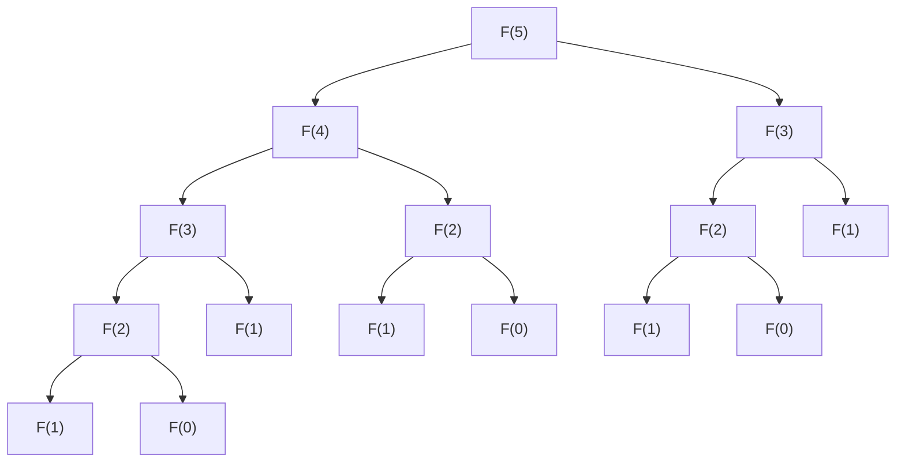
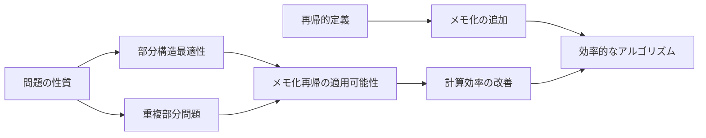
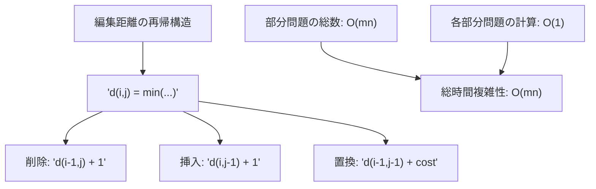
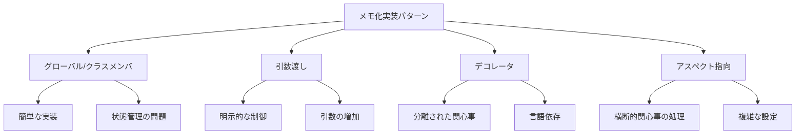
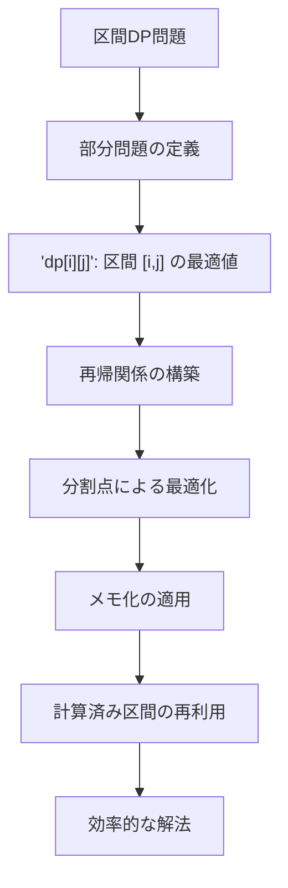
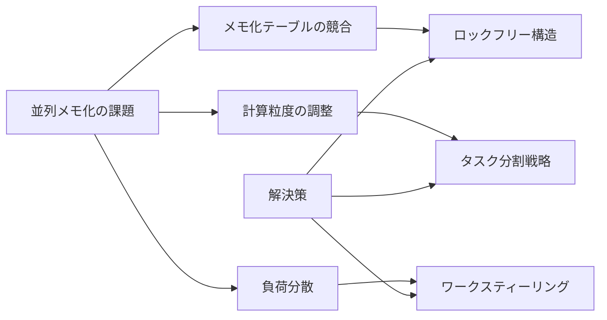

# メモ化再帰

メモ化再帰は、再帰的アルゴリズムの計算効率を劇的に改善する基本的かつ強力な最適化技法である。本質的には、計算済みの結果をキャッシュに保存し、同じ引数で再度呼び出された際にその結果を再利用することで、重複計算を排除する手法である。この技法は、1960年代にDonald Michieによって「メモ化（memoization）」として提案された[^1]概念であり、現代のアルゴリズム設計において欠かせない要素となっている。

メモ化再帰の理解には、まず再帰的アルゴリズムが持つ本質的な問題を認識する必要がある。多くの再帰的アルゴリズムは、同じ部分問題を何度も解くという非効率性を内包している。例えば、フィボナッチ数列の単純な再帰実装では、$F(n) = F(n-1) + F(n-2)$という定義に従って計算を行うが、$F(n-1)$を計算する過程で$F(n-2)$が計算され、その後独立に$F(n-2)$を再度計算することになる。この重複は指数的に増大し、計算時間を著しく増加させる。



上図は$F(5)$の計算における再帰呼び出しの木構造を示している。$F(3)$が2回、$F(2)$が3回計算されていることが分かる。この重複計算がメモ化によって解決される問題である。

## 動的計画法との関係性

メモ化再帰と動的計画法（Dynamic Programming）は密接に関連している。両者は同じ問題を解決するための異なるアプローチと見なすことができる。動的計画法が「ボトムアップ」アプローチで小さな部分問題から順に解いていくのに対し、メモ化再帰は「トップダウン」アプローチで必要な部分問題のみを解く。この違いは実装の簡潔性と計算効率のトレードオフをもたらす。

Richard Bellmanによって提唱された動的計画法[^2]は、最適性原理（Principle of Optimality）に基づいている。この原理は、最適解の部分解もまた最適であることを示している。メモ化再帰は、この原理を活用しつつ、再帰的な問題定義をそのまま実装に反映できる利点がある。多くの場合、問題の再帰的構造を理解することは、反復的な動的計画法の実装よりも直感的である。

メモ化再帰の理論的基盤は、部分構造最適性（Optimal Substructure）と重複部分問題（Overlapping Subproblems）という二つの性質にある。部分構造最適性は、問題の最適解が部分問題の最適解から構成されることを意味し、重複部分問題は、異なる計算経路が同じ部分問題に到達することを意味する。これらの性質を持つ問題に対して、メモ化再帰は特に効果的である。



## メモ化の実装技法

メモ化の実装には複数のアプローチが存在し、それぞれに利点と制約がある。最も基本的な実装は、ハッシュテーブルや配列を用いた明示的なキャッシュ管理である。関数の引数を鍵として、計算結果を値として保存する。この実装において重要なのは、引数の一意性を保証する鍵の設計である。

単一の整数引数を持つ関数の場合、配列を用いた実装が最も効率的である。配列のインデックスアクセスは$O(1)$時間で実行でき、メモリアクセスの局所性も良好である。一方、複数の引数を持つ関数や、引数の範囲が広い場合は、ハッシュテーブルを用いる必要がある。

```python
# Array-based memoization for single integer argument
def fibonacci_memo(n, memo=None):
    if memo is None:
        memo = [-1] * (n + 1)
    
    if n <= 1:
        return n
    
    if memo[n] != -1:
        return memo[n]
    
    memo[n] = fibonacci_memo(n - 1, memo) + fibonacci_memo(n - 2, memo)
    return memo[n]
```

複数引数の場合、タプルを鍵とするハッシュテーブルを使用する。Pythonの`functools.lru_cache`デコレータは、この実装を自動化する優れた例である。LRU（Least Recently Used）キャッシュは、メモリ使用量を制限しながらメモ化を実現する実用的なアプローチである。

メモ化の実装において考慮すべき重要な要素として、スレッドセーフティがある。並行実行環境では、複数のスレッドが同時にキャッシュにアクセスする可能性があり、適切な同期機構が必要となる。ただし、過度な同期はパフォーマンスの低下を招くため、読み取り専用のキャッシュや、スレッドローカルストレージの活用など、問題に応じた最適化が求められる。

## 計算複雑性の分析

メモ化再帰の計算複雑性分析は、元の再帰アルゴリズムとは大きく異なる。重要な観察は、各部分問題が最大で一度だけ計算されることである。したがって、時間複雑性は部分問題の総数と各部分問題の計算時間の積で表される。

フィボナッチ数列の例では、単純な再帰実装の時間複雑性が$O(2^n)$であるのに対し、メモ化を適用すると$O(n)$に改善される。これは、$F(0)$から$F(n)$までの各値が正確に一度だけ計算されるためである。空間複雑性は、再帰呼び出しスタックの深さ$O(n)$とメモ化テーブルのサイズ$O(n)$の和となる。

より複雑な例として、編集距離（Levenshtein距離）の計算を考える。二つの文字列$s_1$（長さ$m$）と$s_2$（長さ$n$）の編集距離を求める問題では、部分問題の総数は$O(mn)$である。各部分問題は$O(1)$時間で解けるため、メモ化再帰の時間複雑性は$O(mn)$となる。



メモ化の効果を定量的に評価するために、再帰呼び出しグラフの構造を分析することが有用である。グラフの頂点は部分問題を表し、辺は依存関係を表す。メモ化なしの場合、このグラフを深さ優先探索で走査することになり、同じ頂点を複数回訪問する。メモ化ありの場合、各頂点を最大一度だけ訪問するため、計算量はグラフのサイズに比例する。

## メモリ管理と最適化

メモ化再帰の実装において、メモリ使用量は重要な考慮事項である。理論的には全ての計算結果を保存することが最適だが、実際にはメモリ制約により現実的でない場合がある。この問題に対処するための複数の戦略が存在する。

第一の戦略は、キャッシュサイズの制限である。LRUキャッシュは最も一般的な手法で、最近使用されていないエントリを削除することで、メモリ使用量を一定以下に保つ。キャッシュサイズの選択は、問題の特性とアクセスパターンに依存する。局所性の高い問題では小さなキャッシュでも効果的だが、ランダムアクセスが多い問題では大きなキャッシュが必要となる。

第二の戦略は、計算結果の選択的な保存である。全ての部分問題の結果を保存する代わりに、再利用される可能性の高い結果のみを保存する。例えば、ナップサック問題では、容量が小さい部分問題の結果は頻繁に再利用されるため、優先的に保存する価値がある。

```python
# Selective memoization based on problem size
def knapsack_selective_memo(items, capacity, index=0, memo=None):
    if memo is None:
        memo = {}
    
    # Only memoize for smaller subproblems
    if capacity <= MEMO_THRESHOLD:
        key = (capacity, index)
        if key in memo:
            return memo[key]
    
    # Base cases and recursive logic
    result = compute_knapsack(items, capacity, index, memo)
    
    if capacity <= MEMO_THRESHOLD:
        memo[key] = result
    
    return result
```

第三の戦略は、メモリ効率的なデータ構造の使用である。例えば、ビットマップや圧縮技術を用いることで、メモリ使用量を削減できる。特に、ブール値や小さな整数値を返す問題では、この最適化が効果的である。

メモリアクセスパターンの最適化も重要である。キャッシュミスはパフォーマンスを大きく低下させるため、データの局所性を高める工夫が必要である。配列ベースのメモ化では、アクセスパターンに応じた配列のレイアウトを選択することで、キャッシュヒット率を向上させることができる。

## 実装パターンと設計指針

メモ化再帰の実装には、いくつかの確立されたパターンが存在する。これらのパターンを理解し、適切に選択することで、効率的で保守性の高いコードを書くことができる。

最も基本的なパターンは、グローバル変数やクラスメンバとしてメモ化テーブルを管理する方法である。この方法は実装が簡単だが、複数の呼び出し間でのデータ共有や、並行実行時の問題を引き起こす可能性がある。

```python
class MemoizedSolution:
    def __init__(self):
        self.memo = {}
    
    def solve(self, *args):
        if args in self.memo:
            return self.memo[args]
        
        # Compute result
        result = self._compute(*args)
        self.memo[args] = result
        return result
```

より洗練されたパターンは、関数の引数としてメモ化テーブルを渡す方法である。この方法は、呼び出し側がメモ化の制御を持つことができ、必要に応じてテーブルをリセットしたり、複数の独立した計算を実行したりできる。

デコレータパターンは、Pythonなどの言語で特に有用である。メモ化ロジックを関数から分離し、再利用可能なコンポーネントとして実装できる。このアプローチは、コードの可読性を高め、メモ化の有無を簡単に切り替えることを可能にする。



再帰関数の設計において重要なのは、基底条件（base case）の適切な定義である。メモ化を適用する前に、再帰関数が正しく終了することを確認する必要がある。また、引数の正規化も重要である。例えば、順序に依存しない引数は、常に同じ順序で渡されるように正規化することで、キャッシュヒット率を向上させることができる。

エラーハンドリングも考慮すべき重要な要素である。メモ化テーブルに不正な値が保存されると、その後の全ての計算に影響を与える可能性がある。例外が発生した場合のメモ化テーブルの状態管理や、部分的に計算された結果の扱いについて、明確な方針を持つ必要がある。

## 実際の問題での適用

メモ化再帰は、競技プログラミングや実務において幅広く適用される。ここでは、具体的な問題を通じて、メモ化再帰の適用方法と効果を詳しく見ていく。

### 最長共通部分列（LCS）問題

最長共通部分列問題は、二つの文字列から共通する部分列の中で最も長いものを見つける問題である。この問題は、バイオインフォマティクスにおけるDNA配列の比較や、バージョン管理システムにおける差分計算など、実用的な応用を持つ。

LCS問題の再帰的定義は以下の通りである：

$$
LCS(i, j) = \begin{cases}
0 & \text{if } i = 0 \text{ or } j = 0 \\
LCS(i-1, j-1) + 1 & \text{if } X[i] = Y[j] \\
\max(LCS(i-1, j), LCS(i, j-1)) & \text{otherwise}
\end{cases}
$$

この定義は自然に再帰的実装に変換できるが、多くの部分問題が重複して計算される。長さ$m$と$n$の文字列に対して、メモ化なしの時間複雑性は$O(2^{m+n})$だが、メモ化により$O(mn)$に改善される。

### 行列連鎖積問題

行列連鎖積問題は、複数の行列の積を計算する際の最適な括弧付けを見つける問題である。行列の積は結合法則を満たすが、計算順序によって必要な乗算回数が大きく異なる。

$n$個の行列$A_1, A_2, ..., A_n$があり、$A_i$のサイズが$p_{i-1} \times p_i$であるとき、$A_i$から$A_j$までの積の最小コストを$m[i,j]$とすると：

$$
m[i,j] = \begin{cases}
0 & \text{if } i = j \\
\min_{i \leq k < j} \{m[i,k] + m[k+1,j] + p_{i-1} \cdot p_k \cdot p_j\} & \text{if } i < j
\end{cases}
$$

この問題では、部分問題の数が$O(n^2)$であり、各部分問題の計算に$O(n)$時間かかるため、メモ化による時間複雑性は$O(n^3)$となる。

### 区間DP

区間DPは、配列の連続する部分列に関する最適化問題を解く一般的なパターンである。回文分割、最適二分探索木、括弧の対応など、多くの問題がこのパターンに従う。

区間DPの一般的な構造は、区間$[i, j]$に対する最適値を$dp[i][j]$として、より小さな区間から順に計算していくものである。メモ化再帰では、この計算順序を明示的に管理する必要がなく、必要な部分問題のみを解くことができる。



### ゲーム理論的問題

ゲーム理論的な問題、特に二人零和ゲームの最適戦略を求める問題では、メモ化再帰が強力なツールとなる。例えば、Nim型ゲームや石取りゲームなどでは、ゲームの状態を引数とする再帰関数で勝敗を判定できる。

これらの問題では、ゲームの状態空間が有限であり、同じ状態に複数の経路で到達する可能性があるため、メモ化が特に効果的である。また、ミニマックス法やアルファベータ枝刈りと組み合わせることで、より複雑なゲームの解析も可能となる。

## 高度な最適化技術

メモ化再帰の基本的な実装を超えて、さらなる最適化を行うための高度な技術が存在する。これらの技術は、問題の特性を深く理解し、アルゴリズムの限界を押し広げる際に重要となる。

### 状態圧縮

多くの動的計画法問題では、状態を表現するために大量のメモリが必要となる。状態圧縮は、ビット演算を用いて複数の情報を単一の整数に圧縮することで、メモリ使用量を削減する技術である。

巡回セールスマン問題（TSP）の動的計画法解法は、状態圧縮の典型例である。訪問済みの都市の集合を$n$ビットのビットマスクで表現することで、$2^n \times n$の状態空間で問題を解くことができる。

```python
# TSP with bitmask state compression
def tsp_memo(mask, pos, dist, n, memo):
    if mask == (1 << n) - 1:
        return dist[pos][0]
    
    if (mask, pos) in memo:
        return memo[(mask, pos)]
    
    ans = float('inf')
    for city in range(n):
        if mask & (1 << city) == 0:
            new_mask = mask | (1 << city)
            distance = dist[pos][city] + tsp_memo(new_mask, city, dist, n, memo)
            ans = min(ans, distance)
    
    memo[(mask, pos)] = ans
    return ans
```

### 遅延評価とメモ化の組み合わせ

遅延評価は、計算を必要になるまで遅らせる技術である。メモ化と組み合わせることで、不要な計算を避けつつ、必要な結果をキャッシュすることができる。この組み合わせは、特に無限列や大規模なデータ構造を扱う際に有効である。

Haskellなどの遅延評価言語では、この組み合わせが自然に実現される。命令型言語でも、ジェネレータやイテレータを用いることで、同様の効果を得ることができる。

### 並列メモ化

マルチコアプロセッサの普及により、並列計算の重要性が増している。メモ化再帰の並列化は、独立した部分問題を異なるスレッドで計算することで実現できる。ただし、メモ化テーブルへの並行アクセスには注意が必要である。

並列メモ化の実装では、ロックフリーデータ構造やソフトウェアトランザクショナルメモリ（STM）などの技術が活用される。また、計算の粒度を適切に調整することで、並列化のオーバーヘッドを最小化する必要がある。



### 永続データ構造との統合

永続データ構造は、更新時に以前のバージョンを保持するデータ構造である。メモ化と組み合わせることで、異なるバージョンの計算結果を効率的に管理できる。これは、バックトラッキングや分枝限定法などのアルゴリズムで特に有用である。

関数型プログラミングの文脈では、永続データ構造は自然にメモ化と組み合わされる。純粋関数と不変データ構造により、メモ化の正確性が保証される。

## 実装上の注意点と落とし穴

メモ化再帰の実装には、いくつかの一般的な落とし穴が存在する。これらを理解し、適切に対処することで、バグの少ない堅牢な実装を実現できる。

### 副作用のある関数のメモ化

メモ化は純粋関数、つまり同じ入力に対して常に同じ出力を返す関数に対してのみ安全に適用できる。副作用のある関数をメモ化すると、予期しない動作を引き起こす可能性がある。例えば、ファイルI/Oやネットワーク通信を含む関数、グローバル変数を変更する関数などは、メモ化に適さない。

### 浮動小数点数の扱い

浮動小数点数を引数とする関数のメモ化は、精度の問題により困難である。浮動小数点演算の丸め誤差により、理論的に同じ値であっても、異なるビット表現を持つ可能性がある。この問題に対処するには、適切な許容誤差を設定し、近似的な等価性判定を行う必要がある。

### メモリリークの防止

長時間実行されるプログラムでは、メモ化テーブルが無制限に成長し、メモリリークを引き起こす可能性がある。特に、再帰的なデータ構造を引数とする場合、メモ化テーブルがこれらの構造への参照を保持し続けることがある。弱参照（weak reference）やキャッシュサイズの制限により、この問題を緩和できる。

### 再帰深度の制限

多くのプログラミング言語では、再帰呼び出しの深さに制限がある。メモ化により計算効率は改善されるが、再帰深度の問題は解決されない。深い再帰が必要な問題では、反復的な実装への変換や、末尾再帰最適化の活用を検討する必要がある。

メモ化再帰は、アルゴリズム設計における強力なツールである。再帰的な問題定義の直感性を保ちながら、動的計画法と同等の効率性を実現する。適切に適用することで、指数時間アルゴリズムを多項式時間に改善し、実用的な問題解決を可能にする。その実装には様々な考慮事項があるが、基本原理を理解し、問題の特性に応じた最適化を行うことで、効率的で保守性の高いコードを書くことができる。計算機科学の発展とともに、メモ化再帰の技術も進化を続けており、並列計算や関数型プログラミングとの融合により、新たな可能性が開かれている。

[^1]: Michie, Donald (1968). "Memo Functions and Machine Learning". Nature. 218 (5136): 19–22.

[^2]: Bellman, Richard (1957). Dynamic Programming. Princeton University Press.