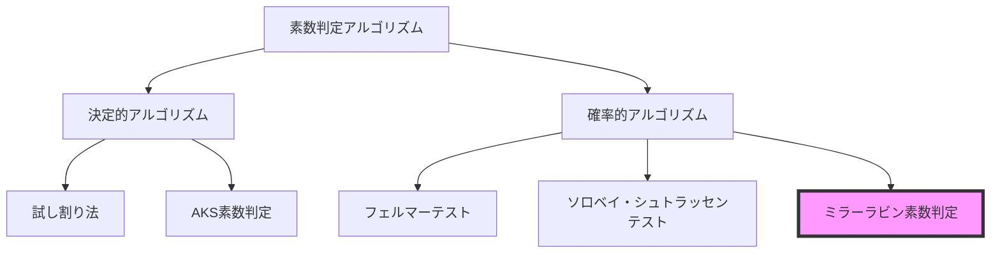
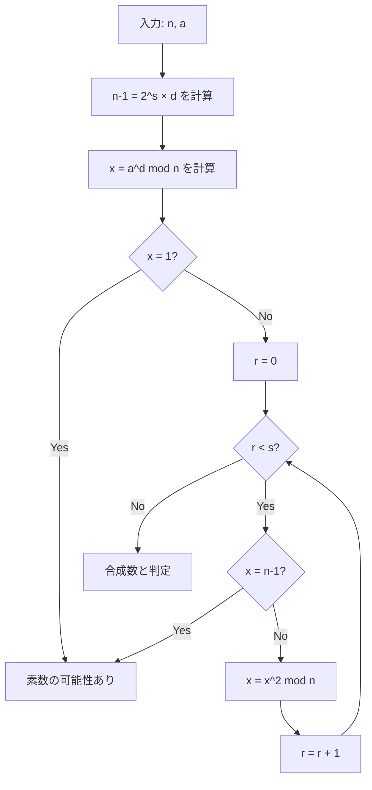
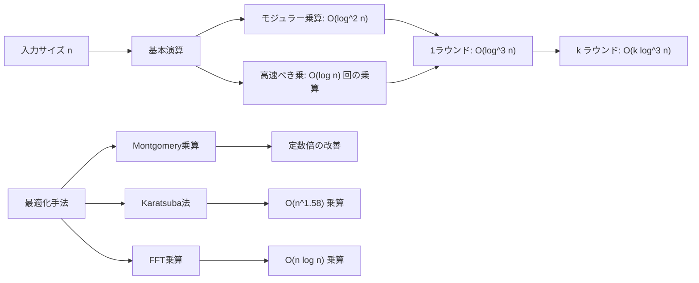
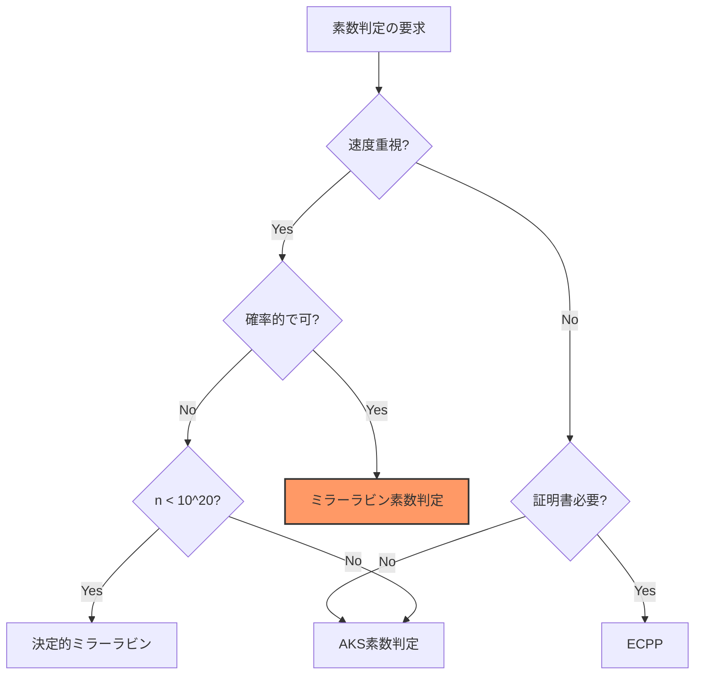

# ミラーラビン素数判定

ミラーラビン素数判定は、与えられた整数が素数であるかを高速に判定する確率的アルゴリズムである。1976年にGary L. MillerがRiemannの拡張仮説の下で決定的アルゴリズムとして提案し[^1]、1980年にMichael O. Rabinがこれを確率的アルゴリズムに改良した[^2]。現代の暗号システムや競技プログラミングにおいて、大きな整数の素数性を効率的に判定する標準的な手法として広く採用されている。

素数判定問題は計算機科学における基本的な問題の一つであり、その歴史は古代ギリシャのエラトステネスの篩にまで遡る。しかし、RSA暗号のような現代の応用では、数百桁を超える巨大な整数に対して高速に動作するアルゴリズムが必要となる。試し割り法のような単純な手法では計算量が $O(\sqrt{n})$ となり、巨大な数に対しては実用的でない。ミラーラビン素数判定は、この問題に対して $O(k \log^3 n)$ の計算量で動作し、実用上十分な精度を提供する。



## 理論的基礎

ミラーラビン素数判定の理論的基礎は、フェルマーの小定理とその拡張にある。フェルマーの小定理は、$p$ が素数で $a$ が $p$ と互いに素な整数のとき、$a^{p-1} \equiv 1 \pmod{p}$ が成り立つことを主張する。この定理の対偶を取ると、ある $a$ に対して $a^{n-1} \not\equiv 1 \pmod{n}$ ならば $n$ は合成数であることがわかる。

しかし、フェルマーの小定理に基づく単純な素数判定には重大な問題がある。カーマイケル数と呼ばれる合成数の存在である。カーマイケル数 $n$ は、$n$ と互いに素なすべての $a$ に対して $a^{n-1} \equiv 1 \pmod{n}$ を満たす合成数である。最小のカーマイケル数は $561 = 3 \times 11 \times 17$ であり、無限に多くのカーマイケル数が存在することが知られている[^3]。

ミラーラビン素数判定は、この問題を回避するためにより洗練されたアプローチを採用する。$n-1$ を $2^s \times d$ の形に分解し（ここで $d$ は奇数）、素数の持つ次の性質を利用する：$n$ が奇素数ならば、任意の $a \in \{1, 2, ..., n-1\}$ に対して、次のいずれかが成り立つ：

1. $a^d \equiv 1 \pmod{n}$
2. ある $r \in \{0, 1, ..., s-1\}$ に対して $a^{2^r d} \equiv -1 \pmod{n}$

この性質は、素数 $p$ に対して $\mathbb{Z}_p^*$ が巡回群であることと、$-1$ が位数2の元であることから導かれる。具体的には、$a^{n-1} \equiv 1 \pmod{n}$ から始めて、平方根を繰り返し取ることで、最終的に $1$ または $-1$ に到達することを意味している。



## アルゴリズムの詳細

ミラーラビン素数判定のアルゴリズムは、以下の手順で構成される。まず、判定対象の整数 $n$ に対して、$n-1$ を $2^s \times d$ の形に分解する。これは $n-1$ を2で割り続けることで効率的に計算できる。次に、証人（witness）と呼ばれる整数 $a$ を選択する。通常、$a$ は $\{2, 3, ..., n-2\}$ の範囲からランダムに選ばれる。

選択した $a$ に対して、まず $x = a^d \bmod n$ を計算する。この計算には高速べき乗法（binary exponentiation）を用いることで、$O(\log n)$ 回の乗算で実行できる。計算された $x$ が1または $n-1$ であれば、$n$ は素数である可能性がある。そうでない場合、$x$ を繰り返し二乗し、$x^2, x^4, ..., x^{2^{s-1}}$ を計算する。この過程で $n-1$ に等しい値が現れれば、$n$ は素数の可能性がある。最後まで1も $n-1$ も現れなければ、$n$ は確実に合成数である。

このテストを複数の異なる $a$ に対して繰り返すことで、判定の精度を向上させる。$k$ 個の独立にランダムに選ばれた証人を使用した場合、合成数を誤って素数と判定する確率は高々 $4^{-k}$ である[^4]。実用的には、$k = 20$ から $40$ 程度の値が使用されることが多い。

```python
def miller_rabin(n, k):
    # Handle edge cases
    if n < 2:
        return False
    if n == 2 or n == 3:
        return True
    if n % 2 == 0:
        return False
    
    # Decompose n-1 = 2^s * d
    s, d = 0, n - 1
    while d % 2 == 0:
        s += 1
        d //= 2
    
    # Perform k rounds of testing
    for _ in range(k):
        a = random.randint(2, n - 2)
        x = pow(a, d, n)  # a^d mod n
        
        if x == 1 or x == n - 1:
            continue
        
        for _ in range(s - 1):
            x = pow(x, 2, n)
            if x == n - 1:
                break
        else:
            return False  # Composite
    
    return True  # Probably prime
```

## 決定的バリアント

ミラーラビン素数判定の興味深い特性として、特定の範囲の整数に対しては、証人を適切に選ぶことで決定的なアルゴリズムとして使用できることがある。例えば、$n < 2^{64}$ の範囲では、証人として $\{2, 3, 5, 7, 11, 13, 17, 19, 23, 29, 31, 37\}$ を使用すれば、すべての合成数を確実に検出できることが知られている[^5]。

この性質は競技プログラミングにおいて特に有用である。32ビットや64ビット整数の範囲では、少数の固定された証人を使用することで、確率的な要素を排除しつつ高速な素数判定が可能となる。以下に、実用的な決定的バリアントの実装を示す：

```cpp
bool is_prime(uint64_t n) {
    if (n < 2) return false;
    if (n == 2 || n == 3) return true;
    if (n % 2 == 0) return false;
    
    uint64_t d = n - 1;
    int s = 0;
    while (d % 2 == 0) {
        s++;
        d /= 2;
    }
    
    // Witnesses for n < 2^64
    vector<uint64_t> witnesses = {2, 3, 5, 7, 11, 13, 17, 19, 23, 29, 31, 37};
    
    for (uint64_t a : witnesses) {
        if (a >= n) continue;
        
        uint64_t x = mod_pow(a, d, n);
        if (x == 1 || x == n - 1) continue;
        
        bool composite = true;
        for (int i = 0; i < s - 1; i++) {
            x = mod_mul(x, x, n);
            if (x == n - 1) {
                composite = false;
                break;
            }
        }
        
        if (composite) return false;
    }
    
    return true;
}
```

## 実装上の注意点

ミラーラビン素数判定の実装において、最も重要な点は大きな整数の演算を正確に行うことである。特に、$a^d \bmod n$ の計算や二乗演算では、中間結果が $n^2$ に達する可能性があるため、オーバーフローに注意が必要である。

64ビット整数を扱う場合、通常の乗算では128ビットの中間結果が必要となる。これを回避するために、Montgomery乗算やRussian peasant乗算などの技法が用いられる。以下は、オーバーフローを避けるためのモジュラー乗算の実装例である：

```cpp
uint64_t mod_mul(uint64_t a, uint64_t b, uint64_t mod) {
    uint64_t result = 0;
    a %= mod;
    while (b > 0) {
        if (b % 2 == 1) {
            result = (result + a) % mod;
        }
        a = (a * 2) % mod;
        b /= 2;
    }
    return result % mod;
}
```

また、高速べき乗法の実装においても、各ステップでモジュラー演算を適用することが重要である。単純に $a^d$ を計算してから剰余を取るのではなく、各乗算の後に剰余演算を行うことで、計算過程での数値の大きさを制御する。

```cpp
uint64_t mod_pow(uint64_t base, uint64_t exp, uint64_t mod) {
    uint64_t result = 1;
    base %= mod;
    while (exp > 0) {
        if (exp % 2 == 1) {
            result = mod_mul(result, base, mod);
        }
        base = mod_mul(base, base, mod);
        exp /= 2;
    }
    return result;
}
```

## 計算量とパフォーマンス

ミラーラビン素数判定の時間計算量は $O(k \log^3 n)$ である。ここで $k$ は使用する証人の数、$n$ は判定対象の整数である。この計算量は以下の要因から導かれる：

各ラウンドにおいて、最も計算量の大きい操作は $a^d \bmod n$ の計算である。高速べき乗法を使用すると、この計算には $O(\log d) = O(\log n)$ 回の乗算が必要となる。各乗算は、単純な実装では $O(\log^2 n)$ の時間がかかる（桁数の二乗に比例）。したがって、1ラウンドあたりの計算量は $O(\log^3 n)$ となる。

実際のパフォーマンスは、使用する乗算アルゴリズムに大きく依存する。現代のプロセッサでは、64ビット整数の乗算は1命令で実行できるため、この範囲では非常に高速である。より大きな整数に対しては、Karatsuba法やFFTベースの乗算アルゴリズムを使用することで、漸近的な計算量を改善できる。



## 確率的側面の分析

ミラーラビン素数判定の確率的な性質を理解することは、アルゴリズムの信頼性を評価する上で重要である。合成数 $n$ に対して、$n$ を素数と誤認する証人の割合は高々 $1/4$ であることが証明されている。この結果は、群論的な議論から導かれる。

具体的には、合成数 $n$ に対して、ミラーラビンテストを通過する証人の集合は、$(\mathbb{Z}/n\mathbb{Z})^*$ の部分群を形成する。Lagrangeの定理により、この部分群の位数は全体の位数を割り切る。さらに詳細な解析により、この部分群の位数は高々 $\phi(n)/4$ であることが示される。ここで $\phi(n)$ はオイラーのトーティエント関数である。

実際の合成数に対する証人の分布を調べると、多くの場合、誤認する証人の割合は $1/4$ よりもはるかに小さいことがわかる。例えば、小さな合成数に対する実験的な調査では、ほとんどの合成数で誤認率は $1/100$ 以下である。これは、実用上、少数のラウンドでも十分な精度が得られることを示唆している。

エラー確率の厳密な評価は以下のように行える。$k$ 個の独立な証人を使用した場合、すべての証人が合成数を見逃す確率は高々 $(1/4)^k$ である。例えば：

- $k = 10$: エラー確率 $\leq 9.5 \times 10^{-7}$
- $k = 20$: エラー確率 $\leq 9.1 \times 10^{-13}$
- $k = 40$: エラー確率 $\leq 8.3 \times 10^{-25}$

これらの数値は、現実的な応用において十分に小さいエラー確率を達成できることを示している。

## 強擬素数と証人の選択

ミラーラビン素数判定の理論において、強擬素数（strong pseudoprime）という概念が重要な役割を果たす。合成数 $n$ が基底 $a$ に関する強擬素数であるとは、$n$ がミラーラビンテストを $a$ を証人として通過することを意味する。

強擬素数の分布には興味深い性質がある。例えば、基底2に関する最小の強擬素数は2047であり、基底2と3の両方に関する最小の強擬素数は1373653である。この事実を利用して、小さな範囲の整数に対しては、少数の固定された証人で確実な判定が可能となる。

証人の選択戦略には、大きく分けて二つのアプローチがある。一つは完全にランダムな選択であり、理論的な保証が得られる。もう一つは、経験的に効果的であることが知られている特定の証人を使用する方法である。後者の例として、以下のような結果が知られている：

- $n < 2047$: 証人 $\{2\}$ で十分
- $n < 1373653$: 証人 $\{2, 3\}$ で十分
- $n < 9080191$: 証人 $\{31, 73\}$ で十分
- $n < 25326001$: 証人 $\{2, 3, 5\}$ で十分
- $n < 3215031751$: 証人 $\{2, 3, 5, 7\}$ で十分

これらの結果は、計算機による網羅的な探索によって得られたものである[^6]。

## 他の素数判定法との比較

素数判定アルゴリズムの landscape において、ミラーラビン素数判定は確率的アルゴリズムの代表格として位置づけられる。他の主要な素数判定法と比較することで、その特徴がより明確になる。

試し割り法は最も単純な決定的アルゴリズムであり、$\sqrt{n}$ までのすべての整数で割り切れるかを確認する。計算量は $O(\sqrt{n})$ であり、小さな整数に対しては実用的だが、大きな整数には適さない。一方、確実性という点では完璧である。

ソロベイ・シュトラッセンテストは、ミラーラビン素数判定と同様の確率的アルゴリズムである。Jacobi記号を用いた判定を行い、エラー確率は同じく $1/2^k$ のオーダーである。しかし、実装の複雑さと実行速度の面で、ミラーラビン素数判定に劣ることが多い。

AKS素数判定は、2002年に発見された多項式時間の決定的アルゴリズムである[^7]。理論的には画期的な成果だが、計算量は $O(\log^6 n)$ 程度（改良版では $O(\log^{6+\epsilon} n)$）であり、実用的にはミラーラビン素数判定よりも遅い。

楕円曲線素数証明（ECPP）は、素数性の証明書を生成する決定的アルゴリズムである。期待計算量は $O(\log^5 n)$ 程度だが、定数倍が大きく、主に素数性の厳密な証明が必要な場合に使用される。



## 応用分野における実装例

ミラーラビン素数判定は、様々な実用的な場面で活用されている。暗号システムにおけるRSA鍵生成では、大きな素数を高速に見つける必要があり、ミラーラビン素数判定が標準的に使用される。通常、ランダムに生成した大きな奇数に対してミラーラビンテストを適用し、素数が見つかるまで繰り返す。

OpenSSLやGnuPGなどの暗号ライブラリでは、ミラーラビン素数判定の高度に最適化された実装が使用されている。これらの実装では、プラットフォーム固有の最適化やアセンブリレベルの実装により、高いパフォーマンスを実現している。

競技プログラミングにおいては、素因数分解や素数カウントなどの問題でミラーラビン素数判定が活用される。特に、Pollardのρ法による素因数分解と組み合わせることで、$10^{18}$ 程度までの整数を高速に素因数分解できる。以下は、競技プログラミングでよく使用される統合的な実装例である：

```cpp
class PrimalityTest {
private:
    using u64 = uint64_t;
    using u128 = __uint128_t;
    
    static u64 mod_mul(u64 a, u64 b, u64 mod) {
        return (u128)a * b % mod;
    }
    
    static u64 mod_pow(u64 base, u64 exp, u64 mod) {
        u64 result = 1;
        while (exp > 0) {
            if (exp & 1) result = mod_mul(result, base, mod);
            base = mod_mul(base, base, mod);
            exp >>= 1;
        }
        return result;
    }
    
    static bool miller_rabin_test(u64 n, u64 a) {
        if (n <= 1) return false;
        if (n == 2) return true;
        if (n % 2 == 0) return false;
        
        u64 d = n - 1;
        int s = 0;
        while (d % 2 == 0) {
            s++;
            d /= 2;
        }
        
        u64 x = mod_pow(a, d, n);
        if (x == 1 || x == n - 1) return true;
        
        for (int i = 0; i < s - 1; i++) {
            x = mod_mul(x, x, n);
            if (x == n - 1) return true;
        }
        return false;
    }
    
public:
    static bool is_prime(u64 n) {
        if (n <= 1) return false;
        if (n <= 3) return true;
        if (n % 2 == 0) return false;
        
        // Deterministic witnesses for n < 2^64
        vector<u64> witnesses = {2, 3, 5, 7, 11, 13, 17, 19, 23, 29, 31, 37};
        
        for (u64 a : witnesses) {
            if (a >= n) break;
            if (!miller_rabin_test(n, a)) return false;
        }
        return true;
    }
};
```

## パフォーマンスの最適化技法

ミラーラビン素数判定の実装において、パフォーマンスを向上させるための様々な最適化技法が存在する。最も重要な最適化の一つは、Montgomery乗算の使用である。Montgomery乗算は、剰余演算を高速化する技法であり、特に同じ法での複数の演算を行う場合に効果的である。

Montgomery表現では、整数 $a$ を $aR \bmod n$ の形で表現する。ここで $R$ は $n$ と互いに素な2のべき乗である。この表現を使用することで、剰余演算を除算ではなくビット演算で実行できるようになる。ミラーラビン素数判定では、同じ法 $n$ での複数の乗算を行うため、Montgomery乗算による高速化の恩恵を受けやすい。

もう一つの重要な最適化は、小さな素数による前処理である。判定対象の数が小さな素数で割り切れるかを事前にチェックすることで、多くの合成数を高速に除外できる。例えば、最初の100個程度の素数で割り切れるかをチェックするだけで、ランダムな整数の大部分を素早く判定できる。

並列化も効果的な最適化手法である。複数の証人に対するテストは独立に実行できるため、マルチコアプロセッサやGPUを活用した並列実装が可能である。特に、大量の素数判定を行う必要がある場合、バッチ処理による並列化で大幅な高速化が期待できる。

## 理論的な発展と未解決問題

ミラーラビン素数判定に関連する理論的な研究は現在も活発に行われている。特に興味深いのは、決定的な素数判定に必要な証人の数に関する研究である。現在知られている結果では、一般化Riemann仮説（GRH）が正しければ、$O(\log^2 n)$ 個の証人で決定的な判定が可能であることが示されている[^8]。

強擬素数の分布に関する研究も重要な課題である。特定の基底に関する強擬素数の密度や、複数の基底に関する強擬素数の交わりについて、より精密な評価が求められている。これらの研究は、実用的なアルゴリズムの改良にも直接的に貢献する。

計算複雑性理論の観点からは、素数判定問題がPに属することはAKSアルゴリズムによって証明されたが、より効率的な決定的アルゴリズムの存在については未解決である。ミラーラビン素数判定の平均的な計算量の解析や、特定の数の分布に対する最適な証人選択戦略なども、活発な研究分野である。

量子計算の文脈では、Shorのアルゴリズムが素因数分解を多項式時間で解けることを示しているが、素数判定に特化した量子アルゴリズムの研究も進められている。古典的なミラーラビン素数判定と量子アルゴリズムの関係性についても、理論的な興味が持たれている。

これらの理論的な発展は、単に学術的な興味にとどまらず、暗号システムの安全性評価や、より効率的な実装の開発につながる可能性を秘めている。ミラーラビン素数判定は、実用性と理論的深さを兼ね備えたアルゴリズムとして、今後も計算機科学の重要な研究対象であり続けるだろう。

[^1]: Miller, Gary L. (1976). "Riemann's Hypothesis and Tests for Primality". Journal of Computer and System Sciences. 13 (3): 300-317.

[^2]: Rabin, Michael O. (1980). "Probabilistic algorithm for testing primality". Journal of Number Theory. 12 (1): 128-138.

[^3]: Alford, W. R.; Granville, Andrew; Pomerance, Carl (1994). "There are infinitely many Carmichael numbers". Annals of Mathematics. 139 (3): 703-722.

[^4]: Damgård, Ivan; Landrock, Peter; Pomerance, Carl (1993). "Average case error estimates for the strong probable prime test". Mathematics of Computation. 61 (203): 177-194.

[^5]: Jaeschke, Gerhard (1993). "On strong pseudoprimes to several bases". Mathematics of Computation. 61 (204): 915-926.

[^6]: Pomerance, Carl; Selfridge, John L.; Wagstaff, Samuel S. Jr. (1980). "The pseudoprimes to 25·10^9". Mathematics of Computation. 35 (151): 1003-1026.

[^7]: Agrawal, Manindra; Kayal, Neeraj; Saxena, Nitin (2004). "PRIMES is in P". Annals of Mathematics. 160 (2): 781-793.

[^8]: Bach, Eric (1990). "Explicit bounds for primality testing and related problems". Mathematics of Computation. 55 (191): 355-380.