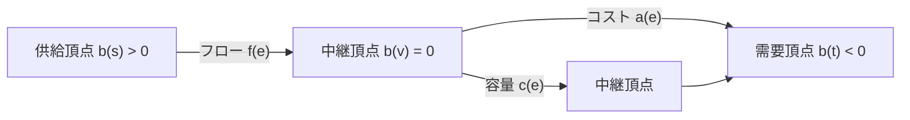
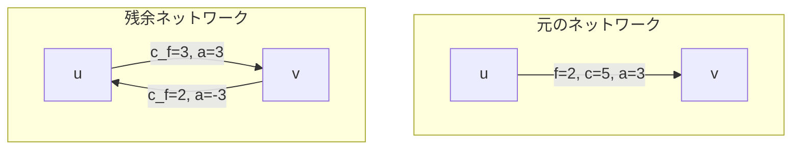
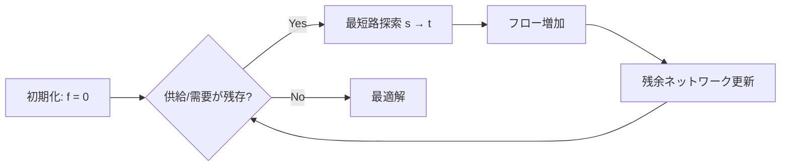
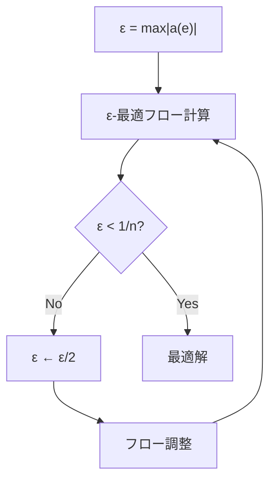

# 最小費用流アルゴリズム

最小費用流問題は、ネットワークフロー理論における中心的な最適化問題の一つであり、与えられたフロー量を最小のコストで流すことを目的とする。この問題は最大流問題の自然な拡張として位置づけられ、各辺に容量制約だけでなくコストが付与されたネットワークにおいて、指定された量のフローを送るための最小総コストを求める。実世界における輸送問題、割当問題、スケジューリング問題など、多くの組合せ最適化問題が最小費用流問題として定式化できることから、理論的にも実践的にも極めて重要な問題クラスである。

## 問題の定式化

有向グラフ $G = (V, E)$ において、各辺 $e = (u, v) \in E$ に対して容量 $c(e) \geq 0$ とコスト $a(e)$ が与えられているとする。また、各頂点 $v \in V$ に対して供給量 $b(v)$ が定義され、$b(v) > 0$ の場合は供給頂点、$b(v) < 0$ の場合は需要頂点、$b(v) = 0$ の場合は中継頂点となる。フロー $f: E \rightarrow \mathbb{R}_{\geq 0}$ に対して、以下の制約を満たしながら総コストを最小化する問題が最小費用流問題である[^1]。



数学的に厳密に定式化すると、以下の線形計画問題として表現される：

$$
\begin{align}
\text{minimize} \quad & \sum_{e \in E} a(e) \cdot f(e) \\
\text{subject to} \quad & \sum_{e \in \delta^+(v)} f(e) - \sum_{e \in \delta^-(v)} f(e) = b(v) \quad \forall v \in V \\
& 0 \leq f(e) \leq c(e) \quad \forall e \in E
\end{align}
$$

ここで、$\delta^+(v)$ は頂点 $v$ から出る辺の集合、$\delta^-(v)$ は頂点 $v$ に入る辺の集合を表す。第一の制約式はフロー保存則を表し、各頂点において流入量と流出量の差が供給量に等しいことを要求している。なお、問題が実行可能であるためには $\sum_{v \in V} b(v) = 0$ が必要条件となる。

## 双対性理論と最適性条件

最小費用流問題の深い理解には、線形計画法における双対理論が不可欠である。各頂点 $v$ に対する双対変数（ポテンシャル）を $\pi(v)$ とすると、双対問題は以下のように定式化される：

$$
\begin{align}
\text{maximize} \quad & \sum_{v \in V} b(v) \cdot \pi(v) - \sum_{e=(u,v) \in E} c(e) \cdot \max(0, \pi(u) - \pi(v) - a(e))
\end{align}
$$

相補性条件により、最適解においては以下の条件が成立する：
- $f(e) > 0$ ならば $\pi(u) - \pi(v) = a(e)$（タイトな辺）
- $f(e) < c(e)$ ならば $\pi(u) - \pi(v) \leq a(e)$

これらの条件は、被約コスト $a_\pi(e) = a(e) - \pi(u) + \pi(v)$ を用いて簡潔に表現できる。最適フロー $f$ に対して、適切なポテンシャル $\pi$ が存在し、すべての辺で $a_\pi(e) \geq 0$ が成立し、$f(e) > 0$ ならば $a_\pi(e) = 0$ となる。この最適性条件は、多くの最小費用流アルゴリズムの基礎となっている。

## 残余ネットワークと負閉路

最小費用流アルゴリズムの多くは、残余ネットワーク（residual network）の概念を利用する。フロー $f$ に対する残余ネットワーク $G_f = (V, E_f)$ は、各辺 $e = (u, v) \in E$ に対して以下の辺を含む：
- $f(e) < c(e)$ ならば、容量 $c_f(e) = c(e) - f(e)$、コスト $a(e)$ の順方向辺 $(u, v)$
- $f(e) > 0$ ならば、容量 $c_f(e^{-1}) = f(e)$、コスト $-a(e)$ の逆方向辺 $(v, u)$



フローの最適性と残余ネットワークにおける負閉路の存在には密接な関係がある。実際、フロー $f$ が最適であることと、残余ネットワーク $G_f$ に負閉路が存在しないことは同値である[^2]。この特性は、負閉路消去法（negative cycle canceling）の理論的基礎となっている。

## 連続最短路法

連続最短路法（successive shortest path algorithm）は、最小費用流問題を解く最も直感的なアルゴリズムの一つである。このアルゴリズムは、供給頂点から需要頂点への最短路を繰り返し見つけ、その経路に沿ってフローを流すという基本的なアイデアに基づいている。

アルゴリズムの動作原理は以下の通りである。まず、すべてのフローを0に初期化し、供給量 $b(v) > 0$ となる頂点を供給頂点集合 $S$、$b(v) < 0$ となる頂点を需要頂点集合 $T$ とする。各反復において、ある供給頂点 $s \in S$ から需要頂点 $t \in T$ への残余ネットワーク上の最短路を求める。この最短路が存在する場合、経路上の最小残余容量と供給・需要量の制約から決まる最大流量を流す。



重要な点は、各反復においてポテンシャルを適切に更新することで、被約コストの非負性を保つことである。Dijkstra法を用いて最短路を求めた場合、最短距離 $d(v)$ を用いて $\pi(v) \leftarrow \pi(v) - d(v)$ と更新することで、次の反復でも被約コストが非負となることが保証される。

連続最短路法の計算量は、フロー値を $F$ とすると $O(F \cdot m \log n)$ となる。ここで、$n = |V|$、$m = |E|$ である。フロー値が大きい場合には効率的でないが、実装が比較的単純であり、多くの実用的な問題で十分な性能を発揮する。

## プライマル・デュアル法

プライマル・デュアル法は、線形計画法の一般的な解法技術を最小費用流問題に特化させたものである。このアルゴリズムは、主問題（フロー）と双対問題（ポテンシャル）を同時に改善していくことで、効率的に最適解を求める。

アルゴリズムの核心は、現在のポテンシャルに対して被約コストが0となる辺（タイトな辺）のみからなる補助グラフを構築し、この上で最大流を求めることである。得られた最大流に従ってフローを更新し、その後ポテンシャルを調整して新たなタイトな辺を追加する。この過程を、すべての供給・需要が満たされるまで繰り返す。

プライマル・デュアル法の各反復では、以下の手順を実行する：
1. 現在のポテンシャル $\pi$ に対して、被約コスト $a_\pi(e) = 0$ となる辺からなる補助グラフ $G_0$ を構築
2. $G_0$ 上で供給頂点から需要頂点への最大流を計算
3. 残余ネットワーク上で到達可能な頂点集合を求め、ポテンシャルを更新

計算量は $O(n^2 m)$ となるが、実装を工夫することで実用的な性能を達成できる。特に、最大流の計算にDinic法やPush-Relabel法などの高速なアルゴリズムを用いることで、全体の効率を大幅に改善できる。

## コストスケーリング法

コストスケーリング法は、最小費用流問題に対する強多項式時間アルゴリズムの一つであり、理論的にも実践的にも優れた性能を持つ[^3]。このアルゴリズムは、コストを段階的に精密化していくことで、効率的に最適解に到達する。

アルゴリズムの基本的なアイデアは、コストを $\epsilon$ 単位で丸めた問題を考え、$\epsilon$ を徐々に小さくしていくことである。各段階で $\epsilon$-最適なフローを維持し、$\epsilon$ を半分にするたびに、新たな $\epsilon$-最適フローを構築する。$\epsilon$-最適性とは、すべての残余ネットワークの閉路に対して、その被約コストの和が $-n\epsilon$ 以上であることを意味する。



各スケーリング段階では、以下の操作を繰り返す：
1. 被約コストが負の辺を見つける
2. その辺を含む最小平均コスト閉路を探索
3. 閉路に沿ってフローを流す

Goldberg-Tarjanのコストスケーリング法では、計算量 $O(n^3 \log(nC))$ を達成している。ここで、$C$ は最大コストの絶対値である。実装においては、動的木データ構造を用いることで、さらに効率を改善できる。

## 容量スケーリング法

容量スケーリング法は、コストスケーリング法とは異なるアプローチで、容量を段階的に考慮することで効率化を図る。このアルゴリズムは、大きな容量の辺から順に処理していくことで、フローの増加操作の回数を削減する。

各スケーリング段階 $\Delta$ において、容量が $\Delta$ 以上の辺のみを考慮した部分ネットワークで最小費用流を求める。$\Delta$ を半分にしながら、新たに追加される辺を処理していく。この手法により、各段階でのフロー増加量が $\Delta$ 以上となることが保証され、全体の反復回数を $O(m \log U)$ に抑えることができる。ここで、$U$ は最大容量である。

容量スケーリング法は、連続最短路法と組み合わせることで特に効果的である。各スケーリング段階で連続最短路法を適用することで、全体の計算量を $O(m \log U \cdot m \log n)$ に改善できる。

## ネットワーク単体法

ネットワーク単体法は、線形計画法の単体法を最小費用流問題に特化させたものである。このアルゴリズムは、実用的な問題において極めて高速に動作することが知られており、商用ソルバーでも広く採用されている[^4]。

ネットワーク単体法の基本的な考え方は、フローを全域木（spanning tree）で表現することである。各反復において、現在の全域木に含まれない辺の中から被約コストが負のものを選び、それを全域木に追加する。同時に、閉路を解消するために別の辺を全域木から除去する。この操作をピボット操作と呼ぶ。


実装上の工夫として、以下の技術が重要である：
- 全域木の効率的な表現（親ポインタ、深さ、部分木サイズなど）
- 候補リストによる入る辺の選択の高速化
- 摂動法による退化の回避

ネットワーク単体法は最悪計算量が指数的になる可能性があるが、実用的な問題では線形時間に近い性能を示すことが多い。特に、疎なネットワークや特殊な構造を持つ問題において優れた性能を発揮する。

## 実装上の詳細と最適化技術

最小費用流アルゴリズムの実装において、理論的な正しさだけでなく、実用的な効率性を達成するためには多くの工夫が必要である。以下に主要な実装技術を詳述する。

### データ構造の選択

グラフの表現方法は性能に大きく影響する。隣接リスト表現が一般的だが、辺の追加・削除が頻繁な場合は動的な構造を検討する必要がある。残余ネットワークの表現では、順方向辺と逆方向辺を対にして管理することで、相互参照を効率化できる：

```cpp
struct Edge {
    int to, rev;
    long long cap, cost;
};
vector<vector<Edge>> graph;
```

### 数値精度と整数性

最小費用流問題では、整数容量・整数コストの場合、最適フローも整数となることが保証される（整数性定理）。しかし、計算過程でのオーバーフローに注意が必要である。特に、コストの累積値は容量とコストの積に比例して大きくなるため、適切な型選択が重要である。

### 負閉路の検出と処理

負閉路消去法を実装する場合、効率的な負閉路検出が鍵となる。Bellman-Ford法の高速化版として、SPFA（Shortest Path Faster Algorithm）がよく用いられる。ただし、最悪計算量は改善されないため、問題の特性に応じて使い分ける必要がある。

### ポテンシャルの初期化

多くのアルゴリズムで、初期ポテンシャルの設定が性能に影響する。すべてのコストが非負の場合は0初期化で十分だが、負のコストが存在する場合は、Bellman-Ford法などで適切な初期値を計算する必要がある。

```cpp
// ポテンシャルの初期化（負コスト対応）
vector<long long> h(n, INF);
h[s] = 0;
for (int i = 0; i < n - 1; ++i) {
    for (int v = 0; v < n; ++v) {
        if (h[v] == INF) continue;
        for (auto& e : graph[v]) {
            if (e.cap > 0) {
                h[e.to] = min(h[e.to], h[v] + e.cost);
            }
        }
    }
}
```

### メモリ効率とキャッシュ性能

大規模なグラフを扱う場合、メモリアクセスパターンが性能のボトルネックとなることがある。辺の情報をStructure of Arrays（SoA）形式で管理することで、キャッシュ効率を改善できる場合がある。また、頻繁にアクセスされるデータ（ポテンシャル、距離ラベルなど）は連続したメモリ領域に配置することが望ましい。

## 応用問題と定式化技法

最小費用流問題の真の力は、様々な組合せ最適化問題を統一的に扱える汎用性にある。以下、代表的な応用例とその定式化技法を詳しく見ていく。

### 二部マッチング問題

重み付き二部マッチング問題は、最小費用流問題の特殊ケースとして定式化できる。二部グラフ $G = (U \cup V, E)$ において、超源点 $s$ と超汇点 $t$ を追加し、$s$ から $U$ の各頂点へ容量1の辺、$V$ の各頂点から $t$ へ容量1の辺を張る。元の辺には容量1、コストを元の重みとする。この構成により、最小費用最大流が最小重み最大マッチングを与える。

### 輸送問題

$m$ 個の供給地から $n$ 個の需要地への輸送問題は、完全二部グラフ上の最小費用流として自然に定式化される。供給地 $i$ の供給量を $s_i$、需要地 $j$ の需要量を $d_j$、輸送コストを $c_{ij}$ とすると、対応する辺の容量を $\min(s_i, d_j)$、コストを $c_{ij}$ として最小費用流を求めればよい。

### 最小費用循環フロー

すべての頂点で供給量が0の場合、循環フローを求める問題となる。この問題は、任意の頂点対間に大容量・大コストの辺を追加し、適切な供給・需要を設定することで、通常の最小費用流問題に帰着できる。

### プロジェクトスケジューリング

リソース制約付きプロジェクトスケジューリング問題も、時間展開グラフを用いて最小費用流として定式化できる。各時刻・各リソースを頂点とし、タスクの実行を辺で表現する。リソース容量は辺容量、遅延ペナルティはコストとして組み込む。

## 高度な実装技術

### 動的最小費用流

グラフの構造が動的に変化する場合の最小費用流問題は、実用上重要だが理論的にも挑戦的である。完全な再計算を避けるため、以下の技術が研究されている：

- 感度分析による局所的な更新
- 永続データ構造を用いた差分管理
- 並列化による高速化

### 近似アルゴリズム

厳密解が不要な場合、$(1+\epsilon)$-近似解を高速に求めるアルゴリズムが有用である。Fleischer-Wayneの近似アルゴリズムは、$O(\epsilon^{-2} m \log n)$ 時間で動作し、大規模問題に適している[^5]。

### GPUを用いた並列化

最小費用流アルゴリズムの並列化は、逐次的な性質のため困難だが、以下のアプローチが研究されている：

- 複数の最短路探索の並列実行
- ブロック単位でのフロー更新
- 投機的実行による並列化

## 実装例：連続最短路法

理論的な説明を補完するため、連続最短路法の基本的な実装を示す。この実装は教育的な目的のためのものであり、実用的な最適化は省略している：

```cpp
struct MinCostFlow {
    struct Edge {
        int to, rev;
        long long cap, cost;
    };
    
    vector<vector<Edge>> graph;
    vector<long long> h, dist;
    vector<int> parent, parent_edge;
    int n;
    
    MinCostFlow(int n) : n(n), graph(n), h(n), dist(n), parent(n), parent_edge(n) {}
    
    void add_edge(int from, int to, long long cap, long long cost) {
        graph[from].push_back({to, (int)graph[to].size(), cap, cost});
        graph[to].push_back({from, (int)graph[from].size() - 1, 0, -cost});
    }
    
    pair<long long, long long> min_cost_flow(int s, int t, long long f) {
        long long res = 0;
        fill(h.begin(), h.end(), 0);
        
        while (f > 0) {
            priority_queue<pair<long long, int>, vector<pair<long long, int>>, greater<>> pq;
            fill(dist.begin(), dist.end(), LLONG_MAX);
            dist[s] = 0;
            pq.push({0, s});
            
            while (!pq.empty()) {
                auto [d, v] = pq.top();
                pq.pop();
                if (dist[v] < d) continue;
                
                for (int i = 0; i < graph[v].size(); ++i) {
                    Edge& e = graph[v][i];
                    if (e.cap > 0 && dist[e.to] > dist[v] + e.cost + h[v] - h[e.to]) {
                        dist[e.to] = dist[v] + e.cost + h[v] - h[e.to];
                        parent[e.to] = v;
                        parent_edge[e.to] = i;
                        pq.push({dist[e.to], e.to});
                    }
                }
            }
            
            if (dist[t] == LLONG_MAX) return {-1, -1};
            
            for (int v = 0; v < n; ++v) h[v] += dist[v];
            
            long long d = f;
            for (int v = t; v != s; v = parent[v]) {
                d = min(d, graph[parent[v]][parent_edge[v]].cap);
            }
            
            f -= d;
            res += d * h[t];
            
            for (int v = t; v != s; v = parent[v]) {
                Edge& e = graph[parent[v]][parent_edge[v]];
                e.cap -= d;
                graph[v][e.rev].cap += d;
            }
        }
        
        return {f, res};
    }
};
```

## 理論的発展と未解決問題

最小費用流問題は、アルゴリズム理論において成熟した分野であるが、依然として多くの興味深い研究課題が残されている。

強多項式時間アルゴリズムの改善は継続的な研究テーマである。現在知られている最良の強多項式時間計算量は $O(m^2 \log n)$ であるが、これが最適かどうかは未解決である。特に、単純な構造を持つグラフ（平面グラフ、系列並列グラフなど）に対して、より効率的なアルゴリズムの開発が期待されている。

動的最小費用流問題に対する効率的なアルゴリズムの開発も重要な課題である。現在のアプローチでは、最悪の場合、更新ごとに静的アルゴリズムと同等の時間がかかる。グラフの変更を効率的に処理し、償却的に高速な更新を実現するデータ構造の開発が求められている。

分散・並列アルゴリズムの観点からも、最小費用流問題は興味深い。MapReduceモデルやMPCモデルにおける効率的なアルゴリズムの設計は、大規模データ処理の文脈で重要性を増している。特に、通信量を削減しながら高速に収束するアルゴリズムの開発が課題となっている。

量子アルゴリズムの文脈でも、最小費用流問題は注目されている。古典的なアルゴリズムに対する量子スピードアップの可能性や、量子近似最適化アルゴリズム（QAOA）の適用可能性などが研究されている。

実用的な観点からは、機械学習との融合も興味深い方向性である。問題インスタンスの特性を学習し、適切なアルゴリズムやパラメータを選択する手法や、ニューラルネットワークを用いた高速な近似解法の開発などが進められている。

最小費用流問題は、理論的な美しさと実用的な重要性を兼ね備えた、組合せ最適化における中心的な問題である。本稿で述べた各アルゴリズムは、それぞれ異なる強みを持ち、問題の特性に応じて使い分けることが重要である。連続最短路法の実装の単純さ、プライマル・デュアル法の理論的優雅さ、コストスケーリング法の最悪計算量保証、ネットワーク単体法の実用的効率性など、各手法の特徴を理解し、適切に選択・実装することが、効率的な問題解決の鍵となる。

[^1]: Ahuja, R. K., Magnanti, T. L., & Orlin, J. B. (1993). Network flows: theory, algorithms, and applications. Prentice Hall.

[^2]: Klein, M. (1967). A primal method for minimal cost flows with applications to the assignment and transportation problems. Management Science, 14(3), 205-220.

[^3]: Goldberg, A. V., & Tarjan, R. E. (1990). Finding minimum-cost circulations by successive approximation. Mathematics of Operations Research, 15(3), 430-466.

[^4]: Orlin, J. B. (1997). A polynomial time primal network simplex algorithm for minimum cost flows. Mathematical Programming, 78(2), 109-129.

[^5]: Fleischer, L. K., & Wayne, K. D. (2002). Fast and simple approximation schemes for generalized flow. Mathematical Programming, 91(2), 215-238.