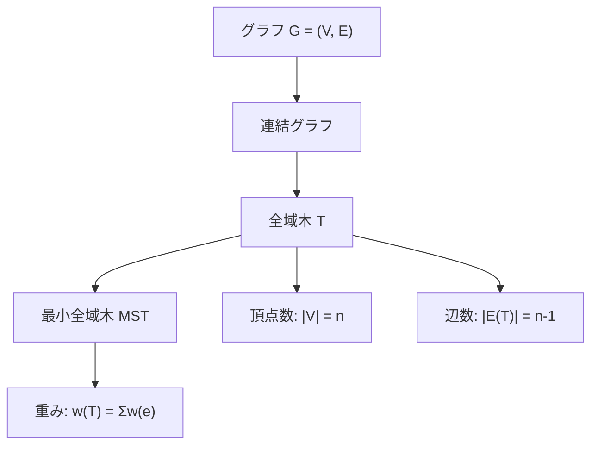
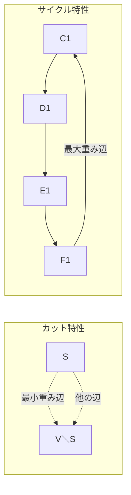
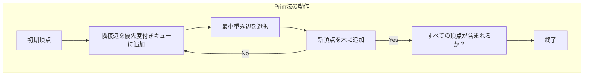
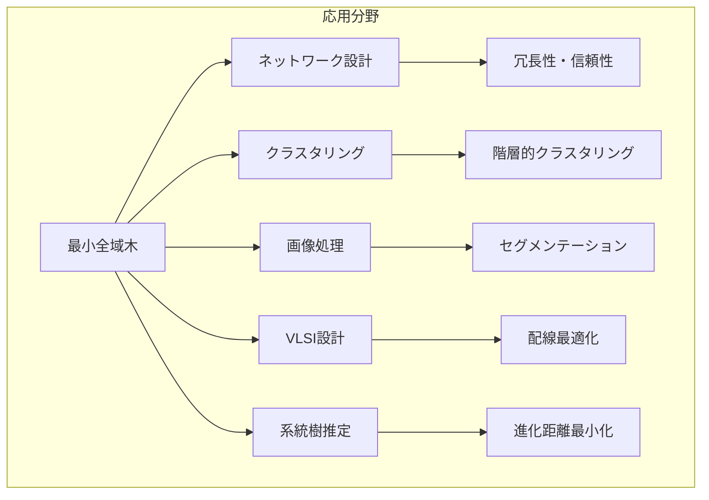

# 最小全域木

最小全域木（Minimum Spanning Tree, MST）は、グラフ理論における最も基本的かつ重要な概念の一つである。重み付き無向グラフにおいて、すべての頂点を連結し、かつ辺の重みの総和が最小となる木構造を求める問題は、ネットワーク設計、クラスタリング、画像処理など、幅広い分野で応用されている。本稿では、最小全域木の数学的基礎から実装の詳細まで、体系的に解説する。

## グラフ理論における基礎概念

最小全域木を理解するためには、まずグラフ理論の基本概念を正確に把握する必要がある。無向グラフ $G = (V, E)$ は頂点集合 $V$ と辺集合 $E$ から構成され、各辺 $e \in E$ には重み $w(e)$ が与えられている。グラフが連結であるとは、任意の2頂点間に経路が存在することを意味する。

全域木（Spanning Tree）とは、グラフ $G$ のすべての頂点を含み、かつ閉路を持たない部分グラフである。$n$ 個の頂点を持つグラフの全域木は、必ず $n-1$ 本の辺を持つ。この性質は、木の定義から直接導かれる。すなわち、$n$ 個の頂点を持つ木は、連結かつ閉路を持たないグラフであり、その辺数は常に $n-1$ となる。



最小全域木は、可能なすべての全域木の中で、辺の重みの総和が最小となるものである。形式的には、グラフ $G$ の最小全域木 $T^*$ は次の条件を満たす：

$$T^* = \arg\min_{T \in \mathcal{T}} \sum_{e \in E(T)} w(e)$$

ここで、$\mathcal{T}$ は $G$ のすべての全域木の集合を表す。

## カットとサイクル特性

最小全域木の理論的基盤を理解する上で、カット特性とサイクル特性は極めて重要である。これらの特性は、最小全域木アルゴリズムの正当性を保証する基本的な定理である[^1]。

カット（Cut）とは、頂点集合 $V$ を2つの非空な部分集合 $S$ と $V \setminus S$ に分割することである。カットに対して、$S$ と $V \setminus S$ をまたぐ辺の集合をカット辺集合と呼ぶ。カット特性は以下のように述べられる：

**カット特性（Cut Property）**: 任意のカット $(S, V \setminus S)$ に対して、そのカット辺集合の中で最小重みを持つ辺は、ある最小全域木に含まれる。

この定理の証明は交換論法による。最小全域木 $T$ がカット辺集合の最小重み辺 $e$ を含まないと仮定する。$T$ に $e$ を加えると閉路ができるが、この閉路はカットをまたぐため、カット辺集合に属する別の辺 $e'$ を含む。$T$ から $e'$ を除いて $e$ を加えた木 $T'$ は、$w(e) \leq w(e')$ より $w(T') \leq w(T)$ となり、$T$ の最小性に矛盾する。

**サイクル特性（Cycle Property）**: グラフの任意の閉路において、その閉路上の最大重み辺は、どの最小全域木にも含まれない（ただし、最大重み辺が複数ある場合は、少なくとも1つは含まれない）。

サイクル特性の証明も同様に交換論法を用いる。最小全域木 $T$ が閉路 $C$ の最大重み辺 $e$ を含むと仮定する。$T$ から $e$ を除くと2つの連結成分ができるが、$C$ の他の辺のいずれかがこれらを連結する。その辺を $e'$ とすると、$w(e') < w(e)$ より、$T$ から $e$ を除いて $e'$ を加えた木の重みは $T$ より小さくなり、矛盾する。



## Kruskal法の詳細解析

Kruskal法は1956年にJoseph Kruskalによって提案された貪欲アルゴリズムである[^2]。このアルゴリズムは、辺を重みの昇順にソートし、閉路を作らない限り順次追加していくという単純な戦略に基づいている。

アルゴリズムの動作は以下の通りである。まず、すべての辺を重みの昇順にソートする。次に、各辺を順に検討し、その辺を追加しても閉路ができない場合のみ、最小全域木に追加する。閉路の検出には、Union-Find（素集合）データ構造を用いる。

```python
def kruskal(edges, n):
    # Initialize Union-Find
    parent = list(range(n))
    rank = [0] * n
    
    def find(x):
        if parent[x] != x:
            parent[x] = find(parent[x])  # Path compression
        return parent[x]
    
    def union(x, y):
        px, py = find(x), find(y)
        if px == py:
            return False
        # Union by rank
        if rank[px] < rank[py]:
            parent[px] = py
        elif rank[px] > rank[py]:
            parent[py] = px
        else:
            parent[py] = px
            rank[px] += 1
        return True
    
    # Sort edges by weight
    edges.sort(key=lambda e: e[2])
    
    mst = []
    total_weight = 0
    
    for u, v, w in edges:
        if union(u, v):
            mst.append((u, v, w))
            total_weight += w
            if len(mst) == n - 1:
                break
    
    return mst, total_weight
```

Kruskal法の時間計算量は $O(E \log E)$ である。これは主に辺のソートに起因する。Union-Find操作は、経路圧縮とランクによる併合を用いることで、実質的に定数時間で実行できる（正確にはアッカーマン関数の逆関数 $\alpha(n)$ に比例するが、実用上は定数と見なせる）。

Kruskal法の正当性は、カット特性から証明できる。アルゴリズムが辺 $(u, v)$ を追加する時点で、$u$ と $v$ は異なる連結成分に属している。この連結成分による分割はカットを形成し、$(u, v)$ はこのカット辺集合の中で（まだ検討されていない辺の中で）最小重みを持つ。したがって、カット特性により、この辺はある最小全域木に含まれる。

## Prim法の実装と最適化

Prim法は1957年にRobert C. Primによって再発見されたアルゴリズムである（実際には1930年にVojtěch Jarníkによって最初に発見された）[^3]。Dijkstra法と類似した構造を持ち、頂点集合を徐々に拡張していく手法を採用している。

Prim法は、任意の頂点から開始し、現在の木に隣接する辺の中で最小重みのものを選択して木を拡張していく。この過程は、すべての頂点が木に含まれるまで続く。優先度付きキューを用いた効率的な実装は以下のようになる：

```python
import heapq

def prim(graph, n):
    # graph[u] = [(v, weight), ...]
    visited = [False] * n
    min_heap = [(0, 0, -1)]  # (weight, vertex, parent)
    mst = []
    total_weight = 0
    
    while min_heap:
        weight, u, parent = heapq.heappop(min_heap)
        
        if visited[u]:
            continue
            
        visited[u] = True
        if parent != -1:
            mst.append((parent, u, weight))
            total_weight += weight
        
        for v, w in graph[u]:
            if not visited[v]:
                heapq.heappush(min_heap, (w, v, u))
    
    return mst, total_weight
```

Prim法の時間計算量は、優先度付きキューの実装に依存する。二分ヒープを用いた場合、$O((V + E) \log V)$ となる。Fibonacci ヒープを用いれば $O(E + V \log V)$ に改善できるが、実装の複雑さと定数倍の大きさから、実用上は二分ヒープが好まれることが多い。

密グラフ（$E = \Theta(V^2)$）に対しては、優先度付きキューを使わない単純な実装が効率的である。各頂点について、現在の木に最も近い辺の重みを配列で管理し、毎回線形探索で最小値を見つける。この実装の時間計算量は $O(V^2)$ となる。



## 特殊な最小全域木問題

実際の応用では、標準的な最小全域木問題の変種に遭遇することが多い。これらの変種は、追加の制約や異なる目的関数を持つ。

**次数制約付き最小全域木**: 各頂点の次数に上限が設定されている場合の最小全域木問題は、NP困難である。しかし、実用的なヒューリスティックや近似アルゴリズムが存在する。例えば、通常の最小全域木を求めた後、次数制約を満たすように辺を交換していく手法がある。

**k-最小全域木**: $k$ 番目に小さい全域木を求める問題である。これは、最小全域木を基準として、1本の辺を追加し1本を削除する操作を繰り返すことで解ける。効率的なアルゴリズムは $O(EV + k^2)$ 時間で動作する[^4]。

**最小ボトルネック全域木**: 辺の重みの総和ではなく、使用する辺の最大重みを最小化する問題である。興味深いことに、任意の最小全域木は最小ボトルネック全域木でもある（逆は成り立たない）。

**動的最小全域木**: グラフに辺の追加・削除が発生する場合の最小全域木の維持問題である。単純には毎回再計算すればよいが、Link-Cut Treeなどの高度なデータ構造を用いることで、更新を $O(\log^2 n)$ 時間で処理できる[^5]。

## 実装上の考慮事項

最小全域木アルゴリズムを実装する際には、いくつかの実践的な考慮事項がある。

**数値精度**: 辺の重みが浮動小数点数の場合、比較演算において数値誤差が問題となる可能性がある。特に、重みが非常に近い値を持つ場合は注意が必要である。可能であれば、整数演算に変換することが望ましい。

**メモリ効率**: Kruskal法では全辺をメモリに保持する必要があるが、Prim法では隣接リスト表現を使用できる。密グラフではPrim法の方がメモリ効率的である。

**並列化**: 最小全域木の並列計算は活発な研究分野である。Borůvka法は並列化に適しており、各連結成分が独立に最小重み出辺を選択できる。MapReduceフレームワークでの実装も可能である[^6]。

**重複する重み**: 辺の重みに重複がある場合、最小全域木は一意に定まらない。アプリケーションによっては、特定の性質（例：辞書順最小）を持つ最小全域木を選択する必要がある。

## 応用分野における実装戦略

最小全域木は多様な分野で応用されており、それぞれの文脈で特有の実装戦略が必要となる。

**ネットワーク設計**: 通信ネットワークや電力網の設計では、信頼性を考慮した冗長性が重要である。単一の最小全域木では単一障害点が生じるため、複数の全域木を組み合わせたり、次数制約を導入したりする。また、遅延やスループットなど、複数の指標を同時に最適化する多目的最適化問題として定式化されることもある。

**クラスタリング**: 単連結クラスタリングでは、最小全域木から重み最大の辺を順に削除することでクラスタを形成する。この手法は、クラスタ数を事前に指定する必要がないという利点がある。実装では、最小全域木の構築と同時にクラスタの階層構造を記録することで、任意のクラスタ数に対する結果を効率的に取得できる。

**画像処理**: 画像セグメンテーションにおいて、ピクセルを頂点、隣接関係を辺とするグラフの最小全域木が利用される。辺の重みは色や輝度の差に基づいて設定される。大規模な画像では頂点数が膨大になるため、階層的な手法や近似アルゴリズムが必要となる。



## パフォーマンス最適化技法

実用的なアプリケーションでは、アルゴリズムの理論的な計算量だけでなく、実際の実行時間が重要となる。以下に、最小全域木アルゴリズムの性能を向上させる技法を示す。

**キャッシュ効率**: 現代のプロセッサではメモリアクセスパターンが性能に大きく影響する。Kruskal法では、辺をソートした後は順次アクセスとなるためキャッシュ効率が良い。一方、Prim法では頂点の訪問順序によってキャッシュミスが発生しやすい。隣接リストをメモリ上で連続配置することで改善できる。

**データ構造の選択**: Union-Findの実装において、経路圧縮の方法には複数の選択肢がある。完全な経路圧縮（すべての頂点を直接ルートに接続）は理論的には最適だが、実際には半経路圧縮（1つおきに圧縮）の方が高速な場合がある。これは、メモリ書き込みの回数が減るためである。

**並列化のアプローチ**: 最小全域木の並列計算では、Filter-Kruskal法が効果的である。これは、辺を複数のプロセッサに分配し、各プロセッサでローカルに閉路判定を行い、候補辺を絞り込む手法である。最終的に候補辺を統合して最小全域木を構築する。

**近似アルゴリズム**: 完全な最小全域木が不要で、近似解で十分な場合がある。例えば、ランダムサンプリングにより辺数を削減し、その部分グラフで最小全域木を求める手法がある。適切なサンプリング率を選ぶことで、高い確率で良い近似解が得られる[^7]。

## 理論的発展と最新研究

最小全域木の研究は現在も活発に行われており、理論と実践の両面で新しい成果が生まれている。

**線形時間アルゴリズム**: 理論的には、比較ベースでない計算モデルにおいて、最小全域木を $O(E)$ 時間で求めるアルゴリズムが存在する。Fredman-Willardのアルゴリズムは、整数重みに対して融合木（Fusion Tree）を用いることで線形時間を達成する[^8]。しかし、定数倍が大きく実用的ではない。

**オンラインアルゴリズム**: 辺が逐次的に与えられる状況での最小全域木維持問題は、ストリーミングアルゴリズムの文脈で研究されている。限られたメモリで近似最小全域木を維持する手法が開発されている。

**量子アルゴリズム**: 量子計算の文脈では、Groverの探索アルゴリズムを応用した最小全域木アルゴリズムが提案されている。古典的アルゴリズムに対する多項式的な高速化は達成されていないが、特定の問題設定では改善が示されている。

**分散アルゴリズム**: 大規模グラフが複数のマシンに分散して格納されている場合の最小全域木計算は、重要な研究課題である。通信コストを最小化しながら、正確な最小全域木を求める分散アルゴリズムが開発されている[^9]。

最小全域木は、単純な問題設定にもかかわらず、豊富な理論的性質と幅広い応用を持つ。基本的なアルゴリズムの理解から始まり、実装の最適化、特殊な制約への対応、そして最新の理論的発展まで、探求すべき領域は広大である。本稿で述べた内容は、最小全域木の理論と実践の基礎を提供するものであり、読者がこの分野でさらなる探求を行う出発点となることを期待する。

[^1]: Cormen, T. H., Leiserson, C. E., Rivest, R. L., & Stein, C. (2009). Introduction to Algorithms (3rd ed.). MIT Press.

[^2]: Kruskal, J. B. (1956). On the shortest spanning subtree of a graph and the traveling salesman problem. Proceedings of the American Mathematical Society, 7(1), 48-50.

[^3]: Prim, R. C. (1957). Shortest connection networks and some generalizations. Bell System Technical Journal, 36(6), 1389-1401.

[^4]: Katoh, N., Ibaraki, T., & Mine, H. (1981). An algorithm for finding k minimum spanning trees. SIAM Journal on Computing, 10(2), 247-255.

[^5]: Sleator, D. D., & Tarjan, R. E. (1983). A data structure for dynamic trees. Journal of Computer and System Sciences, 26(3), 362-391.

[^6]: Karloff, H., Suri, S., & Vassilvitskii, S. (2010). A model of computation for MapReduce. Proceedings of the 21st Annual ACM-SIAM Symposium on Discrete Algorithms, 938-948.

[^7]: Karger, D. R., Klein, P. N., & Tarjan, R. E. (1995). A randomized linear-time algorithm to find minimum spanning trees. Journal of the ACM, 42(2), 321-328.

[^8]: Fredman, M. L., & Willard, D. E. (1994). Trans-dichotomous algorithms for minimum spanning trees and shortest paths. Journal of Computer and System Sciences, 48(3), 533-551.

[^9]: Pandurangan, G., Robinson, P., & Scquizzato, M. (2018). A time- and message-optimal distributed algorithm for minimum spanning trees. ACM Transactions on Algorithms, 14(3), 1-27.