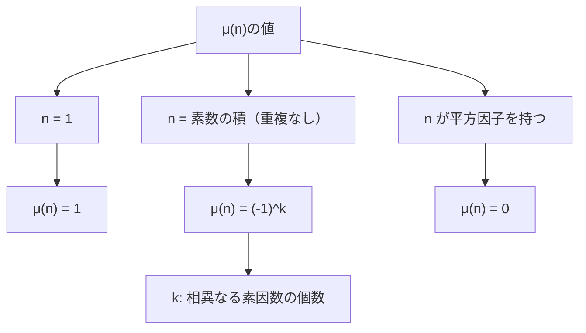
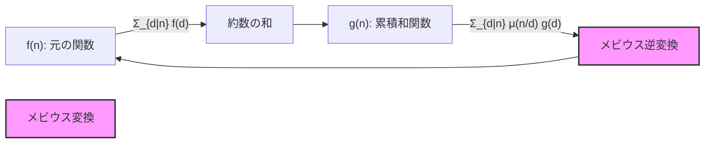
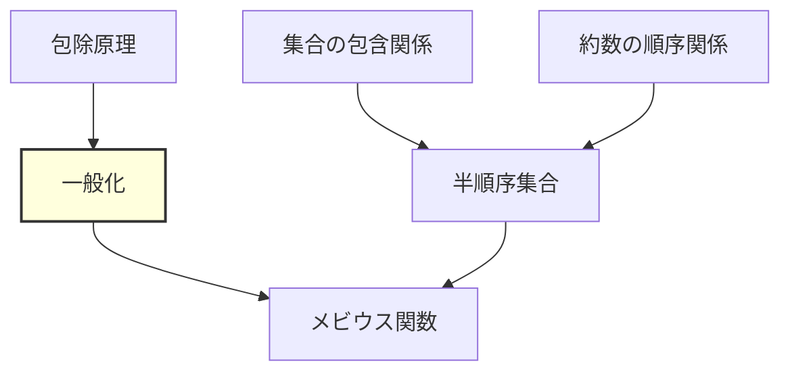
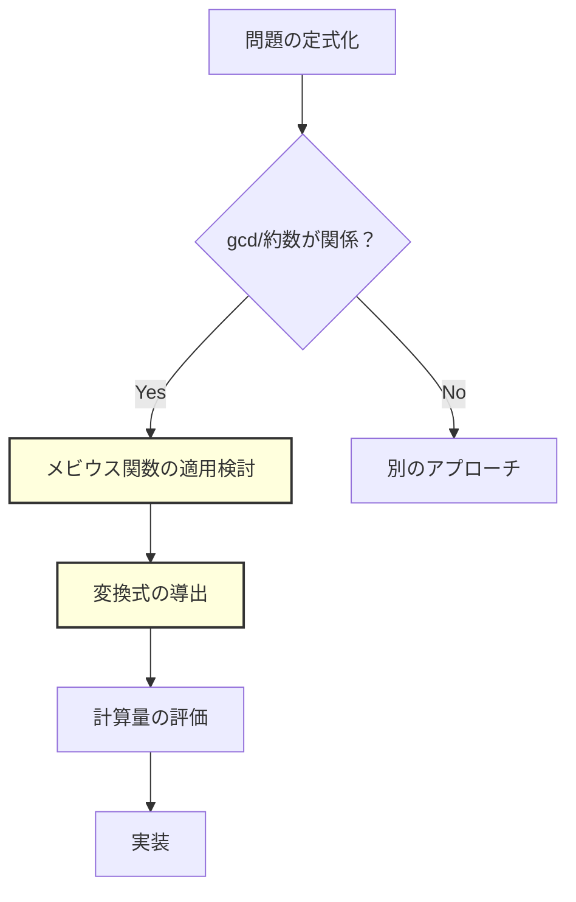

# メビウス関数

メビウス関数は数論における最も重要な関数の一つであり、競技プログラミングにおいても包除原理の一般化やディリクレ積の反転など、高度な計数問題を解く際の強力な道具となる。本稿では、メビウス関数の数学的な定義から始め、メビウスの反転公式の導出、そして競技プログラミングにおける実践的な応用まで、体系的に解説する。

## メビウス関数の定義と基本性質

メビウス関数 $\mu(n)$ は、正の整数 $n$ に対して以下のように定義される算術関数である：

$$\mu(n) = \begin{cases}
1 & \text{if } n = 1 \\
(-1)^k & \text{if } n = p_1 p_2 \cdots p_k \text{ （相異なる素数の積）} \\
0 & \text{if } n \text{ が平方因子を持つ}
\end{cases}$$

この定義から、メビウス関数は素因数分解の構造に依存する乗法的関数であることがわかる。乗法的とは、互いに素な整数 $a, b$ に対して $\mu(ab) = \mu(a)\mu(b)$ が成り立つことを意味する。



メビウス関数の最も重要な性質は、約数関数に関する次の和である：

$$\sum_{d|n} \mu(d) = \begin{cases}
1 & \text{if } n = 1 \\
0 & \text{if } n > 1
\end{cases}$$

この性質は $[n = 1]$ と表記されることもあり、メビウスの反転公式の基礎となる。証明は $n$ の素因数分解 $n = p_1^{a_1} p_2^{a_2} \cdots p_k^{a_k}$ を考えることで行える。$n$ の約数 $d$ のうち、$\mu(d) \neq 0$ となるのは平方因子を持たない約数、すなわち各素因数を高々1回ずつ含む約数のみである。これらの約数は $n$ の相異なる素因数の部分集合と1対1に対応し、その個数を $i$ とする部分集合に対して $\mu(d) = (-1)^i$ となる。したがって：

$$\sum_{d|n} \mu(d) = \sum_{i=0}^{k} \binom{k}{i} (-1)^i = (1-1)^k = \begin{cases}
1 & \text{if } k = 0 \text{ (i.e., } n = 1\text{)} \\
0 & \text{if } k > 0
\end{cases}$$

## メビウスの反転公式

メビウス関数の真価は、メビウスの反転公式において発揮される。二つの算術関数 $f, g$ に対して、次の関係が成り立つ：

$$g(n) = \sum_{d|n} f(d) \Leftrightarrow f(n) = \sum_{d|n} \mu\left(\frac{n}{d}\right) g(d)$$

この公式は、約数の和で定義される関数から元の関数を復元する方法を与える。競技プログラミングの文脈では、しばしば次の形で現れる：

$$g(n) = \sum_{n|d} f(d) \Leftrightarrow f(n) = \sum_{n|d} \mu\left(\frac{d}{n}\right) g(d)$$



証明は、右辺に $g(n) = \sum_{d|n} f(d)$ を代入することで行える：

$$\sum_{d|n} \mu\left(\frac{n}{d}\right) g(d) = \sum_{d|n} \mu\left(\frac{n}{d}\right) \sum_{e|d} f(e)$$

和の順序を交換すると：

$$= \sum_{e|n} f(e) \sum_{\substack{d|n \\ e|d}} \mu\left(\frac{n}{d}\right) = \sum_{e|n} f(e) \sum_{d'|\frac{n}{e}} \mu(d')$$

ここで $d' = n/d$ と置換した。前節の性質より、$\sum_{d'|n/e} \mu(d') = [n/e = 1] = [n = e]$ であるから：

$$= \sum_{e|n} f(e) [n = e] = f(n)$$

## ディリクレ積と畳み込み

メビウス関数の理論をより深く理解するために、ディリクレ積の概念を導入する。二つの算術関数 $f, g$ のディリクレ積 $(f * g)(n)$ は次のように定義される：

$$(f * g)(n) = \sum_{d|n} f(d) g\left(\frac{n}{d}\right)$$

ディリクレ積は結合法則と交換法則を満たし、恒等的に1である関数 $\varepsilon(n) = [n = 1]$ を単位元とする。すなわち、任意の算術関数 $f$ に対して $(f * \varepsilon) = f$ が成り立つ。

この枠組みにおいて、メビウス関数は定数関数 $\mathbf{1}(n) = 1$ の逆元として特徴づけられる：

$$(\mu * \mathbf{1})(n) = \sum_{d|n} \mu(d) = \varepsilon(n)$$

したがって、メビウスの反転公式は「$g = f * \mathbf{1}$ ならば $f = g * \mu$」という、ディリクレ積における逆元の関係として理解できる。

## 競技プログラミングにおける実装

メビウス関数の実装において最も重要なのは、前計算の効率性である。エラトステネスの篩を応用することで、$O(n \log \log n)$ の時間計算量で $1$ から $n$ までのすべてのメビウス関数値を計算できる：

```cpp
vector<int> mobius(int n) {
    vector<int> mu(n + 1, 1);
    vector<bool> is_prime(n + 1, true);
    
    for (int i = 2; i <= n; i++) {
        if (is_prime[i]) {
            for (int j = i; j <= n; j += i) {
                is_prime[j] = false;
                mu[j] = -mu[j];
            }
            long long sq = (long long)i * i;
            if (sq <= n) {
                for (long long j = sq; j <= n; j += sq) {
                    mu[j] = 0;
                }
            }
        }
    }
    
    return mu;
}
```

この実装では、各素数 $p$ に対して、$p$ の倍数の符号を反転させ、$p^2$ の倍数を0に設定している。素数判定と同時にメビウス関数値を計算することで、効率的な前処理を実現している。

## 包除原理との関係

メビウス関数は包除原理の一般化として理解することができる。有限集合 $S = \{1, 2, \ldots, n\}$ に対して、各要素 $i$ が性質 $P_i$ を持つかどうかを考える。すべての性質を満たさない要素の個数は：

$$\left| \bigcap_{i=1}^{n} \overline{P_i} \right| = \sum_{T \subseteq S} (-1)^{|T|} \left| \bigcap_{i \in T} P_i \right|$$

この公式において、$(-1)^{|T|}$ の部分がメビウス関数の値と対応している。より一般的に、半順序集合上のメビウス関数を定義することで、包除原理を抽象化できる。

競技プログラミングでよく現れる例として、$\gcd(i, n) = 1$ となる $1 \leq i \leq n$ の個数を求める問題がある。これはオイラーのトーシェント関数 $\phi(n)$ であり、メビウス関数を用いて：

$$\phi(n) = \sum_{d|n} \mu(d) \frac{n}{d}$$

と表される。これは $g(n) = n$ に対するメビウス逆変換の適用例である。



## 典型的な問題パターン

競技プログラミングにおいて、メビウス関数が活用される典型的なパターンをいくつか考察する。

第一のパターンは、$\gcd$ に関する計数問題である。例えば、$1 \leq i, j \leq n$ で $\gcd(i, j) = k$ となる順序対 $(i, j)$ の個数を求める問題を考える。直接的な計算は困難だが、$\gcd(i, j) = k$ は $\gcd(i/k, j/k) = 1$ と同値であることを利用し、メビウス関数を用いて：

$$\sum_{i=1}^{\lfloor n/k \rfloor} \sum_{j=1}^{\lfloor n/k \rfloor} [\gcd(i, j) = 1] = \sum_{d=1}^{\lfloor n/k \rfloor} \mu(d) \left\lfloor \frac{n}{kd} \right\rfloor^2$$

と変形できる。この変形により、計算量を $O(n^2)$ から $O(n)$ に改善できる。

第二のパターンは、約数関数の逆変換である。配列 $a$ に対して $b_i = \sum_{j|i} a_j$ という変換を考える。この逆変換は：

$$a_i = \sum_{j|i} \mu\left(\frac{i}{j}\right) b_j$$

で与えられる。この操作は、動的計画法において状態の依存関係が約数関係にある場合に有用である。

第三のパターンは、調和級数の和に関する問題である。$\sum_{i=1}^{n} f(\gcd(i, n))$ の形の和は、約数ごとにまとめることで：

$$\sum_{d|n} f(d) \sum_{i=1}^{n} [\gcd(i, n) = d] = \sum_{d|n} f(d) \phi\left(\frac{n}{d}\right)$$

と変形できる。ここで $\phi$ はオイラーのトーシェント関数である。

## 高度な応用：ディリクレ級数と解析的整数論

メビウス関数は解析的整数論においても中心的な役割を果たす。リーマンゼータ関数 $\zeta(s) = \sum_{n=1}^{\infty} n^{-s}$ に対して：

$$\frac{1}{\zeta(s)} = \sum_{n=1}^{\infty} \frac{\mu(n)}{n^s}$$

が成り立つ。この関係は、素数分布に関する深い結果につながる。競技プログラミングの文脈では、この関係を用いて効率的なアルゴリズムを設計することがある。

例えば、$\sum_{i=1}^{n} \mu(i)$ の計算は、直接計算すると $O(n)$ かかるが、メビウス関数の和に関する次の関係式：

$$\sum_{i=1}^{n} \mu(i) = 1 - \sum_{d=2}^{n} \sum_{i=1}^{\lfloor n/d \rfloor} \mu(i)$$

を用いることで、メモ化と組み合わせて $O(n^{2/3})$ で計算できる。これは数論的関数の和を高速に計算する一般的な手法の一例である。

## 実装上の注意点とデバッグ

メビウス関数を用いたアルゴリズムの実装において、いくつかの注意点がある。第一に、メビウス関数の値は $-1, 0, 1$ のいずれかであるため、符号の扱いに注意が必要である。特に、モジュラー演算を行う場合は、負の値を適切に処理する必要がある。

第二に、大きな数に対するメビウス関数値を求める場合、素因数分解が必要となる。$10^{12}$ 程度までの数であれば、$\sqrt{n}$ までの試し割りで十分だが、それ以上の場合はミラー・ラビン素数判定法やポラード・ロー法などの高度なアルゴリズムが必要となる。

第三に、メビウス逆変換を適用する際の計算順序に注意が必要である。約数の大きい方から計算するか小さい方から計算するかで、実装の複雑さが変わることがある。



メビウス関数は、その簡潔な定義にもかかわらず、数論の深い構造を反映した豊かな性質を持つ。競技プログラミングにおいては、包除原理の一般化として、また約数関数の逆変換の道具として、高度な計数問題を解く際の強力な武器となる。その理論的な美しさと実用的な有用性の両方を理解することで、より洗練されたアルゴリズムの設計が可能となる。