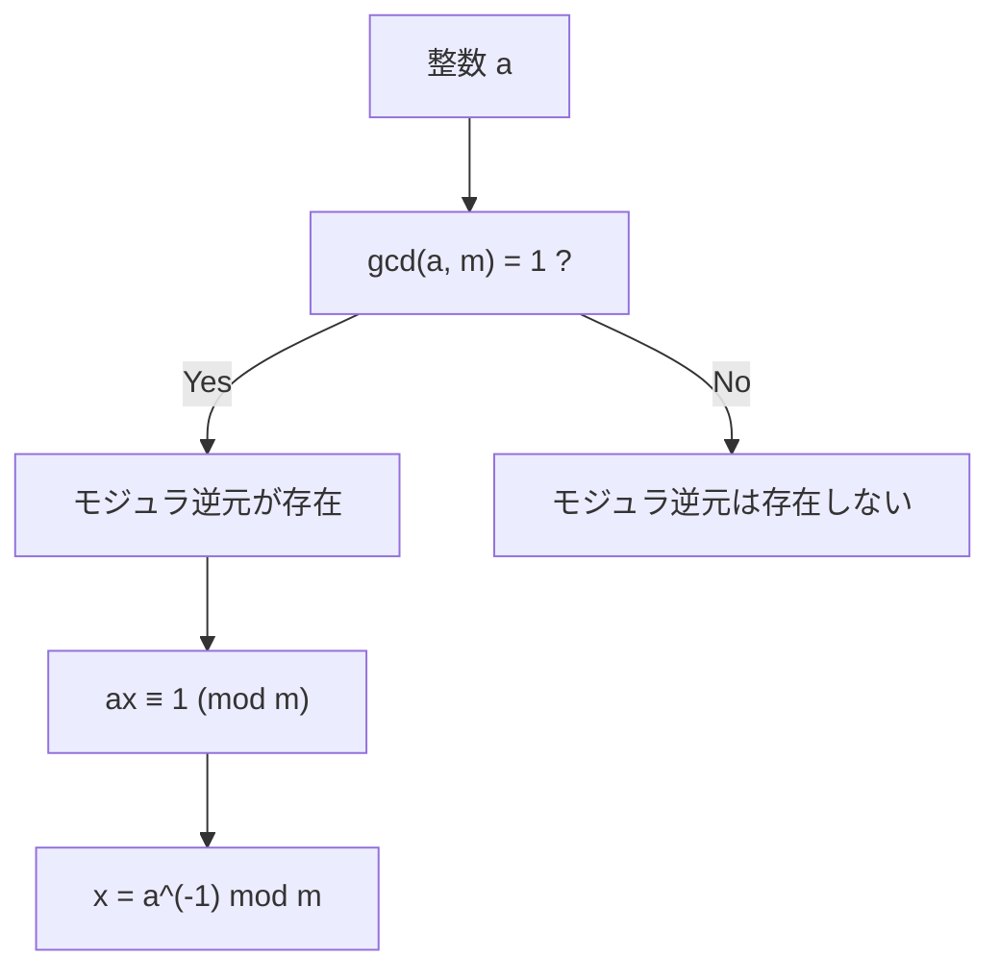
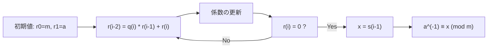
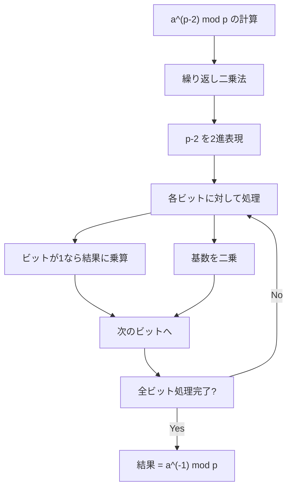
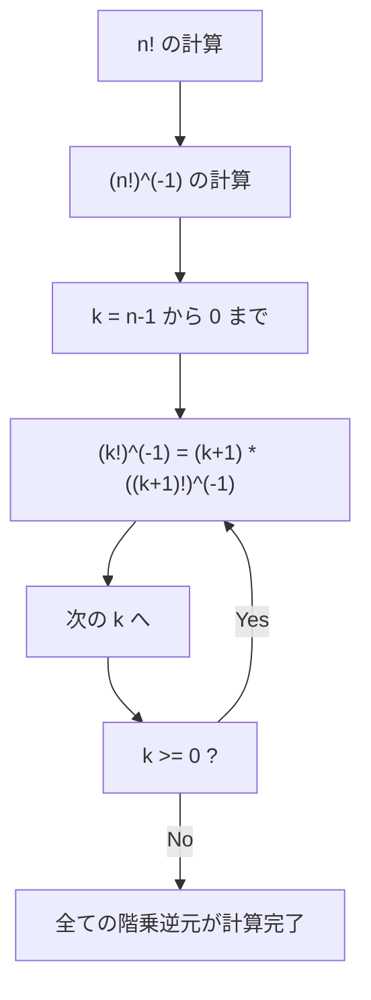

# モジュラ逆元

モジュラ逆元は、整数論における基本的な概念でありながら、競技プログラミングにおいて除算を含む計算を効率的に処理するための重要な道具となっている。本稿では、モジュラ逆元の数学的定義から始め、その計算手法、そして競技プログラミングにおける実践的な応用について詳述する。

## 数学的定義と基礎概念

整数$a$に対して、ある法$m$の下でのモジュラ逆元とは、次の合同式を満たす整数$x$のことである：

$$ax \equiv 1 \pmod{m}$$

この$x$を$a^{-1} \bmod m$と表記する。モジュラ逆元が存在するための必要十分条件は、$\gcd(a, m) = 1$、すなわち$a$と$m$が互いに素であることである。この条件は、ベズーの恒等式から導かれる重要な性質である。

モジュラ逆元の存在性を理解するには、剰余環の概念が有用である。法$m$による剰余環$\mathbb{Z}/m\mathbb{Z}$において、元$[a]$が逆元を持つのは、まさに$a$と$m$が互いに素である場合に限られる。この事実は、環論における単元の概念と密接に関連している。



モジュラ逆元の一意性についても言及しておく必要がある。モジュラ逆元が存在する場合、それは法$m$の下で一意に定まる。つまり、$ax_1 \equiv 1 \pmod{m}$かつ$ax_2 \equiv 1 \pmod{m}$であれば、$x_1 \equiv x_2 \pmod{m}$が成り立つ。

## 拡張ユークリッドの互除法による計算

モジュラ逆元を計算する最も一般的な方法は、拡張ユークリッドの互除法を使用することである。この手法は、$\gcd(a, m) = 1$のとき、次のベズーの恒等式を満たす整数$x, y$を効率的に求める：

$$ax + my = 1$$

この式を法$m$で考えると、$ax \equiv 1 \pmod{m}$となり、$x$がまさに求めるモジュラ逆元である。

拡張ユークリッドの互除法のアルゴリズムは、通常のユークリッドの互除法を拡張したものである。各ステップで、現在の剰余が前の二つの剰余の線形結合としてどのように表されるかを追跡する。



アルゴリズムの各ステップでは、以下の不変量が保たれる：
- $r_i = s_i \cdot a + t_i \cdot m$

ここで、$r_i$は$i$番目の剰余、$s_i$と$t_i$は対応する係数である。アルゴリズムが終了したとき、$\gcd(a, m) = r_k = s_k \cdot a + t_k \cdot m = 1$となり、$s_k$が求めるモジュラ逆元となる。

計算量の観点から見ると、拡張ユークリッドの互除法の時間計算量は$O(\log \min(a, m))$である。これは、通常のユークリッドの互除法と同じオーダーであり、各ステップで剰余が少なくとも半分になることから導かれる。

## フェルマーの小定理を用いた計算

$m$が素数$p$の場合、フェルマーの小定理を利用してモジュラ逆元を計算できる。フェルマーの小定理は次のように述べられる：

$$a^{p-1} \equiv 1 \pmod{p} \quad (\text{ただし} \gcd(a, p) = 1)$$

両辺を$a$で割ると：

$$a^{p-2} \equiv a^{-1} \pmod{p}$$

したがって、$a^{p-2} \bmod p$を計算することで、モジュラ逆元を求めることができる。

この手法の利点は、実装が簡潔であることと、高速な冪乗計算アルゴリズムを使用できることである。繰り返し二乗法（binary exponentiation）を用いれば、$a^{p-2} \bmod p$を$O(\log p)$時間で計算できる。



フェルマーの小定理による方法は、法が素数の場合に限定されるが、競技プログラミングでは法として$10^9 + 7$や$998244353$などの大きな素数が頻繁に使用されるため、実用的な価値が高い。

## オイラーの定理による一般化

法$m$が素数でない場合でも、$\gcd(a, m) = 1$であれば、オイラーの定理を用いてモジュラ逆元を計算できる：

$$a^{\phi(m)} \equiv 1 \pmod{m}$$

ここで、$\phi(m)$はオイラーのトーシェント関数であり、$1$から$m$までの整数のうち$m$と互いに素なものの個数を表す。これより：

$$a^{\phi(m)-1} \equiv a^{-1} \pmod{m}$$

ただし、$\phi(m)$の計算は一般に$m$の素因数分解を必要とするため、$m$が大きい場合には実用的でないことが多い。

## 競技プログラミングにおける実装と最適化

競技プログラミングでは、モジュラ逆元の計算は頻繁に現れる操作である。特に、組み合わせ数の計算や、分数を含む式の計算において重要な役割を果たす。

最も基本的な実装は、拡張ユークリッドの互除法を用いたものである：

```cpp
// Extended Euclidean Algorithm
long long extgcd(long long a, long long b, long long &x, long long &y) {
    if (b == 0) {
        x = 1;
        y = 0;
        return a;
    }
    long long x1, y1;
    long long gcd = extgcd(b, a % b, x1, y1);
    x = y1;
    y = x1 - (a / b) * y1;
    return gcd;
}

// Modular inverse using extended GCD
long long modinv(long long a, long long m) {
    long long x, y;
    extgcd(a, m, x, y);
    return (x % m + m) % m;
}
```

法が素数の場合は、フェルマーの小定理を用いた実装が簡潔である：

```cpp
// Fast exponentiation
long long modpow(long long base, long long exp, long long mod) {
    long long result = 1;
    while (exp > 0) {
        if (exp % 2 == 1) {
            result = (result * base) % mod;
        }
        base = (base * base) % mod;
        exp /= 2;
    }
    return result;
}

// Modular inverse using Fermat's little theorem
long long modinv_fermat(long long a, long long p) {
    return modpow(a, p - 2, p);
}
```

実装上の注意点として、オーバーフローの回避が挙げられる。特に、$64$ビット整数を扱う場合、乗算でオーバーフローが発生する可能性がある。この問題を回避するために、$128$ビット整数型を使用するか、乗算を加算の繰り返しで実装する必要がある場合がある。

## 階乗のモジュラ逆元の前計算

組み合わせ数の計算など、多数のモジュラ逆元を必要とする場合、前計算によって効率を大幅に改善できる。特に、階乗とその逆元の前計算は頻繁に使用されるテクニックである。

$n!$までの階乗とその逆元を前計算する場合、まず$n!$を計算し、その逆元$(n!)^{-1}$を求める。その後、以下の関係式を用いて、残りの階乗の逆元を逆順に計算する：

$$(k!)^{-1} = (k+1) \cdot ((k+1)!)^{-1} \pmod{m}$$

この方法により、$O(n)$時間で全ての階乗の逆元を計算できる。各モジュラ逆元を個別に計算する場合の$O(n \log m)$時間と比較して、大幅な高速化が実現される。



## 線形時間でのモジュラ逆元の計算

$1$から$n$までの全ての整数のモジュラ逆元を求める場合、さらに効率的な$O(n)$アルゴリズムが存在する。このアルゴリズムは、以下の再帰関係を利用する：

$$i^{-1} \equiv -\lfloor p/i \rfloor \cdot (p \bmod i)^{-1} \pmod{p}$$

ここで、$p$は素数である。この関係式は、$p = qi + r$（ただし$0 < r < i$）と表したとき、$0 \equiv qi + r \pmod{p}$から導かれる。

実装は以下のようになる：

```cpp
vector<long long> inv(n + 1);
inv[1] = 1;
for (int i = 2; i <= n; i++) {
    inv[i] = (p - (p / i) * inv[p % i] % p) % p;
}
```

このアルゴリズムの正当性は、数学的帰納法によって証明される。基底として$1^{-1} = 1$は明らかであり、$i > 1$に対して、より小さい値の逆元が正しく計算されていれば、上記の式によって$i^{-1}$も正しく計算される。

## 除算を含む計算への応用

競技プログラミングにおいて、モジュラ逆元の最も重要な応用は、法$m$の下での除算の実現である。通常の除算$a/b$は、法$m$の下では$a \cdot b^{-1} \bmod m$として計算される。

例えば、組み合わせ数$\binom{n}{k} = \frac{n!}{k!(n-k)!}$の計算では、階乗の除算が必要となる。これを法$m$の下で計算する場合：

$$\binom{n}{k} \equiv n! \cdot (k!)^{-1} \cdot ((n-k)!)^{-1} \pmod{m}$$

として計算される。階乗とその逆元を前計算しておけば、各組み合わせ数を$O(1)$時間で計算できる。

## 中国剰余定理との関連

モジュラ逆元は、中国剰余定理（Chinese Remainder Theorem, CRT）の実装においても重要な役割を果たす。複数の法に関する合同式の系を解く際、各法に対するモジュラ逆元の計算が必要となる。

$x \equiv a_i \pmod{m_i}$（$i = 1, 2, ..., k$）という合同式の系があり、$m_i$が互いに素である場合、解は次のように表される：

$$x = \sum_{i=1}^{k} a_i M_i (M_i)^{-1} \pmod{M}$$

ここで、$M = \prod_{i=1}^{k} m_i$、$M_i = M/m_i$であり、$(M_i)^{-1}$は$M_i$の法$m_i$におけるモジュラ逆元である。

## 実装上の落とし穴と対処法

モジュラ逆元の実装において、いくつかの一般的な落とし穴が存在する。第一に、負の数の扱いである。拡張ユークリッドの互除法で得られる解が負の場合、適切に正規化する必要がある：

```cpp
return (x % m + m) % m;
```

第二に、ゼロ除算の扱いである。$\gcd(a, m) \neq 1$の場合、モジュラ逆元は存在しない。実装では、この条件をチェックし、適切なエラー処理を行う必要がある。

第三に、オーバーフローの問題である。特に、$64$ビット整数を扱う場合、中間計算でオーバーフローが発生する可能性がある。これを回避するために、適切な型の選択や、Montgomery乗算などの高度なテクニックを使用することがある。

## 性能比較と使い分け

異なるモジュラ逆元計算手法の性能特性を理解することは、問題に応じた最適な手法の選択に重要である。拡張ユークリッドの互除法は汎用性が高く、任意の互いに素な$a$と$m$に対して使用できる。一方、フェルマーの小定理による方法は、法が素数の場合に限定されるが、実装が簡潔である。

計算量の観点では、両手法とも$O(\log m)$であるが、定数倍の違いが存在する。一般に、フェルマーの小定理による方法は、繰り返し二乗法の実装が最適化されている場合、わずかに高速である。

前計算を伴う手法は、多数のモジュラ逆元を必要とする場合に有効である。特に、階乗の逆元の前計算は、組み合わせ論的な問題において標準的なテクニックとなっている。

## 拡張と発展的話題

モジュラ逆元の概念は、より一般的な代数構造に拡張できる。例えば、行列のモジュラ逆元は、線形代数的な問題を法$m$の下で解く際に必要となる。$n \times n$行列$A$のモジュラ逆元$A^{-1}$は、$AA^{-1} \equiv I \pmod{m}$を満たす行列である。

多項式のモジュラ逆元も重要な概念である。多項式$f(x)$に対して、ある法多項式$g(x)$と整数$m$の下でのモジュラ逆元は、$f(x)h(x) \equiv 1 \pmod{g(x), m}$を満たす多項式$h(x)$である。これは、数論変換（Number Theoretic Transform, NTT）などの高度なアルゴリズムで使用される。

## 誤差解析と数値的安定性

浮動小数点演算と異なり、モジュラ演算は厳密である。しかし、実装上の誤りによって、期待される結果と異なる値が得られることがある。特に、符号付き整数のオーバーフローや、負の剰余の扱いには注意が必要である。

モジュラ逆元の検証は、計算結果$x$に対して$ax \bmod m = 1$を確認することで行える。この検証は、特にデバッグ段階で有用である。

競技プログラミングの文脈では、時間制限との兼ね合いから、完全な誤り検出を実装することは現実的でない場合が多い。しかし、典型的な誤りパターンを理解し、それらを回避する実装を心がけることは重要である。

## 実践的な設計指針

モジュラ逆元を使用するシステムを設計する際、いくつかの指針に従うことで、効率的で保守性の高い実装を実現できる。第一に、モジュラ逆元の計算をカプセル化し、再利用可能なライブラリとして実装することである。これにより、実装の一貫性と信頼性が向上する。

第二に、問題の特性に応じた最適な手法を選択することである。単一のモジュラ逆元が必要な場合は拡張ユークリッドの互除法、法が素数で複数回の計算が必要な場合はフェルマーの小定理、大量の逆元が必要な場合は前計算を伴う手法を選択する。

第三に、エラー処理を適切に実装することである。モジュラ逆元が存在しない場合の処理を明確に定義し、予期しない動作を防ぐ。

モジュラ逆元は、整数論の基礎概念でありながら、競技プログラミングにおいて極めて実践的な価値を持つ。その理論的背景を理解し、効率的な実装技法を習得することで、より複雑な問題への取り組みが可能となる。拡張ユークリッドの互除法からフェルマーの小定理、そして前計算を用いた最適化まで、各手法の特性を理解し、問題に応じて適切に使い分けることが、競技プログラミングにおける成功の鍵となる。