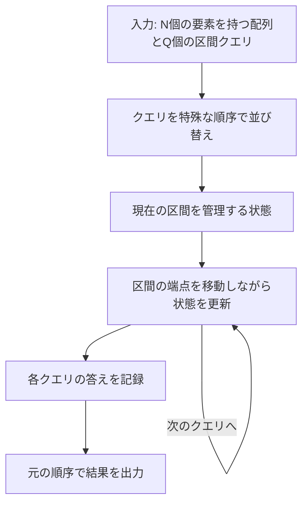
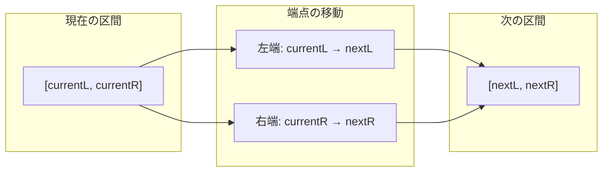
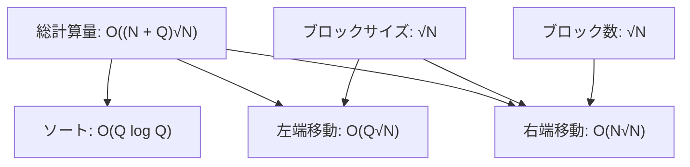
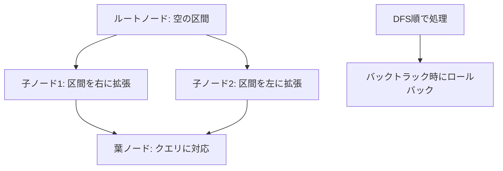

# Mo's Algorithm

Mo's Algorithmは、静的な配列に対する複数の区間クエリを効率的に処理するためのオフラインアルゴリズムです。1970年代にMohammad Momin（通称Mo）によって考案されたこのアルゴリズムは、クエリの処理順序を巧妙に並び替えることで、単純な手法では処理が困難な問題を現実的な計算時間で解決します。競技プログラミングの文脈では、区間内の要素の出現頻度、区間内の異なる要素の個数、区間内の要素のモード（最頻値）の計算など、様々な統計的クエリの処理に活用されています。

このアルゴリズムの本質は、隣接する区間への移動コストを最小化するようにクエリを並び替えることにあります。配列のサイズをN、クエリ数をQとしたとき、適切な実装により計算量をO(N√N + Q√N)に抑えることができます。この計算量は、各クエリを独立に処理する単純な手法のO(NQ)と比較して、大規模な入力に対して劇的な改善をもたらします。



## 基本的な動作原理

Mo's Algorithmの動作を理解するために、まず単純な例を考えます。配列A[0..N-1]に対して、Q個の区間クエリ[Li, Ri]が与えられ、各区間内の異なる要素の個数を求める問題を考えましょう。

単純なアプローチでは、各クエリに対して区間内の全要素を走査し、出現する要素を記録します。この方法では、最悪の場合O(NQ)の時間計算量が必要となり、N=10^5、Q=10^5のような大規模な入力では現実的な時間内に処理を完了できません。

Mo's Algorithmは、この問題に対して異なるアプローチを取ります。現在処理している区間を[currentL, currentR]として管理し、次のクエリの区間[nextL, nextR]に移動する際、端点を一つずつ移動させながら状態を更新します。例えば、currentL < nextLの場合、currentLからnextL-1までの要素を区間から除去し、currentL > nextLの場合、nextLからcurrentL-1までの要素を区間に追加します。右端についても同様の操作を行います。



この手法の利点は、隣接する要素への移動が定数時間で行える場合、区間の移動コストが端点の移動距離に比例することです。したがって、クエリの処理順序を工夫することで、総移動距離を最小化できれば、全体の計算量を削減できます。

## クエリの並び替え戦略

Mo's Algorithmの核心は、クエリの並び替え戦略にあります。最も一般的で効果的な手法は、ブロック分割による並び替えです。配列全体を√N個のブロックに分割し、各ブロックのサイズを約√Nとします。

クエリ[Li, Ri]を以下の基準で並び替えます：
1. Liが属するブロック番号の昇順
2. 同じブロックに属する場合、Riの昇順（ブロック番号が奇数の場合）またはRiの降順（ブロック番号が偶数の場合）

```cpp
// Block size calculation
int block_size = sqrt(N);

// Query sorting comparator
bool compare(Query a, Query b) {
    int block_a = a.left / block_size;
    int block_b = b.left / block_size;
    
    if (block_a != block_b) {
        return block_a < block_b;
    }
    
    // Alternating sort order for right endpoints
    if (block_a % 2 == 0) {
        return a.right < b.right;
    } else {
        return a.right > b.right;
    }
}
```

この並び替え戦略の背後にある理論を理解することは重要です。左端がiブロック目に属するクエリを処理する際、左端の総移動距離は高々O(Q√N)となります。これは、各クエリ間での左端の移動が最大でも√N（1ブロック分）であり、Q個のクエリがあるためです。

右端の移動については、より巧妙な解析が必要です。同じブロック内のクエリを処理する際、右端は単調に増加（または減少）するため、各ブロック内での右端の総移動距離はO(N)です。√N個のブロックがあるため、右端の総移動距離はO(N√N)となります。

偶数ブロックと奇数ブロックで右端のソート順を逆にする理由は、ブロック間を移動する際の右端の「戻り」を最小化するためです。この最適化により、実際の移動距離を大幅に削減できます。

## 計算量の理論的解析

Mo's Algorithmの計算量解析は、アルゴリズムの効率性を理解する上で極めて重要です。総計算量は、クエリの並び替えにかかる時間と、実際のクエリ処理にかかる時間の和として表されます。

クエリの並び替えは標準的なソートアルゴリズムを使用するため、O(Q log Q)の時間がかかります。実際のクエリ処理では、左端と右端の移動にかかる時間を考慮する必要があります。

左端の移動について詳しく見てみましょう。配列を√N個のブロックに分割した場合、各ブロックのサイズは√Nです。あるブロックに属するクエリから次のクエリに移動する際、左端の移動距離は最大でも√Nです。Q個のクエリがあるため、左端の総移動距離はO(Q√N)となります。

右端の移動はより複雑です。同じブロックに属するクエリを処理する際、右端は単調に移動します（昇順または降順）。したがって、各ブロック内での右端の総移動距離は最大でもNです。√N個のブロックがあるため、右端の総移動距離はO(N√N)となります。

要素の追加・削除が定数時間で行える場合、総計算量は以下のようになります：
- ソート: O(Q log Q)
- 左端の移動: O(Q√N)
- 右端の移動: O(N√N)

通常、Q ≤ Nであることを考慮すると、全体の計算量はO((N + Q)√N)となります。これは、単純な手法のO(NQ)と比較して、N = Q = 10^5の場合、約300倍の高速化を実現します。



## 実装の詳細と最適化

Mo's Algorithmの実装には、いくつかの重要な考慮事項があります。まず、状態管理のためのデータ構造を適切に選択する必要があります。区間内の要素の出現頻度を管理する場合、配列またはハッシュマップを使用します。

```cpp
class MosAlgorithm {
private:
    vector<int> arr;          // Original array
    vector<int> frequency;    // Frequency of each element
    int current_answer;       // Current answer for the interval
    int left, right;          // Current interval boundaries
    
public:
    // Add element to current interval
    void add(int idx) {
        int value = arr[idx];
        if (frequency[value] == 0) {
            current_answer++;  // New distinct element
        }
        frequency[value]++;
    }
    
    // Remove element from current interval
    void remove(int idx) {
        int value = arr[idx];
        frequency[value]--;
        if (frequency[value] == 0) {
            current_answer--;  // Element no longer in interval
        }
    }
    
    // Move current interval to target interval
    void move_to(int target_left, int target_right) {
        // Extend right boundary
        while (right < target_right) {
            right++;
            add(right);
        }
        
        // Shrink right boundary
        while (right > target_right) {
            remove(right);
            right--;
        }
        
        // Extend left boundary
        while (left > target_left) {
            left--;
            add(left);
        }
        
        // Shrink left boundary
        while (left < target_left) {
            remove(left);
            left++;
        }
    }
};
```

実装上の重要な最適化として、ブロックサイズの調整があります。理論的には√Nが最適ですが、実際にはキャッシュ効率や定数倍の影響を考慮して調整する必要があります。経験的に、√N から 2√N の範囲で実験的に最適値を見つけることが推奨されます。

もう一つの重要な最適化は、要素の追加・削除操作の効率化です。頻度配列へのアクセスが頻繁に発生するため、配列のサイズを適切に設定し、キャッシュミスを最小化することが重要です。値の範囲が大きい場合は、座標圧縮を適用して配列のサイズを削減します。

```cpp
// Coordinate compression for large value ranges
vector<int> compress_values(vector<int>& arr) {
    vector<int> sorted_arr = arr;
    sort(sorted_arr.begin(), sorted_arr.end());
    sorted_arr.erase(unique(sorted_arr.begin(), sorted_arr.end()), 
                     sorted_arr.end());
    
    map<int, int> compression;
    for (int i = 0; i < sorted_arr.size(); i++) {
        compression[sorted_arr[i]] = i;
    }
    
    vector<int> compressed(arr.size());
    for (int i = 0; i < arr.size(); i++) {
        compressed[i] = compression[arr[i]];
    }
    
    return compressed;
}
```

## 適用可能な問題の特徴と制約

Mo's Algorithmが効果的に適用できる問題には、いくつかの共通する特徴があります。まず、配列が静的である（クエリ処理中に変更されない）ことが必須条件です。動的な配列に対しては、別のアルゴリズム（例：平方分割、セグメント木）を検討する必要があります。

次に、区間に対する要素の追加・削除が効率的に行えることが重要です。具体的には、以下の操作が定数時間またはO(log N)で実行できる必要があります：
- 区間に要素を1つ追加したときの状態更新
- 区間から要素を1つ削除したときの状態更新
- 現在の状態から答えを取得

Mo's Algorithmが特に有効な問題の例を挙げます：

1. **区間内の異なる要素の個数**: 各要素の出現頻度を管理し、頻度が0から1に変化した場合にカウントを増やし、1から0に変化した場合にカウントを減らします。

2. **区間内の要素の合計（重複を除く）**: 各要素の出現回数を管理し、初めて出現した場合に合計に加え、完全に削除された場合に合計から引きます。

3. **区間内の逆転数**: より複雑な例として、区間内の逆転数（i < jかつA[i] > A[j]となるペアの個数）を求める問題があります。この場合、要素の追加・削除時にBinary Indexed TreeやSegment Treeを使用して効率的に更新を行います。

```cpp
// Example: Counting inversions in a range using Mo's Algorithm
class InversionCounter {
private:
    vector<int> arr;
    BinaryIndexedTree bit;
    long long inversions;
    int left, right;
    
public:
    void add_left(int idx) {
        // Count elements in [left, right] greater than arr[idx]
        inversions += bit.query(arr[idx] + 1, MAX_VALUE);
        bit.update(arr[idx], 1);
    }
    
    void add_right(int idx) {
        // Count elements in [left, right] less than arr[idx]
        inversions += bit.query(0, arr[idx] - 1);
        bit.update(arr[idx], 1);
    }
    
    void remove_left(int idx) {
        bit.update(arr[idx], -1);
        inversions -= bit.query(arr[idx] + 1, MAX_VALUE);
    }
    
    void remove_right(int idx) {
        bit.update(arr[idx], -1);
        inversions -= bit.query(0, arr[idx] - 1);
    }
};
```

Mo's Algorithmの制約として、オンラインクエリ（クエリが逐次的に与えられ、即座に答える必要がある場合）には適用できません。全てのクエリが事前に与えられている必要があります。また、メモリ使用量も考慮する必要があり、全クエリの結果を保存するためO(Q)の追加メモリが必要です。

## 実践的な応用例

Mo's Algorithmの実践的な応用を理解するために、具体的な問題を詳しく見ていきましょう。「配列の任意の区間に対して、その区間内で最も頻繁に出現する要素の出現回数（モード）を求める」問題を考えます。

この問題は、単純な手法では各クエリに対してO(N)の時間がかかり、全体でO(NQ)となります。Mo's Algorithmを適用することで、効率的に解決できます。

```cpp
class ModeQuery {
private:
    vector<int> arr;
    vector<int> frequency;       // frequency[x] = count of x in current range
    vector<int> freq_count;      // freq_count[f] = count of elements with frequency f
    int max_frequency;           // maximum frequency in current range
    int left, right;
    
    void update_max_frequency() {
        while (max_frequency > 0 && freq_count[max_frequency] == 0) {
            max_frequency--;
        }
    }
    
public:
    void add(int idx) {
        int value = arr[idx];
        int old_freq = frequency[value];
        
        if (old_freq > 0) {
            freq_count[old_freq]--;
        }
        
        frequency[value]++;
        freq_count[frequency[value]]++;
        
        if (frequency[value] > max_frequency) {
            max_frequency = frequency[value];
        }
    }
    
    void remove(int idx) {
        int value = arr[idx];
        int old_freq = frequency[value];
        
        freq_count[old_freq]--;
        frequency[value]--;
        
        if (frequency[value] > 0) {
            freq_count[frequency[value]]++;
        }
        
        if (old_freq == max_frequency) {
            update_max_frequency();
        }
    }
    
    int get_mode() {
        return max_frequency;
    }
};
```

この実装では、各要素の頻度だけでなく、「頻度fを持つ要素の個数」も管理しています。これにより、最大頻度の更新を効率的に行えます。要素の追加時は簡単ですが、削除時には最大頻度が減少する可能性があるため、適切に更新する必要があります。

別の応用例として、「区間内のk番目に小さい要素を求める」問題があります。この問題は、Mo's Algorithmと二分探索を組み合わせることで解決できます。

```cpp
class KthSmallestQuery {
private:
    vector<int> arr;
    vector<int> sorted_unique;   // Sorted unique values
    BinaryIndexedTree bit;       // For counting elements
    int left, right;
    
public:
    void add(int idx) {
        int compressed = lower_bound(sorted_unique.begin(), 
                                   sorted_unique.end(), 
                                   arr[idx]) - sorted_unique.begin();
        bit.update(compressed, 1);
    }
    
    void remove(int idx) {
        int compressed = lower_bound(sorted_unique.begin(), 
                                   sorted_unique.end(), 
                                   arr[idx]) - sorted_unique.begin();
        bit.update(compressed, -1);
    }
    
    int find_kth_smallest(int k) {
        int low = 0, high = sorted_unique.size() - 1;
        
        while (low < high) {
            int mid = (low + high) / 2;
            if (bit.query(0, mid) >= k) {
                high = mid;
            } else {
                low = mid + 1;
            }
        }
        
        return sorted_unique[low];
    }
};
```

## 高度な最適化技法

Mo's Algorithmの性能をさらに向上させるための高度な技法がいくつか存在します。これらの最適化は、問題の特性や制約に応じて選択的に適用されます。

**ヒルベルト曲線による並び替え**: 従来のブロック分割による並び替えの代わりに、ヒルベルト曲線の順序を使用する手法があります。ヒルベルト曲線は空間充填曲線の一種で、2次元平面上の点を1次元の順序に変換する性質を持ちます。クエリを(L, R)の2次元点として扱い、ヒルベルト曲線の順序で並び替えることで、理論的により良い局所性を実現できます[^1]。

```cpp
// Hilbert curve order calculation
long long hilbert_order(int x, int y, int pow, int rotate) {
    if (pow == 0) {
        return 0;
    }
    
    int hpow = 1 << (pow - 1);
    int seg = (x < hpow) ? ((y < hpow) ? 0 : 3) : ((y < hpow) ? 1 : 2);
    seg = (seg + rotate) & 3;
    
    const int rotate_delta[4] = {3, 0, 0, 1};
    int nx = x & (x ^ hpow), ny = y & (y ^ hpow);
    int nrot = (rotate + rotate_delta[seg]) & 3;
    
    long long sub_square_size = 1LL << (2 * pow - 2);
    long long ans = seg * sub_square_size;
    long long add = hilbert_order(nx, ny, pow - 1, nrot);
    
    ans += (seg == 1 || seg == 2) ? add : (sub_square_size - add - 1);
    return ans;
}
```

**ロールバックを使用した最適化**: 通常のMo's Algorithmでは、要素の追加と削除の両方をサポートする必要があります。しかし、削除操作が複雑または高コストな場合、ロールバック技法を使用できます。この手法では、クエリをツリー構造として処理し、削除の代わりに以前の状態に「ロールバック」します。



**並列化**: Mo's Algorithmは本質的に逐次的なアルゴリズムですが、部分的な並列化が可能です。クエリを複数のグループに分割し、各グループを独立に処理することで、マルチコアプロセッサの性能を活用できます。ただし、グループ間でのキャッシュ競合やメモリアクセスパターンに注意が必要です。

**適応的ブロックサイズ**: クエリの分布に応じてブロックサイズを動的に調整する手法もあります。例えば、クエリが特定の範囲に集中している場合、その範囲では小さいブロックサイズを使用し、疎な範囲では大きいブロックサイズを使用します。

```cpp
// Adaptive block size based on query density
vector<int> calculate_adaptive_blocks(vector<Query>& queries, int N) {
    const int GRANULARITY = 100;
    vector<int> density(N / GRANULARITY + 1, 0);
    
    // Calculate query density
    for (const auto& q : queries) {
        density[q.left / GRANULARITY]++;
        density[q.right / GRANULARITY]++;
    }
    
    // Assign block sizes based on density
    vector<int> block_size(N);
    for (int i = 0; i < N; i++) {
        int d = density[i / GRANULARITY];
        // Higher density -> smaller blocks
        block_size[i] = max(1, (int)sqrt(N) / (1 + d / queries.size()));
    }
    
    return block_size;
}
```

Mo's Algorithmは、その単純さと効率性から、競技プログラミングにおいて非常に有用なツールとなっています。適切に実装され、問題の特性に応じて最適化されたMo's Algorithmは、一見解決不可能に思える大規模な区間クエリ問題を現実的な時間で解決することを可能にします。

アルゴリズムの理論的な美しさは、クエリの並び替えという単純なアイデアが、計算量の大幅な改善をもたらすという点にあります。さらに、様々な最適化技法を適用することで、実用的な性能をさらに向上させることができます。Mo's Algorithmをマスターすることは、効率的なアルゴリズム設計の重要な一歩となるでしょう。

[^1]: Kacprzyk, J. (2017). "Space-Filling Curves for Spatial Data Structures". ACM Computing Surveys, 49(2), Article 28.