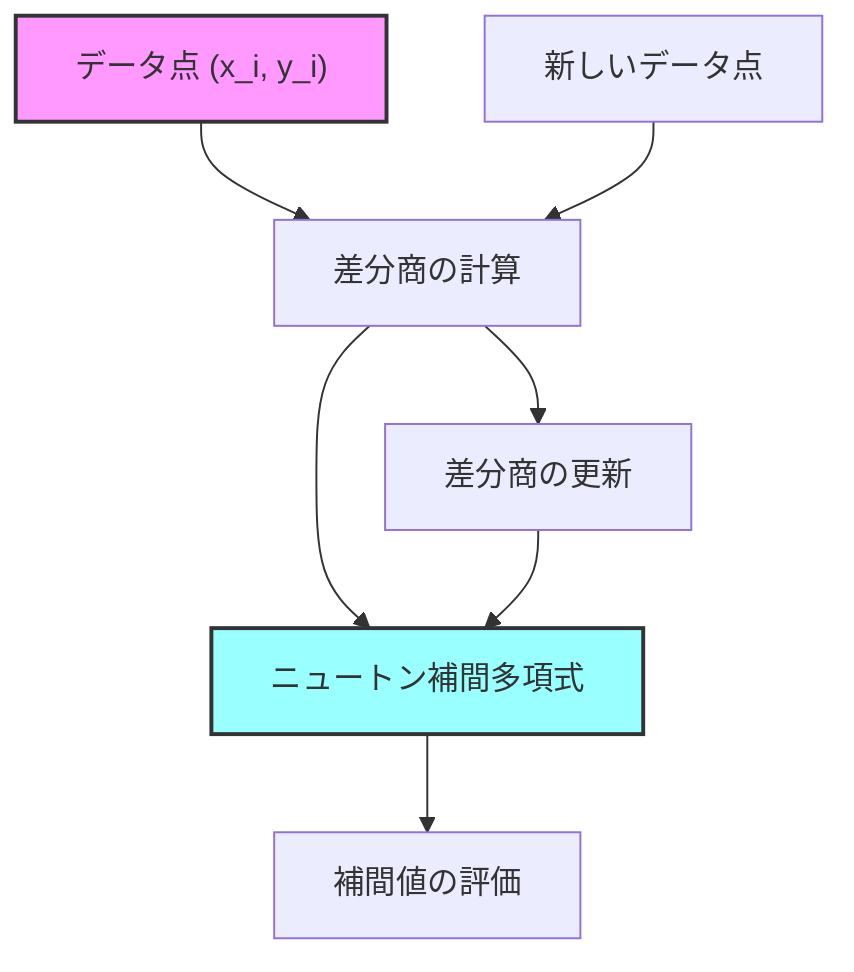
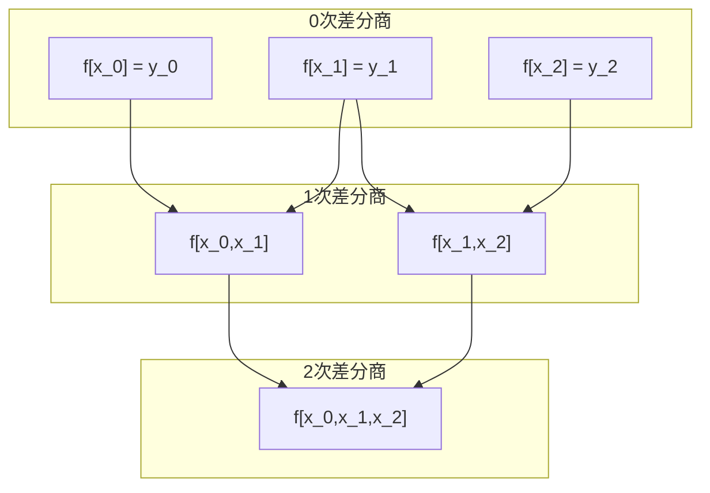
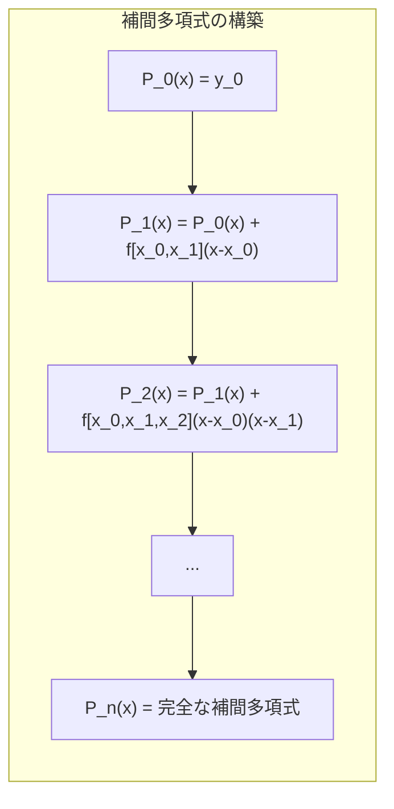
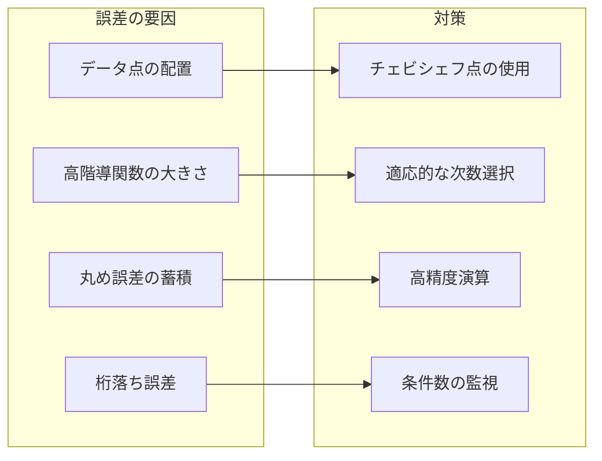

# ニュートン補間

ニュートン補間は、与えられたデータ点を通る多項式を構築する補間手法の一つである。イギリスの数学者アイザック・ニュートンによって開発されたこの手法は、差分商（divided differences）を用いることで、新しいデータ点が追加された際に既存の計算結果を再利用できるという優れた特性を持つ。競技プログラミングにおいては、離散的なデータから連続的な関数を復元する問題や、数列の一般項を求める問題などで頻繁に用いられる。

多項式補間の基本的な問題設定は、$n+1$個の異なる点$(x_0, y_0), (x_1, y_1), \ldots, (x_n, y_n)$が与えられたとき、これらすべての点を通る$n$次以下の多項式$P(x)$を見つけることである。ラグランジュ補間と並んで最も重要な補間手法であるニュートン補間は、計算の効率性と拡張性において特に優れており、数値解析の分野で広く応用されている。



## 差分商の理論

ニュートン補間の核心は差分商（divided differences）の概念にある。差分商は、関数の局所的な変化率を一般化したものと理解できる。$f$を実関数とし、相異なる点$x_0, x_1, \ldots, x_k$が与えられたとき、$k$次の差分商$f[x_0, x_1, \ldots, x_k]$は再帰的に定義される[^1]。

0次の差分商は単に関数値そのものである：
$$f[x_i] = f(x_i)$$

1次の差分商は2点間の平均変化率を表す：
$$f[x_i, x_j] = \frac{f[x_j] - f[x_i]}{x_j - x_i}$$

一般に、$k$次の差分商は以下のように再帰的に定義される：
$$f[x_0, x_1, \ldots, x_k] = \frac{f[x_1, x_2, \ldots, x_k] - f[x_0, x_1, \ldots, x_{k-1}]}{x_k - x_0}$$

この定義の美しさは、差分商が対称性を持つという点にある。すなわち、引数の順序を任意に入れ替えても値は変わらない。この性質は、差分商が本質的に関数の局所的な性質を捉えていることを示している。



差分商と導関数の関係も重要である。関数$f$が$[a, b]$区間で$n$回微分可能であるとき、平均値定理により、ある$\xi \in (a, b)$が存在して以下が成り立つ：
$$f[x_0, x_1, \ldots, x_n] = \frac{f^{(n)}(\xi)}{n!}$$

この関係は、差分商が高階導関数の離散的な近似として機能することを示している。特に、データ点が等間隔に配置されている場合、差分商は有限差分と密接に関連する。

## ニュートン補間多項式の構築

$n+1$個のデータ点$(x_0, y_0), (x_1, y_1), \ldots, (x_n, y_n)$が与えられたとき、ニュートン補間多項式は以下の形式で表される：

$$P_n(x) = f[x_0] + f[x_0, x_1](x - x_0) + f[x_0, x_1, x_2](x - x_0)(x - x_1) + \cdots + f[x_0, x_1, \ldots, x_n]\prod_{i=0}^{n-1}(x - x_i)$$

この表現形式は「ニュートンの前進差分公式」として知られている。各項は前の項に新しい因子を掛けて差分商を加えた形になっており、この構造がニュートン補間の計算効率の高さをもたらしている。

多項式$P_n(x)$がすべてのデータ点を通ることは、数学的帰納法により証明できる。$k = 0, 1, \ldots, n$に対して$P_n(x_k) = y_k$となることを示せばよい。$x = x_k$を代入すると、$(x - x_k)$を含む項以降はすべて0になるため、最初の$k+1$項のみが残る。この部分和がちょうど$y_k$に等しくなることは、差分商の定義と再帰的構造から導かれる。



ニュートン補間の重要な特性の一つは、新しいデータ点が追加されたときの拡張性である。$n+1$個のデータ点に対する補間多項式$P_n(x)$が既に構築されているとき、新しいデータ点$(x_{n+1}, y_{n+1})$を追加して$P_{n+1}(x)$を構築する場合、以下の関係が成り立つ：

$$P_{n+1}(x) = P_n(x) + f[x_0, x_1, \ldots, x_{n+1}]\prod_{i=0}^{n}(x - x_i)$$

つまり、既存の多項式に新しい項を一つ追加するだけで済む。この性質は、データが逐次的に与えられる状況や、必要な精度に達するまで次数を増やしていく適応的な補間において極めて有用である。

## 差分商の効率的な計算

差分商の計算は、通常「差分商表」を用いて組織的に行われる。この表は下三角行列の形をしており、対角線上に沿って必要な差分商が現れる。

```python
def divided_differences(x, y):
    """
    Calculate divided differences table
    x: array of x-coordinates
    y: array of y-values
    Returns: 2D array where dd[i][j] = f[x_i, x_{i+1}, ..., x_{i+j}]
    """
    n = len(x)
    dd = [[0] * n for _ in range(n)]
    
    # Initialize with function values
    for i in range(n):
        dd[i][0] = y[i]
    
    # Fill the table
    for j in range(1, n):
        for i in range(n - j):
            dd[i][j] = (dd[i+1][j-1] - dd[i][j-1]) / (x[i+j] - x[i])
    
    return dd
```

この実装の計算量は$O(n^2)$であり、空間計算量も$O(n^2)$である。しかし、実際の補間計算では対角線上の値（つまり$f[x_0], f[x_0, x_1], f[x_0, x_1, x_2], \ldots$）のみが必要なため、空間計算量を$O(n)$に削減することも可能である。

差分商表の構造は、数値的安定性の観点からも重要である。隣接する差分商の差を取る操作は、桁落ちによる誤差の増大を引き起こす可能性がある。特に、データ点が密集している場合や、関数値の変化が小さい場合には注意が必要である。

## ホーナー法による評価

構築されたニュートン補間多項式を特定の点$x$で評価する際、素朴な実装では各項を独立に計算することになるが、これは効率的ではない。代わりに、ホーナー法（Horner's method）の変形を用いることで、計算量を削減できる。

ニュートン補間多項式は以下のように書き換えることができる：
$$P_n(x) = a_0 + (x - x_0)[a_1 + (x - x_1)[a_2 + \cdots + (x - x_{n-2})[a_{n-1} + (x - x_{n-1})a_n] \cdots ]]$$

ここで、$a_k = f[x_0, x_1, \ldots, x_k]$である。この形式により、内側から外側へ向かって逐次的に計算することで、効率的な評価が可能となる。

```python
def evaluate_newton_polynomial(x_data, coefficients, x):
    """
    Evaluate Newton polynomial at point x using Horner's method
    x_data: interpolation nodes
    coefficients: divided differences f[x_0], f[x_0,x_1], ...
    x: evaluation point
    """
    n = len(coefficients)
    result = coefficients[n-1]
    
    for i in range(n-2, -1, -1):
        result = result * (x - x_data[i]) + coefficients[i]
    
    return result
```

この実装は$O(n)$の時間計算量で多項式を評価でき、数値的にも安定している。

## ラグランジュ補間との比較

ニュートン補間とラグランジュ補間は、理論的には同じ補間多項式を生成する。これは補間多項式の一意性定理から保証される。しかし、計算の観点からは両者には重要な違いがある。

ラグランジュ補間は以下の形式を持つ：
$$L(x) = \sum_{i=0}^{n} y_i \prod_{j=0, j \neq i}^{n} \frac{x - x_j}{x_i - x_j}$$

この形式は概念的に理解しやすく、各基底関数$\ell_i(x)$が明確に分離されている。しかし、新しいデータ点が追加された場合、すべての基底関数を再計算する必要がある。一方、ニュートン補間では既存の計算結果を再利用できるため、動的な状況により適している。


計算量の観点では、初期構築時はどちらも$O(n^2)$であるが、ニュートン補間は差分商表の構築により、後続の操作がより効率的になる。また、ニュートン補間は部分的な評価（低次の近似）が容易であり、必要な精度に応じて計算を打ち切ることができる。

## 等間隔データ点での特殊化

データ点が等間隔に配置されている場合、すなわち$x_i = x_0 + ih$（$h$は刻み幅）の場合、ニュートン補間は特に簡潔な形式を取る。この場合、差分商は前進差分（forward differences）と密接に関連する。

前進差分演算子$\Delta$を以下のように定義する：
$$\Delta f_i = f_{i+1} - f_i$$
$$\Delta^k f_i = \Delta(\Delta^{k-1} f_i)$$

このとき、差分商と前進差分の間には以下の関係が成り立つ：
$$f[x_i, x_{i+1}, \ldots, x_{i+k}] = \frac{\Delta^k f_i}{k! h^k}$$

これにより、ニュートンの前進差分公式は以下のように書ける：
$$P_n(x) = f_0 + \binom{s}{1}\Delta f_0 + \binom{s}{2}\Delta^2 f_0 + \cdots + \binom{s}{n}\Delta^n f_0$$

ここで、$s = (x - x_0)/h$は正規化された変数である。二項係数$\binom{s}{k}$は一般化二項係数として理解され、$s$が整数でない場合も定義される：
$$\binom{s}{k} = \frac{s(s-1)(s-2)\cdots(s-k+1)}{k!}$$

等間隔の場合の実装は、差分表を用いることで効率化できる：

```python
def forward_differences(y):
    """
    Compute forward difference table for equally spaced data
    """
    n = len(y)
    diff = [[0] * n for _ in range(n)]
    
    # Copy initial values
    for i in range(n):
        diff[0][i] = y[i]
    
    # Compute differences
    for i in range(1, n):
        for j in range(n - i):
            diff[i][j] = diff[i-1][j+1] - diff[i-1][j]
    
    return diff
```

## 数値的安定性と誤差解析

ニュートン補間の数値的安定性は、いくつかの要因に依存する。まず、データ点の配置が重要である。チェビシェフ点のように適切に配置されたデータ点は、ルンゲ現象を軽減し、より安定した補間を提供する[^2]。

補間誤差は以下の定理により特徴付けられる：関数$f$が区間$[a, b]$で$n+1$回連続微分可能であり、相異なる点$x_0, x_1, \ldots, x_n \in [a, b]$における補間多項式を$P_n(x)$とするとき、任意の$x \in [a, b]$に対して、ある$\xi(x) \in [a, b]$が存在して：
$$f(x) - P_n(x) = \frac{f^{(n+1)}(\xi(x))}{(n+1)!}\prod_{i=0}^{n}(x - x_i)$$

この誤差項から、補間の精度は高階導関数の大きさと、点$x$からデータ点までの距離の積に依存することがわかる。特に、補間区間の端点付近では誤差が大きくなる傾向がある。

差分商の計算における桁落ち誤差も重要な考慮事項である。隣接するデータ点での関数値が非常に近い場合、その差を取る際に有効桁数が失われる。この問題は、データ点が密集している場合や、関数が緩やかに変化する場合に顕著となる。



実用的な観点から、以下の戦略が推奨される：
1. データ点の数を必要最小限に抑える（過剰な高次多項式は不安定）
2. 補間区間を小さく分割し、区分的な補間を行う
3. 差分商の計算で極端に小さい分母が現れる場合は警告を発する
4. 可能であれば、解析的に既知の導関数情報を活用する（エルミート補間への拡張）

## 競技プログラミングでの応用

競技プログラミングにおいて、ニュートン補間は主に以下のような場面で活用される：

**1. 数列の一般項推定**
いくつかの項が与えられた数列から、その一般項を推定する問題。数列が多項式で表現できる場合、ニュートン補間により正確な多項式を復元できる。

**2. 組み合わせ数学での数え上げ**
複雑な数え上げ問題で、小さなパラメータに対する答えから一般的なパターンを見つける。特に、答えがパラメータの多項式になる場合に有効。

**3. 動的計画法の高速化**
ある種の動的計画法では、状態遷移が多項式で表現できることがある。このような場合、少数の計算結果から全体を補間により求めることで、計算量を削減できる。

実装例として、与えられたデータ点から多項式を復元し、新しい点での値を計算する完全なコードを示す：

```cpp
#include <vector>
#include <iostream>
using namespace std;

class NewtonInterpolation {
private:
    vector<double> x_data;
    vector<double> coefficients;
    
public:
    NewtonInterpolation(const vector<double>& x, const vector<double>& y) {
        int n = x.size();
        x_data = x;
        
        // Build divided difference table
        vector<vector<double>> dd(n, vector<double>(n));
        for (int i = 0; i < n; i++) {
            dd[i][0] = y[i];
        }
        
        for (int j = 1; j < n; j++) {
            for (int i = 0; i < n - j; i++) {
                dd[i][j] = (dd[i+1][j-1] - dd[i][j-1]) / (x[i+j] - x[i]);
            }
        }
        
        // Extract coefficients
        coefficients.resize(n);
        for (int i = 0; i < n; i++) {
            coefficients[i] = dd[0][i];
        }
    }
    
    double evaluate(double x) {
        int n = coefficients.size();
        double result = coefficients[n-1];
        
        for (int i = n-2; i >= 0; i--) {
            result = result * (x - x_data[i]) + coefficients[i];
        }
        
        return result;
    }
};
```

競技プログラミングでは、整数演算での実装も重要である。有理数や剰余演算を用いた実装により、浮動小数点誤差を回避できる：

```cpp
const long long MOD = 1000000007;

long long mod_pow(long long base, long long exp, long long mod) {
    long long result = 1;
    while (exp > 0) {
        if (exp % 2 == 1) result = (result * base) % mod;
        base = (base * base) % mod;
        exp /= 2;
    }
    return result;
}

long long mod_inverse(long long a, long long mod) {
    return mod_pow(a, mod - 2, mod);
}

class NewtonInterpolationMod {
private:
    vector<long long> x_data;
    vector<long long> coefficients;
    
public:
    NewtonInterpolationMod(const vector<long long>& x, const vector<long long>& y) {
        int n = x.size();
        x_data = x;
        
        vector<vector<long long>> dd(n, vector<long long>(n));
        for (int i = 0; i < n; i++) {
            dd[i][0] = y[i] % MOD;
        }
        
        for (int j = 1; j < n; j++) {
            for (int i = 0; i < n - j; i++) {
                long long num = (dd[i+1][j-1] - dd[i][j-1] + MOD) % MOD;
                long long den = (x[i+j] - x[i] + MOD) % MOD;
                dd[i][j] = (num * mod_inverse(den, MOD)) % MOD;
            }
        }
        
        coefficients.resize(n);
        for (int i = 0; i < n; i++) {
            coefficients[i] = dd[0][i];
        }
    }
    
    long long evaluate(long long x) {
        int n = coefficients.size();
        long long result = coefficients[n-1];
        
        for (int i = n-2; i >= 0; i--) {
            result = (result * ((x - x_data[i]) % MOD + MOD) % MOD + coefficients[i]) % MOD;
        }
        
        return result;
    }
};
```

## 拡張と一般化

ニュートン補間の基本的な枠組みは、様々な方向に拡張可能である。

**エルミート補間への拡張**
データ点での関数値だけでなく、導関数の値も与えられている場合、エルミート補間を用いることができる。これはニュートン補間の自然な拡張であり、同じ点を重複してカウントすることで実現される。重複度$m$の点では、$m-1$階までの導関数が一致する。

**有理補間**
多項式補間の代わりに、有理関数（多項式の比）による補間を考えることもできる。パデ近似やティーレの連分数補間などがこのカテゴリに属する。有理補間は、極を持つ関数の近似において多項式補間よりも優れた性能を示すことがある。

**多変数補間**
2変数以上の関数に対する補間も、ニュートン補間の考え方を拡張して実現できる。テンソル積による方法や、散在データに対する補間など、様々なアプローチが存在する。

**区分的補間**
高次多項式による大域的な補間の代わりに、区間を分割して低次の補間を行うスプライン補間も重要である。3次スプライン補間は、滑らかさと局所性のバランスが良く、実用的に広く用いられている。

ニュートン補間は、その理論的な優雅さと実用的な効率性により、数値解析の基本的なツールとして確固たる地位を占めている。差分商という概念を通じて、離散的なデータから連続的な関数を復元する過程は、数学的な美しさと計算機科学的な実用性を兼ね備えている。競技プログラミングにおいても、その応用範囲は広く、複雑な問題を簡潔に解決する強力な手法として活用されている。

[^1]: Burden, R. L., & Faires, J. D. (2010). Numerical Analysis (9th ed.). Brooks/Cole. Chapter 3: Interpolation and Polynomial Approximation.

[^2]: Trefethen, L. N. (2019). Approximation Theory and Approximation Practice. SIAM. Chapter 4: Interpolation Points.