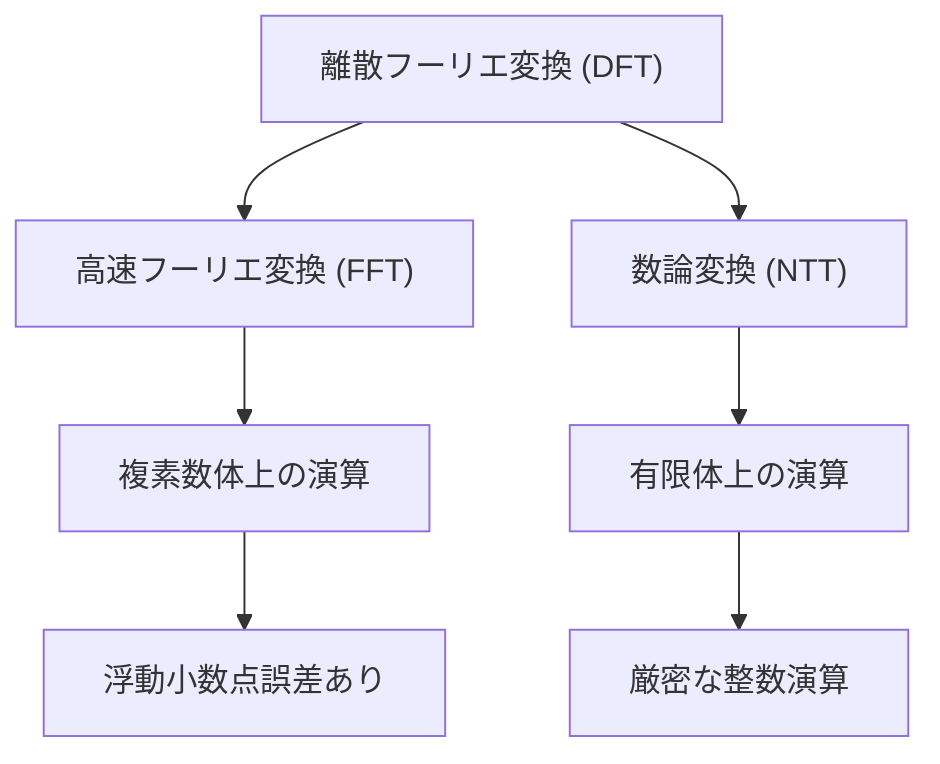
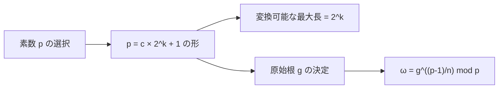
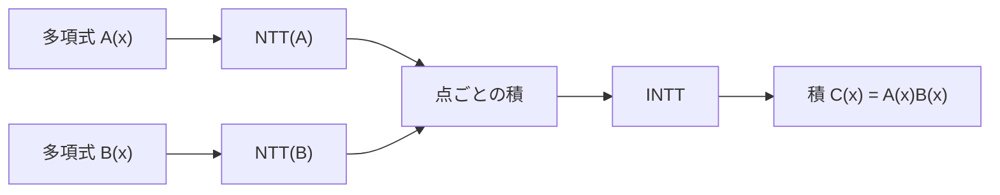

# 数論変換 (Number Theoretic Transform, NTT)

数論変換は、離散フーリエ変換（DFT）の概念を有限体上に拡張した数学的変換である。特に競技プログラミングにおいて、多項式の高速な乗算を実現する際に重要な役割を果たす。通常の高速フーリエ変換（FFT）が複素数体上で動作し、浮動小数点数の丸め誤差に悩まされるのに対し、数論変換は有限体上の厳密な演算として実行できるため、整数係数の多項式を扱う際に極めて有用である。



## 数学的基礎

数論変換を理解するためには、まず有限体と原始根の概念を把握する必要がある。素数 $p$ に対して、$\mathbb{Z}_p = \{0, 1, 2, \ldots, p-1\}$ は加法と乗法について閉じた体を形成する。この有限体において、位数 $p-1$ の元を原始根と呼ぶ。つまり、原始根 $g$ は $g^{p-1} \equiv 1 \pmod{p}$ を満たし、かつ $1 \leq k < p-1$ なるすべての $k$ に対して $g^k \not\equiv 1 \pmod{p}$ となる元である。

数論変換の定義は、長さ $n$ の数列 $\{a_0, a_1, \ldots, a_{n-1}\}$ に対して、次のように与えられる：

$$A_k = \sum_{j=0}^{n-1} a_j \omega^{jk} \pmod{p}$$

ここで、$\omega$ は $n$ 次の原始単位根、すなわち $\omega^n \equiv 1 \pmod{p}$ かつ $\omega^k \not\equiv 1 \pmod{p}$ ($1 \leq k < n$) を満たす元である。この $\omega$ の存在は、$n$ が $p-1$ の約数であることが必要十分条件となる[^1]。

## 素数の選択

数論変換を実装する際、最も重要な要素の一つが適切な素数の選択である。競技プログラミングで頻繁に使用される素数として、$p = 998244353 = 119 \times 2^{23} + 1$ がある。この素数は以下の優れた性質を持つ：

1. $p-1 = 2^{23} \times 119$ という形をしており、$2^{23}$ までの2のべき乗の長さの変換が可能
2. 32ビット整数の範囲内に収まる
3. 原始根として $g = 3$ が使える

他にも、$p = 1004535809 = 479 \times 2^{21} + 1$ や $p = 469762049 = 7 \times 2^{26} + 1$ などがよく使われる。これらの素数は、すべて $p = c \times 2^k + 1$ の形をしており、$2^k$ までの長さの変換を効率的に実行できる。



## アルゴリズムの詳細

数論変換のアルゴリズムは、高速フーリエ変換と同様にCooley-Tukeyアルゴリズムに基づいている[^2]。長さ $n = 2^k$ の入力に対して、再帰的に問題を分割し、$O(n \log n)$ の時間計算量で変換を実行する。

基本的なアイデアは、偶数インデックスと奇数インデックスの要素を分離し、それぞれに対して長さ $n/2$ の数論変換を適用することである。数式で表現すると：

$$A_k = \sum_{j=0}^{n/2-1} a_{2j} \omega^{2jk} + \omega^k \sum_{j=0}^{n/2-1} a_{2j+1} \omega^{2jk}$$

ここで、$\omega^{2}$ は長さ $n/2$ の変換に対する原始単位根となることに注意する。この分割統治法により、計算量を劇的に削減できる。

実装においては、通常は反復的なアプローチ（bit-reversal permutation）を用いる。これは、再帰的アプローチよりもキャッシュ効率が良く、実行速度が速いためである。具体的には、まず入力配列をビット反転順序に並び替え、その後ボトムアップに蝶々演算（butterfly operation）を適用していく。

```cpp
// Bit reversal permutation
for (int i = 0; i < n; i++) {
    int j = 0;
    for (int k = 1; k < n; k <<= 1) {
        j = (j << 1) | ((i & k) ? 1 : 0);
    }
    if (i < j) swap(a[i], a[j]);
}

// Cooley-Tukey NTT
for (int len = 2; len <= n; len <<= 1) {
    long long w = power(root, (p - 1) / len, p);
    for (int i = 0; i < n; i += len) {
        long long wn = 1;
        for (int j = 0; j < len / 2; j++) {
            long long u = a[i + j];
            long long v = a[i + j + len / 2] * wn % p;
            a[i + j] = (u + v) % p;
            a[i + j + len / 2] = (u - v + p) % p;
            wn = wn * w % p;
        }
    }
}
```

## 逆変換

数論変換の逆変換（INTT）は、順変換とほぼ同じアルゴリズムで実現できる。主な違いは、原始単位根 $\omega$ の代わりにその逆元 $\omega^{-1}$ を使用し、最後に結果を $n$ で除算することである。

$$a_j = \frac{1}{n} \sum_{k=0}^{n-1} A_k \omega^{-jk} \pmod{p}$$

ここで、$n$ の逆元は $n \cdot n^{-1} \equiv 1 \pmod{p}$ を満たす $n^{-1}$ である。$n$ が2のべき乗で、$p$ が奇素数である場合、必ず逆元が存在する。

## モンゴメリ乗算による最適化

数論変換の実装において、モジュラ乗算は最も頻繁に実行される演算である。通常の剰余演算は除算を含むため計算コストが高い。これを改善する手法として、モンゴメリ乗算がある[^3]。

モンゴメリ乗算は、$R = 2^{32}$ または $R = 2^{64}$ として、$\bar{a} = aR \bmod p$ という表現（モンゴメリ表現）を用いる。この表現において、乗算は以下のように実行される：

$$\text{MontgomeryMultiply}(\bar{a}, \bar{b}) = \bar{a} \cdot \bar{b} \cdot R^{-1} \bmod p = \overline{ab}$$

この演算は、適切に実装すれば除算を使わずに実行でき、通常のモジュラ乗算よりも高速になる。

## 多項式乗算への応用

数論変換の最も重要な応用は、多項式の高速乗算である。次数 $n-1$ の多項式 $A(x) = \sum_{i=0}^{n-1} a_i x^i$ と $B(x) = \sum_{i=0}^{n-1} b_i x^i$ の積 $C(x) = A(x) \cdot B(x)$ を計算することを考える。

通常の方法では $O(n^2)$ の時間がかかるが、数論変換を用いると以下の手順で $O(n \log n)$ で計算できる：

1. $A(x)$ と $B(x)$ の係数列に対して数論変換を適用し、$\hat{A}$ と $\hat{B}$ を得る
2. 点ごとの積 $\hat{C}_i = \hat{A}_i \cdot \hat{B}_i \bmod p$ を計算
3. $\hat{C}$ に逆数論変換を適用して $C(x)$ の係数を得る



この手法は、畳み込み（convolution）の計算にも直接適用できる。実際、多項式乗算と畳み込みは数学的に等価な操作である。

## 実装上の注意点

数論変換を実装する際には、いくつかの重要な注意点がある。まず、係数の大きさに関する制約である。$n$ 個の要素を持つ2つの配列の畳み込みを計算する場合、結果の各要素は最大で $n \cdot \max(a_i) \cdot \max(b_i)$ となる可能性がある。これが使用する素数 $p$ を超えないように注意する必要がある。

また、複数の素数を使用して中国剰余定理で結果を復元する手法もある。これにより、より大きな係数を扱うことができる。例えば、3つの異なる素数 $p_1, p_2, p_3$ でそれぞれ数論変換を実行し、その結果から元の値を復元する。

```cpp
// Multiple NTT with Chinese Remainder Theorem
long long crt(vector<long long> r, vector<long long> m) {
    long long M = 1, ans = 0;
    for (long long mi : m) M *= mi;
    
    for (int i = 0; i < r.size(); i++) {
        long long Mi = M / m[i];
        long long ti = mod_inverse(Mi, m[i]);
        ans = (ans + r[i] * Mi % M * ti) % M;
    }
    return ans;
}
```

メモリアクセスパターンも重要な最適化ポイントである。特に、蝶々演算の際のメモリアクセスは局所性を持つように実装すべきである。また、原始単位根のべき乗は事前計算してテーブルに格納しておくことで、実行時の計算を削減できる。

## 性能特性と比較

数論変換と高速フーリエ変換の性能を比較すると、それぞれに長所と短所がある。数論変換の主な利点は：

1. **厳密性**: 整数演算のみを使用するため、丸め誤差が発生しない
2. **実装の簡潔性**: 複素数を扱う必要がなく、実装が比較的単純
3. **キャッシュ効率**: データ型が整数のみであるため、メモリ使用量が少ない

一方で、欠点としては：

1. **係数の制限**: 使用する素数によって扱える係数の大きさが制限される
2. **素数の選択**: 適切な素数を選ぶ必要があり、変換長にも制約がある
3. **モジュラ演算のコスト**: 剰余演算は通常の算術演算よりも重い

実測では、適切に最適化された数論変換は、同程度に最適化されたFFTと同等かそれ以上の性能を示すことが多い。特に、整数係数の多項式を扱う場合には、数論変換が優位となる。

## 競技プログラミングでの実践的な使用

競技プログラミングにおいて、数論変換は以下のような問題で頻繁に使用される：

**大きな数の乗算**: 非常に大きな整数同士の乗算を高速に行う必要がある場合、各桁を多項式の係数とみなして数論変換を適用する。

**文字列マッチング**: 特定のパターンで文字列のマッチングを行う際、畳み込みを使用することで効率的に解ける問題がある。例えば、ワイルドカード付きのパターンマッチングなど。

**組み合わせ論的計算**: 特定の組み合わせ論的な値を高速に計算する際に、母関数の積を数論変換で計算する。

実装例として、典型的な畳み込み問題を考える：

```cpp
const int MOD = 998244353;
const int g = 3;

// Fast modular exponentiation
long long power(long long a, long long b, long long m) {
    long long res = 1;
    a %= m;
    while (b > 0) {
        if (b & 1) res = res * a % m;
        a = a * a % m;
        b >>= 1;
    }
    return res;
}

// Number Theoretic Transform
void ntt(vector<long long>& a, bool inv) {
    int n = a.size();
    if (n == 1) return;
    
    // Bit-reversal permutation
    for (int i = 1, j = 0; i < n; i++) {
        int bit = n >> 1;
        for (; j & bit; bit >>= 1) j ^= bit;
        j ^= bit;
        if (i < j) swap(a[i], a[j]);
    }
    
    // Cooley-Tukey NTT
    for (int len = 2; len <= n; len <<= 1) {
        long long w = inv ? power(g, MOD - 1 - (MOD - 1) / len, MOD) 
                          : power(g, (MOD - 1) / len, MOD);
        for (int i = 0; i < n; i += len) {
            long long wn = 1;
            for (int j = 0; j < len / 2; j++) {
                long long u = a[i + j];
                long long v = a[i + j + len / 2] * wn % MOD;
                a[i + j] = (u + v) % MOD;
                a[i + j + len / 2] = (u - v + MOD) % MOD;
                wn = wn * w % MOD;
            }
        }
    }
    
    // Normalize for inverse transform
    if (inv) {
        long long n_inv = power(n, MOD - 2, MOD);
        for (auto& x : a) x = x * n_inv % MOD;
    }
}

// Convolution using NTT
vector<long long> convolution(vector<long long> a, vector<long long> b) {
    int n = 1;
    while (n < a.size() + b.size() - 1) n <<= 1;
    a.resize(n);
    b.resize(n);
    
    ntt(a, false);
    ntt(b, false);
    
    for (int i = 0; i < n; i++) {
        a[i] = a[i] * b[i] % MOD;
    }
    
    ntt(a, true);
    
    a.resize(a.size() + b.size() - 1);
    return a;
}
```

## 拡張と発展的話題

数論変換の概念は、さらに一般化することができる。例えば、任意の有限アーベル群上でのフーリエ変換や、多次元数論変換などがある。また、Schönhage-Strassenアルゴリズム[^4]のような、より高度な整数乗算アルゴリズムでも数論変換の考え方が使われている。

近年では、GPUを用いた並列数論変換の実装も研究されている。数論変換は本質的に並列化に適したアルゴリズムであり、適切に実装すればCPU実装の数十倍の性能を達成できる。

また、量子コンピュータにおける数論変換の実装も興味深い研究分野である。量子フーリエ変換と同様の考え方で、量子数論変換を構成することができ、特定の問題に対して指数的な高速化が期待できる。

数論変換は、理論的な美しさと実用的な有用性を兼ね備えた、計算機科学における重要なアルゴリズムである。特に競技プログラミングにおいては、多項式演算や畳み込み計算を必要とする問題で不可欠なツールとなっている。その実装には様々な最適化技法が存在し、問題の性質に応じて適切な実装を選択することが重要である。

[^1]: Pollard, J. M. (1971). "The fast Fourier transform in a finite field". Mathematics of Computation. 25 (114): 365–374.

[^2]: Cooley, James W.; Tukey, John W. (1965). "An algorithm for the machine calculation of complex Fourier series". Mathematics of Computation. 19 (90): 297–301.

[^3]: Montgomery, P. L. (1985). "Modular multiplication without trial division". Mathematics of Computation. 44 (170): 519–521.

[^4]: Schönhage, A.; Strassen, V. (1971). "Schnelle Multiplikation großer Zahlen". Computing. 7 (3–4): 281–292.