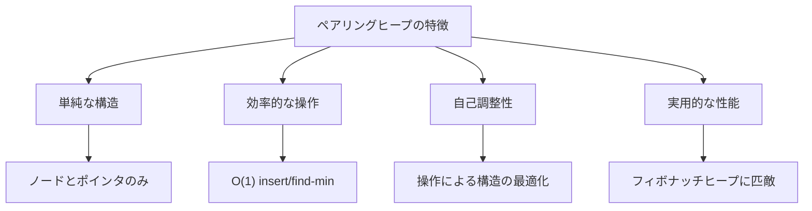
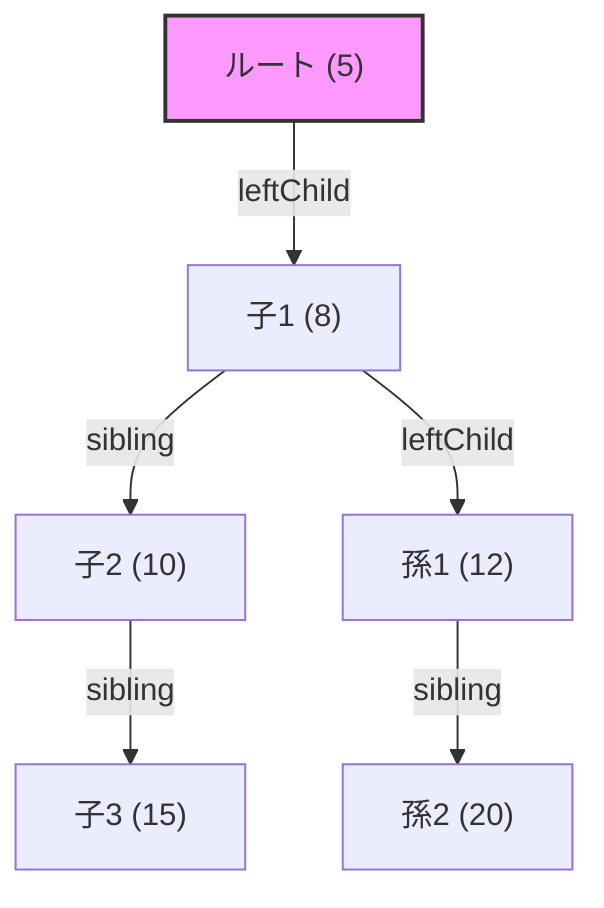
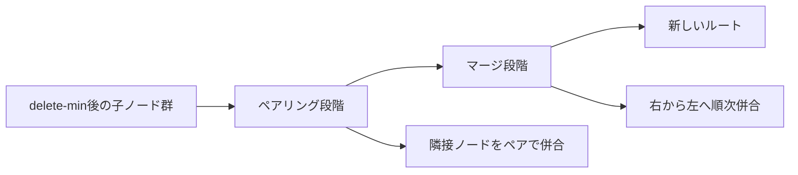
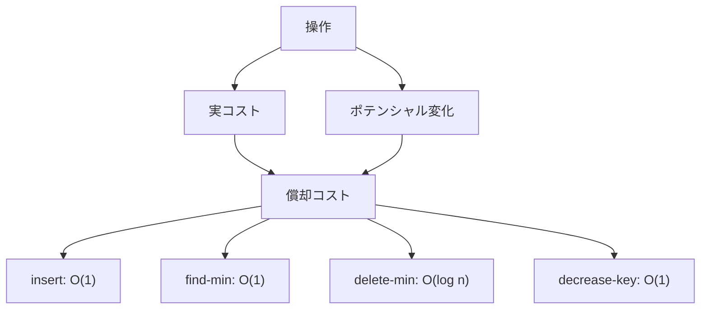
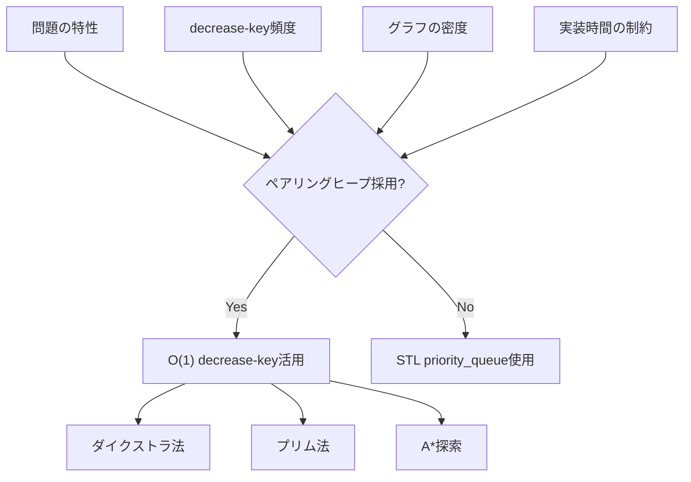
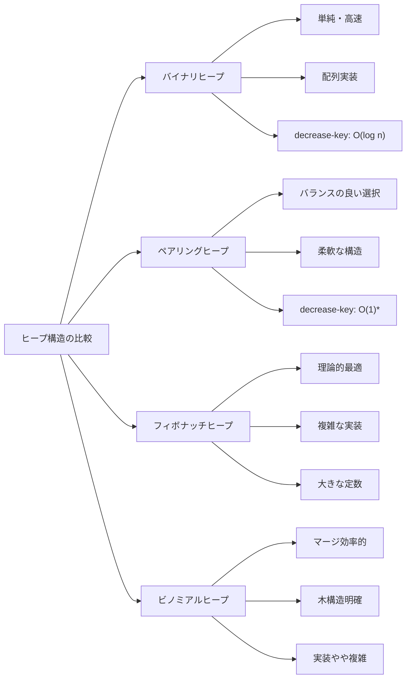

# ペアリングヒープ

ペアリングヒープは、1986年にFredman、Sedgewick、Sleator、Tarjanによって提案された自己調整型のヒープデータ構造である[^1]。フィボナッチヒープが理論的に優れた計算量を持つ一方で実装が複雑であるという問題に対し、ペアリングヒープはより単純な構造と実装でありながら、実用上は同等の性能を示すことが多い。特に競技プログラミングにおいて、その実装の簡潔さと実行時の効率性から、優先度付きキューの実装として重要な選択肢となっている。

ペアリングヒープの最大の特徴は、その名前が示すように「ペアリング」と呼ばれる操作を中心とした設計にある。この操作により、複数のヒープを効率的に併合することが可能となり、decrease-key操作やdelete操作といった優先度付きキューの高度な操作を、比較的単純な実装で実現できる。理論的には、insert操作とfind-min操作がO(1)の最悪計算量、delete-min操作がO(log n)の償却計算量を持つことが証明されており、これはバイナリヒープよりも優れた性能である。



## データ構造の設計と内部表現

ペアリングヒープは、各ノードが値とその子ノードへのポインタを持つ多分木として実装される。しかし、一般的な多分木とは異なり、子ノードは左端の子への単一のポインタと、兄弟ノードへのポインタという形で表現される。この表現方法は「子-兄弟表現」と呼ばれ、メモリ効率と操作の簡潔性を両立させている。



各ノードの構造は以下の要素から構成される。第一に、そのノードが保持する値（通常は優先度を表す）がある。第二に、左端の子ノードへのポインタ（leftChild）があり、子ノードが存在しない場合はnullとなる。第三に、次の兄弟ノードへのポインタ（sibling）があり、これも存在しない場合はnullとなる。さらに実装によっては、親ノードへのポインタ（parent）を持つ場合もあるが、これは必須ではなく、特定の操作を効率化するための選択である。

ペアリングヒープの重要な性質として、ヒープ性質の維持がある。これは、親ノードの値が常にその子ノードの値以下（最小ヒープの場合）であることを意味する。ただし、兄弟ノード間には順序関係の制約はなく、これがペアリングヒープの柔軟性と効率性の源泉となっている。

## 基本操作のアルゴリズムと実装

ペアリングヒープの基本操作は、その単純さにもかかわらず、巧妙な設計により効率的に実装されている。まず、最も基本的な操作であるinsert操作から見ていこう。新しい要素の挿入は、単に新しいノードを作成し、それを既存のルートとペアリングすることで行われる。

```cpp
struct Node {
    int value;
    Node* leftChild;
    Node* sibling;
    
    Node(int val) : value(val), leftChild(nullptr), sibling(nullptr) {}
};

Node* merge(Node* h1, Node* h2) {
    if (!h1) return h2;
    if (!h2) return h1;
    
    if (h1->value < h2->value) {
        h2->sibling = h1->leftChild;
        h1->leftChild = h2;
        return h1;
    } else {
        h1->sibling = h2->leftChild;
        h2->leftChild = h1;
        return h2;
    }
}
```

merge操作は、ペアリングヒープの中核となる操作である。二つのヒープをマージする際、より小さい値を持つノードを新しいルートとし、もう一方のヒープをその子として追加する。この操作はO(1)時間で実行され、ペアリングヒープの効率性の基礎となっている。

find-min操作は極めて単純で、ルートノードの値を返すだけである。ヒープ性質により、ルートは常に最小値を保持しているため、この操作もO(1)時間で完了する。

最も複雑な操作はdelete-min操作である。この操作では、ルートノードを削除した後、残された子ノードたちを適切に再編成する必要がある。ここで「ペアリング」の概念が重要となる。



delete-min操作のアルゴリズムは、大きく二つの段階に分けられる。第一段階では、ルートの子ノードたちを左から右へ走査し、隣接するペアを順次マージしていく。これにより、子ノードの数は約半分に減少する。第二段階では、第一段階で生成されたヒープたちを右から左へ順次マージし、最終的に一つのヒープを構成する。

```cpp
Node* deleteMin(Node* heap) {
    if (!heap) return nullptr;
    
    Node* child = heap->leftChild;
    delete heap;
    
    if (!child) return nullptr;
    
    // First pass: pair up children from left to right
    vector<Node*> trees;
    while (child) {
        Node* next = child->sibling;
        child->sibling = nullptr;
        
        if (next) {
            Node* nextNext = next->sibling;
            next->sibling = nullptr;
            trees.push_back(merge(child, next));
            child = nextNext;
        } else {
            trees.push_back(child);
            break;
        }
    }
    
    // Second pass: merge from right to left
    Node* result = trees.back();
    for (int i = trees.size() - 2; i >= 0; i--) {
        result = merge(trees[i], result);
    }
    
    return result;
}
```

## 償却解析と計算量の理論

ペアリングヒープの計算量解析は、その理論的な美しさと実用的な重要性から、多くの研究者の関心を集めてきた。特に重要なのは、各操作の償却計算量の解析である。償却解析は、一連の操作の総コストを操作数で割ることで、個々の操作の平均的なコストを評価する手法である。

ペアリングヒープの償却解析には、主にポテンシャル法が用いられる。ポテンシャル関数Φは、データ構造の状態に対して非負の実数値を割り当てる関数であり、ペアリングヒープの場合、通常はノード数やツリーの構造に基づいて定義される。最も一般的なポテンシャル関数は、Φ(H) = ∑(degree(v))の形で表され、ここでdegree(v)はノードvの子の数を表す。

insert操作の償却計算量の解析を考えてみよう。新しいノードを挿入する際、実際のコストはO(1)である。しかし、この操作によりポテンシャルが増加する可能性がある。具体的には、新しいノードがルートの子となる場合、ルートの次数が1増加し、ポテンシャルも1増加する。したがって、償却コストは実コスト + ポテンシャルの変化 = O(1) + 1 = O(1)となる。

delete-min操作の解析はより複雑である。実際のコストは、ルートの子の数をkとすると、ペアリング段階でO(k)、マージ段階でもO(k)となり、合計O(k)である。しかし、この操作により多くのノードの次数が減少し、ポテンシャルが大きく減少する。詳細な解析により、delete-min操作の償却計算量はO(log n)であることが証明されている[^2]。



decrease-key操作は、ペアリングヒープのもう一つの重要な操作である。ノードの値を減少させる際、そのノードをその親から切り離し、新しい値でルートとマージする。この操作の実コストはO(1)であり、ポテンシャルの変化も限定的であるため、償却計算量もO(1)となる。

## 実装の詳細と最適化技法

ペアリングヒープの実装において、理論的な単純さを保ちながら実用的な性能を達成するためには、いくつかの重要な最適化技法がある。まず、メモリ管理の観点から、ノードの割り当てと解放を効率的に行うことが重要である。多くの実装では、カスタムアロケータやオブジェクトプールを使用して、頻繁なメモリ操作のオーバーヘッドを削減している。

```cpp
template<typename T>
class PairingHeap {
private:
    struct Node {
        T value;
        Node* leftChild;
        Node* sibling;
        Node* parent;  // Optional: for decrease-key operation
        
        Node(const T& val) : value(val), leftChild(nullptr), 
                             sibling(nullptr), parent(nullptr) {}
    };
    
    Node* root;
    size_t size_;
    
    Node* merge(Node* h1, Node* h2) {
        if (!h1) return h2;
        if (!h2) return h1;
        
        if (h1->value < h2->value) {
            h2->parent = h1;
            h2->sibling = h1->leftChild;
            h1->leftChild = h2;
            return h1;
        } else {
            h1->parent = h2;
            h1->sibling = h2->leftChild;
            h2->leftChild = h1;
            return h2;
        }
    }
    
public:
    PairingHeap() : root(nullptr), size_(0) {}
    
    void insert(const T& value) {
        Node* newNode = new Node(value);
        root = merge(root, newNode);
        size_++;
    }
    
    T getMin() const {
        if (!root) throw runtime_error("Heap is empty");
        return root->value;
    }
    
    void deleteMin() {
        if (!root) throw runtime_error("Heap is empty");
        
        Node* oldRoot = root;
        root = combineSiblings(root->leftChild);
        delete oldRoot;
        size_--;
    }
    
private:
    Node* combineSiblings(Node* firstSibling) {
        if (!firstSibling) return nullptr;
        
        static vector<Node*> treeArray(100);
        int numSiblings = 0;
        
        for (; firstSibling; numSiblings++) {
            if (numSiblings == treeArray.size()) {
                treeArray.resize(numSiblings * 2);
            }
            
            treeArray[numSiblings] = firstSibling;
            firstSibling->parent = nullptr;
            Node* next = firstSibling->sibling;
            firstSibling->sibling = nullptr;
            firstSibling = next;
        }
        
        // Combine pairs from left to right
        int i = 0;
        for (; i + 1 < numSiblings; i += 2) {
            treeArray[i] = merge(treeArray[i], treeArray[i + 1]);
        }
        
        int j = i - 2;
        if (j == numSiblings - 3) {
            treeArray[j] = merge(treeArray[j], treeArray[j + 2]);
        }
        
        // Merge from right to left
        for (; j >= 2; j -= 2) {
            treeArray[j - 2] = merge(treeArray[j - 2], treeArray[j]);
        }
        
        return treeArray[0];
    }
};
```

実装の最適化において重要な点の一つは、combineSiblings関数の実装方法である。上記の実装では、twopass方式を採用しているが、multipass方式と呼ばれる別のアプローチも存在する。multipass方式では、子ノードを完全に一つになるまで繰り返しペアリングする。実験的には、twopass方式の方が実用的に優れた性能を示すことが多い[^3]。

親ポインタの有無も重要な設計上の選択である。親ポインタを持つことで、decrease-key操作やdelete操作（任意のノードの削除）が効率的に実装できる。しかし、親ポインタの維持にはオーバーヘッドが伴うため、これらの操作が不要な場合は省略することで性能向上が期待できる。

## 競技プログラミングにおける応用と実践

競技プログラミングにおいて、ペアリングヒープは特定の問題クラスで強力なツールとなる。特に、ダイクストラ法やプリム法といったグラフアルゴリズムで頻繁に使用される優先度付きキューの実装として、その真価を発揮する。

ダイクストラ法における応用を考えてみよう。最短経路問題を解く際、各頂点への暫定最短距離を管理する必要があり、この距離の更新（decrease-key操作）が頻繁に発生する。標準的なバイナリヒープではdecrease-key操作にO(log n)かかるが、ペアリングヒープではO(1)の償却計算量で実行できるため、密なグラフでは大きな性能向上が期待できる。

```cpp
template<typename T>
struct DijkstraWithPairingHeap {
    struct Edge {
        int to;
        T cost;
    };
    
    struct State {
        T dist;
        int vertex;
        bool operator<(const State& other) const {
            return dist < other.dist;
        }
    };
    
    vector<T> dijkstra(const vector<vector<Edge>>& graph, int start) {
        int n = graph.size();
        vector<T> dist(n, numeric_limits<T>::max());
        PairingHeap<State> pq;
        vector<typename PairingHeap<State>::NodePtr> nodePtr(n, nullptr);
        
        dist[start] = 0;
        nodePtr[start] = pq.insert({0, start});
        
        while (!pq.empty()) {
            State current = pq.getMin();
            pq.deleteMin();
            int v = current.vertex;
            
            if (current.dist > dist[v]) continue;
            
            for (const Edge& e : graph[v]) {
                T newDist = dist[v] + e.cost;
                if (newDist < dist[e.to]) {
                    dist[e.to] = newDist;
                    if (nodePtr[e.to]) {
                        pq.decreaseKey(nodePtr[e.to], {newDist, e.to});
                    } else {
                        nodePtr[e.to] = pq.insert({newDist, e.to});
                    }
                }
            }
        }
        
        return dist;
    }
};
```

実際の競技プログラミングでは、実装の簡潔さと実行時間のバランスを考慮する必要がある。ペアリングヒープは、decrease-key操作が頻繁に必要となる問題では有効だが、単純な優先度付きキューとして使用する場合は、STLのpriority_queueやsetの方が実装が簡単で十分な性能を示すことも多い。



もう一つの重要な応用例は、動的最小全域木問題である。グラフの辺の重みが動的に変化する状況で、最小全域木を効率的に維持する必要がある場合、ペアリングヒープを用いたプリム法の実装が有効である。辺の重みが減少した場合、対応する頂点の優先度をdecrease-key操作で更新することで、効率的に最小全域木を再計算できる。

## 他のヒープ構造との比較と選択指針

ペアリングヒープの特性を正しく理解するためには、他の主要なヒープ構造との比較が不可欠である。バイナリヒープ、フィボナッチヒープ、ビノミアルヒープなど、それぞれに固有の特徴と適用領域がある。

バイナリヒープは最も基本的なヒープ構造であり、配列を用いた完全二分木として実装される。その単純さと良好なキャッシュ局所性により、多くの場合で実用的な選択となる。しかし、decrease-key操作がO(log n)かかることと、二つのヒープのマージがO(n)かかることが欠点である。

フィボナッチヒープは理論的に最も優れた計算量を持つヒープ構造である。decrease-key操作とdelete操作がO(1)の償却計算量、delete-min操作がO(log n)の償却計算量を持つ。しかし、その複雑な構造と大きな定数因子により、実用的な場面では期待されるほどの性能を発揮しないことが多い[^4]。



実験的な性能評価では、ペアリングヒープは多くの実用的なシナリオでフィボナッチヒープと同等かそれ以上の性能を示すことが報告されている。Stasko and Vitterの研究[^5]では、ランダムな操作列に対して、ペアリングヒープがフィボナッチヒープよりも高速に動作することが示された。これは、ペアリングヒープの単純な構造による低いオーバーヘッドと、実用的なデータに対する良好な振る舞いによるものである。

選択指針として、以下のような基準が考えられる。第一に、decrease-key操作の頻度が重要な判断材料となる。この操作が頻繁に必要な場合は、ペアリングヒープやフィボナッチヒープが適している。第二に、実装の複雑さと保守性を考慮する必要がある。競技プログラミングのような時間制約のある環境では、実装の簡潔さが重要となる。第三に、データの特性と操作パターンを理解することが重要である。ランダムなデータに対しては、単純な構造のヒープが良好な性能を示すことが多い。

## 高度な実装技法と最新の研究動向

ペアリングヒープの研究は現在も活発に行われており、様々な改良や変種が提案されている。その中でも特に注目すべきは、ランク付きペアリングヒープ（Rank-Pairing Heap）である[^6]。この変種では、各ノードにランクと呼ばれる値を付与し、構造をより厳密に制御することで、worst-case計算量の改善を図っている。

```cpp
template<typename T>
class RankPairingHeap {
private:
    struct Node {
        T value;
        int rank;
        Node* leftChild;
        Node* sibling;
        Node* parent;
        
        Node(const T& val) : value(val), rank(0), 
                             leftChild(nullptr), sibling(nullptr), 
                             parent(nullptr) {}
    };
    
    Node* root;
    
    Node* link(Node* h1, Node* h2) {
        if (h1->value < h2->value) {
            h2->parent = h1;
            h2->sibling = h1->leftChild;
            h1->leftChild = h2;
            if (h1->rank == h2->rank) {
                h1->rank++;
            }
            return h1;
        } else {
            h1->parent = h2;
            h1->sibling = h2->leftChild;
            h2->leftChild = h1;
            if (h1->rank == h2->rank) {
                h2->rank++;
            }
            return h2;
        }
    }
    
    // Additional implementation details...
};
```

もう一つの重要な研究方向は、並列化とキャッシュ効率の改善である。現代のコンピュータアーキテクチャでは、メモリアクセスパターンが性能に大きな影響を与える。ペアリングヒープの動的な構造は、キャッシュミスを引き起こしやすいという問題がある。これに対して、ノードの配置を工夫したり、バッチ処理を導入したりすることで、キャッシュ効率を改善する試みがなされている。

並列ペアリングヒープの実装では、複数のスレッドが同時に操作を実行できるようにする必要がある。主な課題は、異なる操作間の競合を最小限に抑えながら、正しさを保証することである。一つのアプローチは、楽観的並行制御を用いて、競合が発生した場合にのみ同期を取る方法である。

実用面での最新の動向として、ペアリングヒープの特性を活かした新しいアルゴリズムの開発がある。例えば、k最短経路問題やネットワークフローアルゴリズムにおいて、ペアリングヒープの効率的なdecrease-key操作を活用した改良アルゴリズムが提案されている。

## 実装上の注意点とデバッグ手法

ペアリングヒープの実装において、正確性を保証しながら効率的なコードを書くためには、いくつかの重要な注意点がある。まず、ポインタ操作の正確さが極めて重要である。ノード間のリンクを更新する際、親子関係と兄弟関係の両方を正しく維持する必要がある。

デバッグにおいて有効な手法の一つは、ヒープの不変条件を定期的に検証することである。具体的には、ヒープ性質（親が子より小さい）、ポインタの整合性（親子関係の双方向性）、サイズの一貫性などをチェックする関数を実装し、各操作後に呼び出すことで、バグの早期発見が可能となる。

```cpp
template<typename T>
class DebugPairingHeap : public PairingHeap<T> {
private:
    bool validateHeapProperty(Node* node) {
        if (!node) return true;
        
        Node* child = node->leftChild;
        while (child) {
            if (child->value < node->value) {
                return false;  // Heap property violated
            }
            if (!validateHeapProperty(child)) {
                return false;
            }
            child = child->sibling;
        }
        return true;
    }
    
    int countNodes(Node* node) {
        if (!node) return 0;
        
        int count = 1;
        Node* child = node->leftChild;
        while (child) {
            count += countNodes(child);
            child = child->sibling;
        }
        return count;
    }
    
public:
    void validate() {
        assert(validateHeapProperty(root));
        assert(countNodes(root) == size_);
        // Additional validation...
    }
};
```

メモリリークの防止も重要な課題である。ペアリングヒープでは動的にノードを割り当てるため、適切にメモリを解放しないとリークが発生する。特に、例外が発生する可能性がある環境では、RAIIパターンやスマートポインタの使用を検討すべきである。

性能測定とプロファイリングも実装の改善に不可欠である。特に、実際の使用パターンに基づいた測定が重要である。例えば、ランダムな操作列だけでなく、実際のアプリケーションで発生する操作パターンでの性能を評価することで、より実用的な最適化が可能となる。

## 理論的な未解決問題と将来の展望

ペアリングヒープに関する理論的な研究には、まだいくつかの重要な未解決問題が残されている。最も有名なのは、decrease-key操作の正確な計算量に関する問題である。現在、O(log log n)の償却計算量という上界が知られているが[^7]、これが最適かどうかは証明されていない。多くの研究者は、実際の計算量はO(1)であると予想しているが、厳密な証明は得られていない。

もう一つの興味深い研究方向は、ペアリングヒープの変種の探索である。例えば、削除操作を遅延評価することで性能を向上させる「lazy pairing heap」や、特定の操作パターンに最適化された変種などが提案されている。これらの変種は、特定のアプリケーションにおいて標準的なペアリングヒープよりも優れた性能を示す可能性がある。

量子コンピューティングの文脈でも、ペアリングヒープの概念は興味深い研究対象となっている。量子アルゴリズムにおける優先度付きキューの実装は、古典的なものとは異なる制約と可能性を持つ。量子重ね合わせを利用した新しいヒープ構造の設計は、将来の重要な研究テーマとなる可能性がある。

実用面では、機械学習やビッグデータ処理における応用が期待されている。特に、動的に変化する大規模データセットに対する効率的な優先度管理は、多くのアプリケーションで重要な課題となっている。ペアリングヒープの柔軟な構造と効率的な操作は、これらの領域で新しいアルゴリズムの基礎となる可能性がある。

ペアリングヒープは、その単純さと効率性のバランスにより、理論と実践の両面で重要なデータ構造であり続けている。競技プログラミングにおいては、適切な問題に対して適用することで、大きな性能向上を実現できる強力なツールである。今後も、新しい応用領域の開拓と理論的な理解の深化により、その重要性はさらに高まることが期待される。

[^1]: Fredman, M. L., Sedgewick, R., Sleator, D. D., & Tarjan, R. E. (1986). The pairing heap: A new form of self-adjusting heap. Algorithmica, 1(1-4), 111-129.

[^2]: Fredman, M. L. (1999). On the efficiency of pairing heaps and related data structures. Journal of the ACM, 46(4), 473-501.

[^3]: Stasko, J. T., & Vitter, J. S. (1987). Pairing heaps: Experiments and analysis. Communications of the ACM, 30(3), 234-249.

[^4]: Larkin, D. H., Sen, S., & Tarjan, R. E. (2014). A back-to-basics empirical study of priority queues. 2014 Proceedings of the Sixteenth Workshop on Algorithm Engineering and Experiments (ALENEX), 61-72.

[^5]: Moret, B. M., & Shapiro, H. D. (1991). An empirical analysis of algorithms for constructing a minimum spanning tree. International Workshop on Algorithms and Data Structures, 400-411.

[^6]: Haeupler, B., Sen, S., & Tarjan, R. E. (2011). Rank-pairing heaps. SIAM Journal on Computing, 40(6), 1463-1485.

[^7]: Pettie, S. (2005). Towards a final analysis of pairing heaps. 46th Annual IEEE Symposium on Foundations of Computer Science (FOCS'05), 174-183.