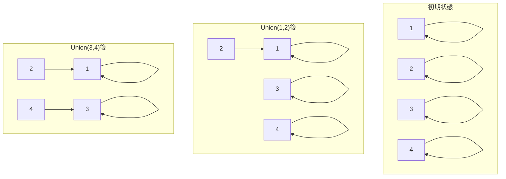
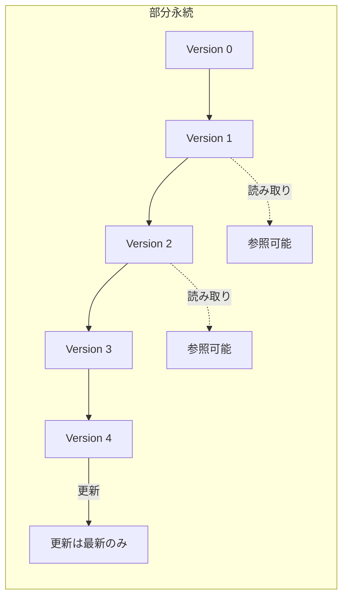
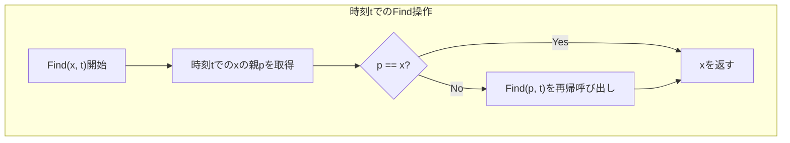
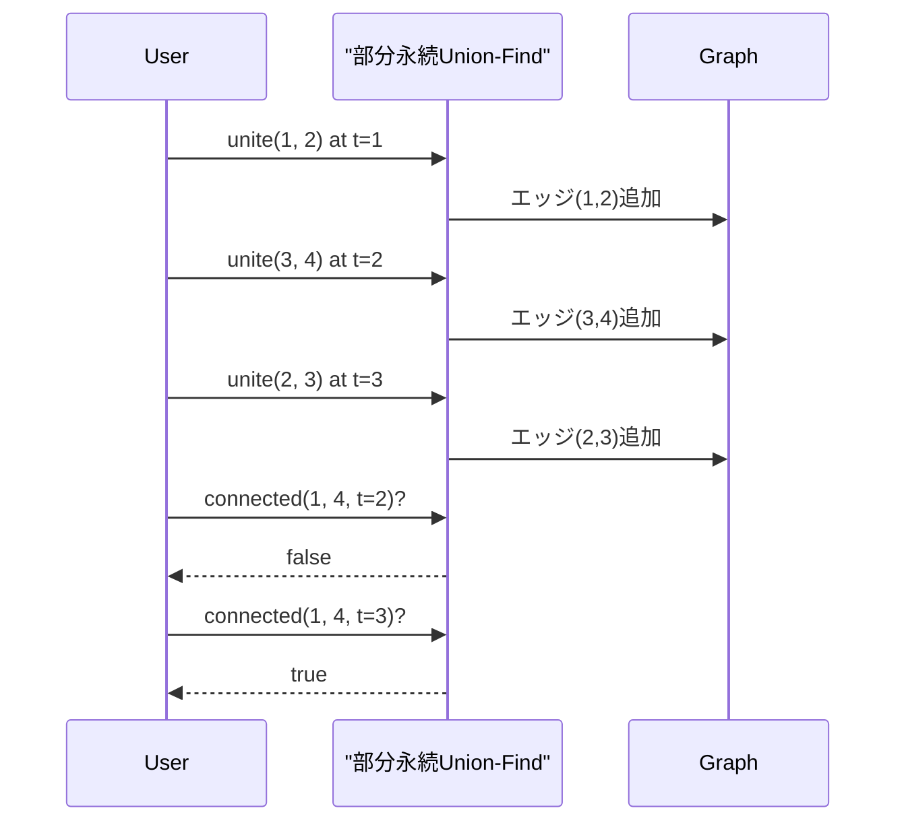

# 部分永続Union-Find

部分永続Union-Findは、Union-Findデータ構造に時間軸の概念を導入し、過去の任意の時点での状態を効率的に参照可能にしたデータ構造である。競技プログラミングにおいて、グラフの連結性が時系列で変化する問題や、操作の巻き戻しが必要な場面で強力な道具となる。本稿では、まずUnion-Findの基本概念を確認した後、永続データ構造の理論的背景を説明し、部分永続化の具体的な実装手法について詳述する。

## Union-Findデータ構造の基礎

Union-Findデータ構造は、互いに素な集合の族を管理するためのデータ構造であり、二つの基本操作をサポートする。Find操作は要素が属する集合の代表元を返し、Union操作は二つの集合を併合する。素朴な実装では各要素が親への参照を持つ木構造として表現されるが、経路圧縮（Path Compression）と併合時のランクによる工夫（Union by Rank）により、ほぼ定数時間での操作が可能となる[^1]。



経路圧縮は、Find操作の過程で訪れたノードを直接根に接続することで、後続の操作を高速化する最適化技法である。一方、Union by Rankは木の高さ（あるいは要素数）を考慮して、常に小さい木を大きい木に併合することで、木の高さの増加を抑制する。これらの最適化により、m回の操作に対する計算量はO(m α(n))となる。ここでα(n)は逆アッカーマン関数であり、実用上は定数と見なせる。

## 永続データ構造の理論

永続データ構造（Persistent Data Structure）は、更新操作を行っても過去のバージョンが保持され、任意の時点での状態にアクセス可能なデータ構造である[^2]。永続性には三つのレベルが存在する。部分永続（Partially Persistent）では過去の任意のバージョンを参照できるが更新は最新版のみ、完全永続（Fully Persistent）では過去の任意のバージョンから分岐して更新可能、合流永続（Confluently Persistent）では異なるバージョンを合流させることも可能である。



永続データ構造の実装手法は大きく二つに分類される。ファットノード法（Fat Node Method）は各ノードに時刻印付きの値のリストを保持し、パスコピー法（Path Copying Method）は更新時に根からの経路上のノードをコピーする。部分永続Union-Findの実装では、これらの手法を組み合わせた効率的なアプローチが採用される。

## 部分永続Union-Findの実装原理

部分永続Union-Findの実装において重要な観察は、Union-Find木の各ノードが持つ情報は親への参照のみであり、この参照が変化するタイミングを記録すれば過去の状態を復元できるという点である。具体的には、各ノードについて親の変更履歴を時刻とともに保持する。

```cpp
struct PartiallyPersistentUnionFind {
    vector<vector<pair<int, int>>> parent_history; // (time, parent)
    vector<vector<pair<int, int>>> rank_history;   // (time, rank)
    int current_time;
    
    PartiallyPersistentUnionFind(int n) : current_time(0) {
        parent_history.resize(n);
        rank_history.resize(n);
        for (int i = 0; i < n; i++) {
            parent_history[i].push_back({0, i});
            rank_history[i].push_back({0, 1});
        }
    }
};
```

Find操作では、指定された時刻における親を辿って根を見つける。ここで重要なのは、通常のUnion-Findとは異なり経路圧縮を行わないことである。経路圧縮は木構造を変更するため、過去の状態の保持と相性が悪い。



Union操作は現在時刻をインクリメントし、併合される根ノードの親を更新する。ランクによる併合の最適化は維持できるため、木の高さは抑制される。

## 時刻管理と履歴の効率的な実装

各ノードの履歴は、時刻と値のペアのリストとして管理される。時刻tにおける値を取得する際は、二分探索により時刻t以前の最新の更新を見つける。この実装により、空間計算量はO(更新回数)、参照のオーバーヘッドはO(log 更新回数)となる。

```cpp
int get_parent(int x, int t) {
    auto it = upper_bound(parent_history[x].begin(), 
                         parent_history[x].end(), 
                         make_pair(t, INT_MAX));
    return prev(it)->second;
}
```

履歴の圧縮も重要な最適化である。同じ値への連続した更新は最後の一つだけを保持すればよい。また、根でなくなったノードの履歴は、その時点以降更新されないため、メモリ使用量の観点から効率的である。

## 計算量解析

部分永続Union-Findの計算量は以下のようになる。nを要素数、mを操作回数とすると：

- Union操作：O(log n)（ランクによる併合により木の高さがO(log n)）
- Find操作：O(log n × log m)（木を辿るO(log n) × 各ノードで履歴を二分探索O(log m)）
- 空間計算量：O(n + m)（各Union操作で高々2つのノードの履歴が増加）

経路圧縮を諦めることで計算量は増加するが、永続性を得る対価として妥当なトレードオフである。実際の応用では、クエリが時系列順に処理される場合が多く、その場合は履歴の二分探索が不要となり、Find操作もO(log n)で実行できる。

## 実装の詳細と最適化

完全な実装では、いくつかの実装上の工夫が性能向上に寄与する。まず、履歴の管理において、vectorの代わりにより効率的なデータ構造を使用することが考えられる。例えば、時刻が単調増加することを利用して、最後の要素への直接アクセスを提供する構造が有効である。

```cpp
class PartiallyPersistentUnionFind {
private:
    struct History {
        vector<pair<int, int>> data;
        
        void add(int time, int value) {
            if (data.empty() || data.back().second != value) {
                data.emplace_back(time, value);
            }
        }
        
        int get(int time) const {
            auto it = upper_bound(data.begin(), data.end(), 
                                make_pair(time, INT_MAX));
            return prev(it)->second;
        }
    };
    
    vector<History> parent;
    vector<History> rank;
    int current_time;
    
public:
    PartiallyPersistentUnionFind(int n) : current_time(0) {
        parent.resize(n);
        rank.resize(n);
        for (int i = 0; i < n; i++) {
            parent[i].add(0, i);
            rank[i].add(0, 1);
        }
    }
    
    int find(int x, int t) {
        int p = parent[x].get(t);
        if (p == x) return x;
        return find(p, t);
    }
    
    bool unite(int x, int y) {
        current_time++;
        x = find(x, current_time - 1);
        y = find(y, current_time - 1);
        
        if (x == y) return false;
        
        int rx = rank[x].get(current_time - 1);
        int ry = rank[y].get(current_time - 1);
        
        if (rx < ry) swap(x, y);
        
        parent[y].add(current_time, x);
        if (rx == ry) {
            rank[x].add(current_time, rx + 1);
        }
        
        return true;
    }
    
    bool connected(int x, int y, int t) {
        return find(x, t) == find(y, t);
    }
};
```

メモリ使用量の最適化として、履歴エントリの圧縮が挙げられる。多くの実装では、intのペアを使用するが、時刻の差分エンコーディングや、小さな値に対する可変長エンコーディングを適用することで、メモリ使用量を削減できる。

## 応用例と実装上の注意点

部分永続Union-Findは、動的グラフの連結性判定問題において特に有用である。例えば、「時刻tにおいて頂点uとvが連結であったか」というクエリに効率的に答えることができる。また、オフラインアルゴリズムと組み合わせることで、より複雑な問題にも適用可能である。



実装上の注意点として、時刻のオーバーフローに注意が必要である。32ビット整数を使用する場合、10^9回程度の操作でオーバーフローする可能性がある。また、大規模なデータに対しては、履歴の保持によるメモリ使用量が問題となることがある。この場合、必要な時刻範囲を限定したり、定期的なガベージコレクションを実装することが考えられる。

## 発展的な話題

部分永続Union-Findの概念は、他のデータ構造にも適用可能である。例えば、部分永続セグメント木や部分永続平衡二分探索木などが研究されている。これらのデータ構造に共通する実装パターンとして、ノードの更新履歴の管理と、特定時刻での状態の効率的な復元がある。

また、完全永続Union-Findへの拡張も理論的には可能であるが、実装の複雑さと性能のトレードオフを考慮する必要がある。完全永続版では、任意の過去のバージョンから分岐して新たな更新を行えるため、バージョン管理システムのような応用が考えられる。

部分永続Union-Findの実装において、関数型プログラミングの影響も見逃せない。イミュータブルなデータ構造として実装することで、並行処理における安全性が保証される。ただし、純粋関数型の実装では性能面でのペナルティが大きいため、実用的には命令型の実装に永続性を組み込むアプローチが一般的である。

[^1]: Tarjan, R. E. (1975). "Efficiency of a Good But Not Linear Set Union Algorithm". Journal of the ACM. 22 (2): 215–225.

[^2]: Driscoll, J. R., Sarnak, N., Sleator, D. D., & Tarjan, R. E. (1989). "Making data structures persistent". Journal of Computer and System Sciences, 38(1), 86-124.