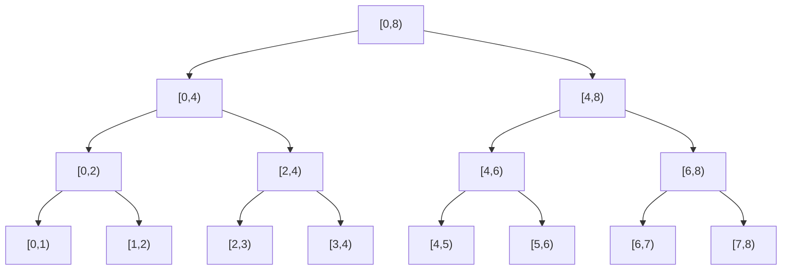
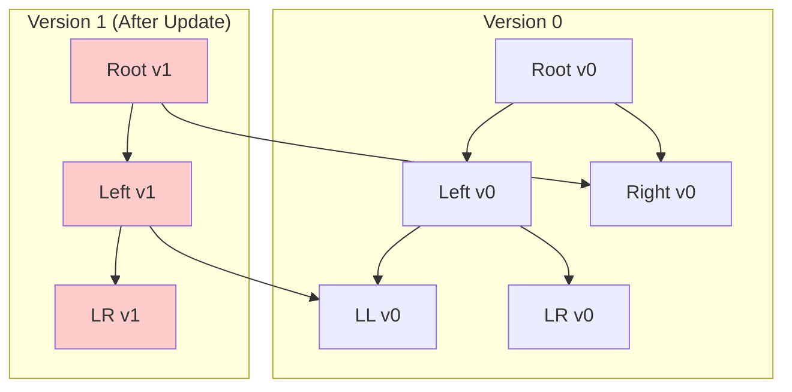

# 永続セグメント木

## 永続データ構造の概念

永続データ構造（Persistent Data Structure）は、更新操作を行った際に既存のバージョンを保持したまま新しいバージョンを作成するデータ構造の総称である。通常のデータ構造では更新操作によって以前の状態が失われるのに対し、永続データ構造では過去のあらゆる時点での状態にアクセス可能である。この性質は、履歴管理が必要なアプリケーションや、関数型プログラミングにおける不変性の実現において重要な役割を果たす。

永続性には部分永続性（Partially Persistent）と完全永続性（Fully Persistent）の2種類が存在する。部分永続性では過去のバージョンの参照のみが可能であり、更新は最新バージョンに対してのみ実行できる。一方、完全永続性では任意のバージョンに対して更新操作を行い、新たな分岐を作成することが可能である。永続セグメント木は通常、部分永続性を実装したものを指す。

## セグメント木の基本構造

永続セグメント木を理解するためには、まず通常のセグメント木の構造を把握する必要がある。セグメント木は、配列に対する区間クエリと要素更新を効率的に処理するためのデータ構造である。完全二分木の形状を持ち、各ノードが配列の特定区間に対応する値を保持する。



セグメント木の重要な性質として、高さが $O(\log n)$ であることが挙げられる。これにより、更新操作と区間クエリの両方を $O(\log n)$ 時間で実行できる。各ノードは、その子ノードの値から計算される集約値（総和、最小値、最大値など）を保持する。

## 永続化の基本原理

通常のセグメント木を永続化する際の中心的なアイデアは、更新時に影響を受けるノードのみを複製し、残りのノードは既存のバージョンと共有することである。これはパスコピー（Path Copying）と呼ばれる手法である。

要素の更新を行う際、根から更新対象の葉までのパス上にあるノードのみが変更される。セグメント木の高さが $O(\log n)$ であることから、一回の更新で複製されるノードの数も $O(\log n)$ となる。この性質により、空間効率と時間効率の両方で優れた永続化が実現される。



上図では、左の部分木の右側の要素を更新した結果、3つのノードのみが複製され、他のノードは前のバージョンと共有されている様子を示している。

## ノード構造と実装の詳細

永続セグメント木のノードは、通常のセグメント木とは異なり、可変な配列インデックスではなく不変なポインタによって構造を表現する。各ノードは以下の情報を保持する：

```cpp
struct Node {
    long long value;  // Aggregated value for the range
    Node* left;       // Pointer to left child
    Node* right;      // Pointer to right child
    
    Node(long long v = 0, Node* l = nullptr, Node* r = nullptr) 
        : value(v), left(l), right(r) {}
};
```

この構造により、ノードの共有が自然に実現される。新しいバージョンを作成する際は、変更が必要なノードのみを新規作成し、変更されないサブツリーへのポインタは既存のものを再利用する。

## 更新操作の実装

永続セグメント木における更新操作は、再帰的な構造を持つ。根から開始し、更新対象の位置を含む子ノードへと再帰的に処理を進める。各レベルで新しいノードを作成し、更新が必要ない側の子は既存のノードを参照する。

```cpp
Node* update(Node* node, int tl, int tr, int pos, long long val) {
    if (tl == tr) {
        // Leaf node: create new node with updated value
        return new Node(val);
    }
    
    int tm = (tl + tr) / 2;
    Node* left_child = node->left;
    Node* right_child = node->right;
    
    if (pos <= tm) {
        // Update in left subtree
        left_child = update(node->left, tl, tm, pos, val);
    } else {
        // Update in right subtree
        right_child = update(node->right, tm + 1, tr, pos, val);
    }
    
    // Create new internal node with updated child reference
    long long new_value = left_child->value + right_child->value;
    return new Node(new_value, left_child, right_child);
}
```

この実装では、更新パス上の各ノードに対して新しいノードが作成される。更新されない部分木は元のバージョンと共有されるため、メモリ使用量の増加は $O(\log n)$ に抑えられる。

## 区間クエリの実装

区間クエリは通常のセグメント木と同様の方法で実装される。指定されたバージョンのルートから開始し、クエリ区間と各ノードが表す区間の関係に基づいて再帰的に処理を行う。

```cpp
long long query(Node* node, int tl, int tr, int l, int r) {
    if (l > r) return 0;  // Invalid range
    
    if (l == tl && r == tr) {
        // Current node exactly covers query range
        return node->value;
    }
    
    int tm = (tl + tr) / 2;
    // Split query into left and right parts
    return query(node->left, tl, tm, l, min(r, tm)) +
           query(node->right, tm + 1, tr, max(l, tm + 1), r);
}
```

永続性により、任意の過去のバージョンに対してクエリを実行できる。これは、各バージョンのルートノードへの参照を保持しておくことで実現される。

## メモリ管理と最適化

永続セグメント木の実装において、メモリ管理は重要な考慮事項である。各更新操作で $O(\log n)$ 個の新しいノードが作成されるため、$m$ 回の更新後には最大で $O(m \log n)$ 個のノードが存在することになる。

実践的な実装では、以下の最適化手法が用いられる：

### メモリプールの使用

動的メモリ割り当てのオーバーヘッドを削減するため、事前に大きなメモリブロックを確保し、そこから必要なノードを切り出す方式が採用される。

```cpp
struct MemoryPool {
    static const int MAXN = 20000000;  // Maximum nodes
    Node pool[MAXN];
    int ptr = 0;
    
    Node* allocate(long long val, Node* l, Node* r) {
        pool[ptr] = Node(val, l, r);
        return &pool[ptr++];
    }
};
```

### 遅延評価の統合

区間更新を効率的に処理するため、遅延評価（Lazy Propagation）を永続セグメント木に組み込むことが可能である。ただし、遅延評価の実装は永続性と相性が悪く、注意深い設計が必要となる。各ノードに遅延値を保持し、必要に応じて子ノードに伝播させる際も、ノードの不変性を保つ必要がある。

## 永続セグメント木の応用

永続セグメント木は、その特性から様々な問題に応用される。特に、時系列データの管理や、バージョン管理が必要なシステムにおいて有用である。

### K番目の要素クエリ

永続セグメント木を用いることで、動的な配列に対するK番目の要素を効率的に求めることができる。各位置に対して、その値以下の要素数を管理するセグメント木を構築し、二分探索と組み合わせることで実現される。

### 区間内の異なる要素数

配列の任意の区間に含まれる異なる要素の個数を求める問題も、永続セグメント木により効率的に解決できる。各要素の最後の出現位置を管理し、クエリ区間内でその位置が区間の左端以上である要素を数えることで実現される。

## パフォーマンス特性

永続セグメント木のパフォーマンス特性は以下の通りである：

時間計算量：
- 更新操作: $O(\log n)$
- 区間クエリ: $O(\log n)$
- バージョン間の切り替え: $O(1)$

空間計算量：
- 初期構築: $O(n)$
- 更新1回あたり: $O(\log n)$
- $m$ 回の更新後の総空間: $O(n + m \log n)$

これらの特性により、永続セグメント木は通常のセグメント木と比較して、時間効率を維持しながら履歴管理機能を追加できる。

## 実装上の注意点

永続セグメント木を実装する際には、いくつかの重要な注意点がある。

### ポインタの管理

C++などの言語で実装する場合、ポインタの管理に注意が必要である。ガベージコレクションのない環境では、不要になったノードのメモリを適切に解放する必要があるが、ノードの共有により単純な削除ができない。参照カウントやメモリプールの使用が推奨される。

### スレッドセーフティ

永続データ構造は本質的に読み取り専用であるため、複数のスレッドから同時に異なるバージョンにアクセスしても安全である。ただし、新しいバージョンの作成時には適切な同期が必要となる。

### 数値精度

集約関数として浮動小数点演算を使用する場合、演算順序の違いにより数値誤差が蓄積する可能性がある。可能な限り整数演算を使用し、浮動小数点数が必要な場合は誤差の影響を考慮した設計が必要である。

## 他の永続データ構造との比較

永続セグメント木は、永続データ構造の一例に過ぎない。他の永続データ構造と比較することで、その特徴がより明確になる。

### 永続配列

最も単純な永続データ構造である永続配列は、各更新でコピーオンライトを行う。実装は簡単だが、更新に $O(n)$ の時間がかかるため、頻繁な更新には適さない。

### 永続平衡二分探索木

永続化された平衡二分探索木（赤黒木やAVL木）は、順序付きデータの管理に適している。永続セグメント木と比較して、要素の挿入・削除が可能である一方、区間クエリの効率は劣る。

### Fat Node Method

ノード内に履歴情報を保持する手法であり、パスコピーとは異なるアプローチである。実装は複雑になるが、特定の用途では空間効率が向上する場合がある。

## 理論的背景

永続データ構造の理論は、Driscoll、Sarnak、Sleator、Tarjanによる1986年の論文[^1]で体系化された。彼らは、任意のポインタベースのデータ構造を永続化する一般的な手法を提示し、その計算量を解析した。

[^1]: Driscoll, J. R., Sarnak, N., Sleator, D. D., & Tarjan, R. E. (1986). Making data structures persistent. In Proceedings of the eighteenth annual ACM symposium on Theory of computing (pp. 109-121).

永続セグメント木は、この一般理論の特殊ケースとして位置づけられる。セグメント木の規則的な構造により、一般的な手法よりも単純で効率的な実装が可能となっている。

## 実装の詳細例

ここでは、区間和を扱う永続セグメント木の完全な実装例を示す。この実装は、前述の理論的概念を具体的なコードに落とし込んだものである。

```cpp
class PersistentSegmentTree {
private:
    struct Node {
        long long sum;
        Node *left, *right;
        Node(long long s = 0) : sum(s), left(nullptr), right(nullptr) {}
        Node(Node* l, Node* r) : sum(0), left(l), right(r) {
            if (l) sum += l->sum;
            if (r) sum += r->sum;
        }
    };
    
    int size;
    vector<Node*> roots;
    
    Node* build(const vector<long long>& arr, int tl, int tr) {
        if (tl == tr) {
            return new Node(arr[tl]);
        }
        int tm = (tl + tr) / 2;
        return new Node(build(arr, tl, tm), build(arr, tm + 1, tr));
    }
    
    Node* update(Node* v, int tl, int tr, int pos, long long val) {
        if (tl == tr) {
            return new Node(val);
        }
        int tm = (tl + tr) / 2;
        if (pos <= tm) {
            return new Node(update(v->left, tl, tm, pos, val), v->right);
        } else {
            return new Node(v->left, update(v->right, tm + 1, tr, pos, val));
        }
    }
    
    long long query(Node* v, int tl, int tr, int l, int r) {
        if (l > r) return 0;
        if (l == tl && r == tr) return v->sum;
        int tm = (tl + tr) / 2;
        return query(v->left, tl, tm, l, min(r, tm)) +
               query(v->right, tm + 1, tr, max(l, tm + 1), r);
    }
    
public:
    PersistentSegmentTree(const vector<long long>& arr) {
        size = arr.size();
        roots.push_back(build(arr, 0, size - 1));
    }
    
    void update(int version, int pos, long long val) {
        roots.push_back(update(roots[version], 0, size - 1, pos, val));
    }
    
    long long query(int version, int l, int r) {
        return query(roots[version], 0, size - 1, l, r);
    }
    
    int getVersionCount() {
        return roots.size();
    }
};
```

この実装では、各バージョンのルートノードをvectorで管理している。更新操作により新しいバージョンが作成され、任意のバージョンに対してクエリを実行できる。

## 永続セグメント木の限界と課題

永続セグメント木は強力なデータ構造であるが、いくつかの限界も存在する。

### メモリ使用量

理論的には $O(m \log n)$ のメモリ使用量は優れているが、実際のアプリケーションでは問題となる場合がある。特に、更新回数 $m$ が非常に大きい場合、メモリ不足が発生する可能性がある。

### キャッシュ効率

ポインタベースの実装は、配列ベースの通常のセグメント木と比較してキャッシュ効率が劣る。ノードが分散してメモリ上に配置されるため、キャッシュミスが頻発し、実行時間に影響を与える可能性がある。

### 削除操作の困難さ

永続データ構造の性質上、過去のバージョンを削除することは困難である。ガベージコレクションのない環境では、使用されなくなったバージョンのメモリを回収する仕組みを別途実装する必要がある。

## 発展的な話題

永続セグメント木の概念は、さらに高度なデータ構造へと発展させることができる。

### 2次元永続セグメント木

永続セグメント木を2次元に拡張することで、平面上の矩形領域に対するクエリを処理できる。外側のセグメント木の各ノードが内側の永続セグメント木を保持する構造により実現される。

### 動的永続セグメント木

通常の永続セグメント木は固定サイズの配列を前提としているが、動的に要素を追加・削除できるよう拡張することも可能である。この場合、座標圧縮や動的ノード生成などの技術を組み合わせる必要がある。

### 関数型永続セグメント木

純粋関数型プログラミング言語での実装では、副作用のない更新操作が自然に表現できる。Haskellなどの言語では、遅延評価を活用した効率的な実装が可能である。

```haskell
data SegTree a = Leaf a | Node a (SegTree a) (SegTree a)

update :: Int -> a -> Int -> Int -> SegTree a -> SegTree a
update pos val tl tr tree
  | tl == tr = Leaf val
  | otherwise = 
      let tm = (tl + tr) `div` 2
          (left, right) = case tree of
            Node _ l r -> (l, r)
            _ -> error "Invalid tree structure"
      in if pos <= tm
         then Node (combine (getValue (update pos val tl tm left)) (getValue right))
                   (update pos val tl tm left) right
         else Node (combine (getValue left) (getValue (update pos val (tm+1) tr right)))
                   left (update pos val (tm+1) tr right)
```

永続セグメント木は、効率的な履歴管理と区間クエリ処理を両立させる優れたデータ構造である。その実装は比較的単純でありながら、多様な問題に適用可能な汎用性を持つ。メモリ管理やキャッシュ効率などの実装上の課題は存在するが、適切な最適化により実用的なパフォーマンスを達成できる。理論的な基盤も確立されており、今後もさらなる発展が期待される分野である。