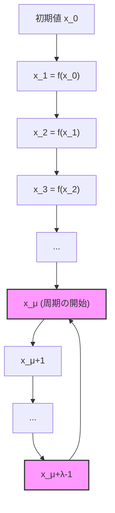
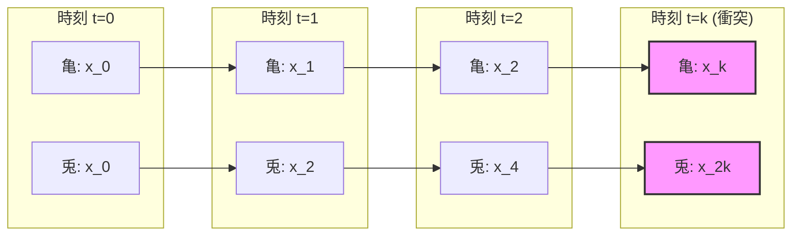
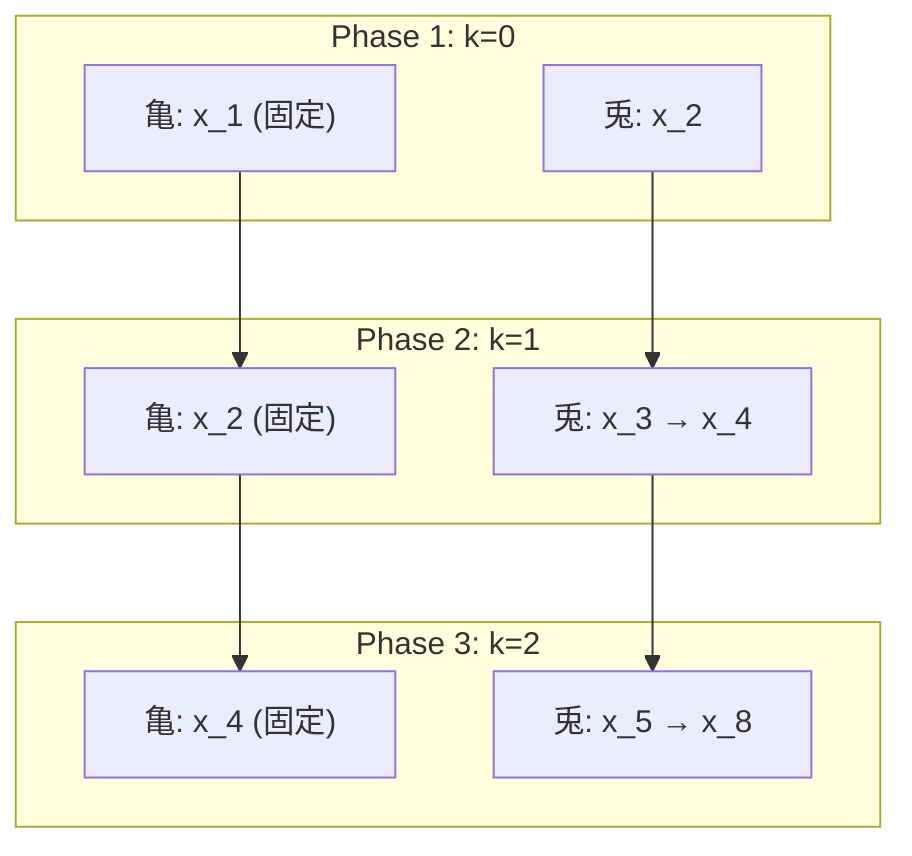
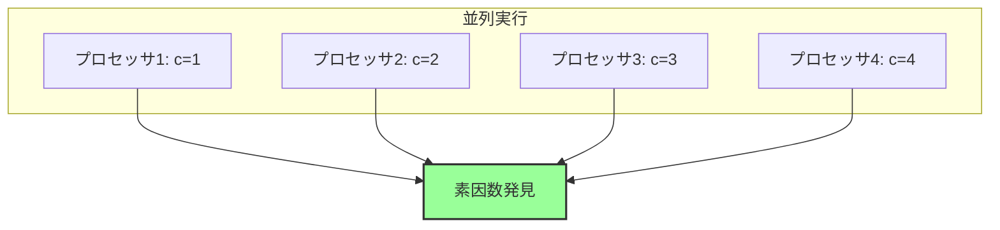
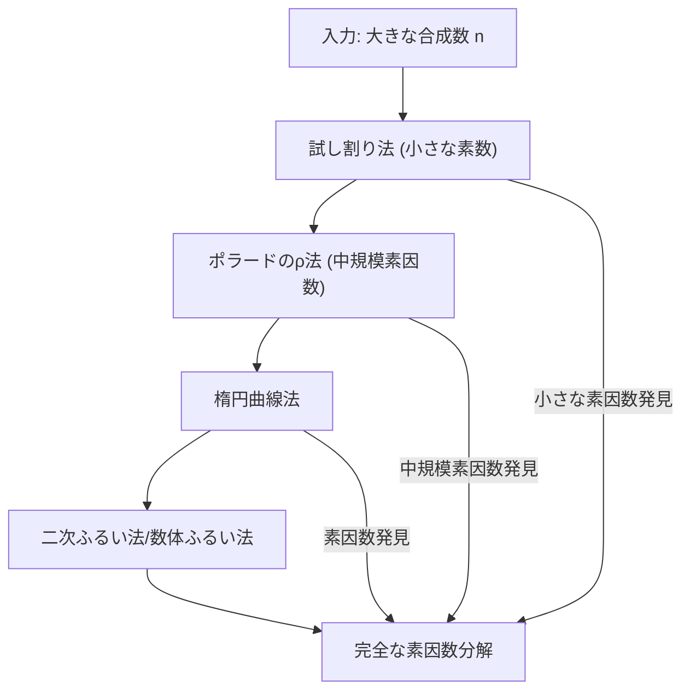

# ポラードのρ法

素因数分解は計算理論において最も基本的でありながら困難な問題の一つである。RSA暗号をはじめとする現代の暗号技術の安全性は、大きな合成数の素因数分解が計算量的に困難であることに依存している。1975年にジョン・ポラードによって考案されたρ法は、試し割り法よりも効率的に素因数を発見できる確率的アルゴリズムであり、特に中規模の素因数を持つ合成数に対して実用的な性能を発揮する[^1]。

ポラードのρ法の名前は、アルゴリズムの実行過程で生成される数列が最終的にギリシャ文字のρ（ロー）の形状を描くことに由来する。この形状は、数列が初期の直線的な部分（ρの縦棒）と、その後の周期的な部分（ρの円形部分）から構成されることを表している。この周期性の検出が、素因数発見の鍵となる。

## 数学的基礎

ポラードのρ法の核心は、合成数nの非自明な因数pを、剰余環Z/pZ上での周期性を利用して発見することにある。アルゴリズムは、適切に選ばれた関数f: Z/nZ → Z/nZによって生成される数列{x_i}を考え、この数列がmod pで周期を持つことを利用する。ここで重要なのは、pの値を事前に知らなくても、gcd(x_i - x_j, n)の計算によってpを発見できる点である。

誕生日のパラドックスが示唆するように、ランダムに選ばれた値の集合において衝突（同じ値の出現）が起こる確率は、直感よりもはるかに高い。具体的には、値域のサイズがmの場合、約√m個の要素を選べば高い確率で衝突が発生する。ポラードのρ法では、この原理を剰余環Z/pZ上で適用することで、O(√p)の期待計算量で素因数pを発見する。



数列{x_i}をmod pで考えたとき、有限集合Z/pZ上の写像であることから、必ず周期が存在する。μを周期が始まるまでのステップ数（テール長）、λを周期の長さとすると、i ≥ μに対してx_{i+λ} ≡ x_i (mod p)が成り立つ。このとき、gcd(x_{i+λ} - x_i, n)を計算すると、高い確率でpの倍数（理想的にはp自身）が得られる。

## フロイドの循環検出法

数列の周期を効率的に検出するため、ポラードのρ法ではフロイドの循環検出法（亀と兎のアルゴリズム）を採用する。このアルゴリズムは、異なる速度で進む2つのポインタを使用することで、O(1)の空間計算量で周期を検出する優れた手法である。

フロイドの循環検出法では、「亀」と呼ばれる遅いポインタが1ステップずつ進むのに対し、「兎」と呼ばれる速いポインタは2ステップずつ進む。数列に周期が存在する場合、兎は必ず亀に追いつく。具体的には、亀がx_i、兎がx_{2i}の位置にいるとき、x_i ≡ x_{2i} (mod p)となるiが存在する。



この衝突が発生したとき、x_k ≡ x_{2k} (mod p)が成り立つため、p | (x_{2k} - x_k)となる。したがって、gcd(x_{2k} - x_k, n)を計算することで、nの非自明な因数を得る可能性がある。

## アルゴリズムの詳細

ポラードのρ法の基本的な実装は以下のような構造を持つ。まず、反復関数fとして通常はf(x) = x^2 + c (mod n)（cは定数）を使用する。この関数は計算が簡単でありながら、適度な擬似ランダム性を持つため広く採用されている。

アルゴリズムの各反復において、亀の位置をx、兎の位置をyとして更新を行う。各ステップでgcd(y - x, n)を計算し、この値が1より大きくnより小さい場合、nの非自明な因数を発見したことになる。ただし、毎回gcd計算を行うのは効率的でないため、実装上の工夫が必要となる。

```python
def pollard_rho(n, c=1):
    if n % 2 == 0:
        return 2
    
    x = 2  # Initial value
    y = 2
    d = 1
    
    f = lambda x: (x * x + c) % n
    
    while d == 1:
        x = f(x)
        y = f(f(y))
        d = gcd(abs(y - x), n)
    
    if d == n:
        return None  # Failed to find a factor
    return d
```

上記の基本実装では、各反復でgcd計算を行っているが、実際にはgcd計算は比較的重い処理である。そこで、複数の差分の積を蓄積してから一度にgcd計算を行う手法が採用される。これにより、gcd計算の回数を大幅に削減できる。

## 計算量解析

ポラードのρ法の期待計算量を厳密に解析するためには、確率論的な議論が必要となる。nの最小の素因数をpとし、関数fがZ/pZ上でランダムな写像として振る舞うと仮定する。このとき、誕生日のパラドックスの理論から、約√(πp/2) ≈ 1.25√p回の反復で周期が検出される期待値が導かれる[^2]。

より詳細な解析によれば、テール長μと周期長λの期待値はともにO(√p)である。フロイドの循環検出法は、最悪でもμ + λステップで衝突を検出するため、全体の期待計算量はO(√p)となる。これは、試し割り法のO(p)と比較して大幅な改善である。

空間計算量については、フロイドの循環検出法を使用することでO(1)を達成している。これは、数列全体を記憶する必要がなく、現在の亀と兎の位置のみを保持すればよいためである。この特性により、非常に大きな数に対しても実用的な実装が可能となっている。

## ブレントの改良

リチャード・ブレントは1980年に、ポラードのρ法の改良版を提案した[^3]。ブレントの改良は、フロイドの循環検出法よりも効率的に周期を検出する手法を採用しており、実践的には約24%の高速化を実現している。

ブレントの手法では、兎を2のべき乗のステップで移動させ、亀を固定位置に保持する。具体的には、k = 0, 1, 2, ...に対して、亀をx_{2^k}の位置に固定し、兎をx_{2^k+1}からx_{2^{k+1}}まで移動させる。この過程で衝突が検出されれば、周期が発見されたことになる。



ブレントの改良により、期待される関数評価回数は約√(πp/2)から約0.78√pに減少する。さらに、実装がより単純になり、条件分岐が減ることでキャッシュ効率も向上する。

## 実装上の考慮事項

実際のポラードのρ法の実装では、いくつかの重要な最適化と注意点がある。まず、gcd計算の頻度を減らすため、複数の差分の積を蓄積する手法が標準的に使用される。具体的には、100～1000個程度の差分の積を計算してから一度にgcdを求めることで、全体の計算時間を大幅に削減できる。

```python
def pollard_rho_optimized(n, c=1):
    if n % 2 == 0:
        return 2
    
    x = 2
    y = 2
    d = 1
    
    f = lambda x: (x * x + c) % n
    
    # Accumulate products before computing gcd
    product = 1
    count = 0
    batch_size = 100
    
    while d == 1:
        for _ in range(batch_size):
            x = f(x)
            y = f(f(y))
            product = (product * abs(y - x)) % n
            count += 1
            
            if count % batch_size == 0:
                d = gcd(product, n)
                if d > 1:
                    break
                product = 1
    
    if d == n:
        # Backtrack to find the exact factor
        return pollard_rho_basic(n, c)
    return d
```

反復関数の選択も重要な要素である。標準的なf(x) = x^2 + c (mod n)において、パラメータcの選択によってアルゴリズムの成功率が変わることがある。特定のnとcの組み合わせでは、生成される数列が短い周期を持ち、素因数の発見に失敗する可能性がある。そのため、失敗した場合は異なるcの値で再試行する戦略が採用される。

オーバーフロー対策も実装上の重要な考慮事項である。特に、差分の積を計算する際には、中間結果が非常に大きくなる可能性がある。多倍長整数演算をサポートする言語では問題ないが、固定精度の整数型を使用する場合は、モンゴメリ乗算などの技法を用いて効率的かつ安全に計算を行う必要がある。

## 失敗パターンと対策

ポラードのρ法は確率的アルゴリズムであるため、必ずしも成功が保証されているわけではない。主な失敗パターンとして、gcd(x_{2k} - x_k, n) = nとなる場合がある。これは、すべての素因数に対して同時に周期が検出されたことを意味し、有用な情報が得られない状況である。

この問題に対する対策として、以下のような手法が採用される。第一に、異なる初期値やパラメータcで再試行する。第二に、バックトラッキングを行い、積を蓄積する前の個々の差分に対してgcd計算を行う。第三に、他の素因数分解アルゴリズム（楕円曲線法など）と組み合わせて使用する。

特に興味深いのは、ポラードのρ法が小さな素因数に対してより効率的に動作する性質である。したがって、実用的な素因数分解システムでは、まず小さな素数での試し割りを行い、次にポラードのρ法で中規模の素因数を探し、最後により高度なアルゴリズムで大きな素因数を扱うという階層的アプローチが採用される。

## 並列化と現代的な実装

ポラードのρ法の基本的な構造は逐次的であるが、複数の独立した数列を並列に実行することで並列化が可能である。各プロセッサが異なる初期値やパラメータで独立にアルゴリズムを実行し、いずれかが素因数を発見した時点で全体を終了する。この手法により、プロセッサ数に比例した高速化が期待できる。

現代的なハードウェアの特性を考慮した最適化も重要である。特に、SIMD命令を活用することで、複数の数列の更新を同時に行うことができる。また、GPUを使用した実装では、数千から数万の独立した数列を同時に処理することで、大幅な高速化を実現している研究もある[^4]。



メモリアクセスパターンの最適化も性能向上に寄与する。ポラードのρ法は基本的にメモリアクセスが少ないアルゴリズムであるが、複数の数列を扱う場合は、キャッシュ効率を考慮したデータ配置が重要となる。特に、各数列の現在値を連続したメモリ領域に配置することで、キャッシュミスを削減できる。

## 理論的な拡張と変種

ポラードのρ法の基本的なアイデアは、様々な数論的問題に応用されている。離散対数問題に対するポラードのρ法は、楕円曲線暗号の解析において重要な役割を果たしている。この変種では、群の要素に対して適切な反復関数を定義し、衝突を検出することで離散対数を求める。

より一般的には、有限集合上の関数反復による周期検出という枠組みは、多くの計算問題に適用可能である。例えば、擬似乱数生成器の周期長の推定、グラフの同型性判定、某些の組合せ最適化問題などにおいて、類似の手法が使用されている。

量子計算の文脈では、ショアのアルゴリズムが素因数分解問題を多項式時間で解くことが知られているが、現実的な量子コンピュータが利用可能になるまでは、ポラードのρ法のような古典的アルゴリズムが重要な役割を果たし続けると考えられる。

## パラメータ選択の戦略

実用的な実装において、パラメータcの選択戦略は性能に大きな影響を与える。理論的には、cの値は1以外の任意の値で良いとされているが、実際には特定の値が他よりも良い性能を示すことが経験的に知られている。一般的な戦略として、小さな正の整数（1, 2, 3など）から始めて、失敗した場合により大きな値や負の値を試すアプローチが採用される。

より洗練された手法として、nの特性に基づいてcを選択する戦略もある。例えば、nが特定の形式（メルセンヌ数やフェルマー数など）の場合、その構造を利用した特殊なパラメータ選択により、標準的な選択よりも高速に素因数を発見できることがある。

反復関数自体の選択も研究対象となっている。標準的なf(x) = x^2 + c以外にも、f(x) = x^3 + c、f(x) = x^2 - 2など、様々な多項式が提案されている。これらの関数の選択は、生成される数列の統計的性質と計算効率のトレードオフを考慮して決定される。

## 実装のデバッグとテスト

ポラードのρ法の実装をデバッグする際には、いくつかの注意点がある。まず、小さな合成数（例：15 = 3 × 5）でアルゴリズムの動作を確認することが重要である。この段階で、各反復での値の更新、gcd計算、終了条件などの基本的な動作を検証する。

次に、既知の素因数を持つ大きな合成数でテストを行う。RSA暗号の公開鍵として使用されたことのある数（例：RSA-100など）は、素因数分解の結果が公開されているため、良いテストケースとなる。これらのテストにより、アルゴリズムの正確性と効率性を確認できる。

特に注意すべきは、オーバーフローや数値誤差の問題である。大きな数を扱う際には、プログラミング言語の整数型の制限を超える可能性があるため、適切な多倍長整数ライブラリの使用や、モジュラ演算の正確な実装が必要となる。

## 競技プログラミングにおける活用

競技プログラミングの文脈では、ポラードのρ法は主に大きな数の素因数分解が必要な問題で使用される。典型的な使用場面として、オイラーのφ関数の計算、原始根の判定、離散対数問題などがある。これらの問題では、10^18程度までの数の素因数分解が要求されることがあり、試し割り法では時間制限に間に合わない。

実装の際には、コンテストの時間制限と精度要求を考慮する必要がある。一般的に、ブレントの改良版を基本とし、小さな素数での試し割りと組み合わせた実装が推奨される。また、決定的な素数判定（ミラー・ラビン法など）と組み合わせることで、素数の場合に無駄な計算を避けることができる。

```python
def factorize(n):
    if n <= 1:
        return []
    
    factors = []
    
    # Small prime division
    for p in [2, 3, 5, 7, 11, 13, 17, 19, 23, 29, 31, 37]:
        while n % p == 0:
            factors.append(p)
            n //= p
    
    if n == 1:
        return factors
    
    # Miller-Rabin primality test
    if is_prime(n):
        factors.append(n)
        return factors
    
    # Pollard's rho for remaining composite
    while n > 1:
        if is_prime(n):
            factors.append(n)
            break
        
        p = pollard_rho(n)
        while p is None:
            p = pollard_rho(n, random.randint(1, n-1))
        
        while n % p == 0:
            factors.append(p)
            n //= p
    
    return sorted(factors)
```

## セキュリティへの影響

ポラードのρ法の存在は、暗号システムの設計に重要な影響を与えている。RSA暗号などの安全性は、大きな合成数の素因数分解の困難性に依存しているが、ポラードのρ法により、素因数のサイズが√nに比例する計算量で分解可能であることが示されている。

このため、現代の暗号システムでは、使用する素数のサイズに関して慎重な選択が必要となる。一般的に、RSA-2048などの暗号では、各素数が約1024ビットの大きさを持つ。この場合、ポラードのρ法でも2^512回程度の演算が必要となり、現実的な時間での解読は不可能である。

しかし、量子コンピュータの発展や、新しい素因数分解アルゴリズムの発見の可能性を考慮すると、暗号システムの安全性は常に再評価される必要がある。ポラードのρ法は、この評価プロセスにおいて重要なベンチマークとしての役割を果たしている。

## 数値例による理解

具体的な数値例を通じて、ポラードのρ法の動作を詳しく見てみよう。n = 1387 = 19 × 73を素因数分解する過程を追跡する。初期値x_0 = 2、c = 1として、f(x) = x^2 + 1 (mod 1387)を使用する。

最初の数ステップでの値の変化は以下のようになる：
- x_0 = 2, y_0 = 2
- x_1 = 5, y_1 = 26
- x_2 = 26, y_2 = 678
- x_3 = 677, y_3 = 1083

各ステップでgcd(|y - x|, 1387)を計算すると、初期のステップでは1が得られるが、やがて19または73が得られる。この例では、比較的少ない反復回数で素因数が発見される。

この過程をmod 19で見ると、より小さな空間での周期性が明確になる：
- x_0 ≡ 2 (mod 19)
- x_1 ≡ 5 (mod 19)
- x_2 ≡ 7 (mod 19)
- x_3 ≡ 11 (mod 19)

この数列はmod 19で周期を形成し、その周期性がgcd計算を通じて検出される。

## アルゴリズムの限界と代替手法

ポラードのρ法は万能ではなく、特定の状況では効率が悪化する。最も顕著な例は、nが大きな素数の積である場合である。例えば、n = p × qで、pとqがほぼ同じ大きさの素数の場合、ポラードのρ法の期待計算量はO(n^{1/4})となり、効率が低下する。

このような場合には、他の素因数分解アルゴリズムが有効となる。二次ふるい法や数体ふるい法は、大きな合成数に対してより効率的に動作する。また、楕円曲線法は、小さな素因数を持つ大きな数に対して特に効果的である。

実用的な素因数分解システムでは、これらのアルゴリズムを組み合わせて使用する。一般的な戦略として、まず試し割りで小さな素因数を除去し、次にポラードのρ法で中規模の素因数を探し、残った部分に対してより高度なアルゴリズムを適用する。



## 実装の最適化技法

高性能な実装を実現するためには、様々な最適化技法を適用する必要がある。まず、モンゴメリ乗算を使用することで、剰余演算のコストを削減できる。特に、同じ法nに対して多数の乗算を行う場合、この技法による高速化は顕著である。

```python
class MontgomeryContext:
    def __init__(self, n):
        self.n = n
        self.r = 1 << n.bit_length()
        self.r_inv = pow(self.r, -1, n)
        self.n_prime = (self.r * self.r_inv - 1) // n
        
    def to_montgomery(self, x):
        return (x * self.r) % self.n
    
    def from_montgomery(self, x):
        return (x * self.r_inv) % self.n
    
    def mont_mul(self, a, b):
        t = a * b
        u = (t * self.n_prime) % self.r
        v = (t + u * self.n) >> self.r.bit_length()
        return v if v < self.n else v - self.n
```

また、関数のインライン展開やループアンローリングなどの低レベルな最適化も効果的である。特に、反復関数f(x)の計算は最もホットなコードパスであるため、この部分の最適化による影響は大きい。

メモリプリフェッチングの活用も現代的なプロセッサでは重要である。複数の数列を並列に処理する場合、次に必要となるデータを事前にプリフェッチすることで、メモリレイテンシの影響を軽減できる。

[^1]: J. M. Pollard, "A Monte Carlo method for factorization", BIT Numerical Mathematics, vol. 15, no. 3, pp. 331-334, 1975.

[^2]: D. E. Knuth, "The Art of Computer Programming, Volume 2: Seminumerical Algorithms", 3rd edition, Addison-Wesley, 1997.

[^3]: R. P. Brent, "An improved Monte Carlo factorization algorithm", BIT Numerical Mathematics, vol. 20, no. 2, pp. 176-184, 1980.

[^4]: K. Bernstein et al., "Factoring RSA keys from certified smart cards: Coppersmith in the wild", Proceedings of ASIACRYPT 2013, pp. 341-360, 2013.