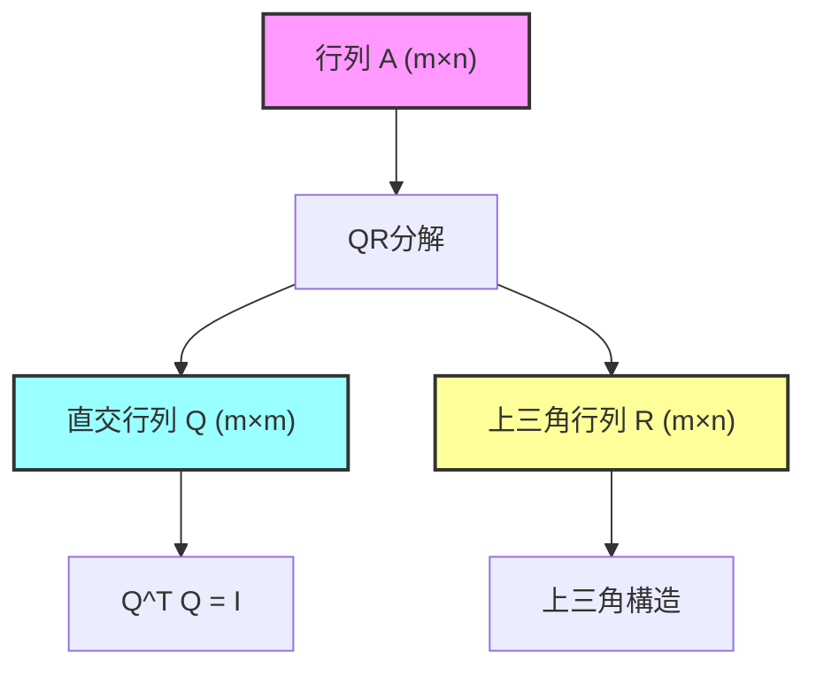
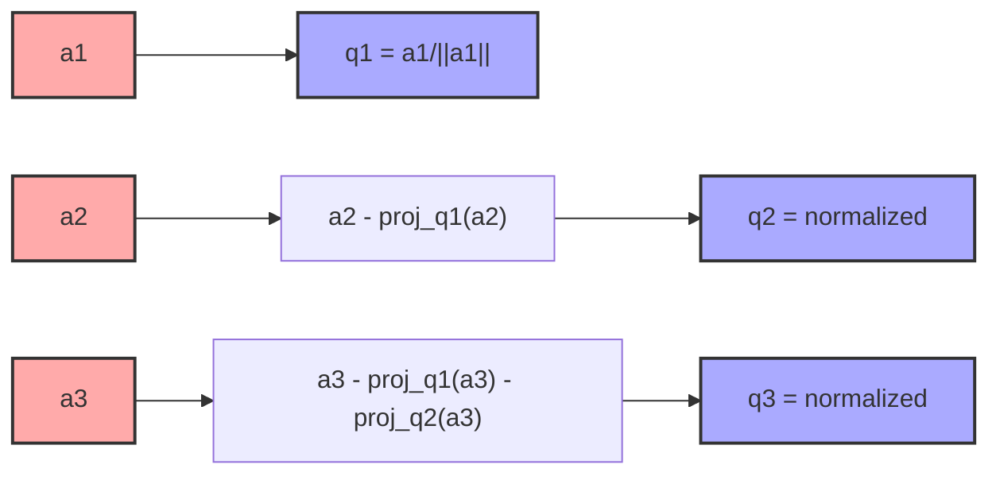
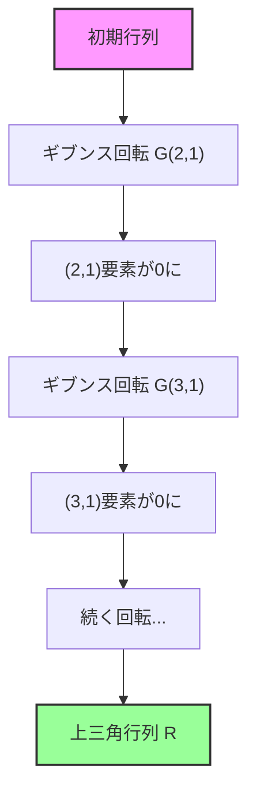
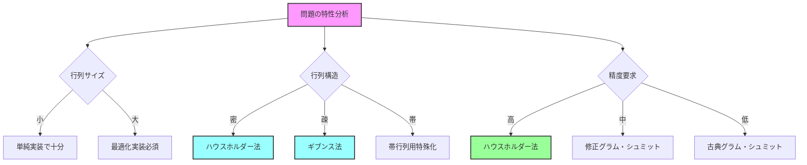

# QR分解

QR分解は線形代数における基本的な行列分解手法の一つであり、任意の行列を直交行列と上三角行列の積に分解する技術である。この分解は数値線形代数の中核を成す技術として、連立一次方程式の解法、最小二乗問題、固有値計算など幅広い応用を持つ。競技プログラミングにおいても、幾何学的問題や数値計算を要する問題で活用される場面がある。

数学的には、任意の $m \times n$ 行列 $A$（ただし $m \geq n$）に対して、$m \times m$ の直交行列 $Q$ と $m \times n$ の上三角行列 $R$ が存在し、$A = QR$ と分解できることが保証されている[^1]。ここで直交行列とは $Q^T Q = Q Q^T = I$ を満たす行列であり、上三角行列とは対角成分より下の要素がすべて0である行列を指す。この分解の存在性と一意性は、グラム・シュミットの直交化プロセスの一般化として理解できる。



## 数学的基礎と理論的背景

QR分解の理論的基礎は、ベクトル空間の直交基底の構成にある。$n$ 次元ベクトル空間において、任意の線形独立なベクトルの組から正規直交基底を構成できるという事実が、QR分解の存在を保証している。行列 $A$ の列ベクトルを $a_1, a_2, \ldots, a_n$ とするとき、これらから正規直交ベクトル $q_1, q_2, \ldots, q_n$ を構成し、元のベクトルをこの正規直交基底で表現することがQR分解の本質である。

数学的により厳密に述べると、行列 $A$ のランクが $r$ であるとき、$A$ の列空間の次元は $r$ となる。この $r$ 次元部分空間に対して正規直交基底 $\{q_1, q_2, \ldots, q_r\}$ を選び、必要に応じて $\mathbb{R}^m$ の正規直交基底となるように $\{q_{r+1}, \ldots, q_m\}$ を追加することで、直交行列 $Q = [q_1 | q_2 | \cdots | q_m]$ が構成される。このとき、$A$ の各列は $Q$ の列の線形結合で表現され、その係数が上三角行列 $R$ を形成する。

特に重要なのは、$A$ がフルランク（$\text{rank}(A) = n$）の場合である。このとき、$R$ の対角成分はすべて非零となり、分解は本質的に一意となる。より正確には、$R$ の対角成分を正とする制約を課せば、QR分解は一意に定まる。この性質は数値計算において重要であり、アルゴリズムの安定性と結果の再現性を保証する。

## アルゴリズムの詳細

QR分解を計算するアルゴリズムは複数存在し、それぞれに計算効率と数値的安定性のトレードオフがある。主要な手法として、グラム・シュミット法、ハウスホルダー変換、ギブンス回転の3つを詳細に検討する。

### グラム・シュミット法

グラム・シュミット法は最も直感的なQR分解アルゴリズムである。基本的なアイデアは、行列 $A$ の列ベクトルを順次直交化していくことである。アルゴリズムは以下のように進行する：

```python
def gram_schmidt_qr(A):
    m, n = A.shape
    Q = np.zeros((m, n))
    R = np.zeros((n, n))
    
    for j in range(n):
        v = A[:, j]
        for i in range(j):
            R[i, j] = np.dot(Q[:, i], A[:, j])
            v = v - R[i, j] * Q[:, i]
        R[j, j] = np.linalg.norm(v)
        Q[:, j] = v / R[j, j]
    
    return Q, R
```

このアルゴリズムの計算量は $O(mn^2)$ であり、各列に対して過去のすべての列との内積計算と射影の除去を行う。しかし、古典的グラム・シュミット法は数値的に不安定であることが知られている。特に、列ベクトル間の角度が小さい場合、丸め誤差の蓄積により直交性が失われやすい。



### 修正グラム・シュミット法

古典的グラム・シュミット法の数値的不安定性を改善するため、修正グラム・シュミット法が開発された。この手法では、各ステップで射影を即座に除去することで、丸め誤差の蓄積を抑制する。

```python
def modified_gram_schmidt_qr(A):
    m, n = A.shape
    Q = A.copy()
    R = np.zeros((n, n))
    
    for i in range(n):
        R[i, i] = np.linalg.norm(Q[:, i])
        Q[:, i] = Q[:, i] / R[i, i]
        for j in range(i + 1, n):
            R[i, j] = np.dot(Q[:, i], Q[:, j])
            Q[:, j] = Q[:, j] - R[i, j] * Q[:, i]
    
    return Q, R
```

修正版では、各列の正規化後に即座にその列を使って後続の列から射影成分を除去する。この順序の変更により、数値的安定性が大幅に向上する。計算量は古典的手法と同じ $O(mn^2)$ であるが、実用上の性能は大きく異なる。

### ハウスホルダー変換

ハウスホルダー変換は、数値的に最も安定なQR分解アルゴリズムの一つである。この手法は、鏡映変換を用いて行列を段階的に上三角化する。ハウスホルダー行列 $H$ は以下の形式を持つ：

$$H = I - 2vv^T$$

ここで $v$ は単位ベクトルであり、$H$ は $v$ に垂直な超平面に関する鏡映を表す。適切に $v$ を選ぶことで、ベクトルの特定の成分を0にできる。

```python
def householder_qr(A):
    m, n = A.shape
    Q = np.eye(m)
    R = A.copy()
    
    for k in range(n):
        x = R[k:m, k]
        v = x.copy()
        v[0] += np.sign(x[0]) * np.linalg.norm(x)
        v = v / np.linalg.norm(v)
        
        R[k:m, k:n] -= 2 * np.outer(v, np.dot(v, R[k:m, k:n]))
        Q[:, k:m] -= 2 * np.outer(Q[:, k:m].dot(v), v)
    
    return Q, R
```

ハウスホルダー変換の利点は、各変換が直交変換であるため、数値的安定性が保証されることである。計算量は $O(2mn^2 - 2n^3/3)$ となり、グラム・シュミット法より若干多いが、その安定性から実用上最も頻繁に使用される。

### ギブンス回転

ギブンス回転は、2次元平面内での回転を用いて要素を選択的に0にする手法である。回転行列 $G(i,j,\theta)$ は以下の構造を持つ：

$$G(i,j,\theta) = \begin{pmatrix}
1 & \cdots & 0 & \cdots & 0 & \cdots & 0 \\
\vdots & \ddots & \vdots & & \vdots & & \vdots \\
0 & \cdots & \cos\theta & \cdots & -\sin\theta & \cdots & 0 \\
\vdots & & \vdots & \ddots & \vdots & & \vdots \\
0 & \cdots & \sin\theta & \cdots & \cos\theta & \cdots & 0 \\
\vdots & & \vdots & & \vdots & \ddots & \vdots \\
0 & \cdots & 0 & \cdots & 0 & \cdots & 1
\end{pmatrix}$$

ギブンス回転は、疎行列に対して特に効率的である。なぜなら、各回転は2行のみに影響するため、疎性を保ちやすいからである。



## 数値的安定性と条件数

QR分解の数値的性質を理解するには、条件数の概念が重要である。行列 $A$ の条件数 $\kappa(A) = \|A\| \cdot \|A^{-1}\|$ は、入力の摂動に対する出力の感度を表す。QR分解において、直交行列 $Q$ は条件数1（最良条件）を持つため、分解の安定性は主に $R$ の性質に依存する。

実際、$\kappa(R) = \kappa(A)$ という重要な性質がある。これは、QR分解が元の行列の条件数を保存することを意味する。しかし、分解アルゴリズムの選択により、計算過程での誤差の蓄積は大きく異なる。

グラム・シュミット法では、条件数が大きい場合に直交性の喪失が顕著になる。具体的には、計算された $\hat{Q}$ に対して $\|\hat{Q}^T\hat{Q} - I\|$ が $O(\varepsilon \kappa(A)^2)$ となることがある（$\varepsilon$ は機械精度）。一方、ハウスホルダー法では $O(\varepsilon \kappa(A))$ に抑えられる。

数値的安定性を評価する別の指標として、後退誤差解析がある。理想的には、計算された $\hat{Q}$ と $\hat{R}$ が、わずかに摂動した行列 $A + \Delta A$ の厳密なQR分解となることが望ましい。ハウスホルダー法とギブンス法は、$\|\Delta A\| = O(\varepsilon \|A\|)$ を達成し、後退安定であることが証明されている[^2]。

## 応用と実装上の考慮事項

QR分解は多様な応用を持つが、それぞれの文脈で異なる実装上の工夫が必要となる。主要な応用として、線形最小二乗問題、固有値計算、行列の階数判定などがある。

### 線形最小二乗問題

過決定系 $Ax = b$（$m > n$）の最小二乗解は、正規方程式 $A^T A x = A^T b$ を解くことで得られるが、$A^T A$ の条件数は $\kappa(A)^2$ となるため数値的に不利である。QR分解を用いると、$A = QR$ より：

$$\|Ax - b\|^2 = \|QRx - b\|^2 = \|Rx - Q^T b\|^2$$

直交変換はノルムを保存するため、$Rx = Q^T b$ の上位 $n$ 個の方程式を解けばよい。これは後退代入により $O(n^2)$ で計算できる。

```python
def qr_least_squares(A, b):
    Q, R = np.linalg.qr(A, mode='reduced')
    y = Q.T @ b
    x = np.linalg.solve(R[:A.shape[1], :], y[:A.shape[1]])
    return x
```

### QRアルゴリズムによる固有値計算

QRアルゴリズムは、行列の固有値を反復的に計算する手法である。基本的なアイデアは、行列 $A_0 = A$ から始めて、以下の反復を行うことである：

$$A_k = Q_k R_k \quad \text{(QR分解)}$$
$$A_{k+1} = R_k Q_k$$

この反復により、$A_k$ は上三角行列（実固有値の場合）またはブロック上三角行列（複素固有値の場合）に収束する。収束を加速するため、実用的な実装ではシフト戦略が用いられる：

$$A_k - \sigma_k I = Q_k R_k$$
$$A_{k+1} = R_k Q_k + \sigma_k I$$

適切なシフト $\sigma_k$ の選択により、収束速度を2次から3次に改善できる。

### 競技プログラミングにおける応用

競技プログラミングでは、QR分解は主に以下の文脈で現れる：

1. **幾何学的問題**: 点群に対する最適な変換行列の計算、主成分分析による次元削減など
2. **数値計算問題**: 連立一次方程式の安定な解法、多項式フィッティングなど
3. **グラフ理論**: グラフラプラシアンの固有値計算による連結性解析など

実装においては、計算時間の制約から、完全なQR分解ではなく部分的な分解や近似手法が用いられることもある。例えば、ランク落ち検出には、R行列の対角要素の大きさを監視すれば十分な場合が多い。

```python
def rank_revealing_qr(A, tol=1e-10):
    Q, R, P = scipy.linalg.qr(A, pivoting=True)
    rank = np.sum(np.abs(np.diag(R)) > tol)
    return Q, R, P, rank
```

## 実装の最適化と並列化

現代的な計算環境では、QR分解の性能は単純な算術演算数だけでなく、キャッシュ効率やベクトル化、並列化の度合いに大きく依存する。LAPACK[^3]などの高性能線形代数ライブラリでは、ブロック化アルゴリズムが採用されている。

ブロック化QR分解では、行列を列方向にブロック分割し、各ブロックに対してQR分解を適用する。これにより、行列-行列積（Level 3 BLAS）の割合を増やし、キャッシュ効率を向上させる。典型的なブロックサイズは32から256の範囲で、アーキテクチャに依存して調整される。

```python
def blocked_qr(A, block_size=64):
    m, n = A.shape
    Q = np.eye(m)
    R = A.copy()
    
    for i in range(0, n, block_size):
        ib = min(block_size, n - i)
        # Current panel
        Q_panel, R_panel = householder_qr(R[i:, i:i+ib])
        R[i:, i:i+ib] = R_panel
        # Update trailing matrix
        R[i:, i+ib:] = Q_panel.T @ R[i:, i+ib:]
        # Accumulate Q
        Q[:, i:] = Q[:, i:] @ Q_panel
    
    return Q, R
```

並列化については、列のブロック分割により自然な並列性が得られる。各プロセッサが異なる列ブロックを担当し、必要に応じて通信を行う。ただし、ハウスホルダー変換の適用は本質的に逐次的な操作であるため、並列効率には限界がある。

GPU実装では、細粒度の並列性を活用するため、バッチ処理が重要となる。多数の小規模な行列に対するQR分解を同時に実行することで、GPUの計算資源を効率的に利用できる。CUDAやcuBLASを用いた実装では、共有メモリの活用とワープ発散の最小化が性能の鍵となる。

## 誤差解析と安定性の詳細

QR分解の誤差解析は、浮動小数点演算の特性を考慮した厳密な議論を要する。IEEE 754倍精度では、機械精度 $\varepsilon \approx 2.2 \times 10^{-16}$ に対して、各算術演算で最大 $\varepsilon$ の相対誤差が生じる。

ハウスホルダーQR分解の場合、Wilkinson[^4]による古典的な誤差解析によれば、計算された $\hat{Q}$ と $\hat{R}$ に対して：

$$A + E = \hat{Q}\hat{R}, \quad \|E\|_F \leq c_1 m n \varepsilon \|A\|_F$$

ここで $c_1$ は小さな定数（典型的には10未満）であり、$\|\cdot\|_F$ はフロベニウスノルムを表す。さらに、$\hat{Q}$ の直交性については：

$$\|\hat{Q}^T\hat{Q} - I\|_F \leq c_2 n \varepsilon$$

これらの結果は、ハウスホルダー法が後退安定であることを示している。つまり、計算結果は元の行列のわずかな摂動に対する厳密解として解釈できる。

一方、古典的グラム・シュミット法では、最悪の場合：

$$\|\hat{Q}^T\hat{Q} - I\|_F = O(\varepsilon \kappa(A)^{n-1})$$

となる可能性があり、条件数が大きい場合や次元が高い場合に深刻な精度劣化を引き起こす。修正グラム・シュミット法では、この誤差を $O(\varepsilon \kappa(A))$ に改善できるが、それでもハウスホルダー法には及ばない。

実用的な観点から、以下の判定基準が有用である：

- $\kappa(A) < 1/\sqrt{\varepsilon}$ の場合：修正グラム・シュミット法で十分
- $\kappa(A) \geq 1/\sqrt{\varepsilon}$ の場合：ハウスホルダー法またはギブンス法を推奨
- 疎行列の場合：ギブンス法が疎性を保存するため有利

## 特殊な構造を持つ行列への適用

実際の応用では、行列が特殊な構造を持つことが多く、これを活用することで計算効率を大幅に改善できる。

### ヘッセンベルグ行列

上ヘッセンベルグ行列（下副対角より下がすべて0）のQR分解は、ギブンス回転により効率的に計算できる。各列に対して1回の回転のみが必要となり、計算量は $O(n^2)$ に削減される。これは、QRアルゴリズムによる固有値計算で重要な役割を果たす。

### 帯行列

帯幅 $b$ の帯行列に対しては、QR分解後も $R$ の帯構造が保存される（ただし上側の帯幅は最大 $2b$ になる）。ギブンス回転を用いることで、$O(nb^2)$ の計算量でQR分解を実行できる。

### ブロック構造

ブロック対角行列やブロック三角行列の場合、各ブロックを独立に処理できる。これにより、並列化が容易になるだけでなく、メモリ使用量も削減される。

```python
def block_diagonal_qr(blocks):
    Q_blocks = []
    R_blocks = []
    for block in blocks:
        Q, R = np.linalg.qr(block)
        Q_blocks.append(Q)
        R_blocks.append(R)
    return block_diag(*Q_blocks), block_diag(*R_blocks)
```

## 拡張と一般化

標準的なQR分解には、様々な拡張と一般化が存在する。これらは特定の応用に対してより適した性質を持つ。

### 薄いQR分解（Thin QR）

$m \gg n$ の場合、完全な $m \times m$ の直交行列 $Q$ を計算する必要はない。薄いQR分解では、$Q$ を $m \times n$ に制限し、$R$ を $n \times n$ とする。これにより、メモリ使用量を $O(mn)$ から $O(mn + n^2)$ に削減できる。

### ランク落ちQR分解

列ピボッティング付きQR分解は、数値的なランク判定に有用である：

$$AP = QR$$

ここで $P$ は置換行列であり、$R$ の対角要素が降順になるように列を並べ替える。対角要素が閾値以下になった時点で、そのインデックスが数値的ランクを示す。

### 一般化QR分解

2つの行列 $A$ と $B$ に対する一般化QR分解は：

$$A = QR, \quad B = QZ$$

ここで $Q$ は直交行列、$R$ と $Z$ は上三角行列である。これは一般化固有値問題や制約付き最小二乗問題で使用される。

## 性能評価と実装の選択指針

QR分解の実装を選択する際には、以下の要因を考慮する必要がある：

1. **問題のサイズ**: 小規模（$n < 100$）では実装の単純さが重要、大規模ではキャッシュ効率とベクトル化が支配的
2. **行列の構造**: 密行列、疎行列、構造化行列で最適なアルゴリズムが異なる
3. **精度要求**: 条件数が大きい場合はハウスホルダー法、通常はグラム・シュミット法でも十分
4. **計算環境**: CPU/GPU、並列度、メモリ階層の特性
5. **後続の処理**: 最小二乗解のみ必要な場合は $Q$ の明示的計算を避けられる

現代的な数値計算ライブラリ（Intel MKL、OpenBLAS、cuBLAS等）では、これらの要因を考慮した最適化実装が提供されている。競技プログラミングのような時間制約のある環境では、問題の特性を見極めて適切な簡略化を行うことが重要である。



QR分解は線形代数の基礎的な道具として、理論的な美しさと実用的な有用性を兼ね備えている。その理解と適切な実装は、数値計算を扱うすべてのエンジニアにとって重要な技能である。特に競技プログラミングにおいては、問題の本質を見極めて適切な手法を選択し、必要十分な実装を行うことが成功の鍵となる。

[^1]: Golub, G. H., & Van Loan, C. F. (2013). Matrix computations (4th ed.). Johns Hopkins University Press.

[^2]: Higham, N. J. (2002). Accuracy and stability of numerical algorithms (2nd ed.). SIAM.

[^3]: Anderson, E., et al. (1999). LAPACK Users' Guide (3rd ed.). SIAM.

[^4]: Wilkinson, J. H. (1965). The algebraic eigenvalue problem. Oxford University Press.