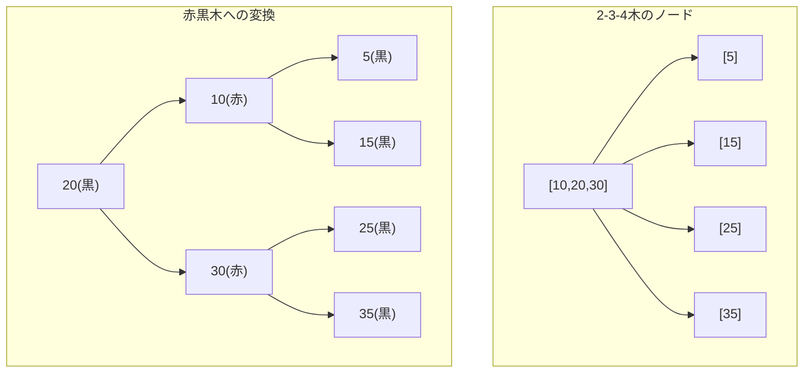
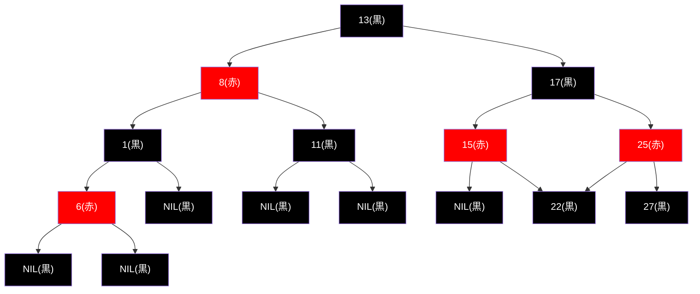
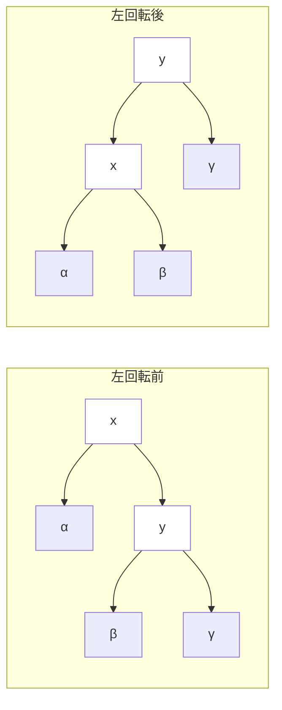
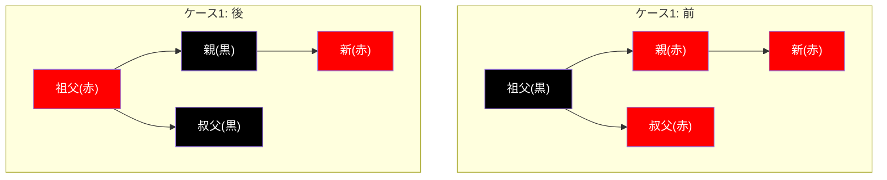
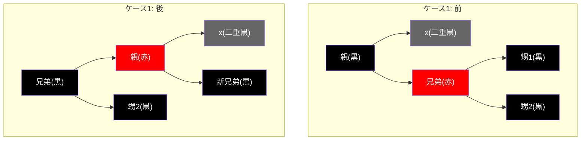
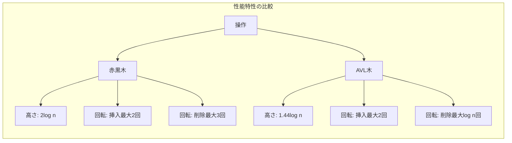

# 赤黒木

赤黒木（Red-Black Tree）は、1972年にRudolf Bayerによって「対称二分B木」として提案され[^1]、その後1978年にLeonidas J. GuibasとRobert Sedgewickによって現在の形式に改良された自己平衡二分探索木である[^2]。各ノードに赤または黒の色属性を持たせることで、木の高さを対数オーダーに保ち、最悪計算量O(log n)での検索、挿入、削除を保証する。この特性により、C++のstd::mapやstd::set、JavaのTreeMapやTreeSet、LinuxカーネルのCFSスケジューラなど、多くの実装で採用されている。

赤黒木の本質は、2-3-4木という多分木を二分木として表現する手法にある。2-3-4木では各ノードが2個から4個の子を持つが、これを二分木に変換する際、ノード内の複数のキーを赤エッジで繋ぎ、ノード間の接続を黒エッジで表現する。この変換により、2-3-4木の平衡性が赤黒木の色制約として保存される。赤黒木の理解において、この対応関係を把握することは極めて重要である。



## 赤黒木の定義と性質

赤黒木は以下の5つの性質を満たす二分探索木として定義される：

1. **ノード色制約**: 各ノードは赤または黒の色を持つ
2. **根の色制約**: 根は黒である
3. **葉の色制約**: すべての葉（NILノード）は黒である
4. **赤ノード制約**: 赤ノードの子は必ず黒である（赤ノードが連続してはならない）
5. **黒高さ一様性**: 任意のノードから葉までの経路に含まれる黒ノードの数は等しい

これらの制約により、最長経路の長さは最短経路の長さの高々2倍となることが保証される。なぜなら、性質4により赤ノードは連続できないため、最長経路でも黒ノードと赤ノードが交互に現れることになり、性質5により黒ノードの数は一定であるからだ。



黒高さ（black-height）とは、あるノードから任意の葉までの経路上の黒ノードの数（そのノード自身は含まない）を指す。赤黒木の高さhに関して、以下の重要な定理が成立する：

**定理**: n個の内部ノードを持つ赤黒木の高さは高々2log₂(n+1)である。

この定理の証明は、まず部分木の黒高さbhに対して、その部分木が少なくとも2^bh - 1個の内部ノードを含むことを数学的帰納法で示し、次に高さhの木の黒高さが少なくともh/2であることから導かれる。

## 回転操作

赤黒木の操作において、回転は木の構造を局所的に変更しながら二分探索木の性質を保つ基本操作である。左回転と右回転の2種類があり、これらは互いに逆操作となっている。



左回転の操作は以下のように定式化される。ノードxを中心とした左回転において、xの右子yがxの親となり、yの左部分木βがxの右部分木となる。この操作により、二分探索木の順序関係（α < x < β < y < γ）は保存される。

```cpp
void leftRotate(Node* x) {
    Node* y = x->right;
    x->right = y->left;
    if (y->left != nil) {
        y->left->parent = x;
    }
    y->parent = x->parent;
    if (x->parent == nil) {
        root = y;
    } else if (x == x->parent->left) {
        x->parent->left = y;
    } else {
        x->parent->right = y;
    }
    y->left = x;
    x->parent = y;
}
```

## 挿入操作

赤黒木への挿入は、通常の二分探索木への挿入に続いて、赤黒木の性質を回復する修正処理から構成される。新しいノードは常に赤として挿入されるが、これは黒高さ一様性（性質5）を維持するためである。

挿入後の修正処理では、主に赤ノード制約（性質4）の違反を解消する必要がある。親ノードが赤の場合、赤ノードが連続することになるため、以下の3つのケースに分けて処理を行う：

**ケース1**: 叔父ノードが赤の場合。親と叔父を黒に、祖父を赤に変更し、祖父を新たな注目ノードとして処理を継続する。



**ケース2**: 叔父ノードが黒で、新ノードが親の内側の子の場合。親を中心に回転してケース3に帰着させる。

**ケース3**: 叔父ノードが黒で、新ノードが親の外側の子の場合。親を黒に、祖父を赤に変更し、祖父を中心に回転する。

```cpp
void insertFixup(Node* z) {
    while (z->parent->color == RED) {
        if (z->parent == z->parent->parent->left) {
            Node* y = z->parent->parent->right;  // uncle
            if (y->color == RED) {  // Case 1
                z->parent->color = BLACK;
                y->color = BLACK;
                z->parent->parent->color = RED;
                z = z->parent->parent;
            } else {
                if (z == z->parent->right) {  // Case 2
                    z = z->parent;
                    leftRotate(z);
                }
                // Case 3
                z->parent->color = BLACK;
                z->parent->parent->color = RED;
                rightRotate(z->parent->parent);
            }
        } else {
            // Symmetric cases with left and right exchanged
        }
    }
    root->color = BLACK;
}
```

## 削除操作

赤黒木からの削除は挿入よりも複雑である。通常の二分探索木の削除と同様に、削除対象ノードが2つの子を持つ場合は後続ノード（successor）と値を交換してから削除する。削除によって赤黒木の性質が崩れる可能性があるのは、削除されるノードまたはその代替ノードが黒の場合である。

削除後の修正処理では、「二重黒」という概念を導入する。これは、黒ノードが削除されたことで黒高さが1減少した経路を表現するための仮想的な色である。修正処理は、この二重黒を解消することを目的とする。

削除の修正処理は4つのケースに分類される：

**ケース1**: 兄弟ノードが赤の場合。兄弟を黒に、親を赤に変更し、親を中心に回転する。これにより、兄弟が黒のケースに帰着する。



**ケース2**: 兄弟ノードが黒で、両方の甥が黒の場合。兄弟を赤にし、二重黒を親に伝播させる。

**ケース3**: 兄弟ノードが黒で、遠い甥が黒、近い甥が赤の場合。近い甥と兄弟の色を交換し、兄弟を中心に回転してケース4に帰着させる。

**ケース4**: 兄弟ノードが黒で、遠い甥が赤の場合。兄弟と親の色を交換し、遠い甥を黒にして、親を中心に回転する。

```cpp
void deleteFixup(Node* x) {
    while (x != root && x->color == BLACK) {
        if (x == x->parent->left) {
            Node* w = x->parent->right;  // sibling
            if (w->color == RED) {  // Case 1
                w->color = BLACK;
                x->parent->color = RED;
                leftRotate(x->parent);
                w = x->parent->right;
            }
            if (w->left->color == BLACK && w->right->color == BLACK) {  // Case 2
                w->color = RED;
                x = x->parent;
            } else {
                if (w->right->color == BLACK) {  // Case 3
                    w->left->color = BLACK;
                    w->color = RED;
                    rightRotate(w);
                    w = x->parent->right;
                }
                // Case 4
                w->color = x->parent->color;
                x->parent->color = BLACK;
                w->right->color = BLACK;
                leftRotate(x->parent);
                x = root;
            }
        } else {
            // Symmetric cases with left and right exchanged
        }
    }
    x->color = BLACK;
}
```

## 計算量の解析

赤黒木の各操作の計算量は、木の高さに依存する。n個のノードを持つ赤黒木の高さがO(log n)であることから、以下の計算量が導かれる：

- **検索**: O(log n) - 通常の二分探索木と同様
- **挿入**: O(log n) - 挿入位置の探索O(log n) + 修正処理O(log n)
- **削除**: O(log n) - 削除位置の探索O(log n) + 修正処理O(log n)

修正処理において重要なのは、回転操作の回数が定数で抑えられることである。挿入の修正処理では最大2回、削除の修正処理では最大3回の回転で修正が完了する。これは、各ケースの遷移を詳細に解析することで証明できる。

空間計算量はO(n)であり、各ノードが色情報（1ビット）を追加で保持する必要がある。実装上は、ポインタの最下位ビットを利用して色情報を格納する最適化も可能である。

## 他の平衡木との比較

赤黒木は、AVL木、B木、スプレー木など他の平衡木と比較して、以下の特徴を持つ：

**AVL木との比較**: AVL木は各ノードの左右部分木の高さの差が高々1という、より厳密な平衡条件を持つ。このため、AVL木の高さは約1.44log₂(n+2)となり、赤黒木の2log₂(n+1)よりも低い。しかし、挿入・削除時の回転回数はAVL木の方が多くなる傾向があり、更新が頻繁なアプリケーションでは赤黒木が有利である。



**B木との比較**: B木は多分木であり、ディスクアクセスを最小化するデータベースシステムで広く使用される。赤黒木は2-3-4木（B木の特殊ケース）の二分木表現と見なせるため、概念的に密接な関係がある。メモリ上での操作では赤黒木が効率的だが、ディスクベースのシステムではB木が優れる。

**スプレー木との比較**: スプレー木は厳密な平衡条件を持たず、アクセスされたノードを根に移動させる。これにより、頻繁にアクセスされるノードへの高速アクセスが可能になる。償却計算量はO(log n)だが、最悪計算量はO(n)となる。アクセスパターンに偏りがある場合はスプレー木が有効だが、最悪計算量の保証が必要な場合は赤黒木が適している。

## 実装上の考慮事項

赤黒木の実装において、以下の設計上の選択が性能と保守性に大きく影響する：

**センチネルノードの使用**: NILノードを表現するために、共通のセンチネルノードを使用することで、境界条件の処理が簡潔になる。すべてのNILポインタが同一のセンチネルノードを指すことで、nullチェックが不要になり、コードの可読性が向上する。

```cpp
struct Node {
    int key;
    Color color;
    Node *parent, *left, *right;
};

Node* nil = new Node{0, BLACK, nullptr, nullptr, nullptr};  // Sentinel
Node* root = nil;
```

**親ポインタの保持**: 赤黒木の操作では、祖父ノードや叔父ノードへのアクセスが頻繁に発生するため、各ノードに親へのポインタを保持することが一般的である。これにより、木を遡る操作がO(1)で実行できる。

**色情報の圧縮**: 色情報は1ビットで表現できるため、ポインタの最下位ビットやノード構造体のパディング領域を利用して格納できる。64ビットシステムでは、ポインタのアライメントにより下位3ビットが使用可能である。

**並行性の考慮**: マルチスレッド環境での使用を想定する場合、細粒度ロックや楽観的並行制御の実装が必要となる。読み取り操作が支配的な場合は、RCU（Read-Copy-Update）などの手法も有効である。

**メモリ管理**: ノードの割り当てと解放が頻繁に発生するため、メモリプールやカスタムアロケータの使用により、メモリフラグメンテーションを抑制し、キャッシュ局所性を向上させることができる。

実装の正確性を検証するために、以下の不変条件をアサーションとして埋め込むことが推奨される：

```cpp
bool isValidRedBlackTree(Node* node, int blackHeight, int currentBlackHeight) {
    if (node == nil) {
        return blackHeight == -1 || blackHeight == currentBlackHeight;
    }
    
    // Property 4: Red node cannot have red children
    if (node->color == RED) {
        if (node->left->color == RED || node->right->color == RED) {
            return false;
        }
    }
    
    // Increment black height for black nodes
    if (node->color == BLACK) {
        currentBlackHeight++;
    }
    
    // Recursively validate subtrees
    int leftBlackHeight = getBlackHeight(node->left);
    int rightBlackHeight = getBlackHeight(node->right);
    
    // Property 5: Black height must be uniform
    if (leftBlackHeight != rightBlackHeight) {
        return false;
    }
    
    return isValidRedBlackTree(node->left, blackHeight, currentBlackHeight) &&
           isValidRedBlackTree(node->right, blackHeight, currentBlackHeight);
}
```

赤黒木は、理論的な優雅さと実用的な効率性を兼ね備えたデータ構造である。その平衡性の保証により予測可能な性能を提供し、比較的少ない回転操作で木の平衡を維持できることから、多くの標準ライブラリやシステムソフトウェアで採用されている。2-3-4木との対応関係を理解することで、その動作原理をより深く把握でき、複雑な操作の正当性も直感的に理解できるようになる。

[^1]: Bayer, R. (1972). "Symmetric binary B-Trees: Data structure and maintenance algorithms". Acta Informatica. 1 (4): 290–306.

[^2]: Guibas, L. J.; Sedgewick, R. (1978). "A Dichromatic Framework for Balanced Trees". Proceedings of the 19th Annual Symposium on Foundations of Computer Science. IEEE. pp. 8–21.