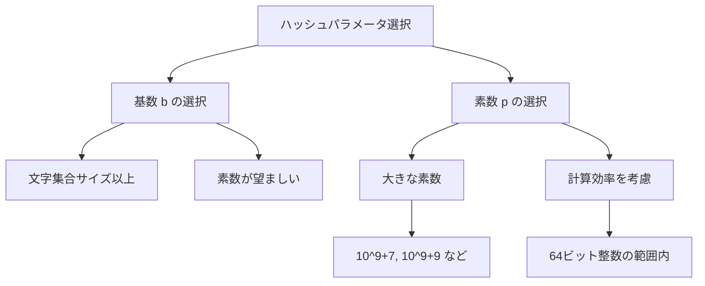
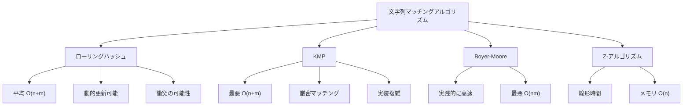

# ローリングハッシュ

ローリングハッシュは、文字列のハッシュ値を効率的に更新しながら計算する技法であり、特に文字列マッチングや重複検出において重要な役割を果たす。この技法の本質は、ウィンドウをスライドさせながら部分文字列のハッシュ値を$O(1)$時間で更新できる点にある。Rabin-Karpアルゴリズム[^1]の中核技術として知られているが、その応用範囲は文字列マッチングにとどまらない。

## 数学的基礎

ローリングハッシュの基本的なアイデアは、文字列を多項式として解釈し、その値を計算することにある。長さ$n$の文字列$S = s_0s_1...s_{n-1}$に対して、基数$b$を用いたハッシュ値$H(S)$は次のように定義される：

$$H(S) = \sum_{i=0}^{n-1} s_i \cdot b^{n-1-i} \mod p$$

ここで、$s_i$は文字$s_i$に対応する数値（通常はASCIIコードや文字のインデックス）、$p$は大きな素数である。この定義は、文字列を$b$進数として解釈し、その値を素数$p$で割った余りを取ることに相当する。


この多項式表現の重要な性質は、隣接する部分文字列間でハッシュ値を効率的に更新できることである。文字列$S$の位置$i$から始まる長さ$m$の部分文字列を$S[i:i+m]$と表記すると、$S[i:i+m]$から$S[i+1:i+m+1]$へのハッシュ値の更新は次の式で計算できる：

$$H(S[i+1:i+m+1]) = (H(S[i:i+m]) - s_i \cdot b^{m-1}) \cdot b + s_{i+m} \mod p$$

この更新式の導出を理解することが、ローリングハッシュの本質を把握する鍵となる。$H(S[i:i+m])$は次のように展開できる：

$$H(S[i:i+m]) = s_i \cdot b^{m-1} + s_{i+1} \cdot b^{m-2} + ... + s_{i+m-1} \cdot b^0$$

一方、$H(S[i+1:i+m+1])$は：

$$H(S[i+1:i+m+1]) = s_{i+1} \cdot b^{m-1} + s_{i+2} \cdot b^{m-2} + ... + s_{i+m} \cdot b^0$$

前者から最初の項$s_i \cdot b^{m-1}$を引き、全体を$b$倍して、最後に$s_{i+m}$を加えることで後者が得られる。

## 実装における重要な考慮事項

### モジュロ演算の扱い

実装において最も注意を要するのは、モジュロ演算の扱いである。減算を含む更新式では、中間結果が負になる可能性がある。C++やJavaなどの言語では、負の数に対するモジュロ演算の結果も負になるため、適切な処理が必要となる。

```cpp
// Safe modulo operation
inline long long safe_mod(long long x, long long mod) {
    return ((x % mod) + mod) % mod;
}
```

この問題を回避する別のアプローチとして、減算の代わりに加算を使用する方法がある。$-s_i \cdot b^{m-1}$の代わりに$(p - s_i \cdot b^{m-1} \mod p)$を加算することで、常に非負の値を保つことができる。

### 基数と素数の選択

ハッシュ関数の性能は、基数$b$と素数$p$の選択に大きく依存する。理論的には、$b$は文字集合のサイズ以上であれば任意の値を選択できるが、実践的には以下の指針に従うことが推奨される：

基数$b$の選択においては、文字集合のサイズを超える素数を選ぶことが一般的である。例えば、小文字のみを扱う場合でも、$b = 31$や$b = 37$といった値がよく使用される。これは、ハッシュ値の分散を改善し、衝突確率を低減する効果がある。

素数$p$の選択はより慎重に行う必要がある。64ビット整数の範囲内で扱える大きな素数として、$p = 10^9 + 7$や$p = 10^9 + 9$がよく使用される。これらの値は、計算効率と衝突確率のバランスが良い。より高い安全性が必要な場合は、複数の素数を用いた多重ハッシュを採用することもある。



## 衝突確率の理論的分析

ローリングハッシュにおける衝突確率の分析は、アルゴリズムの信頼性を評価する上で重要である。誕生日パラドックスに基づく分析により、$n$個の異なる文字列から2つを選んだときの衝突確率は、おおよそ$n^2 / (2p)$で近似できる[^2]。

より厳密には、$n$個の文字列すべてが異なるハッシュ値を持つ確率$P_{no\_collision}$は：

$$P_{no\_collision} = \prod_{i=0}^{n-1} \left(1 - \frac{i}{p}\right) \approx e^{-n^2/(2p)}$$

したがって、少なくとも1つの衝突が発生する確率は：

$$P_{collision} = 1 - P_{no\_collision} \approx 1 - e^{-n^2/(2p)}$$

この式から、例えば$p = 10^9 + 7$を使用し、$n = 10^5$個の文字列を扱う場合、衝突確率は約0.005（0.5%）となる。競技プログラミングの文脈では、この程度の衝突確率は多くの場合許容範囲内である。

しかし、より高い信頼性が必要な場合、複数のハッシュ関数を組み合わせる多重ハッシュが有効である。独立な$k$個のハッシュ関数を使用した場合、すべてのハッシュ値が一致する確率は$1/p^k$となり、衝突確率を劇的に減少させることができる。

## オーバーフロー対策と最適化

### 乗算のオーバーフロー

ローリングハッシュの実装において、$b^{m-1}$の計算や更新式における乗算でオーバーフローが発生する可能性がある。64ビット整数を使用する場合でも、$b \cdot H$の計算で容易にオーバーフローが起こる。

この問題に対する一般的な解決策は、各演算後に明示的にモジュロを取ることである：

```cpp
hash = ((hash * base) % mod + char_value) % mod;
```

しかし、モジュロ演算は除算を含むため計算コストが高い。より効率的なアプローチとして、Mersenne素数（$2^k - 1$の形の素数）を使用する方法がある。例えば、$p = 2^{61} - 1$を使用すると、モジュロ演算をビット演算で実装できる[^3]。

### 前計算による高速化

文字列の複数の部分に対してハッシュ値を計算する場合、$b^i$の値を前計算しておくことで効率を改善できる。特に、文字列全体の累積ハッシュを計算しておけば、任意の部分文字列のハッシュ値を$O(1)$で取得できる。

長さ$n$の文字列$S$に対して、累積ハッシュ配列$h[0..n]$を次のように定義する：

$$h[i] = H(S[0:i]) = \sum_{j=0}^{i-1} s_j \cdot b^{i-1-j} \mod p$$

このとき、部分文字列$S[l:r]$のハッシュ値は：

$$H(S[l:r]) = (h[r] - h[l] \cdot b^{r-l}) \mod p$$

で計算できる。この手法により、前処理$O(n)$の後、任意の部分文字列のハッシュ値を$O(1)$で取得できる。

## 他のアルゴリズムとの比較

文字列マッチングアルゴリズムの選択は、問題の特性と要求される性能特性に依存する。ローリングハッシュベースのRabin-Karpアルゴリズムと他の主要なアルゴリズムを比較すると、それぞれに明確なトレードオフが存在する。

KMP（Knuth-Morris-Pratt）アルゴリズム[^4]は、最悪計算量$O(n + m)$を保証し、衝突の可能性がないという利点がある。しかし、前処理で失敗関数を構築する必要があり、実装がローリングハッシュより複雑である。また、複数パターンの同時検索には適していない。

Boyer-Mooreアルゴリズム[^5]は、実践的には非常に高速で、特に長いパターンに対して効果的である。パターンの後ろから照合を行い、不一致時に大きくスキップできるため、平均的な性能は優れている。しかし、最悪計算量は$O(nm)$であり、前処理も複雑である。

Z-アルゴリズム[^6]は、線形時間で文字列の各位置から始まる最長共通接頭辞を計算する。厳密なマッチングが保証され、実装も比較的シンプルだが、メモリ使用量が$O(n)$必要で、動的な更新には適していない。



ローリングハッシュの独自の強みは、その柔軟性と拡張性にある。部分文字列の比較、パターンの動的な変更、複数パターンの同時検索など、様々な応用に対応できる。また、2次元パターンマッチングへの拡張も自然に行える。

## 実装の詳細と最適化技法

### キャッシュ効率を考慮した実装

現代のプロセッサアーキテクチャでは、キャッシュ効率がアルゴリズムの実行速度に大きな影響を与える。ローリングハッシュの実装においても、メモリアクセスパターンを最適化することで性能を向上させることができる。

累積ハッシュを使用する場合、連続したメモリ領域にデータを配置することで、キャッシュミスを減少させられる。また、複数の文字列を処理する際は、データの局所性を保つようにアクセス順序を工夫することが重要である。

### SIMD命令を活用した並列化

最新のCPUが提供するSIMD（Single Instruction, Multiple Data）命令を活用することで、複数の文字列に対するハッシュ計算を並列化できる。特に、AVX2やAVX-512などの拡張命令セットを使用すると、4つまたは8つの文字列のハッシュ値を同時に計算できる。

ただし、モジュロ演算の並列化は複雑であるため、実装には工夫が必要である。一つのアプローチは、計算を遅延させ、バッチ処理でモジュロを取る方法である。

### 適応的パラメータ選択

問題の特性に応じて、ハッシュパラメータを動的に選択する戦略も有効である。例えば、文字列の長さや文字集合のサイズに基づいて、最適な基数と素数を選択できる。

短い文字列に対しては小さな素数でも十分な場合が多く、計算効率を優先できる。一方、長い文字列や大量の比較が必要な場合は、より大きな素数や多重ハッシュを採用することで信頼性を高められる。

## 誤り検出と対策

ローリングハッシュを使用する際の最大の課題は、ハッシュ衝突による誤検出である。実用的なシステムでは、この問題に対する適切な対策が必要となる。

### 多重ハッシュによる信頼性向上

最も一般的な対策は、異なるパラメータを持つ複数のハッシュ関数を併用することである。2つの独立なハッシュ関数を使用した場合、偶然の一致確率は$1/(p_1 \cdot p_2)$となる。

```cpp
struct DoubleHash {
    static constexpr long long MOD1 = 1000000007;
    static constexpr long long MOD2 = 1000000009;
    static constexpr long long BASE1 = 31;
    static constexpr long long BASE2 = 37;
    
    long long hash1, hash2;
    
    bool operator==(const DoubleHash& other) const {
        return hash1 == other.hash1 && hash2 == other.hash2;
    }
};
```

### 検証機構の実装

衝突が許容できない場合は、ハッシュ値の一致後に実際の文字列比較を行う検証機構を実装する。これにより、ローリングハッシュを高速なフィルタとして使用し、候補を絞り込んだ後で厳密な比較を行うことができる。

この手法は、Bloom filterの原理に似ており、偽陽性は存在するが偽陰性は発生しない。したがって、マッチングの見逃しは起こらないが、稀に不要な文字列比較が発生する可能性がある。

## 高度な応用と拡張

### 2次元ローリングハッシュ

ローリングハッシュの概念は、2次元パターンマッチングに自然に拡張できる。$m \times n$の2次元配列に対して、各行にローリングハッシュを適用し、その結果に対して列方向にも同様の処理を行うことで、任意の矩形領域のハッシュ値を効率的に計算できる。

2次元の場合、更新式はより複雑になるが、基本的な原理は1次元の場合と同じである。行方向と列方向で異なる基数を使用することで、ハッシュ値の分散を改善できる。

### 編集距離の近似計算

ローリングハッシュを使用して、編集距離の近似値を高速に計算する手法も研究されている[^7]。完全一致ではなく、ある程度の誤差を許容する類似文字列検索において有用である。

基本的なアイデアは、文字列を固定長のチャンクに分割し、各チャンクのハッシュ値を比較することで、大まかな類似度を推定するものである。この手法は、大規模なテキストコーパスでの類似文書検索などに応用されている。

### ストリーミングアルゴリズムへの応用

ローリングハッシュは、データストリームの処理においても重要な役割を果たす。固定サイズのウィンドウでストリームを監視し、特定のパターンの出現を検出する問題では、ローリングハッシュが自然な解決策となる。

ネットワーク侵入検知システムやリアルタイムログ分析など、大量のデータを効率的に処理する必要がある分野で広く活用されている。

## 実装上の落とし穴と回避策

### 文字エンコーディングの問題

実装において見落とされがちな問題の一つが、文字エンコーディングの扱いである。UTF-8などのマルチバイト文字を扱う場合、単純にバイト単位でハッシュを計算すると、文字の境界を正しく認識できない可能性がある。

この問題を回避するためには、文字単位でハッシュを計算するか、あるいはバイト列として扱う場合は文字境界を意識した実装が必要となる。特に、部分文字列の抽出時には注意が必要である。

### 数値精度の問題

浮動小数点数を使用したローリングハッシュの実装も理論的には可能だが、数値精度の問題により推奨されない。整数演算のみを使用し、オーバーフローを適切に処理することが、信頼性の高い実装の鍵となる。

### メモリアライメント

高性能な実装を目指す場合、メモリアライメントも考慮する必要がある。特に、SIMD命令を使用する場合は、データが適切にアラインされていることが性能に大きく影響する。

## パフォーマンスチューニング

### ベンチマークと最適化

ローリングハッシュの性能は、実装の詳細に大きく依存する。効果的な最適化を行うためには、実際の使用パターンに基づいたベンチマークが不可欠である。

プロファイリングツールを使用して、ボトルネックを特定することが重要である。多くの場合、モジュロ演算や乗算がボトルネックとなるため、これらの操作を最適化することで大幅な性能向上が期待できる。

### コンパイラ最適化の活用

現代のコンパイラは、多くの最適化機能を提供している。インライン展開、ループアンローリング、ベクトル化などの最適化を有効にすることで、追加のコード変更なしに性能を向上させることができる。

特に、GCCやClangの`-O3`オプションや、特定のターゲットアーキテクチャ向けの最適化フラグを使用することで、大幅な性能向上が期待できる。

## 理論的限界と今後の研究方向

ローリングハッシュの理論的限界は、主に衝突確率とトレードオフの関係にある。完全にランダムなハッシュ関数を仮定しても、誕生日パラドックスにより、衝突確率を任意に小さくするには、ハッシュ値の空間を指数関数的に大きくする必要がある。

最近の研究では、暗号学的ハッシュ関数の技術を応用して、より強力な衝突耐性を持つローリングハッシュの設計が試みられている[^8]。また、量子コンピューティングの文脈では、Groverのアルゴリズムを使用した高速な文字列検索の可能性も探求されている。

機械学習との融合も興味深い研究方向である。学習されたハッシュ関数を使用することで、特定のデータ分布に対して最適化されたローリングハッシュを設計できる可能性がある。

[^1]: Karp, R. M., & Rabin, M. O. (1987). Efficient randomized pattern-matching algorithms. IBM Journal of Research and Development, 31(2), 249-260.

[^2]: Motwani, R., & Raghavan, P. (1995). Randomized algorithms. Cambridge University Press.

[^3]: Lemire, D., & Kaser, O. (2010). Recursive n-gram hashing is pairwise independent, at best. Computer Speech & Language, 24(4), 698-710.

[^4]: Knuth, D. E., Morris Jr, J. H., & Pratt, V. R. (1977). Fast pattern matching in strings. SIAM Journal on Computing, 6(2), 323-350.

[^5]: Boyer, R. S., & Moore, J. S. (1977). A fast string searching algorithm. Communications of the ACM, 20(10), 762-772.

[^6]: Gusfield, D. (1997). Algorithms on strings, trees, and sequences: computer science and computational biology. Cambridge University Press.

[^7]: Burkhardt, S., & Kärkkäinen, J. (2003). Fast lightweight suffix array construction and checking. In Annual Symposium on Combinatorial Pattern Matching (pp. 55-69). Springer.

[^8]: Pagh, R., & Rodler, F. F. (2004). Cuckoo hashing. Journal of Algorithms, 51(2), 122-144.