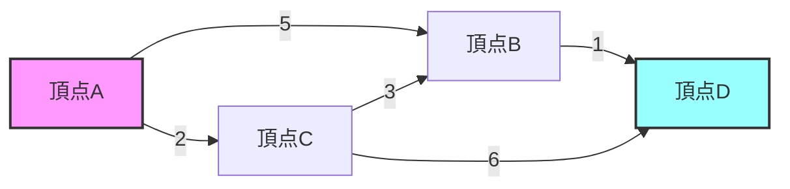
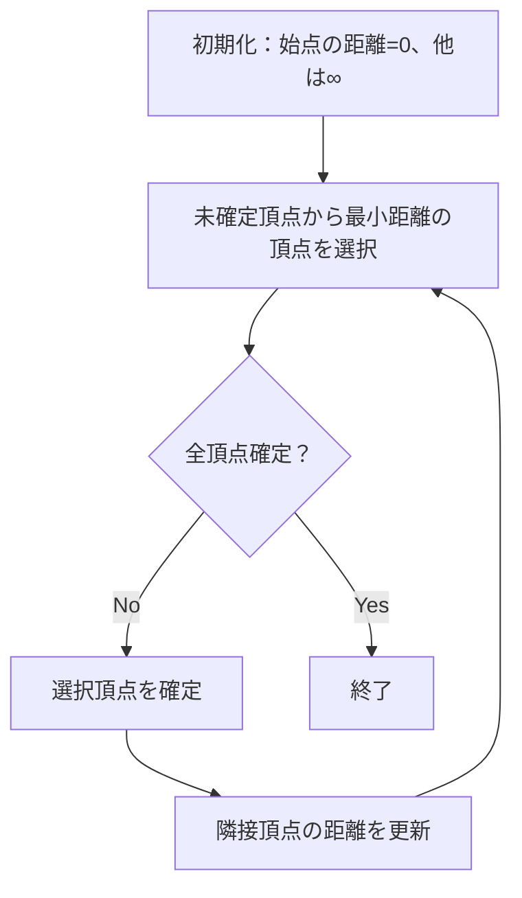
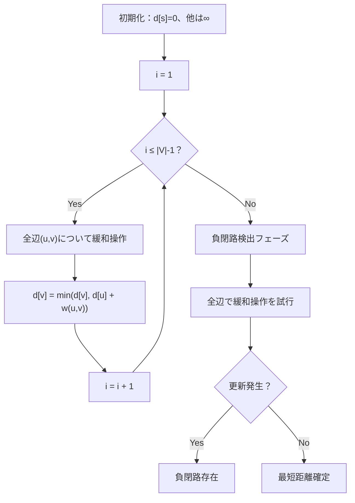
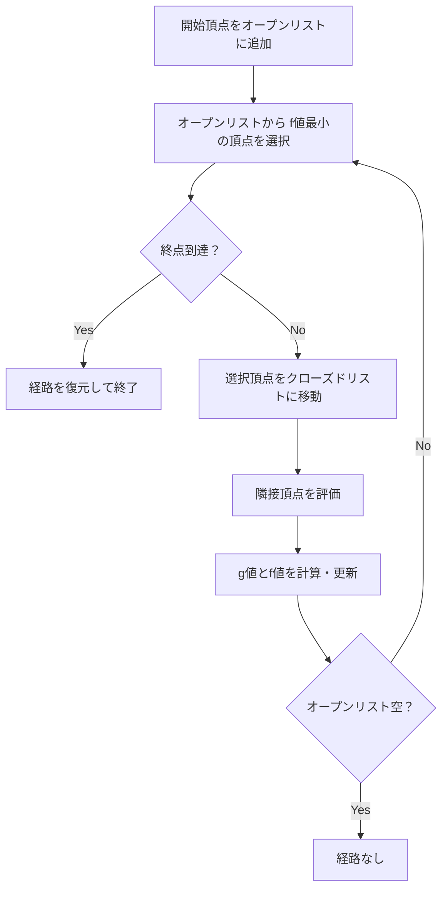

# 最短経路問題

最短経路問題は、グラフ理論における最も基本的かつ重要な問題の一つである。与えられたグラフにおいて、ある頂点から別の頂点への経路のうち、辺の重みの総和が最小となるものを求める問題として定式化される。この問題は、カーナビゲーションシステムでの経路探索、ネットワークルーティング、都市計画における交通網設計など、現実世界の多くの場面で応用されている。

最短経路問題の歴史は古く、1956年にEdsger W. Dijkstraが提案したDijkstra法[^1]は、今日でも最も広く使用されているアルゴリズムの一つである。その後、負の重みを持つ辺を扱えるBellman-Ford法[^2]、全点対最短経路を求めるWarshall-Floyd法[^3]など、様々なアルゴリズムが開発されてきた。

[^1]: Dijkstra, E. W. (1959). "A note on two problems in connexion with graphs". Numerische Mathematik. 1: 269–271.
[^2]: Bellman, Richard (1958). "On a routing problem". Quarterly of Applied Mathematics. 16: 87–90.
[^3]: Floyd, Robert W. (1962). "Algorithm 97: Shortest Path". Communications of the ACM. 5 (6): 345.

## 問題の定式化

重み付きグラフ $G = (V, E, w)$ において、$V$ は頂点集合、$E$ は辺集合、$w: E \rightarrow \mathbb{R}$ は各辺に実数の重みを割り当てる関数である。頂点 $s$ から頂点 $t$ への経路 $P = (v_0, v_1, ..., v_k)$ （ただし $v_0 = s$、$v_k = t$、$(v_i, v_{i+1}) \in E$）の重みは、経路上の辺の重みの総和 $\sum_{i=0}^{k-1} w(v_i, v_{i+1})$ で定義される。最短経路問題は、この重みを最小化する経路を見つけることである。



上図の例では、頂点Aから頂点Dへの経路として、A→B→D（重み6）、A→C→B→D（重み6）、A→C→D（重み8）などが存在する。この場合、A→B→DとA→C→B→Dが最短経路となる。

最短経路問題は、扱う対象によっていくつかのバリエーションに分類される。単一始点最短経路問題は、特定の始点から他のすべての頂点への最短経路を求める問題である。単一終点最短経路問題は、すべての頂点から特定の終点への最短経路を求める問題であり、辺の向きを逆にすることで単一始点問題に帰着できる。単一頂点対最短経路問題は、特定の2頂点間の最短経路のみを求める問題である。全点対最短経路問題は、すべての頂点対間の最短経路を求める問題である。

## Dijkstra法

Dijkstra法は、非負の重みを持つグラフにおける単一始点最短経路問題を解く効率的なアルゴリズムである。このアルゴリズムは貪欲法の一種であり、始点から各頂点への暫定的な最短距離を保持し、確定した頂点から隣接する頂点への距離を更新することを繰り返す。

アルゴリズムの基本的な動作原理は以下の通りである。まず、始点の距離を0、他のすべての頂点の距離を無限大で初期化する。次に、未確定の頂点の中から距離が最小のものを選び、その頂点を確定する。確定した頂点から隣接する未確定の頂点への距離を更新する。これをすべての頂点が確定するまで繰り返す。



Dijkstra法の正当性は、以下の不変条件に基づいている。確定した頂点への距離は、実際の最短距離である。未確定の頂点への暫定距離は、確定した頂点のみを経由する最短距離である。この不変条件は、非負の重みという前提の下で帰納的に証明できる。

実装において重要なのは、未確定頂点の中から最小距離の頂点を効率的に選択することである。単純な実装では、各ステップで全頂点を走査するため $O(V^2)$ の計算量となる。しかし、優先度付きキュー（ヒープ）を使用することで、この操作を $O(\log V)$ で実行でき、全体の計算量を $O((V + E) \log V)$ に改善できる。

```python
import heapq
from typing import List, Tuple, Dict

def dijkstra(graph: Dict[int, List[Tuple[int, int]]], start: int) -> Dict[int, int]:
    """
    Dijkstra's algorithm implementation
    graph: adjacency list where graph[u] = [(v, weight), ...]
    start: starting vertex
    returns: dictionary of shortest distances from start to each vertex
    """
    distances = {vertex: float('infinity') for vertex in graph}
    distances[start] = 0
    pq = [(0, start)]  # (distance, vertex)
    
    while pq:
        current_distance, u = heapq.heappop(pq)
        
        if current_distance > distances[u]:
            continue
            
        for v, weight in graph[u]:
            distance = current_distance + weight
            
            if distance < distances[v]:
                distances[v] = distance
                heapq.heappush(pq, (distance, v))
    
    return distances
```

Dijkstra法の重要な制約は、負の重みを持つ辺が存在する場合には正しく動作しないことである。これは、一度確定した頂点への距離が、後から負の重みを経由することでより小さくなる可能性があるためである。

## Bellman-Ford法

Bellman-Ford法は、負の重みを持つ辺が存在するグラフでも動作する単一始点最短経路アルゴリズムである。さらに、負の閉路（重みの総和が負となる閉路）の検出も可能である。このアルゴリズムは動的計画法の原理に基づいており、最短経路の部分構造性を利用している。

アルゴリズムの核心は、最短経路の辺数に関する帰納的な構造である。始点から任意の頂点への最短経路は、高々 $|V| - 1$ 本の辺を含む。なぜなら、それ以上の辺を含む経路は必ず頂点を重複して訪問することになり、負の閉路が存在しない限り、その重複部分を除去することでより短い経路が得られるからである。

Bellman-Ford法は、この性質を利用して $|V| - 1$ 回の緩和操作を行う。各イテレーションで、すべての辺について距離の更新を試みる。$k$ 回目のイテレーション後には、高々 $k$ 本の辺を使用する最短経路が求まっている。



計算量は $O(VE)$ であり、Dijkstra法より一般に遅い。しかし、負の重みを扱える汎用性と、実装の単純さから、多くの場面で有用である。特に、制約付き最短経路問題や、差分制約系の解法において重要な役割を果たす。

負の閉路検出は、$|V|$ 回目の緩和操作で距離が更新されるかどうかで判定できる。負の閉路が存在しない場合、$|V| - 1$ 回の緩和で最短距離が確定するため、それ以降の更新は発生しないはずである。

```python
def bellman_ford(edges: List[Tuple[int, int, int]], n: int, start: int) -> Tuple[bool, List[int]]:
    """
    Bellman-Ford algorithm implementation
    edges: list of (u, v, weight)
    n: number of vertices
    start: starting vertex
    returns: (has_negative_cycle, distances)
    """
    distances = [float('infinity')] * n
    distances[start] = 0
    
    # Relax edges n-1 times
    for _ in range(n - 1):
        for u, v, weight in edges:
            if distances[u] != float('infinity') and distances[u] + weight < distances[v]:
                distances[v] = distances[u] + weight
    
    # Check for negative cycles
    for u, v, weight in edges:
        if distances[u] != float('infinity') and distances[u] + weight < distances[v]:
            return True, distances  # Negative cycle exists
    
    return False, distances
```

## Warshall-Floyd法

Warshall-Floyd法は、全点対最短経路問題を解く動的計画法アルゴリズムである。このアルゴリズムの美しさは、その単純さと理論的な明快さにある。3重ループという極めて簡潔な実装で、すべての頂点対間の最短距離を求めることができる。

アルゴリズムの基本的なアイデアは、中継頂点を段階的に増やしていくことである。$d[i][j][k]$ を「頂点 $0$ から $k-1$ までを中継頂点として使用可能な場合の、頂点 $i$ から頂点 $j$ への最短距離」と定義する。このとき、以下の漸化式が成立する：

$$d[i][j][k] = \min(d[i][j][k-1], d[i][k][k-1] + d[k][j][k-1])$$

この式は、頂点 $k$ を経由する場合としない場合の最小値を取ることを意味している。実装では、3次元配列を2次元配列に圧縮できることが知られており、メモリ効率の良い実装が可能である。

```python
def floyd_warshall(n: int, edges: List[Tuple[int, int, int]]) -> List[List[int]]:
    """
    Floyd-Warshall algorithm implementation
    n: number of vertices
    edges: list of (u, v, weight)
    returns: 2D array of shortest distances
    """
    INF = float('infinity')
    dist = [[INF] * n for _ in range(n)]
    
    # Initialize distances
    for i in range(n):
        dist[i][i] = 0
    for u, v, w in edges:
        dist[u][v] = min(dist[u][v], w)
    
    # Dynamic programming
    for k in range(n):
        for i in range(n):
            for j in range(n):
                dist[i][j] = min(dist[i][j], dist[i][k] + dist[k][j])
    
    return dist
```

計算量は $O(V^3)$ であり、密グラフでは効率的である。また、経路復元も容易に実装でき、中継頂点を記録する補助配列を用いることで、任意の頂点対間の最短経路を再構築できる。

Warshall-Floyd法の重要な応用として、推移閉包の計算がある。これは、グラフの到達可能性を表す行列を求める問題であり、重みを考慮しない場合のWarshall-Floyd法として実装できる。

## A*アルゴリズム

A*アルゴリズムは、ヒューリスティック関数を用いてDijkstra法を改良したものである。目的地への推定距離（ヒューリスティック値）を利用することで、探索空間を効果的に削減し、実用的な場面でより高速に最短経路を発見できる。

A*の核心は、評価関数 $f(n) = g(n) + h(n)$ である。ここで、$g(n)$ は始点から頂点 $n$ までの実際の距離、$h(n)$ は頂点 $n$ から終点までの推定距離（ヒューリスティック値）である。アルゴリズムは、この評価関数が最小となる頂点を優先的に探索する。



ヒューリスティック関数が許容的（admissible）である場合、つまり実際の距離を過大評価しない場合、A*は最適解を保証する。2次元格子グラフにおける典型的なヒューリスティック関数として、マンハッタン距離やユークリッド距離がある。

```python
import heapq
from typing import Callable, Dict, List, Tuple, Optional

def a_star(graph: Dict[int, List[Tuple[int, int]]], 
          start: int, 
          goal: int,
          heuristic: Callable[[int], float]) -> Optional[Tuple[float, List[int]]]:
    """
    A* algorithm implementation
    returns: (distance, path) or None if no path exists
    """
    open_set = [(0 + heuristic(start), 0, start, [start])]
    closed_set = set()
    g_score = {start: 0}
    
    while open_set:
        f, g, current, path = heapq.heappop(open_set)
        
        if current == goal:
            return g, path
            
        if current in closed_set:
            continue
            
        closed_set.add(current)
        
        for neighbor, weight in graph.get(current, []):
            if neighbor in closed_set:
                continue
                
            tentative_g = g + weight
            
            if neighbor not in g_score or tentative_g < g_score[neighbor]:
                g_score[neighbor] = tentative_g
                f_score = tentative_g + heuristic(neighbor)
                heapq.heappush(open_set, (f_score, tentative_g, neighbor, path + [neighbor]))
    
    return None
```

A*の性能は、ヒューリスティック関数の質に大きく依存する。理想的なヒューリスティック関数は、実際の最短距離に近い値を返すものである。しかし、計算コストとのトレードオフがあり、実用的には単純で高速に計算できるヒューリスティックが選ばれることが多い。

## 実装上の考慮事項

最短経路アルゴリズムの実装において、いくつかの重要な考慮事項がある。まず、グラフの表現方法の選択が性能に大きく影響する。隣接行列は全点対最短経路問題に適しており、Warshall-Floyd法との相性が良い。一方、隣接リストは疎グラフに対して効率的であり、DijkstraやBellman-Ford法に適している。

優先度付きキューの実装も重要である。標準ライブラリのヒープ実装を使用する場合、同じ頂点が複数回キューに入る可能性がある。これを防ぐために、訪問済みフラグを使用するか、decrease-key操作をサポートするFibonacciヒープを使用する方法がある。実用的には、重複を許容し、取り出し時にチェックする実装が多い。

数値的な問題も考慮する必要がある。浮動小数点数を重みとして扱う場合、丸め誤差が累積する可能性がある。特に、経路の比較において誤差が問題となることがある。可能な限り整数演算を使用し、必要に応じて適切なイプシロン値を設定することが推奨される。

メモリ使用量の最適化も重要である。大規模なグラフを扱う場合、全点対最短経路の結果を保存するには $O(V^2)$ のメモリが必要となる。必要に応じて、オンデマンドで計算する方式や、結果を圧縮する手法を検討する必要がある。

## アルゴリズムの選択指針

最短経路問題を解く際のアルゴリズム選択は、問題の特性に応じて行う必要がある。グラフのサイズ、辺の重みの性質、求める解の種類などを考慮して、適切なアルゴリズムを選択することが重要である。

単一始点最短経路問題において、すべての辺の重みが非負である場合は、Dijkstra法が最も効率的である。特に、疎グラフに対してはヒープを用いた実装が有効である。負の重みが存在する場合は、Bellman-Ford法を使用する。ただし、負の閉路の存在を事前に確認できる場合は、より効率的な手法を検討できる。

全点対最短経路問題では、グラフの密度が重要な判断基準となる。密グラフ（$|E| = O(V^2)$）の場合は、Warshall-Floyd法が単純で効率的である。疎グラフの場合は、各頂点からDijkstra法を実行する方が効率的なことがある。この場合の計算量は $O(V(V + E) \log V)$ となる。

特定の2点間の最短経路のみが必要な場合、双方向探索やA*アルゴリズムが有効である。特に、地理的な情報など良質なヒューリスティックが利用できる場合、A*は大幅な高速化を実現できる。

動的なグラフ、つまり辺の追加や削除が頻繁に発生する場合は、全体を再計算するのではなく、差分更新が可能なアルゴリズムを検討する必要がある。動的最短経路問題は活発な研究分野であり、様々な手法が提案されている。

## 高度な話題

最短経路問題には、基本的な定式化を超えた様々な拡張が存在する。k-最短経路問題は、最短経路だけでなく、2番目、3番目に短い経路も求める問題である。Yen's algorithm[^4]やEppstein's algorithm[^5]などが知られている。

[^4]: Yen, Jin Y. (1971). "Finding the k shortest loopless paths in a network". Management Science. 17 (11): 712–716.
[^5]: Eppstein, David (1998). "Finding the k shortest paths". SIAM Journal on Computing. 28 (2): 652–673.

制約付き最短経路問題では、経路に追加の制約が課される。例えば、経路の長さ（辺数）に上限がある場合や、特定の頂点を必ず通る場合などがある。これらの問題は、通常の最短経路問題より計算複雑性が高く、動的計画法や整数計画法を用いて解かれることが多い。

並列・分散アルゴリズムも重要な研究分野である。Delta-stepping algorithm[^6]は、Dijkstra法を並列化したもので、GPUなどの並列計算環境で高い性能を発揮する。グラフを複数の計算ノードに分割して処理する分散アルゴリズムも、大規模グラフの処理に不可欠である。

[^6]: Meyer, U., & Sanders, P. (2003). "Δ-stepping: a parallelizable shortest path algorithm". Journal of Algorithms. 49 (1): 114–152.

実用的な観点から、前処理を用いた高速化手法も重要である。Contraction Hierarchies[^7]やHub Labeling[^8]などの手法は、道路ネットワークなどの実用的なグラフに対して、ミリ秒単位での最短経路クエリを可能にする。

[^7]: Geisberger, R., Sanders, P., Schultes, D., & Delling, D. (2008). "Contraction hierarchies: Faster and simpler hierarchical routing in road networks". International Workshop on Experimental and Efficient Algorithms. Springer.
[^8]: Abraham, I., Delling, D., Goldberg, A. V., & Werneck, R. F. (2011). "A hub-based labeling algorithm for shortest paths in road networks". International Symposium on Experimental Algorithms. Springer.

量子アルゴリズムの文脈では、Groverの探索アルゴリズムを応用した量子最短経路アルゴリズムが提案されている。理論的には、特定の条件下で古典アルゴリズムを上回る性能が期待されるが、実用的な量子コンピュータでの実装はまだ研究段階にある。

最短経路問題は、グラフ理論とアルゴリズム設計の交差点に位置する豊かな研究分野である。基本的なアルゴリズムの深い理解から始まり、問題の特性に応じた適切な手法の選択、そして最新の研究成果の応用まで、エンジニアには幅広い知識と洞察が求められる。本稿で述べた各アルゴリズムは、それぞれ異なる強みと適用範囲を持っており、実際の問題解決においては、これらを適切に組み合わせることが重要である。