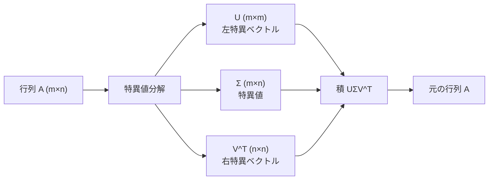
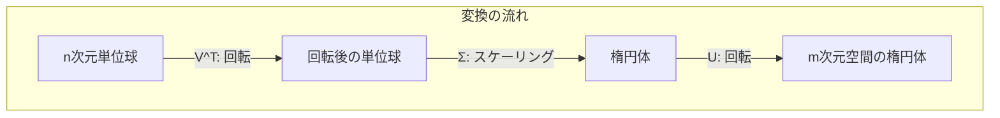
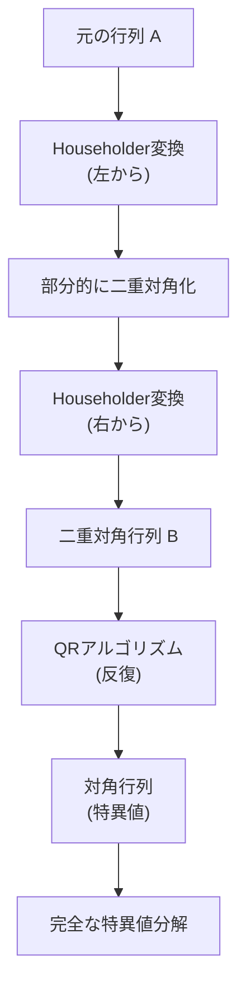
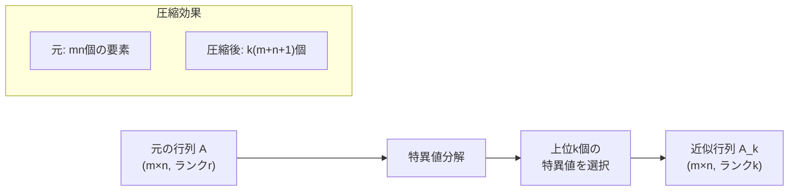

# 特異値分解

特異値分解（Singular Value Decomposition, SVD）は、任意の実数行列や複素数行列を3つの行列の積に分解する線形代数の基本的な行列分解手法である。固有値分解が正方行列に対してのみ定義されるのに対し、特異値分解は任意のサイズの行列に適用可能であることが大きな特徴となっている。競技プログラミングにおいては、主成分分析、低ランク近似、擬似逆行列の計算などの場面で活用される。

特異値分解の理論的な重要性は、それが行列の本質的な構造を明らかにすることにある。任意の $m \times n$ 行列 $A$ は、3つの特別な性質を持つ行列の積として表現できる。この分解は一意に定まり、行列のランク、条件数、擬似逆行列など、多くの重要な性質を効率的に計算する手段を提供する。

## 数学的定義と基本性質

任意の $m \times n$ 実数行列 $A$ に対して、以下のような分解が存在する：

$$A = U\Sigma V^T$$

ここで、$U$ は $m \times m$ の直交行列、$V$ は $n \times n$ の直交行列、$\Sigma$ は $m \times n$ の対角行列である。$\Sigma$ の対角成分 $\sigma_1 \geq \sigma_2 \geq \cdots \geq \sigma_r > 0$ を特異値と呼び、$r$ は行列 $A$ のランクである。直交行列の性質から $U^TU = I_m$、$V^TV = I_n$ が成り立つ。

特異値分解の存在性と一意性は、行列論の基本定理の一つである。任意の行列に対して特異値分解が存在することは、$A^TA$ と $AA^T$ が半正定値対称行列であることから導かれる。これらの行列の固有値は非負実数であり、その平方根が特異値となる。

## 幾何学的解釈

特異値分解は、線形変換の幾何学的な構造を明らかにする。$m \times n$ 行列 $A$ による線形変換 $x \mapsto Ax$ は、以下の3つの変換の合成として理解できる：

1. **$V^T$ による回転**：$n$ 次元空間における回転または反転
2. **$\Sigma$ によるスケーリング**：各軸方向への伸縮
3. **$U$ による回転**：$m$ 次元空間における回転または反転

この解釈により、任意の線形変換は「回転→スケーリング→回転」という単純な操作の組み合わせとして表現できることがわかる。特に、$n$ 次元単位球は、この変換により $m$ 次元空間の楕円体に写像される。この楕円体の主軸の長さが特異値に対応する。

## 特異値と特異ベクトルの計算

特異値分解を計算する基本的なアプローチは、$A^TA$ と $AA^T$ の固有値問題に帰着させることである。具体的には：

$$A^TA = V\Sigma^T\Sigma V^T$$
$$AA^T = U\Sigma\Sigma^T U^T$$

ここで、$\Sigma^T\Sigma$ は $n \times n$ の対角行列であり、その対角成分は $\sigma_i^2$ である。同様に、$\Sigma\Sigma^T$ は $m \times m$ の対角行列となる。したがって、$V$ の列ベクトルは $A^TA$ の固有ベクトル、$U$ の列ベクトルは $AA^T$ の固有ベクトルとなる。

実際の数値計算では、この直接的なアプローチは数値的に不安定である。$A^TA$ の条件数は $A$ の条件数の2乗となるため、誤差が増幅される。そのため、実用的なアルゴリズムでは、行列を直接扱う手法が採用される。

## Golub-Kahan二段階アルゴリズム

現代的な特異値分解アルゴリズムの標準は、Golub-Kahanによる二段階アルゴリズムである[^1]。このアルゴリズムは以下の2つのステップから構成される：

[^1]: Golub, G. H., & Kahan, W. (1965). "Calculating the singular values and pseudo-inverse of a matrix". Journal of the Society for Industrial and Applied Mathematics, Series B: Numerical Analysis, 2(2), 205-224.

### 第1段階：二重対角化

Householder変換を用いて、行列 $A$ を二重対角行列 $B$ に変換する：

$$A = P_1BP_2^T$$

ここで、$P_1$ と $P_2$ は直交行列である。二重対角行列とは、主対角成分と第一優対角成分のみが非零の行列である。この変換は $O(mn^2)$ の計算量で実行できる。

### 第2段階：二重対角行列の特異値分解

二重対角行列 $B$ に対して、QRアルゴリズムの変種を適用し、対角行列に収束させる。このプロセスでは、Givens回転を用いて非対角成分を徐々に小さくしていく。収束後、対角成分が特異値となる。

## 数値的安定性と計算精度

特異値分解の数値計算において重要な考慮事項は、アルゴリズムの数値的安定性である。特に小さな特異値の計算では、丸め誤差の影響が顕著になる。IEEE倍精度浮動小数点数を使用する場合、相対誤差は通常 $O(\epsilon \kappa(A))$ 程度となる。ここで、$\epsilon$ は機械精度（約 $2.2 \times 10^{-16}$）、$\kappa(A) = \sigma_{\max}/\sigma_{\min}$ は条件数である。

数値的な安定性を確保するために、以下の技術が用いられる：

**シフト戦略**：QRアルゴリズムの収束を加速するため、適切なシフトを選択する。Wilkinsonシフトが標準的に使用される。これは、末尾の $2 \times 2$ 部分行列の固有値に基づいてシフト量を決定する方法である。

**デフレーション**：収束した特異値を分離し、問題のサイズを段階的に縮小する。特異値が十分小さくなった場合や、優対角成分が機械精度以下になった場合に、行列を分割する。

**暗黙的QRステップ**：明示的にQR分解を計算する代わりに、Givens回転の列として暗黙的に実行する。これにより、数値的安定性が向上し、計算量も削減される。

## 擬似逆行列と最小二乗問題

特異値分解の重要な応用の一つは、擬似逆行列（Moore-Penrose逆行列）の計算である。行列 $A$ の擬似逆行列 $A^+$ は、特異値分解を用いて以下のように表現される：

$$A^+ = V\Sigma^+ U^T$$

ここで、$\Sigma^+$ は $\Sigma$ の擬似逆行列であり、非零の特異値の逆数を対角成分とする $n \times m$ 行列である。擬似逆行列は、過決定系や劣決定系の線形方程式 $Ax = b$ の最小二乗解を与える：

$$x = A^+b$$

この解は、$\|Ax - b\|_2$ を最小化し、かつその中で $\|x\|_2$ が最小となる唯一の解である。

競技プログラミングにおいて、最小二乗問題は回帰分析、曲線フィッティング、信号処理などの文脈で現れる。特異値分解を用いることで、数値的に安定した解法が得られる。特に、条件数が大きい（ill-conditioned）問題では、通常の正規方程式 $(A^TA)x = A^Tb$ を解く方法よりも優れている。

## 低ランク近似と圧縮

特異値分解のもう一つの重要な応用は、行列の低ランク近似である。Eckart-Youngの定理[^2]によれば、ランク $k$ の行列による最良近似は、最大の $k$ 個の特異値に対応する成分のみを保持することで得られる：

[^2]: Eckart, C., & Young, G. (1936). "The approximation of one matrix by another of lower rank". Psychometrika, 1(3), 211-218.

$$A_k = \sum_{i=1}^k \sigma_i u_i v_i^T$$

ここで、$u_i$ と $v_i$ はそれぞれ $U$ と $V$ の $i$ 番目の列ベクトルである。この近似の誤差は、Frobenius ノルムおよびスペクトルノルムの両方で最小となる：

$$\|A - A_k\|_F = \sqrt{\sum_{i=k+1}^r \sigma_i^2}$$
$$\|A - A_k\|_2 = \sigma_{k+1}$$

この性質は、データ圧縮、ノイズ除去、次元削減などに広く応用される。競技プログラミングでは、大規模な行列を扱う問題において、メモリ使用量を削減しながら近似的な計算を行う手法として有用である。

## 主成分分析との関係

主成分分析（Principal Component Analysis, PCA）は、特異値分解と密接に関連している。データ行列 $X$ （各行がサンプル、各列が特徴量）に対して、中心化した行列 $\tilde{X} = X - \bar{X}$ の特異値分解を考える：

$$\tilde{X} = U\Sigma V^T$$

このとき、$V$ の列ベクトルが主成分方向、$U\Sigma$ の列ベクトルが主成分スコアとなる。分散共分散行列 $C = \frac{1}{n-1}\tilde{X}^T\tilde{X}$ の固有ベクトルは $V$ の列ベクトルと一致し、固有値は $\frac{\sigma_i^2}{n-1}$ となる。

競技プログラミングにおいて、PCAは高次元データの可視化、特徴抽出、異常検知などの問題で使用される。特異値分解を用いることで、共分散行列を明示的に計算することなく、数値的に安定した方法でPCAを実行できる。

## 実装上の考慮事項

競技プログラミングにおいて特異値分解を実装する際には、以下の点を考慮する必要がある：

**計算量とメモリ使用量**：完全な特異値分解の計算量は $O(\min(m^2n, mn^2))$ である。大規模な行列に対しては、必要な特異値・特異ベクトルのみを計算する部分的な分解を検討すべきである。Arnoldi法やLanczos法などの反復法を用いることで、最大の数個の特異値のみを効率的に計算できる。

**疎行列への対応**：疎行列に対しては、密行列用のアルゴリズムは非効率である。ARPACK[^3]などの疎行列用ライブラリでは、行列-ベクトル積のみを用いて特異値を計算する手法が実装されている。

[^3]: Lehoucq, R. B., Sorensen, D. C., & Yang, C. (1998). "ARPACK users' guide: solution of large-scale eigenvalue problems with implicitly restarted Arnoldi methods". SIAM.

**並列化**：特異値分解の各段階は並列化可能である。特に、Householder変換や行列積の計算は、BLASレベル3の演算として効率的に並列実行できる。競技プログラミングの制約下では単一スレッドでの実行が前提となることが多いが、SIMD命令を活用した最適化は可能である。

## 特殊な構造を持つ行列

特定の構造を持つ行列に対しては、より効率的な特異値分解アルゴリズムが存在する：

**対称行列**：実対称行列の特異値分解は、固有値分解と本質的に同じである。特異値は固有値の絶対値となり、特異ベクトルは固有ベクトルから構成される。対称性を利用することで、計算量を約半分に削減できる。

**帯行列**：帯幅が小さい帯行列に対しては、二重対角化の過程で帯構造が保存される。これにより、メモリ使用量と計算量の両方を大幅に削減できる。

**Hankel行列・Toeplitz行列**：これらの構造行列に対しては、高速アルゴリズムが開発されている。FFTを用いることで、$O(n^2 \log n)$ の計算量で近似的な特異値分解を計算できる。

## 数値例による理解

具体的な数値例を通じて、特異値分解の挙動を理解することは重要である。以下の $3 \times 2$ 行列を考える：

$$A = \begin{pmatrix}
1 & 2 \\
3 & 4 \\
5 & 6
\end{pmatrix}$$

この行列の特異値分解は：

$$U \approx \begin{pmatrix}
-0.2298 & 0.8835 & 0.4082 \\
-0.5247 & 0.2408 & -0.8165 \\
-0.8196 & -0.4019 & 0.4082
\end{pmatrix}$$

$$\Sigma \approx \begin{pmatrix}
9.5255 & 0 \\
0 & 0.5143 \\
0 & 0
\end{pmatrix}$$

$$V \approx \begin{pmatrix}
-0.6196 & -0.7849 \\
-0.7849 & 0.6196
\end{pmatrix}$$

特異値 $\sigma_1 \approx 9.5255$ と $\sigma_2 \approx 0.5143$ の比は約18.5であり、この行列が数値的にランク1に近いことを示している。実際、ランク1近似 $A_1 = \sigma_1 u_1 v_1^T$ は元の行列を良く近似する。

## 計算の検証とデバッグ

特異値分解の実装をデバッグする際には、以下の性質を検証することが有用である：

**直交性の確認**：$U^TU = I$ および $V^TV = I$ が数値精度の範囲内で成立することを確認する。

**再構成誤差**：$\|A - U\Sigma V^T\|_F$ が機械精度のオーダーであることを確認する。

**特異値の非負性と降順**：$\sigma_1 \geq \sigma_2 \geq \cdots \geq 0$ が成立することを確認する。

**ランクの一致**：非零特異値の個数が、ガウス消去法などで計算したランクと一致することを確認する。

## 安定性解析と誤差評価

特異値分解の数値的安定性は、後退誤差解析により理論的に保証されている。計算された分解 $\hat{U}\hat{\Sigma}\hat{V}^T$ に対して、以下が成立する：

$$\hat{U}\hat{\Sigma}\hat{V}^T = A + E$$

ここで、誤差行列 $E$ は $\|E\|_F \leq c\epsilon\|A\|_F$ を満たす。定数 $c$ は問題のサイズに依存するが、通常は $O(mn)$ 程度である。

個々の特異値の相対誤差は、その大きさと周囲の特異値との間隔に依存する。大きな特異値ほど相対誤差が小さく、クラスター化した特異値は個別には正確に計算できない可能性がある。しかし、クラスター全体としての不変部分空間は正確に計算される。

## 拡張と一般化

特異値分解の概念は、様々な方向に拡張されている：

**一般化特異値分解（GSVD）**：2つの行列 $A$ と $B$ の同時分解であり、正則化問題や制約付き最小二乗問題に応用される。

**高階特異値分解（HOSVD）**：テンソル（多次元配列）への拡張であり、各モードに対する直交変換の組み合わせとして定義される。

**複素特異値分解**：複素行列に対しては、転置の代わりにエルミート共役を用いる。基本的な性質と計算手法は実数の場合と同様である。

これらの拡張は、より複雑な問題設定において特異値分解の概念を適用することを可能にする。競技プログラミングでは、多次元データの解析や複素信号処理の問題で活用される可能性がある。

特異値分解は、線形代数の中核的な技術として、理論と実践の両面で重要な役割を果たしている。その幾何学的な直観、数値的な安定性、幅広い応用可能性により、競技プログラミングにおいても強力なツールとなる。効率的な実装と適切な応用により、複雑な問題を優雅に解決することができる。