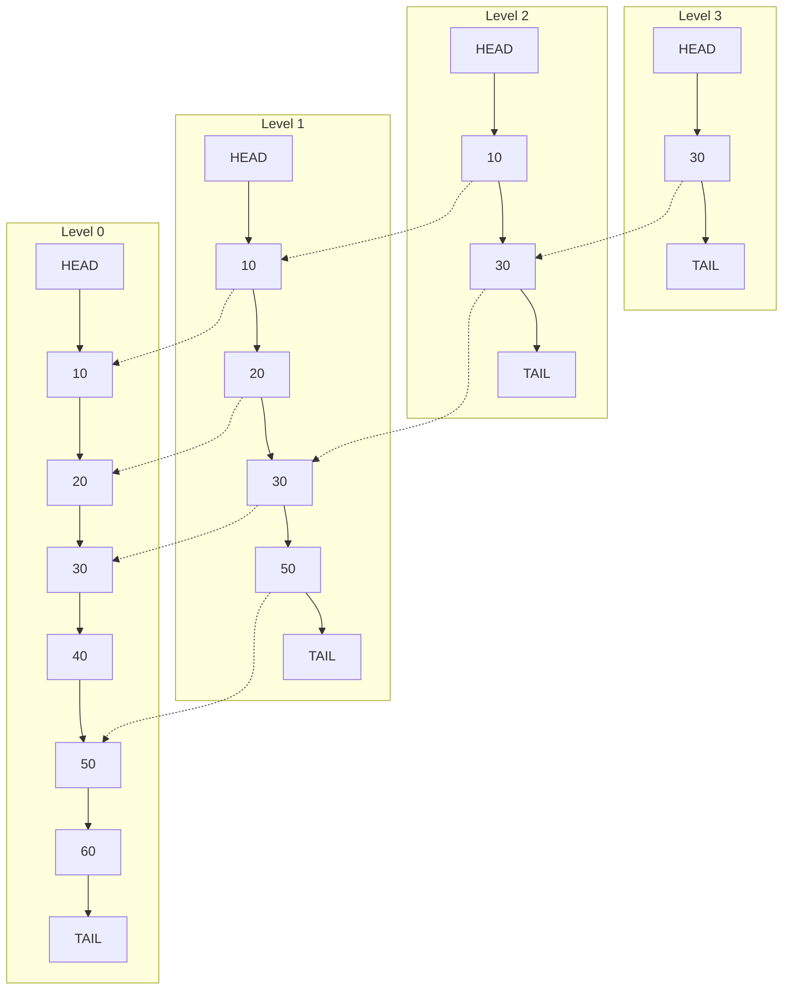
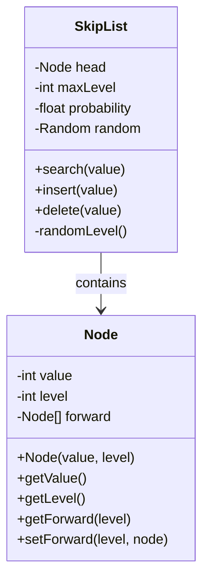
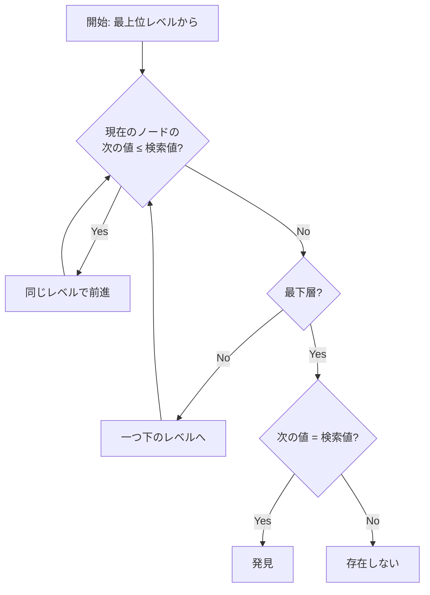
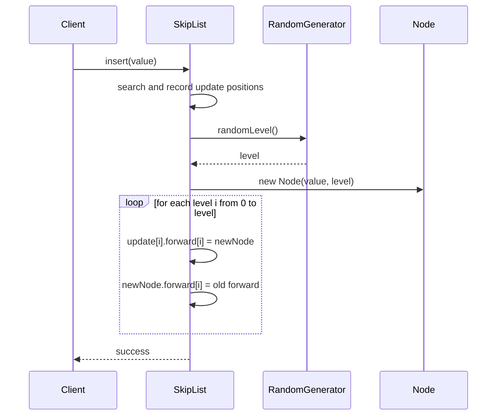
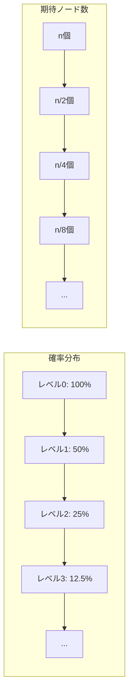

# スキップリスト

スキップリストは、1990年にWilliam Pughによって考案された確率的データ構造である[^1]。この構造は、ソート済みのデータに対して期待計算量O(log n)での検索、挿入、削除を実現する。従来の平衡木（AVL木や赤黒木など）と同等の性能を持ちながら、実装が著しく単純であることが最大の特徴といえる。平衡木が複雑な回転操作や色の管理を必要とするのに対し、スキップリストは確率的な手法によって期待的にバランスを保つため、実装の複雑さが大幅に軽減される。



スキップリストの基本的な着想は、通常の連結リストに「エクスプレスレーン」を追加することにある。最下層（レベル0）には全ての要素が存在し、上位レベルになるほど要素数が減少していく。各要素は確率的に上位レベルに昇格し、これによって長距離を高速に移動できる経路が形成される。検索時には最上位レベルから開始し、目的の要素に近づくにつれて下位レベルに降りていくことで、効率的な探索が可能となる。

## データ構造の詳細

スキップリストの各ノードは、保持する値とレベル数、そして各レベルにおける次のノードへのポインタ配列を持つ。レベルは0から始まり、レベルiのノードはレベル0からレベルiまでの全てのレベルに存在する。各レベルは独立したソート済み連結リストを形成し、上位レベルは下位レベルの部分集合となる。



ノードのレベル決定は確率的に行われる。一般的には確率p（通常0.5または0.25）を用いて、レベルiのノードがレベルi+1にも存在する確率をpとする。この確率分布により、レベルkに存在するノード数の期待値はn×p^kとなる。pが0.5の場合、各レベルのノード数は期待的に半分ずつ減少していく。

レベル決定アルゴリズムは幾何分布に従う。具体的には、コインを投げて表が出続ける限りレベルを増やし、裏が出た時点でそのレベルに決定する。これにより、レベルkが選ばれる確率は(1-p)×p^kとなる。最大レベルは通常log_{1/p}(n)に制限され、メモリ使用量の上限を保証する。

## 検索アルゴリズム

スキップリストの検索は、最上位レベルから開始して段階的に下位レベルに降りていく過程として実装される。各レベルでは、検索対象より大きい値に到達するまで前進し、そこで一つ下のレベルに移動する。この動作を最下層まで繰り返すことで、目的の要素またはその直前の要素に到達する。



検索の計算量解析において重要なのは、各レベルで前進するステップ数の期待値である。確率pでノードが上位レベルに存在する場合、レベルiで前進する期待ステップ数は1/pとなる。全体のレベル数が期待的にlog_{1/p}(n)であることから、検索の期待計算量はO(log n)となる。

検索経路の記録は、後続の挿入・削除操作において重要な役割を果たす。各レベルで下降する直前のノードを配列に保存することで、新しいノードの挿入位置や削除時の接続更新を効率的に行うことができる。この更新配列は、検索操作の副産物として自然に得られる。

## 挿入アルゴリズム

挿入操作は、まず通常の検索を実行して挿入位置を特定することから始まる。検索過程で各レベルの更新位置を記録し、新しいノードのレベルを確率的に決定する。その後、決定されたレベル以下の全てのレベルにおいて、記録された更新位置から新しいノードへのリンクを張り替える。



新しいノードのレベルが現在の最大レベルを超える場合、スキップリストの高さを拡張する必要がある。この際、新しく追加されたレベルのヘッドノードから新しいノードへの直接リンクが設定される。最大レベルの管理は、スキップリスト全体の構造を保つ上で重要な要素となる。

挿入操作の期待計算量もO(log n)である。これは、検索にO(log n)、レベル決定にO(1)、リンクの更新に期待的にO(log n)の時間がかかることによる。リンク更新の計算量が対数的である理由は、新しいノードのレベルが期待的にO(log n)に制限されるためである。

## 削除アルゴリズム

削除操作は挿入操作と対称的な構造を持つ。まず削除対象のノードを検索し、各レベルでの更新位置を記録する。対象ノードが見つかった場合、そのノードが存在する全てのレベルにおいてリンクを更新し、前のノードを次のノードに直接接続する。

削除後の処理として、最上位レベルが空になった場合はスキップリストの高さを減少させる。これにより、不要なレベルの走査を避け、性能を維持することができる。ただし、高さの減少は必須ではなく、実装によっては省略されることもある。

## 確率的解析と性能保証

スキップリストの性能は確率的に保証される。n個の要素を持つスキップリストにおいて、高さがc×log_{1/p}(n)を超える確率は1/n^{c-1}となる。これは、極めて高い確率で対数的な高さが維持されることを意味する。



空間計算量の期待値は、各ノードが期待的に1/(1-p)個のポインタを持つことから、O(n)となる。p=0.5の場合、各ノードは平均2個のポインタを持つ。これは平衡木の各ノードが持つポインタ数と同程度であり、空間効率の面でも競争力がある。

最悪計算量については、理論的にはO(n)となる可能性がある。これは、全てのノードが最大レベルを持つような極端なケースで発生する。しかし、このような状況が発生する確率は極めて低く、実用上は問題にならない。確率pを適切に選択することで、最悪ケースの発生確率を任意に小さくできる。

## 実装の詳細と最適化

実用的なスキップリストの実装では、いくつかの最適化技法が適用される。まず、センチネルノードの使用により境界条件の処理が簡略化される。ヘッドノードには最小値（通常は負の無限大）、テールノードには最大値（正の無限大）を設定することで、特殊ケースの処理を排除できる。

```cpp
template<typename T>
class SkipList {
private:
    struct Node {
        T value;
        std::vector<Node*> forward;
        
        Node(const T& val, int level) 
            : value(val), forward(level + 1, nullptr) {}
    };
    
    Node* head;
    int maxLevel;
    float probability;
    std::mt19937 generator;
    std::bernoulli_distribution distribution;
    
    int randomLevel() {
        int level = 0;
        while (distribution(generator) && level < maxLevel) {
            level++;
        }
        return level;
    }
    
public:
    SkipList(int maxLvl = 16, float p = 0.5) 
        : maxLevel(maxLvl), probability(p), 
          generator(std::random_device{}()), 
          distribution(p) {
        head = new Node(T{}, maxLevel);
    }
};
```

メモリアクセスパターンの最適化も重要な考慮事項である。スキップリストは本質的にポインタベースの構造であるため、キャッシュ性能が課題となる可能性がある。これを改善するため、小さなノードではポインタ配列を固定サイズにし、メモリアロケーションの回数を減らす実装が存在する。

並行性の観点から、スキップリストは優れた特性を持つ。読み取り操作は本質的にロックフリーで実装可能であり、書き込み操作も細粒度のロックで効率的に実装できる。各ノードのレベルごとにロックを取得することで、異なるレベルでの操作を並行して実行できる。

## 他のデータ構造との比較

平衡二分探索木（AVL木、赤黒木）と比較すると、スキップリストは実装の単純さにおいて明確な優位性を持つ。回転操作や色の管理が不要であり、バグの混入リスクが低い。性能面では理論的に同等のO(log n)を達成するが、定数項では若干劣る場合がある。

B木やB+木との比較では、スキップリストは外部記憶向けではないという違いがある。B木系のデータ構造はディスクアクセスを最小化するよう設計されているのに対し、スキップリストは主にメモリ上での使用を想定している。ただし、各レベルを別々のファイルとして管理することで、外部記憶向けの変種も提案されている。

ハッシュテーブルとの比較では、順序付けの有無が決定的な違いとなる。スキップリストは順序付きの操作（範囲検索、最小値・最大値の取得など）を効率的にサポートするが、ハッシュテーブルは順序を保持しない。一方、単純な検索・挿入・削除の期待計算量では、ハッシュテーブルのO(1)に対してスキップリストはO(log n)となる。

## 実践的な応用と変種

スキップリストは、その単純さと効率性から様々なシステムで採用されている。Redisのソート済みセット（ZSET）の実装[^2]、LevelDBやRocksDBでのMemTableの実装[^3]、Apache Luceneでの転置インデックスの実装など、実用的なシステムでの採用例は多い。

決定的スキップリストは、確率的な要素を排除した変種である。レベルの決定を値のハッシュ値などから決定的に行うことで、再現性のある動作を保証する。これは、分散システムでのレプリケーションやデバッグが容易になるという利点がある。

インデックス可能スキップリストは、各ノードがサブツリーのサイズ情報を保持することで、順序統計量（k番目の要素）へのアクセスをO(log n)で実現する。この拡張により、ランダムアクセスが必要なアプリケーションでも効率的に使用できる。

## 実装上の注意点とベストプラクティス

確率パラメータpの選択は、性能とメモリ使用量のトレードオフを決定する重要な要素である。p=0.5は最も一般的な選択であり、理論と実践のバランスが良い。p=0.25を使用すると、メモリ使用量は削減されるが、走査するノード数が増加する。実際のアプリケーションでは、データサイズとアクセスパターンに基づいて適切な値を選択する必要がある。

最大レベルの設定も重要である。理論的にはlog_{1/p}(n)で十分だが、nが事前に分からない場合は十分大きな値（32や64）を設定することが一般的である。ただし、過度に大きな値は無駄なメモリアロケーションにつながるため、適切なバランスが必要となる。

エラー処理とメモリ管理については、特に注意が必要である。ノードの削除時にはメモリリークを防ぐため、適切にメモリを解放する必要がある。また、挿入時のメモリアロケーション失敗に対する処理も実装する必要がある。C++では、スマートポインタを使用することでこれらの問題を軽減できる。

[^1]: Pugh, William (1990). "Skip Lists: A Probabilistic Alternative to Balanced Trees". Communications of the ACM. 33 (6): 668–676.

[^2]: Redis Documentation. "Redis Sorted Sets". https://redis.io/docs/data-types/sorted-sets/

[^3]: LevelDB Documentation. "Implementation Details". https://github.com/google/leveldb/blob/master/doc/impl.md