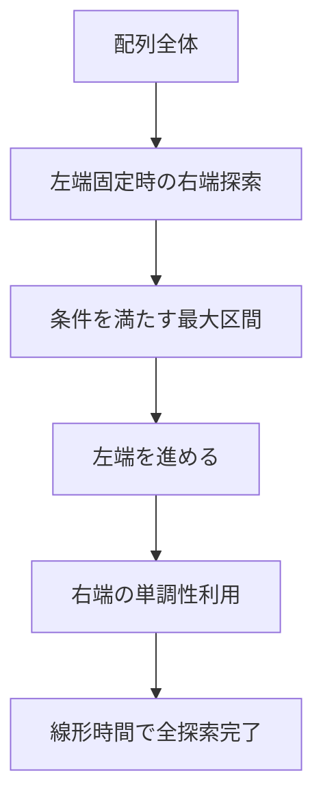
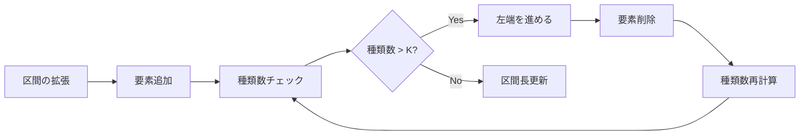
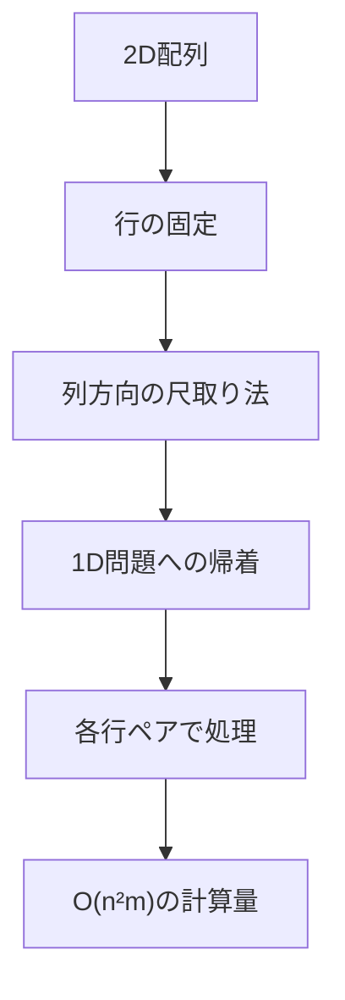

# 尺取り法

尺取り法（Two Pointers Technique、Sliding Window Algorithm）は、配列やシーケンスに対して連続する部分区間を効率的に探索するアルゴリズム技法である。日本の競技プログラミングコミュニティで「尺取り法」という名称が定着しているが、国際的にはTwo PointersやSliding Windowとして知られており、その本質は区間の左右の端点を適切に管理することで線形時間での探索を実現する点にある。

本稿では、尺取り法の理論的基礎から実装の詳細、そして実践的な応用まで、この技法を完全に理解し、実際の問題解決に適用できるようになることを目指して解説を展開する。特に、アルゴリズムが成立する数学的条件、実装上の注意点、そして様々な変種について詳しく議論する。

## アルゴリズムの本質と基本概念

尺取り法の核心は、ある種の単調性を持つ問題において、全ての可能な区間を愚直に調べる必要がないという観察に基づいている。長さnの配列に対して、全ての連続部分区間はO(n²)個存在するが、尺取り法を適用できる問題では、これらの区間を賢く枝刈りすることでO(n)時間での探索が可能となる。



このアルゴリズムが機能する根本的な理由は、「左端を右に移動させた際に、条件を満たす右端の位置が左に戻ることがない」という単調性にある。この性質により、各要素が左端・右端として高々1回ずつしか処理されないため、全体の計算量がO(n)に抑えられる。

より形式的に述べると、配列A[0..n-1]に対して、ある条件P(l, r)が与えられたとき、以下の性質が成り立つ場合に尺取り法が適用可能である：

1. **単調性**: l ≤ l' かつ P(l, r)が真ならば、P(l', r)も真である
2. **連続性**: P(l, r)が真かつP(l, r+1)が偽ならば、任意のr' > r+1に対してP(l, r')も偽である

これらの性質は、問題の構造に深く依存しており、尺取り法を適用する際にはまずこの単調性の存在を確認することが重要である。

## 典型的な問題パターンと数学的構造

尺取り法が適用可能な問題は、その数学的構造によっていくつかのパターンに分類できる。ここでは代表的なパターンを詳しく見ていく。

### 和の制約を持つ最長区間問題

最も基本的なパターンは、「区間和がK以下となる最長の連続部分配列を求める」という問題である。この問題では、区間和という累積的な性質と、非負整数という制約により、必要な単調性が保証される。

```python
def max_length_sum_constraint(arr, K):
    n = len(arr)
    left = 0
    current_sum = 0
    max_length = 0
    
    for right in range(n):
        current_sum += arr[right]
        
        while current_sum > K and left <= right:
            current_sum -= arr[left]
            left += 1
        
        max_length = max(max_length, right - left + 1)
    
    return max_length
```

この実装では、rightポインタが配列を一度走査し、各位置でleftポインタを必要な分だけ進めている。重要な観察は、leftポインタが後戻りしないことで、これにより全体の計算量がO(n)となる。

### 異なる要素数の制約

「K種類以下の異なる要素を含む最長区間」という問題も、尺取り法の典型的な適用例である。この場合、要素の種類数という離散的な量を管理する必要があり、実装にはハッシュマップなどのデータ構造を併用する。



この問題では、各要素の出現回数を管理することで、区間の拡張・縮小に伴う種類数の変化を効率的に追跡できる。

```python
def max_length_distinct_constraint(arr, K):
    n = len(arr)
    left = 0
    count = {}
    distinct = 0
    max_length = 0
    
    for right in range(n):
        if arr[right] not in count or count[arr[right]] == 0:
            distinct += 1
        count[arr[right]] = count.get(arr[right], 0) + 1
        
        while distinct > K:
            count[arr[left]] -= 1
            if count[arr[left]] == 0:
                distinct -= 1
            left += 1
        
        max_length = max(max_length, right - left + 1)
    
    return max_length
```

### 積の制約を持つ問題

区間内の要素の積に関する制約も、対数変換により和の問題に帰着できることが多い。ただし、0や負数の扱いには注意が必要であり、問題の制約条件を慎重に分析する必要がある。

## 実装技法と最適化

尺取り法の実装には、いくつかの重要な技法とパターンが存在する。これらを理解することで、より効率的で可読性の高い実装が可能となる。

### 区間情報の効率的な管理

区間の情報を管理する際、単純な変数だけでなく、より複雑なデータ構造が必要となる場合がある。例えば、区間内の最大値・最小値を管理する場合、スライディングウィンドウ最大値アルゴリズムと組み合わせることで効率的な実装が可能である。

```python
from collections import deque

def sliding_window_maximum(arr, condition):
    n = len(arr)
    left = 0
    dq = deque()  # monotonic deque for maximum
    result = []
    
    for right in range(n):
        # Add element to window
        while dq and arr[dq[-1]] <= arr[right]:
            dq.pop()
        dq.append(right)
        
        # Shrink window if needed
        while not condition(left, right, arr[dq[0]]):
            if dq[0] == left:
                dq.popleft()
            left += 1
        
        # Process valid window
        if left <= right:
            result.append((left, right, arr[dq[0]]))
    
    return result
```

この実装では、両端キュー（deque）を用いて区間内の最大値を効率的に管理している。各要素の追加・削除がamortized O(1)で行えるため、全体の計算量は依然としてO(n)である。

### 複数の制約の同時処理

実践的な問題では、複数の制約を同時に満たす必要がある場合が多い。このような場合、各制約の単調性を保ちながら、それらを統合的に処理する必要がある。

```python
def multi_constraint_sliding_window(arr, sum_limit, distinct_limit):
    n = len(arr)
    left = 0
    current_sum = 0
    count = {}
    distinct = 0
    max_length = 0
    
    for right in range(n):
        # Update sum constraint
        current_sum += arr[right]
        
        # Update distinct constraint
        if arr[right] not in count or count[arr[right]] == 0:
            distinct += 1
        count[arr[right]] = count.get(arr[right], 0) + 1
        
        # Shrink window to satisfy both constraints
        while left <= right and (current_sum > sum_limit or distinct > distinct_limit):
            current_sum -= arr[left]
            count[arr[left]] -= 1
            if count[arr[left]] == 0:
                distinct -= 1
            left += 1
        
        max_length = max(max_length, right - left + 1)
    
    return max_length
```

### 循環配列での尺取り法

配列が循環する場合、つまり最後の要素の次が最初の要素となる場合の尺取り法も重要な応用である。この場合、配列を2倍に拡張するか、モジュロ演算を適切に用いることで対応できる。

```python
def circular_sliding_window(arr, condition):
    n = len(arr)
    # Double the array to handle circular nature
    extended = arr + arr
    left = 0
    result = []
    
    for right in range(2 * n):
        # Skip if window spans more than n elements
        if right - left >= n:
            left = right - n + 1
        
        # Apply sliding window logic
        while not condition(left, right, extended):
            left += 1
        
        # Record valid windows that don't exceed array length
        if right - left < n:
            result.append((left % n, right % n))
    
    return result
```

## 高度な応用と変種

尺取り法の基本的な考え方は、より複雑な問題にも拡張できる。ここでは、いくつかの高度な応用例を見ていく。

### 二次元配列での尺取り法

二次元配列において、ある条件を満たす最大の部分矩形を求める問題では、尺取り法を入れ子にして適用することができる。ただし、単純な入れ子では計算量がO(n³)となるため、問題の性質に応じた工夫が必要である。



一つの効果的なアプローチは、行の範囲を固定し、その範囲内での列方向の問題を一次元の尺取り法で解くことである。

```python
def max_rectangle_sum_constraint(matrix, K):
    rows, cols = len(matrix), len(matrix[0])
    max_area = 0
    
    for top in range(rows):
        # Accumulate sums for each column
        col_sums = [0] * cols
        
        for bottom in range(top, rows):
            # Update column sums
            for c in range(cols):
                col_sums[c] += matrix[bottom][c]
            
            # Apply 1D sliding window on column sums
            left = 0
            current_sum = 0
            
            for right in range(cols):
                current_sum += col_sums[right]
                
                while current_sum > K and left <= right:
                    current_sum -= col_sums[left]
                    left += 1
                
                if current_sum <= K:
                    area = (bottom - top + 1) * (right - left + 1)
                    max_area = max(max_area, area)
    
    return max_area
```

### 確率的制約での尺取り法

確率や期待値に関する制約を持つ問題でも、適切な変換により尺取り法が適用できる場合がある。例えば、「区間内の要素の平均がμ以上」という条件は、各要素からμを引いた値の和が非負という条件に変換できる。

### 動的な配列での尺取り法

要素の追加や削除が発生する動的な配列に対しても、データ構造を工夫することで尺取り法の考え方を適用できる。平衡二分探索木やセグメント木を用いることで、動的な更新に対応しながら効率的な区間処理が可能となる。

## 計算量の詳細な分析

尺取り法の計算量がO(n)であることは直感的に理解できるが、より厳密な分析を行うことで、定数倍の最適化や実装の改善につながる洞察が得られる。

尺取り法の基本的な実装において、各要素は以下の操作を受ける：
1. rightポインタによる追加：各要素につき正確に1回
2. leftポインタによる削除：各要素につき最大1回

したがって、n個の要素に対して最大2n回の操作が行われ、各操作がO(1)で実行できる場合、全体の計算量はO(n)となる。

ただし、実際の計算量は区間情報の管理方法に大きく依存する。例えば：
- 単純な和の計算：O(1)の更新
- ハッシュマップを用いた要素管理：期待値O(1)、最悪O(n)
- 順序付き集合を用いた管理：O(log k)（kは区間内の要素数）

これらの追加的な計算量を考慮すると、実際の計算量は以下のようになる：

```
T(n) = O(n) × O(区間更新の計算量)
```

## 実装上の注意点とデバッグ技法

尺取り法の実装では、境界条件の扱いが特に重要である。よくある実装ミスとその対策を以下に示す。

### 空区間の扱い

leftポインタがrightポインタを追い越す可能性がある場合、空区間を適切に処理する必要がある。

```python
def safe_sliding_window(arr, condition):
    n = len(arr)
    left = 0
    
    for right in range(n):
        # Process element at right
        
        # Ensure left doesn't exceed right
        while left <= right and not condition(left, right):
            left += 1
        
        # Handle valid window (might be empty if left > right)
        if left <= right:
            process_window(left, right)
```

### 初期状態の設定

区間情報を管理する変数の初期化は、問題の性質に応じて慎重に行う必要がある。特に、最大値を求める問題では負の無限大、最小値を求める問題では正の無限大で初期化することが重要である。

### オーバーフローの回避

区間和や区間積を扱う際、数値のオーバーフローに注意が必要である。必要に応じて、より大きな整数型を使用するか、モジュロ演算を適用する。

```python
def sum_with_modulo(arr, K, MOD):
    n = len(arr)
    left = 0
    current_sum = 0
    count = 0
    
    for right in range(n):
        current_sum = (current_sum + arr[right]) % MOD
        
        while current_sum > K:
            current_sum = (current_sum - arr[left] + MOD) % MOD
            left += 1
        
        count = (count + right - left + 1) % MOD
    
    return count
```

## 他のアルゴリズムとの比較と使い分け

尺取り法は効率的なアルゴリズムであるが、すべての区間探索問題に適用できるわけではない。ここでは、関連するアルゴリズムとの比較を通じて、適切な使い分けについて議論する。

### 累積和との比較

累積和を用いた方法は、任意の区間和をO(1)で計算できるが、条件を満たす区間を全探索する場合はO(n²)の計算量が必要となる。尺取り法が適用できる問題では、この探索をO(n)に削減できる点が大きな利点である。

一方、累積和は以下の場合に有利である：
- 複数のクエリに対して区間和を答える必要がある場合
- 区間の選び方に単調性がない場合
- オフライン処理が可能な場合

### セグメント木との比較

セグメント木は、任意の区間に対する演算をO(log n)で実行できる汎用的なデータ構造である。尺取り法と比較すると：

**セグメント木の利点：**
- 任意の区間に対するクエリに対応可能
- 動的な更新に対応（点更新がO(log n)）
- より複雑な演算（最大値、最小値、GCDなど）に対応

**尺取り法の利点：**
- 実装が簡潔で理解しやすい
- 計算量の定数倍が小さい
- メモリ使用量がO(1)（追加のデータ構造を除く）

### 二分探索との組み合わせ

ある種の問題では、尺取り法と二分探索を組み合わせることで、より効率的な解法が得られる。例えば、「条件を満たす区間の中で、長さがちょうどKのものが存在するか」という問題では、Kを二分探索し、各Kに対して尺取り法で判定することができる。

```python
def exists_valid_window_of_length_k(arr, k, condition):
    n = len(arr)
    if k > n:
        return False
    
    # Initialize window of size k
    window_info = initialize_window(arr[:k])
    
    if condition(window_info):
        return True
    
    # Slide window
    for i in range(k, n):
        window_info = update_window(window_info, arr[i-k], arr[i])
        if condition(window_info):
            return True
    
    return False

def find_optimal_window_length(arr, condition):
    left, right = 1, len(arr)
    result = -1
    
    while left <= right:
        mid = (left + right) // 2
        if exists_valid_window_of_length_k(arr, mid, condition):
            result = mid
            left = mid + 1  # Try to find longer valid window
        else:
            right = mid - 1
    
    return result
```

## 実践的な問題への適用

尺取り法の理論を理解した上で、実際の問題解決にどのように適用するかを考察する。競技プログラミングや実務での応用において重要なのは、問題の本質を見抜き、尺取り法が適用可能かどうかを素早く判断することである。

### 問題の分析手順

1. **単調性の確認**: 左端を固定したとき、条件を満たす右端の範囲が連続区間になるか
2. **更新の効率性**: 区間の拡張・縮小に伴う情報更新がO(1)またはO(log n)で可能か
3. **制約の変換**: 複雑な条件を、単調性を持つ形に変換できるか

### パフォーマンスチューニング

実装したアルゴリズムの性能を最大化するため、以下の最適化技法が有効である：

1. **キャッシュ効率の向上**: 配列アクセスの局所性を高める
2. **条件分岐の削減**: ループ内の条件分岐を最小化
3. **データ構造の選択**: 問題に最適なデータ構造を選ぶ

```python
# Cache-friendly implementation
def optimized_sliding_window(arr, K):
    n = len(arr)
    if n == 0:
        return 0
    
    # Minimize boundary checks
    left = 0
    current_sum = 0
    max_length = 0
    
    # Process in blocks for better cache utilization
    block_size = 64  # Typical cache line size
    
    for block_start in range(0, n, block_size):
        block_end = min(block_start + block_size, n)
        
        for right in range(block_start, block_end):
            current_sum += arr[right]
            
            if current_sum > K:
                # Batch removal operations
                while current_sum > K and left <= right:
                    current_sum -= arr[left]
                    left += 1
            
            max_length = max(max_length, right - left + 1)
    
    return max_length
```

## 理論的な発展と一般化

尺取り法の概念は、より抽象的な設定にも一般化できる。グラフ上のパス、文字列のパターンマッチング、さらには連続最適化問題にも、同様の考え方が適用されることがある。

### グラフ上での尺取り法

木構造やDAG（有向非巡回グラフ）上で、パスに関する最適化問題を解く際、尺取り法の考え方を応用できる。例えば、木上の直径を求める問題や、パス上の重みの和に制約がある最長パスを求める問題などである。

### 多次元空間での拡張

k次元空間における矩形領域の探索にも、尺取り法の原理を拡張できる。ただし、次元が増えるごとに計算量は指数的に増加するため、問題の構造を利用した効率化が不可欠である。

### 連続最適化への応用

離散的な配列ではなく、連続関数に対しても同様の考え方が適用できる場合がある。単峰性を持つ関数の最適化や、制約付き最適化問題において、探索範囲を効率的に絞り込む手法として応用される。

## 実装例の詳細解説

最後に、より複雑な実装例を通じて、尺取り法の実践的な適用方法を詳しく見ていく。

### 複数の統計量を同時に管理する例

区間内の平均、分散、最頻値などを同時に管理しながら、複雑な条件を満たす区間を探索する実装例を示す。

```python
class SlidingWindowStatistics:
    def __init__(self):
        self.elements = []
        self.sum = 0
        self.sum_squares = 0
        self.frequency = {}
        self.max_freq = 0
        self.mode_count = 0
    
    def add_element(self, x):
        self.elements.append(x)
        self.sum += x
        self.sum_squares += x * x
        
        self.frequency[x] = self.frequency.get(x, 0) + 1
        if self.frequency[x] > self.max_freq:
            self.max_freq = self.frequency[x]
            self.mode_count = 1
        elif self.frequency[x] == self.max_freq:
            self.mode_count += 1
    
    def remove_element(self, x):
        self.elements.remove(x)
        self.sum -= x
        self.sum_squares -= x * x
        
        self.frequency[x] -= 1
        if self.frequency[x] == 0:
            del self.frequency[x]
        
        # Recalculate max frequency if needed
        if self.frequency.get(x, 0) + 1 == self.max_freq:
            self.mode_count -= 1
            if self.mode_count == 0:
                self.max_freq = max(self.frequency.values()) if self.frequency else 0
                self.mode_count = sum(1 for f in self.frequency.values() if f == self.max_freq)
    
    def get_mean(self):
        return self.sum / len(self.elements) if self.elements else 0
    
    def get_variance(self):
        if not self.elements:
            return 0
        mean = self.get_mean()
        return self.sum_squares / len(self.elements) - mean * mean
    
    def get_mode_frequency(self):
        return self.max_freq

def find_statistical_windows(arr, mean_threshold, variance_limit):
    n = len(arr)
    left = 0
    stats = SlidingWindowStatistics()
    valid_windows = []
    
    for right in range(n):
        stats.add_element(arr[right])
        
        while left <= right and (stats.get_variance() > variance_limit or 
                                 stats.get_mean() < mean_threshold):
            stats.remove_element(arr[left])
            left += 1
        
        if left <= right:
            valid_windows.append({
                'range': (left, right),
                'mean': stats.get_mean(),
                'variance': stats.get_variance(),
                'mode_freq': stats.get_mode_frequency()
            })
    
    return valid_windows
```

この実装は、複数の統計量を効率的に管理しながら、複雑な条件判定を行う例である。各操作の計算量を最小化するため、増分的な更新手法を採用している。

尺取り法は、その単純さと効率性から、多くの実践的な問題に適用できる強力なアルゴリズム技法である。本稿で解説した理論的基礎と実装技法を理解することで、読者は様々な問題に対して適切に尺取り法を適用し、効率的な解法を設計できるようになるだろう。重要なのは、問題の持つ単調性を見抜き、それを利用して探索空間を効果的に削減することである。この視点は、尺取り法に限らず、アルゴリズム設計全般において重要な考え方である。