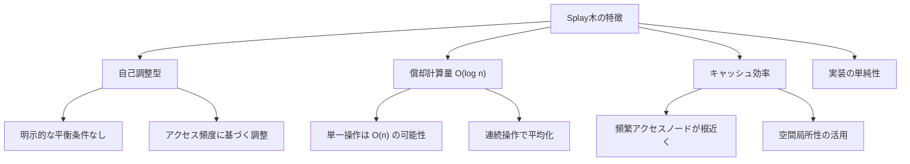
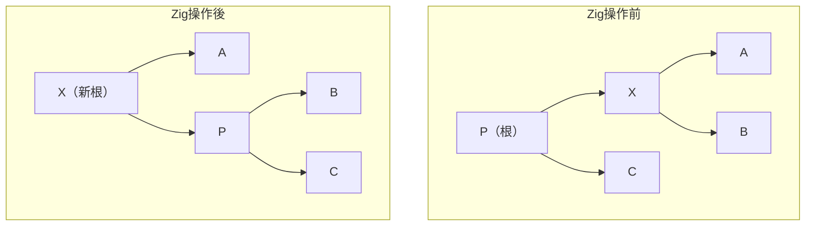
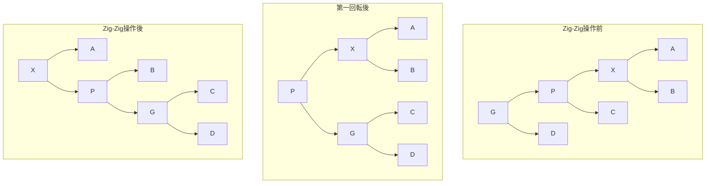
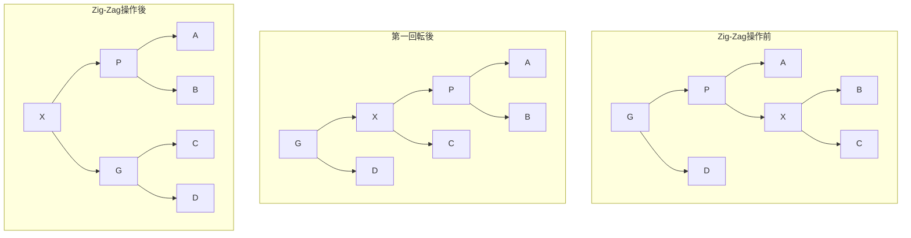
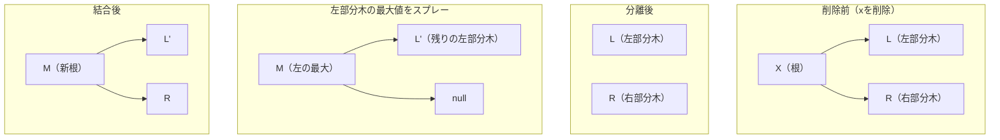
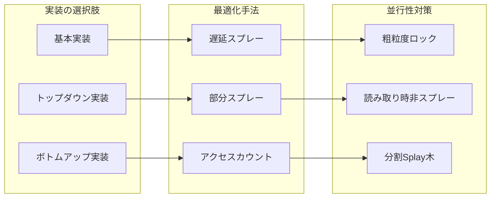
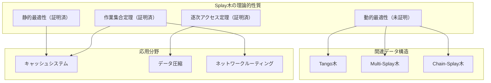

# Splay木

Splay木は、1985年にDaniel SleatorとRobert Tarjanによって考案された自己調整型の二分探索木データ構造である[^1]。この木構造の最大の特徴は、アクセスされたノードを木の根に移動させる「スプレー（splay）」操作により、頻繁にアクセスされるデータへの高速なアクセスを実現する点にある。通常の平衡二分探索木とは異なり、明示的な平衡条件を持たず、操作の償却計算量（amortized complexity）によって性能を保証する。

Splay木の設計思想は、実世界のアクセスパターンが局所性を持つという観察に基づいている。つまり、最近アクセスされたデータや頻繁にアクセスされるデータは、近い将来再びアクセスされる可能性が高い。この性質を利用して、アクセスされたノードを根に移動させることで、次回のアクセス時には高速にアクセスできるようになる。



## スプレー操作の基本原理

スプレー操作は、指定されたノードを木の根まで移動させる操作である。単純に親ノードと位置を交換し続ける方法も考えられるが、Splay木では特定のパターンに従った回転を組み合わせることで、木全体の深さを効果的に減少させる。この操作は、ノードxを根に移動させる過程で、xから根までのパス上のすべてのノードの深さをおよそ半分にする効果がある。

スプレー操作の核心は、ノードの位置関係に応じて3つの基本的な回転パターンを使い分ける点にある。これらのパターンは、zig、zig-zig、zig-zagと呼ばれ、それぞれ異なる構造変換を行う。重要な点は、これらの操作が単なる回転の組み合わせではなく、木の構造を根本的に再編成することで、将来のアクセス効率を向上させることである。

### Zig操作

Zig操作は、対象ノードxの親ノードが根である場合に適用される。これは通常の二分探索木における単一回転と同じ操作である。xが親の左子の場合は右回転、右子の場合は左回転を行う。この操作は、スプレー操作の最終段階で、xを根に配置するために使用される。



### Zig-Zig操作

Zig-zig操作は、ノードxとその親p、祖父母gが同じ方向に並んでいる場合（すべて左子または右子の関係）に適用される。この操作の特徴は、まず祖父母gに対してpを回転させ、次にpに対してxを回転させる点である。この順序は重要で、逆の順序で回転を行うと、木の深さの減少効果が得られない。



### Zig-Zag操作

Zig-zag操作は、ノードxが親pの右子で、pが祖父母gの左子である場合（またはその逆）に適用される。この操作では、まずpに対してxを回転させ、次にgに対してxを回転させる。結果として、xが元のgの位置に来ることになる。この操作は、AVL木やRed-Black木における二重回転に相当する。



## 基本操作の実装

Splay木における基本操作（検索、挿入、削除）は、すべてスプレー操作を中心に構築される。各操作の後には必ずスプレー操作を実行し、アクセスされたノードまたはその近傍のノードを根に移動させる。この一貫したアプローチにより、実装の単純性と性能の両立を実現している。

### 検索操作

検索操作は、通常の二分探索木と同様に目的のキーを持つノードを探索する。重要な違いは、検索が成功した場合はそのノードを、失敗した場合は最後にアクセスしたノード（検索が終了した葉ノードの親）をスプレーする点である。この動作により、同じキーへの連続したアクセスや、近い値へのアクセスが高速化される。

検索操作の擬似コードは以下のようになる：

```
function find(key):
    node = root
    last = null
    
    while node != null:
        last = node
        if key < node.key:
            node = node.left
        else if key > node.key:
            node = node.right
        else:
            splay(node)
            return node
    
    if last != null:
        splay(last)
    return null
```

### 挿入操作

挿入操作には主に2つのアプローチがある。第一のアプローチは、通常の二分探索木と同様に挿入を行い、その後新しいノードをスプレーする方法である。第二のアプローチは、より洗練された「トップダウン」方式で、まず挿入位置の親となるノードをスプレーし、その後新しいノードを根として挿入する方法である。

第二のアプローチの利点は、挿入後の木の構造がより予測可能であり、実装も効率的である点にある。具体的な手順は以下の通りである：

1. 挿入するキーに最も近いノードを検索し、そのノードをスプレーする
2. スプレー後の根のキーと挿入キーを比較する
3. 挿入キーが小さい場合、新しいノードを根とし、元の根を右子とする
4. 挿入キーが大きい場合、新しいノードを根とし、元の根を左子とする

この方法により、新しく挿入されたノードは自動的に根となり、最近挿入されたデータへの高速アクセスが保証される。

### 削除操作

削除操作もまた、スプレー操作を活用して効率的に実装される。基本的な手順は以下の通りである：

1. 削除対象のノードを検索し、スプレーして根に移動させる
2. 根を削除し、左部分木と右部分木に分離する
3. 左部分木で最大のノード（または右部分木で最小のノード）を見つけてスプレーする
4. スプレー後の左部分木の根の右子として、右部分木を接続する

この方法の優れた点は、削除操作後も木の構造が適切に調整され、削除位置周辺のノードへのアクセスが効率的に保たれることである。



## 償却解析と性能特性

Splay木の性能解析は、償却解析（amortized analysis）という手法を用いて行われる。単一の操作は最悪の場合O(n)の時間がかかる可能性があるが、m回の操作の総時間はO(m log n)であることが証明されている。この保証は、ポテンシャル法（potential method）を用いて厳密に証明される。

ポテンシャル関数Φは、木の各ノードxに対してランクr(x)を定義し、これらの和として定義される。ランクr(x)は、xを根とする部分木のサイズの対数として定義される：

$$r(x) = \log_2 |T_x|$$

ここで、$|T_x|$はxを根とする部分木のノード数である。木全体のポテンシャルは：

$$\Phi(T) = \sum_{x \in T} r(x)$$

スプレー操作の償却コストは、実際のコスト（回転数）とポテンシャルの変化の和として計算される。重要な補題として、ノードxをスプレーする償却コストは高々$3(r(root) - r(x)) + 1$であることが証明されている。

この解析から導かれる重要な性質として、以下のものがある：

1. **静的最適性**: 各要素へのアクセス頻度が既知の場合、Splay木は最適な静的二分探索木の定数倍以内の性能を示す
2. **動的最適性予想**: Splay木は、任意のアクセスシーケンスに対して、最適な動的二分探索木アルゴリズムの定数倍以内の性能を示すと予想されている（未証明）
3. **作業集合定理**: 最近アクセスされたk個の異なる要素の集合に対して、次のアクセスの償却時間はO(log k)である

## 実装上の考慮事項

Splay木の実装において注意すべき点がいくつか存在する。第一に、スプレー操作の実装では、回転の順序と方向を正確に制御する必要がある。特にzig-zig操作では、親を先に回転させることが重要で、これを誤ると性能保証が得られない。

メモリ管理の観点では、Splay木は追加のバランス情報を持たないため、各ノードは最小限のメモリ（キー、値、左右の子へのポインタ）で実装できる。これは、Red-Black木やAVL木と比較して、メモリ効率の面で有利である。

並行アクセスへの対応は、Splay木の大きな課題の一つである。スプレー操作は木全体の構造を大幅に変更するため、細粒度のロックでは効率的な並行制御が困難である。実用的なアプローチとしては、読み取り専用の操作ではスプレーを行わない、または木全体を複数の小さなSplay木に分割するなどの方法がある。



## 他のデータ構造との比較

Splay木を他の平衡二分探索木と比較すると、それぞれに固有の利点と欠点がある。AVL木は厳密な高さバランスを保証し、最悪計算量O(log n)を提供するが、回転操作が多く、実装が複雑である。Red-Black木は、AVL木よりも緩い平衡条件により、挿入・削除時の回転数を減らしているが、依然として追加のメモリ（色情報）が必要である。

B木やB+木は、ディスクベースのストレージシステムに最適化されており、ノードサイズをディスクブロックサイズに合わせることで、I/O効率を最大化する。一方、Splay木は主にメモリ上での使用を想定しており、キャッシュ効率とアクセスパターンへの適応性を重視している。

Treapは、優先度を用いたランダム化による平衡性を持つが、乱数生成のオーバーヘッドがある。Skip Listも同様にランダム化を用いるが、木構造ではなくリスト構造であるため、範囲検索などの操作で異なる特性を示す。

実際の選択は、アプリケーションの要求に依存する。アクセスパターンに偏りがある場合や、最近使用したデータへの高速アクセスが重要な場合は、Splay木が優れた選択となる。一方、最悪計算量の保証が必要な場合や、並行アクセスが頻繁な場合は、他のデータ構造がより適している可能性がある。

## 応用分野と実装例

Splay木は、その適応的な性質により、様々な実システムで活用されている。キャッシュシステムでは、LRU（Least Recently Used）ポリシーの実装にSplay木を使用することで、最近アクセスされた要素の管理を効率的に行える。データ圧縮アルゴリズムでは、動的ハフマン符号化においてSplay木を用いることで、データの統計的性質の変化に適応的に対応できる。

ネットワークルーティングテーブルの実装では、頻繁にアクセスされる経路情報を高速に検索できる利点がある。また、テキストエディタやIDEでのシンボルテーブル管理では、最近使用された変数や関数への高速アクセスを提供する。

実装例として、基本的なSplay木の核心部分を示す：

```cpp
struct Node {
    int key;
    Node *left, *right, *parent;
};

void rotate(Node* x) {
    Node* p = x->parent;
    Node* g = p->parent;
    
    if (p->left == x) {
        p->left = x->right;
        if (x->right) x->right->parent = p;
        x->right = p;
    } else {
        p->right = x->left;
        if (x->left) x->left->parent = p;
        x->left = p;
    }
    
    x->parent = g;
    p->parent = x;
    
    if (g) {
        if (g->left == p) g->left = x;
        else g->right = x;
    }
}

void splay(Node* x) {
    while (x->parent) {
        Node* p = x->parent;
        Node* g = p->parent;
        
        if (!g) {
            // Zig
            rotate(x);
        } else if ((g->left == p) == (p->left == x)) {
            // Zig-Zig
            rotate(p);
            rotate(x);
        } else {
            // Zig-Zag
            rotate(x);
            rotate(x);
        }
    }
}
```

## 高度な最適化技術

実用的なSplay木の実装では、基本的なアルゴリズムに加えて、様々な最適化技術が適用される。セミスプレー（semi-splaying）は、完全にルートまでスプレーするのではなく、途中で停止することで、過度な再構築を避ける手法である。この変種では、一定の深さまでスプレーしたり、特定の条件を満たした時点で停止したりする。

アクセス頻度に基づく適応的スプレーでは、各ノードにアクセスカウンタを持たせ、頻繁にアクセスされるノードのみをスプレーする。これにより、稀にしかアクセスされないノードによる木構造の不要な変更を防ぐことができる。

トップダウンスプレーは、検索とスプレーを同時に行う実装技術である。通常のボトムアップアプローチでは、まず目標ノードを見つけてから根まで遡るが、トップダウンアプローチでは、根から下降しながら同時に木を再構築する。この方法は、親ポインタを持たない実装でも効率的にスプレー操作を実現できる利点がある。

## 理論的発展と未解決問題

Splay木に関する最も有名な未解決問題は、動的最適性予想（Dynamic Optimality Conjecture）である。この予想は、Splay木が任意のアクセスシーケンスに対して、理論的に可能な最適なオンライン二分探索木アルゴリズムの定数倍以内の性能を達成するというものである[^2]。

関連する研究として、Tango木やMulti-Splay木などの、証明可能な性能保証を持つ動的データ構造が提案されている。これらの構造は、特定の条件下でSplay木よりも優れた理論的保証を提供するが、実装の複雑さや実用性能の面で課題がある。

最近の研究では、機械学習を用いてアクセスパターンを予測し、それに基づいて木構造を最適化する手法も探求されている。これらのアプローチは、従来の解析的手法とは異なる観点から、適応的データ構造の設計に新たな可能性を開いている。



Splay木は、単純な実装でありながら、複雑な理論的性質を持つ魅力的なデータ構造である。実用面では、アクセスパターンに適応する性質により、多くのアプリケーションで優れた性能を発揮する。理論面では、未解決問題を含む豊かな研究領域を提供し続けている。データ構造の設計において、単純性、適応性、性能のバランスを追求する上で、Splay木は重要な指針を与える存在といえるだろう。

[^1]: Sleator, D. D., & Tarjan, R. E. (1985). Self-adjusting binary search trees. Journal of the ACM, 32(3), 652-686.

[^2]: Sleator, D. D., & Tarjan, R. E. (1985). Self-adjusting binary search trees. Journal of the ACM, 32(3), 652-686. Section 6: Conjectures and Open Problems.