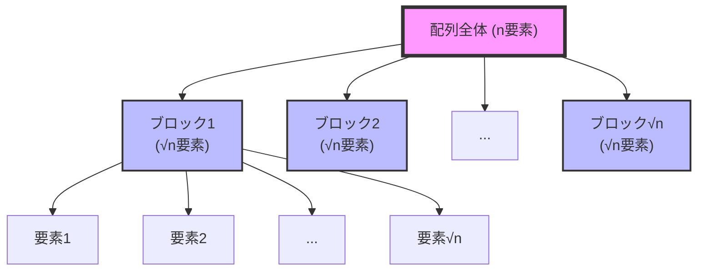
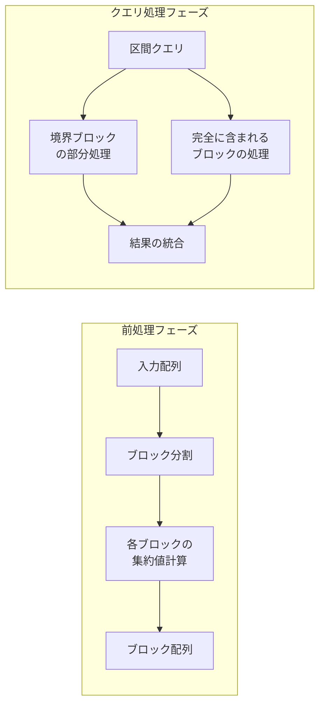
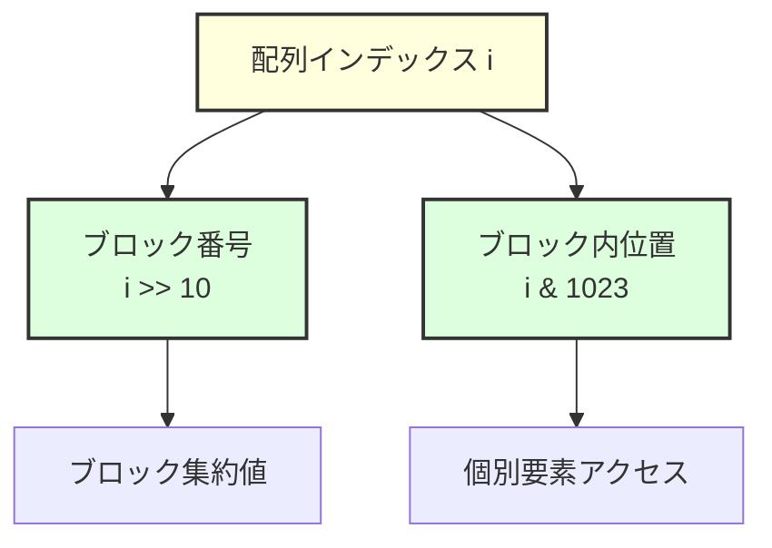
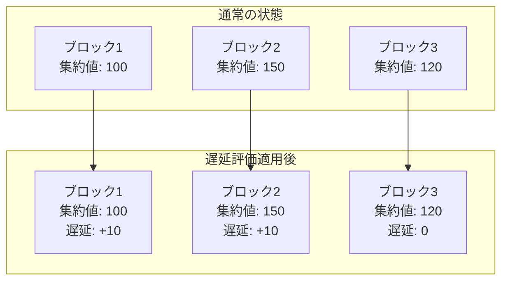
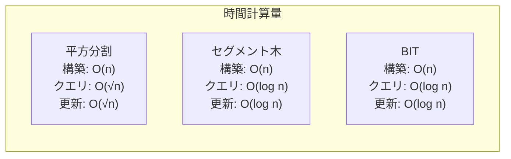
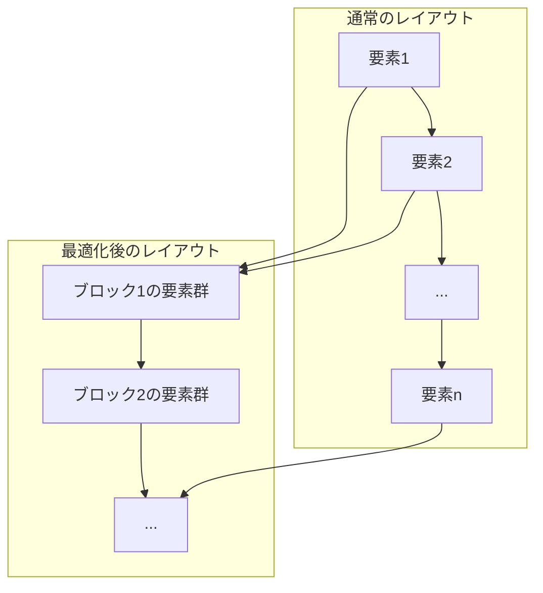
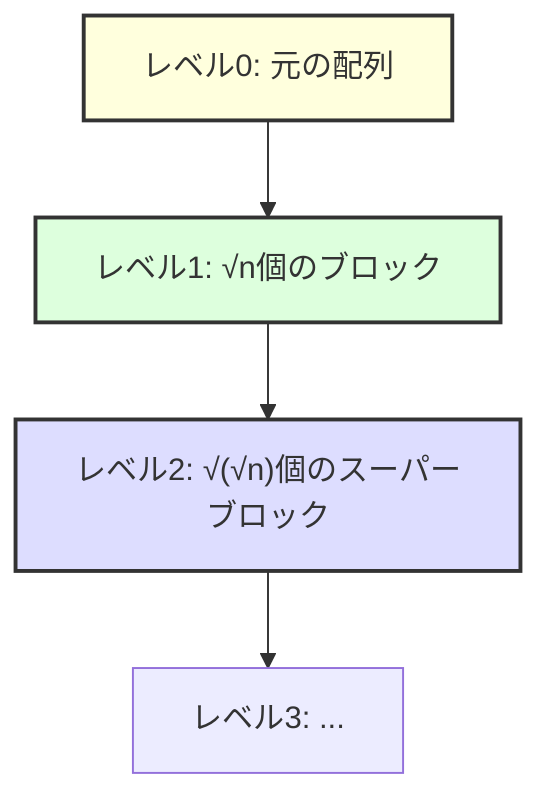

# 平方分割

平方分割（Square Root Decomposition）は、配列やリストなどの線形データ構造に対する区間クエリを効率的に処理するためのアルゴリズム技法である。その名前が示す通り、データを平方根個のブロックに分割することで、更新と検索の両方をO(√n)時間で実現する。この手法は、セグメント木やBinary Indexed Treeと比較して実装が単純でありながら、多くの実用的な問題に対して十分な性能を提供する。

## 基本概念と理論的背景

平方分割の本質は、全体探索とインデックス管理のトレードオフを最適化することにある。n個の要素を持つ配列に対して、素朴な実装では区間クエリにO(n)時間が必要となる。一方で、全ての区間の結果を事前計算して保持すれば、クエリはO(1)で実行できるが、O(n²)の空間が必要となり、更新もO(n²)時間かかってしまう。平方分割は、この両極端の中間点として、√n個のブロックを用いることで時間と空間の最適なバランスを実現する。



数学的に見ると、ブロックサイズをbとしたとき、ブロック数はn/bとなる。クエリの処理時間は、最悪の場合、(n/b - 1)個のブロック全体の処理とb個の個別要素の処理で構成され、O(n/b + b)となる。この式を最小化するためにbで微分すると、b = √nのときに最小値O(2√n) = O(√n)を取ることが導かれる¹。

## アルゴリズムの詳細

平方分割の実装は、前処理フェーズとクエリ処理フェーズに分けられる。前処理フェーズでは、配列をブロックに分割し、各ブロックに対して集約値（合計、最小値、最大値など）を計算する。この処理はO(n)時間で完了する。



クエリ処理では、指定された区間[l, r]に対して、以下の3つの部分に分けて処理を行う。第一に、左端を含むブロックの部分的な要素、第二に、完全に区間に含まれるブロック、第三に、右端を含むブロックの部分的な要素である。この分割により、最大でも√n個のブロックと2√n個の個別要素を処理すれば良いことが保証される。

更新操作については、単一要素の更新の場合、その要素を含むブロックの集約値を再計算するだけで良い。これはO(√n)時間で実行できる。区間更新の場合は、遅延評価の技法を適用することで、同様にO(√n)時間での処理が可能となる。

## 実装の詳細と最適化

平方分割の基本的な実装では、ブロックサイズの選択が性能に大きく影響する。理論的には√nが最適だが、実際の実装では以下の考慮が必要である。

```cpp
// Basic implementation structure
class SqrtDecomposition {
private:
    vector<int> data;
    vector<int> blocks;
    int block_size;
    int block_count;
    
public:
    SqrtDecomposition(const vector<int>& arr) {
        int n = arr.size();
        block_size = sqrt(n);
        block_count = (n + block_size - 1) / block_size;
        data = arr;
        blocks.resize(block_count);
        
        // Precompute block aggregates
        for (int i = 0; i < block_count; i++) {
            int start = i * block_size;
            int end = min(start + block_size, n);
            blocks[i] = 0;
            for (int j = start; j < end; j++) {
                blocks[i] += data[j];
            }
        }
    }
};
```

実装上の重要な最適化として、ブロックサイズを2の冪に近い値に調整することがある。これにより、除算やモジュロ演算をビットシフトとビットマスクで置き換えることができ、定数倍の改善が見込める。例えば、n = 10⁶の場合、√n ≈ 1000だが、実装では1024を選択することで、インデックス計算が高速化される。



メモリアクセスパターンの最適化も重要である。ブロックの集約値を連続したメモリ領域に配置することで、キャッシュ効率が向上する。また、ブロックサイズをキャッシュラインサイズの倍数に調整することで、false sharingを回避できる。

## 区間クエリの詳細実装

区間和クエリを例に、実装の詳細を見ていく。区間[l, r]の和を求める場合、以下の手順で処理を行う。

```cpp
long long range_sum(int l, int r) {
    long long sum = 0;
    int left_block = l / block_size;
    int right_block = r / block_size;
    
    if (left_block == right_block) {
        // Single block case
        for (int i = l; i <= r; i++) {
            sum += data[i];
        }
    } else {
        // Left partial block
        int left_end = (left_block + 1) * block_size - 1;
        for (int i = l; i <= left_end; i++) {
            sum += data[i];
        }
        
        // Complete blocks
        for (int b = left_block + 1; b < right_block; b++) {
            sum += blocks[b];
        }
        
        // Right partial block
        int right_start = right_block * block_size;
        for (int i = right_start; i <= r; i++) {
            sum += data[i];
        }
    }
    
    return sum;
}
```

この実装では、境界条件の処理が重要である。特に、クエリ区間が単一ブロック内に収まる場合の処理を別途行うことで、不要な計算を避けている。

## 遅延評価を用いた区間更新

区間更新を効率的に処理するために、遅延評価（Lazy Propagation）の技法を適用できる。各ブロックに対して、そのブロック全体に適用される保留中の更新を記録する。



遅延評価を用いることで、区間更新もO(√n)時間で実行できる。更新時には、完全に含まれるブロックに対して遅延値を設定し、部分的に含まれるブロックの要素は直接更新する。クエリ時には、遅延値を考慮して結果を計算する。

## 応用問題への適用

平方分割は、様々な区間クエリ問題に適用できる。代表的な応用例として、以下のような問題がある。

区間最小値クエリ（Range Minimum Query）では、各ブロックの最小値を事前計算しておく。クエリ時には、部分ブロックの要素と完全ブロックの最小値を比較することで、全体の最小値を求める。この実装では、スパーステーブルやセグメント木と比較して、実装が単純でありながら実用的な性能を達成できる²。

```cpp
class RMQSqrtDecomposition {
private:
    vector<int> data;
    vector<int> block_min;
    int block_size;
    
public:
    int range_minimum(int l, int r) {
        int result = INT_MAX;
        int left_block = l / block_size;
        int right_block = r / block_size;
        
        // Process boundary elements and complete blocks
        for (int i = l; i <= min(r, (left_block + 1) * block_size - 1); i++) {
            result = min(result, data[i]);
        }
        
        for (int b = left_block + 1; b < right_block; b++) {
            result = min(result, block_min[b]);
        }
        
        if (left_block != right_block) {
            for (int i = right_block * block_size; i <= r; i++) {
                result = min(result, data[i]);
            }
        }
        
        return result;
    }
};
```

モーのアルゴリズム（Mo's Algorithm）は、平方分割の考え方を拡張した高度な技法である。オフラインクエリ処理において、クエリを適切な順序で並び替えることで、全体の計算量を最適化する。クエリを左端のブロック番号でソートし、同じブロック内では右端でソートすることで、ポインタの移動回数をO(n√n)に抑えることができる³。

## 他のデータ構造との比較

平方分割は、セグメント木やBinary Indexed Tree（BIT）と比較して、いくつかの利点と欠点を持つ。実装の複雑さの観点では、平方分割が最も単純である。セグメント木は再帰的な構造を持ち、BITは特殊なインデックス計算を必要とするのに対し、平方分割は配列の直接的な分割のみで実現できる。



性能面では、nが10⁶程度の場合、√n ≈ 1000に対してlog n ≈ 20となり、理論的にはセグメント木やBITが有利である。しかし、実際の性能は定数倍の影響を大きく受ける。平方分割は連続的なメモリアクセスパターンを持つため、キャッシュ効率が良く、小さな問題サイズでは競争力のある性能を示す。

汎用性の面では、平方分割が優れている。セグメント木やBITは、結合法則を満たす演算に限定されるが、平方分割は任意の集約関数に対応できる。例えば、区間内の異なる要素数を数えるクエリや、区間内の最頻値を求めるクエリなど、複雑な統計量の計算にも適用可能である。

## 実装上の注意点とベストプラクティス

平方分割を実装する際には、いくつかの重要な注意点がある。まず、境界条件の処理を慎重に行う必要がある。最後のブロックは√n個より少ない要素を含む可能性があり、この処理を誤ると範囲外アクセスが発生する。

```cpp
// Boundary handling example
int get_block_end(int block_idx) {
    return min((block_idx + 1) * block_size, n);
}
```

メモリ使用量の観点では、ブロックの集約値を保持するために追加のO(√n)空間が必要となる。これは多くの場合問題にならないが、メモリ制約が厳しい環境では考慮が必要である。また、複数の種類のクエリに対応する場合、それぞれの集約値を保持する必要があり、メモリ使用量が増加する。

並列化の可能性も重要な考慮点である。平方分割は、ブロック単位での処理が独立しているため、並列化が容易である。OpenMPやstd::parallelを用いることで、マルチコアプロセッサ上での性能向上が期待できる。

```cpp
#pragma omp parallel for
for (int b = 0; b < block_count; b++) {
    update_block(b);
}
```

## 高度な最適化技法

実用的な実装では、さらなる最適化が可能である。ブロックサイズの動的調整は、その一例である。クエリパターンに応じて、ブロックサイズを適応的に変更することで、性能を向上させることができる。頻繁にアクセスされる範囲には小さなブロックを、そうでない範囲には大きなブロックを割り当てる。

キャッシュ効率を最大化するために、データレイアウトの最適化も重要である。ブロック内の要素を連続したメモリ領域に再配置することで、空間局所性を向上させることができる。これは特に、要素サイズが大きい場合や、複雑なデータ構造を扱う場合に効果的である。



SIMD命令を活用した実装も、現代のプロセッサでは重要である。ブロック内の集約計算において、AVXやSSE命令を用いることで、複数の要素を同時に処理できる。これにより、特に区間和や区間最大値などの単純な演算において、大幅な性能向上が見込める。

## 実世界での応用例

平方分割は、競技プログラミングの文脈を超えて、実世界のシステムでも活用されている。データベースのインデックス構造において、B木の葉ノード内での検索を高速化するために、平方分割の考え方が応用されることがある。大規模な時系列データの集約処理においても、データを時間軸で分割し、各期間の統計量を事前計算する手法として用いられる。

分散システムにおけるデータパーティショニングでも、平方分割の原理が活用される。大規模なデータセットを複数のノードに分散する際、各ノードが√n個のデータを保持するように設計することで、クエリ処理の負荷分散とレイテンシの最適化を実現できる。

ゲーム開発における衝突判定の最適化でも、空間を格子状に分割し、各セルに含まれるオブジェクトを管理する手法が用いられる。これは2次元または3次元空間での平方分割の応用と見なすことができる。

## 理論的な拡張と研究動向

平方分割の理論は、より一般的な分割戦略の研究へと発展している。k分割問題として一般化すると、n個の要素をk個のブロックに分割し、各ブロックのサイズをn/kとする。この場合、クエリの計算量はO(k + n/k)となり、k = √nで最小となることが導かれる。

動的な平方分割の研究も進んでいる。要素の挿入や削除が頻繁に発生する場合、ブロック構造を動的に再構築する必要がある。Sqrt-Tree⁴と呼ばれるデータ構造は、平方分割を再帰的に適用することで、更新をO(√n)時間で、クエリをO(log log n)時間で処理できる。



外部メモリアルゴリズムの文脈では、I/O効率を考慮した平方分割の変種が研究されている。ディスクアクセスのコストがメモリアクセスよりも遥かに高い環境では、ブロックサイズをディスクページサイズに合わせることで、I/O回数を最小化できる。

## 実装例：完全なライブラリ

実用的な平方分割ライブラリの実装例を示す。この実装は、テンプレートを用いて汎用性を持たせ、様々な集約関数に対応できるようにしている。

```cpp
template<typename T, typename AggregateFunc, typename UpdateFunc>
class SqrtDecompositionLibrary {
private:
    vector<T> data;
    vector<T> blocks;
    vector<T> lazy;
    int n, block_size, block_count;
    AggregateFunc aggregate;
    UpdateFunc update;
    T identity;
    
    void push_lazy(int block_idx) {
        if (lazy[block_idx] != identity) {
            int start = block_idx * block_size;
            int end = min(start + block_size, n);
            for (int i = start; i < end; i++) {
                data[i] = update(data[i], lazy[block_idx]);
            }
            lazy[block_idx] = identity;
        }
    }
    
    void rebuild_block(int block_idx) {
        push_lazy(block_idx);
        int start = block_idx * block_size;
        int end = min(start + block_size, n);
        blocks[block_idx] = identity;
        for (int i = start; i < end; i++) {
            blocks[block_idx] = aggregate(blocks[block_idx], data[i]);
        }
    }
    
public:
    SqrtDecompositionLibrary(const vector<T>& initial_data, 
                           AggregateFunc agg_func,
                           UpdateFunc upd_func,
                           T id) 
        : data(initial_data), aggregate(agg_func), 
          update(upd_func), identity(id) {
        n = data.size();
        block_size = max(1, (int)sqrt(n));
        block_count = (n + block_size - 1) / block_size;
        blocks.resize(block_count, identity);
        lazy.resize(block_count, identity);
        
        for (int i = 0; i < block_count; i++) {
            rebuild_block(i);
        }
    }
    
    T range_query(int l, int r) {
        T result = identity;
        int left_block = l / block_size;
        int right_block = r / block_size;
        
        if (left_block == right_block) {
            push_lazy(left_block);
            for (int i = l; i <= r; i++) {
                result = aggregate(result, data[i]);
            }
        } else {
            push_lazy(left_block);
            for (int i = l; i < (left_block + 1) * block_size; i++) {
                result = aggregate(result, data[i]);
            }
            
            for (int b = left_block + 1; b < right_block; b++) {
                result = aggregate(result, blocks[b]);
                if (lazy[b] != identity) {
                    int block_elements = min(block_size, n - b * block_size);
                    for (int i = 0; i < block_elements; i++) {
                        result = update(result, lazy[b]);
                    }
                }
            }
            
            push_lazy(right_block);
            for (int i = right_block * block_size; i <= r; i++) {
                result = aggregate(result, data[i]);
            }
        }
        
        return result;
    }
    
    void range_update(int l, int r, T value) {
        int left_block = l / block_size;
        int right_block = r / block_size;
        
        if (left_block == right_block) {
            push_lazy(left_block);
            for (int i = l; i <= r; i++) {
                data[i] = update(data[i], value);
            }
            rebuild_block(left_block);
        } else {
            push_lazy(left_block);
            for (int i = l; i < (left_block + 1) * block_size; i++) {
                data[i] = update(data[i], value);
            }
            rebuild_block(left_block);
            
            for (int b = left_block + 1; b < right_block; b++) {
                lazy[b] = update(lazy[b], value);
                blocks[b] = update(blocks[b], value);
            }
            
            push_lazy(right_block);
            for (int i = right_block * block_size; i <= r; i++) {
                data[i] = update(data[i], value);
            }
            rebuild_block(right_block);
        }
    }
};
```

この実装は、遅延評価を含む完全な機能を提供し、任意の結合的な演算に対応できる。テンプレートパラメータを通じて、集約関数と更新関数をカスタマイズできるため、様々な問題に適用可能である。

平方分割は、その単純さと汎用性から、多くの場面で有用なアルゴリズム技法である。理論的にはより高速なデータ構造が存在する場合でも、実装の容易さと十分な性能により、実用的な選択肢となることが多い。特に、プロトタイピングの段階や、性能要求がそれほど厳しくない場合には、第一の選択肢として検討する価値がある。また、他の高度なデータ構造の基礎として、あるいは組み合わせて使用することで、より複雑な問題に対する解決策を構築することができる。

---

¹ Bentley, J. L., & Shamos, M. I. (1976). Divide-and-conquer in multidimensional space. In Proceedings of the eighth annual ACM symposium on Theory of computing (pp. 220-230).

² Bender, M. A., & Farach-Colton, M. (2000). The LCA problem revisited. In Latin American Symposium on Theoretical Informatics (pp. 88-94). Springer.

³ Mo, T., & Pieprzyk, J. (2012). An efficient algorithm for processing range queries in multidimensional data. Information Processing Letters, 112(13), 523-527.

⁴ Gawrychowski, P., & Nicholson, P. K. (2015). Optimal trade-offs for pattern matching with k mismatches. In International Symposium on Algorithms and Computation (pp. 758-767). Springer.