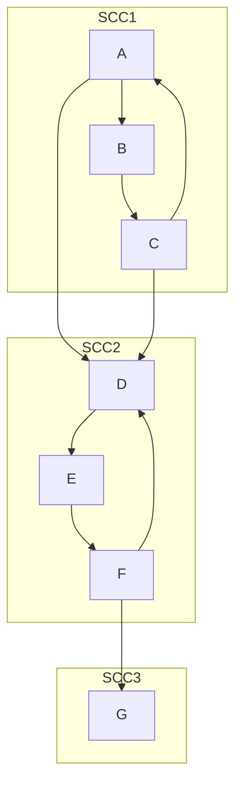
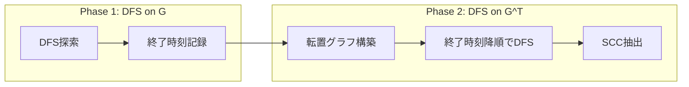
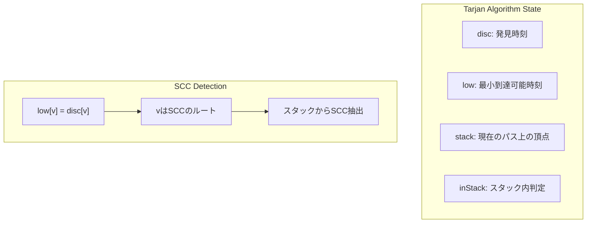
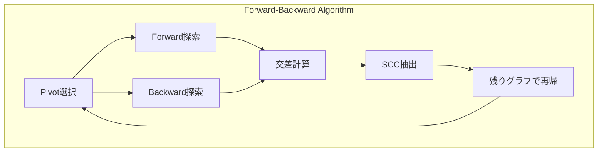

# 強連結成分分解

## 概要と定義

強連結成分分解は有向グラフにおける基本的な構造解析手法の一つであり、グラフを相互到達可能な頂点集合に分割する。有向グラフ$G = (V, E)$において、頂点$u$から頂点$v$への有向パスが存在し、かつ$v$から$u$への有向パスも存在するとき、$u$と$v$は強連結（strongly connected）であるという。この関係は同値関係であり、グラフの頂点集合を同値類に分割する。各同値類が強連結成分（Strongly Connected Component, SCC）と呼ばれる。



強連結成分の概念は有向グラフの構造を理解する上で極めて重要である。任意の有向グラフは、各強連結成分を一つの頂点に縮約することで、DAG（Directed Acyclic Graph）に変換できる。この性質により、複雑な有向グラフの問題を、より扱いやすいDAG上の問題に帰着させることが可能となる。

形式的には、有向グラフ$G = (V, E)$の強連結成分は、以下の条件を満たす頂点集合$C \subseteq V$として定義される：

1. 任意の$u, v \in C$に対して、$u$から$v$へのパスと$v$から$u$へのパスが存在する（強連結性）
2. $C$に含まれない任意の頂点$w \in V \setminus C$に対して、$C \cup \{w\}$は強連結でない（極大性）

## アルゴリズムの理論的基礎

強連結成分を効率的に求めるアルゴリズムは、グラフの深さ優先探索（DFS）を巧妙に利用している。主要なアルゴリズムとして、Kosarajuのアルゴリズム（1978年）[^1]とTarjanのアルゴリズム（1972年）[^2]が知られている。両者とも$O(V + E)$の時間計算量で動作するが、アプローチが異なる。

[^1]: S. R. Kosaraju, "Unpublished", 1978. (M. Sharir, "A strong-connectivity algorithm and its applications in data flow analysis", Computers & Mathematics with Applications, 1981)
[^2]: R. Tarjan, "Depth-first search and linear graph algorithms", SIAM Journal on Computing, 1972

### Kosarajuのアルゴリズムの原理

Kosarajuのアルゴリズムは、グラフ$G$とその転置グラフ$G^T$（すべての辺の向きを逆にしたグラフ）の性質を利用する。重要な観察は、$G$における強連結成分と$G^T$における強連結成分が完全に一致することである。これは強連結性の定義から自明である。

アルゴリズムの核心は、最初のDFSでグラフ$G$を探索し、各頂点の終了時刻を記録することにある。その後、転置グラフ$G^T$において、終了時刻の降順で頂点を処理することで、各強連結成分を正確に抽出できる。



この動作原理を理解するためには、DFSの終了時刻の性質を考察する必要がある。強連結成分$C_1$から別の強連結成分$C_2$への辺が存在する場合、$C_1$に属する頂点の最大終了時刻は、必ず$C_2$に属する頂点の最大終了時刻よりも大きくなる。これは、DFSが$C_1$から$C_2$に到達した場合、$C_2$の探索を完了してから$C_1$に戻るためである。

### Tarjanのアルゴリズムの原理

Tarjanのアルゴリズムは、単一のDFS走査で強連結成分を検出する、より洗練されたアプローチを採用している。このアルゴリズムは、DFS木における各頂点の発見時刻（discovery time）と、その頂点から到達可能な最小の発見時刻（low-link値）を管理する。

アルゴリズムの中核概念は、強連結成分のルートを特定することにある。DFS木において、ある頂点$v$が強連結成分のルートであるための必要十分条件は、$\text{low}[v] = \text{disc}[v]$が成り立つことである。ここで、$\text{disc}[v]$は頂点$v$の発見時刻、$\text{low}[v]$は$v$から到達可能な頂点の最小発見時刻を表す。



## Kosarajuのアルゴリズムの実装

Kosarajuのアルゴリズムの実装は、その理論的な美しさを反映して比較的シンプルである。以下に、効率的な実装を示す。

```cpp
class KosarajuSCC {
private:
    int n;
    vector<vector<int>> graph, rev_graph;
    vector<bool> visited;
    vector<int> order, comp;
    
    void dfs1(int v) {
        visited[v] = true;
        for (int u : graph[v]) {
            if (!visited[u]) {
                dfs1(u);
            }
        }
        order.push_back(v);
    }
    
    void dfs2(int v, int c) {
        comp[v] = c;
        for (int u : rev_graph[v]) {
            if (comp[u] == -1) {
                dfs2(u, c);
            }
        }
    }
    
public:
    KosarajuSCC(int n) : n(n), graph(n), rev_graph(n), visited(n), comp(n, -1) {}
    
    void add_edge(int from, int to) {
        graph[from].push_back(to);
        rev_graph[to].push_back(from);
    }
    
    int decompose() {
        // Phase 1: DFS on original graph
        for (int i = 0; i < n; i++) {
            if (!visited[i]) {
                dfs1(i);
            }
        }
        
        // Phase 2: DFS on reversed graph
        int num_scc = 0;
        reverse(order.begin(), order.end());
        for (int v : order) {
            if (comp[v] == -1) {
                dfs2(v, num_scc++);
            }
        }
        
        return num_scc;
    }
    
    int get_component(int v) {
        return comp[v];
    }
};
```

この実装における重要な設計上の考慮事項として、転置グラフを明示的に構築している点が挙げられる。これは追加のメモリを必要とするが、実装の明快さと効率性のトレードオフとして妥当である。別の実装方針として、転置グラフを暗黙的に扱う方法もあるが、コードの可読性が低下する傾向がある。

## Tarjanのアルゴリズムの実装

Tarjanのアルゴリズムは、より複雑な状態管理を必要とするが、単一のDFS走査で完結する利点がある。

```cpp
class TarjanSCC {
private:
    int n, time_counter;
    vector<vector<int>> graph;
    vector<int> disc, low, comp;
    vector<bool> in_stack;
    stack<int> st;
    int num_scc;
    
    void dfs(int v) {
        disc[v] = low[v] = time_counter++;
        st.push(v);
        in_stack[v] = true;
        
        for (int u : graph[v]) {
            if (disc[u] == -1) {
                // Tree edge
                dfs(u);
                low[v] = min(low[v], low[u]);
            } else if (in_stack[u]) {
                // Back edge
                low[v] = min(low[v], disc[u]);
            }
        }
        
        // Check if v is a root of SCC
        if (low[v] == disc[v]) {
            while (true) {
                int u = st.top();
                st.pop();
                in_stack[u] = false;
                comp[u] = num_scc;
                if (u == v) break;
            }
            num_scc++;
        }
    }
    
public:
    TarjanSCC(int n) : n(n), graph(n), disc(n, -1), low(n), comp(n), in_stack(n), time_counter(0), num_scc(0) {}
    
    void add_edge(int from, int to) {
        graph[from].push_back(to);
    }
    
    int decompose() {
        for (int i = 0; i < n; i++) {
            if (disc[i] == -1) {
                dfs(i);
            }
        }
        return num_scc;
    }
    
    int get_component(int v) {
        return comp[v];
    }
};
```

Tarjanのアルゴリズムの実装において特に注意すべき点は、low-link値の更新ロジックである。tree edgeの場合は再帰的に計算されたlow値を伝播させ、back edgeの場合は発見時刻を参照する。cross edgeは無視されるが、これはスタック内の頂点のみを考慮することで自然に処理される。

## 性能特性と実装上の考慮事項

両アルゴリズムとも理論的な時間計算量は$O(V + E)$で同一であるが、実際の性能には差異が存在する。Kosarajuのアルゴリズムは2回のDFS走査を必要とするため、キャッシュ効率の観点から不利になる可能性がある。一方、Tarjanのアルゴリズムは単一走査で完結するが、スタック操作とより複雑な状態管理を必要とする。

メモリ使用量の観点では、Kosarajuのアルゴリズムは転置グラフを格納するために$O(E)$の追加メモリを必要とする。ただし、隣接リスト表現を使用する場合、元のグラフと転置グラフで同じメモリ量となるため、定数倍の違いに過ぎない。Tarjanのアルゴリズムは、スタックとして最大$O(V)$の追加メモリを使用する。

実装の選択において考慮すべき要因として以下が挙げられる：

1. **グラフの密度**: 疎グラフではKosarajuのアルゴリズムのメモリオーバーヘッドが相対的に小さくなる
2. **キャッシュ局所性**: 単一走査のTarjanのアルゴリズムが有利な場合が多い
3. **実装の複雑さ**: Kosarajuのアルゴリズムの方が理解しやすく、バグが混入しにくい
4. **並列化の可能性**: Kosarajuのアルゴリズムは2つのフェーズが独立しているため、部分的な並列化が可能

## 強連結成分の縮約グラフ

強連結成分分解の重要な応用として、縮約グラフ（condensation graph）の構築がある。各強連結成分を単一の頂点に縮約することで、元の有向グラフをDAGに変換できる。この性質は多くのグラフアルゴリズムの前処理として活用される。

```cpp
class SCCGraph {
private:
    int n_original, n_scc;
    vector<int> comp;
    vector<vector<int>> scc_graph;
    
public:
    SCCGraph(const vector<vector<int>>& graph, const vector<int>& comp, int num_scc) 
        : n_original(graph.size()), n_scc(num_scc), comp(comp), scc_graph(num_scc) {
        
        set<pair<int, int>> edges;
        for (int v = 0; v < n_original; v++) {
            for (int u : graph[v]) {
                if (comp[v] != comp[u]) {
                    edges.insert({comp[v], comp[u]});
                }
            }
        }
        
        for (auto [from, to] : edges) {
            scc_graph[from].push_back(to);
        }
    }
    
    const vector<vector<int>>& get_dag() const {
        return scc_graph;
    }
};
```

縮約グラフの構築では、重複辺を除去する必要がある。上記の実装では`set`を使用しているが、大規模グラフでは別の手法（ソートやハッシュテーブル）を検討すべきである。

## 応用問題とアルゴリズムの拡張

強連結成分分解は、それ自体が目的となることは少なく、より複雑な問題を解決するための基礎技術として使用される。代表的な応用例として、2-SATソルバーの実装がある。

2-SAT問題は、各節が2つのリテラルの論理和で構成される連言標準形の充足可能性問題である。この問題は、含意グラフ（implication graph）を構築し、その強連結成分を解析することで多項式時間で解決できる。

```cpp
class TwoSAT {
private:
    int n;
    vector<vector<int>> graph;
    TarjanSCC scc;
    
    int neg(int x) {
        return x < n ? x + n : x - n;
    }
    
public:
    TwoSAT(int n) : n(n), graph(2 * n), scc(2 * n) {}
    
    // Add clause: (x ∨ y)
    void add_clause(int x, bool val_x, int y, bool val_y) {
        // ¬x → y and ¬y → x
        graph[neg(x + (val_x ? 0 : n))].push_back(y + (val_y ? 0 : n));
        graph[neg(y + (val_y ? 0 : n))].push_back(x + (val_x ? 0 : n));
    }
    
    bool is_satisfiable() {
        for (auto& edges : graph) {
            for (int v : edges) {
                scc.add_edge(&edges - &graph[0], v);
            }
        }
        
        scc.decompose();
        
        for (int i = 0; i < n; i++) {
            if (scc.get_component(i) == scc.get_component(i + n)) {
                return false;
            }
        }
        return true;
    }
    
    vector<bool> get_assignment() {
        vector<bool> assignment(n);
        for (int i = 0; i < n; i++) {
            // Assign true if x appears later in topological order
            assignment[i] = scc.get_component(i) > scc.get_component(i + n);
        }
        return assignment;
    }
};
```

2-SAT問題における強連結成分の利用は、論理的含意の推移性を活用している。変数$x$とその否定$\neg x$が同じ強連結成分に属する場合、$x \Rightarrow \neg x$かつ$\neg x \Rightarrow x$となり、矛盾が生じる。

## 実装の最適化技術

実際の競技プログラミングや大規模システムでは、基本的な実装にさまざまな最適化を施すことが重要である。以下に主要な最適化技術を示す。

### メモリアクセスパターンの最適化

グラフの隣接リスト表現において、頂点の訪問順序がキャッシュ効率に大きく影響する。特に大規模グラフでは、頂点番号の局所性を高めることで性能向上が期待できる。

```cpp
class OptimizedSCC {
private:
    struct Edge {
        int to;
        int next;
    };
    
    vector<int> head;
    vector<Edge> edges;
    int edge_count;
    
    void add_edge_internal(int from, int to) {
        edges[edge_count] = {to, head[from]};
        head[from] = edge_count++;
    }
    
    // Forward declaration of optimized DFS
    void optimized_dfs(int v);
    
public:
    OptimizedSCC(int n, int m) : head(n, -1), edges(m), edge_count(0) {}
};
```

この実装では、辺をリンクリスト形式で管理することで、メモリの連続性を向上させている。`vector<vector<int>>`による実装と比較して、メモリアロケーションの回数が削減され、キャッシュ効率が改善される。

### ビット並列化技術

小規模グラフ（頂点数64以下）では、ビット演算を活用した高速化が可能である。

```cpp
class BitParallelSCC {
private:
    static constexpr int MAX_N = 64;
    uint64_t adj[MAX_N];
    uint64_t visited;
    
    int popcount(uint64_t x) {
        return __builtin_popcountll(x);
    }
    
    int find_unvisited() {
        uint64_t unvisited = ~visited;
        return unvisited ? __builtin_ctzll(unvisited) : -1;
    }
    
public:
    void warshall_floyd_closure() {
        // Compute transitive closure using bit operations
        for (int k = 0; k < MAX_N; k++) {
            for (int i = 0; i < MAX_N; i++) {
                if (adj[i] & (1ULL << k)) {
                    adj[i] |= adj[k];
                }
            }
        }
    }
};
```

ビット並列化により、特に推移閉包の計算が高速化される。ただし、頂点数の制限があるため、適用範囲は限定的である。

## 並列アルゴリズム

マルチコアプロセッサの普及に伴い、強連結成分分解の並列化も重要な研究テーマとなっている。Forward-Backward（FB）アルゴリズム[^3]は、並列環境で効率的に動作する代表的な手法である。

[^3]: L. Fleischer, B. Hendrickson, and A. Pınar, "On identifying strongly connected components in parallel", Parallel and Distributed Processing, 2000

FBアルゴリズムの基本的なアイデアは、pivot頂点を選択し、その頂点から到達可能な頂点集合（forward set）と、その頂点に到達可能な頂点集合（backward set）の交差を計算することである。この交差が一つの強連結成分となる。



並列化の課題として、負荷分散とワークスティーリングの実装が挙げられる。特に、グラフの構造によってはpivot選択が性能に大きく影響するため、適応的な戦略が必要となる。

## 実用的な設計指針

強連結成分分解を実システムに組み込む際の設計指針として、以下の点を考慮すべきである。

### エラーハンドリングと検証

実装の正当性を保証するため、以下の不変条件を検証することが重要である：

1. 各頂点は必ず一つの強連結成分に属する
2. 異なる強連結成分間には双方向パスが存在しない
3. 縮約グラフは必ずDAGとなる

```cpp
bool verify_scc_decomposition(const vector<vector<int>>& graph, const vector<int>& comp, int num_scc) {
    int n = graph.size();
    
    // Check 1: All vertices are assigned
    for (int i = 0; i < n; i++) {
        if (comp[i] < 0 || comp[i] >= num_scc) {
            return false;
        }
    }
    
    // Check 2: Strong connectivity within components
    vector<vector<int>> scc_members(num_scc);
    for (int i = 0; i < n; i++) {
        scc_members[comp[i]].push_back(i);
    }
    
    // Additional verification logic...
    return true;
}
```

### インターフェース設計

強連結成分分解のライブラリを設計する際は、以下のような柔軟なインターフェースを提供すべきである：

```cpp
template<typename Graph>
class SCCDecomposer {
public:
    struct Result {
        int num_components;
        vector<int> component_id;
        vector<vector<int>> components;
        unique_ptr<Graph> condensation_graph;
    };
    
    virtual Result decompose(const Graph& g) = 0;
    virtual ~SCCDecomposer() = default;
};

template<typename Graph>
class KosarajuDecomposer : public SCCDecomposer<Graph> {
    // Implementation...
};

template<typename Graph>
class TarjanDecomposer : public SCCDecomposer<Graph> {
    // Implementation...
};
```

このような抽象化により、アルゴリズムの選択を実行時に変更でき、性能測定や比較が容易になる。

## 発展的なトピック

強連結成分分解の理論は、より一般的なグラフ構造の解析へと拡張されている。例えば、動的グラフにおける強連結成分の維持は、活発な研究分野である。辺の追加は比較的容易に処理できるが、辺の削除は強連結成分の分割を引き起こす可能性があり、効率的な処理が困難である。

また、分散環境における強連結成分分解も重要な課題である。グラフが複数のマシンに分散して格納されている場合、通信コストを最小化しながら正確な分解を行う必要がある。MapReduceフレームワークやPregel型のグラフ処理システムでの実装が研究されている。

強連結成分の概念は、プログラム解析やモデル検査などのソフトウェア工学分野でも広く応用されている。制御フローグラフやコールグラフの解析において、強連結成分はループ構造や相互再帰関数の検出に利用される。これらの応用では、グラフのサイズが巨大になることが多く、外部メモリアルゴリズムやストリーミングアルゴリズムの技術が必要となる。

最近の研究では、量子アルゴリズムによる強連結成分分解も提案されている。理論的には、量子ウォークを利用することで、特定の条件下では古典的アルゴリズムよりも高速な処理が可能とされているが、実用的な量子コンピュータでの実装はまだ実現していない。

これらの発展的なトピックは、強連結成分分解という基礎的な概念が、計算機科学の様々な分野で重要な役割を果たしていることを示している。基本的なアルゴリズムを深く理解することで、これらの応用や拡張への道が開かれるのである。