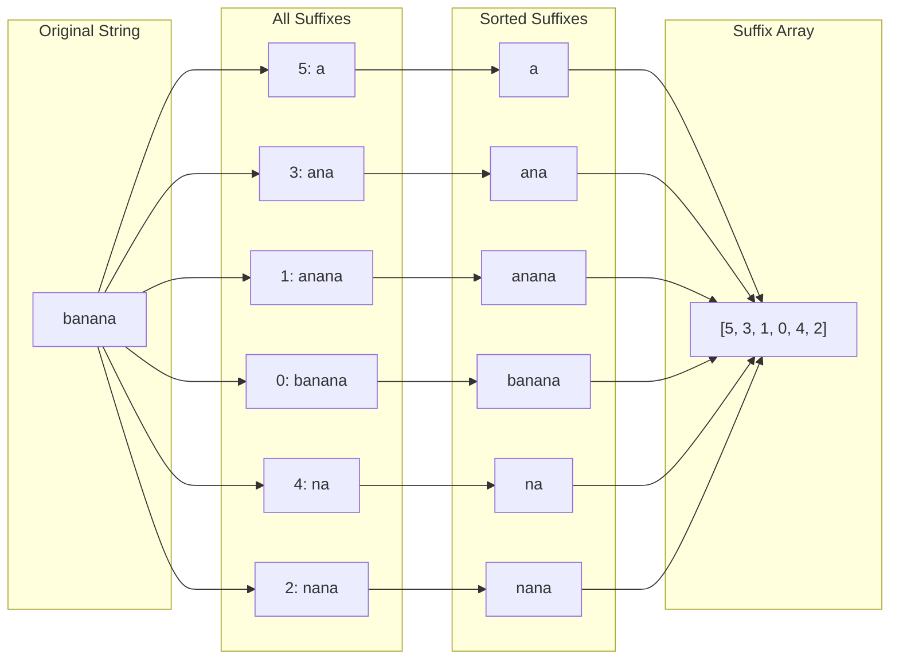
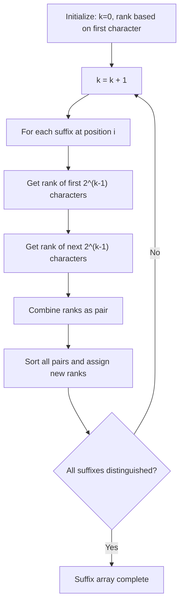
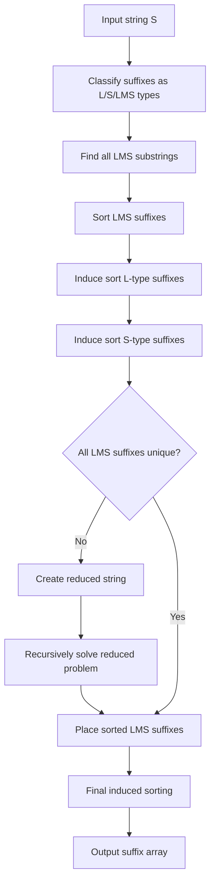
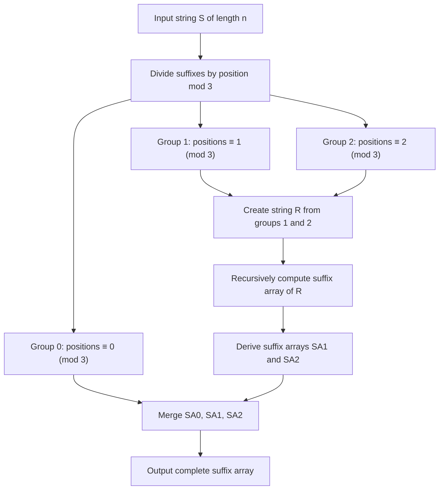

# 接尾辞配列

接尾辞配列（Suffix Array）は、文字列の全ての接尾辞を辞書順にソートした際のインデックスを格納する配列であり、文字列処理において極めて強力なデータ構造である。接尾辞木（Suffix Tree）と同等の機能を提供しながら、より少ないメモリ使用量で実装できることから、実用的な場面で広く採用されている。本稿では、接尾辞配列の理論的基礎から効率的な構築アルゴリズム、そして実践的な応用まで、体系的に解説する。

## 接尾辞配列の定義と基本概念

文字列 $S$ の長さを $n$ とし、$S[i..n-1]$ を位置 $i$ から始まる接尾辞と定義する。接尾辞配列 $SA$ は、これらの接尾辞を辞書順にソートした際の開始位置を格納する長さ $n$ の配列である。すなわち、$SA[i]$ は辞書順で $i$ 番目に小さい接尾辞の開始位置を表す。

例えば、文字列 "banana" に対する接尾辞配列を考える。この文字列の接尾辞は以下の通りである：

- 位置0: "banana"
- 位置1: "anana"
- 位置2: "nana"
- 位置3: "ana"
- 位置4: "na"
- 位置5: "a"

これらを辞書順にソートすると：

- "a" (位置5)
- "ana" (位置3)
- "anana" (位置1)
- "banana" (位置0)
- "na" (位置4)
- "nana" (位置2)

したがって、接尾辞配列は $SA = [5, 3, 1, 0, 4, 2]$ となる。



接尾辞配列の重要な性質として、任意の部分文字列は必ずいずれかの接尾辞の接頭辞として表現できることが挙げられる。この性質により、接尾辞配列を用いることで、パターン検索、最長共通部分文字列の検出、文字列の繰り返し構造の解析など、多様な文字列処理問題を効率的に解決できる。

## 基本的な構築アルゴリズム

最も単純な接尾辞配列の構築方法は、全ての接尾辞を列挙し、標準的なソートアルゴリズムを適用することである。しかし、この素朴なアプローチには性能上の問題がある。

```cpp
// Naive suffix array construction
vector<int> buildSuffixArrayNaive(const string& s) {
    int n = s.length();
    vector<pair<string, int>> suffixes;
    
    // Enumerate all suffixes
    for (int i = 0; i < n; i++) {
        suffixes.push_back({s.substr(i), i});
    }
    
    // Sort lexicographically
    sort(suffixes.begin(), suffixes.end());
    
    // Extract indices
    vector<int> sa(n);
    for (int i = 0; i < n; i++) {
        sa[i] = suffixes[i].second;
    }
    
    return sa;
}
```

この実装の時間計算量は $O(n^2 \log n)$ である。文字列の比較に最悪 $O(n)$ かかり、$n$ 個の接尾辞をソートするため、全体として二次的な計算量となる。実用的なアプリケーションでは、より効率的なアルゴリズムが必要となる。

## Manber-Myersアルゴリズム

Manber-Myersアルゴリズムは、接尾辞配列を $O(n \log^2 n)$ 時間で構築する効率的な手法である[^1]。このアルゴリズムの核心は、倍増法（doubling technique）を用いて接尾辞の順序を段階的に決定することにある。

アルゴリズムの基本的な考え方は、各ステップで接尾辞の最初の $2^k$ 文字に基づいて順序付けを行い、$k$ を増やしていくことである。$k = 0$ から始めて、各ステップで接尾辞の長さを倍にしながら、最終的に全ての接尾辞が区別されるまで続ける。

各ステップでは、位置 $i$ から始まる接尾辞に対して、以下の2つの情報を組み合わせて順序を決定する：

- 最初の $2^{k-1}$ 文字のランク（前のステップで計算済み）
- 次の $2^{k-1}$ 文字のランク（位置 $i + 2^{k-1}$ から始まる接尾辞の前のステップでのランク）



実装では、各接尾辞に対してランクを管理し、基数ソートまたは標準的なソートアルゴリズムを使用して順序付けを行う。

```cpp
vector<int> buildSuffixArrayManberMyers(const string& s) {
    int n = s.length();
    vector<int> sa(n), rank(n), tmp(n);
    
    // Initialize with single character ranks
    for (int i = 0; i < n; i++) {
        sa[i] = i;
        rank[i] = s[i];
    }
    
    for (int k = 1; k < n; k *= 2) {
        // Comparator using current ranks
        auto cmp = [&](int i, int j) {
            if (rank[i] != rank[j]) return rank[i] < rank[j];
            int ri = (i + k < n) ? rank[i + k] : -1;
            int rj = (j + k < n) ? rank[j + k] : -1;
            return ri < rj;
        };
        
        // Sort based on 2k-length comparison
        sort(sa.begin(), sa.end(), cmp);
        
        // Update ranks
        tmp[sa[0]] = 0;
        for (int i = 1; i < n; i++) {
            tmp[sa[i]] = tmp[sa[i-1]] + cmp(sa[i-1], sa[i]);
        }
        rank = tmp;
    }
    
    return sa;
}
```

このアルゴリズムの優れた点は、各ステップで処理する情報量が一定であり、文字列の長さに対して対数的なステップ数で完了することである。実装も比較的シンプルで、理解しやすい構造となっている。

## SA-ISアルゴリズム

SA-IS（Suffix Array Induced Sorting）は、2009年にNongらによって提案された線形時間の接尾辞配列構築アルゴリズムである[^2]。このアルゴリズムは、接尾辞を3つのタイプに分類し、それらの相互関係を利用して効率的に配列を構築する。

SA-ISの核心となる概念は、接尾辞のタイプ分類である：

- **S型接尾辞**: 次の接尾辞よりも辞書順で小さい接尾辞
- **L型接尾辞**: 次の接尾辞よりも辞書順で大きい接尾辞
- **LMS（Leftmost S-type）接尾辞**: L型接尾辞の直後に現れるS型接尾辞

文字列の最後から走査することで、各位置の接尾辞タイプを $O(n)$ 時間で決定できる。タイプの決定は以下の規則に従う：

- 最後の文字（番兵）は常にS型
- 位置 $i$ の文字が位置 $i+1$ の文字より小さければS型
- 位置 $i$ の文字が位置 $i+1$ の文字より大きければL型
- 文字が等しい場合は、位置 $i+1$ のタイプを継承



SA-ISアルゴリズムの重要な洞察は、LMS接尾辞の順序が決まれば、誘導ソート（induced sorting）によって他の全ての接尾辞の順序を効率的に決定できることである。誘導ソートは、既にソートされた接尾辞の情報を利用して、関連する接尾辞の位置を決定する手法である。

アルゴリズムの主要なステップは以下の通りである：

1. **タイプ分類**: 各接尾辞をL型、S型、LMS型に分類
2. **バケットソート**: 各文字に対応するバケットを作成し、接尾辞を配置
3. **LMS接尾辞のソート**: LMS部分文字列を抽出し、再帰的に処理
4. **誘導ソート**: LMS接尾辞の順序から全体の順序を導出

誘導ソートのプロセスは特に巧妙である。まず、ソート済みのLMS接尾辞を適切な位置に配置する。次に、左から右へ走査してL型接尾辞を配置し、最後に右から左へ走査してS型接尾辞を配置する。この手順により、各接尾辞が正しい位置に配置されることが保証される。

## 最長共通接頭辞配列

接尾辞配列と密接に関連するデータ構造として、最長共通接頭辞（LCP: Longest Common Prefix）配列がある。LCP配列の $i$ 番目の要素は、接尾辞配列で隣接する2つの接尾辞 $SA[i-1]$ と $SA[i]$ の最長共通接頭辞の長さを格納する。

LCP配列は、接尾辞配列と組み合わせることで、多くの文字列処理問題を効率的に解決できる。例えば、任意の2つの接尾辞の最長共通接頭辞は、LCP配列の区間最小値クエリ（RMQ: Range Minimum Query）として表現できる。

Kasaiのアルゴリズムは、接尾辞配列からLCP配列を線形時間で構築する優れた手法である[^3]。このアルゴリズムの鍵となる観察は、元の文字列における隣接する接尾辞間のLCP値に関する性質である。

```cpp
vector<int> buildLCPArray(const string& s, const vector<int>& sa) {
    int n = s.length();
    vector<int> lcp(n-1), rank(n);
    
    // Compute rank array (inverse of suffix array)
    for (int i = 0; i < n; i++) {
        rank[sa[i]] = i;
    }
    
    int h = 0;
    for (int i = 0; i < n; i++) {
        if (rank[i] == 0) continue;
        
        int j = sa[rank[i] - 1];
        while (i + h < n && j + h < n && s[i + h] == s[j + h]) {
            h++;
        }
        
        lcp[rank[i] - 1] = h;
        
        if (h > 0) h--;
    }
    
    return lcp;
}
```

このアルゴリズムの正当性は、以下の性質に基づいている：位置 $i$ の接尾辞と、接尾辞配列で直前にある接尾辞との共通接頭辞の長さを $h$ とすると、位置 $i+1$ の接尾辞と、その直前の接尾辞との共通接頭辞の長さは少なくとも $h-1$ である。

## パターン検索への応用

接尾辞配列の最も直接的な応用は、文字列内でのパターン検索である。パターン $P$ が文字列 $S$ に出現する全ての位置を見つける問題を考える。接尾辞配列を用いることで、この問題を $O(|P| \log n)$ 時間で解決できる。

基本的なアイデアは、パターン $P$ で始まる接尾辞が接尾辞配列内で連続した区間を形成することである。二分探索を用いて、この区間の開始位置と終了位置を見つけることができる。

```cpp
pair<int, int> searchPattern(const string& s, const vector<int>& sa, const string& pattern) {
    int n = s.length();
    int m = pattern.length();
    
    // Find lower bound
    int left = 0, right = n;
    while (left < right) {
        int mid = (left + right) / 2;
        if (s.compare(sa[mid], m, pattern) < 0) {
            left = mid + 1;
        } else {
            right = mid;
        }
    }
    int lower = left;
    
    // Find upper bound
    left = lower;
    right = n;
    while (left < right) {
        int mid = (left + right) / 2;
        if (s.compare(sa[mid], m, pattern) <= 0) {
            left = mid + 1;
        } else {
            right = mid;
        }
    }
    int upper = left;
    
    return {lower, upper};
}
```

この実装では、標準的な二分探索を2回実行して、パターンで始まる接尾辞の範囲を特定している。見つかった範囲内の各インデックスが、パターンの出現位置を表す。

## 最長反復部分文字列の検出

接尾辞配列とLCP配列を組み合わせることで、文字列内の最長反復部分文字列（同じ部分文字列が2回以上出現する中で最長のもの）を効率的に見つけることができる。この問題は、LCP配列の最大値を見つけることに帰着される。

```cpp
string findLongestRepeatedSubstring(const string& s, const vector<int>& sa, const vector<int>& lcp) {
    int n = s.length();
    int maxLen = 0;
    int maxPos = 0;
    
    for (int i = 0; i < n - 1; i++) {
        if (lcp[i] > maxLen) {
            maxLen = lcp[i];
            maxPos = i;
        }
    }
    
    if (maxLen == 0) return "";
    
    return s.substr(sa[maxPos], maxLen);
}
```

この手法は、隣接する接尾辞間の共通接頭辞が、文字列内で少なくとも2回出現する部分文字列であることを利用している。LCP配列の最大値が、最長反復部分文字列の長さを与える。

## k-mismatchパターン検索

実際のアプリケーションでは、完全一致ではなく、ある程度の誤差を許容したパターン検索が必要な場合がある。k-mismatchパターン検索は、最大 $k$ 個の文字の不一致を許容してパターンを検索する問題である。

接尾辞配列を用いた効率的なアプローチとして、以下の手法がある：

1. パターンを $k+1$ 個のブロックに分割
2. 鳩の巣原理により、少なくとも1つのブロックは完全一致する
3. 各ブロックについて接尾辞配列で検索
4. 見つかった位置から前後に拡張して不一致数を確認

この手法により、$O(|P| \cdot n^{1/(k+1)} \cdot \log n)$ の期待時間計算量を達成できる。

## 圧縮接尾辞配列

大規模なテキストデータを扱う場合、接尾辞配列のメモリ使用量が問題となることがある。通常の実装では、各インデックスに32ビットまたは64ビットの整数を使用するため、元のテキストの4倍から8倍のメモリが必要となる。

圧縮接尾辞配列（CSA: Compressed Suffix Array）は、この問題に対処するために開発された。主要なアイデアは、接尾辞配列の規則性を利用して、より少ないビット数で情報を表現することである。

一般的な圧縮手法には以下のものがある：

- **Ψ配列**: 接尾辞配列の逆関数の差分を符号化
- **Wavelet Tree**: 文字列のBWT（Burrows-Wheeler Transform）を階層的に表現
- **FM-Index**: BWT変換とランク/セレクト操作を組み合わせた索引構造

これらの手法により、元のテキストサイズに近いメモリ使用量で接尾辞配列の機能を実現できる。

## 実装上の最適化手法

実用的な接尾辞配列の実装では、理論的な計算量だけでなく、実際の性能も重要である。以下に、主要な最適化手法を挙げる。

**キャッシュ効率の改善**: 接尾辞配列の構築では、メモリアクセスパターンがランダムになりやすい。キャッシュミスを減らすため、データのローカリティを高める工夫が必要である。例えば、Manber-Myersアルゴリズムでは、ランク配列を連続したメモリ領域に配置し、アクセスパターンを予測可能にする。

**基数ソートの活用**: 文字のアルファベットサイズが小さい場合、比較ベースのソートよりも基数ソートの方が効率的である。特に、DNAシーケンス（4文字）やASCII文字列では、カウンティングソートを使用することで大幅な高速化が可能である。

**並列化**: 現代のマルチコアプロセッサを活用するため、接尾辞配列の構築を並列化することができる。SA-ISアルゴリズムでは、バケットソートや誘導ソートの各フェーズを並列実行できる。

```cpp
// Parallel bucket sort example
void parallelBucketSort(vector<int>& sa, const string& s, int numThreads) {
    int n = s.length();
    vector<vector<int>> buckets(256);
    
    // Parallel bucket filling
    #pragma omp parallel for num_threads(numThreads)
    for (int i = 0; i < n; i++) {
        int bucket = s[i];
        #pragma omp critical
        buckets[bucket].push_back(i);
    }
    
    // Sequential merge
    int pos = 0;
    for (auto& bucket : buckets) {
        for (int idx : bucket) {
            sa[pos++] = idx;
        }
    }
}
```

**メモリレイアウトの最適化**: 構造体配列（AoS）よりも配列構造体（SoA）の方が、SIMDベクトル化やキャッシュ効率の観点で有利な場合がある。接尾辞配列の構築では、複数の配列を同時に更新することが多いため、この最適化が効果的である。

## 外部メモリアルゴリズム

非常に大規模なテキスト（メインメモリに収まらない）に対しては、外部メモリアルゴリズムが必要となる。DC3（Difference Cover modulo 3）アルゴリズムは、外部メモリでも効率的に動作するよう設計されている[^4]。

DC3の基本的なアイデアは、接尾辞を3で割った余りによって3つのグループに分け、そのうち2つのグループ（余りが1と2）を再帰的に処理することである。この分割により、メモリアクセスのローカリティが向上し、ディスクI/Oを削減できる。



外部メモリでの実装では、各フェーズでのI/O操作を最小化し、順次アクセスパターンを維持することが重要である。

## 動的接尾辞配列

標準的な接尾辞配列は静的なデータ構造であり、文字列が変更された場合は再構築が必要となる。しかし、テキストエディタやバージョン管理システムなど、文字列が頻繁に更新されるアプリケーションでは、動的な接尾辞配列が必要となる。

動的接尾辞配列の実装には、以下のアプローチがある：

**平衡二分探索木による実装**: 各接尾辞を平衡二分探索木（赤黒木やAVL木）に格納する。挿入と削除は $O(\log n)$ 時間で実行できるが、メモリ使用量が大きくなる。

**ブロック分割法**: 文字列を固定サイズのブロックに分割し、各ブロックに対して接尾辞配列を維持する。更新時は影響を受けるブロックのみを再構築する。

**永続データ構造**: 関数型プログラミングの技法を応用し、更新のたびに新しいバージョンを作成しながら、共通部分を共有する。

## 分散接尾辞配列

ビッグデータ時代において、単一マシンで処理できないサイズのテキストを扱う必要が生じている。分散接尾辞配列は、複数のマシンでテキストと接尾辞配列を分割管理する手法である。

主要な課題は、接尾辞の辞書順を保ちながら、効率的に分散させることである。一般的なアプローチとして、以下の手法がある：

**プレフィックスベースの分割**: 接尾辞を最初の数文字（プレフィックス）によって分類し、各マシンに割り当てる。プレフィックスの長さは、負荷分散を考慮して動的に調整する。

**サンプリングベースの分割**: テキストから一定間隔でサンプリングした接尾辞をソートし、分割点を決定する。この手法は、SA-ISアルゴリズムのLMSサンプリングと類似している。

分散環境では、通信コストの最小化が重要である。MapReduceフレームワークを使用した実装では、マップフェーズで局所的なソートを行い、リデュースフェーズで全体のマージを実行する。

## 近似文字列マッチングへの応用

接尾辞配列は、編集距離に基づく近似文字列マッチングにも応用できる。与えられたパターンに対して、編集距離が $k$ 以下の全ての部分文字列を見つける問題を考える。

効率的なアプローチとして、以下の手法を組み合わせる：

1. **フィルタリング**: パターンを複数の部分に分割し、少なくとも1つが完全一致する候補を接尾辞配列で高速に検索
2. **検証**: 候補位置に対して動的計画法で正確な編集距離を計算
3. **剪定**: LCP配列を利用して、明らかに条件を満たさない候補を早期に除外

この手法により、全文走査と比較して大幅な高速化が実現できる。特に、許容編集距離 $k$ が小さい場合に効果的である。

## バイオインフォマティクスへの応用

接尾辞配列は、ゲノム解析やタンパク質配列解析において重要な役割を果たしている。DNAシーケンスのアセンブリ、相同性検索、繰り返し配列の検出など、多くの問題で活用されている。

**ゲノムアセンブリ**: ショートリードをアセンブルする際、オーバーラップの検出に接尾辞配列を使用する。全てのリードを連結した文字列の接尾辞配列を構築し、各リードの接尾辞と他のリードの接頭辞のマッチングを効率的に行う。

**タンデムリピートの検出**: ゲノム中の繰り返し配列は、進化や疾患と関連している。LCP配列を解析することで、様々な長さの繰り返しパターンを網羅的に検出できる。

**メタゲノム解析**: 複数の生物種が混在するサンプルから、各種の存在比を推定する。接尾辞配列により、リファレンスゲノムに対する高速マッピングが可能となる。

## 性能特性とトレードオフ

接尾辞配列の各構築アルゴリズムには、それぞれ異なる性能特性がある。実用上の選択では、以下の要因を考慮する必要がある：

**時間計算量と実装の複雑さ**: SA-ISやDC3は理論的に最適な $O(n)$ 時間を達成するが、実装が複雑である。一方、Manber-Myersアルゴリズムは $O(n \log^2 n)$ だが、実装が単純で、実用的なサイズでは十分高速である。

**メモリ使用量**: 基本的な実装では、作業領域を含めて元のテキストの12〜20倍のメモリが必要となる。メモリが制約となる場合は、外部メモリアルゴリズムや圧縮手法の採用を検討する。

**アルファベットサイズ**: DNA配列（4文字）のような小さなアルファベットでは、基数ソートベースの手法が有効である。一方、Unicode文字列のような大きなアルファベットでは、比較ベースのソートが適している。

**入力の特性**: 高度に反復的なテキスト（ゲノム配列など）では、LCP値が大きくなる傾向があり、特殊な最適化が効果的である。ランダムなテキストでは、標準的なアルゴリズムで十分な性能が得られる。

## 今後の研究課題

接尾辞配列の研究は現在も活発であり、以下のような課題が残されている：

**GPUを用いた並列化**: GPUの大規模並列性を活用した接尾辞配列構築アルゴリズムの開発。特に、ワープダイバージェンスを最小化し、メモリバンド幅を効率的に利用する手法が求められている。

**近似接尾辞配列**: 完全な接尾辞配列ではなく、一定の誤差を許容することで、構築時間とメモリ使用量を削減する手法。確率的データ構造との組み合わせが有望である。

**量子アルゴリズム**: 量子コンピュータ上での接尾辞配列構築や、量子並列性を利用したパターン検索アルゴリズムの研究。Groverのアルゴリズムの応用などが検討されている。

**機械学習との統合**: 接尾辞配列を特徴量として使用する自然言語処理や、学習によって最適化された構築アルゴリズムの開発。

接尾辞配列は、理論的な美しさと実用的な有用性を兼ね備えたデータ構造である。文字列処理の基盤技術として、今後も様々な分野での応用が期待される。特に、ビッグデータ時代において、効率的な文字列処理の重要性はますます高まっており、接尾辞配列の役割も拡大していくと考えられる。

[^1]: Manber, U., & Myers, G. (1993). Suffix arrays: a new method for on-line string searches. SIAM Journal on Computing, 22(5), 935-948.

[^2]: Nong, G., Zhang, S., & Chan, W. H. (2009). Linear suffix array construction by almost pure induced-sorting. In 2009 Data Compression Conference (pp. 193-202). IEEE.

[^3]: Kasai, T., Lee, G., Arimura, H., Arikawa, S., & Park, K. (2001). Linear-time longest-common-prefix computation in suffix arrays and its applications. In Annual Symposium on Combinatorial Pattern Matching (pp. 181-192). Springer.

[^4]: Kärkkäinen, J., Sanders, P., & Burkhardt, S. (2006). Linear work suffix array construction. Journal of the ACM (JACM), 53(6), 918-936.