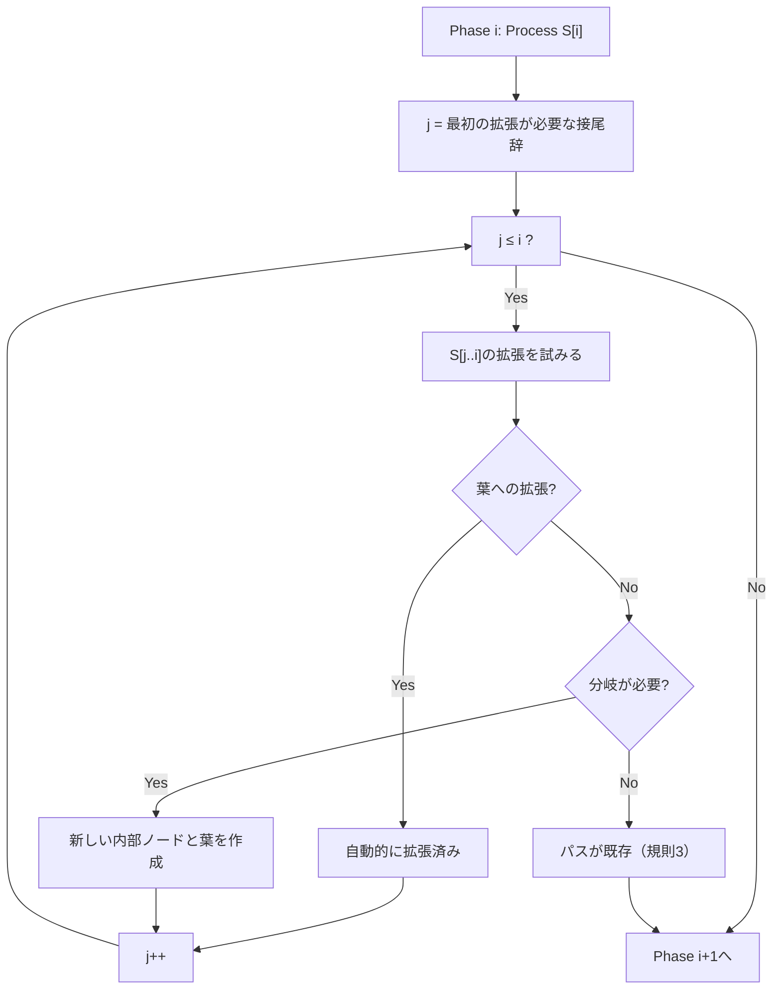
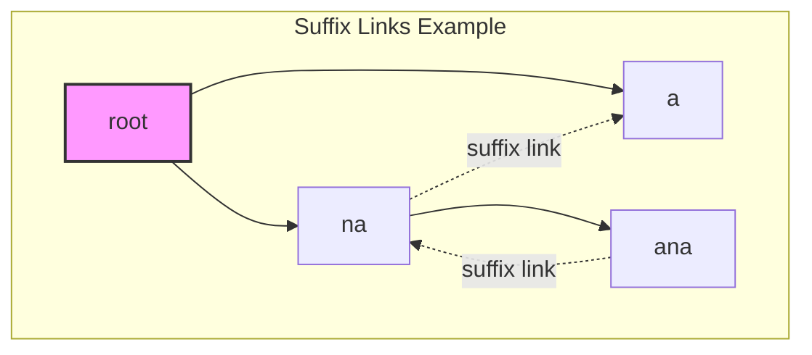

# 接尾辞木

接尾辞木（Suffix Tree）は、文字列の全ての接尾辞を効率的に格納し、様々な文字列処理問題を線形時間で解決可能にする極めて強力なデータ構造である。1973年にWeinerによって最初に提案され[^1]、その後McCreightやUkkonenによって洗練されたアルゴリズムが開発された。接尾辞木は理論的な美しさと実用的な有効性を兼ね備えており、文字列処理の分野において中心的な役割を果たしている。本稿では、接尾辞木の理論的基礎から効率的な構築アルゴリズム、実装の詳細、そして実践的な応用まで体系的に解説する。

## 接尾辞木の定義と基本構造

文字列 $S$ の長さを $n$ とし、$S[i..n-1]$ を位置 $i$ から始まる接尾辞と定義する。接尾辞木は、これら全ての接尾辞を圧縮トライ（compressed trie）として表現したデータ構造である。通常の文字列 $S$ に対しては、末尾に特殊な終端文字 `$`（辞書順で最小の文字）を付加して $S\$$ とすることで、どの接尾辞も他の接尾辞の接頭辞にならないことを保証する。

接尾辞木の各エッジは文字列のラベルを持ち、根から葉へのパスが一つの接尾辞を表現する。重要な特性として、各内部ノードは少なくとも2つの子を持ち、同じノードから出るエッジのラベルの最初の文字は全て異なる。この圧縮により、ノード数は最大でも $2n-1$ に抑えられる。

```mermaid
graph TD
    Root["root"]
    N1[""]
    N2[""]
    N3[""]
    N4[""]
    L1["1"]
    L2["3"]
    L3["0"]
    L4["2"]
    L5["4"]
    
    Root -->|"a"| N1
    Root -->|"na"| N2
    N1 -->|"na"| N3
    N3 -->|"na$"| L1
    N3 -->|"$"| L2
    N1 -->|"$"| L5
    N2 -->|"na$"| L3
    N2 -->|"$"| L4
    
    style Root fill:#f9f,stroke:#333,stroke-width:2px
    style L1 fill:#9f9,stroke:#333,stroke-width:2px
    style L2 fill:#9f9,stroke:#333,stroke-width:2px
    style L3 fill:#9f9,stroke:#333,stroke-width:2px
    style L4 fill:#9f9,stroke:#333,stroke-width:2px
    style L5 fill:#9f9,stroke:#333,stroke-width:2px
```

上図は文字列 "banana" に対する接尾辞木の例である。各葉ノードの数字は対応する接尾辞の開始位置を示している。エッジラベルの圧縮により、木の高さと総ノード数が効率的に制限されている点に注目されたい。

## データ構造の詳細設計

接尾辞木の実装において、エッジラベルを実際の文字列として保持することは非効率的である。代わりに、元の文字列への参照として開始位置と終了位置のペアで表現する。この手法により、空間計算量を $O(n)$ に抑えることができる。

各ノードは以下の情報を保持する：

- 子ノードへのポインタ（通常はハッシュマップまたは配列で実装）
- 親ノードへのポインタ（任意だが、多くの応用で有用）
- エッジラベルの開始位置と終了位置
- suffix link（後述）

エッジの表現において重要な工夫として、葉へのエッジの終了位置を「グローバルな終了位置」として共有する手法がある。これにより、文字列の拡張時に全ての葉エッジを自動的に延長できる。

```cpp
struct Node {
    unordered_map<char, Node*> children;
    Node* parent;
    Node* suffix_link;
    int edge_start;
    int* edge_end;  // Pointer to allow sharing global end
    int suffix_index;  // For leaf nodes
    
    Node(int start, int* end) : 
        edge_start(start), edge_end(end), 
        parent(nullptr), suffix_link(nullptr), 
        suffix_index(-1) {}
        
    int edge_length() {
        return *edge_end - edge_start + 1;
    }
};
```

## Ukkonenのアルゴリズム

接尾辞木の構築アルゴリズムの中で、Ukkonenのアルゴリズム[^2]は最も直感的で実装しやすいとされている。このアルゴリズムは文字列を左から右へ1文字ずつ処理し、各段階で接尾辞木を増分的に更新する。全体の時間計算量は $O(n)$ である。

アルゴリズムの核心は以下の3つの規則による暗黙的な接尾辞木の拡張である：

**規則1（葉の拡張）**: 葉ノードへのパスは、新しい文字を追加することで自動的に拡張される。これは前述のグローバル終了位置の共有により実現される。

**規則2（分岐）**: パスの途中で新しい文字が一致しない場合、その位置で分岐を作成し、既存の接尾辞と新しい接尾辞の両方を表現する。

**規則3（既存）**: 新しい文字を追加したパスが既に存在する場合、何もしない。



## Suffix Linkの概念と重要性

Suffix linkは接尾辞木の効率的な構築と走査において極めて重要な役割を果たす。ノード $v$ が文字列 $x\alpha$（$x$ は文字、$\alpha$ は文字列）を表す場合、$v$ のsuffix linkは文字列 $\alpha$ を表すノードを指す。

Suffix linkの本質的な意味は、ある接尾辞から次の短い接尾辞への効率的な遷移を可能にすることである。Ukkonenのアルゴリズムでは、規則2を適用して新しい内部ノードを作成した際、そのノードから適切なsuffix linkを設定する。



Suffix linkの存在により、文字列の各文字を処理する際の償却時間計算量が $O(1)$ となり、全体として線形時間での構築が保証される。

## Active Pointの管理

Ukkonenのアルゴリズムの実装において、現在処理中の位置を効率的に管理するためにactive pointという概念を用いる。Active pointは以下の3つの要素から構成される：

- **active_node**: 現在のノード
- **active_edge**: active_nodeから出るエッジの最初の文字
- **active_length**: エッジ上での現在位置

この3つ組により、木の任意の位置を $O(1)$ で参照でき、suffix linkを辿る際にも効率的な更新が可能となる。

```cpp
struct ActivePoint {
    Node* node;
    char edge;
    int length;
    
    // Move to next suffix
    void move_to_next_suffix(Node* root) {
        if (node == root && length > 0) {
            length--;
            edge = get_char_at_position();
        } else if (node != root) {
            node = node->suffix_link ? node->suffix_link : root;
        }
    }
};
```

## 時間・空間計算量の詳細分析

接尾辞木の構築における時間計算量 $O(n)$ の証明は、各フェーズでの処理回数の償却解析に基づく。キーとなる観察は、active_lengthの値が各フェーズで最大1増加し、suffix linkを辿る際に減少することである。全体を通じて、active_lengthの増加回数は $O(n)$ であり、減少回数もそれを超えないため、総処理時間は $O(n)$ となる。

空間計算量については、ノード数が最大 $2n-1$ であることから、基本的な構造は $O(n)$ の空間を使用する。ただし、各ノードが文字集合サイズ $\Sigma$ に依存するデータ構造（配列やハッシュマップ）を持つため、実際の空間計算量は $O(n|\Sigma|)$ または $O(n)$（ハッシュマップ使用時の期待値）となる。

## 主要な応用と実装

接尾辞木は多様な文字列処理問題を効率的に解決する。以下に主要な応用を示す：

### パターン検索

長さ $m$ のパターン $P$ が文字列 $S$ に出現するかを $O(m)$ 時間で判定できる。根からパターンに沿って木を辿り、パスが存在すれば出現する。さらに、到達したノードの部分木に含まれる葉の数を数えることで、出現回数も求められる。

### 最長共通部分文字列

複数の文字列の最長共通部分文字列（LCS）を求める問題は、一般化接尾辞木を用いて効率的に解決できる。各文字列に異なる終端文字を付加して連結し、一つの接尾辞木を構築する。その後、各内部ノードについて、その部分木が全ての文字列からの接尾辞を含むかを判定し、条件を満たすノードの中で最も深い文字列長を持つものがLCSとなる。

### 最長繰り返し部分文字列

文字列中で2回以上出現する最長の部分文字列を求める問題も、接尾辞木を用いて線形時間で解決できる。少なくとも2つの葉を持つ内部ノードの中で、最も深い文字列長を持つものが答えとなる。

```cpp
// Find longest repeated substring
string find_longest_repeated_substring(Node* root, const string& text) {
    int max_length = 0;
    int start_index = 0;
    
    function<void(Node*, int)> dfs = [&](Node* node, int depth) {
        if (!node) return;
        
        // Internal node with at least 2 children
        if (node->children.size() >= 2 && depth > max_length) {
            max_length = depth;
            // Calculate start index from path
            start_index = calculate_start_index(node);
        }
        
        for (auto& [ch, child] : node->children) {
            int edge_len = child->edge_length();
            dfs(child, depth + edge_len);
        }
    };
    
    dfs(root, 0);
    return text.substr(start_index, max_length);
}
```

## 実装上の最適化技術

実用的な接尾辞木の実装では、以下の最適化が重要である：

### メモリ使用量の削減

子ノードの管理において、文字集合が小さい場合は配列、大きい場合はハッシュマップを使用する適応的な手法が有効である。また、葉ノードと内部ノードで異なるクラスを使用することで、メモリ使用量を削減できる。

### キャッシュ効率の向上

ノードのメモリレイアウトを工夫し、頻繁にアクセスされるフィールドを近接配置することで、キャッシュミスを減少させる。特に、DFS走査が多い応用では、子ノードを連続メモリに配置することが効果的である。

### 並列化

接尾辞木の構築は本質的に逐次的だが、構築後の処理（複数パターンの検索など）は並列化可能である。また、複数の文字列に対する接尾辞木を独立に構築する場合も並列化の恩恵を受けられる。

## 接尾辞配列との比較

接尾辞配列は接尾辞木と同等の機能を提供しながら、より少ないメモリ使用量で実装できる。主な違いは以下の通りである：

| 特性 | 接尾辞木 | 接尾辞配列 |
|------|----------|------------|
| 空間計算量 | $O(n)$ だが定数項大 | $O(n)$ で定数項小 |
| 構築時間 | $O(n)$ | $O(n)$ または $O(n\log n)$ |
| パターン検索 | $O(m)$ | $O(m\log n)$ |
| LCP配列 | 追加計算必要 | 構築時に同時計算可能 |

実装の複雑さを考慮すると、メモリ制約が厳しい場合や実装の簡潔性を重視する場合は接尾辞配列が、対話的なクエリ処理や複雑な文字列操作が必要な場合は接尾辞木が適している。

## 発展的なトピック

### 動的接尾辞木

文字列の末尾への追加だけでなく、任意の位置での挿入・削除を許容する動的接尾辞木の研究も行われている。これらの構造は、平衡二分探索木の技術を組み合わせることで、更新操作を $O(\log n)$ 時間で実現する。

### 圧縮接尾辞木

大規模なテキストデータに対しては、接尾辞木自体を圧縮する技術が開発されている。Compressed Suffix Tree（CST）は、元のテキストの圧縮表現と簡潔データ構造を組み合わせることで、情報理論的下限に近い空間使用量を達成しながら、主要な操作を効率的に実行できる。

### 外部記憶接尾辞木

主記憶に収まらない巨大な文字列に対しては、外部記憶（ディスク）を効率的に利用する接尾辞木の構築アルゴリズムが必要となる。これらのアルゴリズムは、I/O効率を最適化するために、文字列を適切なブロックに分割し、マージベースの手法を採用する。

## 実装例：基本的な接尾辞木

以下に、Ukkonenのアルゴリズムに基づく接尾辞木の基本実装を示す：

```cpp
class SuffixTree {
private:
    struct Node {
        unordered_map<char, Node*> children;
        Node* suffix_link;
        int start;
        int* end;
        int suffix_index;
        
        Node(int start, int* end) : 
            start(start), end(end), suffix_link(nullptr), suffix_index(-1) {}
            
        int edge_length() {
            return *end - start + 1;
        }
    };
    
    string text;
    Node* root;
    Node* active_node;
    int active_edge;
    int active_length;
    int remaining_suffix_count;
    int leaf_end;
    int* root_end;
    int* split_end;
    int size;
    
public:
    SuffixTree(const string& str) : text(str + "$") {
        size = text.length();
        root_end = new int(-1);
        root = new Node(-1, root_end);
        active_node = root;
        active_edge = -1;
        active_length = 0;
        remaining_suffix_count = 0;
        leaf_end = -1;
        
        for (int i = 0; i < size; i++) {
            extend_suffix_tree(i);
        }
    }
    
    void extend_suffix_tree(int pos) {
        leaf_end = pos;
        remaining_suffix_count++;
        Node* last_new_node = nullptr;
        
        while (remaining_suffix_count > 0) {
            if (active_length == 0) {
                active_edge = pos;
            }
            
            if (active_node->children.find(text[active_edge]) == 
                active_node->children.end()) {
                // Rule 2: Create new leaf edge
                active_node->children[text[active_edge]] = 
                    new Node(pos, &leaf_end);
                    
                if (last_new_node != nullptr) {
                    last_new_node->suffix_link = active_node;
                    last_new_node = nullptr;
                }
            } else {
                Node* next = active_node->children[text[active_edge]];
                if (walk_down(next)) continue;
                
                if (text[next->start + active_length] == text[pos]) {
                    // Rule 3: Character already exists
                    if (last_new_node != nullptr && active_node != root) {
                        last_new_node->suffix_link = active_node;
                        last_new_node = nullptr;
                    }
                    active_length++;
                    break;
                }
                
                // Rule 2: Split edge and create new internal node
                split_end = new int(next->start + active_length - 1);
                Node* split = new Node(next->start, split_end);
                active_node->children[text[active_edge]] = split;
                
                split->children[text[pos]] = new Node(pos, &leaf_end);
                next->start += active_length;
                split->children[text[next->start]] = next;
                
                if (last_new_node != nullptr) {
                    last_new_node->suffix_link = split;
                }
                last_new_node = split;
            }
            
            remaining_suffix_count--;
            if (active_node == root && active_length > 0) {
                active_length--;
                active_edge = pos - remaining_suffix_count + 1;
            } else if (active_node != root) {
                active_node = active_node->suffix_link ? 
                    active_node->suffix_link : root;
            }
        }
    }
    
    bool walk_down(Node* curr_node) {
        int edge_length = curr_node->edge_length();
        if (active_length >= edge_length) {
            active_edge += edge_length;
            active_length -= edge_length;
            active_node = curr_node;
            return true;
        }
        return false;
    }
    
    bool search(const string& pattern) {
        Node* current = root;
        int i = 0;
        
        while (i < pattern.length()) {
            if (current->children.find(pattern[i]) == current->children.end()) {
                return false;
            }
            
            Node* next = current->children[pattern[i]];
            int j = 0;
            
            while (i < pattern.length() && j < next->edge_length() && 
                   text[next->start + j] == pattern[i]) {
                i++;
                j++;
            }
            
            if (j == next->edge_length()) {
                current = next;
            } else if (i == pattern.length()) {
                return true;
            } else {
                return false;
            }
        }
        return true;
    }
};
```

この実装は基本的な機能を提供するが、実用的なシステムでは、エラーハンドリング、メモリ管理の最適化、より高度なクエリ機能などの追加が必要である。

接尾辞木は文字列処理における最も強力なデータ構造の一つであり、その理論的な優雅さと実用的な有効性により、今後も重要な研究対象であり続けるだろう。線形時間での構築と多様な問題への応用可能性は、大規模テキスト処理が重要となる現代において、その価値をさらに高めている。

[^1]: Weiner, P. (1973). "Linear pattern matching algorithms". 14th Annual Symposium on Switching and Automata Theory (swat 1973). pp. 1–11.

[^2]: Ukkonen, E. (1995). "On-line construction of suffix trees". Algorithmica. 14 (3): 249–260.