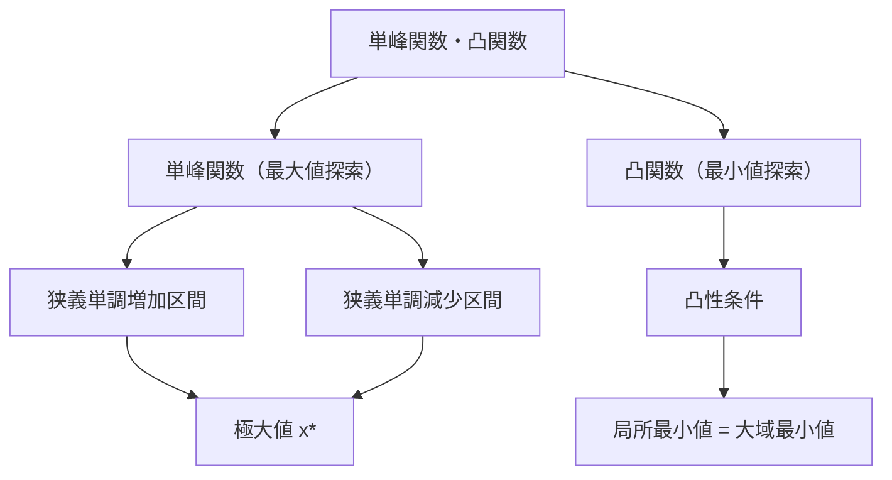
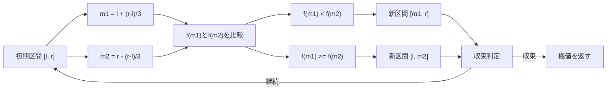
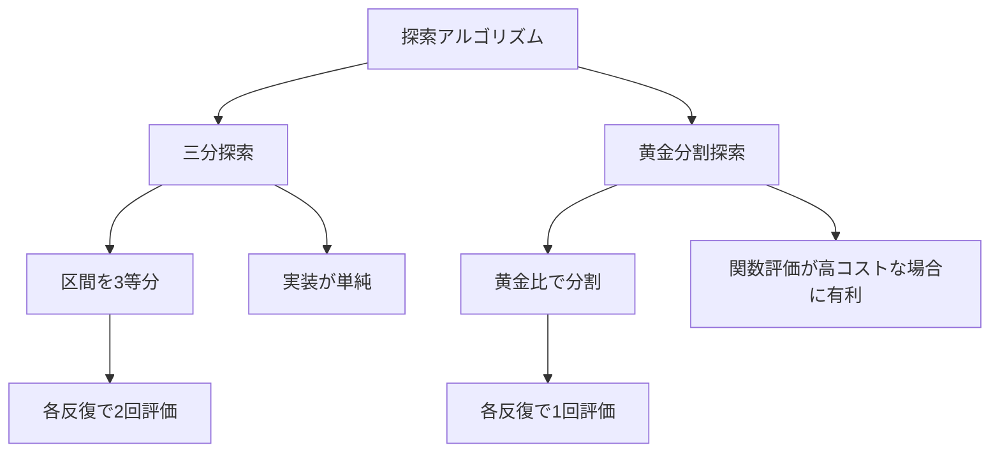
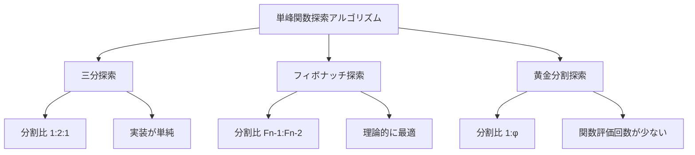

# 三分探索

三分探索は、単峰関数または凸関数の極値を効率的に求めるための探索アルゴリズムである。二分探索が単調関数に対して境界を見つけるのに対し、三分探索は関数の最大値または最小値を探索する。競技プログラミングにおいては、連続関数の最適化問題や離散的な単峰数列の極値探索において頻繁に使用される。

## 単峰関数と凸関数の数学的定義

三分探索を理解するためには、まず単峰関数（unimodal function）の概念を明確にする必要がある。実数の区間 $[a, b]$ 上で定義された関数 $f$ が単峰関数であるとは、ある点 $x^* \in [a, b]$ が存在して、$x < x^*$ のとき $f$ は狭義単調増加し、$x > x^*$ のとき $f$ は狭義単調減少することを意味する[^1]。このとき、$x^*$ は関数の唯一の最大値を与える点となる。

凸関数（convex function）については、より厳密な定義が存在する。関数 $f: \mathbb{R} \rightarrow \mathbb{R}$ が凸関数であるとは、任意の $x, y \in \mathbb{R}$ と $\lambda \in [0, 1]$ に対して、以下の不等式が成り立つことである：

$$f(\lambda x + (1-\lambda)y) \leq \lambda f(x) + (1-\lambda)f(y)$$

この定義は、関数のグラフ上の任意の2点を結ぶ線分が、その区間における関数のグラフより上に位置することを意味する。凸関数の重要な性質として、局所最小値が大域最小値と一致することが挙げられる[^2]。



## 三分探索の基本原理

三分探索のアルゴリズムは、探索区間を3つの部分に分割し、関数値の比較によって極値が存在しない区間を除外していく手法である。具体的には、区間 $[l, r]$ に対して、2つの内分点 $m_1$ と $m_2$ を以下のように設定する：

$$m_1 = l + \frac{r - l}{3}$$
$$m_2 = r - \frac{r - l}{3}$$

これらの点における関数値 $f(m_1)$ と $f(m_2)$ を比較することで、極値の存在範囲を絞り込む。最大値を求める場合、$f(m_1) < f(m_2)$ であれば、最大値は $[m_1, r]$ の区間に存在し、$f(m_1) \geq f(m_2)$ であれば、最大値は $[l, m_2]$ の区間に存在する。

この原理の正当性は、単峰関数の定義から導かれる。$f(m_1) < f(m_2)$ の場合を考えると、もし最大値が $[l, m_1]$ の区間に存在すると仮定すると、単峰性により $m_1$ より右側では関数は狭義単調減少となるはずだが、$f(m_1) < f(m_2)$ という事実と矛盾する。したがって、最大値は $[m_1, r]$ の区間に存在することが保証される。



## アルゴリズムの詳細実装

三分探索の実装において重要なのは、収束条件の設定である。連続関数の場合、区間の幅が十分小さくなったとき、または反復回数が一定値に達したときに探索を終了する。離散的な場合は、区間に含まれる要素数が3以下になったときに線形探索に切り替える。

連続関数に対する三分探索の基本的な実装構造は以下のようになる：

```cpp
double ternary_search(double l, double r, double eps) {
    while (r - l > eps) {
        double m1 = l + (r - l) / 3;
        double m2 = r - (r - l) / 3;
        if (f(m1) < f(m2)) {
            l = m1;
        } else {
            r = m2;
        }
    }
    return (l + r) / 2;
}
```

離散的な場合の実装では、整数の切り捨てによる誤差を考慮する必要がある：

```cpp
int ternary_search_discrete(int l, int r) {
    while (r - l > 2) {
        int m1 = l + (r - l) / 3;
        int m2 = r - (r - l) / 3;
        if (f(m1) < f(m2)) {
            l = m1;
        } else {
            r = m2;
        }
    }
    int res = l;
    for (int i = l + 1; i <= r; i++) {
        if (f(i) > f(res)) res = i;
    }
    return res;
}
```

## 計算量の理論的解析

三分探索の計算量を解析するために、各反復で探索区間がどのように縮小されるかを考察する。初期区間の長さを $L$ とすると、1回の反復後の区間の長さは $\frac{2L}{3}$ となる。したがって、$k$ 回の反復後の区間の長さは：

$$L \cdot \left(\frac{2}{3}\right)^k$$

となる。区間の長さが $\epsilon$ 以下になるまでの反復回数 $k$ は：

$$L \cdot \left(\frac{2}{3}\right)^k \leq \epsilon$$

これを解くと：

$$k \geq \log_{3/2} \frac{L}{\epsilon} = \frac{\log(L/\epsilon)}{\log(3/2)}$$

したがって、三分探索の時間計算量は $O(\log(L/\epsilon))$ となる[^3]。離散的な場合、初期区間に含まれる要素数を $n$ とすると、時間計算量は $O(\log n)$ となる。

## 黄金分割探索との関係

三分探索と密接に関連するアルゴリズムとして、黄金分割探索（golden section search）がある。黄金分割探索は、内分点の選び方を黄金比 $\phi = \frac{1 + \sqrt{5}}{2}$ に基づいて行う手法である。具体的には、区間 $[a, b]$ に対して、内分点を以下のように設定する：

$$c = a + \frac{b - a}{\phi}$$
$$d = b - \frac{b - a}{\phi}$$

黄金分割探索の利点は、次の反復で一方の内分点を再利用できることである。例えば、区間が $[a, d]$ に更新された場合、前回の $c$ が新しい区間の内分点として使用できる。これにより、各反復での関数評価回数を1回に削減できる。



## 数値的安定性と実装上の注意点

三分探索の実装において、数値的な安定性は重要な考慮事項である。特に浮動小数点演算を用いる場合、以下の点に注意が必要である。

まず、収束判定における誤差の扱いである。理論的には区間の幅が0に収束することを期待するが、浮動小数点数の精度限界により、ある程度の誤差 $\epsilon$ を許容する必要がある。この $\epsilon$ の選択は、問題の要求精度と計算機の浮動小数点精度のバランスを考慮して決定される。一般的には、倍精度浮動小数点数の場合、$\epsilon = 10^{-9}$ から $10^{-12}$ の範囲が使用される。

また、関数の評価においても数値誤差が蓄積する可能性がある。特に、関数値の差が微小な場合、比較の結果が数値誤差に影響される可能性がある。このような場合、関数の性質を利用した代替的な判定方法や、高精度演算の使用を検討する必要がある。

離散的な三分探索では、整数の切り捨てによる問題が発生する。区間の長さが3の場合、$m_1$ と $m_2$ が同じ値になる可能性があるため、この境界条件を適切に処理する必要がある。一般的な対処法は、区間の長さが3以下になった時点で線形探索に切り替えることである。

## 二分探索との理論的比較

二分探索と三分探索は、それぞれ異なる問題設定に対して最適化されたアルゴリズムである。二分探索は単調関数に対する境界探索に特化しており、各反復で探索区間を正確に半分に削減する。一方、三分探索は単峰関数の極値探索に特化しており、各反復で探索区間を $\frac{2}{3}$ に削減する。

収束速度の観点から比較すると、二分探索の収束係数は $\frac{1}{2}$、三分探索の収束係数は $\frac{2}{3}$ である。したがって、同じ精度を達成するまでの反復回数は、三分探索の方が約 $\frac{\log 2}{\log(3/2)} \approx 1.71$ 倍多くなる。

しかし、この比較は公平ではない。二分探索が適用可能な問題（単調関数の境界探索）と三分探索が適用可能な問題（単峰関数の極値探索）は本質的に異なるためである。単峰関数の極値探索を二分探索で解こうとすると、導関数の符号を調べる必要があり、これは一般に関数値の評価よりもコストが高い。

## 多次元への拡張

三分探索の概念は、多次元空間における凸関数の最適化にも拡張できる。$n$ 次元空間における凸関数 $f: \mathbb{R}^n \rightarrow \mathbb{R}$ の最小値を求める問題を考える。最も単純なアプローチは、各座標軸に沿って順番に三分探索を適用する座標降下法（coordinate descent）である。

座標降下法では、$i$ 番目の反復において、現在の点 $\mathbf{x}^{(i)} = (x_1^{(i)}, ..., x_n^{(i)})$ から、各座標 $j$ について以下の1次元最適化問題を解く：

$$x_j^{(i+1)} = \arg\min_{x_j} f(x_1^{(i+1)}, ..., x_{j-1}^{(i+1)}, x_j, x_{j+1}^{(i)}, ..., x_n^{(i)})$$

各1次元最適化問題は三分探索により効率的に解くことができる。ただし、この手法の収束性は関数の性質に依存し、一般には大域的最適解への収束が保証されない場合がある[^4]。

より洗練された手法として、勾配法やニュートン法などの最適化アルゴリズムと三分探索を組み合わせる方法がある。例えば、勾配法のステップサイズ決定に三分探索を用いるアプローチは、直線探索（line search）として知られている。

## 実践的な応用例と実装テクニック

競技プログラミングにおいて、三分探索は幾何学的問題や最適化問題で頻繁に使用される。典型的な応用例として、2つの移動する物体間の最短距離を求める問題がある。時刻 $t$ における2つの物体の位置をそれぞれ $\mathbf{p}_1(t)$、$\mathbf{p}_2(t)$ とすると、距離関数 $d(t) = |\mathbf{p}_1(t) - \mathbf{p}_2(t)|$ は、多くの場合単峰関数となる。

別の応用例として、凸多角形内の点から境界までの最短距離を求める問題がある。凸多角形の境界上の点をパラメータ $t \in [0, 1]$ で表現すると、固定点から境界上の点への距離関数は単峰関数となることが示される。

実装上のテクニックとして、関数評価のメモ化が有効な場合がある。特に、関数評価にコストがかかる場合や、同じ点での評価が複数回行われる可能性がある場合、評価結果をキャッシュすることで計算時間を削減できる。

```cpp
map<double, double> memo;
double f_memoized(double x) {
    if (memo.count(x)) return memo[x];
    return memo[x] = f(x);
}
```

また、三分探索の変種として、探索区間の分割比を動的に調整する適応的三分探索がある。関数の曲率に応じて分割比を調整することで、より効率的な収束を実現できる場合がある。

## パラメトリック探索との組み合わせ

三分探索は、パラメトリック探索と組み合わせることで、より複雑な最適化問題を解くことができる。パラメトリック探索は、決定問題を解くアルゴリズムを用いて最適化問題を解く手法である[^5]。

例えば、制約条件付き最適化問題において、制約条件を満たす最大のパラメータ値を求める問題を考える。パラメータ $\lambda$ に対して、制約条件を満たすかどうかを判定する決定問題が効率的に解ける場合、二分探索によって最適な $\lambda$ を求めることができる。さらに、各 $\lambda$ に対して目的関数が単峰性を持つ場合、内側のループで三分探索を用いることで、全体の最適化問題を効率的に解くことができる。

この手法は、計算幾何学における多くの問題に適用される。例えば、与えられた点集合を包含する最小半径の円を求める問題では、半径をパラメータとして二分探索を行い、各半径に対して円の中心位置を三分探索で求めるアプローチが可能である。

## 確率的三分探索

ノイズを含む関数の最適化において、確率的三分探索（stochastic ternary search）が有効な場合がある。観測される関数値が真の関数値にノイズが加わった形で与えられる場合、単純な三分探索では誤った方向に探索が進む可能性がある。

確率的三分探索では、各点での関数値を複数回評価し、その平均値や中央値を用いて比較を行う。また、統計的検定を用いて、2つの点での関数値の差が有意であるかを判定する手法もある。ベイズ最適化の枠組みでは、ガウス過程を用いて関数の事後分布を推定し、期待改善量（expected improvement）に基づいて次の評価点を選択する。

## 計算複雑性理論における位置づけ

三分探索が解く問題の計算複雑性について考察する。連続関数の極値探索問題は、一般に関数の滑らかさや凸性の仮定なしには効率的に解くことができない。実際、任意の連続関数に対して、$\epsilon$-近似解を求めるために必要な関数評価回数の下界は、情報理論的に導出される[^6]。

離散的な単峰数列の極値探索問題は、比較ベースのアルゴリズムにおいて $\Omega(\log n)$ の下界を持つことが示されている。三分探索はこの下界を達成する最適なアルゴリズムの一つである。

並列計算の観点からは、三分探索の並列化は限定的である。各反復において次の探索区間が前の反復の結果に依存するため、反復の並列化は困難である。ただし、多次元の場合の座標降下法では、各座標に対する最適化を並列に実行することが可能である。

## フィボナッチ探索との詳細な比較

フィボナッチ探索（Fibonacci search）は、三分探索と同様に単峰関数の極値を求めるアルゴリズムであるが、分割点の選び方にフィボナッチ数列を用いる点が特徴的である。フィボナッチ数列 $F_n$ を用いて、探索区間を $F_{n-1} : F_{n-2}$ の比率で分割する。

フィボナッチ探索の重要な性質として、探索の各段階で必要な比較回数が最小になることが数学的に証明されている。具体的には、$n$ 個の要素から極値を見つけるのに必要な比較回数の期待値が、すべての分割戦略の中で最小となる。この最適性は、動的計画法の原理を用いて証明される。

実装上の観点から比較すると、フィボナッチ探索は事前にフィボナッチ数列を計算しておく必要があるため、メモリ使用量がわずかに増加する。一方、三分探索は追加のメモリを必要としない。また、浮動小数点演算における数値誤差の影響を考慮すると、三分探索の方が実装が単純で安定している。



## 高度な実装技法と最適化

実践的な三分探索の実装では、単純なアルゴリズムに加えて、以下のような最適化技法を適用することで、より効率的で堅牢な実装を実現できる。

反復回数の上限設定は、無限ループを防ぐために重要である。理論的には収束が保証されていても、数値誤差により収束条件が満たされない場合がある。一般的には、$\log_{3/2}(L/\epsilon)$ の定数倍程度の上限を設定する：

```cpp
const int MAX_ITERATIONS = 100;
double ternary_search_with_limit(double l, double r, double eps) {
    int iterations = 0;
    while (r - l > eps && iterations < MAX_ITERATIONS) {
        double m1 = l + (r - l) / 3;
        double m2 = r - (r - l) / 3;
        if (f(m1) < f(m2)) {
            l = m1;
        } else {
            r = m2;
        }
        iterations++;
    }
    return (l + r) / 2;
}
```

適応的な収束判定では、関数の変化率に基づいて収束を判定する。区間の幅だけでなく、関数値の変化が十分小さくなったときも収束と判定することで、より効率的な探索を実現できる：

```cpp
double adaptive_ternary_search(double l, double r, double eps) {
    double prev_best = f((l + r) / 2);
    while (r - l > eps) {
        double m1 = l + (r - l) / 3;
        double m2 = r - (r - l) / 3;
        double f1 = f(m1), f2 = f(m2);
        
        if (f1 < f2) {
            l = m1;
        } else {
            r = m2;
        }
        
        double curr_best = f((l + r) / 2);
        if (abs(curr_best - prev_best) < eps * abs(curr_best)) {
            break;
        }
        prev_best = curr_best;
    }
    return (l + r) / 2;
}
```

## 競技プログラミングにおける典型問題

三分探索が有効な競技プログラミングの問題として、以下のような典型例がある。

**問題1: 放物線上の点から直線までの最短距離**
放物線 $y = ax^2 + bx + c$ 上の点から、直線 $Ax + By + C = 0$ までの最短距離を求める問題。放物線上の点を $(t, at^2 + bt + c)$ とパラメータ表示すると、距離関数は $t$ に関する単峰関数となる。

**問題2: 円周上の2点間の最適な中継点**
円周上に2つの固定点 $A$, $B$ があり、円周上の点 $P$ を経由して $A$ から $B$ へ移動するとき、移動コストが特定の条件下で単峰性を持つ場合がある。例えば、各区間の移動速度が異なる場合の最短時間問題など。

**問題3: 最適な価格設定問題**
需要関数 $D(p) = a - bp$ と供給コスト $C(q) = cq^2$ が与えられたとき、利益 $\pi(p) = p \cdot D(p) - C(D(p))$ を最大化する価格 $p$ を求める問題。利益関数が単峰性を持つことを確認した上で、三分探索を適用する。

これらの問題では、まず目的関数が単峰性または凸性を持つことを数学的に確認することが重要である。微分を用いた解析的な証明や、二階微分による凸性の確認などを行う。

## 機械学習における応用

三分探索は、機械学習のハイパーパラメータチューニングにおいても有用である。特に、単一のハイパーパラメータに対して、検証誤差が凸関数となる場合に適用できる。

正則化パラメータ $\lambda$ の最適化を考える。多くの機械学習モデルにおいて、$\lambda$ が小さすぎると過学習により検証誤差が大きくなり、$\lambda$ が大きすぎると過少学習により検証誤差が大きくなる。この性質により、検証誤差は $\lambda$ に関して単峰関数となることが多い。

ニューラルネットワークの学習率スケジューリングにおいても、三分探索の概念が応用される。学習率減衰のタイミングを決定する際、検証損失の変化を監視し、単峰性を仮定して最適な減衰タイミングを探索する手法が提案されている。

## 実数値演算における精度管理

浮動小数点演算を用いる三分探索では、数値精度の管理が極めて重要である。IEEE 754標準に基づく倍精度浮動小数点数では、約15-17桁の有効数字を持つが、演算の過程で誤差が蓄積する可能性がある。

相対誤差と絶対誤差の両方を考慮した収束判定を実装することで、より堅牢な探索を実現できる：

```cpp
bool converged(double l, double r, double abs_eps, double rel_eps) {
    double width = r - l;
    double midpoint = (l + r) / 2;
    return width < abs_eps || width < rel_eps * abs(midpoint);
}
```

また、関数評価において catastrophic cancellation（桁落ち）が発生する可能性がある場合、数値的に安定な式に変形することが重要である。例えば、$f(x) = \sqrt{x^2 + 1} - x$ のような関数では、$x$ が大きいときに桁落ちが発生するため、$f(x) = \frac{1}{\sqrt{x^2 + 1} + x}$ という等価な式を使用する。

## 区間縮小戦略の理論的背景

三分探索における区間の分割比 $1:1:1$ は、最悪ケースの性能を最適化する観点から導出される。各反復で区間が $\frac{2}{3}$ に縮小されることを保証するためには、3等分が最適であることが情報理論的に証明されている。

より一般的に、$k$ 分探索を考えると、区間を $k$ 等分して $k-1$ 個の評価点で関数値を比較する。このとき、最悪ケースでの縮小率は $\frac{k-1}{k}$ となる。1回の反復あたりの情報利得を最大化する $k$ の値は、関数評価のコストと収束速度のトレードオフによって決まる。

[^1]: Kiefer, J. (1953). "Sequential minimax search for a maximum". Proceedings of the American Mathematical Society, 4(3), 502-506.

[^2]: Boyd, S., & Vandenberghe, L. (2004). Convex optimization. Cambridge University Press.

[^3]: Avriel, M., & Wilde, D. J. (1966). "Optimality proof for the symmetric Fibonacci search technique". Fibonacci Quarterly, 4, 265-269.

[^4]: Wright, S. J. (2015). "Coordinate descent algorithms". Mathematical Programming, 151(1), 3-34.

[^5]: Megiddo, N. (1983). "Applying parallel computation algorithms in the design of serial algorithms". Journal of the ACM, 30(4), 852-865.

[^6]: Nemirovsky, A. S., & Yudin, D. B. (1983). Problem complexity and method efficiency in optimization. Wiley-Interscience.