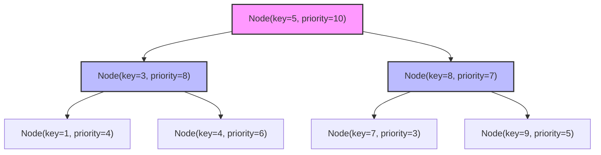
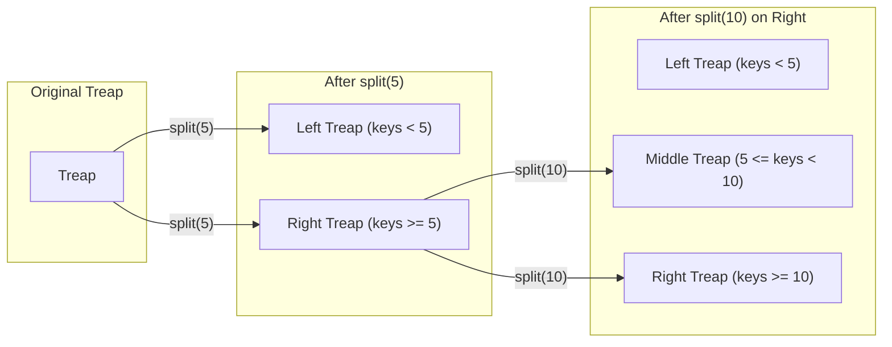
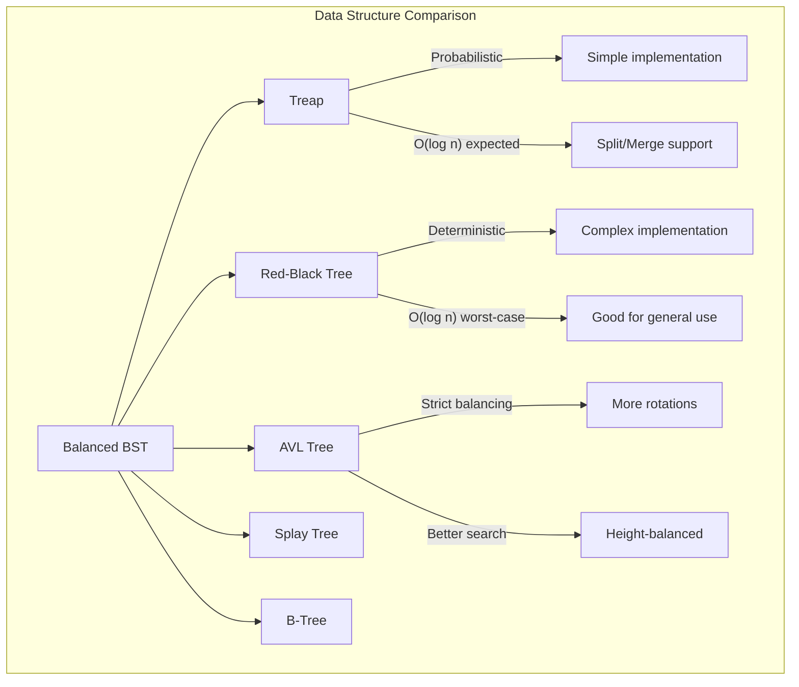

# Treap

Treapは、二分探索木（Binary Search Tree）とヒープ（Heap）の性質を巧妙に組み合わせた確率的平衡二分探索木である。1989年にCecilia R. AragonとRaimund G. Seidel[^1]によって考案されたこのデータ構造は、各ノードがキーと優先度という2つの値を持ち、キーに関しては二分探索木の性質を、優先度に関してはヒープの性質を同時に満たすという独特な構造を持つ。名前の「Treap」は「Tree」と「Heap」を組み合わせた造語であり、その本質を端的に表している。

Treapの最大の特徴は、優先度をランダムに割り当てることで、特別な平衡化操作を行わずとも高い確率で平衡状態を維持できる点にある。これにより、赤黒木やAVL木のような複雑な平衡化アルゴリズムを実装する必要がなく、実装が比較的単純でありながら、期待計算量O(log n)での各種操作を実現できる。さらに、Treapは永続化が容易であり、分割（split）と結合（merge）という2つの基本操作を効率的に実装できるため、区間に対する操作が必要な場面で特に威力を発揮する。



## データ構造の本質

Treapの各ノードは、通常の二分探索木のノードが持つキーに加えて、優先度（priority）と呼ばれる値を保持する。この優先度は通常、ノードの挿入時にランダムに生成される。データ構造全体は以下の2つの不変条件を常に満たす必要がある：

1. **二分探索木の性質**：任意のノードにおいて、左部分木のすべてのノードのキーは現在のノードのキーより小さく、右部分木のすべてのノードのキーは現在のノードのキーより大きい。

2. **ヒープの性質**：任意のノードの優先度は、その子ノードの優先度よりも大きい（最大ヒープの場合）。

この2つの性質を同時に満たすために、Treapでは回転（rotation）操作を用いる。ノードの挿入時には、まず通常の二分探索木と同様にキーに基づいて適切な位置に新しいノードを挿入し、その後、ヒープの性質を満たすように必要に応じて回転操作を行う。削除時も同様に、ヒープの性質を維持しながらノードを削除する。

優先度をランダムに割り当てることの意味は深い。これにより、任意のn個の異なるキーを持つノードから構成されるTreapの形状は、それらのキーの挿入順序に依存せず、優先度の値のみによって一意に決定される。言い換えれば、同じキーと優先度のペアの集合からは、挿入順序に関わらず常に同じ形状のTreapが構築される。この性質は**Treapの一意性**と呼ばれ、Treapの理論的解析において重要な役割を果たす。

## 基本操作の実装

Treapにおける基本操作は、通常の二分探索木の操作に優先度を考慮した調整を加えたものとなる。最も基本的な操作である検索は、通常の二分探索木と全く同じアルゴリズムで実装できる。

### 挿入操作

挿入操作は2段階で行われる。まず、通常の二分探索木と同様に、キーに基づいて新しいノードを葉の位置に挿入する。次に、挿入したノードの優先度がその親ノードの優先度より大きい場合、ヒープの性質を満たすように回転操作を行う。この回転操作は、挿入したノードがヒープの性質を満たす位置に到達するまで繰り返される。

```cpp
struct Node {
    int key;
    int priority;
    Node* left;
    Node* right;
    
    Node(int k) : key(k), priority(rand()), left(nullptr), right(nullptr) {}
};

Node* rotateRight(Node* y) {
    Node* x = y->left;
    Node* T2 = x->right;
    
    x->right = y;
    y->left = T2;
    
    return x;
}

Node* rotateLeft(Node* x) {
    Node* y = x->right;
    Node* T2 = y->left;
    
    y->left = x;
    x->right = T2;
    
    return y;
}

Node* insert(Node* root, int key) {
    if (!root) {
        return new Node(key);
    }
    
    if (key < root->key) {
        root->left = insert(root->left, key);
        if (root->left->priority > root->priority) {
            root = rotateRight(root);
        }
    } else if (key > root->key) {
        root->right = insert(root->right, key);
        if (root->right->priority > root->priority) {
            root = rotateLeft(root);
        }
    }
    
    return root;
}
```

### 削除操作

削除操作も複数の段階で行われる。削除したいノードが見つかったら、そのノードを葉まで回転によって移動させてから削除する。具体的には、削除対象のノードに子がある場合、優先度の高い子を上に持ち上げる回転を行い、削除対象のノードを下に押し下げていく。この操作を削除対象のノードが葉になるまで繰り返し、最後に葉となったノードを削除する。

```cpp
Node* deleteNode(Node* root, int key) {
    if (!root) {
        return root;
    }
    
    if (key < root->key) {
        root->left = deleteNode(root->left, key);
    } else if (key > root->key) {
        root->right = deleteNode(root->right, key);
    } else {
        if (!root->left && !root->right) {
            delete root;
            return nullptr;
        } else if (!root->left) {
            root = rotateLeft(root);
            root->left = deleteNode(root->left, key);
        } else if (!root->right) {
            root = rotateRight(root);
            root->right = deleteNode(root->right, key);
        } else {
            if (root->left->priority > root->right->priority) {
                root = rotateRight(root);
                root->right = deleteNode(root->right, key);
            } else {
                root = rotateLeft(root);
                root->left = deleteNode(root->left, key);
            }
        }
    }
    
    return root;
}
```

## 分割と結合

Treapの真の力は、分割（split）と結合（merge）という2つの操作にある。これらの操作は、Treapを用いて区間に対する様々な操作を効率的に実装する際の基礎となる。

### 分割操作

分割操作は、与えられたキーkを基準として、Treapを2つのTreapに分割する。一方のTreapにはk未満のすべてのキーが含まれ、もう一方のTreapにはk以上のすべてのキーが含まれる。この操作は再帰的に実装でき、各ノードで現在のキーとkを比較し、適切な部分木に対して再帰的に分割を行う。

```cpp
pair<Node*, Node*> split(Node* root, int key) {
    if (!root) {
        return {nullptr, nullptr};
    }
    
    if (root->key < key) {
        auto [left, right] = split(root->right, key);
        root->right = left;
        return {root, right};
    } else {
        auto [left, right] = split(root->left, key);
        root->left = right;
        return {left, root};
    }
}
```

### 結合操作

結合操作は、2つのTreapを1つのTreapに結合する。ただし、結合する2つのTreapは、一方のすべてのキーがもう一方のすべてのキーよりも小さいという前提条件を満たす必要がある。結合は優先度に基づいて行われ、2つのTreapのルートのうち優先度の高い方が新しいTreapのルートとなる。

```cpp
Node* merge(Node* left, Node* right) {
    if (!left) return right;
    if (!right) return left;
    
    if (left->priority > right->priority) {
        left->right = merge(left->right, right);
        return left;
    } else {
        right->left = merge(left, right->left);
        return right;
    }
}
```

これらの分割と結合操作を組み合わせることで、区間の挿入、削除、抽出などの複雑な操作を簡潔に実装できる。例えば、区間[a, b]に含まれるすべての要素を削除する操作は、まずaで分割し、次にb+1で分割し、最後に必要な部分を結合することで実現できる。



## 性能解析

Treapの性能は、その確率的な性質に大きく依存している。優先度がランダムに割り当てられるとき、n個のノードを持つTreapの高さの期待値はO(log n)となることが証明されている[^2]。より正確には、高さの期待値は約2.99 log nであり、分散も小さいことが知られている。

各操作の期待計算量は以下の通りである：

- **検索**: O(log n) - 通常の二分探索木と同じ
- **挿入**: O(log n) - 挿入位置の探索にO(log n)、回転操作の期待回数もO(log n)
- **削除**: O(log n) - 削除位置の探索にO(log n)、回転操作の期待回数もO(log n)
- **分割**: O(log n) - 木の高さに比例
- **結合**: O(log n) - 2つの木の高さの和に比例

最悪計算量については、すべての操作がO(n)となる可能性がある。これは、極めて低い確率ではあるが、ランダムな優先度の割り当てが偏り、木が線形リストのような形状になる場合に発生する。しかし、この確率は指数関数的に小さく、実用上はほとんど問題にならない。

Treapの空間計算量はO(n)である。各ノードはキー、優先度、左右の子へのポインタを保持する必要があるため、ノードあたり一定のメモリを使用する。

## 実装上の考慮事項

実際にTreapを実装する際には、いくつかの重要な考慮事項がある。

### 優先度の生成

優先度の生成には、質の高い乱数生成器を使用することが重要である。C++の場合、`std::mt19937`などのメルセンヌ・ツイスタを使用することが推奨される。また、優先度の範囲は十分に大きくし、衝突の確率を最小限に抑える必要がある。

```cpp
class TreapNode {
private:
    static std::mt19937 rng;
    static std::uniform_int_distribution<int> dist;
    
public:
    int key;
    int priority;
    TreapNode* left;
    TreapNode* right;
    
    TreapNode(int k) : key(k), priority(dist(rng)), left(nullptr), right(nullptr) {}
};

std::mt19937 TreapNode::rng(std::chrono::steady_clock::now().time_since_epoch().count());
std::uniform_int_distribution<int> TreapNode::dist(0, INT_MAX);
```

### メモリ管理

動的メモリ割り当てを頻繁に行うため、メモリ管理には注意が必要である。C++では、スマートポインタの使用やカスタムアロケータの実装を検討すべきである。特に競技プログラミングの文脈では、メモリプールを事前に確保しておくことで、割り当てのオーバーヘッドを削減できる。

### 永続化

Treapは永続データ構造として実装することが比較的容易である。更新時に変更が必要なノードのみをコピーすることで、過去のバージョンを保持しながら新しいバージョンを作成できる。これにより、更新操作の計算量はO(log n)のままで、過去の任意のバージョンにアクセス可能となる。

```cpp
struct PersistentNode {
    int key;
    int priority;
    PersistentNode* left;
    PersistentNode* right;
    
    PersistentNode(int k, int p, PersistentNode* l, PersistentNode* r) 
        : key(k), priority(p), left(l), right(r) {}
};

PersistentNode* insert(PersistentNode* root, int key) {
    if (!root) {
        return new PersistentNode(key, rand(), nullptr, nullptr);
    }
    
    if (key < root->key) {
        PersistentNode* newLeft = insert(root->left, key);
        PersistentNode* newRoot = new PersistentNode(root->key, root->priority, newLeft, root->right);
        if (newLeft->priority > newRoot->priority) {
            // Rotate right
            return new PersistentNode(newLeft->key, newLeft->priority, 
                                      newLeft->left, 
                                      new PersistentNode(newRoot->key, newRoot->priority, 
                                                         newLeft->right, newRoot->right));
        }
        return newRoot;
    } else {
        // Similar for right insertion
    }
}
```

## 発展的な応用

Treapの基本的な機能を拡張することで、より複雑なデータ構造を実現できる。

### 暗黙のTreap（Implicit Treap）

暗黙のTreapは、配列のような順序付きデータを扱うために特化したTreapの変種である。各ノードに明示的なキーを持たせる代わりに、ノードの位置（インデックス）を暗黙的なキーとして使用する。これにより、配列に対する以下の操作を効率的に実行できる：

- 任意の位置への要素の挿入・削除：O(log n)
- 区間の反転：O(log n)
- 区間の循環シフト：O(log n)
- 区間に対する集約クエリ：O(log n)

暗黙のTreapでは、各ノードに部分木のサイズを保持し、これを用いて位置を計算する。分割操作も位置ベースで行われる。

```cpp
struct ImplicitNode {
    int value;
    int priority;
    int size;
    ImplicitNode* left;
    ImplicitNode* right;
    bool reversed;  // For lazy propagation of reversal
    
    ImplicitNode(int v) : value(v), priority(rand()), size(1), 
                          left(nullptr), right(nullptr), reversed(false) {}
};

int getSize(ImplicitNode* node) {
    return node ? node->size : 0;
}

void updateSize(ImplicitNode* node) {
    if (node) {
        node->size = 1 + getSize(node->left) + getSize(node->right);
    }
}

void pushReverse(ImplicitNode* node) {
    if (node && node->reversed) {
        swap(node->left, node->right);
        if (node->left) node->left->reversed ^= 1;
        if (node->right) node->right->reversed ^= 1;
        node->reversed = false;
    }
}

pair<ImplicitNode*, ImplicitNode*> splitBySize(ImplicitNode* root, int k) {
    if (!root) return {nullptr, nullptr};
    
    pushReverse(root);
    int leftSize = getSize(root->left);
    
    if (leftSize < k) {
        auto [left, right] = splitBySize(root->right, k - leftSize - 1);
        root->right = left;
        updateSize(root);
        return {root, right};
    } else {
        auto [left, right] = splitBySize(root->left, k);
        root->left = right;
        updateSize(root);
        return {left, root};
    }
}
```

### 区間更新と遅延評価

セグメント木のように、区間に対する更新操作を効率的に行うために、Treapに遅延評価の機構を組み込むことができる。各ノードに遅延評価のためのタグを持たせ、必要なときにのみ子ノードに伝播させる。

```cpp
struct LazyNode {
    int key;
    int priority;
    int value;
    int lazy_add;  // Lazy propagation for range addition
    int subtree_sum;
    int subtree_size;
    LazyNode* left;
    LazyNode* right;
    
    LazyNode(int k, int v) : key(k), priority(rand()), value(v), 
                             lazy_add(0), subtree_sum(v), subtree_size(1),
                             left(nullptr), right(nullptr) {}
};

void push(LazyNode* node) {
    if (!node || node->lazy_add == 0) return;
    
    node->value += node->lazy_add;
    node->subtree_sum += node->lazy_add * node->subtree_size;
    
    if (node->left) node->left->lazy_add += node->lazy_add;
    if (node->right) node->right->lazy_add += node->lazy_add;
    
    node->lazy_add = 0;
}

void update(LazyNode* node) {
    if (!node) return;
    
    push(node->left);
    push(node->right);
    
    node->subtree_size = 1;
    node->subtree_sum = node->value;
    
    if (node->left) {
        node->subtree_size += node->left->subtree_size;
        node->subtree_sum += node->left->subtree_sum;
    }
    if (node->right) {
        node->subtree_size += node->right->subtree_size;
        node->subtree_sum += node->right->subtree_sum;
    }
}
```

## 他のデータ構造との比較

Treapは平衡二分探索木の一種として、他の同様のデータ構造と比較されることが多い。

### 赤黒木・AVL木との比較

赤黒木やAVL木は決定的な平衡化を行うのに対し、Treapは確率的な平衡化を行う。実装の複雑さという観点では、Treapは回転操作のみで平衡を保つため、赤黒木やAVL木よりも単純である。性能面では、すべて期待計算量O(log n)で同等だが、Treapは最悪計算量がO(n)となる可能性がある。一方、赤黒木とAVL木は最悪でもO(log n)を保証する。

### スプレー木との比較

スプレー木も回転操作を用いる点でTreapと似ているが、アクセスパターンに適応的である点が異なる。スプレー木は最近アクセスされたノードを根に移動させるため、局所性の高いアクセスパターンでは優れた性能を示す。一方、Treapはアクセスパターンに依存しない一様な性能を提供する。

### B木との比較

B木は主にディスクベースのストレージシステムで使用される。各ノードが複数のキーを持つことでディスクI/Oを削減する。Treapは各ノードが1つのキーしか持たないため、メモリ上での操作に適している。永続化の観点では、Treapの方がB木よりも実装が容易である。



## 実装の最適化

実際の応用において、Treapの性能をさらに向上させるためのいくつかの最適化手法がある。

### キャッシュ効率の改善

現代のコンピュータアーキテクチャでは、キャッシュ効率が性能に大きな影響を与える。Treapのノードをメモリプールから連続的に割り当てることで、空間的局所性を改善できる。また、ノード構造体のサイズを最小限に抑え、キャッシュラインに収まるようにすることも重要である。

### 並列化

Treapの分割・結合操作は、独立した部分木に対して並列に実行できる可能性がある。特に、大規模なデータセットを扱う場合、並列化による性能向上が期待できる。ただし、並列化のオーバーヘッドとのトレードオフを考慮する必要がある。

### ハイブリッドアプローチ

小さな部分木に対しては、Treapの操作よりも配列ベースの単純な実装の方が効率的な場合がある。一定のサイズ以下の部分木を配列として管理するハイブリッドアプローチにより、小規模なデータに対する性能を改善できる。

## 理論的な拡張

Treapの理論は、より一般的な確率的データ構造の文脈で研究されている。

### k-Treap

通常のTreapが2分木であるのに対し、k-Treapはk分木への一般化である。各ノードが最大k-1個のキーを持ち、最大k個の子を持つ。これにより、木の高さをさらに低くでき、特定のアプリケーションでは性能向上が期待できる。

### 重み付きTreap

各ノードに重みを割り当て、部分木の重みの和に基づいて操作を行う重み付きTreapも提案されている。これにより、重み付きランダムサンプリングなどの操作を効率的に実装できる。

### 多次元Treap

複数のキーに対して同時に順序を維持する多次元Treapも研究されている。これは、多次元範囲検索などの問題に応用できるが、次元の呪いにより高次元では性能が劣化する。

実装の複雑さと性能のバランス、そして分割・結合という強力な操作を持つTreapは、特に競技プログラミングやアルゴリズム研究の分野で重要な位置を占めている。その確率的な性質は、決定的なアルゴリズムでは達成困難な簡潔さと効率性を両立させており、今後も様々な応用が期待される興味深いデータ構造である。

[^1]: Aragon, C. R., & Seidel, R. G. (1989). Randomized search trees. In Proceedings of the 30th Annual Symposium on Foundations of Computer Science (pp. 540-545). IEEE.

[^2]: Seidel, R., & Aragon, C. R. (1996). Randomized search trees. Algorithmica, 16(4-5), 464-497.