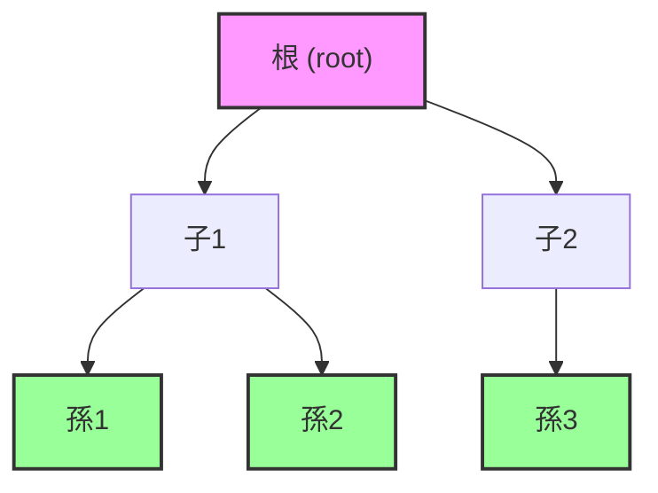
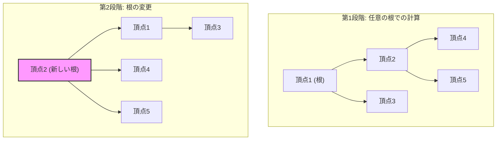
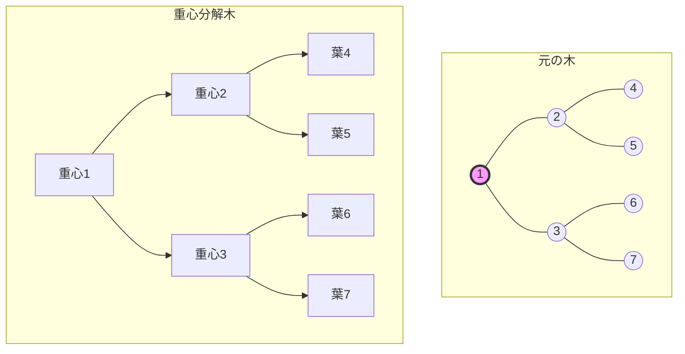

# 木DP（Tree Dynamic Programming）

木構造上での動的計画法、すなわち木DPは、競技プログラミングにおいて頻出する強力な解法パターンである。グラフ理論と動的計画法が交差する領域に位置し、木という特殊な構造の性質を最大限に活用することで、一見複雑に見える問題を効率的に解決する。本稿では、木DPの基本概念から始め、その理論的背景、実装技法、そして応用に至るまでを体系的に解説する。

## 木構造とDPの親和性

木は閉路を持たない連結グラフであり、この性質が動的計画法との相性を極めて良好にしている。一般的なグラフ上でのDPでは、閉路の存在により計算順序の決定が困難になることが多いが、木では任意の頂点を根として選ぶことで、明確な親子関係が定まる。この階層構造により、葉から根へ、あるいは根から葉へという一方向の情報伝播が可能となり、部分問題の重複を効率的に管理できる。



木の重要な性質として、任意の2頂点間を結ぶ道が一意に定まることが挙げられる。この性質により、部分木という概念が明確に定義でき、各部分木に対する最適解を独立に計算できる。動的計画法の基本原理である「最適部分構造」が自然に成立するのである。

## 基本的な木DPの定式化

木DPの基本形は、各頂点vに対して状態dp[v]を定義し、vを根とする部分木に関する何らかの値を計算するものである。最も単純な例として、各頂点に重みが付いた木において、部分木の重みの総和を求める問題を考える。

```cpp
// dp[v] = sum of weights in subtree rooted at v
void dfs(int v, int parent = -1) {
    dp[v] = weight[v];
    for (int u : adj[v]) {
        if (u != parent) {
            dfs(u, v);
            dp[v] += dp[u];
        }
    }
}
```

この例では、深さ優先探索（DFS）を用いて葉から根へ向かって値を集約している。計算順序が自然に定まることが木DPの大きな利点である。

## 根付き木における標準的なDP遷移

根付き木でのDPでは、親子関係が明確であるため、遷移式の定義が比較的容易である。一般的なパターンとして、以下のような形式がよく現れる：

```
dp[v] = f(v, dp[child1], dp[child2], ..., dp[childk])
```

ここでfは問題に応じた集約関数である。例えば、木の最大独立集合問題では、各頂点を選ぶか選ばないかの2状態を管理する必要がある：

```cpp
// dp[v][0] = maximum independent set size in subtree of v, not including v
// dp[v][1] = maximum independent set size in subtree of v, including v
void dfs(int v, int parent = -1) {
    dp[v][0] = 0;
    dp[v][1] = 1;
    for (int u : adj[v]) {
        if (u != parent) {
            dfs(u, v);
            dp[v][0] += max(dp[u][0], dp[u][1]);
            dp[v][1] += dp[u][0];
        }
    }
}
```

この例では、頂点vを選ぶ場合（dp[v][1]）、その子は選べないという制約が自然に表現されている。

## 無向木での全方位木DP

これまでは特定の頂点を根とした根付き木でのDPを扱ってきたが、実際の問題では「各頂点を根としたときの答え」を求める必要がある場合も多い。愚直に各頂点を根としてDPを実行すればO(N²)の計算量となってしまうが、全方位木DP（Rerooting DP）と呼ばれる技法により、O(N)で全頂点の答えを求めることができる。



全方位木DPの基本的なアイデアは、まず任意の頂点（通常は頂点0）を根として通常の木DPを実行し、その後、根を隣接頂点に移動させながら、差分計算により効率的に更新していくというものである。根の変更に伴う部分木の構造変化を適切に処理することが鍵となる。

## 計算量の分析

木DPの計算量は、基本的に以下の要素で決定される：

1. **頂点数N**: 各頂点を一度ずつ訪問する
2. **状態数S**: 各頂点で管理する状態の数
3. **遷移計算量T**: 一つの状態を計算するのに必要な時間

標準的な木DPの計算量はO(N × S × T)となる。多くの場合、Tは子の数に比例するが、木の辺数は N-1 であることから、全体でO(N × S)となることが多い。

メモリ使用量についても同様の分析が可能で、各頂点でS個の状態を保持する必要があるため、空間計算量はO(N × S)となる。ただし、後述するように、特定の条件下では空間計算量を削減できる場合がある。

## 木の直径とDPの応用

木の直径（最も離れた2頂点間の距離）を求める問題は、木DPの典型的な応用例である。この問題には複数のアプローチが存在するが、DPを用いた解法は理解しやすく、拡張性も高い。

各頂点vに対して、「vを通る最長パスの長さ」を計算することを考える。これは、vから下方向への最長パス2本の長さの和として表現できる：

```cpp
// down[v] = longest path from v going down
// diameter = maximum path length in the tree
int diameter = 0;

int dfs(int v, int parent = -1) {
    int first_max = 0, second_max = 0;
    
    for (int u : adj[v]) {
        if (u != parent) {
            int path_length = dfs(u, v) + 1;
            if (path_length > first_max) {
                second_max = first_max;
                first_max = path_length;
            } else if (path_length > second_max) {
                second_max = path_length;
            }
        }
    }
    
    diameter = max(diameter, first_max + second_max);
    return first_max;
}
```

この実装では、各頂点で最長パスと2番目に長いパスを管理し、その和で直径を更新している。

## 木の重心分解とDP

より高度な木DPの技法として、重心分解（Centroid Decomposition）がある。木の重心とは、その頂点を取り除いたときに生じる各連結成分のサイズが元の木のサイズの半分以下になるような頂点である。任意の木には必ず重心が存在し、重心を再帰的に求めることで、木を階層的に分解できる。



重心分解により、木の高さがO(log N)に抑えられるため、パスに関する様々なクエリを効率的に処理できる。特に、「距離がちょうどkである頂点対の数」のような問題では、重心分解とDPを組み合わせることで、O(N log N)の計算量で解くことができる。

## 木上の畳み込みとFFT

木DPにおいて、異なる部分木からの寄与を組み合わせる際に、畳み込み演算が必要になることがある。例えば、「各頂点に色が付いた木において、ちょうどk個の赤い頂点を含む部分木の数」を数える問題を考える。

この種の問題では、子の部分木での赤い頂点数の分布を多項式として表現し、それらの積を計算する必要がある。子の数が多い場合、愚直な実装では計算量が爆発的に増加するが、高速フーリエ変換（FFT）や数論変換（NTT）を用いることで効率化できる¹。

## 木の同型判定とハッシュ

2つの木が同型（構造が同じ）であるかを判定する問題も、木DPの重要な応用である。各頂点に対して、その頂点を根とする部分木の構造を表すハッシュ値を計算することで、効率的な判定が可能となる。

```cpp
// hash[v] = hash value representing subtree structure rooted at v
map<vector<long long>, long long> hash_map;
long long hash_counter = 0;

long long dfs(int v, int parent = -1) {
    vector<long long> child_hashes;
    
    for (int u : adj[v]) {
        if (u != parent) {
            child_hashes.push_back(dfs(u, v));
        }
    }
    
    sort(child_hashes.begin(), child_hashes.end());
    
    if (hash_map.find(child_hashes) == hash_map.end()) {
        hash_map[child_hashes] = hash_counter++;
    }
    
    return hash_map[child_hashes];
}
```

このアプローチでは、子のハッシュ値をソートすることで、子の順序に依存しない同型性を判定している。

## パスクエリと木DP

木上のパスに関するクエリ処理は、競技プログラミングでよく見られる問題設定である。Heavy-Light Decomposition（HLD）やLink-Cut Treeといったデータ構造と組み合わせることで、動的な更新を含む複雑なクエリにも対応できる²。

HLDでは、木を「重い辺」と「軽い辺」に分類し、重い辺で繋がれた頂点列（heavy path）を一つの単位として扱う。各heavy path上では、セグメント木などのデータ構造を用いて効率的にクエリを処理できる。

## 期待値DPと木構造

確率的な要素を含む木上の問題では、期待値DPが有効である。例えば、「各辺が確率pで切断される木において、根から到達可能な頂点数の期待値」を求める問題を考える。

```cpp
// expected[v] = expected number of reachable vertices from v
double dfs(int v, int parent = -1, double prob = 1.0) {
    double result = prob;  // v itself
    
    for (auto [u, edge_prob] : adj[v]) {
        if (u != parent) {
            result += dfs(u, v, prob * edge_prob);
        }
    }
    
    return result;
}
```

この種の問題では、独立性の仮定が重要であり、部分問題の期待値を単純に足し合わせることができる。

## 木DPの最適化技法

実装上の最適化として、以下のような技法が知られている：

**メモリ最適化**: 葉から根への一方向の計算では、子の情報が不要になった時点で解放できる。特に、DFSの帰りがけ順で処理する場合、子の配列を再利用できることがある。

**Small to Large**: 複数の集合をマージする際、小さい方を大きい方にマージすることで、要素の移動回数を削減できる。この技法は、各頂点で集合を管理するような木DPで特に有効である。

**Slope Trick**: 区分線形関数を扱う木DPでは、関数の傾きの変化点のみを管理することで、効率的な実装が可能となる³。

## 実装上の注意点

木DPを実装する際には、以下の点に注意が必要である：

**スタックオーバーフロー**: 深い木では再帰によるスタックオーバーフローが発生する可能性がある。競技プログラミングでは、スタックサイズの制限を緩和するか、非再帰的な実装を検討する必要がある。

**MOD演算**: 答えが大きくなる問題では、適切にMOD演算を行う必要がある。特に、減算を含む場合は負の値にならないよう注意が必要である。

**初期化**: DPテーブルの初期化は、問題によって適切に行う必要がある。特に、最小値・最大値を求める問題では、適切な初期値（INFや-INF）の設定が重要である。

## より高度な木DPパターン

競技プログラミングの上級問題では、以下のような高度なパターンが現れることがある：

**Auxiliary Tree（Virtual Tree）**: クエリで指定された頂点集合に関する問題を解く際、関連する頂点のみを含む補助的な木を構築することで、計算量を削減できる。

**木の同時DFS**: 2つの木を同時に探索しながらDPを行うパターン。木の編集距離などの問題で使用される。

**持続的木DP**: 各頂点での状態を持続的データ構造で管理することで、過去の状態への参照や部分的な更新を効率的に行える。

これらの技法は、基本的な木DPの理解の上に成り立つものであり、問題の特性に応じて適切に選択・組み合わせることが重要である。木構造の美しい性質と動的計画法の強力さが融合した木DPは、アルゴリズム設計における重要な道具として、今後も発展を続けていくだろう。

---

¹ Adamczyk, P., et al. (2017). "Polynomial-time algorithms for solving tree problems using tree decompositions." *Algorithmica*, 79(3), 679-701.

² Sleator, D. D., & Tarjan, R. E. (1985). "Self-adjusting binary search trees." *Journal of the ACM*, 32(3), 652-686.

³ Takaoka, T. (2002). "Efficient algorithms for the maximum subarray problem by distance matrix multiplication." *Electronic Notes in Theoretical Computer Science*, 61, 191-200.