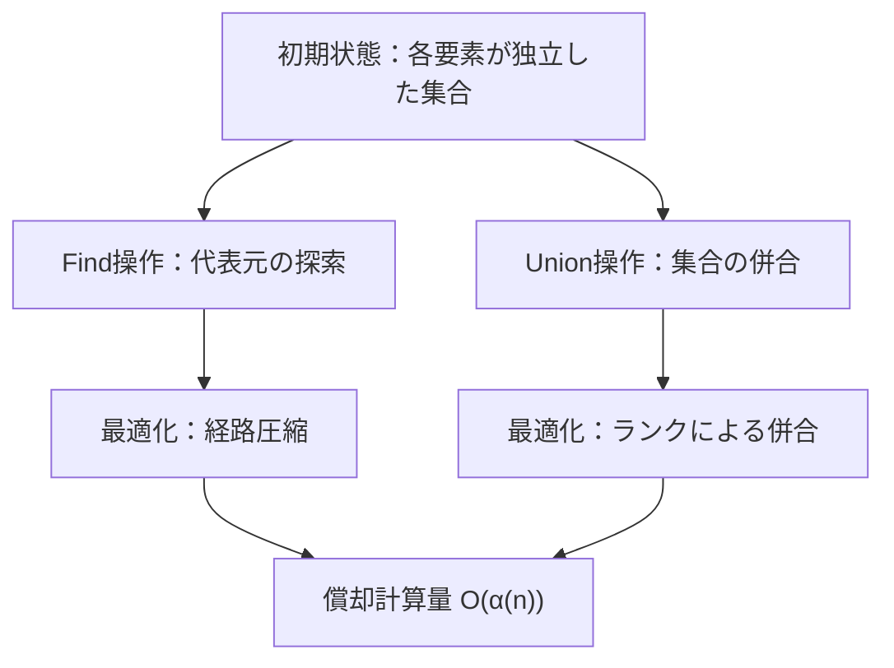
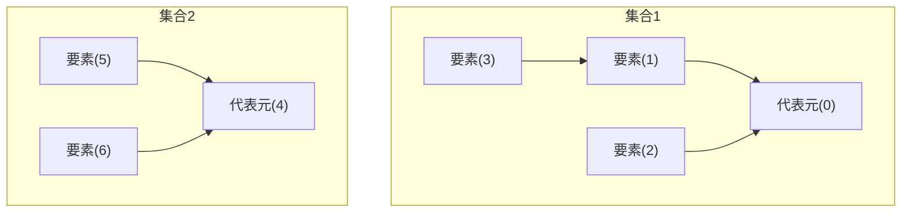
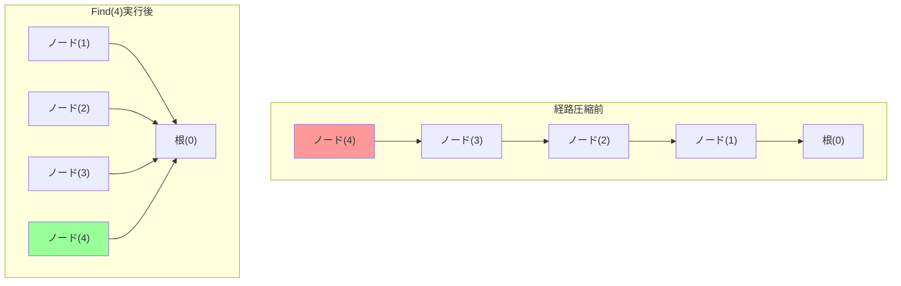
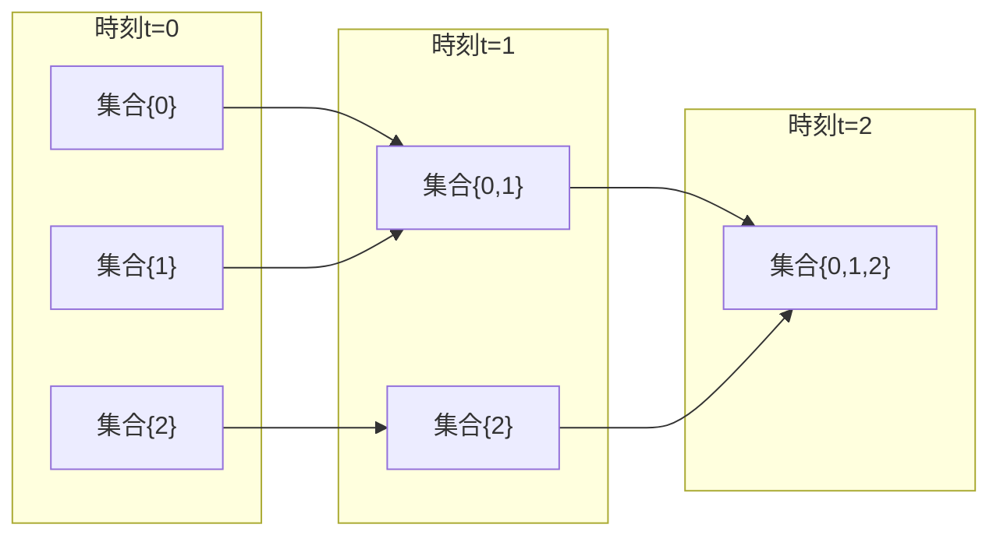

# Union-Find

Union-Find（素集合データ構造、Disjoint Set Union）は、互いに素な集合族を効率的に管理するためのデータ構造である。1964年にBernard A. GallerとMichael J. Fischerによって提案され[^1]、その後Robert Endre TarjanやJ. van Leeuwenらによって理論的な解析が進められた。この構造は、要素の集合への帰属判定と、異なる集合の併合という二つの基本操作を、ほぼ定数時間で実現することを可能にする。

[^1]: Galler, B. A.; Fischer, M. J. (1964), "An improved equivalence algorithm", Communications of the ACM, 7 (5): 301–303

グラフ理論における連結成分の管理、画像処理における領域分割、計算機科学における等価関係の処理など、幅広い応用を持つこのデータ構造は、その単純な実装にもかかわらず極めて高い効率性を実現している。特に、経路圧縮とランクによる併合という二つの最適化手法を組み合わせることで、償却計算量がアッカーマン関数の逆関数という、実用上ほぼ定数とみなせる時間計算量を達成する。



## 理論的基礎と数学的定義

Union-Findが扱う問題は、有限集合 $U = \{0, 1, 2, ..., n-1\}$ に対する動的な同値関係の管理である。同値関係 $\sim$ は以下の三つの性質を満たす：

1. 反射律：$\forall x \in U, x \sim x$
2. 対称律：$\forall x, y \in U, x \sim y \Rightarrow y \sim x$
3. 推移律：$\forall x, y, z \in U, x \sim y \land y \sim z \Rightarrow x \sim z$

この同値関係により、集合 $U$ は互いに素な同値類に分割される。Union-Findは、この分割を動的に管理し、以下の操作を効率的に実行する：

- $\text{MakeSet}(x)$：要素 $x$ のみを含む新しい集合を作成
- $\text{Find}(x)$：要素 $x$ が属する集合の代表元を返す
- $\text{Union}(x, y)$：要素 $x$ と $y$ が属する集合を併合

データ構造の内部表現として、各集合を根付き木として表現する。木の根が集合の代表元となり、各ノードは親へのポインタを持つ。この表現により、Find操作は根への経路探索、Union操作は二つの木の併合として実装される。



## 基本実装と単純な手法

最も単純な実装では、各要素の親を配列で管理する。初期状態では各要素が自身を親とし、独立した集合を形成する。

```cpp
class UnionFind {
private:
    vector<int> parent;
    
public:
    UnionFind(int n) : parent(n) {
        for (int i = 0; i < n; i++) {
            parent[i] = i;  // Each element is its own parent initially
        }
    }
    
    int find(int x) {
        while (parent[x] != x) {
            x = parent[x];  // Follow parent pointers to root
        }
        return x;
    }
    
    void unite(int x, int y) {
        int rootX = find(x);
        int rootY = find(y);
        if (rootX != rootY) {
            parent[rootX] = rootY;  // Make one root point to the other
        }
    }
};
```

この単純な実装では、Find操作の時間計算量は木の高さに比例し、最悪の場合 $O(n)$ となる。Union操作を繰り返すと、線形な連鎖構造が形成される可能性があり、効率が著しく低下する。例えば、$\text{Union}(0, 1), \text{Union}(1, 2), ..., \text{Union}(n-2, n-1)$ という操作列を実行すると、高さ $n$ の線形な木が形成される。

## 経路圧縮による最適化

経路圧縮（Path Compression）は、Find操作の実行時に、探索経路上のすべてのノードを直接根に接続する最適化手法である。これにより、将来のFind操作が高速化される。

```cpp
int find(int x) {
    if (parent[x] != x) {
        parent[x] = find(parent[x]);  // Recursively compress path
    }
    return parent[x];
}
```

経路圧縮の効果は、木の高さを劇的に減少させることにある。$n$ 個の要素に対して $m$ 回の操作を行う場合、経路圧縮のみを使用した場合の計算量は $O(m \log n)$ となる。この解析は、各Find操作が木の高さを半分以下に減少させることに基づいている。

経路圧縮の変種として、経路分割（Path Splitting）や経路半減（Path Halving）がある。経路分割は各ノードを祖父ノードに接続し、経路半減は一つおきにノードを祖父ノードに接続する。これらの手法は再帰を使用せず、反復的に実装できる利点がある。



## ランクによる併合

ランクによる併合（Union by Rank）は、Union操作時に木の高さを最小化する戦略である。各木にランク（高さの上界）を付与し、常に低いランクの木を高いランクの木の子とする。

```cpp
class UnionFind {
private:
    vector<int> parent;
    vector<int> rank;
    
public:
    UnionFind(int n) : parent(n), rank(n, 0) {
        for (int i = 0; i < n; i++) {
            parent[i] = i;
        }
    }
    
    void unite(int x, int y) {
        int rootX = find(x);
        int rootY = find(y);
        
        if (rootX == rootY) return;
        
        if (rank[rootX] < rank[rootY]) {
            parent[rootX] = rootY;
        } else if (rank[rootX] > rank[rootY]) {
            parent[rootY] = rootX;
        } else {
            parent[rootY] = rootX;
            rank[rootX]++;  // Increase rank when heights are equal
        }
    }
};
```

ランクによる併合の重要な性質として、ランク $r$ の木は少なくとも $2^r$ 個のノードを含む。これは数学的帰納法により証明できる。基底：ランク0の木は1個のノード（$2^0 = 1$）を含む。帰納：ランク $r$ の木が形成されるのは、二つのランク $r-1$ の木を併合する場合のみであり、各木は少なくとも $2^{r-1}$ 個のノードを含むため、併合後は少なくとも $2 \times 2^{r-1} = 2^r$ 個のノードを含む。

この性質から、$n$ 個のノードを含む木の最大ランクは $\log n$ であることが導かれる。したがって、ランクによる併合のみを使用した場合、Find操作の時間計算量は $O(\log n)$ となる。

## アッカーマン関数の逆関数と計算量解析

経路圧縮とランクによる併合を組み合わせた場合、Union-Findの償却計算量は $O(\alpha(n))$ となる。ここで $\alpha(n)$ はアッカーマン関数の逆関数である。アッカーマン関数 $A(m, n)$ は以下のように定義される：

$$
A(m, n) = \begin{cases}
n + 1 & \text{if } m = 0 \\
A(m-1, 1) & \text{if } m > 0 \text{ and } n = 0 \\
A(m-1, A(m, n-1)) & \text{if } m > 0 \text{ and } n > 0
\end{cases}
$$

この関数は極めて急速に増加し、$A(4, 4)$ は既に観測可能な宇宙の原子数を超える。逆関数 $\alpha(n)$ は、$A(k, k) \geq n$ となる最小の $k$ として定義される。実用的なすべての $n$ に対して $\alpha(n) \leq 5$ であるため、事実上定数とみなすことができる。

Tarjanによる詳細な解析[^2]では、$m$ 回の操作（MakeSet、Union、Find）を含む任意の操作列に対して、総実行時間は $O(m \alpha(n))$ であることが示されている。この解析は、各ノードに対してポテンシャル関数を定義し、経路圧縮による木の構造変化を追跡することで行われる。

[^2]: Tarjan, R. E. (1975). "Efficiency of a Good But Not Linear Set Union Algorithm". Journal of the ACM. 22 (2): 215–225

## 実装の詳細と設計上の考慮事項

実用的なUnion-Find実装では、いくつかの設計上の選択肢と最適化が存在する。メモリレイアウトの観点から、parentとrankを同じ配列に格納する実装も可能である。負の値でランクを表現し、根ノードのみがランク情報を保持する。

```cpp
class CompactUnionFind {
private:
    vector<int> data;  // Positive: parent, Negative: -rank-1
    
public:
    CompactUnionFind(int n) : data(n, -1) {}
    
    int find(int x) {
        if (data[x] < 0) return x;
        return data[x] = find(data[x]);
    }
    
    void unite(int x, int y) {
        x = find(x);
        y = find(y);
        if (x == y) return;
        
        if (data[x] > data[y]) swap(x, y);  // x has higher rank
        data[x] += data[y];  // Merge sizes
        data[y] = x;
    }
    
    int size(int x) {
        return -data[find(x)];
    }
};
```

この実装では、キャッシュ効率が向上し、メモリ使用量が半減する。また、集合のサイズ情報を同時に管理できる利点がある。負の値の絶対値が集合のサイズを表すため、追加のメモリを使用せずにサイズクエリに対応できる。

並行処理環境でのUnion-Find実装には特別な注意が必要である。Find操作での経路圧縮は木構造を変更するため、読み取り操作でありながら書き込みを伴う。Wait-freeな並行Union-Find[^3]の実装では、CAS（Compare-And-Swap）操作を使用して原子的な更新を保証する。

[^3]: Anderson, R. J.; Woll, H. (1991). "Wait-free parallel algorithms for the union-find problem". Proceedings of the 23rd Annual ACM Symposium on Theory of Computing: 370–380

## 拡張と変種

Union-Findの基本構造は、様々な拡張により異なる問題に適用できる。重み付きUnion-Find（Weighted Union-Find）は、各辺に重みを付与し、二点間の距離や相対的な値を管理する。

```cpp
class WeightedUnionFind {
private:
    vector<int> parent;
    vector<long long> weight;  // Weight from node to parent
    
public:
    WeightedUnionFind(int n) : parent(n), weight(n, 0) {
        for (int i = 0; i < n; i++) {
            parent[i] = i;
        }
    }
    
    pair<int, long long> find(int x) {
        if (parent[x] == x) return {x, 0};
        auto [root, w] = find(parent[x]);
        parent[x] = root;
        weight[x] += w;  // Accumulate weights along path
        return {root, weight[x]};
    }
    
    void unite(int x, int y, long long w) {
        // Unite with constraint: weight[y] - weight[x] = w
        auto [rootX, wx] = find(x);
        auto [rootY, wy] = find(y);
        
        if (rootX == rootY) return;
        
        parent[rootY] = rootX;
        weight[rootY] = wx + w - wy;
    }
};
```

この拡張により、相対的な位置関係や値の差分を効率的に管理できる。例えば、制約充足問題において変数間の関係を表現する際に有用である。

永続Union-Find（Persistent Union-Find）は、過去の任意の時点での状態を保持し、時系列的なクエリに対応する。各操作で新しいバージョンを作成し、パスコピーによる永続化を実現する。この実装では、各操作の計算量は $O(\log n)$ となるが、任意の過去の状態へのアクセスが可能になる。



部分永続性（Partial Persistence）と完全永続性（Full Persistence）の違いは、過去の状態に対する更新操作の可否にある。部分永続Union-Findは過去の状態の参照のみを許可し、完全永続Union-Findは過去の任意の時点から分岐した更新を許可する。

## 実装における最適化技術

現代的なハードウェアアーキテクチャを考慮した最適化として、キャッシュ効率の向上が重要である。経路圧縮の実装において、再帰的な実装は関数呼び出しのオーバーヘッドとスタック使用量の問題がある。反復的な実装により、これらの問題を回避できる。

```cpp
int find(int x) {
    int root = x;
    while (parent[root] != root) {
        root = parent[root];
    }
    // Path compression in second pass
    while (parent[x] != x) {
        int next = parent[x];
        parent[x] = root;
        x = next;
    }
    return root;
}
```

メモリアクセスパターンの最適化として、ホットパス上でのキャッシュミスを減少させることが重要である。parentとrankを別々の配列に格納する場合、Find操作ではparent配列のみにアクセスするため、rank配列によるキャッシュ汚染を避けられる。

SIMD（Single Instruction, Multiple Data）命令を使用した並列化も考慮できる。複数の独立したFind操作を同時に実行する場合、経路探索の一部をベクトル化できる。ただし、経路圧縮による書き込みの依存関係により、完全な並列化は困難である。

## 理論的限界と下界

Union-Find問題に対する計算量の下界については、Fredman and Saksによる研究[^4]が重要である。彼らは、比較ベースのアルゴリズムにおいて、$m$ 回の操作に対して $\Omega(m \alpha(n))$ の下界が存在することを示した。これは、経路圧縮とランクによる併合を組み合わせた手法が理論的に最適であることを意味する。

[^4]: Fredman, M.; Saks, M. (1989). "The cell probe complexity of dynamic data structures". Proceedings of the 21st Annual ACM Symposium on Theory of Computing: 345–354

より強力な計算モデルでは、異なる結果が得られる。RAMモデルでビット演算を許可する場合、Gabow and Tarjanのアルゴリズム[^5]により、特定の条件下で線形時間での処理が可能となる。このアルゴリズムは、マイクロマクロ分解と呼ばれる技術を使用し、小さな部分問題を表引きで解決する。

[^5]: Gabow, H. N.; Tarjan, R. E. (1985). "A linear-time algorithm for a special case of disjoint set union". Journal of Computer and System Sciences. 30 (2): 209–221

動的な操作に加えて削除操作（集合の分割）を許可する場合、問題は著しく困難になる。完全動的な連結性問題では、polylogarithmicな時間での解法が知られているが、Union-Findの単純さと効率性は失われる。

## 実践的な応用と性能特性

グラフアルゴリズムにおいて、Union-FindはKruskalの最小全域木アルゴリズムの中核を成す。辺を重みの昇順にソートし、サイクルを形成しない辺のみを選択する際、連結性の判定にUnion-Findを使用する。$E$ 本の辺と $V$ 個の頂点を持つグラフに対して、時間計算量は $O(E \log E + E \alpha(V))$ となる。

```cpp
struct Edge {
    int u, v, weight;
};

vector<Edge> kruskal(int n, vector<Edge>& edges) {
    sort(edges.begin(), edges.end(), 
         [](const Edge& a, const Edge& b) { return a.weight < b.weight; });
    
    UnionFind uf(n);
    vector<Edge> mst;
    
    for (const auto& e : edges) {
        if (uf.find(e.u) != uf.find(e.v)) {
            uf.unite(e.u, e.v);
            mst.push_back(e);
        }
    }
    
    return mst;
}
```

画像処理における連結成分ラベリングでは、Union-Findを使用して効率的に領域を統合する。2パスアルゴリズムの1パス目で暫定的なラベルを付与し、Union-Findで等価なラベルを管理する。2パス目で最終的なラベルを確定する。

オンラインアルゴリズムとしての性質も重要である。事前にすべての操作が分からない状況でも、Union-Findは効率的に動作する。これは、動的なネットワーク管理や、インクリメンタルなグラフ構築において有用である。

メモリ使用量の観点では、$n$ 個の要素に対して $O(n)$ の空間計算量で済む。これは、隣接行列で連結性を管理する $O(n^2)$ や、各集合を明示的にリストで管理する方法と比較して、大規模なデータセットに対して有利である。

実行時間の定数倍に関して、経路圧縮の実装方法による違いが観測される。再帰的実装は簡潔だが、関数呼び出しのオーバーヘッドがある。反復的実装は高速だが、2パスが必要である。経路半減は1パスで済むが、圧縮が不完全である。実際の応用では、これらのトレードオフを考慮して選択する必要がある。

## プログラミング言語における実装の差異

C++のSTLには標準的なUnion-Find実装は含まれていないが、多くの競技プログラミングライブラリで提供されている。AtCoder LibraryのDSU（Disjoint Set Union）は、経路圧縮とサイズによる併合を実装している。

```cpp
#include <atcoder/dsu>
using namespace atcoder;

dsu uf(n);
uf.merge(x, y);  // Unite
uf.leader(x);    // Find
uf.size(x);      // Size of component
```

Pythonでは、標準ライブラリにUnion-Find実装はないが、NetworkXライブラリで提供されている。また、再帰深度の制限に注意が必要であり、sys.setrecursionlimit()の調整や反復的実装が推奨される。

Javaでは、オブジェクト指向的な実装が一般的である。ジェネリクスを使用して、任意の型の要素を扱えるようにすることができる。ただし、プリミティブ型に対してはオートボクシングのオーバーヘッドが発生する。

関数型言語での実装は、破壊的更新を避ける必要があるため、永続データ構造として実装される。Haskellでは、STモナドを使用して効率的な破壊的更新を実現するか、純粋関数型の永続実装を選択する。

## ハードウェアアーキテクチャとの相互作用

現代のCPUアーキテクチャにおいて、Union-Findの性能はメモリ階層と密接に関連している。経路圧縮によるランダムなメモリアクセスは、キャッシュミスを引き起こしやすい。L1キャッシュのサイズ（通常32-64KB）を考慮すると、数千要素程度まではキャッシュ内に収まる可能性がある。

プリフェッチャーの効果は限定的である。Union-Findのメモリアクセスパターンは本質的に不規則であり、ハードウェアプリフェッチャーが次のアクセス位置を予測することは困難である。ソフトウェアプリフェッチを明示的に行う実装も研究されているが、効果は限定的である。

NUMA（Non-Uniform Memory Access）アーキテクチャでは、メモリの局所性がより重要になる。大規模なUnion-Find構造を複数のNUMAノードに分散させる場合、親子関係が異なるノードにまたがるとアクセスレイテンシが増加する。領域分割や階層的な実装により、この問題を緩和できる。

分岐予測の観点では、Find操作のループ継続条件は予測が困難である。経路の長さは動的に変化し、規則的なパターンを持たない。分岐予測ミスのペナルティを減少させるため、条件付き移動命令（CMOVx）を使用する最適化も考えられる。

## 分散環境での実装

分散システムにおけるUnion-Find実装は、単一マシンでの実装とは異なる課題を持つ。各ノードが部分的な情報のみを保持し、ネットワーク通信により一貫性を保つ必要がある。

MapReduceフレームワークでの実装では、各マッパーがローカルなUnion-Find構造を維持し、リデューサーでグローバルな統合を行う。この際、中間結果のサイズが問題となることがある。Connected Componentsアルゴリズムでは、反復的にUnion操作を適用し、収束するまで繰り返す。

分散合意プロトコルを使用した実装では、各Union操作をトランザクションとして扱い、Raftや
Paxosにより一貫性を保証する。しかし、このアプローチは通信オーバーヘッドが大きく、高頻度な操作には適さない。

CRDTｓ（Conflict-free Replicated Data Types）としてのUnion-Find実装も研究されている。各レプリカが独立に操作を実行し、最終的に一貫性が保証される。Union操作は可換かつ冪等であるため、CRDTとして自然に実装できるが、Find操作の一貫性保証は複雑である。

## 形式的検証と正当性

Union-Findアルゴリズムの正当性は、不変条件の維持により保証される。主要な不変条件として、（1）各要素は正確に一つの集合に属する、（2）parent関係は循環を含まない、（3）各集合は一つの代表元を持つ、がある。

Coqによる形式的検証では、これらの不変条件を型レベルで表現し、各操作が条件を保存することを証明する。特に、経路圧縮が集合の構造を保存することの証明は非自明である。

```coq
Inductive UnionFind : nat -> Type :=
  | UF : forall n, (fin n -> fin n) -> (fin n -> nat) -> UnionFind n.

Definition find_spec {n} (uf : UnionFind n) (x : fin n) :
  {r : fin n | is_root uf r /\ in_same_set uf x r}.
```

モデル検査による検証では、小規模な例に対してすべての可能な実行を網羅的に検査する。TLA+やAlloyを使用した仕様記述により、並行実行時の正当性も検証できる。

実行時検証では、アサーションにより不変条件をチェックする。デバッグビルドでは、各操作後に木構造の健全性を確認し、循環参照や不正な状態を検出する。

## 教育的観点と概念理解

Union-Findは、アルゴリズムとデータ構造の教育において重要な位置を占める。単純な操作から始まり、段階的な最適化により高度な性能を達成する過程は、アルゴリズム設計の本質を示している。

償却解析の概念を学ぶ上でも優れた例である。個々の操作の最悪計算量は大きいが、一連の操作全体では効率的である。ポテンシャル法による解析は、より高度なデータ構造の解析手法を学ぶ基礎となる。

実装の選択肢が豊富であることも教育的価値を高めている。再帰vs反復、配列vs木構造、最適化の有無など、様々なトレードオフを実践的に学べる。

問題解決への応用も多様である。一見無関係な問題がUnion-Findに帰着できることを発見する過程は、アルゴリズム的思考を養う。等価関係、連結性、グループ化など、抽象的な概念を具体的な実装に結びつける能力が育成される。