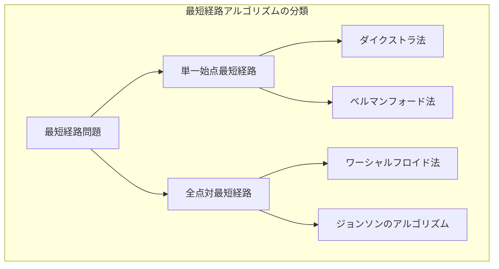
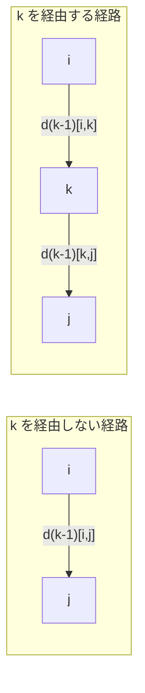
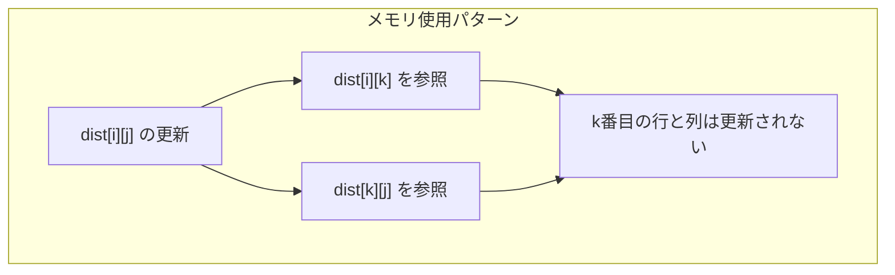
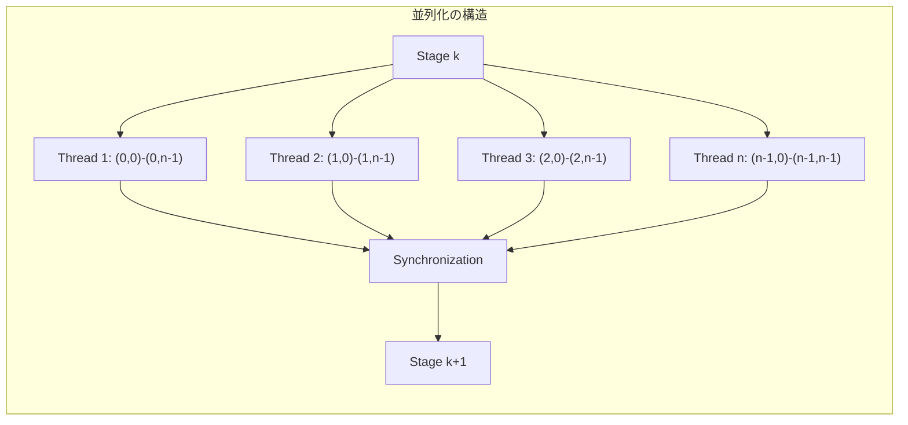

# ワーシャルフロイド法

ワーシャルフロイド法は、重み付きグラフにおける全頂点対間の最短経路を求める動的計画法アルゴリズムである。1959年にBernard Royによって最初に記述され[^1]、1962年にStephen Warshallがグラフの推移閉包を求めるアルゴリズムとして発表し[^2]、同年Robert Floydが最短経路問題への応用を示した[^3]ことから、この名称で呼ばれている。本アルゴリズムは、その簡潔な実装と汎用性の高さから、競技プログラミングや実務において頻繁に使用される基本的なグラフアルゴリズムの一つとなっている。

グラフ理論における最短経路問題は、ネットワーク設計、経路探索、リソース最適化など多岐にわたる応用を持つ基本的な問題である。単一始点最短経路を求めるダイクストラ法やベルマンフォード法と異なり、ワーシャルフロイド法は全頂点対間の最短経路を一度に計算する。この特性により、頂点数が比較的小さく、全ての頂点対間の距離情報が必要な場合に特に有効である。



## 数学的基礎と理論的背景

ワーシャルフロイド法の理論的基礎は、最短経路の最適部分構造性にある。頂点 $i$ から頂点 $j$ への最短経路が存在し、その経路が中間頂点 $k$ を経由する場合、$i$ から $k$ への部分経路および $k$ から $j$ への部分経路もそれぞれ最短経路でなければならない。この性質を利用して、動的計画法により効率的に全頂点対間の最短経路を計算する。

グラフ $G = (V, E)$ において、頂点集合 $V = \{1, 2, ..., n\}$ とし、辺 $(i, j) \in E$ の重みを $w(i, j)$ とする。ここで、$d^{(k)}_{ij}$ を「頂点集合 $\{1, 2, ..., k\}$ の頂点のみを中間頂点として使用可能な場合の、頂点 $i$ から頂点 $j$ への最短経路長」と定義する。

初期状態では、中間頂点を使用しない場合の距離として：

$$
d^{(0)}_{ij} = \begin{cases}
0 & \text{if } i = j \\
w(i, j) & \text{if } (i, j) \in E \\
\infty & \text{otherwise}
\end{cases}
$$

次に、頂点 $k$ を新たに中間頂点として使用可能にした場合を考える。頂点 $i$ から頂点 $j$ への最短経路は、以下の2つのケースのいずれかとなる：

1. 頂点 $k$ を経由しない場合：$d^{(k-1)}_{ij}$
2. 頂点 $k$ を経由する場合：$d^{(k-1)}_{ik} + d^{(k-1)}_{kj}$

これらの最小値を取ることで、漸化式が得られる：

$$
d^{(k)}_{ij} = \min(d^{(k-1)}_{ij}, d^{(k-1)}_{ik} + d^{(k-1)}_{kj})
$$

この漸化式を $k = 1$ から $k = n$ まで順に計算することで、最終的に $d^{(n)}_{ij}$ として全頂点対間の最短経路長が得られる。



## アルゴリズムの詳細な動作原理

ワーシャルフロイド法の本質は、中間頂点として使用可能な頂点集合を段階的に拡張していく点にある。各段階 $k$ において、新たに頂点 $k$ を中間頂点として使用できるようになったときに、全ての頂点対 $(i, j)$ について最短経路が更新される可能性を検討する。

アルゴリズムの実行過程を具体的に追跡すると、3重ループの最外側ループが中間頂点 $k$ を制御し、内側の2重ループが全ての頂点対 $(i, j)$ を走査する構造となっている。この順序は極めて重要であり、もし頂点対のループを外側に配置すると、正しい結果が得られない。

```python
def warshall_floyd(n, edges):
    # Initialize distance matrix
    INF = float('inf')
    dist = [[INF] * n for _ in range(n)]
    
    # Set initial distances
    for i in range(n):
        dist[i][i] = 0
    
    for u, v, w in edges:
        dist[u][v] = min(dist[u][v], w)
    
    # Main algorithm
    for k in range(n):
        for i in range(n):
            for j in range(n):
                if dist[i][k] != INF and dist[k][j] != INF:
                    dist[i][j] = min(dist[i][j], dist[i][k] + dist[k][j])
    
    return dist
```

この実装において、`dist[i][k] != INF and dist[k][j] != INF` の条件チェックは、数値オーバーフローを防ぐために重要である。無限大の値に有限の値を加算すると、実装によっては予期しない動作を引き起こす可能性がある。

アルゴリズムの正当性は数学的帰納法により証明できる。基底ケースとして、$k = 0$ の場合は隣接行列そのものであり、明らかに正しい。帰納的ステップとして、$k-1$ までの頂点を中間頂点として使用した場合の最短経路が正しく計算されていると仮定すると、頂点 $k$ を新たに使用可能にした場合も、前述の漸化式により正しく計算される。

## 負の閉路の検出と取り扱い

ワーシャルフロイド法の重要な応用の一つが、グラフ中の負の閉路の検出である。負の閉路とは、辺の重みの総和が負となる閉路のことであり、このような閉路が存在する場合、その閉路を何度も通ることで経路長を無限に小さくできるため、最短経路が定義できなくなる。

ワーシャルフロイド法では、アルゴリズム実行後に対角成分 $d_{ii}$ を確認することで負の閉路を検出できる。通常、任意の頂点 $i$ から自分自身への最短経路長は0であるべきだが、負の閉路が存在する場合、$d_{ii} < 0$ となる頂点 $i$ が存在する。

```python
def detect_negative_cycle(dist):
    n = len(dist)
    for i in range(n):
        if dist[i][i] < 0:
            return True
    return False

def find_vertices_affected_by_negative_cycle(dist):
    n = len(dist)
    INF = float('inf')
    affected = [[False] * n for _ in range(n)]
    
    # Find all vertices on negative cycles
    for i in range(n):
        if dist[i][i] < 0:
            for j in range(n):
                for k in range(n):
                    if dist[j][i] != INF and dist[i][k] != INF:
                        affected[j][k] = True
    
    return affected
```

負の閉路が存在する場合、その閉路から到達可能な全ての頂点への最短経路も定義できなくなる。このため、実用的なアプリケーションでは、負の閉路の存在を事前に検出し、適切に処理する必要がある。

## 経路復元の実装

ワーシャルフロイド法では最短経路長だけでなく、実際の経路も復元できる。これには、各頂点対について「次に訪れるべき頂点」を記録する補助配列を使用する方法が一般的である。

```python
def warshall_floyd_with_path(n, edges):
    INF = float('inf')
    dist = [[INF] * n for _ in range(n)]
    next_vertex = [[None] * n for _ in range(n)]
    
    # Initialize
    for i in range(n):
        dist[i][i] = 0
        next_vertex[i][i] = i
    
    for u, v, w in edges:
        if w < dist[u][v]:
            dist[u][v] = w
            next_vertex[u][v] = v
    
    # Main algorithm
    for k in range(n):
        for i in range(n):
            for j in range(n):
                if dist[i][k] != INF and dist[k][j] != INF:
                    if dist[i][k] + dist[k][j] < dist[i][j]:
                        dist[i][j] = dist[i][k] + dist[k][j]
                        next_vertex[i][j] = next_vertex[i][k]
    
    return dist, next_vertex

def reconstruct_path(next_vertex, start, end):
    if next_vertex[start][end] is None:
        return None  # No path exists
    
    path = [start]
    current = start
    while current != end:
        current = next_vertex[current][end]
        path.append(current)
    
    return path
```

この実装では、`next_vertex[i][j]` は頂点 $i$ から頂点 $j$ への最短経路において、頂点 $i$ の次に訪れるべき頂点を保持している。経路復元時は、この情報を辿ることで最短経路を構築できる。

## 空間計算量の最適化

標準的なワーシャルフロイド法の実装では $O(n^2)$ の空間計算量が必要だが、実は同じ配列を更新し続けることで、追加の空間を使用せずにアルゴリズムを実行できる。これは、更新式の特性によるものである。

```python
def warshall_floyd_in_place(dist):
    n = len(dist)
    
    for k in range(n):
        for i in range(n):
            for j in range(n):
                dist[i][j] = min(dist[i][j], dist[i][k] + dist[k][j])
    
    return dist
```

この最適化が可能な理由は、$d^{(k)}_{ik}$ と $d^{(k)}_{kj}$ の値が実は $d^{(k-1)}_{ik}$ と $d^{(k-1)}_{kj}$ と等しいためである。なぜなら、頂点 $i$ から頂点 $k$ への最短経路において頂点 $k$ を中間頂点として使用することは無意味（同じ頂点を2回通ることになる）だからである。



## 他の最短経路アルゴリズムとの比較

ワーシャルフロイド法と他の最短経路アルゴリズムを比較すると、それぞれに長所と短所があることがわかる。

ダイクストラ法は単一始点最短経路問題に特化しており、非負の辺重みに対して $O((|E| + |V|) \log |V|)$ の時間計算量で動作する。全頂点対最短経路を求めるには、各頂点を始点として $|V|$ 回実行する必要があり、全体で $O(|V|(|E| + |V|) \log |V|)$ となる。密なグラフ（$|E| = O(|V|^2)$）では $O(|V|^3 \log |V|)$ となり、ワーシャルフロイド法の $O(|V|^3)$ より劣る。

ベルマンフォード法は負の辺重みも扱えるが、単一始点に対して $O(|V||E|)$ の時間計算量を要する。全頂点対では $O(|V|^2|E|)$ となり、密なグラフでは $O(|V|^4)$ となるため、ワーシャルフロイド法より大幅に遅い。

ジョンソンのアルゴリズムは、ベルマンフォード法とダイクストラ法を組み合わせたアルゴリズムで、負の辺重みを含むグラフに対して $O(|V|^2 \log |V| + |V||E|)$ で全頂点対最短経路を求める。疎なグラフではワーシャルフロイド法より高速だが、実装が複雑である。

```python
# Comparison of time complexities
def analyze_algorithms(V, E):
    # Floyd-Warshall
    fw_time = V ** 3
    
    # Dijkstra (all pairs)
    dijkstra_time = V * (E + V) * math.log(V)
    
    # Bellman-Ford (all pairs)
    bf_time = V * V * E
    
    # Johnson's algorithm
    johnson_time = V * V * math.log(V) + V * E
    
    return {
        "Floyd-Warshall": fw_time,
        "Dijkstra (all pairs)": dijkstra_time,
        "Bellman-Ford (all pairs)": bf_time,
        "Johnson's": johnson_time
    }
```

実装の簡潔性という観点では、ワーシャルフロイド法は3重ループという極めてシンプルな構造を持ち、バグが入り込む余地が少ない。これは競技プログラミングや、信頼性が重要なシステムにおいて大きな利点となる。

## 実践的な応用と最適化テクニック

ワーシャルフロイド法は、その汎用性から様々な問題に応用できる。代表的な応用例として、推移閉包の計算、グラフの直径（最も離れた頂点対の距離）の計算、中心性の計算などがある。

推移閉包は、「頂点 $i$ から頂点 $j$ へ到達可能か」という情報を全頂点対について求める問題である。これは、距離の代わりに到達可能性を伝播させることで解ける：

```python
def transitive_closure(n, edges):
    # Initialize reachability matrix
    reach = [[False] * n for _ in range(n)]
    
    # Self-reachability
    for i in range(n):
        reach[i][i] = True
    
    # Direct edges
    for u, v in edges:
        reach[u][v] = True
    
    # Floyd-Warshall for reachability
    for k in range(n):
        for i in range(n):
            for j in range(n):
                reach[i][j] = reach[i][j] or (reach[i][k] and reach[k][j])
    
    return reach
```

グラフの直径を求める場合、全頂点対間の最短距離の最大値を計算する：

```python
def graph_diameter(dist):
    n = len(dist)
    INF = float('inf')
    diameter = 0
    
    for i in range(n):
        for j in range(n):
            if i != j and dist[i][j] != INF:
                diameter = max(diameter, dist[i][j])
    
    return diameter if diameter > 0 else INF
```

実装上の最適化として、ビット演算を用いた高速化がある。特に、推移閉包の計算では、到達可能性をビットマスクで表現することで、複数の頂点への到達可能性を同時に更新できる：

```python
def transitive_closure_bitwise(n, edges):
    # Using bit manipulation for sets of vertices
    reach = [0] * n
    
    # Initialize with direct edges and self-loops
    for i in range(n):
        reach[i] |= (1 << i)
    
    for u, v in edges:
        reach[u] |= (1 << v)
    
    # Floyd-Warshall with bitwise operations
    for k in range(n):
        for i in range(n):
            if reach[i] & (1 << k):
                reach[i] |= reach[k]
    
    return reach
```

キャッシュ効率を考慮した実装も重要である。3重ループの順序は数学的には固定されているが、内側2つのループの順序を工夫することで、キャッシュヒット率を向上させることができる：

```python
def warshall_floyd_cache_optimized(dist):
    n = len(dist)
    
    for k in range(n):
        for i in range(n):
            if dist[i][k] == float('inf'):
                continue
            for j in range(n):
                if dist[k][j] != float('inf'):
                    dist[i][j] = min(dist[i][j], dist[i][k] + dist[k][j])
    
    return dist
```

この実装では、`dist[i][k]` が無限大の場合に内側のループをスキップすることで、不要な計算を削減している。

## 実数重みと数値誤差の取り扱い

辺の重みが実数の場合、浮動小数点演算の誤差が問題となることがある。特に、経路長の比較において、理論的には等しいはずの値が数値誤差により異なる値として扱われる可能性がある。

```python
def warshall_floyd_with_tolerance(dist, eps=1e-9):
    n = len(dist)
    
    for k in range(n):
        for i in range(n):
            for j in range(n):
                new_dist = dist[i][k] + dist[k][j]
                if new_dist < dist[i][j] - eps:  # Consider numerical errors
                    dist[i][j] = new_dist
    
    return dist
```

実数重みを扱う場合は、問題の性質に応じて適切な許容誤差を設定する必要がある。また、可能であれば、重みを整数にスケーリングして計算することで、数値誤差を完全に回避できる。

## 並列化とGPU実装

ワーシャルフロイド法の並列化は、アルゴリズムの構造上、完全な並列化は困難だが、部分的な並列化は可能である。各段階 $k$ において、異なる頂点対 $(i, j)$ の更新は独立して実行できるため、内側の2重ループを並列化できる。

```python
import multiprocessing
from functools import partial

def update_row(k, dist, i):
    n = len(dist)
    row_updates = []
    for j in range(n):
        new_val = min(dist[i][j], dist[i][k] + dist[k][j])
        if new_val < dist[i][j]:
            row_updates.append((j, new_val))
    return i, row_updates

def warshall_floyd_parallel(dist, num_processes=None):
    n = len(dist)
    if num_processes is None:
        num_processes = multiprocessing.cpu_count()
    
    with multiprocessing.Pool(num_processes) as pool:
        for k in range(n):
            # Parallelize row updates
            partial_update = partial(update_row, k, dist)
            results = pool.map(partial_update, range(n))
            
            # Apply updates
            for i, updates in results:
                for j, new_val in updates:
                    dist[i][j] = new_val
    
    return dist
```

GPU実装では、各頂点対の更新を異なるスレッドに割り当てることで、大規模な並列性を活用できる。ただし、メモリアクセスパターンが不規則なため、共有メモリの活用やメモリコアレッシングの最適化が重要となる。



## 動的グラフへの対応

実際のアプリケーションでは、グラフが時間とともに変化する場合がある。辺の追加や削除、重みの変更に対して、毎回ワーシャルフロイド法を最初から実行するのは非効率である。

辺の重みが減少する場合の更新は比較的単純である。辺 $(u, v)$ の重みが $w$ に減少した場合、この辺を経由する新たな最短経路が生まれる可能性がある：

```python
def update_edge_decrease(dist, u, v, new_weight):
    n = len(dist)
    
    if new_weight >= dist[u][v]:
        return  # No update needed
    
    dist[u][v] = new_weight
    
    # Update all pairs that might benefit from this edge
    for i in range(n):
        for j in range(n):
            if dist[i][u] != float('inf') and dist[v][j] != float('inf'):
                dist[i][j] = min(dist[i][j], dist[i][u] + new_weight + dist[v][j])
```

辺の重みが増加する場合や辺が削除される場合は、より複雑な処理が必要となる。影響を受ける可能性のある全ての経路を再計算する必要があり、最悪の場合は全体の再計算と同等の計算量となる。

## メモリ階層を考慮した実装

現代のコンピュータアーキテクチャでは、メモリアクセスパターンが性能に大きく影響する。ワーシャルフロイド法の標準的な実装は、メモリアクセスが不規則になりやすく、キャッシュ効率が悪い。

ブロック化による最適化は、行列をより小さなブロックに分割し、各ブロック内での計算を完了してから次のブロックに移ることで、キャッシュ局所性を向上させる：

```python
def warshall_floyd_blocked(dist, block_size=64):
    n = len(dist)
    
    # Process in blocks
    for kb in range(0, n, block_size):
        ke = min(kb + block_size, n)
        
        # Phase 1: Update block diagonal
        for k in range(kb, ke):
            for i in range(kb, ke):
                for j in range(kb, ke):
                    dist[i][j] = min(dist[i][j], dist[i][k] + dist[k][j])
        
        # Phase 2: Update block row and column
        for k in range(kb, ke):
            # Update rows
            for i in range(n):
                if i < kb or i >= ke:
                    for j in range(kb, ke):
                        dist[i][j] = min(dist[i][j], dist[i][k] + dist[k][j])
            
            # Update columns
            for i in range(kb, ke):
                for j in range(n):
                    if j < kb or j >= ke:
                        dist[i][j] = min(dist[i][j], dist[i][k] + dist[k][j])
        
        # Phase 3: Update remaining blocks
        for k in range(kb, ke):
            for i in range(n):
                if i < kb or i >= ke:
                    for j in range(n):
                        if j < kb or j >= ke:
                            dist[i][j] = min(dist[i][j], dist[i][k] + dist[k][j])
    
    return dist
```

## 理論的な拡張と一般化

ワーシャルフロイド法の基本的なアイデアは、より一般的な代数的構造に拡張できる。半環（semiring）上での最短経路問題として定式化することで、様々な問題を統一的に扱える。

半環 $(S, \oplus, \otimes)$ において、$\oplus$ は最小値演算に対応し、$\otimes$ は加算に対応する。この枠組みでは、通常の最短経路問題は $(\mathbb{R} \cup \{\infty\}, \min, +)$ という半環上の問題として表現される。

他の半環の例として、信頼性最大化問題では $([0, 1], \max, \times)$ を使用し、ボトルネック最短経路問題では $(\mathbb{R} \cup \{-\infty\}, \max, \min)$ を使用する：

```python
class SemiringFloydWarshall:
    def __init__(self, combine, extend, neutral_combine, neutral_extend):
        self.combine = combine  # ⊕ operation
        self.extend = extend    # ⊗ operation
        self.neutral_combine = neutral_combine  # Identity for ⊕
        self.neutral_extend = neutral_extend    # Identity for ⊗
    
    def compute(self, n, initial_weights):
        # Initialize distance matrix
        dist = [[self.neutral_combine for _ in range(n)] for _ in range(n)]
        
        # Set diagonal and initial weights
        for i in range(n):
            dist[i][i] = self.neutral_extend
        
        for u, v, w in initial_weights:
            dist[u][v] = self.combine(dist[u][v], w)
        
        # Floyd-Warshall algorithm
        for k in range(n):
            for i in range(n):
                for j in range(n):
                    dist[i][j] = self.combine(
                        dist[i][j],
                        self.extend(dist[i][k], dist[k][j])
                    )
        
        return dist

# Example: Maximum reliability path
def max_reliability_path(n, edges):
    fw = SemiringFloydWarshall(
        combine=max,
        extend=lambda x, y: x * y,
        neutral_combine=0,
        neutral_extend=1
    )
    return fw.compute(n, edges)
```

この一般化により、ワーシャルフロイド法の適用範囲が大幅に広がり、ネットワークフロー、行列の累乗、正規表現のマッチングなど、一見無関係に見える問題にも応用できる。

ワーシャルフロイド法は、その簡潔さと汎用性により、グラフアルゴリズムの中でも特に重要な位置を占めている。$O(n^3)$ という時間計算量は、頂点数が大きい場合には制約となるが、その実装の容易さと、負の辺重みを自然に扱える点、全頂点対の情報を一度に得られる点などから、多くの場面で第一選択となる。特に競技プログラミングにおいては、実装の確実性が重視されるため、頻繁に使用される基本テクニックの一つとなっている。理論的な美しさと実用性を兼ね備えたこのアルゴリズムは、計算機科学における動的計画法の成功例として、今後も重要な役割を果たし続けるだろう。

[^1]: Roy, Bernard (1959). "Transitivité et connexité". Comptes rendus de l'Académie des Sciences. 249: 216–218.

[^2]: Warshall, Stephen (1962). "A theorem on Boolean matrices". Journal of the ACM. 9 (1): 11–12.

[^3]: Floyd, Robert W. (1962). "Algorithm 97: Shortest Path". Communications of the ACM. 5 (6): 345.