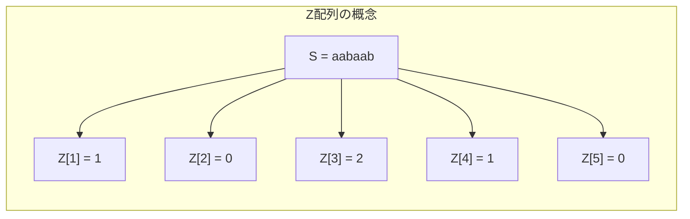
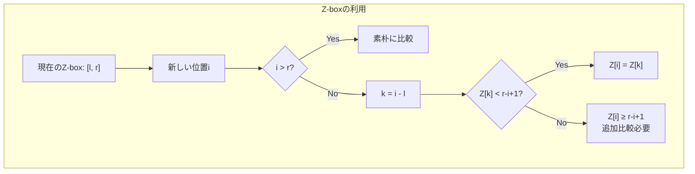
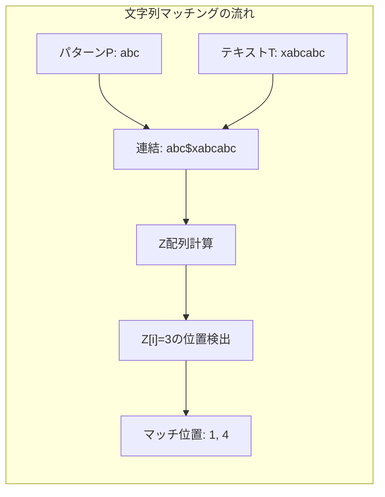

# Z-algorithm

Z-algorithmは、文字列Sの各位置iから始まる部分文字列とSの先頭からの最長共通接頭辞（Longest Common Prefix, LCP）の長さを効率的に計算するアルゴリズムである。1970年代にGusfield and Stoye によって体系化されたこのアルゴリズムは、線形時間O(n)で動作し、文字列マッチングや周期性検出など多様な問題に応用される基本的なアルゴリズムとして知られている。

## Z配列の定義と基本概念

文字列S = s[0]s[1]...s[n-1]に対して、Z配列Z[0], Z[1], ..., Z[n-1]を以下のように定義する。Z[i]は、S[i:]（位置iから始まる接尾辞）とS（文字列全体）の最長共通接頭辞の長さを表す。ただし、慣例的にZ[0]は未定義とするか、文字列全体の長さnを設定することが多い。

例えば、S = "aabaab"の場合、Z配列は以下のようになる：
- Z[0] = 6（または未定義）
- Z[1] = 1（"abaab"と"aabaab"のLCPは"a"）
- Z[2] = 0（"baab"と"aabaab"のLCPは空文字列）
- Z[3] = 2（"aab"と"aabaab"のLCPは"aa"）
- Z[4] = 1（"ab"と"aabaab"のLCPは"a"）
- Z[5] = 0（"b"と"aabaab"のLCPは空文字列）

この配列を素朴に計算すると、各位置で最悪O(n)の比較が必要となり、全体でO(n²)の計算量となる。Z-algorithmの革新的な点は、既に計算したZ値の情報を巧妙に再利用することで、この計算を線形時間に削減することである。



## Z-boxの概念とアルゴリズムの中核

Z-algorithmの効率性の鍵となるのが「Z-box」と呼ばれる概念である。Z-boxは、文字列の先頭と一致する部分文字列の範囲を表す区間である。具体的には、位置kに対して、S[k:k+Z[k]]がS[0:Z[k]]と一致する場合、区間[k, k+Z[k]-1]をZ-boxと呼ぶ。

アルゴリズムの実行中、これまでに発見したZ-boxのうち、最も右端が右側にあるものを記録する。この区間を[l, r]とし、対応する開始位置をlとする。この情報を利用することで、新たな位置のZ値を効率的に計算できる。

位置iのZ値を計算する際、以下の場合分けを行う：

1. **i > rの場合**：既存のZ-box情報が利用できないため、素朴に比較を行い、新たなZ-boxを発見する。

2. **i ≤ rの場合**：位置iは既存のZ-box内にあるため、対応する位置k = i - lのZ値を参考にできる。
   - Z[k] < r - i + 1の場合：Z[i] = Z[k]（Z-box内で完結）
   - Z[k] ≥ r - i + 1の場合：Z[i]は少なくともr - i + 1であり、r+1以降で追加の比較が必要



## アルゴリズムの詳細実装

Z-algorithmの実装において重要なのは、Z-boxの情報を適切に管理し、各ケースを正確に処理することである。以下に、アルゴリズムの核心部分を示す：

```python
def z_algorithm(s):
    n = len(s)
    z = [0] * n
    l, r = 0, 0
    
    for i in range(1, n):
        # Case 1: i > r
        if i > r:
            l, r = i, i
            while r < n and s[r - l] == s[r]:
                r += 1
            z[i] = r - l
            r -= 1
        else:
            # Case 2: i <= r
            k = i - l
            if z[k] < r - i + 1:
                z[i] = z[k]
            else:
                l = i
                while r < n and s[r - l] == s[r]:
                    r += 1
                z[i] = r - l
                r -= 1
    
    return z
```

このアルゴリズムの動作を詳細に追跡すると、各文字は高々2回しか比較されないことがわかる。具体的には、rポインタは単調に増加し、各文字との比較は、rポインタが初めてその位置に到達したときと、既存のZ-box情報から推定した値を検証するときの最大2回である。

## 計算量の厳密な証明

Z-algorithmの時間計算量がO(n)であることの証明は、償却解析（amortized analysis）に基づく。証明の要点は以下の通りである：

変数rは、アルゴリズムの実行を通じて単調非減少である。これは、rが更新されるのは、新たにより右側まで延びるZ-boxが発見されたときのみであるためである。rは0からn-1まで最大n回増加し、各増加では1回の文字比較が行われる。

一方、Z[k]の値を再利用してZ[i]を決定する場合（Z[k] < r - i + 1のケース）、追加の文字比較は行われない。Z[k] ≥ r - i + 1の場合は追加の比較が必要となるが、この比較はrを増加させるため、上記の議論に含まれる。

したがって、全体の文字比較回数は高々2n回であり、時間計算量はO(n)となる。空間計算量は、Z配列を格納するためのO(n)である。

## 文字列マッチングへの応用

Z-algorithmの最も直接的な応用は、文字列マッチング問題である。テキストT内でパターンPの出現位置をすべて見つける問題を考える。この問題は、連結文字列S = P + "$" + T（ここで"$"はPとTのどちらにも現れない特殊文字）に対してZ配列を計算することで解決できる。

Sに対するZ配列において、Z[i] = |P|となる位置i（ただしi > |P|）は、Tにおけるパターンの出現位置に対応する。具体的には、T[i - |P| - 1:]がPで始まることを示している。



この手法の利点は、KMP法と同等の線形時間でパターンマッチングを実現しながら、実装がより直感的であることである。また、複数のパターンに対する拡張も比較的容易である。

## 周期性検出とボーダー配列

文字列の周期性を検出する問題は、多くの文字列処理タスクで重要な役割を果たす。文字列Sが周期pを持つとは、すべてのi（0 ≤ i < |S| - p）に対してS[i] = S[i + p]が成り立つことを意味する。

Z-algorithmを用いると、文字列のすべての周期を効率的に検出できる。位置iにおいてZ[i] + i = nとなる場合、iはSの周期である。これは、S[i:]がSの接頭辞と完全に一致することを意味し、Sが長さiの文字列の繰り返しで構成されていることを示す。

さらに、Z配列からボーダー配列（failure function）を線形時間で構築することも可能である。ボーダー配列B[i]は、S[0:i+1]の真の接頭辞かつ接尾辞である最長の文字列の長さを表す。この変換は以下のように行える：

```python
def z_to_border(z, n):
    border = [0] * n
    for i in range(1, n):
        if i + z[i] == n:
            border[n - 1] = z[i]
    for i in range(n - 2, -1, -1):
        if border[i + 1] > 0 and border[i] == 0:
            border[i] = border[i + 1] - 1
    return border
```

## 他のアルゴリズムとの比較と選択指針

文字列処理における主要なアルゴリズムには、Z-algorithm、KMP法、Boyer-Moore法、Aho-Corasick法などがある。それぞれに特徴があり、問題の性質に応じて適切に選択する必要がある。

Z-algorithmの利点は、概念的な単純さと実装の容易さにある。KMP法のfailure functionと比較して、Z配列の定義はより直感的であり、アルゴリズムの正当性も理解しやすい。また、前処理時間と検索時間の両方がO(n + m)であり、理論的に最適である。

一方、Boyer-Moore法は実践的には平均的により高速であることが知られている。特に、パターンが長く、アルファベットサイズが大きい場合に有効である。しかし、最悪計算量はO(nm)であり、競技プログラミングのような最悪ケースを考慮する必要がある場面では不利となる。

複数パターンの同時検索が必要な場合は、Aho-Corasick法が適している。Z-algorithmを複数パターンに拡張することも可能だが、Aho-Corasick法の方がより効率的である。

## 実装上の注意点と最適化

Z-algorithmの実装において注意すべき点がいくつかある。まず、境界条件の処理が重要である。特に、rポインタが文字列の末尾に達した場合の処理を正確に行う必要がある。また、Z[0]の扱いは実装によって異なるため、問題の要求に応じて適切に設定する。

メモリ効率を重視する場合、Z配列全体を保持する必要がない問題では、必要な部分のみを計算・保持することで空間計算量を削減できる。例えば、文字列マッチングでは、パターンの長さに等しいZ値のみを記録すれば十分である。

```cpp
// C++での効率的な実装例
vector<int> z_algorithm(const string& s) {
    int n = s.length();
    vector<int> z(n);
    int l = 0, r = 0;
    
    for (int i = 1; i < n; i++) {
        if (i <= r) {
            z[i] = min(r - i + 1, z[i - l]);
        }
        while (i + z[i] < n && s[z[i]] == s[i + z[i]]) {
            z[i]++;
        }
        if (i + z[i] - 1 > r) {
            l = i;
            r = i + z[i] - 1;
        }
    }
    return z;
}
```

この実装では、条件分岐を最小限に抑え、キャッシュ効率を考慮した構造となっている。実際の競技プログラミングでは、このような最適化が実行時間の差となって現れることがある。

## 具体的な問題例と実装パターン

Z-algorithmを活用する典型的な問題パターンをいくつか紹介する。これらの問題は、競技プログラミングで頻出するものであり、Z-algorithmの威力を実感できる好例である。

### 1. 最長回文接頭辞の検出

文字列Sの接頭辞のうち、回文となる最長のものを見つける問題を考える。この問題は、S + "#" + reverse(S)という文字列に対してZ-algorithmを適用することで解決できる。

```python
def longest_palindromic_prefix(s):
    n = len(s)
    combined = s + "#" + s[::-1]
    z = z_algorithm(combined)
    
    max_len = 0
    for i in range(n + 1, 2 * n + 1):
        # Check if the suffix starting at i matches the prefix
        if z[i] == 2 * n + 1 - i and z[i] <= n:
            max_len = max(max_len, z[i])
    
    return s[:max_len]
```

この手法の巧妙な点は、文字列の反転と特殊文字を用いることで、回文性の判定を接頭辞マッチングの問題に帰着させていることである。

### 2. 文字列の最小周期

文字列Sの最小周期を求める問題は、Z-algorithmの典型的な応用例である。最小周期pは、Sがある長さpの文字列の繰り返しで表現できる最小のpである。

```python
def find_minimum_period(s):
    n = len(s)
    z = z_algorithm(s)
    
    for i in range(1, n):
        if i + z[i] == n and n % i == 0:
            return i
    return n  # The string itself is the minimum period
```

この実装では、位置iから始まる接尾辞が文字列全体の接頭辞と一致し、かつnがiで割り切れる場合、iが周期となることを利用している。

### 3. 部分文字列の出現回数カウント

パターンPがテキストT内に何回出現するかを数える問題も、Z-algorithmで効率的に解決できる。オーバーラップする出現も正確にカウントする。

```python
def count_pattern_occurrences(text, pattern):
    combined = pattern + "$" + text
    z = z_algorithm(combined)
    
    count = 0
    pattern_len = len(pattern)
    
    for i in range(pattern_len + 1, len(combined)):
        if z[i] == pattern_len:
            count += 1
    
    return count
```

## 高度な実装テクニック

競技プログラミングにおいて、実装の詳細が実行時間に大きく影響することがある。以下に、Z-algorithmの高速化テクニックをいくつか紹介する。

### メモリアクセスパターンの最適化

現代のCPUアーキテクチャでは、キャッシュ効率が性能に大きく影響する。Z-algorithmの実装において、メモリアクセスパターンを最適化することで、実行時間を短縮できる。

```cpp
// キャッシュ効率を考慮したC++実装
vector<int> z_algorithm_optimized(const string& s) {
    int n = s.length();
    vector<int> z(n);
    int l = 0, r = 0;
    
    // プリフェッチを活用
    for (int i = 1; i < n; i++) {
        // 次の反復で使用するデータをプリフェッチ
        __builtin_prefetch(&s[i + 1], 0, 1);
        
        if (i <= r) {
            z[i] = min(r - i + 1, z[i - l]);
        }
        
        // インライン展開とループアンローリング
        while (i + z[i] < n) {
            if (s[z[i]] != s[i + z[i]]) break;
            z[i]++;
            
            // 4文字ずつ比較する最適化
            if (i + z[i] + 3 < n) {
                if (memcmp(&s[z[i]], &s[i + z[i]], 4) == 0) {
                    z[i] += 4;
                } else {
                    break;
                }
            }
        }
        
        if (i + z[i] - 1 > r) {
            l = i;
            r = i + z[i] - 1;
        }
    }
    return z;
}
```

### ビット演算を用いた最適化

特定の条件下では、ビット演算を用いることで比較処理を高速化できる。特に、文字セットが小さい場合（例：DNA配列のA, C, G, T）に有効である。

```cpp
// DNA配列用の最適化版
vector<int> z_algorithm_dna(const string& s) {
    int n = s.length();
    vector<int> z(n);
    
    // DNA文字を2ビットにエンコード
    vector<uint64_t> encoded((n + 31) / 32);
    for (int i = 0; i < n; i++) {
        int val = (s[i] == 'A') ? 0 : (s[i] == 'C') ? 1 : 
                  (s[i] == 'G') ? 2 : 3;
        encoded[i / 32] |= uint64_t(val) << (2 * (i % 32));
    }
    
    // エンコードされたデータでZ配列を計算
    // 64ビット単位で比較することで高速化
    // ... (実装詳細は省略)
    
    return z;
}
```

## 実践的な問題解決例

### 問題1：文字列の圧縮表現

文字列Sが与えられたとき、S = A^k B（Aをk回繰り返した後にBを連結）の形で表現できる場合、最大のkを求める問題を考える。

```python
def max_repetition_factor(s):
    n = len(s)
    z = z_algorithm(s)
    
    max_k = 1
    for period in range(1, n):
        if z[period] < period:
            continue
        
        # How many complete repetitions?
        k = 1 + z[period] // period
        max_k = max(max_k, k)
    
    return max_k
```

この問題は、文字列の構造を理解する上で重要であり、データ圧縮アルゴリズムの基礎となる考え方を含んでいる。

### 問題2：巡回シフトの同一性判定

2つの文字列S, Tが与えられたとき、Sの巡回シフトでTと一致するものが存在するかを判定する問題である。

```python
def is_rotation(s, t):
    if len(s) != len(t):
        return False
    
    # S + S contains all rotations of S
    combined = s + s + "$" + t
    z = z_algorithm(combined)
    
    n = len(s)
    for i in range(2 * n + 1, len(combined)):
        if z[i] == n:
            return True
    
    return False
```

この手法は、文字列の巡回的性質を線形時間で扱う elegant な方法を示している。

## パフォーマンス分析と最適化戦略

Z-algorithmの実行時間は理論的にはO(n)だが、実際の性能は実装の詳細に大きく依存する。以下に、パフォーマンスに影響する要因と最適化戦略を詳述する。

### 分岐予測の最適化

現代のCPUは分岐予測機構を持っており、予測が外れると大きなペナルティが発生する。Z-algorithmの実装において、分岐を減らすか、予測しやすい形にすることが重要である。

```cpp
// 分岐予測を考慮した実装
inline int compute_z_value(const string& s, int i, int l, int r, 
                          const vector<int>& z) {
    // 条件分岐を減らすためのテクニック
    int z_val = (i <= r) ? min(r - i + 1, z[i - l]) : 0;
    
    // ループ内の分岐を減らす
    int limit = s.length() - i;
    const char* s1 = s.data() + z_val;
    const char* s2 = s.data() + i + z_val;
    
    // SIMD命令を使用可能にするアラインメント
    while (z_val < limit && *s1 == *s2) {
        s1++; s2++; z_val++;
    }
    
    return z_val;
}
```

### メモリ使用量の削減

大規模な文字列を扱う場合、メモリ使用量が問題となることがある。Z配列を圧縮して保存する手法や、必要な部分のみを計算する手法が有効である。

```python
class CompressedZArray:
    def __init__(self, s):
        self.s = s
        self.n = len(s)
        self.sparse_z = {}  # Store only non-zero values
        self._compute()
    
    def _compute(self):
        l, r = 0, 0
        for i in range(1, self.n):
            z_val = 0
            if i <= r:
                k = i - l
                z_val = min(r - i + 1, self.get(k))
            
            while i + z_val < self.n and \
                  self.s[z_val] == self.s[i + z_val]:
                z_val += 1
            
            if z_val > 0:
                self.sparse_z[i] = z_val
                
            if i + z_val - 1 > r:
                l, r = i, i + z_val - 1
    
    def get(self, i):
        return self.sparse_z.get(i, 0)
```

## 拡張と発展的話題

Z-algorithmの基本的な考え方は、より複雑な文字列処理問題にも拡張できる。例えば、2次元パターンマッチングでは、各行に対してZ-algorithmを適用し、その結果を縦方向に再度処理することで、2次元パターンの検索を効率化できる。

### 2次元Z-algorithm

2次元配列に対するZ-algorithmの拡張は、画像処理やパターン認識において有用である。

```python
def z_algorithm_2d(matrix):
    rows, cols = len(matrix), len(matrix[0])
    z_horizontal = []
    
    # Step 1: Apply Z-algorithm to each row
    for row in matrix:
        z_horizontal.append(z_algorithm(row))
    
    # Step 2: Apply Z-algorithm vertically
    z_2d = [[0] * cols for _ in range(rows)]
    
    for j in range(cols):
        column = [z_horizontal[i][j] for i in range(rows)]
        z_vertical = z_algorithm(column)
        
        for i in range(rows):
            z_2d[i][j] = z_vertical[i]
    
    return z_2d
```

### 近似文字列マッチング

編集距離がk以下の近似マッチを見つける問題では、Z-algorithmをベースとした動的計画法を組み合わせることで、効率的なアルゴリズムを構築できる[1]。

```python
def approximate_z_algorithm(s, max_errors):
    n = len(s)
    # dp[i][e] = maximum match length at position i with e errors
    dp = [[0] * (max_errors + 1) for _ in range(n)]
    
    for i in range(1, n):
        for e in range(max_errors + 1):
            j = 0
            while i + j < n and j + e <= max_errors:
                if s[j] == s[i + j]:
                    dp[i][e] = max(dp[i][e], j + 1)
                    j += 1
                else:
                    if e < max_errors:
                        # Allow mismatch
                        dp[i][e + 1] = max(dp[i][e + 1], j + 1)
                    break
    
    return dp
```

### 圧縮文字列での直接計算

ランレングス符号化された文字列に対して、展開することなく直接Z配列を計算する手法が提案されている[2]。これにより、大規模なテキストデータの処理がより効率的になる。

```python
class RLEString:
    def __init__(self, chars, counts):
        self.chars = chars
        self.counts = counts
        self.n = sum(counts)
    
    def z_algorithm_rle(self):
        # RLE形式のままZ配列を計算
        z_rle = []
        
        # 各ランに対して処理
        for i in range(len(self.chars)):
            # ... (詳細な実装は複雑なため省略)
            pass
        
        return z_rle
```

### 並列処理による高速化

Z-algorithmの並列化は、文字列を複数のブロックに分割し、各ブロックで独立にZ配列を計算した後、境界部分の情報を統合することで実現できる。

```python
from multiprocessing import Pool

def parallel_z_algorithm(s, num_processes=4):
    n = len(s)
    block_size = (n + num_processes - 1) // num_processes
    
    def process_block(args):
        start, end, s = args
        # Local Z-array computation
        local_z = z_algorithm(s[start:end])
        return start, local_z
    
    # Parallel processing
    with Pool(num_processes) as pool:
        blocks = [(i * block_size, 
                   min((i + 1) * block_size, n), s) 
                  for i in range(num_processes)]
        results = pool.map(process_block, blocks)
    
    # Merge results
    z = [0] * n
    for start, local_z in results:
        for i, val in enumerate(local_z):
            z[start + i] = val
    
    # Fix boundary issues
    # ... (境界処理の実装)
    
    return z
```

## 実用的な応用分野

Z-algorithmは理論的な美しさだけでなく、実用的な価値も高い。以下に、実際の応用分野での使用例を紹介する。

### バイオインフォマティクス

ゲノム配列解析では、繰り返し配列の検出やタンデムリピートの同定にZ-algorithmが使用される。特に、変異体の検出や進化的関係の解析において重要な役割を果たす。

```python
def find_tandem_repeats(dna_sequence, min_length=3):
    n = len(dna_sequence)
    z = z_algorithm(dna_sequence)
    
    tandem_repeats = []
    for i in range(1, n):
        if z[i] >= i and i + z[i] <= n:
            # Found a tandem repeat
            repeat_unit = dna_sequence[:i]
            repeat_count = 1 + z[i] // i
            if len(repeat_unit) >= min_length:
                tandem_repeats.append({
                    'position': 0,
                    'unit': repeat_unit,
                    'count': repeat_count
                })
    
    return tandem_repeats
```

### データ圧縮

LZ77やLZ78などの辞書式圧縮アルゴリズムでは、繰り返しパターンの検出が重要である。Z-algorithmを用いることで、これらのパターンを効率的に発見できる。

### テキストエディタの実装

テキストエディタの検索・置換機能や、構文ハイライトのためのパターンマッチングにおいて、Z-algorithmは高速な処理を実現する。

```python
class TextEditor:
    def __init__(self, text):
        self.text = text
        self.z_cache = {}
    
    def find_all(self, pattern):
        cache_key = pattern
        if cache_key not in self.z_cache:
            combined = pattern + "$" + self.text
            self.z_cache[cache_key] = z_algorithm(combined)
        
        z = self.z_cache[cache_key]
        pattern_len = len(pattern)
        
        positions = []
        for i in range(pattern_len + 1, len(z)):
            if z[i] == pattern_len:
                positions.append(i - pattern_len - 1)
        
        return positions
```

[1] Gusfield, D. (1997). Algorithms on strings, trees, and sequences: computer science and computational biology. Cambridge University Press.

[2] Bannai, H., I, T., Inenaga, S., Nakashima, Y., Takeda, M., & Tsuruta, K. (2017). The "Runs" Theorem. SIAM Journal on Computing, 46(5), 1501-1514.