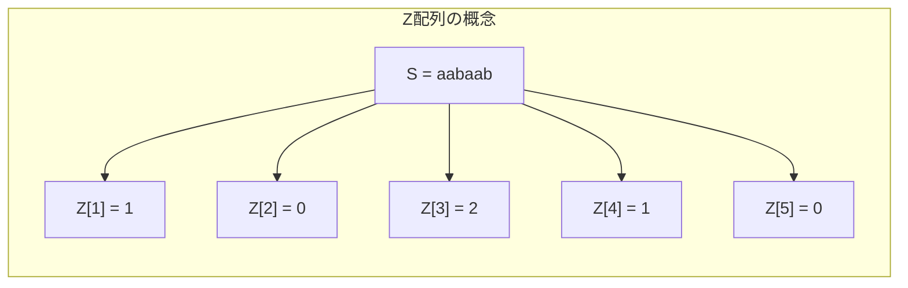
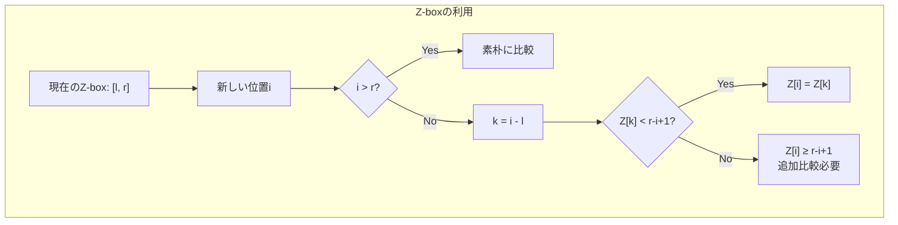
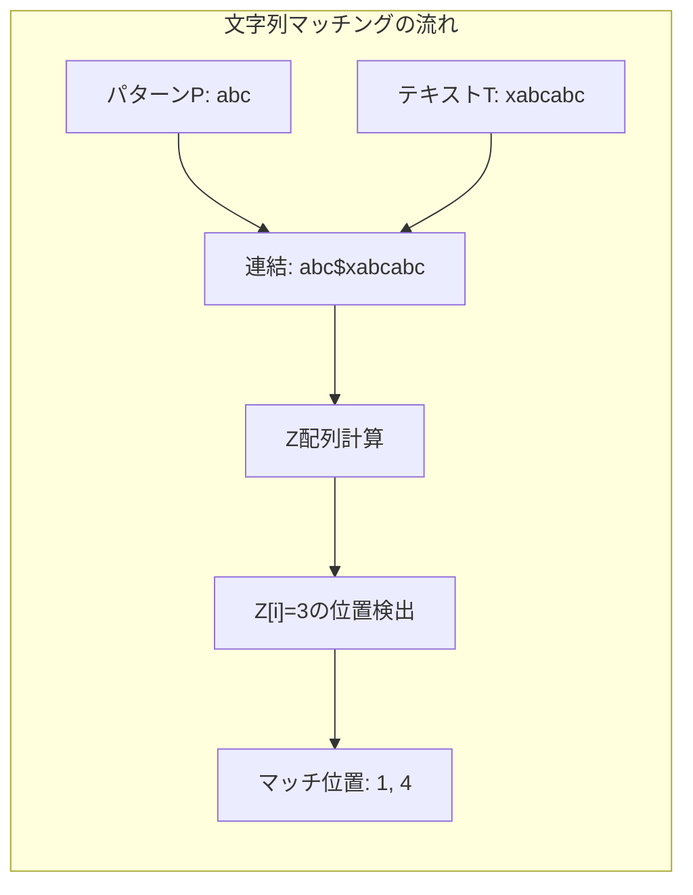

# Z-algorithm

Z-algorithmは、文字列Sの各位置iから始まる部分文字列とSの先頭からの最長共通接頭辞（Longest Common Prefix, LCP）の長さを効率的に計算するアルゴリズムである。1970年代にGusfield and Stoye によって体系化されたこのアルゴリズムは、線形時間O(n)で動作し、文字列マッチングや周期性検出など多様な問題に応用される基本的なアルゴリズムとして知られている。

## Z配列の定義と基本概念

文字列S = s[0]s[1]...s[n-1]に対して、Z配列Z[0], Z[1], ..., Z[n-1]を以下のように定義する。Z[i]は、S[i:]（位置iから始まる接尾辞）とS（文字列全体）の最長共通接頭辞の長さを表す。ただし、慣例的にZ[0]は未定義とするか、文字列全体の長さnを設定することが多い。

例えば、S = "aabaab"の場合、Z配列は以下のようになる：
- Z[0] = 6（または未定義）
- Z[1] = 1（"abaab"と"aabaab"のLCPは"a"）
- Z[2] = 0（"baab"と"aabaab"のLCPは空文字列）
- Z[3] = 2（"aab"と"aabaab"のLCPは"aa"）
- Z[4] = 1（"ab"と"aabaab"のLCPは"a"）
- Z[5] = 0（"b"と"aabaab"のLCPは空文字列）

この配列を素朴に計算すると、各位置で最悪O(n)の比較が必要となり、全体でO(n²)の計算量となる。Z-algorithmの革新的な点は、既に計算したZ値の情報を巧妙に再利用することで、この計算を線形時間に削減することである。



## Z-boxの概念とアルゴリズムの中核

Z-algorithmの効率性の鍵となるのが「Z-box」と呼ばれる概念である。Z-boxは、文字列の先頭と一致する部分文字列の範囲を表す区間である。具体的には、位置kに対して、S[k:k+Z[k]]がS[0:Z[k]]と一致する場合、区間[k, k+Z[k]-1]をZ-boxと呼ぶ。

アルゴリズムの実行中、これまでに発見したZ-boxのうち、最も右端が右側にあるものを記録する。この区間を[l, r]とし、対応する開始位置をlとする。この情報を利用することで、新たな位置のZ値を効率的に計算できる。

位置iのZ値を計算する際、以下の場合分けを行う：

1. **i > rの場合**：既存のZ-box情報が利用できないため、素朴に比較を行い、新たなZ-boxを発見する。

2. **i ≤ rの場合**：位置iは既存のZ-box内にあるため、対応する位置k = i - lのZ値を参考にできる。
   - Z[k] < r - i + 1の場合：Z[i] = Z[k]（Z-box内で完結）
   - Z[k] ≥ r - i + 1の場合：Z[i]は少なくともr - i + 1であり、r+1以降で追加の比較が必要



## アルゴリズムの詳細実装

Z-algorithmの実装において重要なのは、Z-boxの情報を適切に管理し、各ケースを正確に処理することである。以下に、アルゴリズムの核心部分を示す：

```python
def z_algorithm(s):
    n = len(s)
    z = [0] * n
    l, r = 0, 0
    
    for i in range(1, n):
        # Case 1: i > r
        if i > r:
            l, r = i, i
            while r < n and s[r - l] == s[r]:
                r += 1
            z[i] = r - l
            r -= 1
        else:
            # Case 2: i <= r
            k = i - l
            if z[k] < r - i + 1:
                z[i] = z[k]
            else:
                l = i
                while r < n and s[r - l] == s[r]:
                    r += 1
                z[i] = r - l
                r -= 1
    
    return z
```

このアルゴリズムの動作を詳細に追跡すると、各文字は高々2回しか比較されないことがわかる。具体的には、rポインタは単調に増加し、各文字との比較は、rポインタが初めてその位置に到達したときと、既存のZ-box情報から推定した値を検証するときの最大2回である。

## 計算量の厳密な証明

Z-algorithmの時間計算量がO(n)であることの証明は、償却解析（amortized analysis）に基づく。証明の要点は以下の通りである：

変数rは、アルゴリズムの実行を通じて単調非減少である。これは、rが更新されるのは、新たにより右側まで延びるZ-boxが発見されたときのみであるためである。rは0からn-1まで最大n回増加し、各増加では1回の文字比較が行われる。

一方、Z[k]の値を再利用してZ[i]を決定する場合（Z[k] < r - i + 1のケース）、追加の文字比較は行われない。Z[k] ≥ r - i + 1の場合は追加の比較が必要となるが、この比較はrを増加させるため、上記の議論に含まれる。

したがって、全体の文字比較回数は高々2n回であり、時間計算量はO(n)となる。空間計算量は、Z配列を格納するためのO(n)である。

## 文字列マッチングへの応用

Z-algorithmの最も直接的な応用は、文字列マッチング問題である。テキストT内でパターンPの出現位置をすべて見つける問題を考える。この問題は、連結文字列S = P + "$" + T（ここで"$"はPとTのどちらにも現れない特殊文字）に対してZ配列を計算することで解決できる。

Sに対するZ配列において、Z[i] = |P|となる位置i（ただしi > |P|）は、Tにおけるパターンの出現位置に対応する。具体的には、T[i - |P| - 1:]がPで始まることを示している。



この手法の利点は、KMP法と同等の線形時間でパターンマッチングを実現しながら、実装がより直感的であることである。また、複数のパターンに対する拡張も比較的容易である。

## 周期性検出とボーダー配列

文字列の周期性を検出する問題は、多くの文字列処理タスクで重要な役割を果たす。文字列Sが周期pを持つとは、すべてのi（0 ≤ i < |S| - p）に対してS[i] = S[i + p]が成り立つことを意味する。

Z-algorithmを用いると、文字列のすべての周期を効率的に検出できる。位置iにおいてZ[i] + i = nとなる場合、iはSの周期である。これは、S[i:]がSの接頭辞と完全に一致することを意味し、Sが長さiの文字列の繰り返しで構成されていることを示す。

さらに、Z配列からボーダー配列（failure function）を線形時間で構築することも可能である。ボーダー配列B[i]は、S[0:i+1]の真の接頭辞かつ接尾辞である最長の文字列の長さを表す。この変換は以下のように行える：

```python
def z_to_border(z, n):
    border = [0] * n
    for i in range(1, n):
        if i + z[i] == n:
            border[n - 1] = z[i]
    for i in range(n - 2, -1, -1):
        if border[i + 1] > 0 and border[i] == 0:
            border[i] = border[i + 1] - 1
    return border
```

## 他のアルゴリズムとの比較と選択指針

文字列処理における主要なアルゴリズムには、Z-algorithm、KMP法、Boyer-Moore法、Aho-Corasick法などがある。それぞれに特徴があり、問題の性質に応じて適切に選択する必要がある。

Z-algorithmの利点は、概念的な単純さと実装の容易さにある。KMP法のfailure functionと比較して、Z配列の定義はより直感的であり、アルゴリズムの正当性も理解しやすい。また、前処理時間と検索時間の両方がO(n + m)であり、理論的に最適である。

一方、Boyer-Moore法は実践的には平均的により高速であることが知られている。特に、パターンが長く、アルファベットサイズが大きい場合に有効である。しかし、最悪計算量はO(nm)であり、競技プログラミングのような最悪ケースを考慮する必要がある場面では不利となる。

複数パターンの同時検索が必要な場合は、Aho-Corasick法が適している。Z-algorithmを複数パターンに拡張することも可能だが、Aho-Corasick法の方がより効率的である。

## 実装上の注意点と最適化

Z-algorithmの実装において注意すべき点がいくつかある。まず、境界条件の処理が重要である。特に、rポインタが文字列の末尾に達した場合の処理を正確に行う必要がある。また、Z[0]の扱いは実装によって異なるため、問題の要求に応じて適切に設定する。

メモリ効率を重視する場合、Z配列全体を保持する必要がない問題では、必要な部分のみを計算・保持することで空間計算量を削減できる。例えば、文字列マッチングでは、パターンの長さに等しいZ値のみを記録すれば十分である。

```cpp
// C++での効率的な実装例
vector<int> z_algorithm(const string& s) {
    int n = s.length();
    vector<int> z(n);
    int l = 0, r = 0;
    
    for (int i = 1; i < n; i++) {
        if (i <= r) {
            z[i] = min(r - i + 1, z[i - l]);
        }
        while (i + z[i] < n && s[z[i]] == s[i + z[i]]) {
            z[i]++;
        }
        if (i + z[i] - 1 > r) {
            l = i;
            r = i + z[i] - 1;
        }
    }
    return z;
}
```

この実装では、条件分岐を最小限に抑え、キャッシュ効率を考慮した構造となっている。実際の競技プログラミングでは、このような最適化が実行時間の差となって現れることがある。

## 拡張と発展的話題

Z-algorithmの基本的な考え方は、より複雑な文字列処理問題にも拡張できる。例えば、2次元パターンマッチングでは、各行に対してZ-algorithmを適用し、その結果を縦方向に再度処理することで、2次元パターンの検索を効率化できる。

また、近似文字列マッチングへの拡張も研究されている。編集距離がk以下の近似マッチを見つける問題では、Z-algorithmをベースとした動的計画法を組み合わせることで、効率的なアルゴリズムを構築できる[1]。

圧縮文字列に対するZ-algorithm の適用も興味深い研究分野である。ランレングス符号化された文字列に対して、展開することなく直接Z配列を計算する手法が提案されている[2]。これにより、大規模なテキストデータの処理がより効率的になる。

並列化の観点からも、Z-algorithmは興味深い性質を持つ。文字列を複数のブロックに分割し、各ブロックで独立にZ配列を計算した後、境界部分の情報を統合することで、並列化による高速化が可能である。ただし、Z-boxの情報共有が必要となるため、完全に独立した並列処理は困難である。

実用的な観点では、Z-algorithmは全文検索エンジンやバイオインフォマティクスにおけるシーケンスアラインメントなど、大規模なテキスト処理が必要な分野で広く活用されている。特に、ゲノム配列解析では、繰り返し配列の検出やタンデムリピートの同定にZ-algorithmが使用される。

[1] Gusfield, D. (1997). Algorithms on strings, trees, and sequences: computer science and computational biology. Cambridge University Press.

[2] Bannai, H., I, T., Inenaga, S., Nakashima, Y., Takeda, M., & Tsuruta, K. (2017). The "Runs" Theorem. SIAM Journal on Computing, 46(5), 1501-1514.