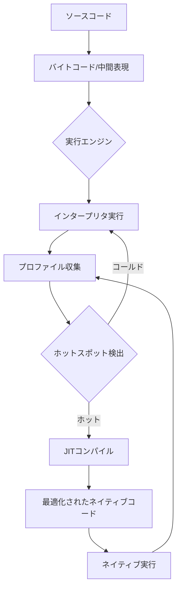
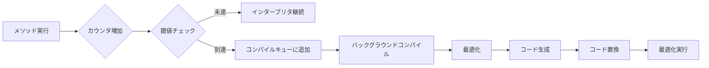
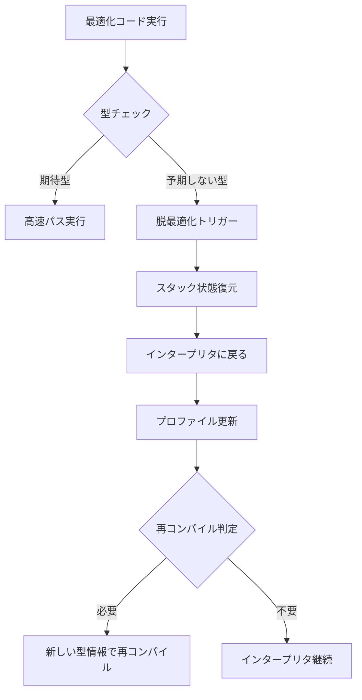

# JIT Compilation

Just-In-Time（JIT）コンパイルは、プログラムの実行時に動的にネイティブコードを生成する技術である。従来の静的コンパイル（Ahead-of-Time: AOT）やインタープリタ実行とは異なり、JITコンパイラは実行時の情報を活用して最適化を行うことで、プログラムの実行性能を大幅に向上させることができる。本稿では、JITコンパイルの基本原理から実装技術、そして実際のシステムにおける応用まで、体系的に解説する。

## JITコンパイルの基本概念

プログラムの実行方式には大きく分けて3つのアプローチが存在する。インタープリタは、ソースコードや中間表現を逐次解釈しながら実行する。AOTコンパイラは、実行前にすべてのコードをネイティブコードに変換する。これに対してJITコンパイラは、実行時に必要に応じてコードをコンパイルする。この「必要に応じて」という特性がJITコンパイルの本質である。

JITコンパイルの最大の利点は、実行時の情報を活用できることにある。プログラムの実行パターン、実際の型情報、分岐の頻度など、静的解析では得られない情報を基に最適化を行うことができる。例えば、ポリモーフィックなメソッド呼び出しにおいて、実行時に頻繁に使用される型が判明すれば、その型に特化したコードを生成できる。

一方で、JITコンパイルにはオーバーヘッドも存在する。コンパイル自体に時間がかかるため、すべてのコードをコンパイルすると、かえって性能が低下する可能性がある。このため、実行頻度の高いコード（ホットスポット）を選択的にコンパイルすることが重要となる。

## 動的コンパイルのメカニズム

JITコンパイラの中核となるのは、実行時のプロファイリングとそれに基づく最適化である。プログラムの実行中、システムは各メソッドの呼び出し回数、ループの実行回数、型情報などを収集する。これらの情報は、どのコードをコンパイルすべきか、どのような最適化を適用すべきかを決定するために使用される。

プロファイリングの実装方法には、カウンタベースとサンプリングベースの2つの主要なアプローチがある。カウンタベースの方式では、各メソッドやループにカウンタを設置し、実行回数を正確に記録する。HotSpot JVM[^1]では、メソッド呼び出しとループバックエッジの両方にカウンタを設置し、これらの合計が閾値を超えたときにコンパイルを開始する。

[^1]: Oracle. "The Java HotSpot Performance Engine Architecture" https://www.oracle.com/java/technologies/whitepaper.html

サンプリングベースの方式では、定期的にプログラムの実行状態をサンプリングし、統計的にホットスポットを特定する。この方式はオーバーヘッドが小さいが、短時間しか実行されないホットコードを見逃す可能性がある。

コンパイルの決定には、単純な実行回数だけでなく、コードの複雑さや最適化の可能性も考慮される。例えば、ループ内で不変な計算を含むコードは、ループ不変コード移動によって大幅な性能向上が期待できるため、優先的にコンパイルされる。

## プロファイルガイド最適化

JITコンパイラの真価は、実行時プロファイルに基づく積極的な最適化にある。静的コンパイラでは安全性の観点から適用できない最適化も、実行時の情報があれば可能となる。代表的な最適化技術として、インライン展開、型特殊化、脱仮想化などがある。

インライン展開は、メソッド呼び出しのオーバーヘッドを削減し、さらなる最適化の機会を生み出す。JITコンパイラは、実行頻度の高い呼び出しサイトを優先的にインライン化する。V8エンジン[^2]では、呼び出し頻度だけでなく、呼び出し先の多態性も考慮してインライン化の判断を行う。単相的（monomorphic）な呼び出しサイトは積極的にインライン化され、多相的（polymorphic）なサイトは限定的にインライン化される。

[^2]: Google. "V8 JavaScript Engine Design" https://v8.dev/docs

型特殊化は、動的型付け言語において特に重要な最適化である。実行時に観測された型情報に基づいて、汎用的な操作を特定の型に特化したコードに置き換える。例えば、整数の加算として実行されることが多い演算子は、整数専用の高速パスとして実装される。ただし、型の仮定が崩れた場合に備えて、脱最適化（deoptimization）のメカニズムも必要となる。

脱仮想化は、オブジェクト指向言語における仮想メソッド呼び出しを、直接呼び出しに変換する最適化である。実行時の型情報から、特定の呼び出しサイトで実際に呼ばれるメソッドが一意に決まることが多い。この場合、仮想関数テーブルの参照を省略し、直接ジャンプすることで性能を向上させる。

これらの最適化には、投機的（speculative）な性質がある。つまり、過去の実行パターンが将来も継続するという仮定に基づいている。この仮定が崩れた場合、最適化されたコードは正しく動作しない可能性がある。そのため、JITコンパイラは常に安全な脱最適化パスを用意し、仮定が崩れたときには最適化前の状態に戻れるようにしている。

## メソッドの段階的コンパイル

現代のJITシステムの多くは、段階的コンパイル（tiered compilation）を採用している。これは、コードの実行頻度や重要性に応じて、異なるレベルの最適化を適用するアプローチである。初期段階では簡単な最適化のみを行い、実行頻度が高まるにつれてより積極的な最適化を適用する。

HotSpot JVMの段階的コンパイルシステムは、5つのレベルで構成される[^3]。レベル0はインタープリタ実行、レベル1-3はC1コンパイラによる軽量な最適化、レベル4はC2コンパイラによる積極的な最適化である。各レベル間の遷移は、実行頻度とプロファイル情報の充実度によって決定される。

[^3]: Oracle. "Tiered Compilation in HotSpot" https://docs.oracle.com/en/java/javase/11/gctuning/factors-affecting-garbage-collection-performance.html

段階的コンパイルの利点は、起動時間と実行時性能のバランスを取れることにある。アプリケーションの起動時には、素早くコードを実行可能にすることが重要である。一方、長時間実行されるコードについては、時間をかけてでも高度な最適化を適用する価値がある。

各コンパイルレベルでは、異なる最適化戦略が採用される。初期レベルでは、コンパイル時間を最小限に抑えるため、基本的な最適化のみを行う。定数畳み込み、デッドコード除去、簡単なインライン展開などが含まれる。高レベルでは、ループ最適化、エスケープ解析、ベクトル化など、より複雑で時間のかかる最適化が適用される。

プロファイル情報の収集も、段階に応じて変化する。初期段階では詳細なプロファイルを収集し、最適化の判断材料とする。高レベルでコンパイルされたコードでは、プロファイリングのオーバーヘッドを削減するため、収集する情報を最小限に抑える。

## 実装上の課題とトレードオフ

JITコンパイラの実装には、多くの技術的課題が存在する。メモリ管理、スレッドセーフティ、デバッグ支援など、実行時環境全体との統合が必要となる。

メモリ管理において、JITコンパイラは生成したコードを格納するためのコードキャッシュを管理する必要がある。コードキャッシュのサイズは有限であるため、古いコードや使用頻度の低いコードを適切に破棄する必要がある。しかし、単純に古いコードを削除すると、そのコードへの参照が残っている場合にクラッシュする可能性がある。このため、参照カウントやガベージコレクションと連携した管理が必要となる。

スレッドセーフティは、マルチスレッド環境でJITコンパイルを行う際の重要な課題である。あるスレッドがメソッドを実行している最中に、別のスレッドがそのメソッドをコンパイルして置き換える場合、慎重な同期が必要となる。多くのJITシステムでは、On-Stack Replacement（OSR）と呼ばれる技術を使用して、実行中のメソッドを安全に置き換える。

デバッグ支援も重要な考慮事項である。最適化されたコードでは、元のソースコードとの対応関係が複雑になる。インライン展開、命令の並べ替え、レジスタ割り当てなどにより、デバッガが期待する情報が失われる可能性がある。このため、JITコンパイラはデバッグ情報を生成し、必要に応じて最適化を抑制する機能を持つ必要がある。

性能とメモリ使用量のトレードオフも重要な設計判断である。積極的な最適化は実行速度を向上させるが、コンパイル時間とメモリ使用量を増加させる。特に、モバイルデバイスや組み込みシステムでは、メモリ制約が厳しいため、このトレードオフは慎重に検討する必要がある。

## 主要なJITシステムの実装例

実際のJITシステムの実装を見ることで、理論と実践のギャップを理解できる。ここでは、代表的な3つのシステムを取り上げる。

HotSpot JVMは、Javaの最も広く使用されているJIT実装である。C1（クライアントコンパイラ）とC2（サーバーコンパイラ）の2つのコンパイラを持ち、段階的コンパイルを実現している。C1は高速なコンパイルを重視し、C2は高度な最適化を行う。Graal[^4]と呼ばれる新しいコンパイラも開発されており、より柔軟な最適化が可能となっている。

[^4]: Oracle. "GraalVM: Run Programs Faster Anywhere" https://www.graalvm.org/

V8は、Google ChromeのJavaScriptエンジンである。TurboFanと呼ばれるJITコンパイラを使用し、型フィードバックに基づく積極的な最適化を行う。特徴的なのは、Hidden Classと呼ばれる内部表現を使用して、動的なJavaScriptオブジェクトを効率的に扱うことである。インライン・キャッシュ（IC）により、プロパティアクセスを高速化している。

.NET CoreのRyuJITは、マイクロソフトが開発したJITコンパイラである。SSA（Static Single Assignment）形式の中間表現を使用し、modern なコンパイラ最適化技術を適用している。階層型コンパイルをサポートし、Quick JITモードでは起動時間を優先した軽量なコンパイルを行う。

これらのシステムは、それぞれ異なる設計思想と最適化戦略を持っているが、共通して実行時情報の活用、段階的な最適化、脱最適化メカニズムという基本要素を備えている。

JITコンパイルは、プログラムの実行時性能を大幅に向上させる強力な技術である。実行時の情報を活用することで、静的コンパイラでは不可能な最適化を実現できる。一方で、コンパイル時間のオーバーヘッド、メモリ使用量、実装の複雑さなど、多くの課題も存在する。これらの課題に対処するため、段階的コンパイル、プロファイルガイド最適化、脱最適化メカニズムなど、様々な技術が開発されてきた。今後も、機械学習を活用した最適化判断や、異種アーキテクチャへの対応など、JITコンパイル技術の進化は続いていくだろう。