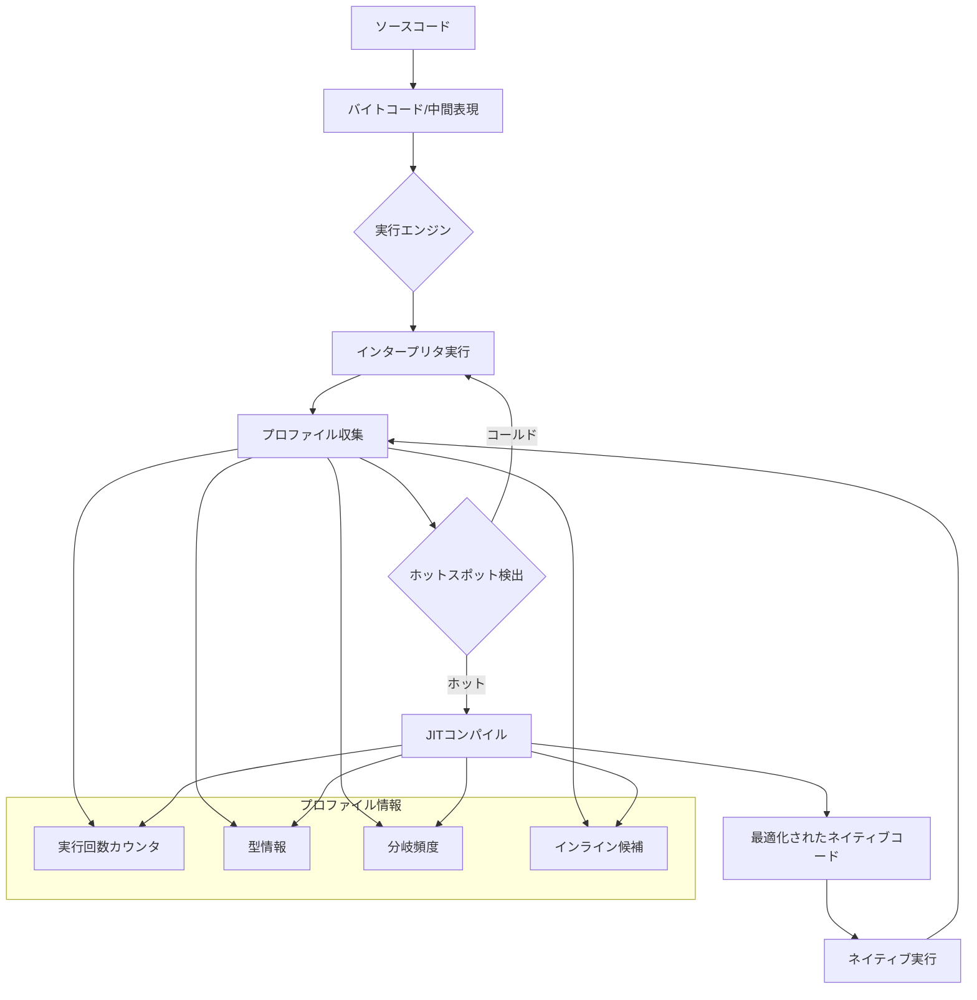
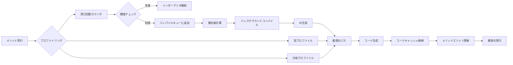
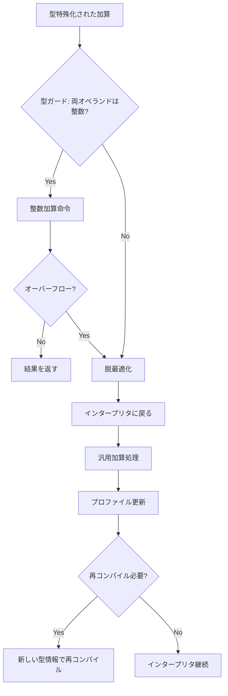
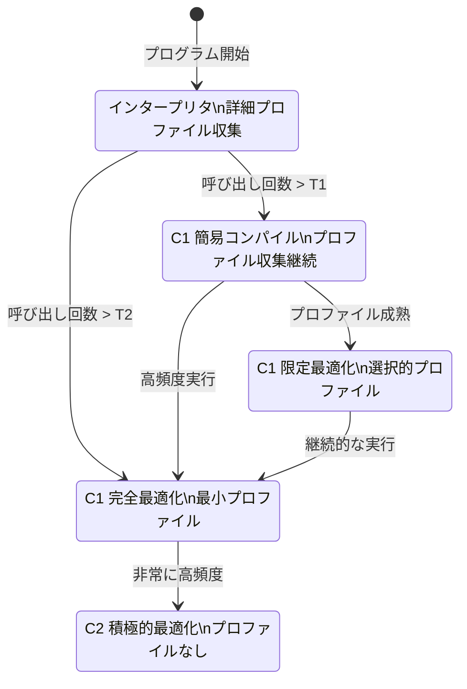
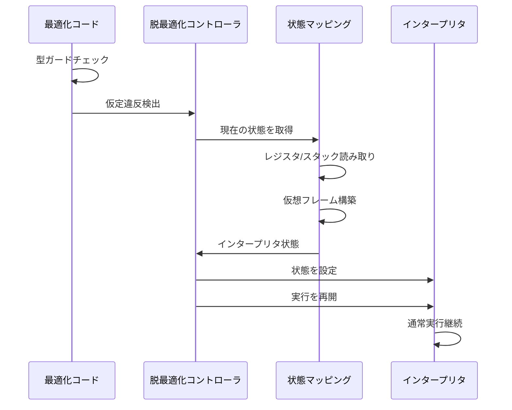
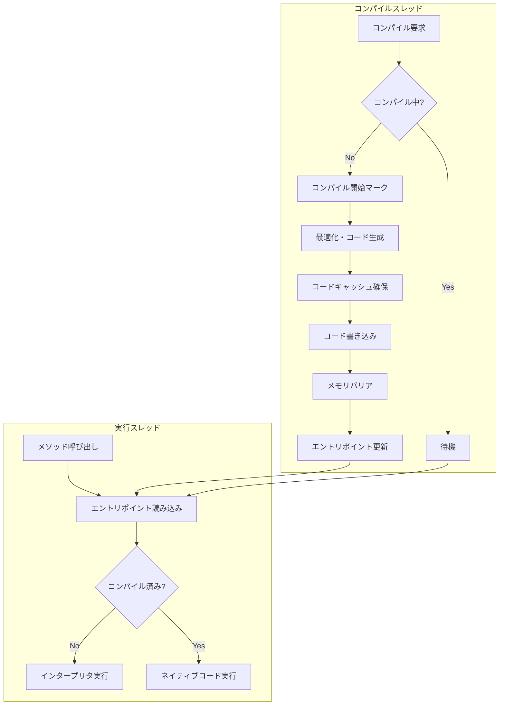
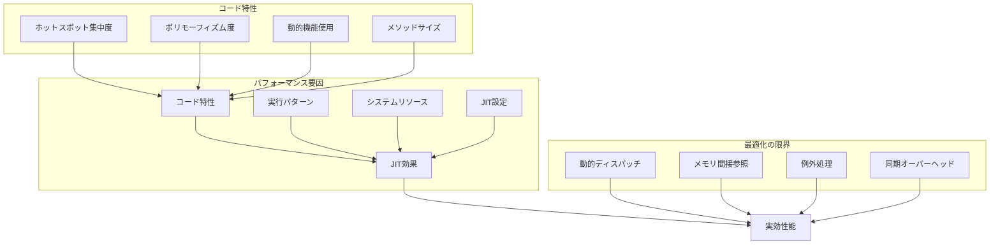

# JIT Compilation

Just-In-Time（JIT）コンパイルは、プログラムの実行時に動的にネイティブコードを生成する技術である。従来の静的コンパイル（Ahead-of-Time: AOT）やインタープリタ実行とは異なり、JITコンパイラは実行時の情報を活用して最適化を行うことで、プログラムの実行性能を大幅に向上させることができる。現代の高性能な言語実行環境において、JITコンパイルは不可欠な技術となっており、Java、JavaScript、.NET、Python（PyPy）など、多くの言語処理系で採用されている。本稿では、JITコンパイルの基本原理から実装技術、そして実際のシステムにおける応用まで、体系的に解説する。

## JITコンパイルの基本概念と動機

プログラムの実行方式には大きく分けて3つのアプローチが存在する。インタープリタは、ソースコードや中間表現を逐次解釈しながら実行する。この方式は実装が簡単で、プログラムの起動が高速であるが、同じコードを繰り返し解釈するオーバーヘッドが大きい。AOTコンパイラは、実行前にすべてのコードをネイティブコードに変換する。生成されたコードは高速に実行できるが、コンパイル時には実行時の情報が得られないため、保守的な最適化しか適用できない。

JITコンパイルは、これら2つのアプローチの長所を組み合わせた手法である。プログラムの実行を開始する際はインタープリタとして動作し、実行中に頻繁に使用されるコード（ホットスポット）を検出してネイティブコードにコンパイルする。この「必要に応じて」コンパイルするという特性により、起動時間を短く保ちながら、実行時性能を向上させることができる。

JITコンパイルの最大の利点は、実行時の情報を活用した積極的な最適化が可能なことである。静的コンパイル時には不明な情報、例えば実際の型情報、分岐の頻度、メソッドの呼び出しパターンなどを観測し、これらの情報に基づいて特化したコードを生成できる。動的型付け言語において、実行時に判明した型情報を使って型チェックを省略したり、頻繁に実行される経路に特化したコードを生成したりすることで、大幅な性能向上を実現できる。



一方で、JITコンパイルには固有の課題も存在する。コンパイル自体に計算資源を消費するため、すべてのコードをコンパイルすると、かえって性能が低下する可能性がある。また、生成したネイティブコードを格納するメモリも必要となる。このため、どのコードをいつコンパイルするかという判断が極めて重要となる。さらに、実行時の仮定に基づいて最適化したコードは、その仮定が崩れた場合に正しく動作しない可能性があるため、脱最適化（deoptimization）のメカニズムも必要となる。

## 動的コンパイルのメカニズムとプロファイリング

JITコンパイラの中核となるのは、実行時のプロファイリングとそれに基づく最適化である。プロファイリングは、プログラムの実行特性を観測し、最適化の判断材料となる情報を収集するプロセスである。収集される情報には、各メソッドの呼び出し回数、ループの実行回数、型情報、分岐の頻度、メソッド呼び出しの対象などが含まれる。

プロファイリングの実装方法には、カウンタベース、サンプリングベース、そしてハイブリッド方式がある。カウンタベースの方式は最も直接的なアプローチで、各メソッドの入口とループのバックエッジにカウンタを設置し、実行回数を正確に記録する。HotSpot JVM[^1]では、メソッド呼び出しカウンタとバックエッジカウンタの2種類を使用し、これらの合計が閾値を超えたときにコンパイルを開始する。この方式の利点は正確性であるが、カウンタの更新によるオーバーヘッドが発生する。

[^1]: Oracle. "The Java HotSpot Performance Engine Architecture" https://www.oracle.com/java/technologies/whitepaper.html

サンプリングベースの方式では、定期的にプログラムの実行状態をサンプリングし、統計的にホットスポットを特定する。タイマー割り込みやハードウェアパフォーマンスカウンタを使用して、実行中の命令ポインタを記録し、頻繁にサンプリングされるコード領域をホットスポットとして識別する。この方式はオーバーヘッドが小さく、プログラムの実行に与える影響が少ないが、短時間しか実行されないホットコードを見逃す可能性がある。

ハイブリッド方式は、両者の利点を組み合わせたアプローチである。初期段階ではカウンタベースで正確にホットスポットを検出し、コンパイル後はサンプリングベースに切り替えてオーバーヘッドを削減する。また、階層的なプロファイリングを採用し、重要度の高いコードほど詳細な情報を収集することもある。



プロファイル情報の品質は、JITコンパイルの効果を大きく左右する。単純な実行回数だけでなく、コードの文脈情報も重要である。例えば、同じメソッドでも呼び出し元によって動作が異なる場合、呼び出しサイトごとに異なるプロファイルを収集することで、より精密な最適化が可能となる。V8エンジン[^2]では、インライン・キャッシュ（IC）を使用して、各呼び出しサイトでの型情報を効率的に収集している。

[^2]: Google. "V8 JavaScript Engine Design" https://v8.dev/docs

## プロファイルガイド最適化の詳細

JITコンパイラの真価は、実行時プロファイルに基づく積極的な最適化にある。静的コンパイラでは安全性の観点から適用できない最適化も、実行時の情報があれば可能となる。ここでは、代表的な最適化技術について、その原理と実装方法を詳しく見ていく。

インライン展開は、JIT最適化の基礎となる技術である。メソッド呼び出しのオーバーヘッドを削減するだけでなく、呼び出し先のコードを呼び出し元のコンテキストで最適化できるため、さらなる最適化の機会を生み出す。JITコンパイラは、実行頻度、メソッドのサイズ、呼び出しの多態性などを総合的に判断してインライン化を決定する。単相的（monomorphic）な呼び出しサイトは積極的にインライン化され、多相的（polymorphic）なサイトでは、頻度の高い数個のターゲットに対してのみインライン化を行う。

型特殊化は、動的型付け言語において特に重要な最適化である。JavaScriptのような言語では、すべての値がオブジェクトとして扱われ、演算のたびに型チェックが必要となる。しかし、実行時のプロファイルから、特定の変数が常に整数であることが判明すれば、型チェックを省略し、整数専用の高速な演算を使用できる。この最適化には投機的な性質があり、型の仮定が崩れた場合に備えて、ガードコードと脱最適化パスを用意する必要がある。



脱仮想化は、オブジェクト指向言語における重要な最適化である。仮想メソッド呼び出しは、実行時に動的ディスパッチが必要となるため、直接呼び出しに比べてオーバーヘッドが大きい。しかし、プロファイル情報から特定の呼び出しサイトで実際に呼ばれるメソッドが限定的であることが分かれば、その情報を使って最適化できる。単一のターゲットしか観測されていない場合は、型チェックを挿入した上で直接呼び出しに変換する。複数のターゲットが観測されている場合は、頻度の高いものから順にチェックする多態的インライン・キャッシュを生成する。

エスケープ解析は、オブジェクトの生存期間と到達可能性を解析し、ヒープ割り当てを削減する最適化である。メソッド内で生成されたオブジェクトが、そのメソッドの外部に「エスケープ」しない場合、ヒープではなくスタックに割り当てたり、さらにはスカラー置換によって完全に除去したりできる。JITコンパイラは、インライン展開後の拡大されたスコープでエスケープ解析を行うことで、より多くの最適化機会を発見できる。

ループ最適化も、JITコンパイラの重要な最適化対象である。ループ不変コード移動、ループ展開、ループ融合、ベクトル化など、様々な技術が適用される。実行時のプロファイル情報により、ループの反復回数や、ループ内での分岐の頻度が分かるため、より積極的な最適化が可能となる。例えば、反復回数が常に4の倍数であることが分かれば、4回展開したループを生成できる。

## 段階的コンパイルとその実装

現代のJITシステムの多くは、段階的コンパイル（tiered compilation）を採用している。これは、コードの実行頻度や重要性に応じて、異なるレベルの最適化を適用するアプローチである。初期段階では簡単な最適化のみを行い、実行頻度が高まるにつれてより積極的な最適化を適用する。この方式により、起動時間と実行時性能の両立が可能となる。

HotSpot JVMの段階的コンパイルシステムは、5つのレベルで構成される[^3]。レベル0はインタープリタ実行で、プロファイル情報を詳細に収集する。レベル1はC1コンパイラによる簡単なコンパイルで、プロファイル収集を継続する。レベル2はC1コンパイラによる限定的な最適化、レベル3はC1コンパイラによる完全な最適化である。レベル4はC2コンパイラによる積極的な最適化で、プロファイル収集は行わない。

[^3]: Oracle. "Tiered Compilation in HotSpot" https://docs.oracle.com/en/java/javase/11/gctuning/factors-affecting-garbage-collection-performance.html



各コンパイルレベルでは、コンパイル時間と最適化の度合いのトレードオフが考慮される。初期レベルでは、メソッドを素早く実行可能にすることが優先される。基本ブロックの生成、レジスタ割り当て、簡単な定数伝播やデッドコード除去などが行われる。プロファイル情報の収集コードも挿入され、将来の最適化のための情報を蓄積する。

中間レベルでは、収集されたプロファイル情報に基づいて、より積極的な最適化を適用する。メソッドのインライン展開、簡単なループ最適化、条件分岐の除去などが行われる。ただし、コンパイル時間を抑えるため、複雑な解析は避けられる。

最高レベルでは、利用可能なすべての最適化技術を適用する。グローバルな値番号付け、エスケープ解析、ループの自動ベクトル化、命令スケジューリングなど、時間のかかる最適化も実行される。このレベルでコンパイルされたコードは、手動で最適化されたアセンブリコードに匹敵する性能を発揮することもある。

段階的コンパイルの効果は、ワークロードによって大きく異なる。短時間で終了するプログラムでは、高レベルのコンパイルに到達する前に実行が終了するため、初期レベルの性能が重要となる。一方、長時間実行されるサーバーアプリケーションでは、最終的に高レベルでコンパイルされたコードの性能が支配的となる。

## 脱最適化メカニズムの詳細

JITコンパイルにおける積極的な最適化は、実行時の観測に基づく仮定の上に成り立っている。これらの仮定が崩れた場合、最適化されたコードは正しく動作しない。脱最適化（deoptimization）は、このような状況に対処するための重要なメカニズムである。

脱最適化が必要となる典型的なシナリオには、型の仮定の違反、未観測のコードパスの実行、クラスの動的ロードなどがある。例えば、整数のみを扱うと仮定して最適化した演算に浮動小数点数が渡された場合、脱最適化が発生する。また、nullチェックを省略した最適化コードにnullが渡された場合も同様である。

脱最適化の実装は技術的に複雑である。最適化されたコードの実行状態を、対応するインタープリタの状態に正確に復元する必要がある。これには、レジスタの値、スタックの内容、ローカル変数の値などが含まれる。さらに、最適化によって除去された計算の結果も復元する必要がある場合がある。



On-Stack Replacement（OSR）は、実行中のメソッドを別のバージョンに置き換える技術である。ループの実行中にそのループを含むメソッドがコンパイルされた場合、OSRによってインタープリタ実行から最適化されたコードへの切り替えが行われる。逆に、脱最適化時には最適化されたコードからインタープリタへの切り替えが行われる。

OSRの実装には、セーフポイントの概念が重要である。セーフポイントは、プログラムの状態が明確に定義され、安全に実行を中断できる地点である。JITコンパイラは、生成するコードに定期的にセーフポイントを挿入し、これらの地点でのみOSRや脱最適化が発生するようにする。

脱最適化の頻度は、システムの性能に大きな影響を与える。頻繁な脱最適化は、最適化のコストを回収できないだけでなく、脱最適化自体のオーバーヘッドも発生させる。このため、JITコンパイラは脱最適化の履歴を記録し、頻繁に脱最適化が発生するコードに対しては、より保守的な最適化を適用するように調整する。

## 実装上の課題と最適化戦略

JITコンパイラの実装には、多くの技術的課題が存在する。これらの課題に対する解決策は、システムの性能と安定性に直接影響する。

メモリ管理は、JITシステムにおける重要な課題の一つである。生成されたネイティブコードは、コードキャッシュと呼ばれる専用のメモリ領域に格納される。コードキャッシュのサイズは有限であるため、効率的な管理が必要となる。単純なFIFOやLRUでは、重要なコードが誤って削除される可能性がある。多くのシステムでは、コードの実行頻度、サイズ、コンパイルコストなどを考慮した複雑な退避アルゴリズムを使用している。

コードキャッシュの断片化も重要な問題である。異なるサイズのコードが頻繁に生成・削除されると、使用可能な連続領域が減少し、新しいコードを格納できなくなる。この問題に対処するため、コードの再配置やコンパクションを行うシステムもある。ただし、実行中のコードを移動することは技術的に困難であり、慎重な実装が必要となる。

スレッドセーフティは、マルチスレッド環境でJITコンパイルを行う際の重要な考慮事項である。複数のスレッドが同時に同じメソッドをコンパイルしようとする場合、重複したコンパイルを避ける必要がある。また、あるスレッドがメソッドを実行している最中に、別のスレッドがそのメソッドのコードを置き換える場合、適切な同期が必要となる。



デバッグ支援も重要な実装課題である。最適化されたコードでは、ソースコードとの対応関係が複雑になる。インライン展開によって複数のメソッドが1つにまとめられ、命令スケジューリングによって実行順序が変更され、レジスタ割り当てによって変数の位置が変わる。デバッガがブレークポイントを設定したり、変数の値を表示したりするためには、これらの変換を追跡する詳細なメタデータが必要となる。

JITコンパイラは、デバッグモードでの実行をサポートする必要がある。デバッグモードでは、最適化を抑制し、ソースコードとの対応を維持することが優先される。しかし、完全に最適化を無効にすると性能が大幅に低下するため、デバッグに影響しない最適化は適用するなど、きめ細かい制御が必要となる。

## 主要なJITシステムの実装と特徴

実際のJITシステムの実装を詳しく見ることで、理論と実践のギャップを理解できる。ここでは、代表的なシステムの設計思想と実装の詳細を解説する。

HotSpot JVMは、Javaエコシステムで最も広く使用されているJIT実装である。1999年に初めてリリースされて以来、継続的に改良が加えられている。HotSpotの特徴は、C1（クライアントコンパイラ）とC2（サーバーコンパイラ）という2つの異なるコンパイラを持つことである。C1は高速なコンパイルを重視し、線形スキャンレジスタ割り当てと基本的な最適化を行う。C2はSea of Nodes[^4]と呼ばれる先進的な中間表現を使用し、積極的な最適化を行う。

[^4]: C. Click and M. Paleczny. "A Simple Graph-Based Intermediate Representation" ACM SIGPLAN Workshop on Intermediate Representations, 1995

最近のHotSpotでは、Graal[^5]と呼ばれる新しいコンパイラも利用可能である。GraalはJavaで実装されており、より柔軟な最適化とメタプログラミングが可能となっている。Truffle[^6]フレームワークと組み合わせることで、多言語実行環境としても機能する。

[^5]: Oracle. "GraalVM: Run Programs Faster Anywhere" https://www.graalvm.org/
[^6]: T. Würthinger et al. "One VM to Rule Them All" Onward! 2013

V8は、Google ChromeのJavaScriptエンジンとして開発された高性能なJITシステムである。当初はCreankshaftと呼ばれるJITコンパイラを使用していたが、現在はTurboFanに置き換えられている。TurboFanは、型フィードバックに基づく投機的最適化を積極的に行い、動的型付け言語であるJavaScriptで高い性能を実現している。

V8の特徴的な技術として、Hidden Class（内部クラス）がある。JavaScriptオブジェクトは動的にプロパティを追加・削除できるが、V8は内部的にC++のクラスのような構造を生成し、プロパティアクセスを高速化している。オブジェクトの形状が変化すると新しいHidden Classに遷移し、各形状に最適化されたコードを生成する。

```mermaid
graph LR
    subgraph "V8 パイプライン"
        A[JavaScript] --> B[Parser]
        B --> C[Ignition Bytecode]
        C --> D[Interpreter]
        D --> E{Hot?}
        E -->|No| D
        E -->|Yes| F[TurboFan]
        F --> G[Optimized Code]
        G --> H[Native Execution]
        H --> I{Deopt?}
        I -->|No| H
        I -->|Yes| D
    end
    
    subgraph "型フィードバック"
        J[IC (Inline Cache)]
        K[Type Feedback Vector]
        L[Map Transitions]
    end
    
    D --> J
    J --> K
    K --> F
    L --> F
```

.NET CoreのRyuJITは、マイクロソフトが開発した新世代のJITコンパイラである。以前のJIT32/JIT64を置き換える形で導入され、より高速なコンパイルと優れたコード品質を実現している。RyuJITはSSA（Static Single Assignment）形式の中間表現を使用し、modern なコンパイラ最適化技術を適用している。

RyuJITの特徴は、階層型コンパイルのサポートである。Quick JITモードでは、最適化を最小限に抑えて高速にコンパイルを行い、起動時間を短縮する。その後、実行頻度の高いメソッドは完全に最適化される。また、ReadyToRun（R2R）と呼ばれるAOTコンパイル機能もサポートし、JITとAOTのハイブリッドな実行が可能である。

PyPyは、Pythonの代替実装として開発されたJITコンパイラを持つ処理系である。PyPyの特徴は、トレーシングJITと呼ばれる技術を採用していることである。メソッド単位ではなく、実行パス（トレース）単位でコンパイルを行う。ループの実行を追跡し、頻繁に実行されるパスを検出してコンパイルする。この方式により、ループを跨いだ最適化や、条件分岐の除去が効果的に行える。

## パフォーマンス特性と最適化の限界

JITコンパイルのパフォーマンス特性を理解することは、システムの設計と運用において重要である。JITシステムの性能は、ワークロードの特性、利用可能なリソース、最適化の積極性など、多くの要因に依存する。

ウォームアップ時間は、JITシステムの重要な特性である。プログラムの実行開始直後は、ほとんどのコードがインタープリタで実行されるため、性能が低い。時間の経過とともにホットスポットがコンパイルされ、性能が向上していく。この過渡期の長さは、アプリケーションの特性とJITシステムの設定に依存する。サーバーアプリケーションでは、本番トラフィックを受ける前にウォームアップを行うことが一般的である。

メモリ使用量も重要な考慮事項である。JITシステムは、元のバイトコードに加えて、生成したネイティブコード、プロファイル情報、コンパイラの作業領域などを必要とする。積極的な最適化を行うほど、メモリ使用量は増加する傾向がある。メモリ制約の厳しい環境では、コードキャッシュのサイズを制限したり、最適化レベルを調整したりする必要がある。

JIT最適化には本質的な限界も存在する。動的な言語機能（リフレクション、eval、動的コード生成など）は、静的解析を困難にし、最適化の効果を制限する。また、ポリモーフィズムの度合いが高いコードでは、型特殊化の効果が限定的となる。さらに、最適化自体のオーバーヘッドが、得られる性能向上を上回る場合もある。



## 今後の発展と新しい技術動向

JITコンパイル技術は、現在も活発に研究・開発が続けられている分野である。新しいハードウェアアーキテクチャの登場、機械学習技術の応用、セキュリティ要件の高まりなど、様々な要因が技術の発展を促している。

機械学習を活用した最適化判断は、有望な研究分野である。従来のヒューリスティックベースの判断に代わり、機械学習モデルを使用してインライン化、ループ展開、ベクトル化などの最適化を決定する研究が行われている。過去の実行履歴から学習したモデルにより、より適切な最適化判断が可能になると期待されている。

WebAssembly（WASM）の普及により、JITコンパイル技術の新しい応用分野が開かれている。WASMは、ブラウザ上で高性能なコードを実行するための低レベルバイトコード形式である。V8やSpiderMonkeyなどのJavaScriptエンジンは、WASMのJITコンパイラも実装しており、ネイティブに近い性能を実現している。

セキュリティ面では、Spectre/Meltdownなどの投機的実行に関する脆弱性が、JITコンパイラの設計に影響を与えている。生成するコードに適切なバリアを挿入したり、投機的実行を制限したりする必要があり、性能とセキュリティのトレードオフが新たな課題となっている。

ハードウェアアクセラレータの活用も重要なトレンドである。GPUやTPU、FPGAなどの専用ハードウェアを活用するJITコンパイラの研究が進んでいる。特に、数値計算や機械学習ワークロードにおいて、CPUとアクセラレータを効率的に使い分けるヘテロジニアスコンピューティングが注目されている。

JITコンパイルは、現代のソフトウェアシステムにおいて不可欠な技術となっている。実行時の情報を活用した動的最適化により、静的コンパイルでは達成できない性能を実現している。一方で、実装の複雑さ、メモリオーバーヘッド、ウォームアップ時間など、固有の課題も存在する。これらの課題に対処しながら、新しいハードウェアや応用分野に適応していくことが、JITコンパイル技術の今後の発展において重要である。プログラミング言語の実行環境が進化を続ける中で、JITコンパイル技術もまた、より洗練され、より高性能なものへと進化していくだろう。