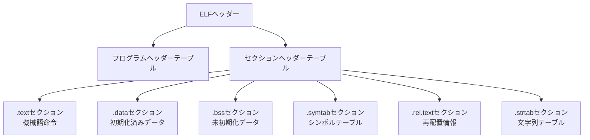
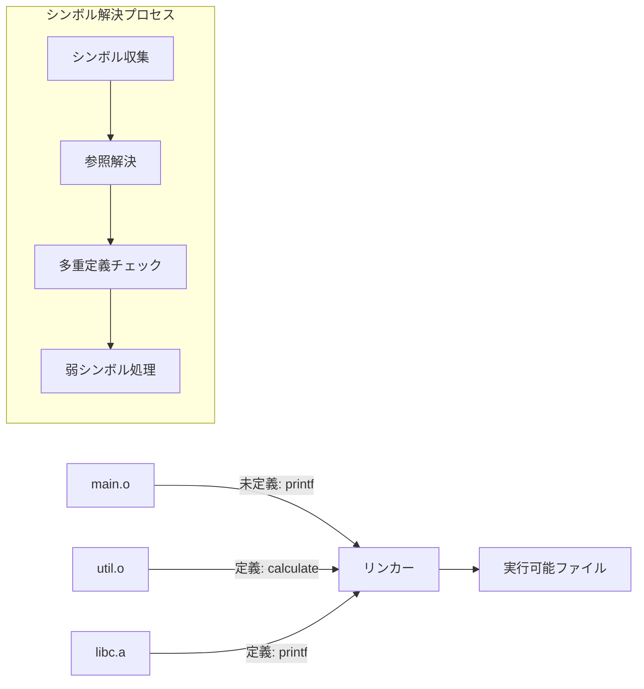
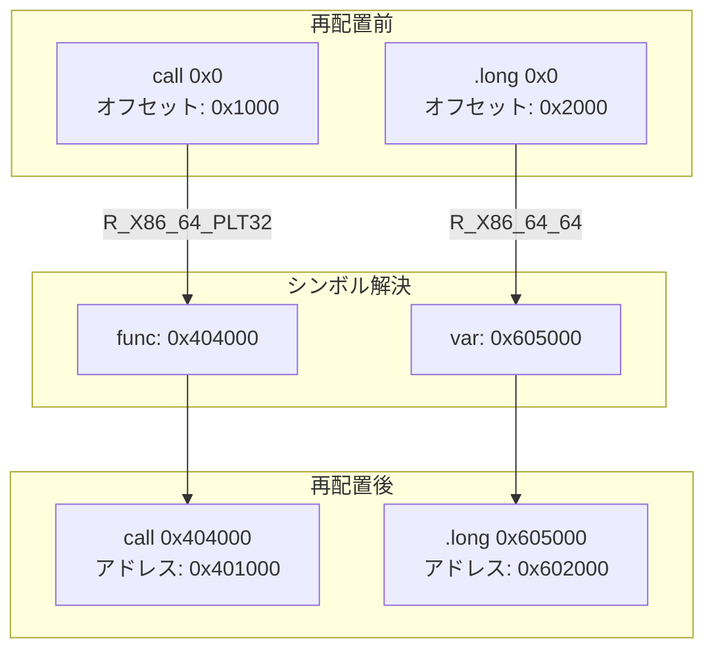
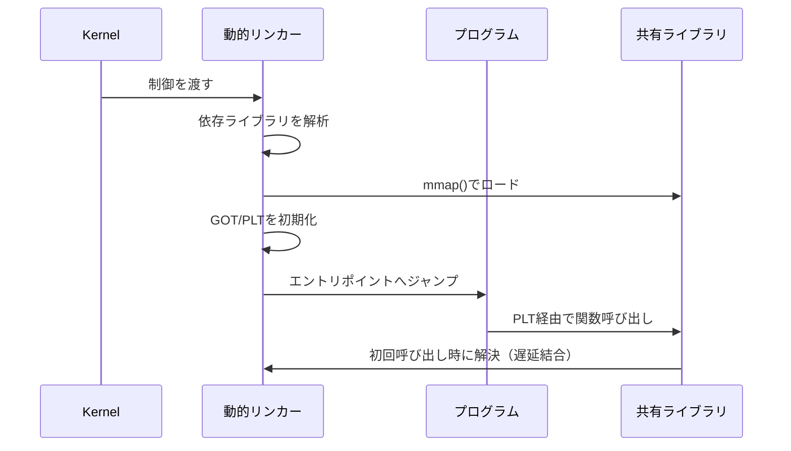
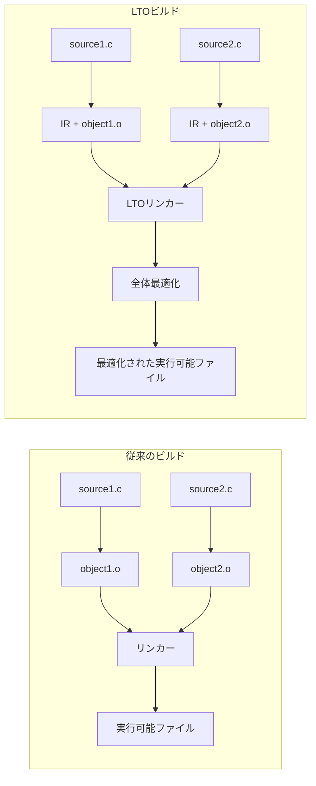

# リンカー: 分離コンパイルを実現する結合器

現代のソフトウェア開発において、プログラムを複数のソースファイルに分割して開発することは当然の手法となっている。この分離コンパイルの仕組みを支える中核的な存在がリンカーである。コンパイラがソースコードをオブジェクトファイルに変換した後、リンカーはこれらの断片を結合し、実行可能なプログラムを生成する。この一見単純に見える処理の背後には、シンボル解決、アドレス再配置、セクション結合といった複雑な処理が存在する。

リンカーの歴史は、プログラムが機械語で直接記述されていた時代まで遡る。初期のプログラマーは、サブルーチンを異なるメモリ位置に配置し、ジャンプ命令のアドレスを手動で計算していた。この作業の自動化がリンカーの起源である。1950年代後半には、IBMのFORTRANコンパイラシステムにおいて、プリミティブなリンカーが実装された[^1]。その後、UNIXの登場と共に、現在我々が知るリンカーの基本的な概念が確立された。

[^1]: John Backus et al. "The FORTRAN Automatic Coding System." Proceedings of the Western Joint Computer Conference, 1957.

## オブジェクトファイルの構造とリンカーの役割

リンカーを理解するためには、まずコンパイラが生成するオブジェクトファイルの構造を理解する必要がある。オブジェクトファイルは、機械語命令、データ、そしてこれらを結合するためのメタデータから構成される。ELF（Executable and Linkable Format）[^2]を例に取ると、オブジェクトファイルは複数のセクションに分割されている。

[^2]: Tool Interface Standard (TIS). "Executable and Linkable Format (ELF) Specification Version 1.2." 1995.



.textセクションには実行可能な機械語命令が格納され、.dataセクションには初期化済みのグローバル変数が配置される。.bssセクションは初期化されていないグローバル変数のための領域を表すが、実際のデータは含まない。これらのセクションに加えて、シンボルテーブルと再配置テーブルがリンカーにとって重要な情報源となる。

シンボルテーブルは、関数や変数の名前とその属性を記録する。各シンボルエントリには、シンボル名、値（通常はアドレス）、サイズ、タイプ、結合属性（binding）、可視性（visibility）などの情報が含まれる。結合属性は特に重要で、LOCAL（ファイル内のみ有効）、GLOBAL（他のファイルから参照可能）、WEAK（他に同名のGLOBALシンボルがあれば上書きされる）といった種類がある。

## シンボル解決のアルゴリズム

リンカーの最も基本的な役割は、未定義シンボルの参照を定義と結びつけることである。あるオブジェクトファイルで使用されているが定義されていない関数や変数を、他のオブジェクトファイルやライブラリから見つけ出す必要がある。このプロセスは、単純な名前の照合以上の複雑さを持つ。



リンカーは通常、2パスアルゴリズムを使用する。第1パスでは、すべての入力ファイルをスキャンし、定義されているシンボルと未定義のシンボルを収集する。この際、同じシンボルが複数回定義されている場合の処理が重要となる。C言語の場合、同じ関数が複数のファイルで定義されているとリンクエラーとなるが、弱シンボルの仕組みを使用することで、デフォルト実装を提供しながらユーザーによる上書きを許可できる。

静的ライブラリの処理には特別な考慮が必要である。静的ライブラリは複数のオブジェクトファイルをアーカイブしたものであり、リンカーは必要なオブジェクトファイルのみを抽出する。この選択的リンクにより、実行可能ファイルのサイズを最小限に抑えることができる。ただし、この処理にはリンク順序の問題が存在する。一般的に、依存される側のライブラリを後に指定する必要がある。

```c
// weak.c - 弱シンボルの例
__attribute__((weak)) void debug_print(const char* msg) {
    // Default implementation - do nothing
}

// main.c
extern void debug_print(const char* msg);

int main() {
    debug_print("Starting application");  // User can override debug_print
    return 0;
}
```

## アドレス再配置の詳細

オブジェクトファイル内のコードとデータは、通常0番地から始まるアドレスで記述されている。リンカーは、これらを最終的なメモリレイアウトに配置し、すべての参照を正しいアドレスに更新する必要がある。この処理を再配置（relocation）と呼ぶ。

再配置情報は、オブジェクトファイル内の特別なセクション（.rel.textや.rel.data）に格納される。各再配置エントリには、修正が必要な位置、参照しているシンボル、再配置のタイプなどが記録されている。x86-64アーキテクチャでは、R_X86_64_64（64ビット絶対アドレス）、R_X86_64_PC32（32ビット相対アドレス）、R_X86_64_PLT32（PLT経由の関数呼び出し）など、様々な再配置タイプが定義されている[^3]。

[^3]: H.J. Lu et al. "System V Application Binary Interface AMD64 Architecture Processor Supplement." 2018.



位置独立コード（Position Independent Code, PIC）の場合、再配置はより複雑になる。PICは、コードをメモリ上のどの位置にロードしても正しく動作するように設計されており、共有ライブラリの実装に不可欠である。PICでは、グローバルオフセットテーブル（GOT）とプロシージャリンケージテーブル（PLT）を使用して、間接的にシンボルを参照する。

## 動的リンクの仕組み

静的リンクがビルド時にすべての結合を完了するのに対し、動的リンクは実行時まで一部の結合を遅延させる。この仕組みにより、複数のプログラムが同じライブラリコードを共有でき、メモリ使用量の削減とライブラリの独立した更新が可能になる。

動的リンクの実装には、動的リンカー（ld.soやld-linux.so）が中心的な役割を果たす。プログラムの起動時、カーネルは実行可能ファイルをロードした後、動的リンカーに制御を渡す。動的リンカーは、必要な共有ライブラリをメモリにマップし、シンボルの解決と再配置を行う。



遅延結合（lazy binding）は、動的リンクの重要な最適化手法である。すべてのシンボルを起動時に解決するのではなく、実際に使用される時点まで解決を遅延させる。これにより、プログラムの起動時間を短縮できる。PLTの各エントリは、初回呼び出し時に動的リンカーのリゾルバ関数を呼び出し、実際の関数アドレスを解決してGOTエントリを更新する。

## リンクスクリプトによる制御

リンカーの動作は、リンクスクリプトによって詳細に制御できる。リンクスクリプトは、セクションの配置、メモリレイアウト、シンボルの定義などを指定する独自の言語で記述される。組み込みシステムやOSカーネルの開発では、メモリマップを厳密に制御する必要があるため、カスタムリンクスクリプトが不可欠である。

```txt
/* Example linker script */
MEMORY {
    ROM (rx)  : ORIGIN = 0x00000000, LENGTH = 256K
    RAM (rwx) : ORIGIN = 0x20000000, LENGTH = 64K
}

SECTIONS {
    .text : {
        *(.vectors)    /* Interrupt vectors first */
        *(.text)
        *(.text.*)
        *(.rodata)
        *(.rodata.*)
    } > ROM
    
    .data : AT(ADDR(.text) + SIZEOF(.text)) {
        _sdata = .;
        *(.data)
        *(.data.*)
        _edata = .;
    } > RAM
    
    .bss : {
        _sbss = .;
        *(.bss)
        *(.bss.*)
        *(COMMON)
        _ebss = .;
    } > RAM
}
```

このスクリプトでは、メモリ領域を定義し、各セクションをどのメモリ領域に配置するかを指定している。また、_sdataや_ebssといったシンボルを定義し、実行時の初期化コードがこれらを使用してデータセクションのコピーやBSSセクションのゼロクリアを行えるようにしている。

## 最適化技術と実装の詳細

現代のリンカーは、単なる結合器以上の役割を果たす。リンク時最適化（Link Time Optimization, LTO）では、コンパイラが生成した中間表現を保持し、リンク時に全プログラムを対象とした最適化を実行する。これにより、ファイル境界を越えたインライン展開や、使用されていないコードの除去が可能になる。



インクリメンタルリンクは、開発効率を向上させる重要な技術である。変更されたオブジェクトファイルのみを再リンクすることで、大規模プロジェクトのビルド時間を大幅に短縮できる。この実装には、前回のリンク状態を保持し、変更を検出して差分更新を行う仕組みが必要である。

並列リンクも、マルチコアプロセッサの性能を活用する重要な最適化である。シンボル解決やセクションのマージなど、独立して実行可能な処理を並列化することで、リンク時間を短縮できる。ただし、出力ファイルへの書き込みなど、順序性が必要な処理には注意が必要である。

## セキュリティ機能の実装

現代のリンカーは、セキュリティ強化のための様々な機能を提供する。アドレス空間配置のランダム化（ASLR）をサポートするため、位置独立実行可能ファイル（PIE）の生成が標準となっている。また、スタック実行防止（NX bit）、GOT/PLTの保護（RELRO）、スタックカナリアなど、様々なセキュリティ機能がリンク時に有効化される。

```bash
# Security-enhanced linking
gcc -o program main.c -fPIE -pie \
    -Wl,-z,relro -Wl,-z,now \
    -Wl,-z,noexecstack \
    -fstack-protector-strong
```

RELROは特に重要なセキュリティ機能である。部分RELRO（Partial RELRO）では、GOTセクションを読み取り専用にすることで、GOT上書き攻撃を防ぐ。完全RELRO（Full RELRO）では、すべてのシンボルを起動時に解決し、GOTとPLTを完全に読み取り専用にする。これにより、実行時のGOT/PLT改ざんによる攻撃を防ぐことができる。

## 実装における性能特性とトレードオフ

リンカーの性能は、大規模プロジェクトの開発効率に直接影響する。シンボル解決の計算量は、素朴な実装ではO(n×m)（nは未定義シンボル数、mは定義シンボル数）となるが、ハッシュテーブルを使用することでO(n)に改善できる。ただし、C++のような言語では、名前修飾（name mangling）により非常に長いシンボル名が生成されるため、ハッシュ関数の選択が性能に大きく影響する。

メモリ使用量も重要な考慮事項である。大規模プロジェクトでは、数十万のシンボルと数千のオブジェクトファイルを処理する必要がある。効率的なメモリ管理のため、多くのリンカーはメモリマップドファイルを使用し、必要な部分のみをメモリに保持する。

動的リンクと静的リンクのトレードオフも、システム設計において重要な決定事項である。静的リンクは、すべての依存関係を実行可能ファイルに含めるため、配布が簡単で起動も高速である。一方、実行可能ファイルのサイズが大きくなり、ライブラリの更新時にすべてのプログラムを再ビルドする必要がある。動的リンクは、メモリ効率とライブラリの独立更新を可能にするが、依存関係の管理が複雑になり、起動時のオーバーヘッドが発生する。

リンカーは、分離コンパイルという現代のソフトウェア開発の基本的なパラダイムを支える重要なツールである。その実装には、効率的なアルゴリズム、複雑なファイルフォーマットの処理、セキュリティ機能の統合など、多くの技術的課題が含まれる。コンパイラ技術の進化と共に、リンカーも進化を続けており、LTOのような全プログラム最適化や、より高度なセキュリティ機能の実装が進んでいる。プログラムのビルドプロセスを真に理解するためには、リンカーの動作原理を理解することが不可欠である。