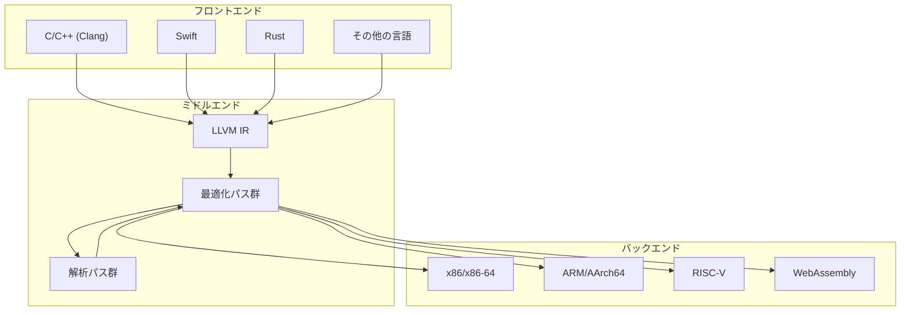
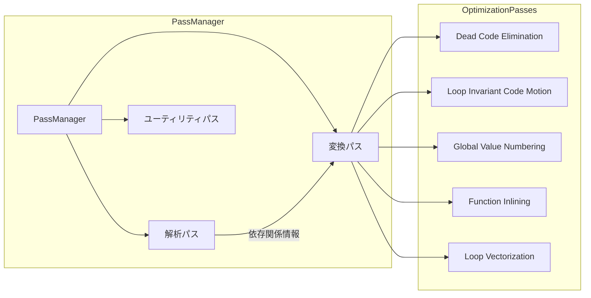
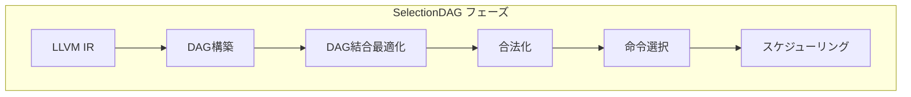
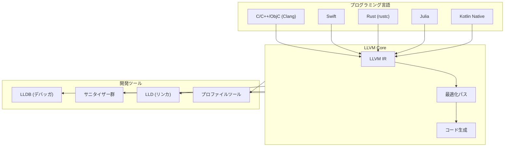

# LLVM: 現代的なコンパイラ基盤の内部構造と設計原理

LLVMは、モジュラーで再利用可能なコンパイラおよびツールチェーン技術の集合体として設計された、現代的なコンパイラ基盤である。その名称は当初「Low Level Virtual Machine」の略とされていたが、現在では単に「LLVM」という固有名詞として扱われている[^1]。2000年代初頭にイリノイ大学アーバナ・シャンペーン校でChris Lattnerによって開始されたこのプロジェクトは、今日では多くの主要なプログラミング言語のコンパイラ基盤として採用され、Apple、Google、Meta、Microsoftなどの大手テクノロジー企業によって活発に開発が続けられている。

LLVMの最も革新的な点は、従来の単一言語・単一ターゲットのコンパイラアーキテクチャとは異なり、言語に依存しない中間表現（LLVM IR）を中心に据えた設計にある。この設計により、フロントエンド（ソース言語の解析）、ミドルエンド（最適化）、バックエンド（ターゲットコード生成）が明確に分離され、各コンポーネントの独立した開発と再利用が可能となっている。



## LLVM IRの設計と特性

LLVM IRは、LLVMの中核を成す中間表現形式であり、静的単一代入形式（Static Single Assignment, SSA）[^2]に基づいて設計されている。SSA形式では、各変数は一度だけ代入され、使用される前に必ず定義されることが保証される。この性質により、データフロー解析や最適化の実装が大幅に簡略化される。

LLVM IRは三つの異なる形式で表現可能である。第一に、人間が読み書き可能なテキスト形式（.ll ファイル）があり、デバッグや教育目的で使用される。第二に、効率的な保存と読み込みのためのビットコード形式（.bc ファイル）があり、実際のコンパイルプロセスで主に使用される。第三に、メモリ内でのインメモリ表現があり、コンパイル時の変換や最適化で使用される。

```txt
; LLVM IRのテキスト形式の例
define i32 @factorial(i32 %n) {
entry:
  %cmp = icmp eq i32 %n, 0
  br i1 %cmp, label %base_case, label %recursive_case

base_case:
  ret i32 1

recursive_case:
  %n_minus_1 = sub i32 %n, 1
  %rec_result = call i32 @factorial(i32 %n_minus_1)
  %result = mul i32 %n, %rec_result
  ret i32 %result
}
```

LLVM IRの型システムは、低レベルでありながら強い型付けを提供する。基本的な整数型（i1、i8、i16、i32、i64など）、浮動小数点型（float、double）、ポインタ型、配列型、構造体型、関数型などが用意されている。特筆すべきは、LLVM IRが不透明型（opaque types）をサポートしており、型の循環参照を表現できる点である。

メモリモデルについても、LLVM IRは明確な定義を持つ。アドレス空間の概念により、異なるメモリ領域（グローバルメモリ、共有メモリ、定数メモリなど）を区別でき、GPUなどの特殊なアーキテクチャへの対応が可能となっている。また、アトミック操作とメモリオーダリングのセマンティクスも定義されており、並行プログラミングの正確な表現が可能である[^3]。

## 最適化パスとPassManagerの設計

LLVMの最適化フレームワークは、パス（Pass）と呼ばれる独立した変換単位を組み合わせることで構成される。各パスは特定の最適化や解析を実行し、PassManagerがこれらのパスの実行順序と依存関係を管理する。この設計により、最適化の追加や削除が容易になり、異なる最適化レベル（-O0、-O1、-O2、-O3）に応じた柔軟な構成が可能となる。



PassManagerは新旧二つのインフラストラクチャが存在する。旧PassManager（Legacy PassManager）は、Module、Function、Loop、BasicBlockの各レベルでパスを管理し、階層的な構造を持っていた。一方、新PassManager（New PassManager）は、より柔軟で効率的な設計を採用し、解析結果のキャッシングやパスの依存関係管理が改善されている。

主要な最適化パスには、以下のようなものがある。定数畳み込み（Constant Folding）は、コンパイル時に計算可能な式を事前に評価する。共通部分式除去（Common Subexpression Elimination）は、同一の計算を複数回行うコードを最適化する。ループ不変式移動（Loop Invariant Code Motion）は、ループ内で値が変化しない計算をループ外に移動する。関数のインライン展開（Function Inlining）は、関数呼び出しのオーバーヘッドを削減し、さらなる最適化の機会を生み出す。

特に興味深いのは、プロファイルガイド最適化（Profile-Guided Optimization, PGO）のサポートである。LLVMは実行時プロファイル情報を収集し、その情報を基に最適化の判断を行うことができる。例えば、実行頻度の高いコードパスに対してより積極的な最適化を適用したり、めったに実行されないエラー処理コードを最適化の対象から除外したりすることが可能である。

## バックエンドアーキテクチャと命令選択

LLVMのバックエンドは、LLVM IRから特定のターゲットアーキテクチャの機械語を生成する責任を持つ。このプロセスは複数の段階を経て実行され、各段階で異なる抽象度の表現が使用される。

命令選択（Instruction Selection）は、LLVM IRの命令をターゲット固有の命令に変換する最初の段階である。LLVMでは、SelectionDAGと呼ばれる有向非巡回グラフ（DAG）を用いてこのプロセスを実行する。SelectionDAGは、基本ブロック内の計算を表現し、命令間の依存関係を明示的に表現する。



TableGenは、LLVMのバックエンド開発において重要な役割を果たすドメイン固有言語である。ターゲットアーキテクチャの命令セット、レジスタ、呼び出し規約などの記述に使用され、これらの記述から命令選択器やアセンブラ、ディスアセンブラなどのコードが自動生成される[^4]。

レジスタ割り当ては、仮想レジスタを物理レジスタにマッピングする重要なフェーズである。LLVMは複数のレジスタ割り当てアルゴリズムを提供しており、高速だが品質が劣るFast Register Allocatorから、より洗練されたGreedy Register Allocatorまで選択できる。Greedy Register Allocatorは、優先度に基づいて仮想レジスタを物理レジスタに割り当て、必要に応じてスピルコード（レジスタの内容をメモリに退避するコード）を生成する。

命令スケジューリングは、命令の実行順序を決定し、パイプラインストールを最小化してスループットを最大化することを目的とする。LLVMは、基本的なリストスケジューリングから、より高度なモジュロスケジューリング（ソフトウェアパイプライニング）まで、複数のスケジューリングアルゴリズムを提供している。

## JITコンパイルとランタイム最適化

LLVMのJIT（Just-In-Time）コンパイル機能は、実行時にコードを生成し最適化する能力を提供する。これにより、動的言語の実装やランタイム特化による最適化が可能となる。LLVMは歴史的に複数のJITフレームワークを提供してきたが、現在の主流はORC（On-Request Compilation）JITである。

ORC JITは、遅延コンパイル、並列コンパイル、リモートJITなどの高度な機能をサポートする。また、複数の最適化レベルを動的に切り替えることができ、ホットスポットに対してより積極的な最適化を適用することが可能である。

```cpp
// ORC JITの基本的な使用例
auto JIT = ExitOnErr(LLLazyJITBuilder().create());
auto M = ExitOnErr(parseIRFile("input.ll", Err, Context));
ExitOnErr(JIT->addIRModule(ThreadSafeModule(std::move(M), Context)));

// 関数の検索と実行
auto MainSym = ExitOnErr(JIT->lookup("main"));
auto *Main = MainSym.toPtr<int(int, char*[])>();
int Result = Main(argc, argv);
```

JITコンパイルの利点は、実行時の情報を活用できることにある。例えば、特定の関数パラメータが常に同じ値を取ることが判明した場合、その値を定数として扱い、より効率的なコードを生成できる。また、実行環境のCPU機能（AVX、AVX2、AVX-512など）を検出し、利用可能な最も効率的な命令を使用することも可能である。

## フロントエンドとの統合とエコシステム

LLVMの成功の大きな要因の一つは、多様なプログラミング言語のフロントエンドとの統合が容易であることにある。Clang（C/C++/Objective-C）、Swift、Rust、Julia、Kotlin Nativeなど、多くの現代的な言語がLLVMを採用している。

各フロントエンドは、ソース言語の意味論をLLVM IRに変換する責任を持つ。この変換プロセスでは、言語固有の最適化（例えば、C++のコピー省略やRustの借用チェック後の最適化）を適用した後、LLVM IRを生成する。フロントエンドは、デバッグ情報の生成、プロファイル情報の埋め込み、サニタイザー（AddressSanitizer、ThreadSanitizerなど）のインストルメンテーションなども担当する。



LLVMのエコシステムには、コンパイラ以外にも多くの重要なツールが含まれている。LLDB（LLVM Debugger）は、LLVMベースの言語に対する高度なデバッグ機能を提供する。LLD（LLVM Linker）は、高速でメモリ効率的なリンカーとして設計されている。また、各種サニタイザーは、メモリエラー、データ競合、未定義動作などの検出に使用される。

## 設計上のトレードオフと実践的考察

LLVMの設計には、いくつかの重要なトレードオフが存在する。まず、中間表現の抽象度に関するトレードオフがある。LLVM IRは、高レベル言語の意味論を完全に表現するには低レベルすぎる一方、特定のハードウェアアーキテクチャに最適化するには高レベルすぎるという批判がある。このため、一部の言語（特にGCを必要とする言語）では、追加の抽象層が必要となる場合がある。

コンパイル時間とコード品質のトレードオフも重要な考慮事項である。LLVMの包括的な最適化パイプラインは、高品質なコードを生成する一方で、コンパイル時間が長くなる傾向がある。このため、開発時には最適化レベルを下げ、リリースビルドでのみ完全な最適化を適用するという実践が一般的である。

メモリ使用量も考慮すべき要素である。LLVM IRとその関連データ構造は、大規模なプログラムでは相当なメモリを消費する。特に、リンク時最適化（Link-Time Optimization, LTO）を使用する場合、プログラム全体のIRをメモリに保持する必要があり、メモリ要求量が大幅に増加する。

セキュリティの観点からも、いくつかの考慮事項がある。JITコンパイルを使用する場合、実行時にコードを生成するため、W^X（Write XOR Execute）ポリシーとの互換性を確保する必要がある。また、Control Flow Integrity（CFI）やStack Canariesなどのセキュリティ機能の実装も、パフォーマンスとのバランスを考慮しながら行う必要がある。

LLVMの将来的な発展方向として、MLIR（Multi-Level Intermediate Representation）[^5]の統合が注目されている。MLIRは、複数レベルの中間表現を統一的に扱うフレームワークであり、機械学習コンパイラやドメイン固有言語の実装に適している。これにより、LLVMのエコシステムはさらに拡大し、より多様なアプリケーション領域に対応できるようになると期待されている。

パフォーマンスの観点から、LLVMは継続的に改善されている。ベクトル化の改善、より高度なエイリアス解析、プロファイルガイド最適化の拡張などが進められている。また、新しいハードウェアアーキテクチャ（RISC-V、新しいGPUアーキテクチャなど）へのサポートも活発に追加されている。

実践的な観点から、LLVMを使用する際には以下の点に注意すべきである。第一に、適切な最適化レベルの選択が重要である。-O2は多くの場合で良いバランスを提供するが、特定のワークロードでは-O3やカスタム最適化パイプラインが有効な場合がある。第二に、デバッグビルドでは最適化を無効にし（-O0）、デバッグ情報を含める（-g）ことで、開発効率を向上させることができる。第三に、プロファイルガイド最適化を活用することで、実際の使用パターンに基づいた最適化が可能となる。

[^1]: Lattner, C. (2004). "LLVM: A Compilation Framework for Lifelong Program Analysis & Transformation". Proceedings of the 2004 International Symposium on Code Generation and Optimization (CGO'04).

[^2]: Cytron, R., Ferrante, J., Rosen, B. K., Wegman, M. N., & Zadeck, F. K. (1991). "Efficiently computing static single assignment form and the control dependence graph". ACM Transactions on Programming Languages and Systems, 13(4), 451-490.

[^3]: LLVM Language Reference Manual - Memory Model for Concurrent Operations. https://llvm.org/docs/LangRef.html#memory-model-for-concurrent-operations

[^4]: LLVM TableGen Documentation. https://llvm.org/docs/TableGen/

[^5]: Lattner, C., et al. (2021). "MLIR: Scaling Compiler Infrastructure for Domain Specific Computation". 2021 IEEE/ACM International Symposium on Code Generation and Optimization (CGO).