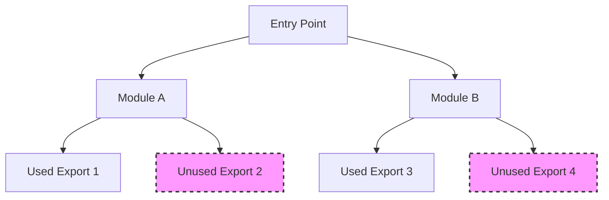
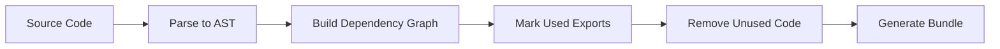
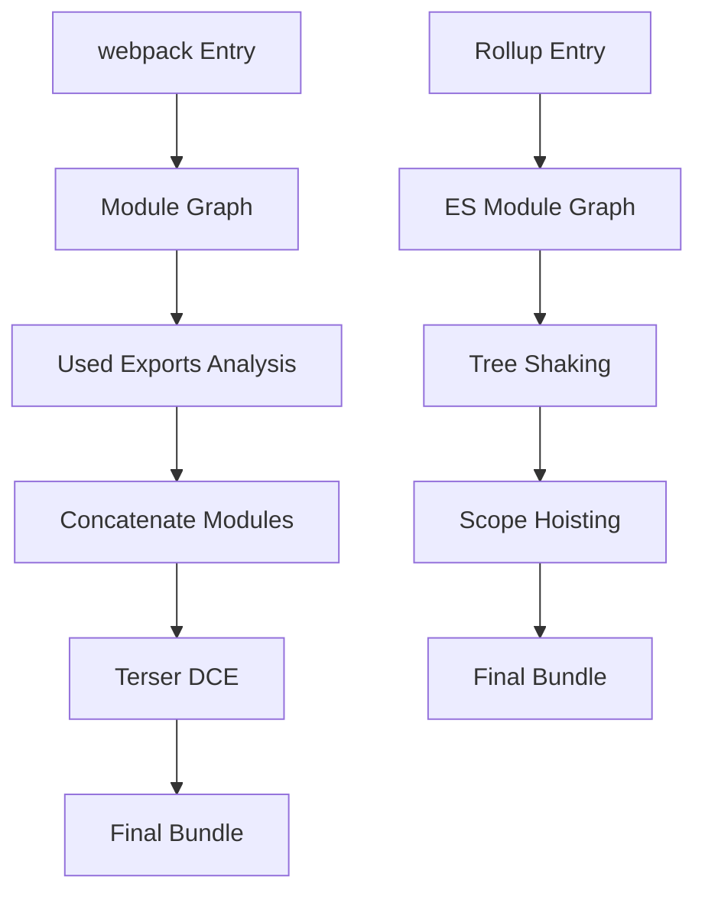

# Tree Shaking

Tree Shakingは、JavaScriptバンドラーにおけるコード最適化技術として、現代のフロントエンド開発において欠かせない要素となっています。この技術は、アプリケーションで実際に使用されていないコード（dead code）を最終的なバンドルから除去することで、配信されるJavaScriptのサイズを大幅に削減します。名称の由来は、木を揺らして枯れた枝葉を落とすという比喩から来ており、生きている（実際に使用される）コードのみを残すという概念を表現しています[^1]。

Tree Shakingの実現には、ECMAScript 2015（ES6）で導入されたモジュールシステムの静的構造が重要な役割を果たしています。従来のCommonJSモジュールシステムとは異なり、ES Modulesは静的な構造を持つため、ビルド時にどのエクスポートが実際に使用されているかを確実に判定できます。この静的解析可能性こそが、Tree Shakingを可能にする技術的基盤となっています。

## ESモジュールシステムとの密接な関係

ES Modulesの仕様[^2]では、`import`と`export`文はモジュールのトップレベルでのみ使用可能であり、条件分岐や関数内部では使用できません。この制約により、モジュール間の依存関係がビルド時に完全に決定可能となります。

```javascript
// ES Modules - static structure
import { utility } from './utils';

// CommonJS - dynamic structure
const utility = require('./utils').utility;
```

この静的構造により、バンドラーは依存グラフを構築し、各モジュールのどの部分が実際に使用されているかを正確に追跡できます。Tree Shakingの効果を最大化するには、ライブラリ開発者がES Modulesフォーマットでコードを配布することが重要です。



## 静的解析とDead Code Eliminationのメカニズム

Tree Shakingの実装は、コンパイラ理論におけるDead Code Elimination（DCE）の応用です。しかし、従来のDCEが到達不可能なコードを除去するのに対し、Tree Shakingは未使用のエクスポートを除去するという、より高度な最適化を行います。

バンドラーは以下のステップでTree Shakingを実行します：

1. **AST（Abstract Syntax Tree）の構築**: ソースコードを解析し、抽象構文木を構築します
2. **依存グラフの生成**: 各モジュール間の依存関係を表すグラフを構築します
3. **マーキングフェーズ**: エントリーポイントから開始し、実際に使用されるエクスポートをマークします
4. **除去フェーズ**: マークされていないエクスポートとその依存コードを除去します



重要な点は、Tree Shakingが純粋関数的なコードに対して最も効果的に機能するということです。副作用（side effects）を含むコードは、たとえ明示的に使用されていなくても除去できない場合があります。

## 副作用の取り扱いと最適化の限界

JavaScriptにおける副作用とは、モジュールのロード時に実行される、純粋な値の計算以外の処理を指します。例えば、グローバル変数の変更、DOMの操作、console.logの実行などが該当します。

```javascript
// Side effect - cannot be removed
window.myGlobal = 'value';

// Pure export - can be removed if unused
export const pureFunction = (x) => x * 2;
```

package.jsonの`sideEffects`フィールド[^3]は、この問題に対する実践的な解決策です。ライブラリ開発者は、モジュールが副作用を含まないことを明示的に宣言できます：

```json
{
  "name": "my-library",
  "sideEffects": false
}
```

また、特定のファイルのみが副作用を含む場合は、配列で指定できます：

```json
{
  "sideEffects": ["./src/polyfills.js", "*.css"]
}
```

Tree Shakingの限界として、動的インポートや計算されたプロパティアクセスは静的解析できないため、最適化の対象外となります：

```javascript
// Cannot be tree-shaken
const methodName = 'method' + Math.random();
import('./module')[methodName]();
```

## 実装における技術的詳細

現代のバンドラー（webpack、Rollup、esbuild等）におけるTree Shakingの実装は、それぞれ異なるアプローチを採用していますが、基本的な原理は共通しています。

Rollupは最も純粋なTree Shaking実装を持ち、ES Modulesネイティブなアプローチを採用しています。一方、webpackはより複雑な最適化パイプラインの一部としてTree Shakingを実装しており、TerserプラグインとDeadCodeEliminationを組み合わせて使用します[^4]。



Tree Shakingの効果を測定する際は、バンドルサイズの削減率だけでなく、パースとコンパイル時間の短縮も考慮する必要があります。未使用コードの除去により、ブラウザでのJavaScript実行時のパフォーマンスも向上します。

## パフォーマンスへの影響と最適化戦略

Tree Shakingによるバンドルサイズの削減は、ネットワーク転送時間の短縮だけでなく、JavaScriptエンジンのパース時間とコンパイル時間にも直接的な影響を与えます。V8エンジンの研究[^5]によると、JavaScriptのパース時間はコードサイズにほぼ線形に比例することが示されています。

実践的な最適化戦略として、以下のアプローチが効果的です：

**Named Exportsの活用**: Default exportsよりもnamed exportsを使用することで、Tree Shakingの精度が向上します。Default exportsは全体をインポートする傾向があり、部分的な除去が困難になります。

**バレルエクスポートの回避**: index.jsファイルですべてのモジュールを再エクスポートする「バレルエクスポート」パターンは、Tree Shakingの効果を低下させる可能性があります。

```javascript
// Avoid barrel exports
// index.js
export * from './moduleA';
export * from './moduleB';
export * from './moduleC';

// Prefer direct imports
import { specificFunction } from './moduleA';
```

**Pure注釈の活用**: webpackとTerserは`/*#__PURE__*/`注釈をサポートしており、関数呼び出しが副作用を持たないことを明示的に示すことができます：

```javascript
const result = /*#__PURE__*/ calculateExpensiveValue();
```

## クロスモジュール最適化と高度な技術

Tree Shakingの発展形として、クロスモジュール最適化があります。これは、複数のモジュール間で重複するコードを検出し、共通化する技術です。Rollupのscope hoistingやwebpackのModuleConcatenationPluginがこの機能を提供しています。

さらに高度な最適化として、Closure Compilerで実装されているProperty Renamingがあります。これは、オブジェクトのプロパティ名を短縮することで、さらなるサイズ削減を実現します。ただし、この最適化は動的なプロパティアクセスとの互換性問題があるため、慎重な適用が必要です。

## 実装上の考慮事項とトレードオフ

Tree Shakingを効果的に活用するためには、コードベースの設計段階から考慮する必要があります。モジュールの粒度、エクスポートの構造、副作用の管理など、多くの要素が最終的な最適化効果に影響します。

ライブラリ開発においては、Tree Shakingフレンドリーなコードを書くことが重要です。これには、副作用を最小限に抑え、純粋関数的なアプローチを採用し、ES Modulesフォーマットでの配布が含まれます。

一方で、Tree Shakingにも計算コストが存在します。大規模なコードベースでは、依存グラフの構築と解析に相当な時間がかかる可能性があります。開発時のビルド速度とプロダクションビルドの最適化レベルのバランスを取ることが重要です。

Tree Shakingは、現代のJavaScript開発における重要な最適化技術として確立されています。ES Modulesの静的構造を活用することで、未使用コードの除去を自動化し、アプリケーションのパフォーマンスを大幅に向上させることができます。しかし、その効果を最大化するためには、副作用の管理、適切なモジュール設計、そして各バンドラーの特性を理解した上での実装が不可欠です。

[^1]: Rich Harris, "Tree-shaking versus dead code elimination", 2015, https://medium.com/@Rich_Harris/tree-shaking-versus-dead-code-elimination-d3765df85c80

[^2]: ECMAScript 2015 Language Specification, Section 15.2: Modules, https://262.ecma-international.org/6.0/#sec-modules

[^3]: webpack documentation, "Tree Shaking", https://webpack.js.org/guides/tree-shaking/

[^4]: Tobias Koppers, "webpack 4: Code Splitting, chunk graph and the splitChunks optimization", 2018, https://medium.com/webpack/webpack-4-code-splitting-chunk-graph-and-the-splitchunks-optimization-be739a861366

[^5]: V8 Team, "JavaScript parsing and compilation performance", 2019, https://v8.dev/blog/cost-of-javascript-2019