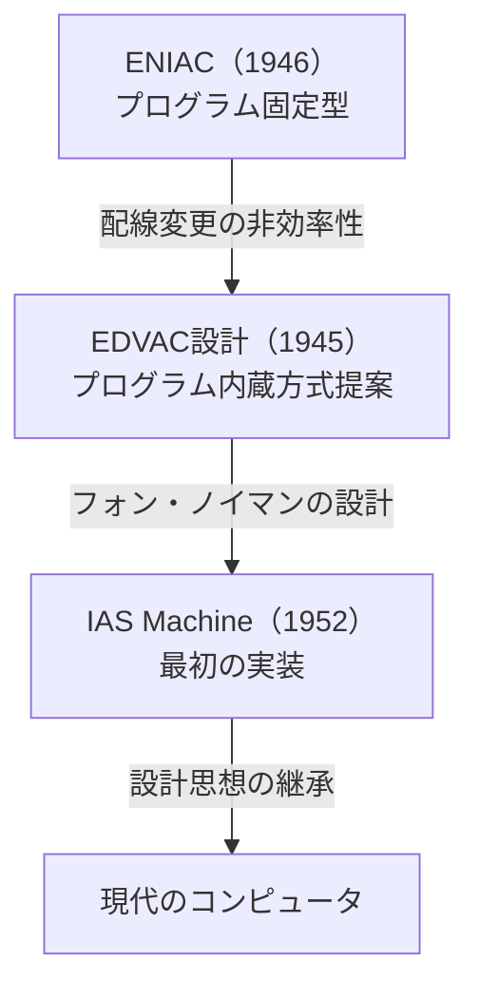
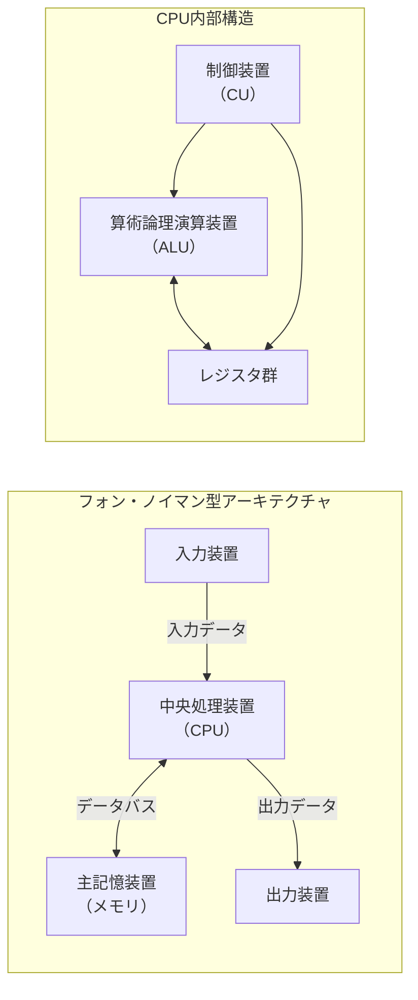
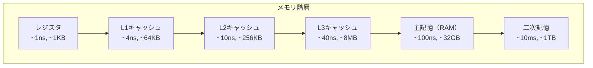
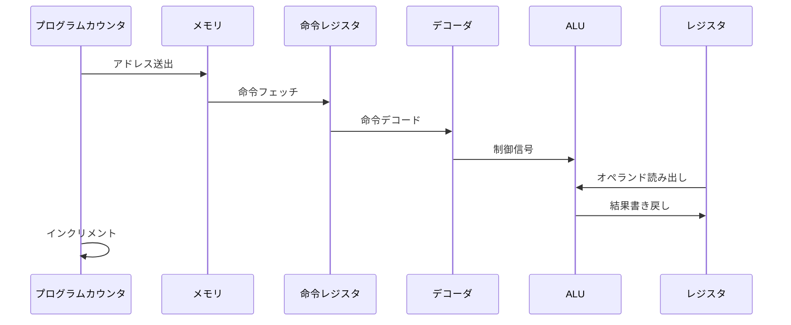
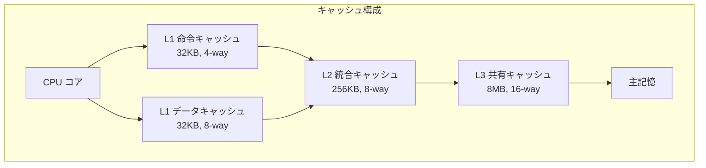
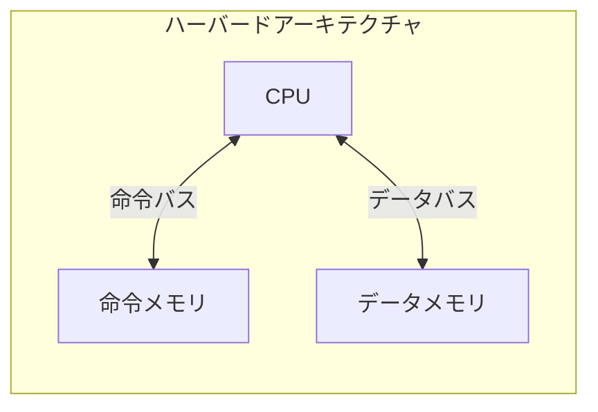
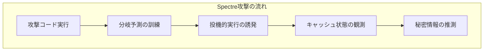
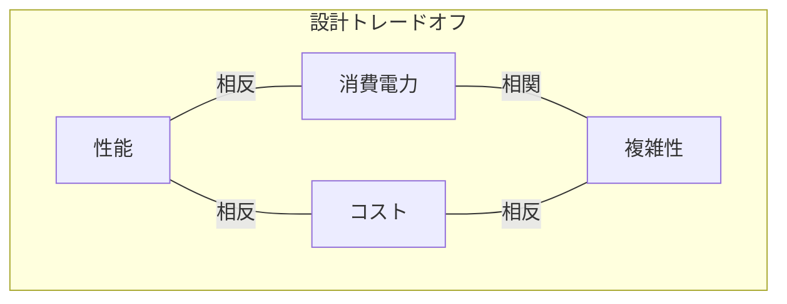

# フォン・ノイマン型コンピュータ

フォン・ノイマン型コンピュータは、現代のコンピュータアーキテクチャの基礎を成す設計思想であり、プログラムとデータを同一のメモリ空間に格納し、逐次的に命令を実行する計算機構造を指す。1945年6月30日に発表されたジョン・フォン・ノイマンによる「First Draft of a Report on the EDVAC」[^1]に記述されたこのアーキテクチャは、その革新性により今日に至るまでコンピュータ設計の主流となっている。

## 歴史的背景と誕生の経緯

第二次世界大戦中、弾道計算などの軍事的要求により計算機の高速化が急務となっていた。ENIACのようなプログラム固定型計算機では、新しい計算を行うたびに配線の変更が必要であり、この作業に数日から数週間を要していた。この問題を解決すべく、プリンストン高等研究所のフォン・ノイマンは、ペンシルベニア大学のムーアスクールで開発中だったEDVACプロジェクトに参加し、プログラム内蔵方式という革新的な概念を提案した。

フォン・ノイマンの提案は、それまでの計算機設計における根本的なパラダイムシフトをもたらした。プログラムを配線ではなくメモリに格納することで、計算機は汎用性と柔軟性を獲得した。この設計思想は、単なる技術的改良ではなく、計算の概念そのものを変革するものであった。



## アーキテクチャの基本原理

フォン・ノイマン型アーキテクチャの核心は、以下の5つの基本原理に集約される。

第一に、**プログラム内蔵方式**である。プログラムをデータと同様にメモリに格納することで、プログラムの変更が単なるメモリ内容の書き換えで可能となる。この原理により、コンピュータは真の意味での汎用計算機となった。

第二に、**二進法による情報表現**を採用している。すべての情報（命令およびデータ）は二進数で表現され、電子回路での実装が容易になる。フォン・ノイマンは10進法も検討したが、回路の簡潔性から二進法を選択した[^2]。

第三に、**逐次制御方式**による命令実行である。プログラムカウンタが指す命令を順次実行し、分岐命令によってのみ実行順序が変更される。この単純な制御方式は、ハードウェア実装を簡潔にすると同時に、プログラミングの概念を明確にした。

第四に、**単一アドレス空間**の採用である。命令とデータが同一のメモリ空間に配置されることで、メモリ管理が統一され、プログラムによるプログラムの生成や修正（自己書き換えコード）が可能となる。

第五に、**演算の中央集権化**である。すべての演算は中央処理装置（CPU）で実行され、メモリは単なる記憶装置として機能する。この明確な機能分離により、各構成要素の設計が独立して最適化可能となった。



## 主要構成要素の詳細

フォン・ノイマン型コンピュータは、中央処理装置（CPU）、主記憶装置（メモリ）、入出力装置、およびこれらを接続するバスシステムから構成される。各構成要素は明確に定義された機能を持ち、標準化されたインターフェースで相互接続される。

### 中央処理装置（CPU）

CPUは計算機の頭脳として機能し、プログラムの実行と全体の制御を担当する。その内部は制御装置（Control Unit）、算術論理演算装置（Arithmetic Logic Unit: ALU）、レジスタ群から構成される。

制御装置は、メモリから命令をフェッチし、デコードして、各構成要素に適切な制御信号を送出する。命令デコーダは命令のビットパターンを解析し、マイクロプログラムまたはハードワイヤードロジックによって制御信号列を生成する。現代のプロセッサでは、パイプライン処理やアウトオブオーダー実行などの高度な制御機構が実装されているが、基本的な制御の流れはフォン・ノイマンの原設計を踏襲している。

ALUは実際の演算を実行する回路であり、加減乗除の算術演算と、論理積・論理和・排他的論理和などの論理演算を行う。初期のコンピュータでは固定小数点演算のみをサポートしていたが、現代では浮動小数点演算ユニット（FPU）やベクトル演算ユニットが統合されている。

レジスタは高速な一時記憶装置として機能し、演算対象のデータや中間結果を保持する。汎用レジスタ、プログラムカウンタ（PC）、スタックポインタ（SP）、ステータスレジスタなどが典型的である。レジスタ数とビット幅はアーキテクチャの性能を大きく左右する要素となる。

### 主記憶装置（メモリ）

主記憶装置は、プログラムとデータを格納する大容量の記憶装置である。フォン・ノイマン型アーキテクチャでは、命令とデータが区別なく格納されるため、メモリの任意の位置に命令またはデータを配置できる。この柔軟性は、動的メモリ割り当てや自己書き換えコードなどの高度なプログラミング技法を可能にする。

メモリは番地（アドレス）によってアクセスされ、各番地には固定長のデータ（通常8ビット＝1バイト）が格納される。アドレス空間のサイズは、アドレスバスの幅によって決定される。32ビットアーキテクチャでは4GBのアドレス空間を、64ビットアーキテクチャでは理論上16EBのアドレス空間を扱える。

現代のメモリシステムは、アクセス速度と容量のトレードオフを解決するため、階層的な構造を採用している。レジスタ、キャッシュメモリ（L1/L2/L3）、主記憶（RAM）、二次記憶（HDD/SSD）という階層により、頻繁にアクセスされるデータを高速なメモリに配置する。



### バスシステム

バスは各構成要素を接続する通信路であり、データバス、アドレスバス、制御バスから構成される。データバスはデータの転送に、アドレスバスはメモリアドレスの指定に、制御バスは読み書き信号やタイミング信号の伝送に使用される。

バス幅（ビット数）は一度に転送できるデータ量を決定し、システム性能に直接影響する。初期の8ビットコンピュータから、現代の64ビットシステムまで、バス幅の拡張は性能向上の重要な要素となってきた。

## 命令サイクルの詳細

フォン・ノイマン型コンピュータの動作は、命令サイクルの繰り返しによって実現される。命令サイクルは、フェッチ（Fetch）、デコード（Decode）、実行（Execute）、ライトバック（Write-back）の4段階から構成される基本的な動作単位である。

### フェッチ段階

フェッチ段階では、プログラムカウンタ（PC）が指すメモリアドレスから次の命令を読み出す。この過程は以下のマイクロ操作に分解される：

1. PCの内容をメモリアドレスレジスタ（MAR）に転送
2. メモリ読み出し信号を制御バスに送出
3. 指定アドレスのメモリ内容をメモリデータレジスタ（MDR）に読み込み
4. MDRの内容を命令レジスタ（IR）に転送
5. PCをインクリメント（次の命令アドレスを指すように更新）

この一連の操作により、実行すべき命令がCPU内部に取り込まれる。現代のプロセッサでは、命令プリフェッチや分岐予測により、フェッチ段階の高速化が図られている。

### デコード段階

デコード段階では、命令レジスタに格納された命令のビットパターンを解析し、実行すべき操作を決定する。命令フォーマットはアーキテクチャによって異なるが、一般的にオペコード（操作コード）とオペランド（操作対象）から構成される。

```
典型的な命令フォーマット例（32ビット RISC）：
[オペコード:6bit][レジスタ1:5bit][レジスタ2:5bit][レジスタ3:5bit][機能:11bit]
```

命令デコーダは、オペコードを解析して制御信号を生成する。CISC（Complex Instruction Set Computer）アーキテクチャでは、マイクロプログラム方式により複雑な命令を基本的なマイクロ命令列に分解する。一方、RISC（Reduced Instruction Set Computer）アーキテクチャでは、ハードワイヤード制御により高速なデコードを実現する。

### 実行段階

実行段階では、デコードされた命令に従って実際の処理を行う。演算命令の場合はALUで計算を実行し、メモリアクセス命令の場合はメモリの読み書きを行い、分岐命令の場合はPCの更新を行う。

演算の実行では、レジスタファイルから操作対象のデータを読み出し、ALUに送って演算を実行する。現代のプロセッサでは、複数のALUを搭載し、命令レベル並列性（ILP）を活用して複数の演算を同時実行する。

### ライトバック段階

ライトバック段階では、実行結果をレジスタファイルまたはメモリに書き戻す。この段階でプロセッサの状態が更新され、次の命令サイクルに備える。条件分岐命令の場合は、演算結果に基づいてPCを更新し、プログラムの実行フローを制御する。



## フォン・ノイマンボトルネックとその対策

フォン・ノイマン型アーキテクチャの最大の制約は、CPUとメモリ間の単一のバスによるデータ転送のボトルネックである。この問題は「フォン・ノイマンボトルネック」として知られ、プロセッサの処理速度がメモリアクセス速度を大きく上回る現代において特に深刻である。

ボトルネックの本質は、命令とデータが同一のバスを共有することにある。CPUが命令をフェッチしている間はデータアクセスができず、逆にデータアクセス中は次の命令をフェッチできない。この制約により、理論的な処理能力の多くが未使用のまま浪費される。

### キャッシュメモリによる緩和

キャッシュメモリは、頻繁にアクセスされるデータと命令をCPUに近い高速メモリに保持することで、メモリアクセスの遅延を隠蔽する。現代のプロセッサでは、多段階のキャッシュ階層（L1、L2、L3）を実装し、それぞれ異なるサイズとアクセス速度を持つ。

L1キャッシュは通常、命令キャッシュとデータキャッシュに分離され、疑似的なハーバードアーキテクチャを実現する。これにより、命令フェッチとデータアクセスを同時に行うことが可能となる。キャッシュの効率は、プログラムの局所性（時間的局所性と空間的局所性）に大きく依存する。



### パイプライン処理

命令パイプラインは、命令の実行を複数の段階に分割し、各段階を並列に実行することで実効的な処理速度を向上させる。典型的な5段パイプラインでは、異なる命令のフェッチ、デコード、実行、メモリアクセス、ライトバック段階が同時に進行する。

パイプライン処理により、理想的には1クロックサイクルあたり1命令の実行が可能となる。しかし、データ依存性、制御依存性、構造ハザードなどの問題により、パイプラインストールが発生することがある。これらの問題は、フォワーディング、分岐予測、アウトオブオーダー実行などの技術により緩和される。

### プリフェッチとメモリ階層

命令とデータのプリフェッチは、将来必要となる情報を事前にメモリから読み出しておく技術である。ハードウェアプリフェッチャーは、アクセスパターンを監視し、次にアクセスされる可能性の高いデータを予測してキャッシュにロードする。

メモリ階層の各レベルでは、異なる最適化技術が適用される。例えば、Translation Lookaside Buffer（TLB）は仮想アドレスから物理アドレスへの変換を高速化し、メモリバンクのインターリーブはメモリバンド幅を向上させる。

## ハーバードアーキテクチャとの比較

ハーバードアーキテクチャは、命令用とデータ用に別々のメモリとバスを持つ設計であり、フォン・ノイマンボトルネックを根本的に解決する。この設計により、命令フェッチとデータアクセスを完全に並列化できる。

初期のハーバードアーキテクチャは、Harvard Mark Iで採用された。現代では、デジタル信号プロセッサ（DSP）やマイクロコントローラで広く使用されている。これらの用途では、プログラムが固定的であり、リアルタイム性が要求されるため、ハーバードアーキテクチャの利点が活きる。



一方で、ハーバードアーキテクチャには、プログラムメモリとデータメモリの境界が固定的であるという制約がある。動的なメモリ割り当てや、プログラムをデータとして扱う操作（動的リンク、JITコンパイルなど）が困難となる。このため、汎用コンピュータではフォン・ノイマン型が主流となっている。

現代のプロセッサでは、両アーキテクチャの利点を組み合わせた「修正ハーバードアーキテクチャ」が採用されることが多い。L1レベルでは命令とデータのキャッシュを分離し、それより下位のメモリ階層では統合メモリ空間を使用する。これにより、性能と柔軟性のバランスを実現している。

## 現代的な拡張と最適化

フォン・ノイマン型アーキテクチャは、その基本原理を保ちながら、様々な拡張と最適化が施されてきた。これらの技術革新により、初期の設計から数万倍以上の性能向上が実現されている。

### スーパースカラー実行

スーパースカラープロセッサは、複数の実行ユニットを搭載し、1クロックサイクルあたり複数の命令を実行する。命令レベル並列性（ILP）を動的に検出し、データ依存性のない命令を並列実行する。Intel Core i9やAMD Ryzen 9などの現代のハイエンドプロセッサは、6～8個の実行ユニットを持ち、理論上1サイクルあたり6～8命令の実行が可能である。

スーパースカラー実行を効率的に行うためには、高度な命令スケジューリングが必要となる。レジスタリネーミング、投機的実行、アウトオブオーダー実行などの技術により、見かけ上の依存関係を解消し、実行可能な命令を積極的に並列化する。

### SIMD（Single Instruction Multiple Data）拡張

SIMD命令は、単一の命令で複数のデータ要素に対して同じ演算を実行する。画像処理、信号処理、科学計算などのデータ並列性の高いアプリケーションで特に効果的である。Intel のAVX-512は、512ビット幅のベクトルレジスタを使用し、一度に16個の32ビット浮動小数点数の演算が可能である。

```c
// SIMD演算の概念例（疑似コード）
// 通常のスカラー演算
for (int i = 0; i < 16; i++) {
    c[i] = a[i] + b[i];
}

// SIMD演算（1命令で16要素を処理）
vector_add(c, a, b);  // 内部で16要素を並列処理
```

### マルチコア・メニーコアアーキテクチャ

単一コアの性能向上が物理的限界に近づく中、複数のプロセッサコアを統合するマルチコアアーキテクチャが主流となった。各コアは独立したフォン・ノイマン型プロセッサとして動作し、共有メモリを通じて協調動作する。

現代のサーバープロセッサでは、64コア以上を搭載するものも珍しくない。これらのコアは、NUMA（Non-Uniform Memory Access）アーキテクチャにより、階層的なメモリアクセスを実現する。キャッシュコヒーレンシプロトコル（MESI、MOESIなど）により、各コアのキャッシュ間でデータの一貫性を保証する。

### 投機的実行と分岐予測

分岐予測は、条件分岐の結果を予測し、予測に基づいて命令を投機的に実行する技術である。現代の分岐予測器は、過去の分岐履歴を学習し、95%以上の予測精度を達成する。Two-level adaptive predictorやTournament predictorなどの高度なアルゴリズムが使用される。

投機的実行により、分岐の結果が確定する前に後続の命令を実行できる。予測が外れた場合は、投機的に実行した結果を破棄し、正しい分岐先から実行を再開する。この技術により、深いパイプラインでも効率的な実行が可能となる。

## セキュリティへの影響と対策

フォン・ノイマン型アーキテクチャの特性は、セキュリティ上の脆弱性の原因ともなる。命令とデータが同一メモリ空間に存在することで、バッファオーバーフローなどの攻撃により、データ領域に注入された悪意のあるコードが実行される可能性がある。

### DEP（Data Execution Prevention）とNXビット

DEPは、メモリページに実行権限のフラグを設定し、データ領域でのコード実行を防ぐ技術である。x86-64アーキテクチャのNXビット（No eXecute）、ARMのXN（eXecute Never）ビットなどがこれに相当する。ページテーブルエントリに実行可能フラグを追加することで、ハードウェアレベルでコード実行を制限する。

### ASLR（Address Space Layout Randomization）

ASLRは、プログラムのメモリ配置をランダム化することで、攻撃者が特定のアドレスを推測することを困難にする。スタック、ヒープ、共有ライブラリの配置がプロセス起動時にランダムに決定される。これにより、Return-Oriented Programming（ROP）などの攻撃手法の成功率を大幅に低下させる。

### Spectre/Meltdown脆弱性

2018年に発見されたSpectreとMeltdown脆弱性は、投機的実行の副作用を利用してメモリの内容を読み出す攻撃である。これらの脆弱性は、フォン・ノイマン型アーキテクチャの性能最適化技術に内在する根本的な問題を露呈した。

対策として、マイクロコードアップデート、OSレベルでのページテーブル分離（KPTI）、投機的実行の制限などが実装された。しかし、これらの対策は性能低下を伴うため、セキュリティと性能のトレードオフが新たな設計課題となっている。



## 将来の展望と代替アーキテクチャ

フォン・ノイマン型アーキテクチャは70年以上にわたってコンピュータ設計の主流であり続けているが、新たな計算パラダイムの探求も進んでいる。量子コンピューティング、ニューロモーフィックコンピューティング、データフロー型アーキテクチャなどが、特定の問題領域で従来型コンピュータを凌駕する可能性を示している。

### メモリ中心コンピューティング

Processing-In-Memory（PIM）やNear-Data Processingは、演算機能をメモリに統合することでフォン・ノイマンボトルネックを根本的に解決しようとする試みである。HBM（High Bandwidth Memory）やHMC（Hybrid Memory Cube）などの3Dスタックメモリ技術により、メモリバンド幅の大幅な向上が実現されている。

### 量子コンピューティングとの関係

量子コンピュータは、量子重ね合わせと量子もつれを利用して、特定の問題を指数関数的に高速に解く可能性を持つ。しかし、量子コンピュータの制御には依然として古典的なフォン・ノイマン型コンピュータが必要であり、両者は相補的な関係にある。

量子-古典ハイブリッドアルゴリズムでは、量子プロセッサが特定の計算カーネルを実行し、古典的なコンピュータが全体の制御と前処理・後処理を担当する。この協調動作により、それぞれの長所を活かした効率的な計算が可能となる。

## 実装における設計上のトレードオフ

フォン・ノイマン型アーキテクチャの実装では、様々な設計上のトレードオフが存在する。これらのトレードオフは、目標とする用途、コスト制約、消費電力要件などによって最適解が異なる。

### 命令セットアーキテクチャの選択

RISC（Reduced Instruction Set Computer）とCISC（Complex Instruction Set Computer）の選択は、基本的な設計思想の違いを反映する。RISCは単純な命令セットによりハードウェアを簡潔にし、高クロック動作を可能にする。一方、CISCは複雑な命令により、コード密度を高め、メモリアクセスを削減する。

現代では、両者の境界は曖昧になっている。x86-64のようなCISCアーキテクチャも、内部ではマイクロオペレーションに分解してRISC的な実行を行う。ARM AArch64のようなRISCアーキテクチャも、SIMD命令などの複雑な命令を追加している。

### パイプライン深度の最適化

深いパイプラインは高クロック周波数を可能にするが、分岐予測ミスのペナルティが大きくなる。Intel Pentium 4の31段パイプラインは、高クロック動作を実現したが、実効性能では期待を下回った。現代のプロセッサでは、14～20段程度のパイプラインが一般的である。

パイプライン深度の選択は、目標クロック周波数、分岐予測精度、消費電力、製造プロセスの特性などを総合的に考慮して決定される。モバイル向けプロセッサでは、消費電力の観点から浅いパイプラインが選択されることが多い。

### キャッシュ構成の最適化

キャッシュのサイズ、連想度、置換アルゴリズムは、性能とコストのトレードオフを決定する重要な要素である。大容量キャッシュはヒット率を向上させるが、アクセス遅延と消費電力が増加する。高連想度はコンフリクトミスを削減するが、タグ比較の複雑性が増す。

包含性（Inclusive/Exclusive/Non-Inclusive Non-Exclusive）の選択も重要である。包含キャッシュはコヒーレンシ制御を簡潔にするが、実効容量が減少する。排他キャッシュは実効容量を最大化するが、制御が複雑になる。



フォン・ノイマン型コンピュータは、その誕生から現在に至るまで、コンピュータサイエンスの中核を成してきた。プログラム内蔵方式という革新的な概念は、現代の情報社会の基盤となっている。技術的な制約や課題は存在するものの、継続的な改良と拡張により、その基本原理は今後も計算機設計の指導原理として機能し続けるであろう。新たな計算パラダイムが登場しても、フォン・ノイマン型アーキテクチャの設計思想と実装技術は、計算機工学の重要な知識体系として価値を持ち続ける。

[^1]: von Neumann, J. (1945). "First Draft of a Report on the EDVAC". Moore School of Electrical Engineering, University of Pennsylvania.

[^2]: Goldstine, H. H., & von Neumann, J. (1947). "Planning and coding of problems for an electronic computing instrument". Institute for Advanced Study, Princeton.