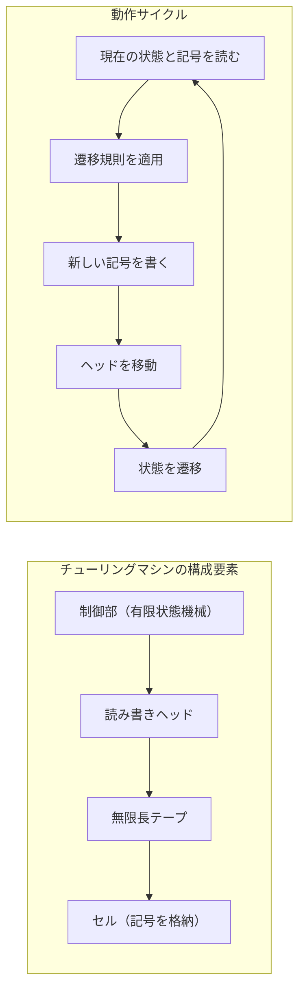
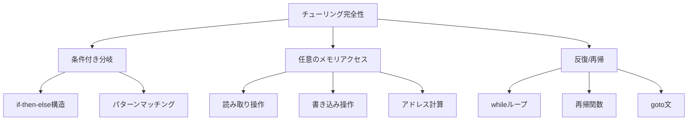
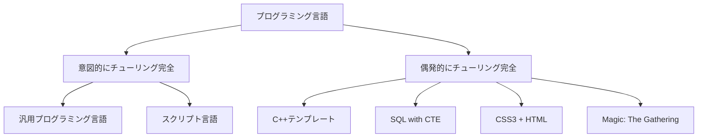
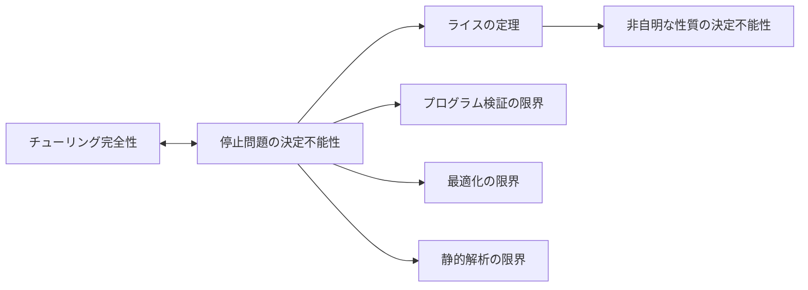
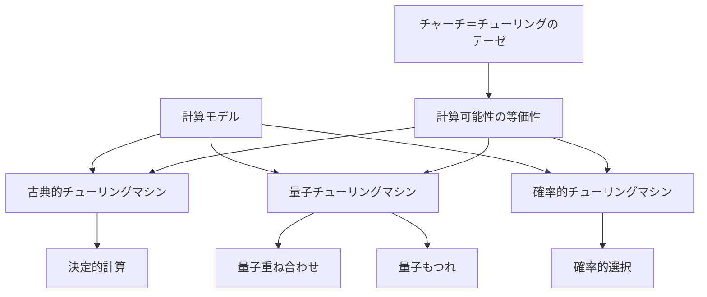

# チューリング完全性

チューリング完全性（Turing completeness）は、計算機科学における最も基礎的かつ重要な概念の一つであり、ある計算システムがチューリングマシンと同等の計算能力を持つことを示す性質である。この概念は1936年にアラン・チューリングが提唱したチューリングマシンの理論に基づいており[^1]、現代のプログラミング言語やコンピュータアーキテクチャの設計における基準となっている。

計算理論において、チューリング完全なシステムは理論上あらゆる計算可能な問題を解くことができる。この性質は、システムが持つべき最小限の計算能力を定義すると同時に、計算可能性の限界も明確にする。つまり、チューリング完全なシステムで解けない問題は、原理的に計算不可能であることを意味する。

## チューリングマシンの本質

チューリングマシンは、無限長のテープ、有限個の状態を持つ制御部、そしてテープ上を移動しながら読み書きを行うヘッドから構成される抽象的な計算モデルである。この単純な構成にもかかわらず、チューリングマシンは驚くべき表現力を持つ。



チューリングマシンの動作は、現在の状態と読み取った記号の組み合わせに基づいて決定される。遷移関数δは以下のように定義される：

δ: Q × Γ → Q × Γ × {L, R, N}

ここで、Qは状態の有限集合、Γはテープ記号の有限集合、{L, R, N}はそれぞれ左移動、右移動、移動なしを表す。この遷移関数により、チューリングマシンは決定的に動作する。

重要な点は、この単純なモデルが持つ計算能力の普遍性である。チューリングは、このモデルが人間が紙と鉛筆で行うあらゆる計算を模倣できることを示した。これは計算の本質を捉えた画期的な洞察であった。

## チューリング完全性の形式的定義

あるシステムSがチューリング完全であるとは、任意のチューリングマシンMに対して、Mと同じ計算を行うSのプログラムPが存在することである。より形式的には、以下の条件を満たす必要がある：

1. **条件付き分岐**: プログラムの実行フローを条件に基づいて変更できる能力
2. **任意のメモリアクセス**: データの読み書きが可能な無制限のメモリ領域
3. **反復または再帰**: 計算を繰り返し実行できる機構

これらの要素は相互に関連しており、一つでも欠けるとチューリング完全性は失われる。例えば、有限オートマトンは任意のメモリアクセスができないため、チューリング完全ではない。同様に、原始再帰関数は無限ループを表現できないため、チューリング完全ではない。



## 計算等価性とチャーチ＝チューリングのテーゼ

チューリング完全性の概念は、チャーチ＝チューリングのテーゼと密接に関連している[^2]。このテーゼは、「効果的に計算可能な関数は、チューリングマシンで計算可能な関数と一致する」という主張である。これは数学的に証明可能な定理ではなく、計算可能性の本質に関する仮説である。

興味深いことに、チューリングマシン以外にも多くの計算モデルが提案されているが、それらはすべてチューリングマシンと同等の計算能力を持つことが示されている：

- **ラムダ計算**: アロンゾ・チャーチによって考案された関数型計算モデル
- **帰納的関数**: クルト・ゲーデルらによって研究された数論的アプローチ
- **レジスタマシン**: より現実的なコンピュータに近いモデル
- **セルオートマトン**: ジョン・フォン・ノイマンらが研究した並列計算モデル

これらの計算モデルがすべて同じ計算能力を持つという事実は、計算可能性の概念が本質的に一意であることを示唆している。

## プログラミング言語におけるチューリング完全性

現代のプログラミング言語の多くはチューリング完全である。しかし、チューリング完全性を達成するために必要な言語機能は驚くほど少ない。例えば、以下の最小限の機能セットでチューリング完全性を実現できる：

```python
# 最小限のチューリング完全な言語の例
# 1. 変数への代入
x = 0

# 2. 条件分岐
if x == 0:
    x = 1

# 3. 無限ループ
while True:
    x = x + 1
```

この単純さは、意図しないチューリング完全性をもたらすことがある。例えば、C++のテンプレートメタプログラミング、SQLのCTE（Common Table Expressions）、さらにはPowerPointのアニメーション機能でさえ、適切に組み合わせればチューリング完全になる[^3]。



## 実装における制約と現実性

理論的なチューリング完全性と実際の実装には重要な違いがある。チューリングマシンは無限のメモリを仮定するが、現実のコンピュータは有限のリソースしか持たない。この違いは、以下のような実践的な影響をもたらす：

**メモリの有限性**: 現実のシステムでは、メモリ不足によってプログラムが停止する可能性がある。これは理論的なチューリング完全性では考慮されない制約である。

**時間計算量**: チューリング完全性は計算可能性のみを保証し、効率性については何も述べない。理論的に計算可能でも、宇宙の年齢を超える時間が必要な問題は実質的に解けない。

**入出力の扱い**: 純粋なチューリングマシンは閉じたシステムであり、外部との相互作用を考慮しない。現実のプログラムは入出力なしには意味を持たない。

これらの制約にもかかわらず、チューリング完全性は依然として重要な概念である。それは、システムの計算能力の理論的上限を定義し、異なるシステム間の比較基準を提供するからである。

## 停止問題とその含意

チューリング完全性と不可分の関係にあるのが停止問題である[^4]。停止問題は、「任意のプログラムPと入力Iに対して、PがIで停止するかどうかを判定するアルゴリズムは存在しない」という定理である。

この定理の証明は対角化論法を用いる。仮に停止判定器Hが存在すると仮定し、以下のプログラムDを構築する：

```
D(P):
    if H(P, P) == "停止する":
        無限ループ
    else:
        停止
```

D(D)の動作を考えると矛盾が生じる。もしD(D)が停止するなら、Hの判定により無限ループに入るはずであり、逆もまた真である。この矛盾により、停止判定器Hは存在しない。

停止問題の決定不能性は、チューリング完全なシステムの本質的な性質である。実際、あるシステムで停止問題が決定可能であれば、そのシステムはチューリング完全ではない。これは以下のような実践的な含意を持つ：

- **プログラム検証の限界**: すべてのプログラムの正当性を自動的に証明することは不可能
- **最適化の限界**: コンパイラは一般的にプログラムの最適な変換を見つけることができない
- **静的解析の限界**: 到達不能コードの完全な検出は不可能



## 部分的チューリング完全性と制限された計算モデル

すべての計算システムがチューリング完全である必要はない。実際、多くの実用的なシステムは意図的にチューリング完全性を避けている。これには以下のような利点がある：

**決定可能性の保証**: 正規表現や有限オートマトンのような制限されたモデルでは、等価性判定や空集合判定が可能である。

**性能保証**: 原始再帰的な言語では、プログラムの実行時間の上限を静的に決定できる。

**安全性**: 無限ループの可能性を排除することで、システムの堅牢性を向上させる。

例えば、データベースクエリ言語の多くは意図的にチューリング完全性を制限している。標準的なSQLは再帰CTEを除けばチューリング完全ではない。これにより、クエリの終了性と最適化可能性が保証される。

同様に、設定ファイルフォーマットやテンプレート言語も、表現力を犠牲にして決定可能性と安全性を確保している。これらのトレードオフは、システム設計における重要な選択である。

## 量子計算とチューリング完全性

量子コンピュータの登場により、チューリング完全性の概念も拡張されている。量子チューリングマシンは、古典的なチューリングマシンの量子力学的一般化である[^5]。

量子計算の特徴は、重ね合わせと量子もつれにより、指数的に多くの計算経路を同時に探索できることである。しかし、チャーチ＝チューリングのテーゼの強い版によれば、量子コンピュータも古典的なチューリングマシンで効率的にシミュレート可能である（ただし指数的な時間がかかる可能性がある）。



量子計算の研究は、計算可能性と計算効率性の区別をより明確にした。BQP（量子多項式時間で解ける問題のクラス）とBPP（確率的多項式時間で解ける問題のクラス）の関係は、現代計算理論の中心的な未解決問題の一つである。

## 型システムとチューリング完全性

型システムの表現力とチューリング完全性の間には興味深い関係がある。多くの高度な型システムは、それ自体がチューリング完全な計算能力を持つ。

例えば、Haskellの型レベル計算やScalaの型システムは、型チェック時にチューリング完全な計算を実行できる。これは強力な抽象化を可能にする一方で、型チェックの停止性を保証できないという問題をもたらす。

```haskell
-- 型レベルでの自然数の定義
data Zero
data Succ n

-- 型レベルでの加算
type family Add a b where
    Add Zero b = b
    Add (Succ a) b = Succ (Add a b)
```

対照的に、System FやMLの型システムは意図的に表現力を制限し、型推論の決定可能性を保証している。この設計選択は、実用性と理論的純粋性のバランスを反映している。

## ハードウェアレベルでのチューリング完全性

現代のプロセッサアーキテクチャは、チューリング完全性を実現するために必要な最小限の機能を大きく超えている。しかし、教育的観点から、最小限の命令セットでチューリング完全性を実現する試みは続いている。

例えば、単一命令セットコンピュータ（OISC）は、たった一つの命令でチューリング完全性を実現する。Subleq（Subtract and Branch if Less than or Equal to zero）命令は、その典型例である：

```
subleq a, b, c  // mem[b] = mem[b] - mem[a]; if (mem[b] <= 0) goto c
```

この単一命令だけで、任意の計算が可能であることは驚くべき事実である。これは、計算の本質が極めて単純な操作の組み合わせに還元できることを示している。

## チューリング完全性の限界と拡張

チューリング完全性は計算可能性の標準的な定義を提供するが、いくつかの限界も持つ。特に、以下の側面は古典的なチューリング完全性では捉えきれない：

**相互作用的計算**: 現代のシステムは環境との継続的な相互作用を前提とする。Webサーバーやオペレーティングシステムは、純粋な入力-出力モデルでは記述できない。

**並行性と分散性**: 複数の計算主体が協調して動作するシステムは、単一のチューリングマシンでは自然に表現できない。

**リアルタイム制約**: 時間制約を持つシステムは、計算の正しさだけでなくタイミングも重要である。

これらの拡張は、πカルキュラスやアクターモデルなどの新しい計算モデルの開発につながっている。これらのモデルは、チューリング完全性を保ちながら、現代的な計算パラダイムをより自然に表現する。

チューリング完全性は、計算理論の基礎として今後も重要な概念であり続けるだろう。同時に、新しい計算パラダイムの出現により、この概念自体も進化し続けている。量子計算、並行計算、相互作用的計算などの発展は、計算可能性の理解をより豊かにし、チューリングが築いた基礎の上に新たな理論体系を構築している。

[^1]: Turing, A. M. (1936). "On Computable Numbers, with an Application to the Entscheidungsproblem". Proceedings of the London Mathematical Society. 2 (42): 230–265.

[^2]: Church, A. (1936). "An Unsolvable Problem of Elementary Number Theory". American Journal of Mathematics. 58 (2): 345–363.

[^3]: Kaye, R. (2007). "Minesweeper is NP-complete". Mathematical Intelligencer. 22 (2): 9–15.

[^4]: Turing, A. M. (1937). "On Computable Numbers, with an Application to the Entscheidungsproblem. A Correction". Proceedings of the London Mathematical Society. 2 (43): 544–546.

[^5]: Deutsch, D. (1985). "Quantum theory, the Church-Turing principle and the universal quantum computer". Proceedings of the Royal Society of London A. 400 (1818): 97–117.