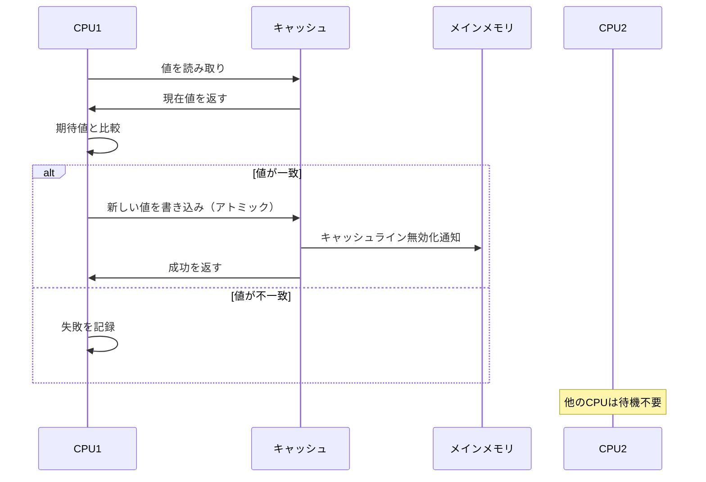
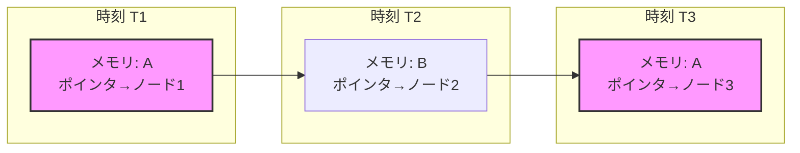
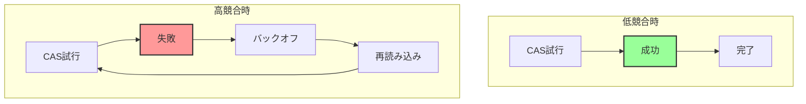

# Compare-and-Swap

Compare-and-Swap（CAS）は、並行プログラミングにおける最も基本的かつ重要なアトミック操作の一つである。この操作は、メモリ位置の値を原子的に比較し、期待値と一致した場合のみ新しい値で置き換える。現代のマルチコアプロセッサにおいて、CASはロックフリーアルゴリズムの基礎となり、高性能な並行データ構造の実装を可能にしている。

CASの本質は、読み取り・比較・書き込みという一連の操作を単一の不可分な操作として実行することにある。この原子性により、複数のスレッドが同時に同じメモリ位置を更新しようとしても、データの整合性が保たれる。従来のミューテックスベースの同期機構と比較して、CASはブロッキングを回避し、より細粒度の同期を実現する。

## アトミック性とハードウェアサポート

CAS操作のアトミック性は、ハードウェアレベルで保証される必要がある。現代のプロセッサアーキテクチャでは、専用の命令セットを通じてこの機能を提供している。



x86アーキテクチャでは、CMPXCHG（Compare and Exchange）命令がCAS操作を実装している。この命令は、LOCKプレフィックスと組み合わせることで、マルチプロセッサ環境でのアトミック性を保証する[^1]。ARMアーキテクチャでは、Load-Link/Store-Conditional（LL/SC）命令ペアを使用して同様の機能を実現している。

[^1]: Intel® 64 and IA-32 Architectures Software Developer's Manual, Volume 2A, CMPXCHG—Compare and Exchange

プロセッサは、CAS操作の実行中にキャッシュラインの排他的所有権を獲得する。これにより、他のプロセッサからの同時アクセスを防ぎ、操作の原子性を保証する。この仕組みは、MESIプロトコルなどのキャッシュコヒーレンシプロトコルと密接に連携している。

## メモリ順序とバリア

CAS操作は、単にアトミックであるだけでなく、メモリ順序の保証も提供する必要がある。C++11のメモリモデルでは、CAS操作に対して異なるメモリ順序を指定できる[^2]。

[^2]: ISO/IEC 14882:2011, 29.3 Atomic operations library

メモリ順序の選択は、パフォーマンスと正確性のトレードオフを決定する重要な要素である。最も強い保証であるmemory_order_seq_cstは、全順序を保証するが、パフォーマンスのオーバーヘッドが大きい。一方、memory_order_relaxedは最小限の保証しか提供しないが、最高のパフォーマンスを実現する。

```cpp
// Memory ordering example
std::atomic<int> counter;
int expected = 0;
int desired = 1;

// Sequential consistency (default)
counter.compare_exchange_strong(expected, desired);

// Acquire-release semantics
counter.compare_exchange_strong(expected, desired, 
                               std::memory_order_acq_rel);

// Relaxed ordering
counter.compare_exchange_strong(expected, desired,
                               std::memory_order_relaxed,
                               std::memory_order_relaxed);
```

acquire-releaseセマンティクスは、多くの実用的なシナリオで適切なバランスを提供する。CAS操作が成功した場合、それ以前のすべての書き込みが他のスレッドから可視になることを保証し、同時に他のスレッドの以前の書き込みも可視になる。

## ABA問題

CAS操作の最も顕著な制限の一つがABA問題である。この問題は、値がAからBに変更され、その後再びAに戻った場合に発生する。CAS操作は値がAのままであると誤認し、その間に発生した変更を検出できない。



ABA問題は、特にポインタを扱う場合に深刻な影響を与える可能性がある。例えば、ロックフリーのスタック実装では、ポップ操作中にノードが解放され、同じアドレスに新しいノードが割り当てられる可能性がある。

この問題に対する一般的な解決策は、ポインタとカウンタのペアを使用することである。多くのアーキテクチャでは、ダブルワードCAS（DCAS）操作を提供しており、128ビットの値を原子的に更新できる。

```cpp
struct TaggedPointer {
    void* ptr;
    uint64_t tag;
};

// Double-word CAS using 128-bit atomic
std::atomic<TaggedPointer> head;
```

タグ付きポインタアプローチでは、ポインタの更新ごとにタグをインクリメントすることで、ABA問題を回避する。タグのビット幅が十分であれば、実用上、同じタグ値が再利用される可能性は無視できる。

## ロックフリーデータ構造への応用

CAS操作は、ロックフリーデータ構造の実装において中心的な役割を果たす。最も単純な例として、ロックフリーカウンタの実装を考える。

```cpp
class LockFreeCounter {
    std::atomic<int> value{0};
    
public:
    void increment() {
        int current = value.load();
        while (!value.compare_exchange_weak(current, current + 1)) {
            // current is updated with the actual value
        }
    }
    
    int get() const {
        return value.load();
    }
};
```

このカウンタ実装では、CAS操作が失敗した場合、currentが自動的に最新の値で更新され、再試行される。compare_exchange_weakを使用することで、スプリアスな失敗を許容し、パフォーマンスを向上させている。

より複雑な例として、Treiber stackは、CASを使用したロックフリースタックの古典的な実装である[^3]。

[^3]: R. Kent Treiber. Systems Programming: Coping with Parallelism. Technical Report RJ 5118, IBM Almaden Research Center, 1986.

```cpp
template<typename T>
class TreiberStack {
    struct Node {
        T data;
        Node* next;
    };
    
    std::atomic<Node*> head{nullptr};
    
public:
    void push(T data) {
        Node* new_node = new Node{std::move(data), nullptr};
        Node* current_head = head.load();
        
        do {
            new_node->next = current_head;
        } while (!head.compare_exchange_weak(current_head, new_node));
    }
    
    std::optional<T> pop() {
        Node* current_head = head.load();
        
        while (current_head && 
               !head.compare_exchange_weak(current_head, current_head->next)) {
            // Retry with updated current_head
        }
        
        if (current_head) {
            T data = std::move(current_head->data);
            delete current_head;  // Simplified - real implementation needs hazard pointers
            return data;
        }
        return std::nullopt;
    }
};
```

この実装は概念的にシンプルだが、実際の使用にはメモリ管理の問題がある。削除されたノードへの参照を他のスレッドが保持している可能性があるため、Hazard PointersやEpoch-Based Reclamationなどの技術が必要となる。

## 性能特性とトレードオフ

CAS操作の性能は、競合の程度に大きく依存する。低競合環境では、CASベースのアルゴリズムは従来のロックベースのアプローチを大幅に上回る性能を示す。しかし、高競合環境では、CASの再試行によるオーバーヘッドが問題となる可能性がある。



競合が激しい場合、exponential backoffなどの戦略を使用して、再試行の頻度を調整することが重要である。また、CASの失敗率が高い場合は、より粗粒度の同期機構への切り替えを検討する必要がある。

CASベースのアルゴリズムのもう一つの重要な特性は、進行保証である。多くのCASベースのアルゴリズムは、lock-freedomを提供する。これは、システム全体として常に何らかの進行が保証されることを意味する。しかし、個々のスレッドの進行は保証されない（starvationの可能性がある）。

wait-freedomを達成するには、より複雑なアルゴリズムが必要となり、通常は性能とのトレードオフが発生する。実用的なシステムでは、lock-freedomで十分な場合が多い。

## ハードウェアトランザクショナルメモリとの関係

近年のプロセッサでは、Hardware Transactional Memory（HTM）のサポートが追加されている。IntelのTSX（Transactional Synchronization Extensions）やARMのTME（Transactional Memory Extension）がその例である。HTMは、CASよりも大きな粒度でのアトミック操作を可能にする。

HTMとCASは補完的な関係にある。HTMトランザクションが失敗した場合のフォールバックパスとして、CASベースの実装を使用することが一般的である。この hybrid approachにより、最良の場合にはHTMの利点を活用しつつ、最悪の場合でもCASベースの進行保証を維持できる。

## 実装上の考慮事項

CASを使用する際には、いくつかの実装上の注意点がある。まず、false sharingの問題を避けるため、CAS対象の変数は独立したキャッシュラインに配置することが重要である。C++では、std::hardware_destructive_interference_sizeを使用して適切なアライメントを確保できる。

```cpp
struct alignas(std::hardware_destructive_interference_size) AlignedAtomic {
    std::atomic<uint64_t> value;
};
```

また、CAS操作のコストは、アーキテクチャによって大きく異なる。x86では比較的低コストだが、一部のRISCアーキテクチャでは、LL/SC命令の制約により、より高いオーバーヘッドが発生する可能性がある。

コンパイラの最適化も重要な考慮事項である。インライン展開やループアンローリングなどの最適化が、CASループの性能に大きな影響を与える可能性がある。適切なコンパイラフラグの選択と、パフォーマンスプロファイリングによる検証が不可欠である。

CAS操作は、現代の並行プログラミングにおいて不可欠な要素である。その単純さと強力さにより、高性能な並行アルゴリズムの基礎となっている。しかし、ABA問題や高競合時の性能劣化など、注意すべき制限も存在する。これらの特性を理解し、適切に活用することが、効率的な並行システムの構築には欠かせない。